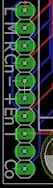

[#CoinDoorBoardPlans]
= Coin Door Interface Board

In the xref:coinDoor.adoc#coinDoor[Coin Door] chapter, we discuss the special wiring plug that the Williams WPC coin door uses.
That plug is wired to all the switches and lamps in the coin door: the coin chute switches that detect when you've inserted a quarter, the slam tilt switch, the service control panel buttons, and the coin slot lamps.

In a virtual cab, we have to connect that special coin door plug to the key encoder, so that the buttons and switches in the coin door can be used as inputs to the virtual pinball software.
We also have to connect it to a power supply, to light up the coin slot lamps.

In the original pinball machines, the coin door connector plugged into a little circuit board located near the front of the cabinet, whose job was simply to interface the coin door plug to the rest of the wiring in the machine.
The tidiest approach in a virtual cab is to do the same thing, by installing a little interface board of our own that plugs into the coin door connector on one end, and connects to your key encoder on the other end.

I drew up plans for a circuit board to accomplish this.
It's a simple design that you build yourself.
This section has download links, parts lists, and instructions for assembling and installing it.

== 6.3V Power Supply

The Williams coin doors usually come equipped with #555 incandescent bulbs installed in the coin slots, to light up the slots.
Those bulbs require an unusual voltage level, 6.3V.
You probably don't have a 6.3V power supply in your pin cab, unless you installed one specifically for these sorts of lamps.

To help with this, I included a 6.3V power regulator in the circuit board design.
If you build the full board design, you'll get the 6.3V supply automatically; you just have to plug in power from a 12V supply (which you probably do already have, since it's one of the voltage levels that you get from an ordinary ATX PC power supply).

However, the 6.3V regulator is optional.
You can simply omit all the parts for it (leaving their slots on the circuit board empty).
If you do this, you can still get the lamps to light up by using one of these options:

* Power the lamps with 5V.
#555 incandescent bulbs will work on 5V; they just won't be as bright as they're meant to be.
If you don't mind that they're not as bright, this is easy, and you can skip buying a few parts.
* Use 5V as above, but also replace the incandescent #555 bulbs with LED equivalents.
You can buy plug-compatible #555 LED bulbs, and most of those will work on 5V (even though they'll nominally be 6.3V bulbs, since they're meant to be plug-in replacements for the incandescent bulbs).
LEDs don't usually show as much drop in brightness as incandescents at lower voltages; if they light up at all, they should appear to be pretty much normal brightness.
* Power the lamps with a separate 6.3V power supply.
If you already have a 6.3V supply, you can plug it in to the board and the board will pass it through to the lamps.
One easy way to set up a 6.3V power supply is to buy an adjustable DC-to-DC step-down regulator board on eBay, and set it to 6.3V.
If you're not fond of soldering, you might prefer this to soldering the extra parts for the on-board 6.3V regulator on the coin door interface board.

== Version 2

This is a new version of the board that I drew up in February, 2021.
I had to come up with this new design because the 6.3V regulator chip used in the original version 1 design is no longer in production.
The old design is still available, of course; see xref:#CoinDoorBoardVersion1[Version 1] below.
Feel free to use the old design if you prefer it, but just be aware that you might not be able to find the 6.3V regulator chip it calls for.

WARNING: This new version hasn't been tested yet.
If you'd like to try building one and let me know how it works, that would be very helpful! Just be aware that it might have design flaws that I haven't caught yet.
If you're not feeling so adventurous, you might want to stick with the version 1 design.

*EAGLE plans:*  link:http://mjrnet.org/pinscape/downloads/WilliamsCoinDoorConnector-v2.zip[mjrnet.org/pinscape/downloads/WilliamsCoinDoorConnector-v2.zip]

*Parts list:* See xref:partslist.adoc#WilliamsCoinDoorConnectorV2PartsList[Electronic Parts List] .

=== Screw Terminals or Pin Headers
The parts list calls for Phoenix Contact screw terminals for JP1 and JP2, which are the places where you connect the wiring that goes out to your key encoder and power supply.
I used the screw terminals in the design because many pin cab builders like the simplicity of wiring them.
With screw terminals, you just strip a quarter inch or so from the end of the wire, insert the end of the wire into the terminal, and tighten the screw to clamp it in place.
No special tools are required.

The parts list links to Phoenix Contact parts on Mouser.com for the screw terminals, but you can also find cheaper generic versions here: link:https://www.pololu.com/category/177/0.1-2.54-mm-screw-terminal-blocks[www.pololu.com/category/177/0.1-2.54-mm-screw-terminal-blocks] .

If you prefer, you can use standard 0.1" straight pin headers in place of the screw terminals.
I personally prefer pin headers in most cases, because they mate with pluggable connectors that can be easily plugged and unplugged.
With screw terminals, you have to attach each wire separately, which is time-consuming if you have to remove the whole board for any reason.
The Phoenix Contact terminals and the standard 0.1" pin headers will both fit physically, so you can use whichever type of connector you prefer.
See xref:pinHeaders.adoc#pinHeaders[0.1" Pin Headers] for more about those connectors.

If you do opt for 0.1" pin headers, be aware that JP1 can accommodate a 10-pin header, even though the parts list calls for a 9-position screw terminal.
I intentionally added drilling for an extra "dummy" pin, so that you can use a 10-pin header.
The extra 10th pin isn't connected to anything electrically on the board; it's just there so that a 10-pin header will fit.
The reason you might want to use a 10-pin header instead of a 9-pin is that it's hard to find the mating "crimp pin housing" in a 9-pin size, whereas it's easy to find 10-pin housings.

*To manufacturer the board:* simply upload the .brd file from the plans above to link:https://www.oshpark.com/[OSH Park] , or a different PCB maker or your choice.
(Other PCB makers usually require Gerber files rather than .brd files.
You can create those with the free version of EAGLE.)

*To build the board _with_ the 6.3V regulator:* Solder all the listed parts to the board.

*To build the board _without_ the 6.3V regulator:* Don't install any of the voltage regulator parts (C1, C2, IC1, R1, R2).
Install only the pin headers and screw terminals.

*Connections:* Once you've built the board, mount it near the coin the door where you can plug in the connector from the door.
Connect power for the coin chute lamps as described above (use a 12V power supply input if you included the voltage regulator parts, or a 5V or 6.3V supply if you didn't).
Plug the 13-pin connector from the coin door into the mating pin header on the board.

The terminals on JP1 all connect to your key encoder, to allow the switches in the coin door to send button input signals to the virtual pinball software on the PC.

The switch outputs on the board are labeled as follows:

`L`:: Left coin switch
`M`:: Middle coin switch (not used on US two-chute coin doors)
`R`:: Right coin switch
`Cn`:: Service Cancel/Escape
`-`:: Service Down/-
`+`:: Service Up/+
`En`:: Service Enter/Select
`T`:: Slam tilt switch
`Co`:: All-switch common wire

The terminals on JP2 connect to power for the coin slot lamps.
There are several ways to connect these terminals, depending on (a) whether or not you installed the 6.3V regulator parts, and (b) whether you want the coin slot lamps to be on all the time or controlled by software on the PC (via xref:DOF.adoc#dofSetup[DOF] ).
Here are the instructions for each combination:

With 6.3V regulator, lamps always ON::
* +LAMP not connected, *or* you can use +LAMP as a 6.3V power source for up to four additional #555 bulbs
* LAMP- to 12V power supply (-) terminal (0V/GND, black wire on ATX disk plugs)
* -12V same as LAMP-
* 12V\+ to 12V power supply (\+) terminal (yellow wire on ATX disk plugs)

With 6.3V regulator, lamps controlled by DOF::
* +LAMP not connected, *or* you can use +LAMP as a 6.3V power source for up to four additional #555 bulbs
* LAMP- to feedback controller output port (LedWiz, Pinscape, etc) assigned to coin slot lamps
* -12V same as LAMP-
* 12V\+ to 12V power supply (\+) terminal (yellow wire on ATX disk plugs)

No 6.3V regulator, lamps always ON::
* \+LAMP to your 5V or 6.3V power supply (\+) terminal (red wire on ATX disk plugs)
* LAMP- to your 5V or 6.3V power supply (-) terminal (0V/GND, black wire on ATX disk plugs)
* -12V not connected
* 12V+ not connected

No 6.3V regulator, lamps controlled by DOF::
* +LAMP to your 5V or 6.3V power supply (\+) terminal (red wire on ATX disk plugs)
* LAMP- to feedback controller output port (LedWiz, Pinscape, etc) assigned to coin slot lamps
* -12V not connected
* 12V+ not connected

If you didn't build the 6.3V regulator, you can use either a 5V or 6.3V power supply to power the coin slot lamps.
6.3V is preferable since that's the voltage the bulbs are designed for; they'll work at 5V but won't be as bright.
LED replacement bulbs might let you use 5V without loss of brightness, so you might want to try that if you don't want to bother with adding a separate 6.3V supply.

If you're using DOF to control the lamps, make sure that the output controller port that you're using to control the lamps has enough power load capacity.
Two incandescent #555 bulbs will consume about 500mA.
That's safe for any Pinscape flasher port or power board port, and it's right at the limit for an LedWiz port.
(So it might work with an LedWiz, but you'll be pushing your luck a bit; a booster circuit in this case would be a good idea.
See the xref:ledwiz.adoc#ledwizSetup[LedWiz] chapter for help on adding booster circuits.) If you replaced the bulbs with LEDs, they'll use much less power, probably about 30mA per bulb at most, which makes them safe to use with an LedWiz directly, with no booster.

[#CoinDoorBoardVersion1]
== Version 1

This section covers my original version of the board.
If you plan to use the on-board 6.3V power supply feature, you might want to consider building the new design above instead, because the voltage regulator chip that this design uses is out of production and hard to find.
The new design uses a newer chip that's still available.

*EAGLE plans:*  link:http://mjrnet.org/pinscape/downloads/WilliamsCoinDoorConnector.zip[mjrnet.org/pinscape/downloads/WilliamsCoinDoorConnector.zip]

*Parts list:* See xref:partslist.adoc#WilliamsCoinDoorConnectorPartsList[Electronic Parts List] .

If you don't want to include the on-board 6.3V power supply feature, you can omit the parts C1, C11, Q1, and JP11.
Simply leave the slots for those parts on the board empty.
If you already have a separate 6.3V supply, you can omit all these and instead supply the board with 6.3V from the external supply.

WARNING: the regulator chip Q1 is no longer in production, and the electronics vendors no longer sell it.
It might still be possible to find surplus parts on eBay, although that can be spotty in terms of quality.
Unfortunately, I don't know of any suitable substitute for the chip that will work with this board design.
That's the whole reason I designed the new version 2 board above; there _are_ other chips that will do the job, but they all require slightly different circuit designs, so I had to change the board layout a bit.

=== To manufacturer the board
Simply upload the .brd file from the plans above to link:https://www.oshpark.com/[OSH Park] , or a different PCB maker or your choice.
(Other PCB makers usually require Gerber files rather than .brd files.
You can create those with the free version of EAGLE.)

=== To build the board _with_ the 6.3V regulator
Solder all the listed parts to the board.
Connect 12V from your secondary ATX power supply (the one you use for feedback devices: see xref:powerSupplies.adoc#powerSupplies[Power Supplies for Feedback] ) to the two-pin header labeled "12V IN".
You can use the two-pin header marked *6.3V* as a power supply for other 6.3V button lamps, as long as you don't exceed 1.5A, or a total of 6 incandescent #555 bulbs (including the ones in the coin chutes).

=== To build it _without_ the 6.3V regulator
Don't install any of the voltage regulator parts (C1, C11, Q1, or the 12V input pin header).

Install only the main 13-pin header, the 10-pin header for the switch outputs, and the 2-pin header marked *6.3V* .
Connect the 6.3V header on the board to your external 6.3V power supply; this will feed the 6.3V directly to the coin chute lamps.

Once you've built the board, mount it near the coin the door where you can plug in the connector from the door.
Plug in the power connection for the coin chute lamps (the 12V input if you included the voltage regulator, or the 6.3V input if you didn't).
Plug in the 13-pin connector from the coin door.

To wire the switches to your key encoder, you can either solder wires directly to the pin holes for the switch outputs, or (better) you can install a 10-pin header and connect a mating 1x10-pin plug.
See xref:connectors.adoc#connectors[Connectors] for details on building the plug using a 0.1" crimp pin 1x10 position housing.

The switch outputs on the board are labeled as follows:

`L`:: Left coin switch
`M`:: Middle coin switch (not used on US two-chute coin doors)
`R`:: Right coin switch
`Cn`:: Service Cancel/Escape
`-`:: Service Down/-
`+`:: Service Up/+
`En`:: Service Enter/Select
`T`:: Slam tilt switch
`Co`:: All-switch common wire

Note that the pin between `T` and `Co` isn't connected to anything on the board.
9-pin housings aren't readily available, so I added an extra unused pin to make it easier to find the matching connector.

