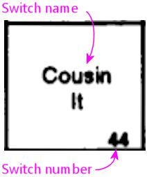
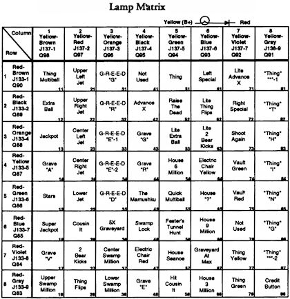

= Customizing a table's DOF effects

This section covers the gnarly details of DOF and VPinMAME that you need to know if you want to customize a table's DOF effects. This is useful if:

* You have unique feedback devices in your cabinet that most tables don't know about, and you want to trigger them on certain game events in certain tables
* You want to add some new DOF effects to an existing table
* You want to extra DOF effects to an existing table that doesn't already have any DOF support
* You're creating your own VP tables from scratch, and you want them to support DOF feedback effects

To make use of the information in this section, you also have to understand how DOF effects work. That's described in the previous appendix, xref:dofEventCodes.adoc[DOF Event Codes] . That section explains how to create the effects you want for a given event; this section is about how to identify those source events in a given game.

*Advanced topic warning!* You don't need to know any of this to use DOF with the standard configuration settings. The details are rather complex and ugly. If you're setting up your cabinet for the first time, I'd recommend filing a mental note that this section is here and skipping ahead. You can always come back to it later.

== How to add a new table to the DOF config tool

If you're creating your own original table, or a re-creation of a real table that no one has implemented in VP before, you'll want an entry for the table in your DOF config files. And assuming you're generating your files with the link:https://configtool.vpuniverse.com/[DOF config tool] , that means adding an entry to the online database.

So how do you add a new table to the online database? Well, you can't - not directly, at least. There's no provision for users to add new tables, even private ones. Only the site administrators can do that. Fortunately, said administrators' attitude is that every table under the sun should be included in the master list, and they've always been quick to respond when I've suggested missing tables. So the way to get a new table added is to request it from the site admins. The best way I've found to reach them is to post the request to the following forum on link:https://vpuniverse.com/forums/forums.html[VPUniverse] : Digital Pinball Cabinets > Direct Output Framework > Direct Output Support.

== How to customize an existing table

If the table you want to customize is already in the DOF Config Tool's online database, it's easy to add your own customizations:

* Open the link:https://configtool.vpuniverse.com/[DOF Config Tool] in your browser
* Click the Table Configs tab
* Select the table you want to customize from the drop list at the top
* The left column shows the "Public Configuration", which is the default effects defined in the DOF database
* The right column shows the "Candidate Configuration", which is where you make your custom changes. By default, those boxes are all set to copies of the public config. You can change any effects you want to by typing your own effects codes into the boxes on the right side.
* The effects codes are entered per device. The way you have to think about it is "I want the shaker motor to run when (some game event) occurs". To make that happen, you find "Shaker" in the list of devices, and you enter the event codes representing the triggering game event in the Candidate Configuration box on the right side next to Shaker.
* The DOF trigger codes are extremely cryptic, but we've tried to provide a full accounting of them in xref:dofEventCodes.adoc[DOF Event Codes] . Read that section to figure out what to enter in the box.
* After you've made your changes, click Save Changes at the bottom
* Click Generate Config at the bottom to download the new DOF .ini files; when they finish downloading, extract them into your DOF install folder, replacing the existing files
* You'll have to exit completely out of VP or any other programs before testing the updates (exit out of the whole program, not just "Play" mode)

=== Example: Disable the flipper solenoid effects in PinballX or PinballY

Here's a quick example of how to use the customization procedure to accomplish a request I've seen several times on the forums: "I want to get rid of the flipper solenoid effects in my front end program, but I want to keep the flasher effects. How do I disable just the flipper effects?"

PinballX and PinballY both accomplish their DOF effects using the normal DOF configuration, by pretending that they're pinball tables named "PinballX" and "PinballY" (respectively). This means that you can customize the DOF effects for the front-end programs as though they were pinball tables, using the same techniques described in the rest of this section. This is a particularly easy special case, though, since all we have to do is delete the flipper solenoid triggers. So let's walk through the step-by-step procedure:

* Open the link:https://configtool.vpuniverse.com/[DOF config tool] in your browser
* Log in
* Click the *Table Configs* tab in the top navigation bar
* In the *Table Name* drop list, select your preferred front-end program ( *PinballX* or *PinballY* )
* Find the *Flipper Left* and *Flipper Right* rows in the list of toys. These rows specify the program events that will cause these solenoids to fire while you're running the front-end program.
* In the right column of each row, simply delete all of the text in the edit box, so that the box is complete empty. This removes all of the events that would cause the flipper solenoids to fire while you're running the front-end program, which will have the effect is disabling the solenoid effects entirely. (The changes we're making here will *only* affect the table that we selected in the *Table Name* drop list earlier - in this case, your front-end program. They won't affect or disable the solenoid effects in any other games.)
* At the bottom of the page, click *Save Changes*
* At the bottom of the page, click *Generate Config* , and wait for the browser to download the ZIP file containing your new configuration files
* Unzip the *.ini* files in the downloaded ZIP, and use them to replace the old ones in the *Config* folder within your DOF install folder

You can use this same procedure to add your own custom DOF effects to the front-end programs. Disabling the flippers is just a really easy special case, because all you have to do is delete the DOF instructions that activate the solenoids.

== EM (Electro-Mechanical) games

If the table you're customizing is from the 1970s or earlier, and used mechanical score reels instead of software, its handling in DOF is completely tied to the Visual Basic script for the game.

EM machines didn't have any software, so VPinMAME isn't involved. The table script (written in Visual Basic, assuming we're talking about VP) contains all of the game's logic, including all of the scoring rules and sound effects. And including DOF effects. DOF keys everything in these games to "event codes" written into the Visual Basic scripts.

If you look at one of those tables in the DOF database, you'll see that everything is keyed to "E" codes - E17, E93, etc. Those "E" codes correspond to explicit DOF calls in the Visual Basic script for the table. They usually take one of these forms:

Controller.B2SSetData 11,1 DOF 118,1

To customize DOF events for an EM table, then, you need look no further than the table script:

* Launch VP
* Open the table in the editor
* On the menu, select *Table* > *Script* in VP 10 or *View* >: *Script* in VP 9

Scan through the script for lines like the above, with calls to B2SSetData and DOF. The first number in each call like that corresponds to an "E" code in the DOF Config Tool trigger. For example, `DOF 118,1` means "set event code E118 to value 1", so a Config Tool trigger of `E118` would fire when that Visual Basic script executes.

Note that the second number in each B2SSetData or DOF command is the value to set for the event code, so `DOF 118,0` turns the event off. Most "E" codes are only triggered momentarily, because they're intended to fire some effect in response to something happening in the game.

== ROM-based games

ROM-based games are the ones from the solid-state era, when they started using little 8-bit computers inside the backbox to do the scoring, music, etc. Those computers ran software burned into a ROM chip (read-only memory). It's like the cartridge in an old Atari video game console.

Visual Pinball handles ROM-based games using VPinMAME, which runs the original ROM software in emulation. The Visual Basic scripts in these games don't have to do any of the scoring or music playback, and they don't have to figure out when to fire the kickers or light the playfield lamps. That's all handled by the original ROM software. VPinMAME runs the ROM and sends commands to VP to tell it when the ROM wants to fire a kicker or light up a lamp.

So unlike the old EM tables, you _won't_ find anything in the Visual Basic script for a ROM-based game for most DOF events. Most DOF events are instead keyed to the things that the ROM controls through VPinMAME: the kicker solenoids, the playfield lamps, the rollover switches, etc. There's no point in searching through the Visual Basic script for _Medieval Madness_ to find out where the script deploys the trolls, because it doesn't; the ROM software deploys the trolls.

If you can't find this stuff in the Visual Basic scripts, where do you look for it, then? Well, we _could_ look at the Visual Basic equivalent in these games - namely the ROM scripts themselves. And you can, if you're good at reading 6802 machine language in binary/hex format. But you sure wouldn't want to. And fortunately we don't have to.

The better way to do this is to go to the documentation. The pinball makers were pretty good about documenting everything that made up their machines, and relating it back to the software. So we can use the original pinball machine manuals, in combination with some knowledge about how VPinMAME works, to piece together how the ROMs work without actually having to decode the ROMs.

The rest of this section explains how to find the necessary information in the original pinball machine documentation, and how to relate it to the DOF codes.

=== Get the Operator's Manual

Before you go on, you should find a copy of the original Operator's Manual for the game you want to customize. Almost every real pinball machine has one, and you can usually find them online. The best place to start looking is link:https://www.ipdb.org/[IPDB] , which has detailed entries for most pinball machines ever made. Find the entry for the game you're looking for, and look to see if there's a link to the manual. If you can't find it there, a simple Web search (e.g. "Lost World pinball operator's manual") will often turn it up.

The Operator's Manual usually has the key information required for DOF customization. The manual generally has lists of all of the switches, lamps, and solenoids, as well as instructions on how to use the game's operator menu to adjust game settings and run diagnostics.

=== How to identify switch numbers in ROM tables

The DOF trigger code for switches is *W* (because "S" was already taken, for Solenoids), so `W17` triggers an effect when switch 17 is hit.

To identify a switch for DOF purposes, you need its switch number in the original ROM software. This is listed in the operator's manual in the *Switch Matrix* table. There's usually a copy of the switch matrix at the very front or very back of the book, and it typically looks something like this:

The "matrix" refers to how the switches are physically wired in the original machines, but we don't need to know any of the wiring details for virtual purposes. We just need the software ID for the switch, which should be printed somewhere in the box, usually at bottom right:

That's the switch number used in the original program ROM, which is also the switch ID used in VPinMAME. So we can use these numbers directly in DOF *W* codes. For example, this tells DOF to fire an effect for 500ms when switch 44 is hit:

W44 500

There are two special columns in the example switch matrix above that we need to mention.

The first special column is the one at the far left labeled "dedicated grounded switches". These were used in almost all of the games in the 1980s and 1990s, so you'll see this first column all the time. The name refers to how they're physically wired in the original game, which doesn't concern us for virtual purposes, but we do still care about the numbering. And the numbering can look weird when they list it in these tables:

It's a little blurry, but yes, you're reading that right - it says "D1". That doesn't work for DOF, because DOF only allows you to enter a number there. Fortunately, there's a pretty standard way of dealing with this, because the "dedicated grounded switches" are so common in games from the 1980s and 1990s. VPinMAME reserves switch numbers 1-8 for these special switches. You can simply drop the "D" and you have the DOF number, so D1 is 1 in DOF. Note that the labeling in the operator's manual might be something other than a "D" prefix; whatever it is, it's usually safe to assume that the eight switches in the "dedicated" column are simply numbered 1-8 in VPinMAME and DOF, in the order they're listed from top to bottom.

The second special column is the one at the far right labeled "Flipper grounded switches". You'll generally only see this one on games made in the 1990s; in the 1980s, the the flipper buttons were wired directly to the flipper coils, not to the CPU. The 1990s games controlled the flippers through the CPU, so the flipper buttons and the limit switches on the flippers had CPU connections. That's what you see here. As with the dedicated grounded switches on the left, these buttons often have funny numbering in the tables that doesn't work with DOF, in this case "F" numbers:

As before, we have to translate these to something that DOF can use. VPinMAME handles these switches by assigning them to a numeric range above all of the matrix switches, starting at 111. So the first switch in this column is 111, the second is 112, and so on.

=== How to identify lamp numbers in ROM tables

The DOF trigger code for lamps is *L* , so `L19` triggers an effect when Lamp 19 is lit.

Before we start explaining how to find lamps in general, you should note that _flasher_ lamps - the bright lamps enclosed in plastic domes on a playfield - aren't usually "lamps" at all, at least as far as the operator's manuals are concerned. They're usually listed under "solenoids" or "coils". This is a quirk of the electronics used in the 1980s-90s machines. The control circuitry for lamps could only handle low-power bulbs. The bigger, ultra-bright bulbs they used for the flashers were too big for the regular lamp circuits. The circuitry that _could_ handle such large loads was the solenoid drivers. So they wired the flashers to the solenoid boards. From the control software's perspective, that made them "coils", so that's how they're listed in the manuals.

For regular lamps (not flashers), find the *Lamp Matrix* table in the operator's manual. There's usually a copy near the very front or very back of the book. It usually looks something like this:

The row-and-column format refers to how the lamps are wired physically in the original games - remember that the operator's manual is primarily for people maintaining and repairing the machine. For virtual purposes, we can remain blissfully ignorant of the color stripes on the wires connecting to the lamps and the orientation of the matrix diodes. But there's still one piece of information in this table that's useful to us: the lamp number.

If you look at the bottom right corner of each box, there's a little number printed:

That's the lamp number, which is used to identify the lamp in the ROM software. VPinMAME thankfully uses the same numbering scheme that the ROM software uses, so you can use these lamp numbers directly in DOF using the *L* code. This tells DOF to fire an effect for 500ms when lamp 72 is hit:

L72 500

=== How to identify solenoid numbers in ROM tables

The DOF trigger code for solenoids is *S* , so `S19` triggers an effect when solenoid 19 fires.

Solenoids are trickier to identify than switches and lamps, because the numbers in the Operator's Manual don't usually match the numbers in VPinMAME. VPM assigns its own numbering to the solenoids instead. DOF uses the VPM numbering, not the original Operator's Manual numbering, so in order to set up a DOF config, you need to figure out the VPM numbers.

For example, the Operator's Manual might call the outhole kicker Solenoid "2C", but VPM (and thus DOF) might call it Solenoid 32.

It would be a lot nicer if VPM could use the original numbering, but the designers of the original tables in the 1980s and onward made that too difficult, by treating the solenoid numbers as somewhat arbitrary labels. So we're stuck with this extra work of figuring out the VPM numbering for each table.

The easiest way to identify the solenoids is to actually run the game's ROM, but *not* using Visual Pinball. Instead, we're going to use a special test program, called VPinMameTest. This should be located in the VPinMAME folder under your Visual Pinball program folder.

Here's the basic approach we're going to use. VPinMameTest has a little window that shows messages like "Solenoid 1 is on" or "Solenoid 7 is off" whenever a solenoid changes state. The solenoid numbers displayed there are the PinMAME solenoid numbers, and thus the DOF "S" numbers. If the window says "Solenoid 19 is on", we know we're talking about DOF "S19". So what we're going to do is load the table that you want to map into VPinMameTest and then fire each of its solenoids in turn.

But how do we get the solenoids to fire? We're going to use the game's own built-in test menu. Almost every electronic pinball from the mid 1980s onward has a set of operator menus for adjusting game settings and running diagnostics. The diagnostics usually include a solenoid test mode, which lets you cycle through all of the solenoids in the game and fire each one. On the real machines, repair people would use this to test the mechanical action on the playfield to make sure that each coil is firing like it should be. We're going to do the almost same thing, but instead of watching real coils fire, we're going to watch VPinMameTest fire its virtual coils. The test menu will show us a message on the pinball DMD saying which solenoid it's firing - it'll say something like OUTHOLE KICKR 05. VPinMameTest will simultaneously show "Solenoid 19 is on, solenoid 19 is off," etc. This reveals the association between the ROM solenoids and the MAME numbers: we now know that OUTHOLE KICKR 05 is MAME solenoid 19, and thus DOF S19.

So let's get started. The first thing to do is fire up VPinMameTest.

NOTE: If you get an error when you run this program saying "MSSTDFMT.DLL is missing", you'll need to download that file and copy it to the same folder containing the VPinMameTest program. You can find a copy of it link:http://mjrnet.org/pinscape/downloads/msstdfmt.zip[here]

Once VPinMameTest is running, go to the drop list at the top left corner. Select the ROM for the table you want to map. The ROM name is usually an abbreviation of the table name. It might take a little guesswork to figure out which is which.

You'll need to have the selected ROM file installed in your VPinMAME/ROMs folder in order to run it. The drop list somewhat confusingly shows every ROM that VPinMAME has ever heard of, whether you have any of them installed or not. But you can only run the ones that are actually present on your machine.

Once you select the desired ROM, click Start. This will fire up the ROM, and the appropriate pinball display should appear on your screen. This will be the usual 7-segment LED display, alphanumeric LED, or DMD style, depending on the game. At this point, most games will run through their power-on self test and go into attract mode. Some games might report errors, such as switch problems or "Missing Pinball". This is simply because the ROM is running without a physical pinball machine attached - it's like you took the CPU board out of the pinball machine and ran it without any of the cabinet wiring attached. But this is okay for what we're doing here.

The next step is to enter the ROM's test menu. This is where things get a little tricky, because every game has its own way of doing this. Fortunately, there are commonalities among machines within each generation, so we can offer some general instructions that will work on most machines. Scan down the sections below to find the type of machine you're working with.

====  Williams WPC games (1990s-2000s)

These games have a fairly friendly menu interface. The first thing you'll need to do is press End, to simulate opening the coin door. This will give you access to the operator buttons:

* 7 = Cancel
* 8 = Previous/-
* 9 = Next/+
* 0 = Enter

Press 0 (Enter). This will display the game name for a few moments, then prompt you to press 0 (Enter) again to access the menu. Press 9 (Next) until you see "Tests" displayed. Press 0 (Enter). Press 9 (Next) until you see "Solenoid Test", then press 0 (Enter).

At this point, the menu will show you the first solenoid, and will fire it every couple of seconds. The pinball display will show something like "AUTO PLUNGER, T.4 01 REPEAT". AUTO PLUNGER is the name of the selected solenoid, T.4 is just a label for the current menu, and 01 is the ROM solenoid number, which will also be the number used in the Operator's Manual. If you go over to the VPinMameTest window, you should see "Solenoid 1 is on, Solenoid 1 is off" repeating every couple of seconds. The game is firing the solenoid selected in the menu, so this tells you that ROM solenoid 01 is the same as MAME solenoid 1 = DOF "S1".

Press 9 (Next) to move to the next solenoid. Write down each mapping and repeat until you've visited all of the solenoids.

====  Williams System 11 (late 1980s to early 1990s)

Be warned: the operator interface on these machines isn't very friendly. There's a logic to it, but it's a bizarre and twisted logic, driven by an evil assembly programmer's whims, rather than anything that makes sense to a user. I've owned a couple of real System 11 machines for nearly 20 years and I still have fits finding my way around their stupid menu systems.

The operator controls on these machines consist of two buttons: "AUTO/UP - MANUAL/DOWN" (7 in MAME) and "ADVANCE" (8 in MAME). The START button (1 in MAME) on the front of the machine also gets involved in places. (There's a third button, as you can see in the photo, but its only function is to reset the high scores. Why they dedicated a whole button to this, rather than using it to make menu navigation easier, supports my belief that the programmer had evil intent.)

AUTO/UP - MANUAL/DOWN is what makes the system so confusing. There are two things you have to know about it. The first is that it's a *toggle* button. On the real machines, it works physically just like the clicker on a ball-point pen, in that it cycles between the "up" and "down" positions each time you push it. So you can tell by looking at it which position you're in. In MAME, it still has this toggle effect each time you push the "7" key, but of course it's just a keyboard key, so you can't tell by looking at it which mode it's in. You just have to remember. Good luck!

The second thing you have to know about AUTO/UP - MANUAL/DOWN is that it means three different things, depending on context. What they mean by the name is this: sometimes it's the UP/DOWN button, and sometimes it's the AUTO/MANUAL button. And they didn't even have room to print this on the label, but sometimes it's the ADJUST/TEST button. Got it? Probably not... so here are the contexts where the modes apply:

* When you're *not in any menu* (in other words, when the game is in attract mode), it's the TEST/ADJUST button. When it's in the "up" position, pressing the ADVANCE ("8") button from attract mode takes you into the SETTINGS menu. When it's in the "down" position, pressing ADVANCE ("8") from attract mode takes you into the TEST menu.
* When you're in the *settings menus,* it's the UP/DOWN button. It controls whether the ADVANCE button moves forward or backwards through the menu system.
* When you're in the *test menus,* it's the MANUAL/AUTO button. In AUTO/UP mode, each test cycles through all of its different items automatically, advancing to the next item every 2 seconds or so. In MANUAL/DOWN mode, no automatic cycling takes place. Instead, the system stays on the same test item until you press ADVANCE. (And note that ADVANCE moves to the NEXT test item in this case, even though it seems like we should be in DOWN mode.) moves to the next menu item, and DOWN mode makes ADVANCE move to the previous menu item.

So now that you know how this crazy UI works, let's outline the strategy for mapping out the solenoids. We're going to enter test mode (MANUAL/DOWN + ADVANCE), go forward through the test menus until we get to the solenoids section (AUTO/UP + ADVANCE until we get to solenoids), then manually step through each solenoid in the system. For each, we'll observe the ROM name on the alphanumeric display and note the MAME solenoid number displayed in the test window. We'll make a note of each, then press ADVANCE to move on to the next. Repeat until we know the MAME number for each ROM solenoid.

* Press 7 (DOWN mode)
* Press 8 (ADVANCE) - this should enter the test menu
* Press 7 (UP mode)
* Press 8 (ADVANCE) until you see COIL TEST
* Press 7 (MANUAL mode)

It's sometimes hard to get the mode right initially, so you might find yourself in the audit/setup menu rather than the test menu. If so, you can get back to attract mode by pressing 8 repeatedly until you go past the last adjustment item. If you're stuck in a loop going backwards (the menu item number keeps decreasing), press 7 to switch directions and try 8 again.

You should now see something like this on the alphanumeric display: OUTHOLE 05 01 'A' SIDE. This is telling you that the current solenoid being tested is the outhole kicker, labeled as solenoid 01A in the game's Operator's Manual. You might want to look at the solenoid table in the manual at this point to verify that it matches.

The VPinMameTest window should be displaying "Solenoid 1 is on, Solenoid 1 is off," repeating every couple seconds. This is because the ROM is firing the currently selected solenoid repeatedly. This tells us that the OUTHOLE Solenoid 01A is VPinMAME solenoid 1 and DOF "S1". Write down the association.

When you've noted this solenoid, press ADVANCE to move to the next one. The alphanumeric display will update to the next solenoid name and number, and the VPinMameTest window should start displaying a new solenoid number switching on and off. Write this one down.

Repeat until you have all of the numbers mapped out.

====  Williams System 9 (mid 1980s)

The System 9 games are very similar to the System 11 games in the menu design, with the big difference that they lack the alphanumeric display. These games have simple 7-segment numeric displays only, so their ability to display context information is severely limited. But the structure of the menus is nonetheless similar.

You should be able to activate test mode with the same sequence of keys as in the System 11 machines, outlined above. You'll know you're in test mode when you start seeing all of the numeric displays cycle through a sequence like this: 0000000, 1111111, 2222222, 3333333... That's the display test. Press 8 to advance to the next test. The exact location of the coil test can vary, but on many it's the third test, so you'd have to press 8 two more times. You'll know you're at the coil test when you start seeing "Solenoid X is on, Solenoid X is off" messages in the VPinMameTest window.

At this point, press 7 to switch to MANUAL mode. The display will show something like "02 10". The "02" is the menu position number, telling you you're in coil test mode; it might be some other number, but it'll stay the same throughout the coil test mode. The "10" is the solenoid number currently being tested. As with the System 11 games, you can write down the association between the number shown here and the "Solenoid X is on" number in the test window. Once you've noted the mapping, press 8 to advance to the next solenoid. When you reach the last solenoid, the menu will loop around to solenoid 01 and start over.

====  Williams System 3-8 games (1970s to mid 1980s)

As you might expect, the operator controls on these early electronic games are even more primitive and peculiar than the System 9 games, but a lot of the basic structure is still similar. The big difference is that there's another key, the DIAGNOSTICS button, which VPinMAME maps to the 9 key. Press this button and you'll enter test mode. As before, you can probably find your way to the solenoid test with a little trial and error. The 7 and 8 keys generally work just like in System 11 games, as the AUTO/UP-MANUAL/DOWN and ADVANCE buttons, respectively.

====  Everything else

There are too many different systems to include every possible one here. If the type of game you're trying to map isn't covered in the sections above, the best advice I can offer is to find the table's Operator's Manual online and look for instructions on running diagnostics. (If anyone wants to send me instructions for a particular manufacturer/generation that they know all about, I'd be happy to add them to this section.)

The caveat with that advice is that you'll have to figure out how the buttons mentioned in the manual map to MAME keys for yourself, probably by trial and error. The manual will undoubtedly point you to some special-purpose buttons, with names like TEST, DIAGNOSTICS, ADVANCE, SELECT. MAME should have mappings for those keys, but I don't think there's a list anywhere of what these mappings are for all games, and my impression is that the mappings are all ad hoc, without any real master plan. The one ray of hope here is that operator keys are almost always mapped to 7, 8, 9, and 0, so the trial-and-error search space is relatively small. Try pressing those buttons to see what reaction you get. The Operator's Manual will describe what you should see on the display (if anything) in the various menu modes, so try the 7-8-9-0 keys until you get the expected response.

If you do happen to figure out the procedure for a group of machines not covered above, I'd be very happy to add your findings to the collection here, so please send them my way.

