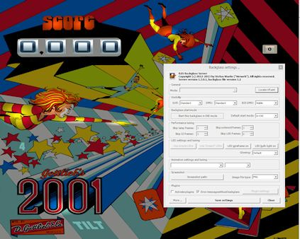
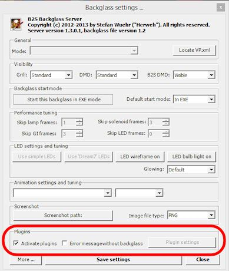

[#dofSetup]
= DOF Setup
:source-highlighter: rouge

One of the best tricks you do with a virtual pin cab is feedback effects: things like flashing lights, shaker motors, fans, solenoids, replay knockers, and bells and chimes.

To connect output devices to your pin cab PC, you need a special hardware device called an output controller.That's described in detail in xref:ioControllers.adoc#ioControllers[I/O Controllers] . Once you have an output controller installed, you have to set up some special software called "DOF", or DirectOutput Framework, that serves as the middle-man between the output controller and the pinball software (such as Visual Pinball).This chapter is all about DOF and how to set it up.

If you're not going to include any feedback devices in your pin cab, you won't need to install DOF at all, so you can skip this section.

== What is DOF?

DOF is a separate piece of software that you can install on your system to control feedback devices. It's not really a full separate program; it's more of an add-on that works together with Visual Pinball and other software. DOF handles the communications between the pinball software and your output controller devices. It performs two main functions.

First, DOF handles communications with several different kinds of output controllers: LedWiz, PacLed, SainSmart relay boards, Pinscape, and more. Before DOF came along, a program that wanted to access multiple output controllers had to be specially programmed with each controller's language. DOF provides a common interface that VP can use to access any of these devices without having to know its details.

Second, DOF translates between VP's simulated game elements and the output controller's physical device connections. VP thinks in terms of the elements in the simulated pinball table: left flipper, middle bumper, right slingshot, etc. The output controllers, on the other hand, don't know anything about pinball. They only know about generic devices attached to their numbered "output ports": port 1, port 2, port 3, etc. Each output port on an output controller is basically a wired connection to a physical device such as a solenoid or flasher light. But the output controller devices don't know anything about what's attached; they just know there's _something_ wired to each port.

DOF acts as an interpreter to translate between VP's game-oriented model and the output controller's physical device list. DOF accomplishes this using a configuration file that you provide, which tells it the "meaning" of each physical output port.

=== How VP and DOF communicate

DOF doesn't actually talk directly to VP. It talks to VP through the B2S Backglass program, which is another VP add-on that handles the backglass artwork display.

The first step is that VP communicates with the B2S. VP and B2S exchange information on game events, which are things like "the ball just hit switch #22" or "lamp #17 just turned on". B2S in turn sends the game event information to DOF. DOF translates the game events into feedback device actions, and sends the appropriate ON and OFF commands to the output controller device.

=== How this relates to individual tables

Newcomers to DOF often have a question at this point: Is this already programmed into every VP table?

The answer is a qualified Yes. Almost every VP X table has full DOF support built in. Most later VP 9 tables also have DOF support, although many VP 9 tables require you to make a small manual change to their scripts to activate DOF support. We'll explain how to do this later.

== How to install DOF

Before you install DOF, you must first install Visual Pinball and the B2S Backglass program. If you haven't already installed those, go back to xref:software.adoc[Pinball Software Setup] and follow the instructions there. If you're planning to use PinballX as your game selection menu system, you should also install that first.

Once VP, B2S, and PinballX are installed, you're ready to install DOF. You have two options for this: automatic or manual.

In either case, you'll have to choose a folder for the DOF files. I recommend `C:\DirectOutput` , if that's convenient on your system. You can use a different name if you wish, but note the following:

*  *Avoid using spaces in the DOF folder name.* A few people have run into problems that were very difficult to isolate, but which seemed to come from using a folder name containing a space character, such as `C:\Direct Output`. Even though this _shouldn't_ be a problem, it does seem to cause weird errors on a few machines, so I'd avoid it.
*  *Try a C: folder if it doesn't work on another drive.* Some people have had problems installing DOF on other drives (like D: or E:). As with the space character issue, it _should_ be just fine to use D: or E: or any other drive, but doing so seems to cause problems on some machines. There are sometimes good reasons to use a disk other than C:, so go ahead and try it if you prefer to keep your programs on a different drive. But if you run into any mysterious problems, try moving it to the C: drive to see if that helps.

=== System requirements

If you're on Windows 7, make sure your system has *.Net 4.6* installed before proceeding. That's a core Windows component that DOF requires. It can be installed via Windows Update. Most newer systems will already have this installed, but you might have to install it manually if you're using Windows 7 and recently did a fresh install of the operating system.

=== Automatic DOF Setup

The easy and recommended way to install DOF is to use the Windows Setup-based automated DOF installer. You can find the automated installer here:

link:http://mjrnet.org/pinscape/dll-updates.html#GranderUnifider[Grander Unified DOF R3++]

Look for the latest "Windows Setup (MSI)" edition. Download it and run it. When the installer asks you to pick a folder name, remember to use a name that doesn't contain any spaces.

If all goes well with the automatic setup, you can skip all of the "manual setup" steps listed below. The installer takes care of everything for you. Skip directly to xref:#VerifyDofSetup[Check that it's working] below.

*Troubleshooting:* The automatic setup is usually pretty reliable, but there are a couple of issues that sometimes come up. If you run into any error messages that aren't self-explanatory, try these steps:

* Check that UAC is *enabled* . Some people disable UAC based on advice they find on the Internet. That kind of advice is all badly out-of-date (from the Windows Vista days), but it keeps getting repeated anyway. It's bad advice these days. UAC is an integral part of modern Windows. Disabling it changes some system internals in ways that create headaches.
* Mysterious permission errors might be due to a special system "owner" of the `C:\` root folder, or wherever you're trying to install DOF. You can check the owner as follows:
** Right-click the folder on the desktop
** Select Properties from the Context menu
** Go to the Security tab
** Click Advanced
** Look for the "Owner" listing

If the owner is SYSTEM or Trusted Installer, the root folder is protected against writing by ordinary user accounts. You can either choose a different parent folder that's not protected like that, or you can run the installer in "Run as Administrator" mode. In the latter case, the new folder will also have a protected system owner when you're done, which will create other problems later. But you can fix that after the install completes, by changing the new folder's owner to match your regular user account:

* Repeat the process above to get to the Owner for `C:\DirectOutput`
* Click the Change link next to the owner name
* Type your regular user account name in the box
* Click Check Names
* Make sure this expands to a valid Domain\Username and click OK

=== Manual DOF Setup

I strongly recommend using the automated installer above rather than attempting a manual installation. DOF is notoriously difficult to install by hand; it has a million fiddly little details that you have to get right, and any small oversight breaks the whole thing. And DOF is bad at explaining what's wrong when something does go wrong, so it's extremely difficult to troubleshoot bad installs. The automated installer has proven to be much more reliable.

If you insist on doing it the hard way, though, here's my recommended manual setup procedure.

*Note!* To keep things as simple as possible, the instructions below leave out some details that most people don't need. If you want the full story, see the DOF documentation, which you can find via the xref:#DOFManualLinks[DOF documentation links] later in this chapter. In addition, the DOF version we link below isn't the only one available. There are some other modified versions with slightly different extra features available. See xref:#DOFReleaseStatus[release status] for details.

* Create a DirectOutput folder on your PC called `C:\DirectOutput` (or a name of your own choosing, but remember that it must not contain any spaces)
* Download the *ZIP file edition* of my link:http://mjrnet.org/pinscape/dll-updates.html#GranderUnifider[Grander Unified DOF R3+]
* Unzip the contents into your new DirectOutput folder
* Unblock all of the new DLL and EXE files. For each file in the new folder with a *.dll* or *.exe* suffix, do the following:
** Right-click the file
** Select Properties from the menu
** Select the "General" tab in the properties window
** Look for a message like this: "Security: This file came from another computer and might be blocked to help protect this computer"
** If you see the message, click the *Unblock* button next to it

* Open the folder where you installed Visual Pinball. Open the sub-folder *Tables* . Look for a sub-folder called *Plugins* . If it's already there, great, otherwise create it:
** Right-click in a blank area within the *Tables* folder window
** Select *New* > *Folder* from the menu
** Type *Plugins* to set the new folder's name
* Open the *Plugins* folder that you just found or created, then:
** Right-click in a blank area in the folder window
** Click *New* > *Shortcut* in the context menu
** Type the full path to your Direct Output folder into the box (e.g., `C:\DirectOutput` - this is the folder you created above, at the very beginning of this process)
** Click the Next button
** Type *DirectOutput* for the name
** Click the Finish button
* For the next step, you'll need a Visual Pinball table *that includes a B2S backglass* installed. The backglass has to be in a separate file with the same name as the *.vpx* table file, but with a *.directb2s* suffix. If you don't have any of these table/backglass pairs installed already, you'll have to install one now. For this test, you can use *2001* , because it's easy to find, being one of the first ones in the list on vpforums.org:
** Open link:https://www.vpforums.org/[vpforums.org] in your Web browser
** Log in (create an account there if you don't have one yet)
** In the navigation bar near the top of the main page, click "Visual Pinball Tables"
** In the box that pops up, look for the "VPX Tables" section, and click "All"
** Click on "2001 (Gottlieb 1971)", which should be near the top of the list (if not, try any of the other tables)
** Click the "Download" link and follow the instructions to download
** Unzip the downloaded file into the *Tables* folder inside your Visual Pinball program folder
* Make sure that the ZIP file you just downloaded included both a *.vpx* file and a matching *.directb2s* file. If not, you'll have to try downloading other tables until you find one that includes both, because the backglass file is required for the next step. Alternatively, you can look for the matching *.directb2s* file separately:
** Click *Frontend Media & Backglass* on the vpforums navigation bar
** Click *dB2S Animated Backglasses* in the popup box
** Search the list for the matching file
** Click on the file and download it as above
** Make sure the downloaded file has the *same filename* as the *.vpx* file for your table, with *.vpx* replaced by *.directb2s* . You can simply rename the B2S file manually if its name isn't an exact match.
* Once you have a VP 10 table and matching backglass ready to try, load it into VP 10 and run it. This should display the table and backglass in separate windows.
* Right-click anywhere on the backglass. This should bring up the B2S options dialog. It should look like this:

To bring up the B2S options dialog, you have to run a VP 10 table that has a matching B2S backglass file installed. Running the table from within Visual Pinball will display the table and backglass in separate areas on your screen. Right-click the mouse anywhere in the backglass area to bring up the B2S options dialog.

The B2S options dialog. The "Plugins" section at the bottom is what we're interested in here.

* Check the box next to *Activate plugins* , and un-check the box next to *Error message without backglass* .

Make sure that *Activate plugins* is checked, and *Error message without backglass* is un-checked

* Click Save Settings
* Exit the table (press "Q" and then "Q" again) and close VP

[#VerifyDofSetup]
== Check that it's working

Before proceeding, make sure you close all VP windows that you might have had open from the steps above. You want to make sure VP has a chance to restart with the new settings.

Now start VP, and load a table that has a B2S backglass. You can use the same table you used during the setup procedure in the step where we updated the B2S backglass settings.

As before, when the backglass appears, right-click the mouse anywhere in the backglass display area to bring up the options dialog. Look to see if the *Plugins* button at the bottom is enabled:

If the button is disabled, DOF isn't getting loaded. Go to the xref:#DOFTroubleshooting[troubleshooting] section below for things to try.

If the button is enabled, click it. This will bring up a separate dialog that shows the status of each plugin.

Look for a *DirectOutput* entry in the list. If you don't see any such entry, it means the same thing as a disabled Plugin Status button, namely that DOF isn't being loaded. Go to the xref:#DOFTroubleshooting[troubleshooting] section for help.

Finally, check the *Status* and *Last Exception* columns for the Direct Output entry.

If the Status is Disabled, or there's a message in the Last Exception box, see the xref:#DOFTroubleshooting[troubleshooting] section for help.

If the Status is *Active* and the Last Exception column is empty, congratulations! Your DOF setup work was successful! DOF is loading and starting correctly.

[#DOFCabinetXmlSetup]
== Extra controller setup

If you have any of the following controller types, you have to do some additional work to tell DOF how to access them:

*  xref:sainsmart.adoc[SainSmart USB relay board]
*  xref:addressableLightStrips.adoc[Teensy addressable LED strip controller]

If you're not using one of the controllers listed above, you can skip to the next section. Most other controller types *don't* require any extra configuration work on your part, because DOF finds them automatically each time it runs. DOF automatically detects Pinscape, LedWiz, and Pac-Led.

If you're using one of the controllers that requires extra configuration, follow these steps:

* In your DirectOutput folder, check for a *config* folder. If it's not already there, create a new folder and name it *config* .
* If you're using my DOF pass:[R3++] version, there should be an *examples* folder inside the *config* folder. Go to that folder and copy the files there to the *config* folder. If there's no *examples* folder, download the following files into your *config* folder (these are the same files included in my DOF R3++ version):
**  link:http://mjrnet.org/pinscape/downloads/DOFConfigSamples/GlobalConfig_B2SServer.xml[mjrnet.org/pinscape/downloads/DOFConfigSamples/GlobalConfig_B2SServer.xml]
**  link:http://mjrnet.org/pinscape/downloads/DOFConfigSamples/Cabinet.xml[mjrnet.org/pinscape/downloads/DOFConfigSamples/Cabinet.xml]
* In your DirectOutput folder, run the program file *GlobalConfigEditor.exe* by double-clicking it
* On the menu at the top of the window, select *File > Load*
* Navigate to your *DirectOutput > config* folder and select *GlobalConfig_B2SServer.xml*
* Click on the Cabinet Config tab at the top
* Click Select File
* Navigate to your DirectOutput > config folder and select *Cabinet.xml*

DOF should now load Cabinet.xml every time you start a game in Visual Pinball. The Cabinet.xml file provided above is just a starting point, though - you still have to edit it to add information on your Sainsmart relay board or Teensy light strip controller. See the sections for those devices for details on what to add to the file.

== The DOF config tool

The next (and nearly final) step is to tell DOF how your feedback devices are connected to your output controller. If you haven't already started installing your feedback devices, you might want to skip this section for now and come back to it when you get to that point.

The basic thing we have to do is tell DOF which type of device is connected to each port number on your output controller.

What's a "port number"? Every output controller is a little different, but they all give you a set of wiring terminals where you connect your output devices. For example, the LedWiz gives you two rows of screw terminals that look like this:

You connect one device to each screw terminal. For the details of how the wiring is actually connected, see xref:feedbackWiring.adoc#feedbackDeviceWiring[Feedback Device Wiring] , but for our purposes here, let's just think of it like this: each device is connected to one terminal on an output controller.

You'll notice that there's a number printed next to each terminal on the LedWiz board. Those are the port numbers we mentioned. Every physical wiring terminal has a port number assigned.

You'll also notice that there's _not_ anything printed on the LedWiz about "Left Flipper", "Shaker Motor", "RGB Flasher #1", or anything like that. So which terminal are you supposed to connect the shaker motor to? The answer is easy: it's up to you, so just pick one! As far as the LedWiz (or other controller) is concerned, all of the ports are the same. They're just general-purpose outputs that you can connect to just about anything. The LedWiz doesn't have to know anything about what's connected, because its only job is to turn the port on and off when commanded by the software.

But if the ports are all the same, how is DOF supposed to know which port is the shaker motor, which port is the left flipper, and so on?

That's where the DOF Config Tool comes in. The Config Tool lets you set up exactly this connection between port numbers and device types. Which is why we said earlier that you should have already mapped out your device wiring before you get into this step. You need to be able to tell the Config Tool which device you're going to attach to which port number, so you'll need at least a plan for how your ports are laid out.

*Step 1: Log in*

The DOF Config Tool is an online tool that you access from a Web browser. Here's the link:

link:https://configtool.vpuniverse.com/[configtool.vpuniverse.com]

If this is your first time here, click "Create Account" in the top navigation bar to set up a new account. An account is required because the Config Tool has to store each user's unique cabinet setup data separately.

*Step 2: Select your output controllers*

After creating an account, the next step is to click "My Account" on the navigation bar. This takes you to a page where you can tell the tool which output devices you have.

Go through the list and tell the tool which devices you have. If you have only one type of controller, all you have to do is find that type in the list and set its drop-down to "1". The number simply indicates *how many units* you have of each type, so if you have a single unit, set it to "1".

If you're using a Pinscape controller, set *Number of Pinscape devices* to 1 and leave "Number of FRDM-KL25Z Devices" set to 0. This is a little confusing: Pinscape runs on a KL25Z, so it might seem like, technically, you do have one of those as well. But the "FRDM-KL25Z" listing in the Config Tool really should be labeled "old Pinscape v1 firmware". Assuming you're planning to use the modern Pinscape firmware, just say that you have one Pinscape unit and zero KL25Z's.

When finish setting the output controller selections, click "Save Settings" to save the updates. Note that, throughout the Config Tool, you always have to click the Save button before leaving the current page if you want changes to stick. If you navigate away from a page before saving, any changes made on that page are usually discarded.

Note that your settings in the Config Tool are never set it stone. You can always come back to this page later to make changes, if you ever add a new output controller, for example, or change to a different one.

*Step 3: Set up your port assignments*

After saving, click "Port Assignments" in the nav bar. This will take you to the page where set up the mappings between output port numbers and specific devices. We've finally reached the point where we're talking about concrete, specific devices!

This page lets you work on one output controller at a time. If you have more than one controller in your system, you simply set up each one separately. The "Device" drop-down at the top of the page lets you select the one you want to work on. As always, remember to save any changes before selecting a different device.

For now, ignore the boxed items on the right side of the page ("Shaker Motor - Min Intensity - Max Intensity", etc). These are for fine-tuning your setup once you have everything working. It's best to leave the defaults in place initially.

During this step, we're going to set up the "Port _number_ " items on the left side.

The number of "Port" items shown on the page depends on the type of output controller you're using. For an LedWiz, for example, there should be 32 ports, Port 1 through Port 32, because that's how many physical ports an LedWiz has.

For a Pinscape controller, the page will show 128 ports. You might not have that many physical ports in your setup, but that's the maximum that the firmware can handle. Your actual number of ports depends on how whether or not you're using the expansion boards, and if so, which ones you're using and how many of each. To keep things simple, though, the Config Tool ignores all of that and just gives you the theoretical maximum of 128 slots. You should simply treat any slots beyond the ones in your actual system as "reserved for future expansion", in case you add more expansion boards later, for example. Just leave any extra slots blank on the Config Tool page.

To set up the port mappings, all you need to do is go through the ports one by one, and select the device type attached to each port from its drop-down list. If you've already connected your feedback devices to their output ports, hopefully you kept notes on which device was wired to which port! Get out those notes now and enter the same information the Config Tool port list.

If you're not sure what any of the terms in the drop-down list mean, see xref:dofDeviceList.adoc[DOF Config Tool Device Descriptions] . That provides a full list of all of the devices in the drop-down lists, with detailed explanations of how they're usually implemented in virtual cabs. The devices in the drop lists are mostly self-explanatory, but some of them are pretty obscure, plus there's a certain amount of "virtual pinball jargon" that probably won't make much sense if you haven't spent a lot of time in the forums.

Once you enter all of the devices, click Save.

*Step 4: Generate your config files*

If you're still on the Port Assignments page, you should see a button near the top called Generate Config. Click it. The Config Tool will now create your customized configuration files and download them to your PC as a ZIP file.

Wait for the download to complete. Open the ZIP file. Unzip the contents into your `C:\DirectOutput` folder (or wherever you installed the DOF files back at the start of this process).

*Important:* Unpack *all* of the .ini files from the ZIP file generated by the Config Tool, and *don't rename any of them* . Some people get confused by the multiple files and think you're supposed to choose one of them. You're not. You need *all* of them, with the exact names generated. Each file corresponds to one output controller, and the number in the name (if any) tells DOF which controller the file goes with. If you don't unpack all of them, or if you rename any of them, DOF won't work correctly.

*Step 5: Test it*

You should now have a fully working DOF setup! You should try running a DOF testing table to check that the commands can make it all the way through from Visual Pinball to your devices. See xref:#DOFTestTable[testing] below for instructions.

=== Update your config any time you change your device setup

Any time you change anything in your cabinet that affects the DOF setup, you'll have to return to the Config Tool, make appropriate changes to the settings there, and then re-generate your config files. The Config Tool remembers your saved settings between sessions (that's why you have to create a user ID and log in), so you'll only have to enter any new or changed information for your output controller list or your port assignments. After you make any needed changes, repeat the Generate Config step: click the button, download the ZIP file, and unzip the contents into your Direct Output install folder. Simply replace the old copies of the config files each time you do this.

[#DOFTestTable]
== Running a DOF test table

The final and most important test is to see if Visual Pinball can successfully control your feedback devices during a game. The easiest way to do this is with a VP table specially designed for testing DOF.

Here's a good test table you can use:

link:https://vpuniverse.com/forums/files/file/4556-dof-test-table-vpx/[DOF Test Table VPX]

(If that link doesn't work, try searching the link:https://www.vpuniverse.com/[vpuniverse] files section for "DOF Test Table VPX", or just do a Web search for the same term.)

Once you find a suitable test table, download it, unzip it into your *Visual Pinball > Tables* folder. Open it in VP and press F5 to play the game. The test table linked above provides on-screen instructions with keys to press to try activating different devices. You can go through your attached devices and verify that they work.

If none of your devices work, your DOF setup probably has a configuration problem. See the xref:#DOFTroubleshooting[troubleshooting] section below for help.

If some of your devices work and some don't, you can be certain that DOF itself is working, since a software problem with DOF would prevent anything from working. Check the wiring to the non-working devices, and double-check that they're set up correctly in the DOF Config Tool. For example, double-check that the port number that you entered for each device in the Config Tool matches the port number printed on the controller board where the wiring to the device is connected.

[#HowToEnableDOFInVP]
== How to enable DOF in VP

There are two requirements for a game to work with DOF:

* First, it has to be listed in the DOF Config Tool's database. To see the current list of supported tables, log in to the link:https://configtool.vpuniverse.com/[Config Tool] , go to the Table Configs tab, and open the Table Name drop-down list. This has all of the tables that the Config Tool currently supports.
* Second, the table's script in Visual Pinball has to include B2S backglass support.

With VP 10, almost every table automatically uses B2S if it's installed. There's usually nothing you have to do as a player to enable DOF for these tables; it should just work when you run the table.

With VP 9, the situation isn't nearly as DOF-friendly. Most tables in VP 9 require a small amount of script editing to enable B2S support, which in turn enables DOF support.

Both DOF and B2S came onto the scene during the years that VP 9 was the dominant version, so there was a lot of evolution of the common scripting practices among VP 9 table authors. As a result, there's not a simple formula for "fixing" VP 9 tables to use B2S and DOF. Many later VP 9 tables, written around 2016, have native B2S support, and you won't have to do anything to get it working. Slightly earlier tables have support for B2S coded in and ready, but disabled by default; you have to do a little script editing to enable it. And most earlier tables have no pre-coded support for B2S, but support can be added with some minimal script editing.

To determine which type of VP 9 table you're working with, start by downloading the table file (.vpt) and the matching backglass file (.directb2s). Make sure that both files have the same name, except for the respective .vpt and .directb2s suffixes. Now:

* Open the table in VP 9
* On the menu, select *Edit > Script*
* Look for a line like this:

[source,vb]
ConstcController = 0 ' 1=VPinMAME,
                     ' 2=UVP backglass server,
                     ' 3=B2S backglass server

* If you find such a line, simply change the "0" to the number listed for B2S. (Or, if the comments also call out a setting specifically for DOF, use that number instead.) Save and run the table. If it successfully displays the B2S backglass, you're set.
* If you can't find a "cController" line like the one shown above, try searching for a line that looks like this:

[source,vb]
SetController= CreateObject("VPinMAME.Controller")

* When you find that, replace it with this:

[source,vb]
SetController= CreateObject("B2S.Server")

* Save, and try running the game. Again, if it displays the B2S backglass, the table should now work with DOF.
* If you can't find any mention of "VPinMAME.Controller" anywhere, it's probably not a ROM-based game. In this case, the table _can_ be converted to use DOF, but it requires substantial custom scripting work that's beyond the scope of this chapter.

[#DisablingUnwantedSounds]
== Disabling unwanted sound effects in a VP table

VP tables are mostly written with desktop play in mind, so they assume that you want digitized sound effects for every mechanical event in the game: flippers, slingshots, bumpers, replay knockers, gear motors.

The whole point of using DOF feedback devices is that real mechanical devices produce more realistic audio and tactile effects than recordings. But when you play a DOF-enabled table on a DOF-enabled cabinet, you'll notice that VP often still plays those canned sound effects, on top of the real mechanical action that DOF is providing.

If you're like most DOF users, you'll probably find that recorded sound effects sound artificial and redundant when played at the same time as real mechanical DOF effects. So you'll probably want to turn off the canned effects that match up with the toys you have installed. If you have flipper solenoids installed, for example, you'll probably want to turn off the simulated flipper sounds VP plays via audio.

Fortunately, you can do this. VP 10 makes it easy. At least, it makes it easy for properly programmed tables.

* Open VP X in "editing" mode (no table needs to be loaded)
* On the menu, select *Preferences > Keys, Nudge and DOF*
* Look for the *DOF Controller Options* section on the right side of the dialog
* Go through the listed devices. For each one where you have a DOF device installed, change the setting from *Both* to *DOF* .
**  *Contactors* refers to the bumpers and slingshots
**  *Knocker* is the replay knocker
**  *Chimes* refers to EM-style chimes
**  *Bell* refers to the bell used in some games
**  *Gear* refers to the gear motor
**  *Shaker* refers to the shaker motor
**  *Flippers* refers to the flipper solenoids
**  *Targets* controls sound effects produced when the ball hits stand-up targets; with DOF, these use the bumper devices to simulate an impact effect
**  *Drop Targets* controls sound effects produced when the ball hits drop targets; with DOF, these use the bumper devices

These settings will only work with VP 10 tables that were scripted properly. Most newer tables should conform, but you might find a few that don't, which will be noticeable because they won't properly disable the sound effects according to your settings changes above. You might be able to fix such a table by following the procedures for VP 9 tables below. Or you can just contact the table's author and suggest updating the table to use the modern scripting conventions that take DOF into account.

In VP 9, the same thing is possible, but unfortunately, it's not nearly as easy. VP 9 doesn't have option settings for the individual DOF toys. What you have to do instead is edit the individual table script for each table you want to fix.

In older tables, you usually have to edit the scripts by painstakingly scanning through the scripts, finding all of the sound effects commands, and removing the ones you don't like.

Many later VP 9 tables (written in 2015 and later) include pre-programmed support for removing individual sounds, but it still requires you to edit the script to activate it.

Here's the basic procedure for both kinds of tables:

* Open the table in VP 9
* On the menu, select *Edit > Script*
* Look through the comments at the top for options relating to "Sound Effects", "DOF Sounds", or "Cabinet Sound Options". Some scripts offer variables to set DOF mode (which usually turns off all canned mechanical sounds), and some have several variables to selectively turn off certain mechanical sounds.
* If you don't see any such comments, you can still disable selected sounds yourself by manually editing the script, but it will take a lot of work:
** Search for *PlaySound* . The name in quotes after *PlaySound* is the sound effect file to play; this usually has a name that suggests its purpose. Each time you find a PlaySound line that has a sound you want to turn off, you can "comment out" the line by putting an apostrophe (') at the very start of the line.
** Search for *vpmSolSound* . This is another way that scripts play sound effects. For these, don't comment out the line, but instead delete the name inside the quote marks that follow, leaving the quotes intact. For example, replace *"vmplSolSound ""Knocker"","* with *"vmplSolSound """","* .

[#DOFManualLinks]
== Full documentation links

The official DOF R3 documentation is here: link:https://pinball.weilenmann.net/docu/DirectOutputWIP/index.html[pinball.weilenmann.net/docu/DirectOutputWIP/index.html]

You can also find the documentation on the DOF project page on GitHub: link:https://directoutput.github.io/DirectOutput/[directoutput.github.io/DirectOutput/] . However, as of this writing, that version has only been updated as far as the older R2 version.

[#DOFReleaseStatus]
== DOF release status

DOF's release status is a little confusing, because its original author, SwissLizard, suspended work on the project before finishing a major update that was in progress. He released a few "beta" test builds of the new "R3" release in late 2015, but he never completed the official, final R3 release. Fortunately, he published the project under an open-source license, so other people have been able to continue work on the project. It's very much alive and well as a result. The downside is that multiple unofficial versions have emerged. That creates a little more work for you, since you have to decide which one to use.

Here are the main options:

* My latest link:http://mjrnet.org/pinscape/dll-updates.html#GranderUnifider["Grander Unified" DOF R3++] is a merge of all four of the forks of DOF on GitHub as of January 2018, plus some additional updates I've made since then. As of this writing, it has every feature of every alternative version, so you don't have to choose among versions with subsets of features. This is the one I recommend because it has everything all of the other versions offer.
* My original link:http://mjrnet.org/pinscape/dll-updates.html["Grand Unified" DOF R3+] incorporated all of Swiss Lizard's final published code, plus some necessary changes to support Pinscape devices. This also contains my LedWiz enhancements.
* Swiss Lizard's own beta R3 releases are badly out of date at this point, but if you want to find them anyway, try this Web search: link:https://www.google.com/search?q=site%3Avpforums.org+dof+r3+beta.html[site:vpforums.org DOF R3 beta] . That should turn up the DOF R3 beta announcement thread on the forums, which contains links to the download files. Look towards the end of the thread for the newest updates.
* The last "official" (non-beta test) release from Swiss Lizard himself was the R2 version. This is even more out of date than the R3 betas, but if for some reason you want something that's nominally official, this is it. Go to link:https://www.vpforums.org/[vpforums] , click on "Getting Started" on the top navigation bar, then select "Frontends and Addons" from the "Essential Files" section of the popup menu. This will take you to a list of files. Find "DirectOutput Framework R2" in the list. Click on the link. This will take you to a download page. (If Swiss Lizard ever officially releases a final R3 build, it should also appear here in due course.)
* Three other developers (as of January 2018) have created their own forked versions of the R3 code on GitHub, to add their own extensions. Check the link:https://github.com/DirectOutput/DirectOutput.html[main DOF page on GitHub] to see the current list of forks. All of the forks that were active up through January 2018 were merged into my Grander Unified R3++ mentioned above, and I'm not currently aware of any further work on any of those forks beyond what I merged.

My intention with the Grander Unified R3++ version of January 2018 is provide a One True DOF, re-unifying all of the forks and eliminating any confusion about which one to use. The unified version combines all of the features from all of the forks, so there's no need to pick a subset of features.

[#DOFTroubleshooting]
== Troubleshooting your DOF setup

When DOF doesn't just work the first time you try to set it up, it can be a real pain to figure out why. The big problem is that DOF doesn't have very good error reporting. When something goes wrong, DOF often gives no indication what the problem might be, leaving you to make wild guesses until you hit upon the solution.

Taking shots in the dark is an inefficient and time-consuming way to debug a problem, and it can often make things worse if you try random changes without thinking things through. So the first thing you should do is not panic. Don't try random things. Instead, follow the steps below. DOF does offer a few subtle clues about the nature of the problem when something goes wrong, if you know where to look. We'll try to help you read the tea leaves to figure out what's going wrong and how to fix it.

*Step 0: Check your Windows configuration.* Make sure that UAC (User Account Control) is *enabled* . Some people disable it because of old/bad advice on the forums. Don't. Turning off UAC doesn't do what people think; it changes some Windows internals in subtle ways, and some people have had DOF problems as a result.

*Step 1: Make sure you only have one copy of B2S installed.* For whatever reason, a lot of people have run into the bizarre situation where they have multiple copies of B2S installed on their system. This can send you down blind alleys for hours. You spend a lot of time trying to get the B2S configuration files right only to find that you're changing an old copy that's no longer in use.

So before wasting a lot of time, *search your entire hard disk* for the main B2S files and make sure you only have one copy installed. A good file to look for is *B2SBackglassServer.dll* .

If you do find extra copies, delete them. Then go to the correct folder - which should have the one remaining copy - and run *B2SBackglassServerRegisterApp.exe* by double-clicking the file. It's important to run this step because it updates some Windows Registry settings to point to this copy. If you had an old copy somewhere else, the Registry settings might have left been pointing to the (now deleted) old copy.

*Step 2: Check the B2S Plugins button.* Open the B2S settings dialog by running a VPX table and right-clicking the mouse in the backglass area. Check the status of the *Plugins* button.

If it's disabled, it means that the DOF .dll files aren't being loaded at all. In this case, don't even think about what might be wrong with your DOF config files or anything like that. You have a very basic problem where DOF isn't even getting into memory. Here are the main things that can cause this, and how you might be able to fix them:

* The B2S backglass program doesn't know that you want it to load DOF in the first place. Make sure that the *Activate plugins* box is checked. If not, check it now, click Save Settings, quit out of the table, exit out of VP, and try checking again with a new VP session.
* B2S can't find the DOF .dll files. Check the *DirectOutput* shortcut in the *Visual Pinball > Tables > Plugins* directory. Make sure the shortcut points to the correct folder, the one where you installed the Direct Output .dll files. Make sure that everything is named correctly: the *Plugins* folder itself, the *DirectOutput* shortcut file, and the directory link within the shortcut file. The exact names are critical, so put on your proof-reading glasses and check carefully.
* B2S can find the .dll files, but it can't load them. Go back to the Direct Output folder and bring up the Properties window for each .dll file (right click on the file and select Properties from the context menu). Make absolutely sure that you've unblocked every file. Many people who have problems getting DOF to load find that the culprit was blocked .dll files, even though they were certain they unblocked everything the first time through. Double-and triple-check the files, and make sure you look at every single one with a .dll suffix.
* Search your entire hard disk (using the Windows desktop search tools) for extra copies of Direct Output that you might have installed by accident or at different times. Some people have had this experience: they keep checking and re-checking the .dll files to make sure everything's unblocked, and it is. And after the umpteenth time, they realize they've been unblocking a second copy of the files in a whole separate location from the ones that B2S is trying to load.

If none of that helps, you might want to try deleting everything in your Direct Output folder and downloading a fresh copy of the files.

*Step 3: Check the DOF plugin status.* Click the *Plugin Status* button above (if it's disabled, go back to step 1). This should bring up a new dialog showing the status of each plugin.

Find the entry for *DirectOutput* in the list. If there is no DirectOutput entry, it means the same thing as a disabled *Plugin Status* button: B2S never managed to load DOF in the first place. Go back to step 1 above, because this is exactly the same problem described there with exactly the same possible causes.

If the DirectOutput entry is there, it means that DOF has been loaded. Now check the rest of the entry. If the *Status* column says *Active* and the *Last Exception* column is empty, it means that DOF was successfully loaded and started without any fatal errors and is running properly, at least as far as B2S is concerned.

If the status is *Disabled* , and an error message is displayed in the *Last Exception* box, it means that a fatal error occurred trying to load the DOF program files. Right-click on the Last Exception box and select *Show Exception Details* on the menu to see the full text of the exception. These messages are usually much too long to fit into the little box. Unfortunately, they're also much too technical to be of any help unless you're familiar with the inner workings of DOF's source code. Even so, it's worth taking a look at the message to see if there's anything in it that suggests to you what the problem might be. Don't feel bad if it looks like so much nonsense, though; B2S makes no attempt at all to interpret these internal system error codes into anything meaningful to humans.

So what do you do with these error codes that were never meant for you to see? I'm afraid there's not much you can do with them other than copy them into a forum posting asking for help. There are people on the forums who know the internals of B2S and DOF who can often help you track down the problem given these technical details, so you can try posting to see if someone can help you out. Post the full text of the exception message, along with details about your directory layout and anything you've already tried to fix the problem.

*Step 4: Check the log file.* If B2S says that DOF is loading properly, but it's not controlling your devices properly, you can check DOF's log files to see if there are any errors there. If you tell it to, DOF will write a bunch of status information to a log file as it runs. This can be helpful when a problem occurs, since the status information sometimes has details about the specific cause.

First, make sure logging is enabled:

* Open your DirectOutput folder in Windows Explorer
* Run the program file GlobalConfigEditor.exe by double-clicking on it
* On the menu at the top of the window, select *File > Load*
* In the file open dialog, navigate to your *DirectOutput > config* folder and select the file GlobalConfig_B2SServer.xml. (If you can't find this file, xref:#ManuallyCreateDofGlobalConfigFile[create one as described below] .)
* Click the Logging tab
* Check the box "Enable logging"
* Type `.\DirectOutput.log` into the Log File box
* On the menu at the type, select *File > Save*
* Select the same file we started with `GlobalConfig_B2SServer.xml` and confirm

DOF will now create a log file called *DirectOutput.log* in your *Visual Pinball > Tables* folder each time you run a game. To test this out:

* Start a new VP session
* Load a table that includes DOF effects
* Run the game (press F5)
* As soon as the game finishes loading, you can quit ("Q" then "Q") and close VP
* Open your *Visual Pinball > Tables* folder
* Look for a file called `DirectOutput.log`
* Bring up the file's properties and check its Date Modified: it should be moments ago, since it should have been created or updated during the VP session you just finished
* This is an ordinary text file, so you can open it in Notepad to view its contents

Look through the file to see if there are an ERROR or EXCEPTION messages. If so, read the messages to see if they mean anything to you. Many of these messages are of a technical nature that are meaningful only to someone familiar with DOF's program source code, but some will tell you about straightforward problems like missing files. If the messages give you any indication what's wrong, try correcting the indicated problem; if there are error messages that you don't understand, you can post them to the forums and see if anyone there can decipher them.

[#ManuallyCreateDofGlobalConfigFile]
=== Manually create the DOF global config file

If you downloaded my DOF R3++ version listed in the setup instructions, it should have included a `config` folder inside your main DirectOutput folder, and a subfolder under that called `examples` . That should contain a file called `GlobalConfig_B2SServer.xml` . You can simply copy this file to the `config` folder.

If you don't see the *config > examples* folder or the `GlobalConfig_B2SServer.xml` file, you can create them manually:

* Go to your DirectOutput folder in Windows
* Right-click in the background area of the window and select *New > Folder* from the context menu
* Name the new folder `config`
* Open the `config` folder
* Download this file into the `config` folder: link:http://mjrnet.org/pinscape/downloads/DOFConfigSamples/GlobalConfig_B2SServer.xml[GlobalConfig_B2SServer.xml]

