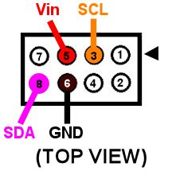
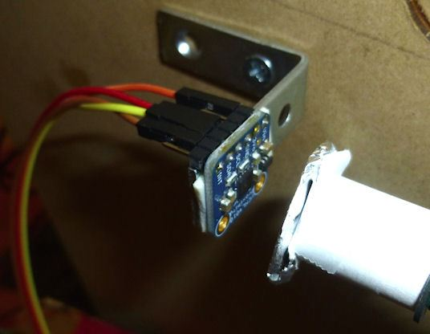
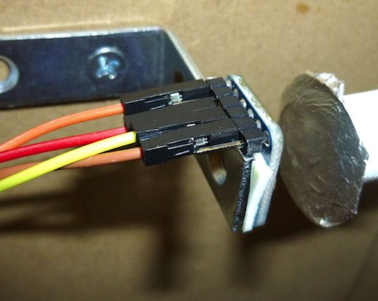
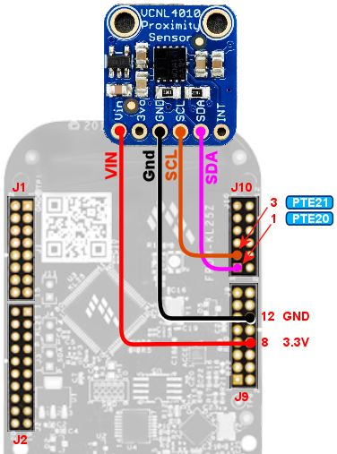
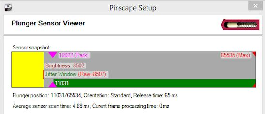

[#VCNL4010]
= Plunger Setup (VCNL4010 Proximity Sensor)

Vishay's VCNL4010 is an IR proximity sensor. 
It works by projecting pulses of infrared (IR) light in the direction of the target, and measuring the amount of light reflected back. 
If enough light is reflected back, the chip detects that an object is present within the target range. 
The brightness of the reflected light can also be used to infer the distance to the target, at least on a relative scale, since an object reflects more light when it's closer to the sensor than when it's farther away. 
It's this ability to measure distance that makes this interesting as a pin cab plunger sensor: we can use it to track the plunger position by pointing the sensor at the end of the plunger rod and taking distance readings.

I added support for this sensor mainly because several people who owned the Virtuapin plunger kit requested it, so that they could migrate their kit to the Pinscape firmware while continuing to use the plunger sensor that came with their Virtuapin kit. 
The VirtuaPin controller is based on the same retail KL25Z board that Pinscape runs on, so you can re-flash the board with the Pinscape firmware if you really want to, but until recently, doing so required replacing the Virtuapin plunger sensor with a different sensor that the older Pinscape software supported, such as a potentiometer or a quadrature sensor. 
Now that the Pinscape firmware also supports the VCNL4010, you can migrate without changing any of the hardware.

What if you don't own the VirtuaPin plunger kit - should you still consider this sensor? My answer is a qualified "yes": it has some really good features, but it also has some drawbacks. 
If you've read the chapter on the somewhat similar VL6180X sensor, or if you've seen some of my posts on the forums related to IR sensors, you probably know that I'm not too keen on the various IR sensors in general as pin cab plunger sensors. 
Most of them just aren't very good at measuring distance. 
But this chip actually produces pretty decent results. 
It's not quite as good as a potentiometer or the quadrature or imaging sensor options (which are described in other chapters in this guide), but it's good enough to be quite usable. 
In my testing, it was able to resolve the plunger position finely enough over most of its travel range to produce smooth and responsive animation. 
This sensor's big weakness is accuracy. 
Its accuracy is good when the plunger is close to the sensor, but it drops when the plunger is farther away, so you might see somewhat chunky animation at the far end of the plunger travel, when the plunger is pulled back most of the way. 
In addition, the sensor's response curve (measured brightness vs. 
distance to the target) isn't perfectly uniform, so the distance calculations are non-linear. 
The Pinscape software tries to compensate for the non-linearity with an adjustment formula, but the actual response curve is a little bit erratic, so I haven't been able to make the response perfectly linear even after compensation. 
You might or might not notice this, depending on how closely you look. 
Even with these limitations, this sensor is still a good choice, given its other virtues: it's really easy to set up (maybe even easier than a potentiometer), it's inexpensive (under $10), and it's non-contact (there's no wear from moving parts). 
Those features are nice enough that you might be willing to compromise a bit on accuracy.

== Firmware and Config Tool versions

Support for the VCNL4010 is new as of June 2021. 
Make sure you're using versions of the Pinscape firmware and Config Tool dated 2021-06-01 or later (or, better still, just grab the latest release).

== Electronics

You can buy a fully assembled VCNL4010 circuit board from link:https://www.adafruit.com/[Adafruit] . 
This is lucky for us, because the bare chips are challenging to solder by hand (they're really intended for machine soldering). 
The pre-fab boards make them easy to use.

link:https://www.adafruit.com/product/466.html[Adafruit VCNL4010 breakout board] ($7.50 + shipping)

The Adafruit board has easy-to-use solder terminals, and it can be wired directly to the KL25Z. 
No other hardware is required (besides wire).

If you have the VirtuaPin plunger kit, it happens to include the Adafruit breakout board, with the connections to the KL25Z already wired up. 
So you're already set!

=== Wiring the board

The Adafruit breakout board comes fully assembled, except for external wire connections. 
The only thing we have to do is attach the wires between the board and the Pinscape controller.

If you have the VirtuaPin kit that includes the Adafruit board, it's already wired, so you can skip straight ahead to the software setup.

The board comes with a pin header strip that you can optionally solder to the pads on the board. 
You can use these if you'd like, but I'd actually recommend soldering wires directly to the pin pads on the board instead of using the pin headers. 
Using the pins creates a bit of extra work, since you'll have to build an extra connector to plug into the pins. 
It also creates more opportunities for troubleshooting loose connections. 
So I'd skip the pins and solder wires directly to the board terminals, since you really shouldn't ever need to disconnect the wires from the sensor board. 
I do recommend using pluggable connectors at the KL25Z end, though, so that you'll still be able to easily unplug the whole assembly if you ever need to remove it from the cabinet.

I recommend 24 AWG stranded wire for the connections, but the exact gauge isn't important, as these wires carry very low power.

You'll need four wires, about three feet long each. 
Before cutting the wires, check the length you'll need by measuring the distance the wire will have to traverse to reach from the sensor location to the Pinscape unit (the KL25Z or main expansion board). 
Take into account any extra length you need to route it around your PC motherboard or other obstructions.

Strip about 1/4" of insulation from each end of each wire.

Solder one wire to each of the following terminals on the board:

* Vin
* GND
* SDA
* SCL

Leave the other terminals (3v0 and INT) unwired. 
Don't connect anything to those terminals.

=== Expansion board wiring

For the expansion board connector, build a 4x2 crimp pin housing ( link:https://www.mouser.com/search/ProductDetail.aspx?R=855-M20-1070400.html[housing] , link:https://www.mouser.com/search/ProductDetail.aspx?R=855-M20-1160042.html[pins] ). 
First crimp a pin to the end of each wire (see xref:crimpPins.adoc#crimpPins[Crimp Pins] ). 
Insert the pins in the housing, following the diagram below for the pin placement.

The diagram below shows the layout of the 2x4 connector housing that you'll plug in to the expansion boards. 
The labels Vin, SCL, SDA, and GND correspond to the terminal markings on the Adafruit board. 
Connect the wire for each pin in the housing to the corresponding terminal on the Adafruit board, matching up the labels. 
Simply leave the unmarked pins empty in the connector housing.

[#expHdrDiagram]

It would be a good idea to put a mark of some kind on the housing in the corner next to pin 1 - the pin marked with the arrow on the diagram above. 
That will make it easier to remember which side aligns with the "pin 1" arrow marker on the circuit board when you plug in the connector.

=== Standalone KL25Z wiring

For the standalone KL25Z, I recommend using the xref:plungerBreakout.adoc#plungerSensorBreakoutBoard[plunger sensor breakout board] . 
Then you can just plug it into the breakout board.

* Build the expansion board connect as described above
* Build the ribbon cable connector exactly as described above, as though you were using the expansion boards
* Follow the instructions in xref:plungerBreakout.adoc#plungerSensorBreakoutBoard[Plunger Sensor Breakout Board] to build the board
* Connect the following wires between the plunger breakout board and the KL25Z:
** Breakout board *3.3V* to KL25Z P3V3 (pin 8 on J9)
** Breakout board *GND* to KL25Z GND (pin 12 or 14 on J9)
** Breakout board *E20* to KL25Z PTE20 (pin 1 on JP10)
** Breakout board *D0* to KL25Z PTE21 (pin 3 on JP10) (Yes, the label on the breakout board is different in this case)

The plunger sensor breakout board makes the connection a little tidier, but that's all it does - if you prefer, you can just wire the Adafruit board directly to the KL25Z pins. 
If you want to go that route, see "Plug it in" below for the list of the required KL25Z GPIO pin connections.

== Physical installation

If you're using the plunger sensor from the VirtuaPin kit, you can simply continue using that whole apparatus, including its mounting bracket and wiring.

If you're building this all from scratch, you'll have to come up with your own way of mounting the sensor. 
I haven't come up with a reference design yet, but I can at least describe the setup I used in my test rig:

* Materials:
** 1½" angle bracket
** #6 wood screws, ½"
** double-sticky foam tape
* Mount the sensor to the angle bracket with the foam tape. 
Pick the location so that the sensor lines up with the plunger when the angle bracket is installed.
* Attach the angle bracket to the side wall the cabinet with the wood screws.
Position it so that the sensor is aimed directly at the plunger. 
Leave about 1.5 centimeters of clearance between the plunger and the sensor.
* The sensor must be far enough away from the plunger that there's no chance that the plunger will strike it when pulled back all the way and released. 
(You don't want all of that energy smacking into the sensor.) Test this by pressing the plunger all the way forward to make sure it doesn't hit. 
But it should be as close as possible after leaving enough clearance, since we're operating at the limits of the sensor's distance range as it is.

It would be nicer to come up with a 3D-printed plastic bracket that's more specifically designed to hold the circuit board, but I don't currently have a design for that to give you. 
If you're motivated to design and test a housing, and you want to share it, I'd be more than happy to include it in this guide if you send me a copy.

=== Reflector

You'll also need some kind of reflector attached to the end of the plunger. 
A standard white rubber plunger tip might be adequate, but you'll probably need something larger for good results.

Make the reflector as large as you can without hitting the flipper button switches or anything else installed nearby. 
A disk shape is ideal, since it'll provide a uniform reflection even if you turn the plunger knob. 
(This would be another great place for a 3D-printed plastic part, but as with the mounting bracket, I don't currently have a design to offer, so I can only suggest improvising.)

For test rig, I used a 1-inch disk, taped to the end of the plunger (as you can see in the photo above). 
I tried several materials to see what worked best. 
I had the best results with high-brightness white printer paper, and with kitchen aluminum foil, with the dull side facing the sensor. 
(The shiny side doesn't seem to work as well, probably because its reflected light isn't diffuse enough to produce a uniform reading at the sensor.) The foil performed very slightly better than the white paper in my test rig, but the difference was marginal enough that your results might vary, so I'd recommend experimenting with a few different materials to see what works best for you.

Don't rely on how bright a material looks to your eye to judge how good a reflector it will be. 
The sensor works in the infrared part of the spectrum, and some materials that reflect visible light well aren't as reflective in the IR spectrum (and vice versa). 
It's better to test a material rather than going by how it looks to the eye. 
You can use your live plunger setup as a test instrument, by looking at the brightness numbers in the Plunger Viewer window in the Pinscape Config Tool. 
That tells you exactly what the sensor is seeing. 
Pay particular attention to the brightness level with the plunger pulled *all the way back* . 
That's the most distant point from the sensor, which makes it the most challenging region for the sensor. 
It's useful to look at the brightness number for each material, but it's more important to look at how the brightness number varies with small plunger movements near the all-the-way-back end. 
In order to detect motion, the sensor has to be able to see changes in the brightness level that correlate with changes in the distance. 
So when you move the plunger by a few millimeters while it's nearly all the way back, you should see the brightness number go down as the plunger moves away from the sensor, and up as the plunger moves closer to the sensor. 
If you can see that pattern reliably with the sensor near the all-the-way-back end of its travel, your reflector should work well.

== Plug it in

*Expansion boards:* Once you've built the connector as shown above, simply plug it into the plunger connector on the main expansion board. 
Make sure the plug orientation is correct by match pin 1 in the housing (see the xref:#expHdrDiagram[diagram] ) with the pin 1 triangle printed on the expansion board.

image::images/MainBoardPlungerHeader.png[""]

*Standalone KL25Z:* If you're using the plunger sensor breakout board (recommended), build the expansion board connector as described above, and just plug it in to the pin header on the breakout board. 
Be sure pin 1 on the plug (see the xref:html#expHdrDiagram[diagram] ) to pin 1 on the board, which is marked with a little white triangle printed next to the header.

image::images/plunger-breakout-pin1.png[""]

If you prefer to use your own ad hoc wiring, connect the wires between the board and the KL25Z as shown below.

[cols="1,1"]
|===
|Adafruit Board Pin|KL25Z Pin

|Vin
|P3V3 (JP9-8)

|GND
|GND (JP9-10)

|SDA
|PTE20 (JP10-1)

|SCL
|PTE21 (JP10-3)

|===

Leave the other pads on the VCNL4010 board (3vo, INT) unconnected.

Note that the GPIO ports listed above are only suggestions. 
If you're already using the listed ports for other functions, you can assign the sensor inputs to other ports using the Config Tool. 
Any free GPIO ports can be used with this sensor - it doesn't have any special requirements for particular ports. 
The power and ground wires aren't configurable, though, so connect those as shown.

== Software setup

Once you have the sensor physically installed and plugged in, run the Pinscape Config Tool on your PC. 
Go to the Settings page. 
(If you have multiple Pinscape units installed, choose the Settings page for the unit that's plugged into your new plunger sensor.)

Go to the Plunger Sensor section. 
Select VCNL4010 in the "sensor type" popup.

(If the VCNL4010 option isn't available in the plunger sensor list, you probably have an older version of the Config Tool. 
Updating to the latest version should add the option.)

If you're using the expansion boards, the appropriate pin settings will be be selected automatically.

If you're using the standalone KL25Z, set the pin assignments for the two I/O pins (SDA and SCL) to match the pins you connected on the KL25Z. 
The SDA and SCL pins should match the pins you wired to the like-named terminals on the sensor board.

If you have the VirtuaPin kit with the VCNL4010 board, it's already wired to the KL25Z, so all you have to do is set the pins to match the kit's wiring. 
The pin assignments for the kit are *SDA = PTC2, SCL = PTC1* .

Here's a quick summary of the pin assignments, depending on your configuration:

[cols="1,1,1"]
|===
|Configuration|SDA|SCL

|Expansion Boards
|Automatic
|Automatic

|Standalone KL25Z, +with plunger breakout board
|PTE20
|PTE21

|Standalone KL25Z, +with your own ad hoc wiring
|As you wired it
|As you wired it

|VirtuaPin plunger kit
|PTC2
|PTC1

|===

There's also a box where you can enter the "IR LED current" setting. 
This adjusts the brightness of the IR emitter on the chip that's used to produce the light beam for the distance measurements. 
You can experiment with this to see what produces the best results in your setup, but I recommend starting with the maximum value of *200 mA* . 
The VCNL4010 can only barely detect objects as far away as the plunger travels, so it needs the brightest light source you can supply to be able to track the plunger.

Note that the 200 mA power setting doesn't meant that the sensor will actually draw 200 mA from the power supply. 
That power level might look alarming, but you really don't have to worry about it. 
The sensor only generates brief pulses of light, so it uses much less power overall than this setting suggests. 
According to the data sheet, the sensor only draws 4 mA overall when set to its highest power setting (with the IR LED set to the maximum 200 mA, and the sampling speed set to the fastest rate). 
4 mA is a negligible amount of power that won't affect the KL25Z or your USB ports. 
This sensor is designed for use in battery-powered devices, so they made it quite efficient on power.

Save the new settings by clicking "Program KL25Z" at the bottom of the window.

You should now test and calibrate the plunger. 
Return to the home screen in the Config Tool and click the Plunger icon for the unit with the sensor attached. 
This will let you look at the raw sensor input. 
Here's what the plunger viewer visualization looks like for this sensor:

The yellow bar shows the "brightness" of the IR light signal that the sensor is receiving. 
Remember that this sensor doesn't actually measure distance - all it can measure directly is the IR light level it's receiving on its photo sensor. 
The yellow bar lets you see exactly what the sensor is reading on its IR receiver. 
The brightness level is in abstract units that range from 0 (complete darkness) to 65535 (full saturation, like an overexposed photo). 
The 0-65535 scale is what the sensor actually reports on its digital interface to the KL25Z, so this shows you the unfiltered data directly from the sensor.

The green bar superimposed over the yellow bar shows the plunger position that the software is computing from the brightness reading. 
Remember that this isn't something that the sensor measures - the sensor only gives us that brightness reading. 
The plunger position has to be inferred from the brightness. 
This calculation is only meaningful after calibration, so the green bar will usually act erratically (or it might even missing entirely) when you first hook things up. 
Don't worry about the green bar right now - let's just make sure the sensor is working first, by checking that the raw brightness reading (the yellow bar) is behaving properly.

To check that the sensor is working, try moving the plunger, and watch the yellow brightness bar. 
It should change when you move the plunger. 
The brightness should decrease (lower numbers) as you pull the plunger back, since the amount of light reflected from an object decreases as the object moves farther away. 
You might immediately notice that the yellow bar's motion isn't "linear" - the bar doesn't track changes in the plunger position at the same rate across the whole travel range. 
That's exactly as it should be! The yellow bar is showing you what the sensor sees at the physical level, and at the physical level, light intensity is related to distance through an inverse power law. 
As a result, the yellow bar moves faster when the plunger is close to the sensor, and slower when the plunger is further away.

You might also notice that the yellow bar doesn't cover the entire numeric range from 0 to 65535 as you move the plunger. 
That's also to be expected. 
You might see it get close (or all the way) to the maximum 65535 when you push the plunger right up against the sensor, but it probably won't fall to anywhere near zero when you pull it all the way back. 
This is because the sensor always registers a certain baseline background light level, which comes partially from ambient light, and partially from the sensor's own internal electronics. 
This minimum level apparently varies quite a lot from one sensor to the next, according to the data sheet, so don't worry if the yellow bar bottoms out with a number in the thousands. 
It's also better if the numbers never quite reach the maximum, because that means you're getting the plunger so close to the sensor that it's getting "overexposed", where it can't distinguish distances. 
You might back the sensor away from the plunger by a couple of millimeters if the yellow bar hits 65535 before the plunger is absolutely all the way forward.

If the yellow bar isn't there at all, or it doesn't move when you move the plunger, the sensor either isn't working or isn't connected properly to the software. 
Go back to the settings page and double-check the GPIO pin assignments. 
*Make sure that none of the pins are marked with error icons* (image:images/pinwarn.png[""]
). 
If you see any of those, click the icon to see details on the conflict. 
These conflicts *must* be resolved - a lot of people see the icons and think they're just just some kind of advisory that can be ignored (I guess we're all used to Windows software constantly pestering us with meaningless warnings and error messages), but in this case you really have to pay attention to them. 
The sensor simply won't work if there are any pin assignment conflicts. 
If there are no conflicts, trace each wire and make sure that it actually goes to the assigned pin on each end (KL25Z and sensor board). 
Check that each GPIO port assignment on the settings page matches up with the physical pin on the KL25Z and connects to the corresponding terminal on the sensor board. 
Try to look at it with a critical eye - I find that it's really easy to trick yourself into seeing what you want to see when doing this kind error checking.

If the yellow brightness bar behaves as expected, click the Calibrate button in the plunger viewer window to begin the calibration process. 
Follow the on-screen instructions.

Make sure that everything's set up the way it would be during normal operation when you run the calibration. 
For example, if you opened up your cabinet or removed the TV to install the plunger hardware, you should put everything back together for calibration. 
The VCNL4010's brightness readings can be affected by ambient light and reflections from nearby objects, so the calibration results will only be accurate when the environmental conditions are the same as when you ran the calibration. 
You might need to repeat the calibration process if you make any substantial changes to your cab in the future that might affect ambient light inside the cabinet or similar factors. 
(Things like the ambient light level in the room _outside_ the cabinet shouldn't matter, since the cab should block all of that.)

=== Jitter filtering

The VCNL4010 has some inherent electronic "noise", or randomness, in its brightness readings. 
If you watch the brightness number on the yellow bar in the plunger setup dialog, you'll see that it jumps around over a small range when the plunger is sitting perfectly still. 
This is due to random variations in the brightness readings on the sensor. 
A certain amount of random noise is a natural part of any analog measurement process.

The Pinscape software has a "jitter" filter to help reduce the visible effects of the noise. 
The jitter filter lets you set a range of expected random fluctuations; the software will ignore changes within that range. 
As long as the random noise from the sensor stays within the range, the device ignores the fluctuations and reports a stable plunger position that remains stationary when the real plunger isn't moving, and tracks the real plunger's position smoothly when it's moving.

To enable the jitter filter, run the Pinscape Config Tool and go to the Plunger Viewer window. 
There's a setting in this window for the jitter filter. 
To adjust it, start with the filter at zero, and gradually increase it until the green bar showing the filtered reading stops jumping around. 
Use the smallest value that gives you stable readings. 
If set the filter value too high, the animation will start to get chunky.

For my test setup, a jitter window of 10 to 20 works nicely, but you should experiment. 
The optimal setting will vary by system, since so many different physical factors can affect the noise level in the IR signal.

== Theory of operation

The VCNL4010 is what's called a "proximity" sensor. 
It's designed to answer the yes/no question, "is there an object near (in proximity to) the sensor?".

That's not exactly the question that we want to ask of a plunger sensor. 
Our question is, rather, "how far away is that object?", and we'd like to take our answer in millimeters, or some other unit of distance. 
Technically, a sensor that's designed to answer the question "how far?" is a _distance_ sensor. 
Using a proximity sensor like the VCNL4010 to answer "how far?" is a little bit of an abuse of the chip, since we're asking more of it than its designers intended. 
But even so, it's still a question we can meaningfully ask with this particular chip, because the chip gives us more information than just a yes/no answer.

What the sensor actually gives us, in lieu of directly answering "is an object there?", is something a little more quantitative, which we're meant to interpret as an answer to that question. 
The quantity the sensor measures is the intensity of the reflected light from the target object - the reflection of the IR beam that the sensor shines on the target. 
We're supposed to compare this to a threshold brightness level, which we have to determine by calibrating the sensor (by placing a test object at a known distance from the sensor, and taking a reading). 
After we've calibrated with a test object, we can start taking proximity readings. 
If a brightness measurement is above the calibrated threshold, we're supposed to take that to mean that an object is nearby; if the brightness is lower than the threshold, we take it to mean that nothing's there. 
Technically, that's all the information this sensor is supposed to give us; we're not supposed to wonder exactly how far away the object is when an object is detected. 
But we could "abuse" the brightness reading by treating it as a continuous quantity, instead of just comparing it to a single threshold, using the physics principle that the amount of reflected light should be inversely related to the distance to the reflecting object. 
The reflected brightness is essentially a proxy for the distance.

That might seem perfectly reasonable, so why do I call this an "abuse"? Simply because it's not what the chip is designed for. 
The brightness might be usable as a proxy for distance, but it's not necessarily a _good_ proxy. 
A good proxy would have a well-defined relationship to distance, so that we can precisely calculate the distance corresponding to any given sensor reading. 
This chip's designers weren't at all trying to achieve that, and the chip's data sheet is silent on exactly what the relationship to distance might be, other than providing some rough plots of test data for a simple reference setup.

The difficulty with figuring out the precise relationship between brightness and distance (and why the manufacturer doesn't attempt to specify the relationship in the data sheet) is that it depends upon many different factors: the size and shape and reflectivity of the target object, the sensitivity of the sensor, the amount of ambient light, stray reflections, and so on. 
For a pin cab plunger, we can at least try to arrange things so that most of those other factors are constant, so that the only variable is the distance. 
But even holding everything except distance constant, we still can't know the precise mathematical relationship between distance and brightness, so we have to figure that out empirically. 
The best we can do is observe the relationship through calibration, and then interpolate points in between the calibrated reference points. 
In the abstract, that might or might not work, depending on how uniform and repeatable the relationship between brightness and distance actually is in practice for the sensor.

Fortunately, for this sensor, it turns out that the relationship is uniform enough and precise enough that we can get pretty good results with it.

In my testing, the best fit to the data I gathered turned out to be simple inverse square relationship - the measured brightness is proportional to the inverse of the square of the distance. 
That's just what you'd expect from an idealized point light source, so it matches my intuition at that level, but it's actually somewhat different from what the Vishay data sheet suggests. 
As I mentioned, the data sheet doesn't specify a numerical relationship between distance and brightness, but it does at least provide a rough plot of some test data, and from that it appears that the relationship they observed is more like an inverse cube curve (it looks like about 1/r^3.2^ to me, but the data sheet plot is shown at such low resolution that it's hard to read it with any precision). 
Even though an inverse square law fits my intuition about an idealized point-light-source setup, my intuition also says that our reflector apparatus has some pretty significant geometry differences from a point source and that we therefore shouldn't trust such simple intuition. 
Even so, it seems to be what fits! But so far I've only tested this sensor in this one installation, so we'll have to see if the inverse square fit that the firmware is currently using works as well for other people. 
I can believe that the power-law relationship might vary a little bit based on the physical setup, and that we'll eventually need to make that configurable to get optimal results across different machines. 
But we'll see.

