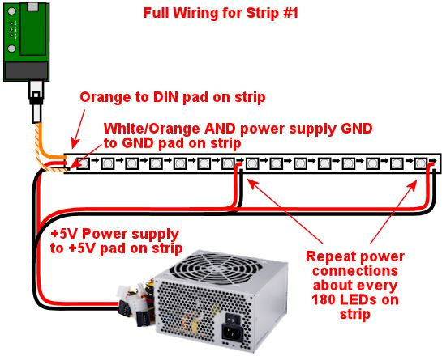

[#addressableLightStrips]
= Addressable Light Strips

Addressable or "smart" light strips are similar to the basic light strips most cab builders use for xref:lightStrips.adoc#lightStrips[undercab lighting] , but with the added feature that each LED on a smart strip can be set to a different color. That's what "addressable" means: each LED can be addressed - commanded - individually.

In pin cabs, these can be used in a variety of ways, such as:

* A strip of lights down the entire length of each side of the playfield TV, usually mounted on the side wall of the cabinet just above the TV. These can show chaser lights that follow the ball at certain times (such as when launching from the plunger), and can also show flashes of light situated near playfield flasher lights on the TV, to reinforce the video rendition of the flasher with a brighter nearby LED flash. (See xref:flashers.adoc#flashersAndStrobes[Flashers and Strobes] .)
* One strip or several rows of strips across the width of the back edge of the playfield TV. This can display more ball chaser light effects, and can also take the place of a dedicated flasher panel (see xref:flashers.adoc#flashersAndStrobes[Flashers and Strobes] ). In matrix form (multiple rows of strips), it can also serve as a sort of supplemental DMD, to display additional dot animation effects during game play.
* A strip or several rows of strips mounted near the top of the backbox. This can simulate "beacon" devices (see xref:beacons.adoc#beacons[Beacons] ).
* Addressables can also be used to illuminate the flipper and MagnaSave buttons (see xref:buttonLamps.adoc#buttonLamps[Button Lamps] ). This function can also be performed (more easily, in my opinion) by a general-purpose output controller like an LedWiz or Pinscape unit, but you could use addressables if your system doesn't include a general-purpose controller at all, or if all of its ports are committed elsewhere.

The placements listed above are the most common, and DOF has pre-programmed effects for them. But you're not limited to those setups. The DOF Config tool lets you create your own custom programming in addition to the pre-programmed effects. So if you have other ideas about how to arrange the strips, you're free to set them up as you like, as long as you're willing to do the additional work to program the effects yourself.

== Controller

You *can't* use an LedWiz, Pinscape, or other general-purpose output controller to run a smart light strip. Instead, you need a separate, special type of controller just for these strips. That makes smart strips different from all of the other output devices we've looked at.

The required controller is a bit of a DIY project. Being a DIY project, you can build the whole thing from scratch any way you like, but fortunately there's a standard recipe to follow. If you want to use the standard setup, here are the parts you need:

*  link:https://www.pjrc.com/store/teensy32.html[Teensy 3.2] (an Arduino-like microcontroller board, about $20)
*  link:https://www.pjrc.com/store/octo28_adaptor.html[OctoWS2811 adapter for Teensy 3.2] (interfaces the Teensy to CAT6 jacks for easier wiring to the light strips, about $10)
* A CAT6 cable to connect the light strips to the adapter
* A USB micro to USB "A" cable to connect the Teensy to the PC

The Teensy isn't a light strip controller by itself. It's just a microcontroller (a small single-board computer). To turn it into a light strip controller, you need some special software:

link:https://github.com/DirectOutput/TeensyStripController.html[TeensyStrip Controller] (GitHub)

Follow the instructions there to download the software onto your Teensy. The project Wiki linked there also has more information about setting up your light strip hardware, so you might look there if you run into any issues not covered in this chapter.

== Parts for the light strips

Look for *WS2812* light strips on eBay.

The strips are available with 30, 60, and 144 LEDs per meter. As you'd expect, the higher densities are more expensive. For strips along the side of the cabinet, I'd recommend the 60/meter type. 60/meter is also good for a single strip across the back. If you're attempting to create a DMD-like effect by using multiple rows at the back, though, you'd probably prefer the 144/meter type there, as the higher density will allow for better rendering of shapes across multiple "pixels".

WS2812B strips are equivalent to WS2812. (The difference with the "B" type is related to the physical solder pad geometry of the individual LEDs. That makes no difference when you're buying a strip, since the LEDs are already soldered to the strip. It would only matter if you were buying the individual LEDs to make your own custom strip or circuit board layout.)

You can also use WS2811 light strips, but I'd stay away from those because they're less predictable. In particular, some of the WS2811 strips are set up so that the LEDs can only be controlled in groups of 3, not individually. The WS2812 LEDs are always individually addressable, which is what you probably want if you're going to all this trouble. If you do buy a WS2811 strip, be sure to check the seller's description carefully to make sure that the elements are individually addressable.

== Power supply

The strips require a 5V power supply. You can use your secondary ATX power supply if you have one, or a dedicated 5V DC supply. See xref:powerSupplies.adoc#powerSupplies[Power Supplies for Feedback] .

Make sure that your power supply has enough capacity. Long light strips can consume a surprising amount of power. Computer ATX power supplies are usually sufficient for typical pin cab light strips, but smaller "wall wart" power supplies might not have enough power for long strips.

To determine the total power requirement, count up all of the individual LEDs across all of your strips, and multiply the total number by 60mA. This will give you the total current used. Many power supplies list their capacity in Watts rather than Amps, though, so you might have to convert. For a 5V supply, use this formula:

stem:["Watts" = "Amps" * 5]

Note that this formula is written in terms of Amps, not milliamps. To convert from mA to Amps, simply divide by 1000.

For example, if you have two meters of 60 LED per meter strips, you have 120 LEDs. 120 × 60mA = 7200mA = 7.2A, or 36 Watts (7.2 × 5).

Once you determine the power requirements for your LED strips, check to make sure that your power supply is rated to deliver at least that much power. A wall wart supply or power brick usually has markings showing the rated Amps or Watts.

== Wiring

Two connections to the LED strip are required: the power supply, and the control signal from the Teensy.

You only need a single control signal connection to each contiguous strip. This always connects to the very end of the strip. The strips have a directional signal flow, with arrows marked on the strip to show the signal direction. Your data connection has to go at the "starting" end of the strip, so that the arrows point away from that side.

If you're using a CAT6 cable, prepare it to connect to the strip like this:

* Cut off the plug from one end, as you need bare wires to attach to the strips
* Strip off at least a foot of the *outer* insulation jacket, being careful not to cut any of the wires inside. Strip more if you need to in order to make the wiring reach multiple strips.
* Carefully unwind the four twisted pairs from each other, keeping the individual pairs twisted together.
* Each twisted pair connects to one light strip. See the diagram below.

WARNING: The wire colors are for CAT6 cables using T568B termination, which is how most cables are set up. However, some cables use T568A termination, which looks the same but swaps the orange and green pairs.

The connection from the controller uses the two wires from a twisted pair from the CAT6 cable. Each twisted pair consists of a solid color wire and a white wire striped with the same solid color. For example, a solid orange wire is paired with a white/orange striped wire. Connect the solid color wire to the *DIN* pad on the strip, and connect the striped wire to *GND* .

For power, you must provide a separate connection at each end of the strip, and an extra connection *at least every 180 LEDs* . The extra connections are required because the copper traces on the strips are limited in the amount of current they can carry, and every LED between power connections adds to the current used. Multiple connections are required to distribute the load so that the traces don't carry too much current through a single section.

At each point where you connect power, connect the power supply's 5V terminal (the red wire on an ATX power supply) to the *+5V* pad on the strip, and connect the power supply 0V/ground (black wire on an ATX supply) to the *GND* pad on the strip.

For power connections in the middle of a strip, leave the DIN/DOUT pads unconnected at that point. You only need the single DIN connection at the "input" end of the strip.

For the power connection at the start of the strip, where you're also attaching the data connection, note that the GND pad on the strip will connect to *both* the power supply 0V/ground and the white striped wire from the CAT6 twisted pair.

Here's a full wiring diagram for the first strip. Each additional strip is wired the same way, but connects to a different wire pair from the CAT6 cable: the second strip connects to the blue/white pair, etc.

== Connecting multiple strips

You'll probably have several sections of strips, in which case each strip needs its own data input connection. There are two ways to handle multiple strips:

* Connect each strip to a separate twisted pair in the CAT6 cables from the Teensy adapter. The adapter has plugs for two CAT6 cables, and each cable has four twisted pairs, so you can connect up to eight strips this way. See the diagram of the adapter above to figure out which wires in the CAT6 cable connect to which strips.
* Daisy-chain the strips. Using twisted pair wiring, connect wires from the *DOUT/GND* pads at the *end* of the first strip to the *DIN/GND* pads at the start of the second strip. Repeat for each additional strip.

Most people find the first approach (wiring each strip directly to the Teensy adapter) to be easier and more reliable. Daisy-chaining is possible, but you have to provide good clean connections between the strip segments, using twisted-pair wires, to make it work. The challenge is that the data signal operates at high frequencies and can be very sensitive to electromagnetic interference from other devices in the cab. Twisted pair wiring provides a degree of shielding.

Daisy-chained connections are more or less required, though, if you're creating a matrix of strips with multiple rows. In that case you'll probably have too many strips to use the direct connect approach.

== Mounting in the cab

Most of the WS2812 strips are sold as bare strips without any adhesive backing, so you'll have to provide your own adhesive. Most people use double-sided foam tape.

If you're installing strips along the inside walls of your cabinet adjacent to the playfield TV, pay attention to clearance so that you don't make it impossible to get the TV in and out of the cab. Many people build their cabs so that the TV is a very tight fit, so strips that intrude even a couple of millimeters could make it difficult or impossible to lift the TV or remove it. If the strips are permanently installed along the inside cabinet walls, you'll be stuck without access to the inside of the cab, which you should never let happen. Here are a couple of approaches other cab builders have used:

* Mount the strips on a removable platform, such as a thin aluminum bar. Attach that to the cab wall with Velcro. This makes it easy to remove the strips to get them out of the way any time you need to lift or remove the TV. This is the way that many pinball collectors do it when they add similar light strips as mods to their real machines.

If you're using anything metallic as the removable platform, be sure to place an insulating layer between the strips and the metal. Many types of LED strips have exposed copper pads on the back, so they'll short out if you mount them directly to a metal surface. Foam tape is a good solution, because it can serve the dual purposes of sticking the strips to the metal and insulating the backing.

* Recess the strips into the wall, so that they don't get in the way of the TV. Use a router to cut channels into the cabinet wall where the LEDs will mount. Make the channels deep enough that the LEDs are fully recessed, so that the front surface of the LEDs is flush with the interior wall.

== Available DOF effects

The link:https://configtool.vpuniverse.com/[DOF Config Tool] provides pre-programmed effects for the standard light strip placements. The easiest way to set up strips with DOF is to use these programmed effects. Here's a list of the available effects and how they're typically assigned to physical light strips in the cab.

[cols="1,1,2"]
|===
|DOF Effect Name|Use with|Description

|PF Left Flashers MX
|Left playfield TV strip
|Simulates playfield flashers near the left edge of the playfield

|PF Left Effects MX
|Left playfield TV strip
|Special effects along the left side of the playfield, such as ball chaser lights

|PF Back Flashers MX
|Playfield TV rear strip/array
|Simulates a dedicated 5-flasher panel (see xref:flashers.adoc#flashersAndStrobes[Flashers and Strobes] )

|PF Back Effects MX
|Playfield TV rear strip/array
|Special effects near the rear of the playfield

|PF Back Strobe MX
|Playfield TV rear strip/array
|Simulates a dedicated strobe light (see xref:flashers.adoc#flashersAndStrobes[Flashers and Strobes] )

|PF Back Beacon MX
|Playfield TV rear strip/array *or* backbox strip/array
|Simulates a dedicated

|PF Back PBX MX
|Playfield TV rear strip/array
|Additional special effects used in PinballX

|PF Right Flashers MX
|Right playfield TV strip
|Simulates playfield flashers near the right edge of the playfield

|PF Right Effects MX
|Right playfield TV strip
|Special effects along the right side of the playfield, such as ball chaser lights

|Flipper Button MX
|Flipper button lamps
|Illuminates the flipper buttons in the appropriate color for each game

|Flipper Button PBX MX
|Flipper button lamps
|Additional flipper button lighting for PinballX

|Left MagnaSave MX
|Left MagnaSave button lamp
|Illuminates the left MagnaSave button in the appropriate color for each game

|Right MagnaSave MX
|Right MagnaSave button lamp
|Illuminates the right MagnaSave button in the appropriate color for each game

|RGB Undercab Complex MX
|Undercab lights
|Ambient illumination effects for undercab lighting (see xref:lightStrips.adoc#lightStrips[Undercab Lighting] )

|===

== DOF Setup

There are two parts required to set this up with DOF: a "cabinet configuration" file, and the DOF Config Tool settings.

*Part I: Cabinet config file.* You'll have to manually create a file on your PC called `Cabinet.xml` , in the DOF folder, to describe your hardware setup for the strips.

Before you do that, though, you _also_ have to set up a "global" config file to tell DOF to use your Cabinet.xml config file. (Nothing's ever easy with DOF!) That procedure is explained in "Extra controller setup" in xref:DOF.adoc#dofSetup[DOF Setup] . Please read through that section and follow the steps listed there. That will give you a starting point for the Cabinet.xml file that you can fill in with the light strip information.

The light strip entries in Cabinet.xml file are quite complex, and they're covered in the Wiki page for Swiss Lizard's Teensy code, so I'm not going to reiterate all of that here. If I copied it here, it would just gradually drift out of date and become more confusing than helpful. Better to go straight to the source:

link:https://github.com/DirectOutput/TeensyStripController/wiki.html[github.com/DirectOutput/TeensyStripController/wiki] - see "Software: DirectOutput Framework"

Another helpful resource is this VPForums thread, which has examples of the cabinet config file.

link:https://www.vpforums.org/index.php?showtopic=36156.html[How to Set Up Addressable LED Strips] (at VPForums)

*Part II: DOF Config Tool settings.* Once you have the Cabinet.xml file set up, DOF will be able to find your hardware. But wait! There's more! You have to go through yet another procedure now to tell DOF to actually use that hardware.

This procedure uses the link:https://configtool.vpuniverse.com/[DOF Config Tool] . Hopefully you're already familiar with that from setting up your general-purpose output controller. If not, please read through "The DOF Config Tool" in xref:DOF.adoc#dofSetup[DOF Setup] .

The first step is to tell the Config Tool that you have a Teensy light strip controller device:

* Click the "My Account" tab to go to the account settings page
* Set "Number of WS2811 Devices" to 1. (This reflects the number of Teensy light strip controllers, *not* the number of light strips. If you have so many strips that you need two or more Teensy devices to control them all, set this accordingly.)

The second step is to create "combined effects". This is required because the Config Tool has multiple effects that _usually_ end up being assigned to the same physical light strip. The reason for breaking these out as separate effects is that some people with very elaborate setups might actually have a separate physical light strip for each effect. But most people have simpler setups.

For example, the Config Tool has effects for "PF Left Flashers MX" (simulated playfield flashers along the left side) and "PF Left Effects MX" (other non-flasher effects for the left side). DOF separates these effects because you _could_ provide two separate light strips for these effects. But most people don't; most people just run one strip up each side of the TV. If you're in the latter camp, you'll want to combine these into a single effect, so that you can assign that effect to your left strip:

* Click the "Combine Toys" tab
* In the "Toy Category" column, select RGB Addressable from the drop list
* In the "Toy 1" column, select "PF Left Flashers MX"
* In the "Toy 2" column, select "PF Left Effects MX"
* Click the "Add" button and confirm the change
* Repeat for each set of combined effects you'd like to create.
* Save changes

Here's a list of the typical effect combinations:

* PF Left Flashers MX + PF Left Effects MX (use for a single physical left playfield strip)
* PF Right Flashers MX + PF Right Effects MX (for a single physical right playfield strip)
* PF Back Flashers MX + PF Back Strobe MX + PF Back Effects MX + PF Back Beacon MX + PF Back PBX MX (for a physical rear playfield strip or array)
* Flipper Button MX + Flipper Button PBX MX (flipper button lamps)

The final step is to tell the Config Tool about your physical strips and what each one should be used for. The DOF Config Tool thinks of the individual strips as "ports" in your Teensy controller. This is analogous to the way the general-purpose output controllers work: in a regular controller, you tell DOF that "port 1 is my shaker motor, port 2 is the replay knocker..."

Now, with smart strips, it's a little different, because DOF doesn't think of smart strips in terms of physical device types like "left playfield strip" the way it does for "shaker motor" or "replay knocker". It's a little more abstract. The equivalent device types for smart strips are the _effects_ listed under "Available DOF effects" above. Also, since smart strips are RGB devices, each physical strip takes up three DOF ports.

So putting those together, you set up your physical strips by saying things like "Port 1-3 is my PF Left Flashers MX strip". You can also use any "Combo" effects you set up above: "Port 4-6 is my Combo2 strip".

* Click the "Port Assignments" tab
* Select *WS2811 - directoutputconfigini30* from the *Device* drop list
* Set *Port 1* to the effect that you want to assign to your first light strip (the strip connected as "Strip #1", the orange/white wire pair from the wiring diagram earlier)
* If you created combined effects above, you can use those by selecting "Combo1", "Combo2", etc. You can also select the individual "MX" effects from the drop list. See the list above for an explanation of the different effects and where you'd usually want to assign them.
* Since the light strips are RGB devices, the step above will actually set ports 1 through 3 as a group, for the Red, Green, and Blue channels for the device. So the second strip will be assigned to port #4, the third will be assigned to port #7, etc.
* Set *Port 4* to the effect that you want to assign to your second light strip (the strip connected as "Strip #2")
* Repeat for each additional light strip

== Troubleshooting the "all white" problem

A common problem that many people seem to experience when first building an addressable light strip is that all of the lights turn on full white.

This is a result of a missing external pin connection on the Teensy. I think this varies according to the version of the Teensy you're using, so you should probably test first to see if you do indeed have the "all white" LED problem. If so, the solution is to add a jumper wire that shorts together pins 15 and 16 on the Teensy.

Here's a thread on the forums about it:

link:https://www.vpforums.org/index.php?showtopic=41655.html[DOF addressable LEDs "all white" problem [SOLVED\]]

