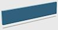
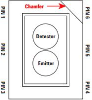
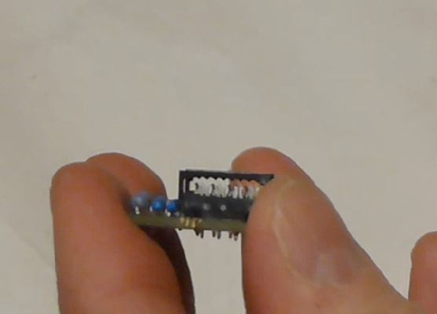
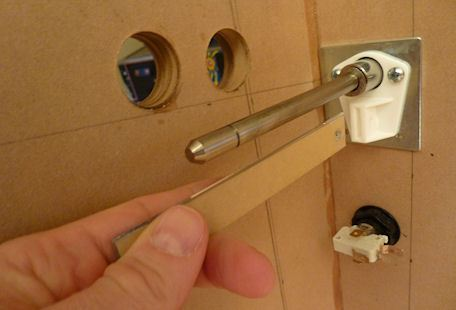
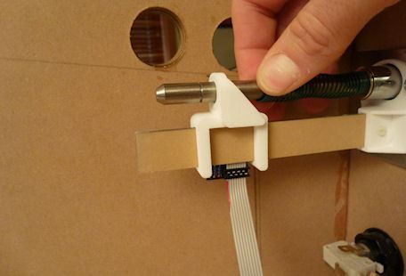
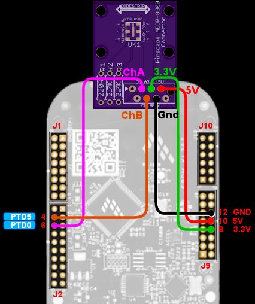

= Plunger Setup (AEDR-8300 Encoder)

One of the newer sensor option for the Pinscape plunger is an "optical encoder" chip called the AEDR-8300.

An optical encoder works with a guide rail known as a "scale" to sense its position. The scale is marked with alternating black and white bars of equal width. As the sensor moves along the scale, it counts the bars it passes. Since the bars are all of the same width, the count tells us the position in units of the bar width. The AEDR-8300 uses very fine bars, about 6.6 thousandths of an inch wide, which lets it measure the position very precisely.

Pinball plungers are obviously well suited for this basic idea, since they're naturally constrained to move in one dimension. The position along the scale tells us everything we need to know about the plunger position.

This chapter explains how to set up this type of plunger sensor.

== 3D printing guidelines

* The STL files linked here use *millimeter (mm)* units
* Nylon materials are recommended (PA12 or PA11)
* MJF (multi-jet fusion) process is recommended

I don't recommend using a home 3D printer for these parts. Consumer-grade printers mostly use PLA or ABS, which aren't good for functional parts like these since they tend to disintegrate rapidly when exposed to friction. I recommend using a commercial 3D-printing service (All3DP.com, Shapeways.com, or 3DHubs.com), and choosing a *nylon* material (PA12 or PA11). If your vendor offers the newer MJF (multi-jet fusion) process, I'd consider that - it seems to produce extremely tough parts that should hold up well.

== Parts list

This plunger project requires some specialized parts, all of which you can make yourself from the plans below. Just a few years ago, a lot of this would have been all but impossible for a hobbyist, but it's actually pretty easy now thanks to 3D printing and other technologies. In fact, the project is a nice tour of the many modern options for "personal manufacturing":

* Two of the parts can be 3D-printed
* One part can be made from laser-cut plastic
* One piece can be printed on a regular inkjet or laser printer
* One part is a custom circuit board

Fortunately, you don't need a factory at home for any of this, since there are companies that will do one-off 3D printing, laser cutting, and circuit board manufacturing at reasonable prices. See xref:resources.adoc[Resources] for my recommended vendors.

There are economies of scale in ordering some of these parts in batches, so you might want to consider finding a few people on the forums and place a group order. I've organized group orders in the past myself for these sensors, so feel free to contact me to see if I have any parts currently available.

If you want to order everything yourself, here are the pieces you'll need.

*Sensor bracket.* This plastic piece fastens the sensor to the plunger. It simply fits over the end of the plunger rod between the e-clip and the spring, so it's held in place by the spring.

This can be 3D-printed using these plans: link:http://mjrnet.org/pinscape/downloads/aedr8300/sensorBracket.stl[sensorBracket.stl] (units are millimeters).

As noted above, I highly recommend having this part made by a commercial 3D-printing service ( *not* a home printer) using a *nylon* material, preferably with the MJF process.

*Guide bracket.* This plastic piece serves as the anchor for the guide rail, which holds the optical bar pattern ("scale") that the sensor scans. This fits over the metal plate that anchors the screws holding the ball shooter housing in place.

This piece can also be 3D-printed, using these plans: link:http://mjrnet.org/pinscape/downloads/aedr8300/guideBracket.stl[guideBracket.stl] (units are millimeters).

*Guide rail.* This is a piece of 3mm thick mirrored acrylic that serves as the guide rail that the sensor moves across. This fits into the guide bracket and is held in place with a bolt.

This piece should be laser-cut using *3mm mirrored acrylic* . The mirrored surface is needed to get enough reflected light for the sensor to work properly. Laser-cutting templates are linked below. These are suitable for upload to link:https://www.ponoko.com/[Ponoko.com] , which offers the right kind of mirrored acrylic as an option. The "single rail" file includes only one copy of the rail, whereas the "multi-pack" fills Ponoko's entire small sheet with copies. The multi-pack makes the best use of materials, and gives you lots of extra copies to share with friends. On the other hand, you can use the single copy version if you want to fill in the unused space with some other design of your own. This could be interesting for making custom decorations for your cab - the mirrored acrylic is great for making custom lettering or logo cutouts.

Single rail: link:http://mjrnet.org/pinscape/downloads/aedr8300/GuideRailCuttingTemplate-x1.svg[GuideRailCuttingTemplate-x1.svg]  +Multi-pack: link:http://mjrnet.org/pinscape/downloads/aedr8300/GuideRailCuttingTemplate-x11.svg[GuideRailCuttingTemplate-x11.svg]

*Printed scale.* The bar pattern that the sensor reads can be printed with an ordinary laser printed on transparency sheets. Use transparency sheets made for laser printers, such as 3M CG3300.

A PNG graphics file with the pattern is linked below. I recommend printing with a laser printer, not an inkjet, since inkjet ink isn't as opaque as laser toner. Use a high quality setting, since it's important to maximize contrast. If you have a color laser printer, print in monochrome mode with black toner if that option is available.

This image is at 600dpi, and should print at 5" wide. Your printer will probably scale it automatically if necessary to match its native resolution, but if you can't get it to print at the proper size or it comes out fuzzy, you should try manually rescaling it to your printer's native resolution with a graphics program. The exact size of the bars is important, so don't rescale the overall image to a different print size. The only adjustment you should make is to the pixel resolution.

Graphics for printing: link:http://mjrnet.org/pinscape/downloads/aedr8300/scale.png[scale.png]

*Circuit board.* This small printed circuit board holds the sensor chip, plus a few resistors it needs, and pads for a ribbon cable to connect to the Pinscape expansion boards. This fits into the sensor bracket. You can order these from link:https://www.oshpark.com/[OSH Park] simply by uploading the EAGLE `.brd` file.

EAGLE plans: link:http://mjrnet.org/pinscape/downloads/aedr8300/pcb.zip[pcb.zip]

*Electronics.* You'll need the sensor IC itself, plus a few other electronic components that go into the circuit board. Everything is listed in the xref:partslist.adoc[Electronic Parts List] in the AEDR-8300 plunger sensor section.

Please see the xref:#humidity[ *warning on humidity* ] below. Don't open the AEDR-8300 plastic pouch until you're ready to solder it to the circuit board (even though it's tempting to open the package and check it out when you first get it).

*Cable/wires.* For the expansion boards, order the ribbon cable connectors listed in the AEDR-8300 parts list, plus an 8-conductor ribbon cable in whatever length you need to connect to the board. 3 feet should be more than enough. If you can't find an 8-conductor cable, you should be able to cut one with more conductors down to size. Most ribbon cables can be easily torn like a zipper along wire boundaries to reduce them to however many wires you need.

For the standalone KL25Z, it's most convenient to use individual wires (not a ribbon cable) to connect to the KL25Z. You can simply solder wires directly to the sensor board, and connect the other ends to the KL25Z via the 0.1" crimp pins listed in the KL25Z standalone section of the xref:partslist.adoc[Electronic Parts List] .

*Plunger.* Of course, you'll also need a real pinball plunger. You don't have to fabricate anything for this; you can just buy a real one. The parts above are all designed around the Williams/Bally ball shooter assembly, Williams part no. B-12245. They haven't changed the design since at least the late 1980s, so if you have an older version, chances are it'll fit. I think the current Stern plungers are the same size as well, but I haven't confirmed that.

You should also buy the special mounting plate for the shooter assembly, Williams part #01-3535. It's only about $2 and it makes it much easier to install.

Buy at PinballLife: link:https://www.pinballlife.com/index.php?p=product&id=133.html[Plunger assembly] | link:https://www.pinballlife.com/index.php?p=product&id=127.html[Mounting plate]

*Fasteners.* The following fasteners are recommended:

* (Qty 1) M2x12mm or #4x½" machine screw and mating nut, preferably nylon, for attaching the acrylic guide to the bracket
* (Qty 4) M2x8mm or #2x⅜" machine screws and mating nuts, preferably nylon, for attaching the circuit board to the sensor bracket
* (Qty 3) #10-32 x 5/8" machine screws, steel, for the ball shooter assembly housing

== Group orders

For the smaller parts, particularly the acrylic rail and the circuit board, you can save money with a group order. These can be made in batches much more cheaply than as single copies. I might have a small supply on hand; if so, I'll be happy to send you parts from my batch at cost as long as you're in the US. Contact me on the forums to inquire (see xref:resources.adoc[Resources] ).

The 3D-printed parts and electronics don't have any particular scales of economy, so I'd recommend ordering those individually. If you have your own 3D printer, you can print the 3D parts yourself.

[#humidity]
== Warning on humidity

When you order the AEDR-8300 from Mouser, they make a fairly big deal about its sensitivity to humidity. It'll come in a sealed plastic pouch with a big warning sticker about humidity exposure, and an indicator card sealed inside that changes color as it picks up moisture from the air. The card is there to verify that no moisture leaked into the packaging during shipping and storage, so check it when you first open the package. (The card will start changing color quickly after you open the package. Don't worry about that; it's there purely to assure you that the packaging was intact. If the card indicates that the packaging _wasn't_ moisture-proof after all, use the "baking" procedure that we'll come to in a moment.)

The humidity warning is there because the plastic housing material used in this chip can absorb moisture from the air and trap little droplets of water in pores in the plastic. When you solder the chip, the heat will turn any trapped water into steam, and the sudden expansion can warp or crack the housing. It's like microwaving a sealed container. This can destroy the chip.

To avoid this danger, don't break the seal on the packaging until you're ready to install the chip. Read through the installation steps before you open the pouch, and make sure you have all of the necessary tools and supplies on hand before you start, so that you can complete the soldering job in one session once you start.

There's no need to panic, though. The guidelines for this chip say that it's okay to solder for up to 168 hours (7 days) after opening the package.

What happens if you go past the 168-hour deadline, or the moisture indicator card in the packaging shows a breach? The data sheet has a straightforward solution: "bake" the chip, placing it in an oven at 60° C (140° F) for 48 hours. That'll gently exorcise any trapped moisture and restore the chip to a happily desiccated state. That'll give you a fresh 168-hour window to complete soldering.

Moisture is only a worry during the soldering process. You don't have to worry about humidity exposure once you've installed the chip on the board.

== Assembling the circuit board

Please read the warning above on exposing the sensor to humidity before proceeding.

Take a look at the circuit board and check for any little tabs or spurs around the edges. Small boards like this are usually made as parts of larger panels, so there are sometimes a few rough edges left over. If you find any tabs sticking out, trim them with wire cutters or something similar. The board fits snugly into the 3D-printed plastic bracket, so spurs can prevent it from fitting properly.

=== Installing the sensor chip

This is the only tricky step in assembling the board, and it should be done first.

The AEDR-8300 is a small surface-mount part. As you can see in the photo below, it's really tiny. I recommend having a magnifying glass and forceps at the ready while working with it.

The first thing you need to do is figure out the chip's orientation. Start by identifying the front and back. The back is the side with the metal pads for soldering. The front is all clear plastic, with a couple of little circular bumps for the light source and sensor lens. Be careful: the whole package is made of transparent plastic, so you can see the metal pads from both sides. But if you look closely, it should be obvious which side the metal pads are on.

Front of the AEDR-8300. The little circular areas are the light emitter and detector. There's a very subtle "chamfer" near pin 6, top right.

Back of the AEDR-8300. The metal pads for soldering are on this side. The center pad has a little dot, like the dot over an "i", at the "top" end.

Once you find the front and back, all that's left is to find the right rotation to match the circuit board. There are two ways to identify the right rotation. One is to look for the "chamfer" on the front face of the chip. This is a _very_ subtle indentation, not quite a notch. You should be able to see it with a strong enough light. The chamfer is at the "top right" corner, near pin 6. The other way to figure the orientation is to observe the center metal pad, which you can see through the plastic even from the front. When the chip is oriented correctly, the metal pad will look like a lower-case "i", with the little dot at the top. Refer to the diagrams above and look for that lower-case "i" shape.

Orient the circuit board as shown below, and you'll see that the "i" shape on the chip should match the "i" shape in the pad area for the chip on the board (labeled "OK1").

The thing that makes soldering this part tricky is that, as you can see above, all of the solder pads are on the bottom of the chip. That makes it hard to get your soldering iron into contact with the pad to melt the solder.

The solution is to use something called "solder paste" rather than ordinary solder, and heat the whole board at once rather than trying to heat the pads individually. This is surprisingly easy even if you've never done it before.

Solder paste is a special mixture of solder and glue that you can spread onto the pads like Cheez Whiz. Regular solder is solid at room temperature, but solder paste is a tacky goo - very much like paste, as the name suggests.

Here's the solder paste I use: link:https://www.amazon.com/gp/product/B00M1RC0YY/ref=oh_aui_detailpage_o05_s00?ie=UTF8&psc=1.html[MG Chemicals 4860P-35G] .

The first step is to smear the paste onto the pads. If you use the MG paste, it comes in a syringe with a needle dispenser. The pads on this chip are so small that even this needle is too big. So I skipped that and used a toothpick to take a tiny bit out of the nozzle (without the needle attached) and smear it onto the circuit board pads.

Ideally, you'd put a little bit of paste on each pad. But again, these pads are just too tiny. It's hard to confine each dab of paste to just the pads. I ended up smearing the paste all over the pad area.

It might look like a useless mess at this point, but it's actually okay. The solder paste will come to the rescue when heated. It's chock full of the magical "flux" chemical that makes the solder stick only to the metal parts when melting. The surface tension pulls the excess solder out of the gaps between the pads. The mess cleans itself up. Just make sure the coating of paste is as thin as you can make it. If there's too much solder overall, even the flux won't be able to confine the solder to the pads.

Once the pads are covered in the paste (whether or not you managed to keep it away from the spaces between the pads), it's time to stick the chip onto the paste. Hopefully you already figured out how the chip is supposed to be positioned, and you kept the chip standing by in the proper orientation, so now it's just a matter of popping it into place. Forceps are very helpful at this stage.

You don't have to get the positioning exact. Again, the solder paste will make up for a lot of inexactitude in your prep work, in this case because the surface tension between the solder and the metal pads will actually pull the chip into almost perfect alignment when the solder melts. But you have to be sure that each pad on the chip is at least close to its proper destination pad on the board. The surface tension will pull each pad on the chip to the closest pad on the board. If the chip is badly misaligned, the closest pad might be the wrong one, and the chip might get pulled into the wrong position. So a little care is required here. Just make sure the chip is lined up with the outline printed on the board.

Once it's all lined up, give it a little push with the forceps to make sure it's snugly seated in the paste. Double-check that you didn't dislodge it from proper alignment.

The final step is to heat the board to melt the solder.

The professional tool for this step is an SMD heat gun. ("SMD" stands for Surface Mount Device, which is the kind of chip we're working with here that mounts onto pads on the board rather than via wires that feed through holes.) If you already own an SMD heat gun, I'm going to assume you do a lot of SMD chip work and know exactly what you're doing, so I'll leave you to it.

If you don't own a heat gun, I can recommend two good DIY alternatives:

* Buy a cheap heat gun at a hardware store. Hardware stores and home centers sell cheap heat guns made for miscellaneous household tasks like stripping paint and heat-shrinking plastic wrap. You can find basic models for as little as $10-15. For example, Harbor Freight Tools has a $12 model that works well. These cheap household heat guns don't have precise temperature controls like the ones made for SMD work, but we don't actually need much precision for soldering just one chip.
* Use a toaster oven. You should only do this if you have an old one that you no longer use, because the chemicals in the solder are toxic enough that you shouldn't prepare food in the oven after using it for this. It's also best if your oven uses a quartz or infrared heating element, since these come up to a desired temperature very quickly, which make the process more likely to succeed.

I like the heat gun approach better. It's cheap and it's easier to control.

Whichever route you go, do this in a well-ventilated space. The solder paste makes quite a stink when heated, and releases some volatiles that can irritate your eyes and lungs. You won't want to breathe this in concentrated form.

====  Using a cheap heat gun

During this step, you'll want to use something other than your hands to hold the board in place while you work, since it will get quite hot. You can tape it down to a piece of plywood, or use tongs, for example.

Throughout the heating process, I recommend keeping the heat gun pointed at the chip, but move it around slowly in small circles to even out the heating.

The first step is to warm up the board for about 2 minutes at low heat, to about 250°F. We want to get it warm, but not hot enough to melt the solder. The goal is to warm everything up gradually, so nothing jumps around when we turn the heat up to soldering temperatures.

If your heat gun has multiple temperatures, use the low setting for this first phase. Cheap heat guns don't usually have exact temperature settings, but you might at least have high/low settings. Many of the cheap guns have a nominal low setting of 600°F or so, which is higher than we're after at this stage. If yours is like this, just hold it back about six inches from the board so that the board doesn't get the full heat initially. Monitor the solder paste visually during this phase and make sure it doesn't start melting; if it looks like it's liquifying, back off further with the heat gun. If the board isn't even getting warm, move the gun in closer.

Once the 2 minutes is up, the next phase is to increase the heat enough to melt the solder. We want to heat the board to about 500°F at this point. Again, many cheap heat guns don't have a setting this low, so you might not even need to switch settings at this point, but simply move the gun closer to the board.

This step should be fairly quick. Again, visually monitor the solder paste. If your heat gun temperature is high enough, the paste should begin to liquify within 15 seconds or so. You should see it start to run and bubble. Shortly after that starts, the paste will transform from the dull gray you've seen so far to shiny metal. That's the solder; the flux that was mixed in is separating from the solder and evaporating, leaving behind the shiny solder. If the paste doesn't melt and turn shiny within 30 seconds, turn up the heat or move the gun closer.

Maintain this heat level for about 10-15 seconds after the paste has all transformed into solder, then turn off the heat. You want to give it long enough for the solder to melt evenly and adhere to the pads on both the chip and the board. You should see the chip settle in closer to the board as the surface tension of the melting solder spreads the solder out across the pads.

Allow the board to cool for a few minutes.

====  Using a toaster oven

As we mentioned above, only use a toaster oven that you don't use for cooking food. The solder paste contains toxic chemicals. You shouldn't use it to prepare food after this since the chemicals could leave some residue in the oven.

It's best if your oven heats up very rapidly, because the timing of the temperature phases is fairly important. Quartz or infrared heating elements are great for this because they heat up almost instantly. If your oven takes a while to pre-heat, one suggestion I've seen is to use _two_ ovens, one for the low-temperature phase and the other for the high-temperature phase. That way you can pre-heat both ovens to the correct temperatures, and move the board from one to the next at the proper time.

Some people also recommend a skillet on the stove top, but I haven't tried that.

The basic plan is to heat the board in three steps. The first step is a pre-conditioning phase at medium temperature. This is called the "soak" phase in manufacturing lingo. The goal is to get everything thermally stable near but below the solder melting point, so that nothing jumps around due to thermal shock during the melting phase. The second step is at high temperature, where we actually melt the solder. The last step is to turn the heat off and let the board cool off gradually.

Step 1: 250°F for 2 minutes.

Step 2: heat to 500°F (or as hot as your oven gets; 450°F works for the MG paste). Watch the board carefully at this stage: after about 10 seconds, you should see the solder paste start to change from gray to shiny silver as the solder melts. After about another 10-20 seconds, you should see the IC chip move slightly - it should look like it's getting sucked into position. It should straighten up and get visibly closer to the board as the surface tension draws the solder to the pads and pulls the chip pads close to the board pads. Once this happens, give it a few more seconds to make all of the solder is melted, then move on to the next step. Don't stay at full heat for more than about 60 seconds, as you don't want to overheat the chip.

Step 3: turn off the heat and let the board cool in place for about 30 seconds. Then open the door to let it cool faster. You can take the board out after a couple of minutes. Use tongs or gloves, as it could still be hot enough to burn you.

=== Check the result

Once the board, cools, visually inspect the result. Make sure that the chip ended up in the right place. The solder should have pulled it into the right position rather than away from it. The clear package on this particular chip makes it possible to see through to the pads, which is a big help. You should be able to see that the solder has migrated out of the spaces between the pads.

=== Install the resistors

Solder the three resistors using conventional soldering techniques.

For each resistor, bend the leads at right angles and insert them through the marked holes, with the resistor body on the top of the board (the side with text printed). Make sure you put the right resistor in each slot; the resistance value for each one is printed on the board right where it goes. Resistors aren't polarized, so it doesn't matter which direction it goes. Push the resistor body or pull the leads until the body is flat against the board.

Turn on your soldering iron. Turn the board over. Hold the tip of the soldering iron against the point where the resistor wire and board pad meet. The goal is to heat up both pieces of metal, hot enough to melt the solder. Give it a few moments to heat up, then touch the solder to the lead/pad junction point you're heating. Let the solder melt and flow over the joint, then remove the iron. Keep everything perfectly still for about 5-10 seconds until the solder fully hardens.

The big rookie mistake in soldering is to focus on the soldering iron tip when applying solder. What you really want to do is apply the solder to the metal parts you're trying to join - the resistor wire and the board pad. Those parts need to be hot enough to melt the solder on their own. That makes the solder flow onto the parts and stick to them as it cools. If you apply the solder to the soldering iron tip, it won't flow properly onto the metal parts you're joining and won't form a good joint.

Visually inspect the solder joint after you're done and make sure the solder evenly covers the pad and resistor wire without any gaps. If you see any gaps, the solder might not have flowed properly onto all the metal, so re-heat it and apply more solder if necessary. You can also wiggle the resistor and make sure the wire doesn't move at all in the joint.

Now you can trim the resistor wire with wire cutters. Cut off the excess lead past the solder bubble.

=== Ribbon cable wiring

For the expansion boards, you should install the ribbon cable connector from the parts list. The connector matches the pin layout of the plunger header on the main expansion board, so you can just plug it in directly once you assemble the cable.

The connector comes in two pieces: a base with the pins sticking out, and a clip that fits over the top. Separate these for now and set the top clip piece aside. Be careful handling the bottom piece: the pointy spikes sticking out of the top are sharp. They're basically little wire cutters designed to cut through the cable insulation on their own, which we'll come to in the final step.

Pop the connector onto the board through the marked holes. Note that it only fits in one direction: there's a little plastic peg on one side that has to fit into the corresponding hole on the board. If you can't get the connector to fit properly, try rotating it 180° in case you have the peg on the wrong side.

image::images/aedrAssembly15.png[alt="Photo of connector through PCB"]

Flip the board over and solder the pins from the back side of the board. This is just like soldering the resistor leads. (Except that there's no excess wire to clip in this case.)

Now it's time to attach the cable. This connector is of the "IDC" type, which stands for Insulation Displacement Connector, which means that it's designed to pierce the cable insulation when you press the cable into it. These connectors are designed to do most of the work for you, so don't worry if you haven't done this before.

Grab the top "clip" piece for the connector that you set aside earlier. Position it *loosely* on top of the base. You can see that it slides into latches on either side. Don't push it down all the way yet; leave a gap big enough for the cable.

Now slip the cable into the gap. If your cable has a stripe (usually red) down one edge, put that on the side with the triangle/arrow printed on the circuit boards - that's pin #1. The red stripe will make it easier to identify the corresponding pin #1 at the other end. If your cable doesn't have a stripe, I'd strongly recommend adding a stripe with a red marker. Use an *oil-based ink* marker - water-based inks won't stick to the plastic insulation. Draw the stripe down the whole length of the cable along one side (it doesn't matter which one; you just pick one as the "pin 1" side).

The cable should just barely fit into the gap. This is part of the design, to ensure that the cable is positioned properly. Let the end of the cable extend about 1/4" past the clip.

Once you have it positioned properly, get out some pliers. (There's a specialized IDC crimper tool for this job, but ordinary pliers will work if you're careful.) Carefully apply pressure to the top of the clip. Start at one end, push it down just a little bit there, then gradually move to the other end. Work your way back and forth a few times until the clip is all the way down and snaps into the locks. You have to be careful not to do this all at once, since the locks aren't strong enough if the pressure is too lopsided.

When you're done, the clip should be fully flush with the sides locked into the latches. You'll be able to see the insulation poking into the holes on the top of the clip.

Finally, install the IDC connector at the other end. This is the plug that connects to the expansion board header. This is almost exactly the same as assembling the first connector; the only difference is that there's nothing to solder this time.

The one thing to be careful about is to line up pin #1 on the plug with the pin #1 wire in the cable. On the plug, you should find a small triangle or arrow at one corner. That's the pin #1 side. If you already identified pin #1 with a red stripe on the cable, make sure the stripe is on the pin #1 side of the plug. Pin #1 on the sensor board corresponds to pin #1 on the expansion board plunger header, which is marked on the expansion board with an arrow. Just line up the pin #1 markings down the whole chain and everything will communicate properly.

=== Standalone KL25Z wiring

If you're using a *standalone* KL25Z (without the Pinscape expansion boards), wiring is a little tricky, because the pins you have to connect it to on the KL25Z are scattered around different pin headers.

I recommend using a ribbon cable and the xref:plungerBreakout.adoc[plunger sensor breakout board] to connect to the standalone KL25Z. It'll make things much easier in the long run by giving you a pluggable connector between the plunger and KL25Z.

* Build the ribbon cable connector exactly as described above, as though you were using the expansion boards
* Follow the instructions in xref:plungerBreakout.adoc[Plunger Sensor Breakout Board] to build the breakout board
* Connect the following wires between the breakout board and the KL25Z:
** Breakout board *5V* to KL25Z 5V (pin 10 on J9)
** Breakout board *3.3V* to KL25Z P3V3 (pin 8 on J9)
** Breakout board *GND* to KL25Z GND (pin 12 or 14 on J9)
** Breakout board *D0* to KL25Z PTD0 (pin 6 on J2)
** Breakout board *D5* to KL25Z PTD5 (pin 4 on J2)

If you want to use ad hoc wiring instead (which I don't recommend), see "Plug it in" below for wiring instructions.

== Final assembly

Good news! The circuit board was the hard part. The rest is almost easy.

Laser-print the scale graphic (see the parts list at the start of this chapter) on transparency film. Cut out the bar area to just slightly smaller than the acrylic guide rail (so that the edges don't overhang). Attach it to the acrylic. Attach it on the shiny mirrored side, with the printed side facing the acrylic (this will help protect the printing from wear as the sensor slides back and forth). You can just use a little piece of Scotch tape at each end to attach it, making sure it's pulled tight so that it stays flat against the acrylic.

Attach the circuit board to the 3D-printed sensor bracket. Place it with the sensor facing outward and the ribbon cable or wires at the bottom. Secure it with four small machine screws and nuts. I recommend M2x8mm or M2x10mm, or #2x⅜". Nylon parts are ideal here. Insert the screws from the component side of the board so that the nuts are on the back of the bracket.

If you already fully installed your plunger, I'm afraid you're going to have to take it back apart at this point. Remove the e-clip that's holding the main spring in place (a pair of pliers is helpful: first hold the spring back so that it's not pressing against the clip, then grab the back edge of the clip with the pliers and pull it off). Slip the spring off. Now remove the *top two screws* from the housing. Leave the bottom screw in place.

If you haven't already installed your plunger, it's time to do that. Insert the housing through the opening in the front of the cabinet. Slip the mounting plate over it, aligning the screw holes. Screw the *bottom screw only* into the housing and tighten. Leave the top two screws out for now. Slip the barrel spring onto the shooter rod, then add a washer. Make sure the nylon sleeve is installed in the housing, then slide the rod into the housing. Add the second washer on the inside.

Slip the 3D-printed scale bracket over the shooter rod. It fits over the shooter rod holder in the housing, and the screw holes align with the screw holes in the housing.

Install the two screws. Don't overtighten, to avoid stressing the plastic.

Pop the scale/guide into the slot in the bracket, with the printed side facing the cabinet wall.

Fasten it with a small bolt and nut through the provided hole in the bracket. Any nut/bolt that fits will work; an M3x12mm or #4x½" should work well. I'd recommend a nylon bolt and nut if you have them handy. In any case, don't overtighten; this one doesn't have to handle much force, so just make it tight enough that it won't work itself loose.

Slip the spring onto the shooter rod.

Slide the assembled sensor bracket onto both the shooter rod and the guide rail. The round hole in the top fits over the shooter rod and the slits fit over the guide rail. You'll probably want to compress the spring with one hand while sliding the bracket onto the rod. Once it's in place, keep holding the bracket back (compressing the spring) and slip the e-ring into its slot on the shooter rod. Pop it into place with a pair of pliers. You can now gently release the spring tension so that the spring pushes the sensor bracket against the e-clip. This is the final working configuration.

image::images/aedrInst12.jpg[alt="Photo inside cabinet, holding the bracket near the middle of the sensor bar"]

== Plug it in

Expansion board:: Plugging the sensor into the expansion board is easy if you used the ribbon cable connectors. Just plug the 8-pin connector into the PLUNGER header on the main board. Make sure pin 1 on the plug corresponds to pin 1 on the board, which is marked with a little white triangle printed next to the header.
image::images/MainBoardPlungerHeader.png[alt="Photo diagram of Pin-out on Expansion board"]

Standalone KL25Z:: If you're using the plunger sensor breakout board as recommended, just plug the ribbon cable connector into the header on the breakout board. Be sure pin 1 on the plug corresponds to pin 1 on the board, which is marked with a little white triangle printed next to the header.

+
If you prefer to use ad hoc wiring - which I don't recommend - you can just run some hookup wires between the sensor board and the KL25Z. Be sure to make the wires long enough to reach comfortable between the sensor and KL25Z, and remember to account for how the sensor moves with the plunger. Follow the wiring plan below.

[cols="1,1"]
|===
|Sensor Board Pin|KL25Z Pin

|3.3V
|P3V3 (J9-8)

|5V
|P5V (J9-10)

|Gnd
|GND (J9-12)

|Ch A
|PTD0 (J2-6)

|Ch B
|PTD5 (J2-4)

|===

Note that the two GPIO ports, PTD0 and PTD5, are only suggestions. If you're already using these ports for some other function, you can assign the sensor inputs to other ports using the Config Tool. However, note that only ports with "PTA" or "PTD" prefixes can be used for these. (The inputs have to be PTA or PTD ports because only those ports are capable of generating interrupts on the KL25Z. The Pinscape firmware needs interrupt capability on the inputs to process the signals from this sensor.)

(The power and ground wires aren't configurable. Connect those as shown.)

In case you want to set up your own custom connector for the ribbon cable, here's how the pins on the expansion board end of the ribbon cable connector are arranged:

== Software setup

If you haven't already set up your KL25Z with the Pinscape firmware, you'll need to do that first. See xref:kl25zSoftwareSetup.adoc[KL25Z Software Setup] .

Start the Pinscape Config Tool. Click the Settings button for your device. Scroll down to the Plunger Sensor section. In the Sensor Type drop list, select AEDR-8300.

(If the AEDR-8300 option isn't available in the plunger sensor list, you probably have an older version of the Config Tool. Updating to the latest version should add the option.)

If you're using the expansion boards, the pins should be configured automatically. If you're using the standalone KL25Z, select the pins you wired to the sensor's data channels ("Ch A" and "Ch B" on the sensor board).

I recommend enabling the "auto-zeroing" feature, and setting a fairly long delay time, perhaps 60 seconds. If this feature is enabled, the Pinscape firmware will "zero" the plunger when it hasn't moved at all in the amount of time you specify. Zeroing means that the firmware assumes the plunger is exactly at the normal rest position. Why do this? Because the AEDR-8300 is a purely "relative" position sensor. That means it doesn't ever know the plunger's true position; it only knows how far it's moved since the system was turned on. If the sensor ever misses a tiny bit of physical motion, the sensor's notion of the relative position will get a little out of sync with the true position. Auto-zeroing corrects for this by forcing the internal position counter back to the starting position whenever the plunger is motionless for a long time. It's usually a safe bet that a perfectly motionless plunger really is sitting at the normal rest position, since the spring always takes it back there when you're not intentionally moving it. Just be sure to pick a long enough time that you won't ever hold it still that long during normal play, such as when lining up a skill shot. 60 seconds seems like a good choice, but use your discretion if you think that might not be long enough. You can also disable this feature entirely if you ever find it troublesome. In my own testing, the AEDR-8300 is remarkably close to perfect at picking up every bit of movement, so in practice you might never find that the plunger gets out of sync with reality in the first place.

Save the new settings by clicking "Program KL25Z" at the bottom of the window.

You should now test and calibrate the plunger. Return to the home screen in the Config Tool and click the Plunger icon for the unit with the sensor attached. This will let you look at the raw sensor input. Move the plunger and make sure it seems to be tracking properly.

If the sensor is working properly, click the Calibrate button in the plunger viewer window to begin the calibration process, and follow the on-screen instructions.

If the sensor doesn't seem to be working, go back to the Settings screen and double-check the sensor pin assignments. Make sure that none of the pins are marked with warning icons (image:images/pinwarn.png[""]
). If you see any warnings, click on the icon for details. In most cases, the problem will be that you've assigned the same pin to multiple functions. If so, go to the other place the pin is assigned, and clear that entry by setting it to "Not Connected".

If the software setup looks okay, check the physical wiring. Inspect each wire and make sure that it goes to the proper pin on each end (KL25Z and sensor board). Check that each GPIO port assignment on the settings page matches up with the physical pin on the KL25Z and connects to the corresponding terminal on the sensor board.

=== Backwards operation

If the on-screen plunger appears to move backwards from the physical plunger, you can fix it in the software without reinstalling the sensor. Open the Pinscape Config Tool. In the row for the controller, click the Plunger icon. Check the box for "Reverse orientation". (Or, if it's already checked, un-check it.) This tells the software to reverse the readings from the sensor, so that it acts like it was installed in the opposite orientation.

NOTE: Versions of the firmware released before January 2020 had a bug that made the "Reverse orientation" option not quite work right with this sensor. If you need to use this option, you should update the firmware to a 2020 (or later) version. If for some reason you can't or don't wish to update, then instead of using the "Reverse orientation" checkbox, you can achieve the same effect by going to the Settings page, finding the GPIO pin mappings for the sensor, and swapping the "Channel A" and "Channel B" pin assignments. That will reverse the way the software interprets the directional signals from the sensor, achieving the reversed motion you're after.

