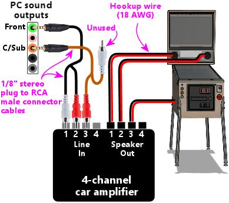
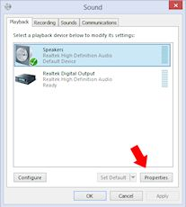

[#audio]
= Audio Systems

In this chapter, we'll look at how to design and implement your virtual cab's sound system.
We'll help you decide on an overall system design, as there are several ways to set this up, then we'll get into the details of what equipment you can buy and how to install and configure it.

== Visual Pinball's two soundtracks

Before we start on the equipment, it's worth taking a moment to understand the way Visual Pinball generates sound effects.
It has some special features for virtual cabs that are a little beyond the basic task of playing back the game's music.

Visual Pinball provides _two_ soundtracks for each game:

* The "music" soundtrack.
For any table that's a simulation of a real pinball machine, this is the soundtrack from the game's original ROM software.
It includes all the synthesizer music, voice cues, and other digitized effects that were played back through the speakers on the original machine.
* The "mechanical" soundtrack.
This includes all the sound effects that _aren't_ from the original ROM - the ones that are added into the Visual Pinball simulation.
These are called "mechanical" effects because they're almost always the sounds of things happening on the playfield: the ball rolling across the playfield and bumping into things, flippers, bumpers, and slingshots, chimes and bells in EM machines, and anything else in the physical game.

The point of separating the two types of effects into separate soundtracks is that it lets you play them back through separate speakers.
In a pin cab, this means you can have VP play the mechanical sound effects through a separate set of speakers hidden inside the main cabinet, under the TV, so that the playfield effects sound like they're actually coming from the playfield.
This adds to the illusion that it's a physical pinball game.

Newer versions of VP take the idea one step further with a "surround" option.
This lets you use _four_ speakers in the cab, so that VP can adjust the relative volume levels to make it sound like each effect is coming from a precise position in space.
Mechanical effects don't just sound like they're coming from the playfield, but sound like they're coming from a precise position on the playfield.

VP doesn't require that you provide all these speakers.
If you only have two speakers, VP will mix all the effects together and play them back on your two speakers.
That's in fact what it does by default; you have to go a little out of your way to achieve the surround effects.
So the multiple soundtracks are a bonus feature that you can take advantage of if you have the extra equipment, but which you can just ignore if not.

As far as I know, Visual Pinball is the only pinball simulator with this notion of separate "music" and "mechanical" effects channels.
all the other emulators will just provide a single soundtrack, with all effects playing back through your main speakers.
If you don't plan to run Visual Pinball, you probably wouldn't want to bother with the extra surround speakers.

=== Removing unwanted VP sound effects for DOF solenoids

If you're using solenoid-based feedback devices on your cabinet to simulate flippers, kickers, bumpers, and so on, you probably *won't* want to hear VP's recorded sound effects for the same devices.
The recorded sound effects tend to sound artificial compared to the real thing, and they also sound jarringly redundant when they fire at the same time as the real devices.

Fortunately, it's possible to disable individual mechanical sound effects in Visual Pinball.
The procedure is detailed in "Disabling unwanted sound effects in a VP table" in xref:DOF.adoc#DisablingUnwantedSounds[DOF Setup] .

== Sound system architecture

If you want to take advantage of VP's multiple soundtracks, you need to provide the extra speakers it uses.
If you want to keep things simpler and/or cheaper, you can omit those.
With that in mind, there are basically three ways to set up pin cab audio system:

=== Basic stereo
The simplest setup is a stereo system, with two main speakers and an optional subwoofer.

The main speakers are usually placed in the backbox, facing the player, and the subwoofer is inside the cabinet, facing down through an opening in the floor.

Most people use the same speaker placement that the real machines used in the 1980s and 90s (and that newer titles still use today, for the most part), with the main speakers mounted on a separate panel at the bottom of the backbox.
With this setup, all sound effects (including the playfield mechanical effects) are played back through this single set of speakers.

To implement this, you need:

* The two backbox speakers, typically 4" or 5.25" full-range car speakers
* The subwoofer, typically a 6" to 7" car speaker
* A 2.1-channel amplifier (two main channels plus a subwoofer channel)

A separate sound card isn't needed as long as your PC motherboard has built-in audio.

=== Music speakers plus separate monophonic playfield speakers:
This is the next step up from basic stereo.
We keep the backbox speakers and subwoofer from the basic stereo system, and add one or two speakers inside the cabinet, under the TV.
These are for the playfield effects.
The added in-cab speakers should be placed somewhere around the middle of the cabinet.

This setup makes mechanical effects sound like they're coming from the playfield, but they all sound like they're coming from the middle of the playfield, with no attempt to place them at different positions spatially.
VP will only play back monophonic playfield effects with this setup, even if you have two speakers, because VP requires four speakers if you want to use the full spatial placement feature.

To implement this, you need everything from the basic system, plus:

* The in-cab speaker or speakers, typically small speakers or "exciters"
* Another 2-channel or 2.1-channel amplifier
* A second sound card, only if your PC motherboard doesn't have at least 5.1-channel surround sound audio output

I wouldn't recommend this approach for a new build, as the four-speaker set up is not much more work to implement and provides much greater functionality.
This one- or two-speaker setup is really only something you would have before VP had the surround sound ability.

=== Separate music speakers and playfield surround speakers
This is the most powerful setup.
We keep the backbox speakers and subwoofer from the basic stereo system, and we add _four_ speakers inside the cabinet, placed near the corners.
This lets VP balance the volume among the four in-cab speakers to make it sound like each mechanical effect is coming from a precise position on the playfield.

To implement this, you need everything from the basic system, plus:

* Four in-cab speakers, typically "exciters"
* Two additional 2-channel or 2.1-channel amplifiers, or a 4-channel amplifier
* A second sound card, only if your PC motherboard doesn't have 7.1-channel surround sound audio output

This is the setup I'd recommend, if you have the budget for the extra equipment.
Separating the mechanical effects and playing them back through in-cab speakers makes a subtle but noticeable difference.
This isn't the most dramatic upgrade you can make, so I wouldn't prioritize it above, say, some of my favorite tactile devices (flashers, shakers, fans, replay knockers).
But it's definitely a nice upgrade for a well-equipped cab.

== Sound cards

In the past, PC audio usually required adding a sound card.
These days, that's usually not necessary, since most PC motherboards now include built-in audio, usually with full surround-sound capabilities.

I think the only reason to add an extra sound card would be if your motherboard audio doesn't support 7.1 surround sound, and even then, you'd only need a separate sound card if you want to use Visual Pinball's full surround capabilities.
In that case, you'd need an add-in card with 7.1 support.
Like anything else in the PC world, sound cards come in a wide range of prices, from dirt-cheap to extravagantly expensive.
The high-end cards are marketed especially to gamers, so you might be tempted to buy a deluxe gaming sound card, given that a pin cab is a sort of gaming rig, but I don't actually think it's worth the extra money.
Remember that a lot of the original sound effects in pinball simulations come from games that were built with 8-bit hardware in the 80s and 90s, so most of the source material isn't all that demanding.
In my opinion, any decent modern sound card will be more than up to the task.
I'd just look for an inexpensive 7.1 card that gets decent user reviews on Amazon or NewEgg.

A lot of people worry that Windows will get confused if you add a sound card in addition to the built-in audio.
Happily, this is one of the rare cases where Windows makes things easy.
Windows is perfectly happy to have multiple sound cards installed.
There should be no complications if you do decide to add one.

== Main speakers

*Equipment:* For the two speakers in the backbox, most people use car speakers.
If you're planning to use a 1990s style speaker/DMD panel, and you've already purchased or built it, it'll have cutouts for a particular size of speaker - either 4" or 5.25" - so you'll need to match that size.

The 4" and 5.25" size specs are standard car speaker sizes.
These are "nominal" sizes that refer to the cutout size needed.
If you shop on Amazon or elsewhere for car speakers, most products will conform to the standard sizes.
There are lots of other standard sizes and shapes - what you're looking for is the circular type, with a circular aperture and a set of four mounting holes in a square pattern around the perimeter.
It should be obvious from the pictures when shopping.

The subwoofer is less constrained on size.
Anything from 6" to 8" with a round aperture should work.
You could even go larger, but remember that space in the cab will be somewhat limited when you have everything installed.

If you want something more targeted for pinball, Flipper Fidelity makes a number of speakers specifically designed for real pinball machines.
They'll fit a virtual cab just as well if you're using one of the standard 1990s-style speaker panels.
The Flipper Fidelity speakers are similar in design to car speakers, so you can find other options at lower prices with something more generic, but Flipper Fidelity's products save you some legwork in that you can be assured that they'll be the right size and that they'll sound decent in a pin cab setting.
I've purchased some of their speakers myself, and I think they're well designed and sound good.

In my opinion, it's hard to go too wrong on the speakers as long as you find something of reasonable quality in the right size.
There are lots of good car speakers on the market, and while some are certainly better than others, I think any speaker that gets positive user reviews from people using them in cars will also sound good in a pin cab.

*PC speakers:* Some people use PC speakers instead of separate components (like car speakers).
PC speakers have the advantage that they come with their own built-in amplifiers, so you can just plug them straight into your PC's audio jacks.
With component speakers, you have to install a separate amplifier (which we'll come to shortly).

The downside of PC speakers is that they're built into little black plastic boxes that are meant to be placed on a desktop or attached to a monitor.
It can be difficult to make these look properly integrated with a pin cab, especially if you're using one of the standard 1990s speaker panel designs.
The standard speaker panels are specifically designed to accommodate car-type speakers, so those integrate easily.
You might be able to improvise something with a PC speaker, but it's not a natural fit.
It is possible, though - some cab builders have successfully used this approach.
In addition, if you don't care about integrating the speakers, you can always just pop them on top of the backbox or something like that.
I wouldn't be happy with that kind of setup aesthetically, but it would be perfectly functionally.

*Placement:* The main speakers are usually situated in the backbox, facing the player.
If you're using a 1990s-style speaker/DMD panel, you already have the natural place for them.
If not, you'll have to come up with your own ideas for where to put them.
For the best sound, I'd orient them so that they're facing the player, and put them somewhere in the backbox, with circular openings about the size of their apertures.
They'll sound a bit muffled if you put them behind solid plywood without the openings, and the sound might seem to come from odd directions if you don't have the speakers facing the player.

The subwoofer typically goes inside the main cabinet, on the floor, with its speaker cone pointed down.
You'll need to cut a circular hole in the cabinet floor about the same size as the speaker aperture.
In the original WPC plans, the opening was roughly centered in the floor, but my plans in xref:cabBody.adoc#cabinetBody[Cabinet Body] place it further towards the back, to leave more space for the PC motherboard.
From what I've been able to learn about building speaker enclosures, the placement of the opening has little or no effect on the acoustics, so you can move it further back or further forward if that would be more convenient for your setup.

*Wiring:* Use ordinary stranded hookup wire, in a fairly sturdy gauge.
18 AWG should be more than adequate.
The people who sell speaker wire want you to believe you need extremely thick wire for even tiny speakers, but we're working with fairly low-power amplifiers here; you don't need to go overboard.

See the diagrams in the "Amplifiers" section below for specific wiring plans.

=== Speaker lights

Some people install LED strips around the perimeter of the backbox speakers.
See "Installing speaker LED strips" in xref:dmdAssemblyOriginal.adoc#speaker-led-strips[Original WPC Speaker Panel] for a how-to guide.

== Amplifiers

The sounds outputs from a PC motherboard or sound card are "line level" outputs, meaning they have to be connected to an amplifier, which is in turn connected to the speakers.
Speakers that are made specifically as "PC speakers" generally have their own built-in amps, meaning you can just plug them straight into the sound card.
But this isn't the case when you're working with a standalone speaker designed for a car or pinball machine: for those, you need a separate amplifier.

So you can either use PC speakers, which have their own challenges, as we mentioned earlier, or you can use component speakers and install an amplifier.
Assuming you're going with a separate amplifier, let's look at options.

=== Power levels (Watts per channel)

You're probably accustomed to stereo/home theater receiver amps with power ratings of 100 Watts per channel and up.
That's much larger than the power ratings you're likely to see for the sorts of amps we're considering here, and much larger than you need in a pin cab.

The Watts-per-channel rating can be a bit misleading.
Most people take it to be an indicator of the loudness that an amplifier can produce.
That's basically true, but not quite in the way we tend to think.
We tend see these numeric scales as linear, so we think that 100W is twice as loud as 50W.
The relationship between power and loudness is actually logarithmic, so the real situation is that 100W just sounds _incrementally_ louder than 50W.
The rule of thumb is that you have to roughly double the wattage for the ear to perceive any difference in loudness.
Doubling the power is like going from "5" to "6" on the volume dial, not like going from "5" to "10".

My point is that you shouldn't be too alarmed if the amps you're looking at have advertised wattage levels well below what you're accustomed to for home theater systems.
By way of comparison, the 1990s Williams pinball machines had a whopping _14 Watts_ of power _combined_ for the speakers in the backbox, and a second 14 Watt channel for the subwoofer.

=== Integrated 2.1-channel amplifiers

For the main speakers, we need three channels of amplification: the left and right backbox speakers, and the subwoofer.
The most common way that pin cab builders accomplish this is with a so-called 2.1-channel amplifier - a single unit that has two main channels (that's the "2" in "2.1") and a subwoofer channel (the ".1").

The advantage of an amp designed for 2.1 channels it that it should have a built-in "crossover", which is a little filter circuit that sends the higher-frequency part of the signal to the main speakers and the lower-frequency part to the subwoofer.
This lets each speaker reproduce the range of frequencies it was designed for, which makes them sound better than if you didn't do the filtering.

Here's how you wire a 2.1-channel amplifier:

NOTE: Some amplifiers use 1/8" stereo jacks for inputs instead of RCA connectors.
Substitute a cable with 1/8" stereo plugs at both ends in that case.

As far as Windows is concerned, there are only two speakers in this setup, even though you have three (left, right, subwoofer).
This works because the amplifier has the crossover circuit that divides the signal between the main speakers and the subwoofer.
To configure the speakers in Windows, tell Windows that you have "full-range" speakers for the left and right speakers:

* Press Windows+R, type *mmsys.cpl* , press Enter
* Select the Playback tab
* Select your speakers from the list
* Click *Configure* 

* Select *7.1 surround* (even if you're not actually using surround speakers).
Click Next.

*  *Un-check* Subwoofer and Center.
Check-mark Side Pair and Rear Pair if you're using playfield effects speakers, un-check them if not.
Click Next.

* Make sure *Front left and right* is checked for Full-range speakers 

* Click Next then click Finish

=== Separate channel amplifiers

2.1-channel amplifiers are convenient, but there are many more options available if you look at single-channel, 2-channel, or 4-channel amplifiers, without the integrated crossover.

In car audio, the most common setup is to use a 2-channel amplifier for the main stereo speakers and a separate "monoblock" (single-channel) amplifier for the subwoofer.
As a result, if you shop for car amplifiers, you'll find tons of 2-channel and monoblock options, and very few 2.1-channel options.

This type of setup is actually easy to implement on Windows, as long as your motherboard or sound card supports 5.1 or 7.1 channel output.
The secret is to *let Windows handle the crossover* , so that you don't need a separate crossover circuit in the amplifier, which a 2.1-channel amp would normally provide.
Your PC audio outputs should include a jack with "Center/Subwoofer" output, usually color-coded orange.

Why would you want to do this? Because it gives you more options when shopping for amplifiers.
You don't have to limit yourself to the small number of 2.1 amplifiers available; you can use just about any car amp.

====  Wiring with a monoblock amp

Here's how you'd wire a 2-channel amp and a separate subwoofer monoblock amp:

image::images/2-plus-mono-amp-wiring.png[alt="Diagram showing wiring for 2 channel amp and mono amp"]

NOTE: some amplifiers use 1/8" stereo jacks for their inputs instead of RCA connectors.
Substitute a cable with 1/8" stereo plugs at both ends in that case.

Be sure to read the section below on configuring Windows for separate subwoofer output.
You have to make some settings changes in Windows before it'll send any sound output to the subwoofer jack.

====  Wiring with a 4-channel amp

Here's how you'd wire a 4-channel car amplifier:

====  Notes on the separate amplifier plans

Some important notes on both of these plans:

* The Center/Sub output on the PC is a combined output for the center channel and the subwoofer channel.
When you plug in a mini-plug-to-RCA cable as shown, one of the RCA jacks will be wired to the subwoofer channel, and the other will be wired to the center channel.
None of the current pinball software makes any use of the center channel (it's there for home theater setups, not pinball), so most pin cabs don't connect it to a speaker.
That means we have to leave one of the RCA plugs on this cable - the one for the center channel - unplugged.
* There's unfortunately no rule about how the Center/Sub output is wired to the RCA plugs.
The Center might be the white plug and the Subwoofer might be the red plug, or it might be the other way around.
I don't think there's any way to find out other than trial and error, so if you can't get any sound to come from the subwoofer using the red RCA plug, try the white RCA plug instead.
* Be sure to protect the unused RCA plug on the center/sub cable so that it doesn't accidentally come into contact with anything.
It's still electrically connected to the sound card so you don't want it touching a power connector or anything else.
Cover the metal end with electrician's tape, perhaps.
* Some four-channel car amps let you "bridge" channels 3 and 4 to create one subwoofer channel with twice the power.
Bridging is only possible if the amplifier is designed for it, and the exact method to enable it varies.
Check your amp's instruction manual to find out if bridging is possible at all, and how to enable it if so.

Follow the instructions below to configure Windows for this setup.

====  Windows configuration for separate subwoofer output

If you're using the subwoofer output from your PC audio output, you have to go through some extra steps to make Windows handle the crossover, so that Windows distributes the sound properly between the main speaker and the subwoofers.

In particular, you have to tell Windows that your front speakers are *not* full-range speakers.
"Not full-range" means that they shouldn't receive the low-frequency part of the signal.
You also have to enable "Bass Management", which tells Windows to send the subwoofer that low-frequency portion of the signal that it's _not_ sending to the main front speakers.

Here's the procedure:

* Press Windows+R, type *mmsys.cpl* , press Enter
* Select the Playback tab
* Select your speakers from the list
* Click *Configure* 

* Select *7.1 surround* (even if you're not actually using surround speakers).
Click Next.

*  *Check* Subwoofer, *Un-check* Center.
Check-mark Side Pair and Rear Pair if you're using playfield effects speakers, un-check them if not.
Click Next.

*  *Un-check* Front left and right in the Full-range speakers list 

* Click Next then click Finish
* Back in the playback device list, click on the *Properties* button 

* Go to the *Enhancements* tab 
** Check-mark *Immediate Mode*
** Check-mark *Bass Management* in the list
* Click OK

=== Car amplifiers

Audio amplifiers for cars run on 12VDC (like almost everything else in a car), which makes them easy to adapt to a pin cab, where we already tend to have a 12V power supply handy.
And there's a huge selection of car amps available.

The biggest reason to consider car amps is that they tend to have reliably good audio quality, especially compared to the other options we'll see below.
I ended up using a 4-channel car amplifier for my main speakers (the backbox and subwoofer channels) after trying the Lepai and DIY amplifier types and deciding that their sound quality was unacceptable.

There are three main downsides to car amps:

* They're relatively expensive.
Expect to pay at $100 for a decent one, and upwards from there.
* They're big.
Many are too big to fit comfortably in a standard cab.
Check the dimensions before buying anything to make sure there's room.
* It's difficult to find 2.1-channel options.
Most are either 2-channel or 4-channel.
However, this isn't necessarily a problem, as you can use the "Separate channel amplifiers" setup described earlier.

=== DIY 2.1 amplifiers

There are lots of inexpensive amplifier boards available these days designed for hobbyists building Arduino projects or DIY audio systems.
I call these DIY amplifiers, but they're not DIY in the sense that you have to build them, just in the sense that they're _for_ DIYers.
The ones I'm talking about are actually fully assembled circuit boards.
What makes them DIY is that they don't come with enclosures; they're just bare circuit boards.
Which works fine in a pin cab, where the cabinet can serve as the enclosure, just like for the PC motherboard.

You can find many options from Chinese sellers on eBay, and several are available on Amazon.

I've had poor results with these so far, unfortunately, so I don't have any first-hand recommendations to offer.
The ones I've tried had unacceptable background noise levels (that is, noise playing through the speakers when no audio was playing on the PC).
This problem actually afflicts a lot of amplifiers in a pin cab environment, because we power them with switching power supplies.
An amplifier needs quite good power line filtering to sound good with a noisy power source, and most of these hobbyist boards have little or no power conditioning, to keep the cost down.

all the DIY amplifier boards are based on specific integrated circuit chips that do most of the amplifier work, so when you go shopping for these, you'll find them identified primarily by the type of IC chip they use.
These are all no-brand products, though, so one board based on a particular chip might be great, and another board based on the same chip might be terrible.
It's a crap shoot if you buy these on eBay.
I think your best bet might be to buy these on Amazon, where you can at least compare user reviews, even if those aren't perfectly reliable.

Some people on the forums have reported good results with *TPA3116D2-based boards* .
I've actually tried one of these and found it to be unacceptably noisy at low input signal levels, although it did well at playing loud sounds.
But the chip itself seems to be very well regarded among audio hobbyists, and there are some newer TPA3116D2-based boards available on Amazon that get good user reviews, so one of these might be worth a try despite my experience.

Be sure to look for a board that works on an ordinary DC power supply.
Some of the older amplifier IC chips needed AC power supplies (using transformers) or require unusual DC voltage levels.
The newer chips are mostly designed for more common DC voltages like 12V or 24V.

Advantages:

* Inexpensive - $25 to $40
* Available in 2.1 configurations with crossover
* Compact, easy to fit in a cab
* Relatively high power levels are available (TPA3116D2 amps are nominally 50W/channel with the right combination of power supply and speakers)

Disadvantages:

* No-brand products, so quality is hit-or-miss

=== Lepai LP-168HA 2.1 amplifiers

The LP-168HA is a 2.1-channel amp, which is what makes it popular among pin cab builders.
It's so difficult to find 2.1-channel options that I think this one became popular by default.
VirtuaPin used to sell these as part of their speaker packages - they don't seem to offer them anymore, but you can easily find them on Amazon and eBay.

This has long been the go-to amp for most pin cab builders.
I'm afraid I haven't had good experiences with it, though.
I've tried two of them; the first one performed so badly that I assumed it was defective, so I sent it back for a replacement, and that was just as bad.

The problems I had with the Lepai were all with its audio quality.
It had a lot of background noise with no signal playing; it was too underpowered to produce even modest volume levels with my 4" backbox speakers; and the crossover basically didn't work (on either unit I tried), making it almost impossible to get a proper volume balance on the subwoofer - the sub would be either off or driven to total distortion, with nothing in between.
I've seen reports of the same problems on the forums and Amazon reviews, so I tend to think these reflect design flaws, but they could merely be common defects that only affect some percentage of units.

To be fair, some people on the forums have said they're happy with these amps, so I might have just had the bad luck to get two particularly bad units.

If you want to try the Lepai, be aware that there are a number of identical looking units sold under very slightly different names, like "Lepy" and "Lepei".
I don't know if Lepai just can't decide how its name ought to be rendered in a Western alphabet, or if the variations are knockoffs (I'd say "cheap knockoffs", but the original was already cheap).
Maybe it's a mix of both.
For what it's worth, I've talked to a couple of people using the maybe-knockoff brands who were happier with the results than I was with the (I assume) original brand.

=== Other packaged 2.1 amplifiers

There are a few other packaged 2.1-channel amplifiers, similar to the Lepai above, available on Amazon and eBay.
(By "packaged", I mean that they come in enclosed cases, not just raw circuit boards like the DIY amps mentioned earlier.) Some of them are newer designs based on more powerful chips like the TPA3116D2, and I wouldn't be at all surprised if at least a few of these are just repackaged versions of the DIY boards.
I haven't tested any of these myself.

=== Home stereo receivers

I don't know of anyone who's done this, but a home stereo receiver could potentially be re-purposed as a pin cab amplifier.
These tend to have excellent sound quality, even the cheaper ones.
The challenge is that they tend to be much bigger than you could comfortably fit in a pin cab.

[#playfieldEffectsSpeakers]
== Playfield effects speakers

In addition to the main backbox speakers, a separate set of speakers can be placed inside the cabinet, usually under the TV where they can't be seen, to reproduce "mechanical" sound effects - the sounds made by things on the playfield, like the ball rolling around and bumping into things, flippers flipping, bumpers bumping, and so on.

Newer versions of Visual Pinball have support for a "surround sound" system for the playfield effects.
This isn't quite the same as a home theater surround sound setup, where you'd place speakers at the sides and back of the room to create a 360° sound field that surrounds the listener on all sides.
For a pin cab, we borrow the same multi-channel technology they use in home theaters, but instead of using it to surround the listener, we use it to make the sound effects sound like they're coming from specific points on the playfield.
So the thing we're "surrounding" is the playfield, not the listener.
As such, we place the speakers as shown above, at the corners of the playfield area inside the cabinet.

Older versions of Visual Pinball (before 2017, when the surround feature was added) had a more primitive version of the feature that allowed you to play the mechanical effects through speakers in the cab, but without the multi-channel capability.
It at least created the illusion that sounds were coming from the playfield area, but only generally, since sounds couldn't be positioned in space the way they can with four speakers.

=== Equipment

To set up a surround-sound playfield effects system, you need:

* Four speakers
* Two 2-channel or 2.1-channel amplifiers

====  Speakers/exciters

The playfield effects are just another set of audio channels, so at a basic level, you just need another set of four speakers.

The best type of speaker for this job seems to be something called an "exciter", also known as a tactile transducer or tactile subwoofer.
An exciter is like a speaker without the paper cone part.
They're designed to be attached to a rigid surface, and they work by making that attached surface vibrate.
The surface takes the place of the paper cone in a normal speaker.
In our case, the wall the cabinet serves as the surface.

One reason that exciters work well for this job is that they're smaller than regular speakers.
It's a lot easier to find space for them in a cab.
And they're designed to mount to a flat, rigid surface, which is a perfect fit here, since we can use the side walls.

The other reason they're so good for this job is that they're specifically designed to produce a tactile effect for low-frequency sounds, which is precisely what we want from the playfield effects.
The playfield effects are all meant to simulate mechanical things on the playfield moving and around and bumping into each other.

There are many options for exciters and tactile subwoofers available online from Amazon and other Web sellers.
I think any exciter that gets decent user reviews on Amazon would be fine, since this isn't exactly the most demanding audiophile scenario; these speakers are mostly for percussion-type effects, not music or voices.
So I'd recommend doing a little research on Amazon to see what's currently on offer.
At the risk of listing equipment that may no longer be available by the time you read this, here are some specific exciters that forum members have mentioned favorably:

* Dayton DAEX25
* Dayton Audio DAEX25VT-4
* Dayton Audio DAEX58FP

You can use regular speakers if you prefer, but I don't think there are any advantages.
Regular speakers are larger and less tactile.

In the days before VP's surround sound support, some people set up one- or two-speaker systems using their TV's built-in speakers.
I don't recommend this approach.
Flat-panel TV speakers are invariably small and tinny.
They won't reproduce percussion-type effects with any fidelity.

You should use four identical speakers or exciters for the effects speakers.
This helps with the illusion of spatial positioning by matching the tonal quality at each speaker as closely as possible.

====  Amplifiers

For four speakers, you need four amplifier channels.
This is in addition to the amplifier(s) you're already using for the main backbox speakers and subwoofer.

The usual setup is to add two more 2-channel or 2.1-channel amplifiers.
Use one for the front pair of exciters, and the other for the rear pair.

I'd recommend using one of the DIY amplifier boards mentioned earlier, as they're inexpensive and compact, and the ones based on newer chips like the TPA3116D2 produce decent sound quality.
I'm personally a lot less picky about audio quality for these amps than for the main backbox speaker amp, since these speakers are mostly for percussion-type sound effects, not for music or voice effects.

=== Where to install the playfield effects speakers

For a four-speaker surround system, the speakers should go roughly at the corners of the playfield TV.

Exciters are designed to mount on flat surfaces.
The side walls of the cabinet are perfect for this.
I'd mount the exciters on the side walls just below the TV, being sure to leave enough vertical clearance for the TV.

=== Wiring the playfield effects speakers

The wiring plan for the playfield speakers is very similar to the plan for the backbox speakers.
The main difference is that we need two of the 2-channel amps now, since we have four speakers on four separate audio channels.
It's most convenient to think of these as two pairs of stereo speakers - a stereo pair at the front and a stereo pair at the back.
Each stereo pair connects to one of the amps, using the normal Left/Right stereo hookups on the amps.

Key features to note:

* The *Front* output jack on the PC remains connected to the main backbox speaker amplifier as before - make no changes to that
* Use *two* 2-channel amplifiers, one for the front left/right speakers, and one for the rear left/right speakers
* The amplifier for the *front speakers* connects to the *Rear Surround* audio jack on the PC
* Let me say that again, because it's too crazy to read right the first time: the *Front* speakers plug into the *Rear Surround* jack
* The amp for the *rear speakers* connects to the *Side Surround* audio jack on the PC

What's up with that bizarre wiring with the *Front* speakers connected to the *Rear* surround jack on the PC? I know it sounds crazy.
The way to make sense of it is to think about the way surround sound works in a *home theater* setup.
The surround sound feature in Windows is all designed around the home theater way of thinking.
Home theater people think in terms of a speaker layout like this, with the listener at the center, and speakers placed around the perimeter of the room:

This is how Windows sees the 7.1 audio format.
The format is designed with home theaters in mind, so it assumes this particular spatial layout.
This is an overhead view; the figure at the center is the listener.

Windows is very attached to the idea that the speakers have this specific spatial layout.
When the Visual Pinball developers were adding the surround sound feature, they had to work with that layout.
So how does this map onto a pin cab most easily? Like this:

So hopefully the twisted logic becomes more apparent now:

* Windows "Front Left" and "Front Right" = the main backbox speakers
* Windows "Center" = unused
* Windows "Side" = *rear* cabinet speakers (towards the back of the cab)
* Windows "Rear" = *front* cabinet speakers

Now we can see how we got to that confusing last element, where what Windows calls "Rear" corresponds to what we think of as the *front* of the cabinet. Remember that Windows thinks about this in home theater terms, where the listener is in the middle of the picture, rather than standing at one end. You have to picture the listener sitting somewhere in the middle of the playfield for Windows's idea of "Side" and "Rear" to make sense.

Also note that the "Front Center" speaker in the Windows layout isn't used at all. We don't even connect a physical speaker there. If this speaker were present, it would have to be situated right in the middle of the speaker panel. We can't put a speaker there because that's where the DMD (score display) goes. Even if we could fit a speaker there, there wouldn't be any benefit sonically, since the left and right speakers are so close together. The center channel in the 7.1 audio format is intended for home theater systems, where the front left/right speakers might be placed six or eight feet apart. In that case, the sound field is so wide that it's helpful to have an extra speaker in the middle, to keep the dialog sounding like it's coming directly from the screen. That extra degree of localization is pointless in a pinball setup, since the left and right speakers are so close together that the ear can't really localize sound to one or the other anyway.

=== Configuring Windows for playfield effects speakers

* Press Windows+R, type *mmsys.cpl* , press Enter
* Select the Playback tab
* Select your speakers from the list
* Click *Configure* 

* Select *7.1 surround* . Click Next.

*  *Check* Side Pair and Rear Pair. *Un-check* Center. Leave Subwoofer as before, according to how you set it up for the main backbox speakers. Click Next.

* Leave the "full-range" settings as before, according to how you set it up for the main backbox speakers. Click next.
* Click Next then click Finish

=== Configuring Visual Pinball for playfield effects speakers

* Launch Visual Pinball, without loading any game yet
* On the menu, select *Preferences* > *Audio Options*
* In the *General output sound device* , select your main sound card/speakers from the list. It's better to select the device specifically rather than the default "Primary Sound Driver", since that doesn't always work.
* In the *Backglass specific Sound Device* , select the same device
* In the *Multi-channel output* section, select *7.1 Surround*

image::images/vp-surround-setup.png[alt="Screenshot of Visual Pinball Audio Options"]

If that little homage to Orwell saying "Front is rear, black is white, war is peace" that you see in the parentheses after "7.1 Surround" seems confusing, it's because VP is trying to explain the whole speaker layout in 10 words or fewer to fit the dialog box. Here's what it's trying to say:

* Your pin cab's main backbox speakers connect to the PC audio "Front" output jack
* Rear playfield effects speakers connect to the PC "Side Surround" output jack
* Front playfield effects speakers connect to the PC "Rear Surround" output jack

This can seem backwards at first glance, but it makes a kind of sense when you take into account how Windows thinks about surround sound. The section above on wiring the effects speakers has a more detailed explanation of the Windows surround sound model and why the connections have to be arranged like this.

=== Editing Visual Pinball games to send sounds to the backbox speakers

If you have playfield effects speakers set up and configured in Visual Pinball, VP's rule for deciding when to use which speakers is really simple:

* If the sound comes from the game's ROM (the original game's software, being emulated in VPinMAME), it's played through the backbox speakers
* Otherwise, it's played through the playfield effects speakers

That rule usually does exactly what you want, because almost all the sound effects that aren't from the ROM are meant to simulate something mechanical on the playfield. In some cases, though, you might prefer for some of the non-ROM sounds to be played through the backbox speakers. This might be desirable, for example, if you're adding your own extra music or voice effects to supplement the game's original soundtrack. It might also be better for certain mechanical effects, such as EM-era bells (which were often situated in the backbox in the originals) or scoring reel sounds.

VP lets you override the rule on an effect-by-effect basis, so that you can redirect specific sound effects to the backbox speakers. See "How to play table sound effects through the backbox speakers" in xref:tableFixup.adoc#vpTableSoundsToBackboxSpeakers[Customizing VP Tables] .

=== Using playfield effects speakers instead of feedback devices

"Poor Man's DOF" or "Surround Sound Feedback" (PMD or SSF) refers to using playfield speaker effects to replace all the tactile feedback effects that many cab builders implement with DOF using contactors, solenoids, and the like. The main difference between this and the basic playfield speaker setup is that some PMD/SSF builders add extra exciters to strengthen the tactile effect, particularly at the front of the machine where it's more noticeable. For example, some people put an exciter under the lockbar, since that's where you rest your hands while playing.

For more information, see the SSF group on Facebook:

link:https://www.facebook.com/groups/SSFeedback/[www.facebook.com/groups/SSFeedback/]

I personally prefer discrete feedback devices for the solenoid effects, as I find their audible and tactile effects more convincing than audio recordings. I see playfield effects speakers as a great complement to DOF, for other non-solenoid noises such as the ball rolling and colliding with things. But the PMD/SSF approach is attractive to some people for its lower cost and lower complexity.

== Volume controls

Your amplifiers probably have volume knobs. But here's the problem: do you think you're going to want to open up your cabinet and adjust those knobs every time you want to turn the sound up or down? Certainly not. You're going to want some kind of external volume controls instead.

Pin cab builders over the years have come up with several ways to approach this. Some of the early cab builders were stuck on the idea that you had to use the volume knob to adjust loudness, so they came up with ways to accomplish that without having to take apart the cab every time:

* Situate the amplifier near the coin door, so that you can reach in through the door and turn the knob
* Install the amplifier so that the knob actually sticks out through a hole in the side of the cabinet, so that you can turn the knob without even opening the door
* Install a remote-controlled motor that turns the knob for you when you push buttons on the remote

My advice is to stop fixating on the volume knob, and use a whole different approach: *let Windows control the volume* . Windows has its own notion of the line output volume, which can be adjusted in software. Doing it software means that you can control the volume with the keyboard or mouse. That greatly simplifies the physical controls, because you no longer have to worry about how to reach the volume knob on the amplifier.

=== Pre-set the volume knob

To let Windows control the volume, the first step is to set a *fixed reference level* for the volume controls on your amplifiers. You'll turn the amplifier knob to this setting, and then _just leave it there from that point on_ . When you want to adjust how loud a game sounds, you _won't_ open up the cab and turn the knob. You'll change the Windows volume level instead.

It's important to understand that the function of a volume knob on an amplifier is turn *down* the power. An amplifier has an intrinsic maximum power level, which is a function of the way it's designed. If you didn't have the volume knob at all, the amplifier would simply run at that maximum power level. The volume knob's function is to reduce the power level from that maximum to whatever lower level sounds right to you. When the volume knob is turned all the way up, it means that you're letting the amp run at full power - you're not attenuating the power at all.

So in principle, the fixed reference level for any amplifier should simply be what you get when you turn the volume knob all the way up.

In practice, though, you usually don't want to do that. The problem is that an amplifier amplifies not only the audio signal but also the random background noise that's always present on the signal input. When you turn the knob all the way to 10, the amplification is usually so strong that it exaggerates the background noise, so that you hear a constant loud hiss or buzz when there's no audio input signal playing.

So what you want to do is find a reference level that's as high as possible, without producing excess hiss or buzz when the audio input is quiet.

The procedure to find this level is pretty simple. Get everything connected and turn on the amplifier. Make sure it's connected to the PC output jack so that this is a fair test of normal playing conditions, but make sure Windows isn't playing any sounds. Turn the volume knob on the amp all the way down. Now turn it up slowly. Keep going as long as the background noise coming out of the speakers doesn't get excessive.

If you have a really good amplifier and good wiring, you might be able to turn the knob all the way up, or very close, without excess noise.

To test that this setting is loud enough for normal use:

* Turn the Windows master volume level all the way down, using the volume controls in the "system tray" at the bottom of the screen 

* Play some sample music in your media player, just to test the level
* Gradually turn up the Windows master volume until it's as loud as the loudest level you'll likely want to use for pinball simulations
* If that's less than 100% on the Windows volume knob, you're done
* If you get to 100%, and it's still not loud enough, turn up the volume on the physical volume knob on your amp until it's loud enough
* Turn the music off and re-check the background noise level coming from the speakers. If it's acceptable, you're done.
* If there's too much noise at the new physical volume knob setting, try turning the physical volume knob back down until the noise is okay. Then repeat the music test.
* You might have to repeat the loud/quiet test a few times to find the optimal balance between "loud enough" and "quiet enough". Some of the cheapie 2.1 amplifiers and DIY amps can be pretty noisy when turned up to high volumes, so you might have to put up with a certain amount of background noise to get enough loudness at the high end. Or, conversely, you might have to accept a limit on maximum loudness to make it quiet enough.

=== PinVol

I wrote a little utility program called PinVol that helps with audio volume management, specifically for pin cabs. It's free and open-source. Find out more about it here:

link:http://mjrnet.org/pinscape/PinVol.html[mjrnet.org/pinscape/PinVol.html]

PinVol lets you assign any keyboard keys or joystick buttons to serve as volume controls. It also has the notion of a "global" volume level and a separate "local" volume level for each table, which is designed to help you equalize the loudness level across different tables. Some VP tables are much louder than others. PinVol remembers the per-table volume setting for each table and automatically restores it each time you run a table, so that you don't have to keep manually changing the volume level every time you switch tables (which I found myself doing constantly, because of the big variations in loudness from one table to the next).

With PinVol, you can assign different keys to control different aspects of the volume:

* "Global" volume keys to control the system-wide volume
* "Local" volume keys to control just the volume level for the current table
* Global mute, to silence all audio effects

=== Set up physical buttons for controlling the volume

The next piece of the puzzle for controlling the volume through Windows is to set up some physical controls to adjust the Windows master volume.

If you're not using PinVol, you typically just need two or three buttons: Volume Up, Volume Down, and Mute.

If you're using PinVol, you'll want at least four buttons: Global Volume Up, Global Volume Down, Local Volume Up, and Local Volume Down. You might also want a Mute button and/or a Night Mode button.

There are several common options for setting up physical buttons:

* If you're using the Pinscape Controller or an i-Pac as your key encoder, you can use "shifted" buttons for the volume controls. Shifted buttons let you assign two separate functions to each physical button - a normal function and a "shifted" function. The shifted function is engaged by holding down another button - the Shift button - and pressing the first button.

For example, I use the Extra Ball button as my Shift button, and I use the shifted flipper and MagnaSave buttons as my volume controls. The flipper buttons are just flipper buttons most of the time, but when I hold down the Extra Ball button, my right MagnaSave/Flipper buttons become the Table Volume Up/Down buttons, and the left ones become the Global Volume Up/Down buttons. I find that pairing the buttons on each side as an Up/Down pair is intuitive and easy to use.

This is my favorite approach because it's so convenient, and it doesn't require any additional physical controls. To set this up in the Pinscape Config Tool, go to the button assignment section, and read the on-screen instructions for setting up a Shift button.

* Add a rotary encoder dial. This can be mounted anywhere a button can be mounted, but it gives you a combined Up/Down control in one small knob, so it's somewhat less conspicuous than a pair or trio of buttons. Some dials can also act as a pushbutton when you press the knob, which makes an intuitive place for the Mute button, giving you three controls in one. See this thread on vpforums:

link:https://www.vpforums.org/index.php?showtopic=42812.html[www.vpforums.org/index.php?showtopic=42812]

This is my second-favorite option after using "Shifted" buttons. A lot of people consider it their top choice because a knob is so natural as a volume control. The only reason I rank it second-best is that it _is_ , after all, another control.

* Add some more front-panel pushbuttons, of the same type as the Start and Exit buttons. Most people don't like doing this because of the excess clutter, but you can mitigate the clutter by using smaller buttons or small rocker switches, and you might be able to hide them somewhat by installing them in the coin door, which is pretty good at hiding things because it's matte black.
* Add pushbuttons or small rocker switches on the bottom of the cabinet. This is nicely hidden, but it's also less convenient to access.
* Add controls inside the coin door. This is also nicely hidden, but it's even less convenient to access than bottom controls.

=== Software setup for volume controls

The last step in setting up software volume control is to map the physical buttons on your cabinet that you've designated as the volume controls so that they trigger the Windows master volume adjustments.

*If you're not using PinVol,* the easy way to do this is to the assign buttons to the special keyboard keys *Media Volume Up* , *Media Volume Down* , and optionally *Media Mute* . These are standard keys on a USB keyboard, and your key encoder will hopefully include them among the keys you can assign to buttons. Windows automatically recognizes these keys and uses them to adjust the master volume control in the system tray, so you don't have to do anything special in your Windows setup - these keys should just work automatically as soon as you assign them to buttons.

If you're using the Pinscape Controller as your key encoder, you can find these keys here on the little mini-keyboard that pops up when you assign keys in the Config Tool:

For other key encoders, look for similar icons, or look for the key names Volume Up, Volume Down, and Mute.

*If you're using PinVol,* you can assign any keys or joystick buttons as the volume controls. PinVol shows instructions in its main window for assigning the desired keys. Just follow the on-screen prompts.

If you're using a Pinscape Controller for button input, I recommend assigning high-numbered "F" keys, like F14 through F20, for the PinVol hot keys. The PinVol hot keys are global to the entire Windows system, which means that once they're assigned to PinVol, other applications won't be able to use them. The high-numbered "F" keys are a good choice for this because I've never seen any applications use them as default key mappings, so they shouldn't conflict with anything else you're running. Here's the procedure to map them:

* Run the Pinscape Config Tool
* Go to the Settings screen
* Scroll down to the button assignments section
* Assign each button input for a volume control button to the desired keyboard key or joystick button
* Save settings and exit the config tool
* Run PinVol
* Click in one of the key assignment boxes ("Global Volume Up", etc)
* Press the button you want to assign to that function
* Repeat for each button

