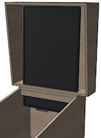
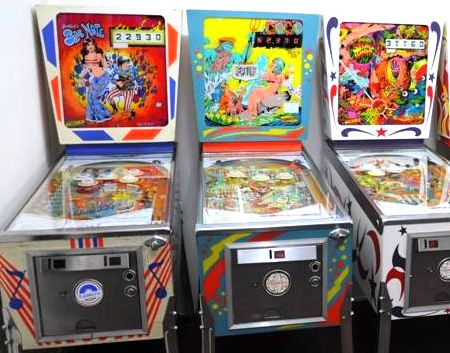

[#backboxTV]
= Selecting a Backbox TV

Most virtual cabs use a TV to simulate the backglass artwork of the real pinball machines.
The backglass art is a distinctive and universal feature of pinball, and an important part of the aesthetic, so it's a must for most cab builders to replicate it in our virtual systems.
It also serves a practical purpose, in that it's where many games display the score.

This chapter will try to help you design your backbox layout and pick a TV for it.
We're just in the planning stages here; we'll get into the details of actually installing everything in xref:backboxTVInstall.adoc#backboxTVInstall[Backbox TV Mounting] .

== Choosing the right backbox TV

If you've just gone through the xref:playfieldTV.adoc#playfieldTV[Selecting a Playfield TV] chapter, you're probably exhausted from thinking about all the complex technical criteria that go into picking the right TV for your main cabinet.
Fortunately, the backbox TV is a lot less demanding in terms of tech specs.

Really, the only important factor in choosing a backbox TV is size.
You have to pick a TV that will fit in your backbox and fill the space it's supposed to cover.
Most of the rest of this chapter is devoted to helping you decide what type of backbox layout you'd prefer, and to helping you determine the right TV size for your selected layout.

You can mostly ignore the rest of the technical factors that are so important to the playfield TV.
The backglass area isn't part of the physical action in a real pinball machine, except a handful of tables with extremely novel designs, and even for those it's only a very small part of the action.
For most games, it's mostly decorative, and shows mostly static images.
So it's not all that important to find a TV with fast motion rendering or low input lag.

You don't even need a very high-res monitor.
Most people find that a 720p TV is perfectly fine for the backbox TV.
The backglass artwork from real pinballs is mostly hand-painted graphics, and that kind of source material tends to look good even on lower resolution displays.
The main picture quality features I'd look for are good black levels and color accuracy; those are more important than pixel resolution for cartoon graphics.
Also consider viewing angle, so that the image doesn't fade too much when you're standing off to the side.

== Virtual backglass options

There are two very different ways that you can set up your cab's backglass TV.
Before you start picking out a TV, you should decide on one of these configurations, since it will determine the TV size you need.

The two options are commonly known as the *two-monitor* and *three-monitor* configurations.

The *three-monitor setup* mimics the physical layout of real pinballs made from about the mid 1980s.
That's when the real machines started using a "speaker panel", a separate section at the bottom of the backbox containing the score display and speakers.
Nearly all pinballs made after about 1984 used this arrangement.

For virtual pinball, this is called the "three-monitor" setup because it means you'll have a total of three video displays in your cabinet: the main one for the playfield, the TV in the backglass area, and a small monitor in the "DMD" (dot matrix display) area.
The third monitor can be a small TV or laptop display, or it can be an actual pinball score display device just like the real 1990s machines used.

Most virtual cab builders creating full-sized cabinets use the three-monitor setup.
It provides the most realistic rendition of modern games that had speaker panels in the real machine, and it also gives you a good place to put the audio speakers (which is one of the big reasons the real machines adopted this design in the first place).

The *two-monitor setup* dispenses with the speaker panel and uses a single large monitor to fill the whole backbox.

The advantage of the two-monitor design is flexibility.
Classic tables from the 1960s and 1970s had larger backglasses that filled the entire backbox area, and the full-size monitor lets you display these older backglasses more realistically.
A three-monitor setup has to squeeze the older, taller backglasses into a shorter area, which can distort the artwork.
And you can still play modern games that had speaker panels originally, since the software can display a graphic rendition of the speaker panel on the screen.

Two-monitor setups are less common in full-sized virtual cabs, but you might be drawn to this design if you're especially fond of older tables from the "EM" (electro-mechanical) era.
The artwork on those older tables can't be displayed as nicely on a three-monitor setup.

To help you decide, let's look at how various generations of real machines configured their backboxes.

== Backglass styles through the years

Early pinballs displayed the score by lighting up individual point counter lights on the backglass.
Pinballs in the 1960s and early 70s used mechanical score reels, which were positioned in little windows in the backglass art.
These changed to 7-segment digital displays (similar to early pocket calculator displays) in the mid 70s, but they kept the same basic layout, with the digital displays positioned in the same little windows in the artwork that the mechanical reels had occupied.

Examples of pinball score display styles through the ages: point value lights (1940s-50s); mechanical reels (1960s); 7-segment digital displays (1970s-80s); dot matrix displays (1990s)

The biggest change came in the late 1980s, when Williams split the backbox between the glass artwork and a separate speaker/display panel.
This arrangement had some major advantages, so it quickly became the standard.
For one thing, it provided a good place for speakers.
Pinball makers were doing everything they could to keep up with the competition from video games, and part of that was replacing the old bells and chimes from the electro-mechanical days with digital sound effects.
Hiding the speakers inside the cabinet didn't make for very good acoustics, so Williams decided to dedicate some of the backbox area to speaker grilles.
That meant sacrificing some of the artwork area.

Early examples of the split design with separate backglass and speaker/display panel (1987).
The lower panel is a separate piece that contains the score displays and a pair of speakers.
These early games used 14-segment alphanumeric displays; later games used a single large 128x32 dot matrix display.

== The three-monitor configuration in detail

Most people building full-sized cabs opt for the three-monitor setup.
Part of the reason is practical.
It's easier to make everything fit, it gives you a good place for the speakers, and it's easier to find a suitably sized TV.
The other part is the aesthetics: it looks more like a real machine from the modern era.

You'll probably gravitate towards this design if you're generally more interested in modern tables than classics from the 1970s or earlier.
This is also the most straightforward design if you plan to use a dedicated dot matrix display (DMD) device, since it replicates the setup of the real pinball machines that used those devices.
It would be possible to fit a DMD somewhere else if you really wanted to, but the main motivation most people have for using a real DMD in the first place is to make the cab look more authentic, so unconventional placement would somewhat defeat the purpose.

Standard three-monitor setup, with TV for backglass and separate display for DMD area.
The third display can be a small TV or laptop display panel, or it can be a real pinball DMD device.
The clear glass or acrylic cover in the shape of a standard translite is optional; it's there to better replicate the appearance of a real machine, and to help hide the edges of the TV, which won't quite perfectly fill the space.

A 16:9 TV is a close (but not perfect) match to the standard proportions for modern translites.
It leaves just a little extra space above and below.

The three-monitor setup is great for reproducing the backglass art for modern machines that had the speaker panel setup in real life.
It's not as good for older machines without speaker panels, since their backglass art was almost square.
Displaying square artwork on a 16:9 TV requires a vertical squeeze to make it fit.
This distorts the geometry a bit, as illustrated below.

Original proportions of classic backbox artwork (left); squeezing it onto a 16:9 monitor (right)

As you can see, full-height artwork is a little distorted by the vertical squeeze.
I'm personally not too bothered by it on my own three-monitor setup, but then again I mostly play newer tables.
If you play a lot of older games, and you think the distortion would really bother you, you might consider the two-monitor option described later in the chapter.

=== Sizing the TV

The standard size of a modern backbox is about 27" by 27" on the inside.
This leaves room side-to-side for about a 30" widescreen TV.
Unfortunately, it's not possible (currently) to buy a 30" TV.
The closest options I've seen are 28" and 29".
If you can find a 30", it should be a perfect fit, but failing that you should look for a 29" or 28".

The next size up is 32", but this is too wide for a standard backbox.
(You can't even fit a 32" with kludges like thinner side walls or routed slots in the side walls, since most 32" TVs are a hair wider than the _outside_ dimensions of a standard backbox.) The only way to make a 32" fit is to build a custom backbox that's about two inches wider than standard.
For some cab builders, it's worth doing this to get a perfect fit to a common TV size.
If you go this route, keep in mind that you'll also need to a custom speaker panel and translite to match the special width.

The proportions of the standard translite space are approximately 16:10 (width to height).
That's very close to standard 16:9 TVs - just a hair taller.
Some computer monitors come in 16:10 ratios, so you might check to see if you can find something like that in the 29" or 30" range, but it's unlikely.
Fortunately, 16:9 is so close to the real aspect ratio that you don't have to worry about distorted geometry in the artwork.
The only reason to prefer a 16:10 monitor is that it would more completely fill the available space.

=== Score panel options

The three-screen configuration obviously requires that third screen, in the score panel window in the speaker panel.

This third screen can be another video display, or it can be a dedicated DMD (dot matrix display) device like the ones used in the real machines from the 1990s.
Furthermore, it can be _exactly_ like the ones used in the 1990s - specifically, a certain type of monochrome plasma display, which is still being made - or it can be a similar device with the same pixel layout that uses LEDs instead of plasma.

We'll look at in detail in the next chapter, xref:dmdDevice.adoc#selectingDmdDevice[Selecting a DMD Device] .

== The two-monitor configuration in detail

So far, we've only looked at the "three-monitor" setup.
Way back at the top of the chapter, we said that there was another option, _without_ the speaker panel, where you use one large TV to fill the entire backbox space.
This is known as the "two-monitor" configuration, because you end up with two TVs in your system (one for the main playfield, one for the backglass).
Let's finally take a look at this alternative.

This is arguably the more flexible option, although it's also the more difficult of the two to set up.
It's more flexible because it does a better job at reproducing older machines with full-height backglasses at the correct proportions, but it doesn't leave out the newer machines either, since it can show a newer machine's speaker panel "virtually" with on-screen graphics.
The virtual rendition of a speaker panel obviously can't look quite as realistic as an actual speaker panel, but it does the job.
If you're a big fan of classic tables from the electromechanical era, where the backglass art filled the whole backbox space, you might be willing to live with the fake speaker panels on modern machines in exchange for proper artwork proportions on classic tables.

But there are some major drawbacks.
One is that it doesn't leave room for speakers.
The real pinball makers adopted the separate panel design in part because it allowed the speakers to be exposed, which makes them sound better.
You'll have to find another place for your speakers if you go the two-monitor route.
You might be stuck (as the older real machines were) with placing the speakers somewhere inside the cabinet, which might somewhat reduce the audio quality.

The other big challenge is that it's impossible to buy a TV with exactly the right proportions to fit a backbox.
The modern standard backbox is roughly square, about 27" wide by 27" tall (on the inside).
Virtually all TVs and computer monitors sold today have 16:9 aspect, and the ones that don't are mostly even wider.

The solution that most two-screen cab builders use is to turn the TV sideways, so that the long dimension is vertical.
This will make the TV too tall for the backbox, but you can cut an opening in the floor of the backbox and tuck part of the TV through the opening and into the main cabinet.
This is illustrated below.

Typical two-monitor setup.
The TV has to extend into the cabinet through the "neck" in order to fit vertically.

Proportions of the display in a two-monitor setup.
The monitor can't fill the whole width of the backbox because it has to fit through the neck into the main cabinet.

You should be aware of a big drawback of this arrangement: you won't be able to fold the backbox down without removing the TV.
On real pinball machines, the backbox is designed to fold down so that it lies flat on top of the cabinet, to allow for easier transportation.
With the TV arranged like this, you'll have to take out the TV if you want to fold down the backbox.
And you really should fold it down before transporting it, because there's a big risk of breaking something during transport with the backbox up, due to its weight and the leverage it has in that position.

===  TV size

Considering only the backbox inside width of 27", the ideal set would be about 53".
But that won't work because of the need to tuck the end of the TV into the main cabinet.
So your actual size constraint is the main cabinet width.
This means that *your maximum backbox TV size is exactly the same as your main playfield TV size* .
For a standard width cabinet (20.5" inside width), you can use a 39" or possibly a 40" TV; for a widebody cabinet (23.25" inside width), you can use a 45" TV.

This will leave some leftover space on either side of the TV if you use the standard modern backbox dimensions.
You could simply fill this area with a black border or decorative graphics.

There's another alternative, though.
If you're enough of a fan of older EM machines to want a two-monitor setup in the first place, I'd suggest adjusting your cabinet plans to use a narrower backbox to fit the monitor.
This will actually make your whole cabinet better fit the classic theme, since narrower backboxes were common until about the early 1980s.
For example, the classic Gottlieb "wedgehead" style of the 1960s had backboxes about the same width as the cabinets.
A 39" TV will fit these backboxes perfectly.

