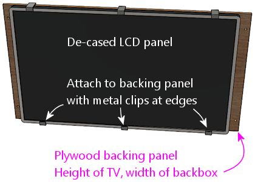
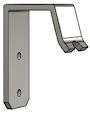
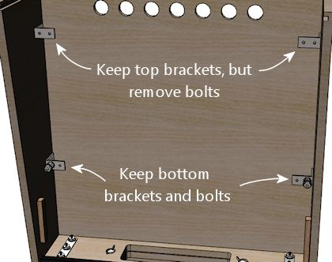
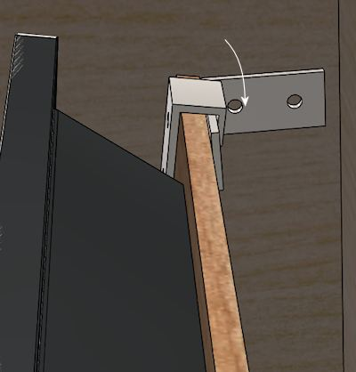
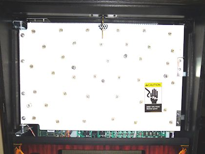
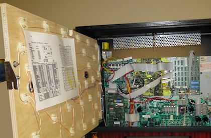

= Backbox TV Mounting

Continuing the theme of installing our TV screens, we turn now to installing the backbox TV.

== Positioning the TV and light-sealing

I recommend positioning the TV so that it's centered in the space above the speaker/DMD panel.

[.center]

If you're using a translite cover, I'd try to position the front surface of the display so that it's flush with the translite, or as close to flush as you can make it. That will make it look very much like the artwork is being displayed on the back of the glass/acrylic, which looks just like the real thing.

On my machine, I put strips of black felt around the perimeter of the display bezel (fastened with double-sided tape). This lets the translite be right up against the monitor face without too much risk of scratching it, and it also forms a nice light seal around the perimeter.

== The Jersey Jack Pinball approach

The WPC-era machines didn't have anything resembling a full-sized TV in the backbox, so there's nothing we can directly adapt from their design or hardware to mount the TV. But if we widen our scope beyond the post-WPC era, we can find one example from the real pinball world that's very similar. Jersey Jack Pinball, maker of _Wizard of Oz_ (2013), _The Hobbit_ (2016), and a few other titles, uses a 27" LCD panel in the backbox in place of the WPC-era DMD. They even install a translite (with a cutout for the TV) in front of the panel, so it's almost exactly like the typical virtual cab setup. The only difference is that they place the panel at the bottom of the backbox, whereas we typically place it near the top, so that we can also put a traditional DMD-sized display in the speaker panel area. But that difference in placement doesn't affect the mechanics of the mounting.

Their approach to mounting the panel is straightforward. They start with an uncased OEM display panel, and mount it to an MDF backing board with metal clips around the edges. For a virtual cab adaptation, I'd use plywood instead, since it's stronger and lighter.

The backing panel is cut to the height of the panel, so that you can easily fasten it with clips as shown. The width is the same as the inside width of the backbox.

In the backbox, they install metal "L" brackets along the side walls.

These can simply be screwed into the backbox walls with wood screws. The overall weight of an uncased panel plus plywood backing board should be under 10 pounds, so each corner clip only has to support a couple of pounds. So we don't need super-strong hardware here.

To facilitate installing the panel, pre-install a bolt in each bracket, with the end pointing forward as shown below. Secure each bolt with a lock nut.

Drill holes in the plywood backing to match the positions of the pre-installed bolts. Installing the TV is now just a matter of fitting the backing panel onto the bracket bolts. Secure it in place with another set of nuts on the outside.

image::images/backbox-tv-jj-5.png[alt="Diagram showing nuts securing backbox monitor"]

Some notes on this approach:

* When constructing the backbox, *don't* install the upper (15") translite guides. Those would get in the way of inserting and removing the TV panel. See "Translite/DMD guides" in xref:cabBody.adoc#transliteGuideTrim[Cabinet Body] .
* You might replace the outer nuts with wing nuts, so that the TV can be installed and removed without tools. Better still would be some kind of quick-release latches - if you have any concrete ideas along those lines, let me know and I'd be happy to add pointers here.

=== Adapting to a TV still in its case

This design works well with a bare, uncased LCD panel, but it requires some changes if you're leaving the TV in its plastic case.

First, use the TV's VESA mounting holes on the back to attach it to the plywood base, instead of the edge clips. You just need four M4 screws long enough to go through the plywood (probably 20mm to 30mm).

Second, with the added depth of a full case, it might be too cumbersome to reach behind the monitor on the sides to fasten and unfasten the nuts that hold it in place. So I'd move those so that they're above and below the TV, where you'll have a little more room to work.

=== Further improving the design

Even with the bolts moved vertically above and below the TV in the revised plan above, I think it's going to be a little cumbersome to fasten those top bolts. The space above the monitor is quite tight with a 28" display.

So I think the next step in improving this plan would be to substitute some type of hanger hook at the top, such as a heavy-duty picture hanger or "J" bracket. Or perhaps better yet, the latch bracket used on the speaker/DMD panel (Williams/Bally 01-8535), which is designed for this exact function with the speaker panel.

The bottom bolts are easy enough to access that we can keep those.

The new installation procedure would look like this:

* Tilt the monitor back slightly and fit into the hanger hooks at the top

* Lower onto the hooks

* Tilt the bottom onto the bottom bolts

* Fasten the nuts on the bottom bolts

I used a mounting similar to this on my own cab, and it works pretty well. This should give you a little more than an inch of clearance behind the TV for installing a replay knocker and EM-style shell bells. You'll be able to access those devices for service if necessary, since the TV can be removed fairly easily.

== Fixed mounting

Another, easier way to mount a TV in the backbox is to more or less build the backbox around the TV. You get the TV situated and bolted down while the backbox is still being assembled, and then you finish installing the remaining backbox walls.

There are different ways to go about this, but I've seen people use procedures something like this:

* Start by building the backbox _without_ its back wall
* Cut a piece of plywood to the interior dimensions of the backbox
* Fasten the TV to the plywood (via its VESA mount, for example)
* Fasten the plywood to the side walls at the desired depth, such as via "L" brackets or corner braces
* Install the back wall of the backbox

If you've read much else in this guide, you can probably guess that I don't recommend any approach that would make it difficult to remove the TV later. If you have to wait to finish the backbox assembly until the TV is installed, you're going to have to reverse those last assembly steps if you ever want to remove the TV, and that could be difficult and destructive.

An argument could be made that it's okay that you can't remove the TV, because why would you ever need to? Modern consumer electronics tend to keep going for years and years without trouble. That's usually true, but not always, plus it ignores the possibility that you might need to access or remove the TV for some reason other than repair: upgrading it to a newer model, say, or changing which video plugs you're using.

There's also a potentially bigger problem: it'll be impossible to access anything installed _behind_ the TV without taking the back off the backbox again. There's at least one part commonly mounted behind the TV that you might at some point need to repair: the replay knocker. This isn't a hypothetical risk, either. I've talked to a couple of people on the forums who had to do major surgery - including taking out nails and glue - to replace a dead replay knocker. So I really strongly advise against any design that would seal up any important components behind barriers that you can't remove, such as a TV with a fixed mounting.

If you are using a fixed mounting, then, you might want to do one of the following:

* Don't install anything behind the TV in the first place, so you'll never need to get back there. Treat the space behind the TV as a forbidden zone that no parts can set foot in. This solves the access problem, but you give up some prime real estate in the deal.
* Make the back wall removable, or build a big door into it. This restores access, but at the cost of significantly weakening the backbox. The fixed back wall is a key structural component.

I don't like any of these trade-offs, so I just wouldn't use a fixed mounting like this.

== Ideas from the real pinball world

What follows isn't a how-to plan, but just some food for thought. I'm hoping someone can take the ideas here at some point and turn them into a workable implementation plan. For now, though, these are just some ideas.

The WPC-era machines didn't have anything quite like a backbox TV that we can adapt in terms of mounting hardware, but they did have something analogous that at least provides an interesting idea for how a TV mounting might function.

The WPC machines have something called a "backbox insert", which is a sheet of plywood directly behind the backglass, holding the little light bulbs that illuminate the artwork. This is _exactly_ where our backbox TV goes, so it's worth looking at how they installed this.

Backbox insert: a sheet of plywood installed just behind backglass. The little spots scattered around are the lamps that back-light the artwork.

On the WPC machines, all of the control electronics are mounted inside the backbox, so you obviously have to be able to move the insert out of the way for service work. The WPC design made this really easy. You don't have to disassemble anything or even remove the insert. It's attached with hinges on the left side, so you just swing it out of the way like opening a door.

Backbox insert in open position. It's hinged on the left side so that it can swing open like a door, to provide access to the electronics installed behind it.

It would be great to be able to do the same thing with a TV - just swing it out of the way when necessary, without even having to unplug any video cables.

I'm afraid I don't have a How To plan to offer here to accomplish this, though. My first thought would be to try to adapt the original insert hinge hardware they used on the WPC machines, but those won't work for a TV; they have the wrong geometry for anything deeper than a sheet of plywood, and I don't think they'd be strong enough for a 10-15 pound TV on a long lever-arm like this.

My next thought would be to look for some generic hardware that could do the same thing, but I haven't found any. The sticking point is the depth of the TV. To make the geometry work, we need to place the pivot point at the front corner of the TV, and that means that the TV itself has to be mounted on an articulated platform. To use the TV's VESA mounting, this has to articulate by the depth of the TV. The apparatus would have to look like this:

I think this can be done in principle, but I don't have a concrete proposal for how to build it. I'm not sure how to make a TV platform in that shape that would be strong enough. I don't think plywood is strong enough, given that the full weight of the TV has to be supported at that back left corner (in the illustrations). It might also be challenging to find suitable hinges, although that's probably just a matter of some legwork on Amazon, as there are lots of pivot hinges available; there's probably something strong enough in the right size.

If you can come up with a mechanism that would accomplish this with generic hardware, please let me know! I'd be thrilled to be able to include it in this guide. But for now, I'm going to say that a hinged mechanism isn't practical for our purposes here.

