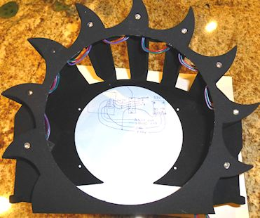
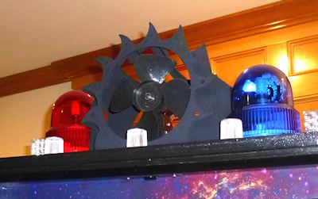

= Fans

At least two real pinball machines featured fans mounted on top of the backbox: _Whirlwind_ (Williams, 1990), _Twister_ (Sega, 1996). Two titles might seem like an awfully skimpy reason to include a fan on a virtual cab, yet this has become one of the more popular toys, and I'd highly recommend it. The reason? Fans are uniquely tactile. They add a completely new sensory effect to the playing experience.

As you'd expect, the DOF database replicates the authentic fan action in _Whirlwind_ and _Twister_ . Including a fan on your cab will make those games that much closer to the original. Now, if that were all the use you'd get out of a fan, it probably wouldn't be worth the trouble unless you had a rather fanatical devotion to one of those specific games. Fortunately, that's far from the only use your fan will see. The DOF database is programmed to trigger the fan in dozens of games - 41 as of this writing.

I really like the fan effect and the way DOF uses it, and I think most pin cab builders who've included them would agree. I rank this toy near the top of my priority list. It's a lot like the shaker motor in terms of its effect on game play: it just makes the game feel more exciting and immersive.

== Auto/boat fans

The easiest way to add a fan is to use an off-the-shelf fan made for use in cars or boats. These can be found in the right size range to fit nicely on top of a backbox (about 6" diameter), and anything made for a car or boat will run on 12V DC, which means you can power it from a secondary ATX power supply. Search on Amazon for "car boat fan" to find options.

== DIY

For my own cabinet, I wanted something that looked more custom, to fit with my cab's artwork, analogous to how _Whirlwind_ 's fan enclosure is shaped like a storm cloud. I started with a bare fan assembly, just the fan blade and motor, and built my own custom 3D-printed plastic enclosure around it.

My DIY fan assembly. A run-of-the-mill 12VDC motor with a 1/4" shaft, with a 6" plastic fan blade press-fitted onto the shaft, mounted on a makeshift wood and sheet metal bracket. The blade is the same one that Williams used for *Whirlwind* , which happens to be an OEM part for microwave ovens (!).

My 3D-printed fan enclosure (in the wiring stages, installing LEDs around the perimeter).

The fully assembled *Pinscape* fan.

If you want to go the DIY route, there are a couple of ways to get a bare fan assembly to use as the core. One is to buy a car/boat fan like above and remove its case. Another is to build your own entirely DIY fan assembly from parts.

The completely DIY approach is probably easier. It's certainly more predictable; you never know with a pre-assembled fan if it'll be possible to remove the case without destroying the whole thing. To build a fan from parts, you really only need two pieces, both of which are easy to find:

* A 12V DC motor with a 1/4" shaft. You don't need anything particularly special; most 12V motors will have plenty of power to run a fan. Look on eBay, Amazon, or robotics hobby vendors.
* 
A blade. The original Whirlwind fan, amusingly enough, was actually an OEM part for microwave ovens (Thorgren model number 6C2504C1). It's plastic, has four blades, and a 1/4" bore, like the one pictured at right. You might be able to find that exact part on eBay or appliance parts vendors, but there's really no need unless you have a special fondness for _Whirlwind_ in particular. You can find any number of similar appliance fan blades on eBay by searching for *6" fan blade* . Look for blades with a 1/4" bore, as these will easily press-fit onto a 1/4" motor shaft.

You'll also need to build a bracket to attach the motor to the backbox. You should be able to improvise something if you have some minimal woodworking skills. (You'd need to build this part even if you're re-purposing an auto/boat fan, so I didn't count it in the "two pieces" I said you needed for a fully DIY fan.)

== In-cab blowers

A few pin cab builders have built fans into the cabinet body rather than putting it on the backbox. One technique mentioned on the forums was to use an air duct to to route air from a small fan through an opening in the coin door. (One potential opening to use for this: the dollar acceptor slot. Newer coin doors made for the US market tend to include a large square opening intended for dollar bill acceptors.)

Here's a particularly amusing take on this theme:

link:https://pinside.com/pinball/forum/topic/heavily-modified-whirlwind-topper-fan-this-is-a-must-see.html[Heavily modified whirlwind topper fan] ( link:https://pinside.com/[Pinside] pinball forums)

I personally like the effect of the fan blowing at you from the backbox, but at least one person who built the coin door version commented on the surprise value of the sneaky placement.

== Wiring a fan (DC voltage)

Assuming you're using a 12V DC fan or motor, you can power the fan from the +12V terminal (yellow wire) of your secondary ATX power supply. See xref:powerSupplies.adoc#powerSuppliesForFeedback[Power Supplies for Feedback] .

Connecting the fan is just like any other feedback device:

Connect one terminal of the fan motor to the +12V from your secondary ATX power supply. Connect the other terminal to an available port on your output controller.

The diode is required to protect your output controller and computer electronics from interference from the magnetic field generated by the motor. See xref:diodes.adoc#coilDiodes[Coil Diodes] .

If you're using an LedWiz, don't connect the fan directly to the LedWiz. Fans use too much power for an LedWiz, so you'll need some kind of booster circuit. If you're using the Pinscape expansion boards, you can connect the fan directly to any MOSFET Power Board port.

=== Electrical interference

Be sure to use a diode with the motor, as shown above. If you still get electrical interference when it runs (for example, USB devices randomly disconnect, or you see random keyboard input on the PC), you might need to add more filtering. The two-inductor filter described for the shaker should work equally well with a fan motor. See "Electrical Interference" in xref:shakers.adoc#shakerElectricalInterference[Shaker motors] for the wiring and parts details.

== Wiring a fan (AC voltage)

If you're using an AC-powered fan, *don't* connect it directly to an LedWiz, Pinscape controller, or any other solid-state controller. You'll need a relay for this instead. If you're using a Sainsmart relay board, the outputs on those are in fact relays, so you can connect an AC device directly. For LedWiz and Pinscape, you'll need to add a relay to the circuit: your output controller will control the relay coil, and the relay will control the AC motor. See "AC devices" in xref:feedbackWiring.adoc#ACFeedbackDeviceWiring[Feedback Device Wiring] for the wiring plan.

== DOF Setup

In the link:https://configtool.vpuniverse.com/[DOF Config Tool] , go to the Port Assignments page. Find the port number where you wired the fan. Assign it to "Fan".

At the right side of the page, you'll also find a section labeled "Fan" that lets you set the intensity range. If you're using a PWM-capable controller (e.g., an LedWiz or a Pinscape power board), this lets you set the range of power that DOF uses when the fan runs. The intensity values are on a 1-48 scale, where 48 is the highest power. The default settings use the full available range. If you find that the fan is too powerful (runs too fast) when DOF activates it during game play, you can reduce the maximum intensity setting to slow it down. Similarly, if the fan seems too weak some of the time, you can raise the minimum setting.

