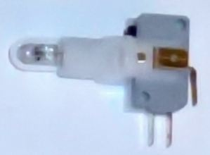
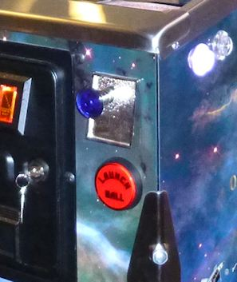
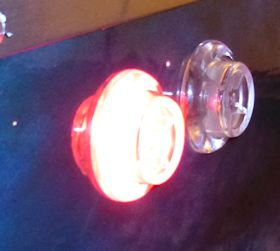

[#buttonLamps]
= Button Lamps

Most of the buttons on a pin cab can be illuminated. Any button with a lamp can have the lamp controlled by software, too, so that the button lights up, turns off, blinks, and fades in and out when appropriate.

Examples of illuminated buttons on a pin cab:

* The Start button on a newer (1990s+) machine usually lights up when a new game can be started, and sometimes blinks
* The Launch Ball button can light up or blink when a ball is ready to launch
* Some machines have an Extra Ball button that lights up when the "buy-in" feature is available
* The flipper and Magna Save buttons can be illuminated and can be set up to show different colors for different games, to match the original flipper button colors of the arcade versions
* The coin slots in most coin doors are illuminated

Button lights are optional, but most cab builders include them because they make the machine seem more alive. And controlling the buttons through software is also optional (you can just hard-wire them to be constantly on instead), but most cab builders want them actively controlled, since that makes the machine more interactive and more realistic.

If you're not sure what all of the buttons are for, see xref:cabButtons.adoc#cabinetButtons[Cabinet Buttons] for more detailed descriptions of the various button types commonly found on virtual cabs.

== Hard-wired vs software controlled

Some pin cab builders simply wire all of the button lamps so that they're always on. That's the easy way to do it, certainly, but most cab builders want the software to be able to control each of the buttons, so that they only light up when appropriate. To do this, you need to think of the button lamps as output devices, just like shaker motors and solenoids.

If you wire the button lamps to your output controller, DOF can control them in sync with the game action, just like other output devices. All of the common buttons are specifically supported in the software, so all you have to do is set up your DOF configuration so that DOF knows which output controller port is connected to each button lamp (the Start button lamp, Launch Ball button lamp, etc).

== What controls the lights?

A lot of new pin cab builders have a hard time picturing how the lighted buttons get wired for software control. The thing that's confusing is that these devices are both buttons _and_ lights. You're going to have to wire the buttons to a button input encoder device... so does that mean that the input encoder also controls the button lights? No.

The right way to think about this is to picture the button's switch and the button's lamp as completely separate devices. Then it's easy to see what connects to what:

* The switch connects to the key input encoder, just like any other button
* The lamp connects to the output controller, just like any other feedback device

This isn't just a convenient way of thinking about it, either. It's literally what's going on. The switch part and the lamp part are separate devices electrically. They're not connected to each other in any way in terms of wiring. They just physically occupy the same plastic housing. That makes it _look_ like a single combined device, but it's really two devices inside one piece of plastic.

== RGB or plain white?

Quick summary: plain white for the front panel buttons; RGB for the flipper and Magna Save buttons.

The front-panel buttons (Start, Exit, Launch Ball, etc) typically use plain white lamps, because the DOF config tool only provides monochrome settings for them. You _can_ install RGB-capable LED lamps for these if you wish, but most people don't bother because of the lack of DOF support.

There's nothing technical stopping DOF from supporting RGB for the front panel lights. The only reason it doesn't is that there hasn't traditionally been any demand for it. This could change one day if enough people thought it was desirable.

DOF does provide full color control for flipper and Magna Save button lights, so if you install those, you should use RGB LEDs.

There's one other button where you might want to install RGB illumination: the lockbar Fire button, if you have one. DOF doesn't have RGB support for the Fire button lamp as of this writing, but there's at least one real machine that uses RGB lighting for it (Stern's _Star Trek_ , 2013), so it seems like one that DOF should add in the future. Installing an RGB LED in your cab would be good future-proofing. You could also use it immediately by setting it up as a "Custom RGB" device in DOF, but that would require some extra work on your part to program the DOF Config Tool with the desired effects for each game.

(What does it actually mean for DOF to support RGB vs monochrome for a given output? In terms of hardware, full-color lighting is accomplished with a three-component LED: an LED with individually controlled elements for red, green, and blue light. The three color elements have to be controlled separately, so they require three output ports on your output controller for the single lamp. For example, if you have an RGB flipper button, your flipper button requires three separate output controller ports: "red flipper light", "green flipper light", and "blue flipper light". To use this with DOF, DOF has to think of the "flipper light" output as consisting of those three separate channels, so that it can generate the separate signals to control the relative brightness of the three ports. The DOF software itself is indifferent to this; it just thinks about the individual output ports. But the DOF Config Tool _does_ know about it. The Config Tool has special handling for RGB devices that groups three consecutively numbered ports together into an RGB group, so that "RGB flipper button" really translates into the three output ports on your controller: red flipper button, green flipper button, blue flipper button. The Config Tool is inflexible about this; some devices are pre-ordained as RGB and the rest aren't. There's no way for you as a user to change that; it's up to the guy who runs the Config Tool. So when I say that "DOF" doesn't support RGB for the front panel lights, what I really mean is that the Config Tool doesn't have RGB definitions for the front panel lights. It assigns them as single-port = monochrome devices.)

== Basic wiring plan

Keeping in mind that we're really working with two separate devices combined into one housing - a lamp, and a switch - the wiring plan is simply a combination of the generic wiring plan for any output device (the lamp) and the generic wiring plan for any button (the switch).

== Start, Exit, Extra Ball

These buttons are typically installed on the front panel, usually on the left side of the machine.

The standard part used on real machines (from the 1990s and later) is known as a "small round pushbutton with lamp", made by SuzoHapp, part number D54-0004-2x (the last digit is a color code). If you're searching at a pinball parts vendor (Pinball Life, Marco Specialties), look for Williams/Bally reference number 20-9663.

These buttons are socketed for #555 incandescent bulbs, which run on 6.3V and require about 250mA. If you buy from a pinball parts vendor, the button will usually come with a #555 bulb installed. The pinball parts vendors also sell plug-and-play LED replacement bulbs that fit the same socket.

*Labels:* If you buy your buttons from a pinball parts vendor, you can find buttons that come ready-made with labels for "Start", "Extra Ball", and a few other options. You can also buy blank buttons (with no labels) and install your own labels. You can print a label with any custom text you want using a laser printer and transparency film. To install a new label, you have to pry the plastic lens off of the button, remove any label already installed, insert your new label, and snap the lens back on. This is described in more detail in xref:cabButtons.adoc#cabinetButtons[Cabinet Buttons] .

*Identify the terminals:* The first time you look at one of these button-plus-lamp assemblies, it can be a little daunting, because they have so many prongs sticking out. It's easier if you keep in mind that the base of the assembly is really just a standard microswitch, with a lamp socket bolted on top:

When you look at it that way, it's pretty easy to pick out the terminals for the switch portion and the added terminals for the lamp portion.

WARNING: The "Common" and "NO" (Normally Open) might not be positioned exactly as shown above for your switch. Double-check the markings on the switch to be sure before connecting anything. See xref:cabButtonWiring.adoc#buttonWiring[Button Wiring] for tips on reading switch markings.

This is even easier to see if you take the button housing off. To do this, gently twist the bottom switch portion slightly until it comes loose, then pull the switch housing away from the base.

Now you can see more clearly the way the lamp is tacked on to a normal microswitch.

*Wiring:* Once you've identified the two terminals for the lamp, connect them to your output controller following the basic wiring plan above.

Incandescent bulbs aren't polarized, so there's no "+" or "-" to worry about; the two terminals are interchangeable. (LEDs _are_ polarized as a rule, but nearly all of the #555 replacement bulbs are specially designed to work with either polarity, since they're designed to replace incandescents in existing machines.)

Connect one lamp terminal from the button directly to the "+" voltage from the power supply. You can use 5V, but for the incandescent bulbs, it's better to use 6.3V, which is the voltage they're designed for. See below for more on that.

Connect the other lamp terminal from the button to an available port on your output controller. Each button lamp requires its own separate output port, so that each lamp can be individually controlled.

*DOF setup:* The link:https://configtool.vpuniverse.com/[DOF Config Tool] has entries specifically for the common front-panel buttons. On the Port Assignments page, assign the appropriate ports to the function that matches the button type:

* Start Button
* Extra Ball
* Exit
* Fire Button

See xref:cabButtons.adoc#cabinetButtons[Cabinet Buttons] for more detailed descriptions of the button types.

*6.3V supply:* Incandescent #555 bulbs are designed to run on 6.3V. That's not a voltage you'll find on a PC ATX power supply, so many pin cab builders use the 5V ATX output, since it's reasonably close. That works, but the bulbs will be noticeably dimmer at 5V than they're meant to be, which might make your button illumination look a little sad. If you're using LED lamps, on the other hand, the voltage won't noticeably affect the brightness, so 5V is fine.

If you want to add a 6.3V supply, an easy way is to buy a "DC-to-DC step-down voltage converter". These are inexpensive (under $10 on eBay) and easy to set up. If you buy one on eBay, look for the type with a variable output voltage, so that you can dial the desired 6.3V. Alternatively, link:https://pololu.com/[pololu.com] offers a high-current converters with a 6V output, which is close enough; that's a little easier since it doesn't require adjusting the voltage.

To connect:

* Connect 12V (yellow wire) and Ground (black wire) from your secondary ATX power supply to the step-down converter's (+) and (-) input terminals
* If your converter has an adjustable output voltage, adjust it to 6.3V, using a voltmeter connected to the output terminals to measure it (you'll need to apply the power during this step)
* Turn off power
* Connect the converter's (+) output to one terminal of each 6.3V #555 lamp
* Connect the other terminal of each lamp to an available port on your output controller (following the standard wiring plan in xref:feedbackWiring.adoc#feedbackDeviceWiring[Feedback Device Wiring] )

== Launch Ball button

Several real machines from the 1990s used big round "Launch Ball" buttons in place of plungers. Many pin cab builders use the same buttons, either instead of plungers or in addition to plungers. See xref:plunger.adoc#plungerPlunger] for more on choosing whether to include one or the other or both, and where to place the Launch button if you're including one.

The standard type of Launch button is just a variation on the "small round pushbutton" type used for the Start button and the others above. The typical type is SuzoHapp part number D54-0004-1x (the last digit is a color code), which you can find at pinball parts vendors under Williams/Bally reference number 20-9663-B-4. The generic SuzoHapp type doesn't have any label text; the type sold by pinball parts companies will include a "Launch Ball" label insert.

*Wiring:* the Launch Ball button is wired exactly like the small round pushbuttons described above.

*DOF setup:* The link:https://configtool.vpuniverse.com/[DOF Config Tool] has several entries specifically for Launch Ball buttons:

* Launch Ball: choose this if your cab has _only_ a launch button, and no plunger.
* Authentic Launch Ball: choose this if your cab has both a plunger and a launch button.
* ZB Launch Ball: ignore this one. It's not for button lamps, but for something else entirely (see xref:zblaunch.adoc#zbLaunchBallZB Launch Ball] ).

Why the distinction between Launch Ball and Authentic Launch Ball? It's to accommodate different styles of cab building and different personal tastes.

The Authentic Launch Ball is designed to replicate _exactly what the original pinball machine would have done_ in terms of lighting up the Launch button. It's controlled purely by the emulated ROM, just like in the original machines. That means that it _never_ lights up at all when you're playing a table that originally used a plunger rather than a Launch button. This is the right choice if you have both a plunger and a Launch button, since the Launch button will only draw attention to itself when you're playing a game that actually had a Launch button in the original version; it'll stay dark when you're playing a table that originally used a normal plunger.

The Launch Ball button, in contrast, lights up much more often - essentially whenever there's a ball in the launch chute. This isn't true to the original games, since most original games didn't have a Launch button at all. But if your pin cab doesn't have a plunger, you'll probably prefer this, since it makes every game (even games that originally had plungers) act like the Launch button is part of the game.

== Big rectangular buttons

Some pin cab builders use a larger rectangular version of the buttons from the same family as the "small round pushbutton" type above. You can find these under SuzoHapp part number D54-0004-5x (the last digit is a color code). SuzoHapp and other arcade suppliers sell a number of other version of basically the same button in different sizes and shapes, so you should be able to find something to match the look you're going for with a little searching.

These buttons all work just like small round pushbuttons above in terms of wiring.

[#flipperButtonLights]
== Flipper buttons

You don't often see this on real pinball machines, but a nice embellishment for virtual cabs is to illuminate the flipper and Magna Save buttons.

The DOF Config Tool has support for this. A really nice touch is that the Config Tool database is pre-programmed to use RGB coloring to match the original arcade button colors for most tables. Whenever a table is loaded, the flipper buttons will light up in a color matching the plastic button color in the original arcade version. If you have Magna Save buttons, those will light up for games that originally had similar extra buttons, also using the same colors as the original arcade machines.

Virtually every real arcade pinball machine had matching colors for the left and right flipper buttons, so the DOF config tool doesn't distinguish between left and right. When you're planning your wiring, you should simply connect the left and right flipper button lights to the same output ports. In contrast, machines with extra flipper buttons often were asymmetrical about it (usually, the asymmetry was simply that an extra button was installed on one side only rather than on both sides), so the DOF config tool does distinguish between left and right Magna Save outputs. If you can spare the additional output controller ports, you should wire the left and right Magna Save buttons to separate ports, so that they can be controlled independently.

Be sure to use RGB LEDs for these lights, so that DOF can control the color.

*Parts:* For full-color flipper button lights, you need either a clear plastic button or a translucent white plastic button. I much prefer the completely clear type because they're a lot brighter, and they look more interesting to me. Some people worry that clear plastic wouldn't diffuse the light enough to make the light visible, but in fact they're really very bright, and the internal reflections in the plastic make for a pleasing jewel effect. (The picture above shows my clear plastic buttons. This is with the camera flash on, so you can get a sense for how bright they are.) Translucent white plastic produces more diffuse light but reduces the brightness.

The clear plastic flipper buttons are available in 1⅛" and 1⅜" lengths:

* Standard 1⅛" length, Williams part number A-16883-13
* Longer 1⅜" length, Stern 515-7791-00 (this is nominally sold as the "Fire" button for Stern lockbars, but it's really just a standard flipper button in the longer length)

If you bought a button kit from Virtuapin, it probably included the longer 1⅜" buttons in opaque red and white, with some neat little plastic leaf switch holders that attach directly to the buttons. Those switch holders only work with the longer 1⅜" buttons, so be sure to get the long buttons if you want to use the switch holders in your final setup.

The shorter buttons are cheaper and easier to find in clear plastic, but you can't use them with the Virtuapin switch holders. The switch holders are convenient but are hardly required - it's really not all that hard to mount the leaf switches without the holders. On my own cab (and on all of the "real" pinball machines I've seen), they're simply attached directly to the side wall of the cabinet. You'll need some kind of spacer to get the positioning right, but otherwise it's easy. See the photo below of my leaf switch mounting to see how this looks.

For the lights, there are a few options:

* DIY, using my custom circuit board design. You can find my EAGLE plans for a board that works like the Lightmite boards here:

link:http://mjrnet.org/pinscape/downloads/Flipper_Button_LED_board.zip[mjrnet.org/pinscape/downloads/Flipper_Button_LED_board.zip]

It's easy to manufacture those boards. Just go to link:https://oshpark.com/[OSH Park] and upload the *.brd* file from the download, and click through to the order page.

My EAGLE plan are designed to be drop-in replacements for the Lightmite boards, so to assemble them, follow the same instructions below for the Lightmite boards.

* Oak Micros's flipper button LED boards (no longer available). These come fully assembled with the LEDs built in, and they're compatible with the VirtuaPin leaf switch holders as long as you use the longer 1-3/8" flipper buttons. As of June 2021, I don't think Oak Micros is selling any of their products any more, but you might check the original vpforums thread for any updates:

link:https://www.vpforums.org/index.php?showtopic=43571.html[www.vpforums.org/index.php?showtopic=43571]

* Lightmite LB boards from link:https://www.nicemite.com/[NiceMite.com] . I used these for my own build and would be happy to recommend them, but unfortunately they don't seem to be available any more. The site is down as of this writing (April 2020), and although it says "Temporarily Closed", I'm pretty sure it's really gone for good because it's said that for at least six months. If they should ever come back, go with either the plain board or the assembled kit with the *manually controlled 4 lead RGB LED* . ( *Don't* buy the "auto changing" kits. Those don't allow software control over the colors.)

The assembled Lightmite boards. The LEDs stick out on the back. The leads should be bent so that the LEDs will fit into the open space around the button.

Installing the Lightmite boards. Upper left: the inside of the cabinet with the clear plastic flipper button installed. Upper right: positioning the Lightmite board. Lower left: the board in place. Lower right: with the pal nut installed, screwed onto the shaft on the back of the button.

Full Lightmite board installation, with the leaf switch back in place. Note that I used a small piece of plywood as a shim to get the leaf switch positioning right. The leaf switch has to be set off from the cabinet wall by about ¼", so you'll probably need a similar improvised spacer.

*Assembly instructions for Lightmite boards or my EAGLE plans:* Buy one board/kit per button. You need two boards/kits if you only have a pair of flipper buttons, or four if you have both flipper and Magna Save buttons.

If you buy the plain Lightmite board or use my EAGLE plans, you'll need to buy the LEDs and other electronics to populate the board. Buy the quantities listed below *multiplied by* the number of boards you're assembling.

* (2) LEDs: *common anode* (common positive lead) 5mm, 20-25mA RGB LED, such as link:https://www.mouser.com/search/ProductDetail.aspx?R=604-WP154A43VBDZGWCA.html[Kingbright WP154A4SEJ3VBDZGW/CA]
* (2) resistors for the red channel: for the LED above, 150Ω 1/8W
* (2) resistors for the green channel: for the LED above, 100Ω 1/8W
* (2) resistors for the blue channel: for the LED above, 100Ω 1/8W
* (1) 2x2 0.1" pin header
* (1) 2x2 0.1" female crimp pin housing with 4 crimp pins

The pin headers and crimp pin housings are the same types used in several places in the expansion boards; see xref:partslist.adoc#electronicPartsList[Electronic Parts List] and xref:crimpPins.adoc#crimpPins[Crimp Pins] .

*Wiring:* Connect the pins on the Lightmite boards or my EAGLE boards as labeled:

* Connect the *+* pin on the Lightmite board to +5V from your secondary ATX power supply
* Connect the *R* , *B* , and *G* pins from the Lightmite board to ports on your output controller. Each color pin connects to one port. *The ports must be consecutively numbered, and must be in R-G-B order.* For example, if you connect R to port #15, connect G to port #16 and B to port #17.
* If you have enough ports to spare, connect the left and right flipper buttons to separate port triplets so that DOF can control them separately. If you want to conserve ports, you can simply connect the left and right flipper buttons together. DOF doesn't currently distinguish left and right flipper button colors, so there's no immediate benefit to giving them separate port assignments, but connect them separately anyway if you can so that you'll be able to take advantage of any future updates if DOF does eventually separate them.
* Connect each Magna Save button (left and right) to its own group of three output ports. You can connect them together if you want to conserve ports, but separating them allows DOF to control the left and right sides separately.

*DOF Setup:* Assign the red/green/blue port group for the flipper buttons to the "RGB Flippers" device type in the DOF Config Tool. If you wired the left and right buttons to separate port groups, assign both port groups the same way, both to "RGB Flippers". DOF doesn't provide distinct left/right versions of the flipper lights, because essentially every real pinball machine used matching colors for the left and right flipper buttons in the original arcade version.

DOF does have separate left/right versions of the Magna Save buttons, because there are many examples of real machines where the left and right "extra" buttons weren't symmetrical. In nearly all cases, the difference is that an extra button was only installed on one side. In these cases, the separate port assignments let DOF leave the missing button unlit, to better replicate the original arcade setup. So in the DOF Config Tool, assign the port group for your left Magna Save button to "RGB Left Magnasave" and connect your right button ports to "RGB Right Magnasave".

== Coin chute buttons

Most people leave the coin chute lights hard-wired to constant power. If you have a separate Coin button, you can do the same thing. Even in the real machines, the coin chute lights are almost always hard-wired to stay constantly on. You _can_ wire these to DOF outputs if you really want to, and DOF provides a "Coin" output type, but there's not much practical benefit, as the standard DOF Config Tool database setting simply leaves this output constantly on, just like the real games.

If you're using a real coin door, you can find more information about how the coin chute lights are wired (and how to access that wiring) in xref:coinDoor.adoc#coinDoor[Coin Door] .

