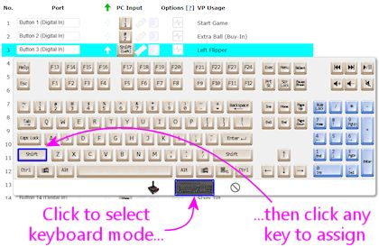

[#pinscapeButtonInputs]
= Pinscape Button Inputs

Once you have a Pinscape Controller set up, it's pretty straightforward to wire your buttons to it.

We're going to assume you've already picked out which buttons you're going to include and that you've installed them in the cabinet. If you're still in the planning stages, and you're figuring out which button functions you want to include, what products to buy, or how to install the buttons in the cabinet, see xref:cabButtons.adoc#cabinetButtons[Cabinet Buttons] .

We discuss button wiring more generally in xref:cabButtonWiring.adoc#buttonWiring[Button Wiring] , but that section tries to cover all of the different key encoder options, so it's a little less concrete than this chapter. This chapter tries to give you a quick How To guide specifically for Pinscape Controller button wiring, so it should be a little less work to read through.

As with all jobs inside the cab, be sure to do your button wiring work with the power off and the power cord unplugged.

== Basic wiring plan

Each button connects to a Pinscape controller with two wires. On the controller, one wire goes to an individual port for the button, and the other goes to the "Ground" or "Common" port. On the button, each wire connects to one switch terminal.

If your button only has two terminals, it doesn't matter which wire connects to which button terminal. If your button has three or more terminals, you do have to identify the correct pair of terminals. Once you do, though, it doesn't matter which wire goes to which of the two. We'll explain how to identify the right pair of connections later in the chapter.

All of the buttons connect to the same Ground/Common port on the controller, so all of the corresponding button terminals end up connected together electrically. This means you can "daisy-chain" the wiring to these terminals, if you wish. More on this shortly.

*Standalone KL25Z:* One wire from each button goes to the "GND" pin on the KL25Z. The other wire goes to the pin for the GPIO port that you assigned to the button in the Config Tool.

Here's an example showing how to wire a button that's assigned to GPIO port "PTC2". For buttons assigned to other GPIO ports, follow the same pattern, simply moving the red wire to the other port's pin. The black wire to the GND pin remains the same.

How do you tell which KL25Z pin to use for which button? The Pinscape Config Tool will show you. Run the Config Tool and click on the Buttons icon. This will show you the list of buttons and their assigned ports. Roll the mouse over a button in the list on the left to highlight the pin on the KL25Z diagram. Note that the button assignments are flexible, too: you can use the Settings page in the Config Tool to move buttons to different pins, assign extra pins as buttons, and reassign button pins to other functions.

*Expansion boards:* All buttons connect to the BUTTONS header on the main board. One wire from each button connects to the COMMON pin, #26, and the other connects to the pin that correponds to the button number.

Here's an example showing how to connect button #1. Follow the same pattern for each additional button; just move the purple wire to the pin corresponding to the new button. The green wire connects to the same Common pin (#26) for every button.

The pin numbers are printed on the board, but they're in tiny type, so here's a cheat sheet. Note that all of the expansion board headers have a little white arrow pointing to pin 1, and pin numbers are always arranged with the even and odd pins in separate rows. (Pin 25 on this header isn't used, so we put a big black X over it here.)

== Terminology note: "ground" vs. "common"

To avoid confusion, it's best to think of the shared wire that connects to all of the buttons as the "Common" terminal, *not* as the "ground" terminal. You might see people refer to this as the ground wire when talking about button controllers in general, but "Ground" is a somewhat confusing term because it has multiple technical meanings that depend on context and aren't always interchangeable (although, to make matters even more confusing, sometimes they are).

Also, be aware that the Common for the Pinscape buttons is *not* the common for non-Pinscape buttons. For example, it's not the common for any button connections on your PC motherboard (e.g., the motherboard Power On or Reset buttons). *Don't* wire any buttons on your PC motherboard or any other non-Pinscape devices to the Pinscape common terminal.

== Daisy chaining the common wire

All of the "common" wires on all of the buttons connect to the same terminal on the controller, which means they all end up connected together electrically. This gives you more flexibility in connecting the wire. In particular, it lets you "daisy-chain" the common wire, by running wires from button to button rather than running a separate wire from each button all the way back to the controller.

Button wiring with a daisy-chained "common" wire (the green wire)

You can also use a mix of daisy-chaining and individual wires to the controller, since in the end, they're all connected together anyway. Do whatever is most more convenient for each button. For buttons that are situated close together, daisy chaining is the way to go, since it uses the least wire. But if a button is off on its own, far away from any others, it might take less wire to connect it directly to the controller "common" terminal than to connect it to another button.

Note that you can only daisy-chain the common, *not* the GPIO port wire. Each button needs its own entirely separate connection to its GPIO port. That's how the controller tells the buttons apart.

== How to identify button terminals

Some buttons have a bunch of terminals, so it's not always obvious which ones to connect to the controller. For help with this, see "How to identify button terminals" in xref:cabButtonWiring.adoc#identifyButtonTerminals[Button Wiring] .

== How to assign keys to buttons

What do you do with all of these buttons once you've wired them up? You can assign each one of them to send a keyboard key or joystick button press to Windows. The Pinscape software can emulate a standard PC keyboard, or a joystick, or both, so you can assign any mix of keyboard keys and joystick buttons to your physical pushbuttons.

For a list of "standard" key assignments for the main pinball simulator programs, see "Common key assignments" in xref:cabButtonWiring.adoc#commonKeyAssignments[Button Wiring] .

Here's how you set the keyboard or joystick mappings:

* Open the Pinscape Config Tool
* Go to the Settings for your device
* Scroll down to the *Button Inputs* section
* For each button, click on the little key-cap icon under the *PC Input* column. Each physical button is represented by one row in this list, so just read across the row from the physical button to the key-cap.

* When you click the key-cap, a pop-up will appear that lets you select a keyboard key or joystick button. To assign a keyboard key, click the keyboard icon at the bottom to switch to keyboard mode, then select the desired key from the mini keyboard diagram.

* To assign a joystick button, click the joystick icon at the bottom to switch to joystick mode, then select the desired button. Joystick buttons are simply numbered from 1 to 32. Note that Visual Pinball is limited to 24 buttons, so don't use buttons 25-32 for anything you want to use in VP.

* You can also assign a button to nothing at all, by clicking the "Forbidden" icon at the bottom, then clicking "No PC Input". This just means that the button doesn't send anything to the PC when you press it.

=== Pulse Mode

Under the Options column for each button, you'll notice a little icon like this:

That icon sets the "Pulse Mode" option for the button.

To understand what Pulse Mode does, it helps if we have a clear picture of what _normally_ happens when you press a button. Normally, when a button _isn't_ set to Pulse Mode, the button operates as you'd probably expect: pressing the button sends a "Key Down" signal to Windows telling it that the key is down, and releasing the button sends a "Key Up" signal. In other words, as far as Windows is concerned, the button registers as "pressed" for exactly as long as you're actually pressing it.

Pulse Mode changes that behavior. In Pulse Mode, the button sends an _entire key press and release cycle_ to Windows as soon as you press it. That means it sends a Key Down signal, a slight pause, and a Key Up signal. When you release the button, Windows gets _another_ complete press/release cycle. During the time in between, when you're holding down the button, Windows thinks the button isn't pressed. As far as Windows is concerned, there's a brief press-and-release when you press the button, and a second brief press-and-release when you release the button. So it's as though you had briefly pushed the button twice, instead of holding it down once.

What's the point of this? It's mostly to accommodate Visual Pinball's _old_ coin-door handling, which required a momentary press of the End key when you opened the door, and another momentary press when you closed the door. The normal way to implement the coin door switch physically is with a toggle switch that's ON the whole time the door is open. Pulse Mode was designed to translate that physical switch arrangement to VP's former need for a pulse each time the switch changed from OFF to ON or vice versa. There's actually a better way to handle this now, which is to make some changes in VP scripting so that it can work with the physical coin door ON/OFF switch directly. This is all explained later in this section under "Special handling for the coin door position switch".

== "Shift" button

The Pinscape controller lets you give *two meanings* to each button: a "normal" meaning and a "Shifted" meaning. This lets you effectively double the number of commands you can access through your cabinet buttons without adding any more physical buttons. You access the "Shifted" meaning of each button by holding down a designated "Shift Button" while pressing the other button.

WARNING: The terminology here can be awfully confusing, because this "Shift Button" feature doesn't have anything to do with the normal SHIFT key on your Windows keyboard. Pay close attention to the words *key* and *button* . *Key* refers to a Windows keyboard key; *button* refers to a physical pushbutton on your cab.

Here's how this works:

* You start by designating one of your regular buttons as the Pinscape Shift Button. You can choose any button you want for this function, and it's perfectly okay to use a button that _already_ has a normal function of its own. Let's say we designate the "Extra Ball" button as the Shift Button (that's the one I use on my cab).
* You assign a normal meaning to each button as usual: "Start" sends the "1" key to Windows, "Exit" sends the "Esc" key to Windows
* You even assign a normal meaning to your designated Shift Button, so in our example we assign "Extra Ball" to send the "2" key to Windows
* You can even assign the keyboard SHIFT keys as usual! You know how I said this was going to get confusing? Well, here it is! The Pinscape Shift Button doesn't have anything to do with the Windows keyboard SHIFT keys. So we're still going to assign the Left Flipper button to send the LEFT SHIFT keyboard key to Windows, and we're still going to assign the Right Flipper button to send the RIGHT SHIFT key to Windows.
* You can now _also_ assign a _second_ meaning, the "Shifted" meaning, to each button _other than_ the Shift Button itself
* For example, I use the right flipper and MagnaSave as "shifted" Volume Up and Down keys. To do this, I assign the _second_ meaning of my right MagnaSave button to be the "Media Volume Up" keyboard key, and I assign the second meaning of my right Flipper button to be the "Media Volume Down" keyboard key.
* When I want to use my flipper buttons, I just use my flipper buttons. They send the LEFT SHIFT and RIGHT SHIFT keyboard keys as usual.
* When I want to use my Volume Up and Volume Down keys, I press and hold the Extra Ball button (my Shift Button). As long as I'm holding Extra Ball down, all of my other buttons get their second, "Shifted" meanings. So now when I press Right Flipper, I'm sending a Media Volume Down key to Windows instead of a RIGHT SHIFT key.
* How about if I want to send an Extra Ball ("2") key press to Windows? Easy: I just press and release the Extra Ball button. The button only acts like the Shift Button as long as you're holding it down; if you just press it and release it, its normal key mapping is used instead.

=== How to designate a Shift Button

* Open the Pinscape Config Tool
* Go to the Settings page
* Scroll down to the *Button Inputs* section
* In the "Shift button number" box, enter the number of the button port that you want to use as the Shift Button 

* Alternatively, just click the ghostly arrow icon in the row next to the button you want to designate 

=== How to tell the difference between the Pinscape "Shift Button" and the Windows "SHIFT key"

This is how the Shift Button looks in the key setup:

The setting above _doesn't_ send a SHIFT key to Windows when you press that button. If you press and release that button, it'll send the "2" key to Windows. Nothing at all to do with the SHIFT key! The green arrow means that this is the Pinscape Shift Button, so if you hold down this button while pressing _another_ button, the other button will use its second, "Shifted" meaning.

This is how the Windows SHIFT keys look:

When you press one of those keys, they'll send LEFT SHIFT and RIGHT SHIFT keyboard keys (respectively) to Windows.

=== Shift AND vs. Shift OR modes

Right below the Shift Button Number box on the setup page, you'll notice this cryptic pair of radio buttons:

That lets you control how the Shift Button works when you press it on its own.

*"Shift OR Key mode"* means that each press of the Shift Button will be act as an invocation of the Shift Button feature, _or_ it'll send the Windows key associated with the button. Never both.

How is this decided? Easy: if you press another key while holding down the Shift button, the Shift button has fulfilled its Shift function and _won't_ send its regularly assigned key. If not, it hasn't acted as a Shift Button this time, so it sends its regular key _when you release it_ .

This is how I have my Extra Ball button set up. When I use it for its Shift Button function to access my Volume Up and Volume Down buttons, I *don't* want it to send a superfluous "2" keystroke to Windows when I'm done. I just want the Volume Up/Down keys to be sent. But when I just press the button on its own, I do want it to send a "2" key. "Shift OR Key mode" makes it smart that way, so I get the one function I want each time I use the button.

This "smart" action comes at a price, though. It causes a little bit of weirdness in the key press timing, due to that part about sending the normal key _when you release the button_ . That can be a little strange, because all of the other buttons send their keys as soon as you press them. But we can't do that if we want the "smart" behavior, since we can't predict whether or not you're planning to press any other keys when you first press the Shift button. We're not mind readers!

*"Shift AND Key mode"* means that the button always performs both of its functions every time you press it. It starts sending its associated "normal" key assignment as soon as you press it, and it _also_ acts like the Shift Button as long as you're holding it down.

Some people prefer this mode because it acts more like a normal button by sending the Windows key press immediately, rather than waiting until you release the button. But you have to give up the "smart" either/or feature to make that possible, so it's a trade-off. If you've assigned this key to something that's ignored most of the time (Extra Ball is actually a pretty good choice for that), you might not mind the superfluous keys that get sent when you're only intending to use the Shift function.

=== How to assign a second "Shifted" meaning to a key

Once you've designated a Shift Button, you should immediately see a second column for key assignments show up in the Button Inputs list.

Before designating a Shift Button:

After designating a Shift Button:

The original "PC Input" column is where you enter the normal, un-shifted meaning of the button. The new column that's added when you designated a Shift Button, "Shifted", lets you enter the shifted meaning of the button.

Entering the shifted key assignments is exactly like entering the normal un-shifted key assignments. Just click on the little key-cap image next to the button you want to assign, in this case the _second_ key-cap image, the one in the Shifted column. Then select a keyboard key or joystick button from the pop-up.

image::images/assign-shifted-key.png[""]

=== The Shift Button itself can't be shifted

You might notice that one row is missing that second shifted key-cap icon. Namely, the row for the Shift Button itself. That's because you can't assign a shifted meaning to the Shift Button. There'd be no way you could ever access that shifted Shift Button meaning, since you can't exactly hold down the Shift Button twice at the same time. So the Config Tool just doesn't let you enter a shifted meaning in the first place.

== Special handling for the coin door position switch

On a real pinball machine, there's a switch that detects when the coin door is open. Pinball ROMs use this to control access to the operator menus, so I'd recommend including one in your build if you're using a coin door. The xref:coinDoor.adoc#coinDoor[Coin Door chapter] has suggestions for what kind of switch to use and how to mount it.

Once you have a switch set up, wire its "Common" terminal to the Pinscape button common, and wire its *NC* or *Normally Closed* to a Pinscape button port. Note that this is backwards from most buttons, where you wire the Normally Open terminal. The reason for the reversal is that the geometry of the installation is kind of backwards: when the door is closed, it pushes down on the switch paddle, so the switch is "on". When the door is open, it releases the paddle, so the switch is "off". But we want Closed to read as Off and Open to read as On! The easy way to accomplish this reversal is to use the "other" half of the switch, the Normally Closed side, which reports the opposite status of the Normally Open side.

The coin door open button needs a little bit of special treatment in the software setup. On a real pinball, the coin door switch is just a switch: it's ON when the door is open and OFF when the door is closed. But Visual Pinball, by default, treats it as a toggle button, not a switch: push the button to open the door, push the button again to close the door. There are two options for dealing with this:

* Modify Visual Pinball's core scripts so that VP treats the input as a switch instead of a button. I recommend this approach, as it's simpler and more reliable. See "Setting up the door switch in VP" in xref:coinDoor.adoc#CoinDoorSwitchInVP[Coin Door] for full instructions.
* Use the Pinscape software's "Pulse Mode" option to simulate a toggle button when sending keystrokes to the PC. This doesn't require any change in wiring; everything is done in the Pinscape software. This option is also easy to set up, but I still recommend using the first option (modifying VP's scripts) instead, since it's more reliable. The problem with the toggle key setup is that VP can sometimes miss one of the open/close keystrokes, which makes VP's notion of the coin door's state backwards from reality. It's very difficult to get things back in sync when that happens.

*Setting the Coin Door switch to Pulse Mode:* If you do want to use the Pulse Mode feature, it's easy to set up. Open the Pinscape Config Tool, go to the Setup screen, and find the slot for the button port you wired to your coin door open switch. Click the Pulse Mode icon:

When this option is selected, Pinscape generates a single key press for the button each time the switch changes from ON to OFF or OFF to ON. That gives VPinMAME exactly what it wants.

*Adding a manual Coin Door button:* As mentioned above, I recommend avoiding the toggle key setup for the coin door switch, and instead modifying VP's scripts to treat the switch as what it really is, a switch. The big problem with the toggle setup is that VP sometimes misses an open/close key press. This can happen if you open the door right shortly after loading a table, while the table is still initializing, or if you just do it at the wrong moment while VP is busy. A missed key gets the game into an annoying state where its notion of the coin door is backwards from reality. I ran into this enough times on my own machine that I got tired of fighting it and added a manual pushbutton that also sends the Coin Door key to the PC. I positioned this just inside the coin door so that I can use it as needed whenever VP gets out of sync.

If for some reason you want to set up your coin door switch in toggle mode despite the drawbacks, I'd recommend adding your own manual button like I did. Just set up one more physical button, wired to a separate Pinscape button port. Assign that button port to send the End key _without_ Pulse Mode.

