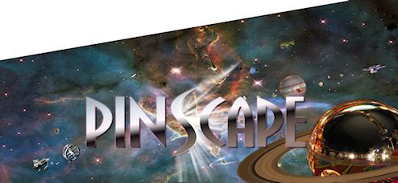

[#cabinetArt]
= Cabinet Art

If you're building your machine's cabinet from scratch, you'll want to decide on what the exterior will look like.
This might be a simple flat black paint job, or you might prefer full-color graphics like on a modern real pinball machine.

Real pinball machines have always featured eye-catching cabinet artwork.
The motivation was always commercial, of course - the art was there to grab your attention and entice you to drop in a few quarters.
But that didn't mean it wasn't also art.
Pinball has a recognizable graphics style - actually, several different styles over the decades, but each recognizably "pinball art".
It's natural for virtual pin cab builders to want to tap into that by using artwork that would look at home on a real pinball machine.

Reproducing the authentic pinball art style can mean different things, depending on which era you're talking about.
Machines built in the 1950s through 1970s tended to use abstract graphics, painted in three or four bold colors with stencils.
The stencil artwork continued into the 1980s, but the graphics became more intricate and representational.
In the 1990s, the manufacturers started using a multicolor silk-screening process, which allowed for higher-resolution graphics with more detailed designs.

Top left: Gottlieb's _Abra Cadabra_ (1975), with abstract stencil graphics typical of machines built in the 1950s through 70s.
Top right: Williams's _Space Station_ (1987), with the more intricate stencil graphics of the 1980s.
Bottom: Bally's _Theatre of Magic_ (1995), which used the high-resolution silk-screen graphics typical of the 1990s.

In the 2000s, the remaining manufacturers switched from screen printing to plastic decals.
Decals are cheaper to produce, but they also offer more options to the designers, since they can be printed in high resolution and full color.
(Silk-screening's palette is limited by the number of color layers used, and has to use halftone patterns for in-between colors.) The switch to decals opened up even more options for art designers, including full photo-realism.

== When to install artwork

I think it's best to paint or install decals just after completing the assembly of the wood cabinet, before installing any of the interior equipment, and certainly before installing the trim.

I'd wait until after assembly to do any decorating, because that lets you do a final pass with a power sander to even out surfaces, smooth corners, and remove any excess glue.
It also eliminates the risk of scratching or marring the artwork during the assembly process.

It's better to paint and install decals before installing any interior equipment, since that will add weight and make the cabinet harder to move around.
You'll want to be able to flip the cabinet onto different sides while working on paint or decals, so you don't want it weighed down with internal parts.

== Virtual pin cab design options

As a virtual pin cab builder, you have several good options available.
The right option is a matter of taste and budget.

*Natural wood style.* This isn't common, but some people choose to make their cabs look like a piece of fine furniture or cabinetry, to better fit into a home environment.
If you want this kind of look, you can use a wood stain or a natural clear finish with cabinet-grade plywood.
You can even buy pre-finished plywood to skip the staining step.

*Single-color painting.* This is another simple, understated look that some people use to make their machine relatively inconspicuous for the home environment (as inconspicuous as a six-foot-tall, five-foot-long, three hundred pound wood box can be, anyway).
The most common single-color paint job is solid black, since that tends to disappear into the background nicely.

*Stencil graphics.* To a lot of people, the electromechanical era (1950s through 1970s) is the Golden Age of pinball, and tables from that era define what a pinball machine is supposed to look like.
To be sure, the EM era's graphical style is unmistakeably distinctive, and it's iconic of pinball in popular culture.
The stencil graphic style that these machines used is also something that you can reproduce on your own, at low cost and without any special equipment.
You just need to make a stencil mask out of cardboard and masking tape, and then apply spray paint in as many colors as desired.

*Full-color decals.* Many pin cab builders want to reproduce the look of machines from the modern era (1990s and onwards).
These machines use elaborate designs printed in full color at high resolution.
The real machines from the 1990s used high-res screen printing; newer machines almost all use plastic decals to achieve the same look.
Happily, professional custom decal printing is readily available for one-off print jobs, and is even relative affordable.
This isn't something you can do at home with DIY equipment, since it requires special industrial printers, but there are lots of print shops that have the equipment and can do the job for a reasonable fee.
And since the printing is done on what's essentially a giant industrial version of an ink-jet printer, you can print virtually any custom design by preparing the graphics with a PC photo editor program.

== Using decals

Most pin cab builders these days opt for decals, since they allow for such unlimited creativity in the artwork.

First-time cabinet builders are sometimes skeptical about decals, thinking that they'll look like cheap stickers.
It might reassure you to know that most of the newer real machines now use decals for their artwork, using the same materials that a good print shop would use for your cab decals.
If you can find a newer Stern machine to look at, you can get a first-hand look at what kind of finish you can expect.
When printed on quality stock and applied properly, you can achieve a finish that's pretty close to the screen printing used in the 1990s machines.
Decal printing is actually superior in some ways; you get a wider color gamut and finer dot pitch, and the plastic finish is more resistant to light scratches.

=== Surface preparation for decals

You should check with your decal vendor for advice about surface preparation.
I'd always give your vendor's advice priority over any generic advice you see on the forums or in build guides like this one.
Different vendors use different film stocks, and what works best for one type might not be ideal for others.

With that in mind, I'll give you my own generic advice, based on working with a couple of different decal sources.

The first question is whether to paint before applying decals.
I say yes, mostly because I want to make sure that any exposed wood areas around the edges of the decals match the decal background color, to hide the transition.
Paint can affect how the decals adhere, so if your vendor says you should or shouldn't paint, I'd follow their advice; but if they say you can go either way, I'd paint.

Note that paint is probably required if you use a grain filler (which we'll come to shortly).
Grain fillers don't adhere strongly on their own - they have to be sealed with paint or lacquer.

If your cabinet is built with plywood, the second question is how to prepare the surface, apart from the optional painting.
No additional prep is necessary for MDF or MDO plywood, since the factory finish is paper-smooth.
With regular plywood, though, the veneer has visible wood grain.
Vinyl decals adhere so tightly that the wood grain will be visible through the decals if you don't take some additional steps.
Wood grain showing through the decals isn't really a problem, but most of the commercial machines have a smooth finish, so I prefer to minimize it for a more "factory" look.

I think the only way to achieve a grain-free finish is to use a wood grain filler product before painting.
My experience is that sanding alone won't completely eliminate the grain texture, no matter how much sanding you do or how fine the grit, because sanding won't eliminate the pores in the wood grain.
The pores are what make the grain show through paint and decals, because they absorb the paint unevenly.
Wood grain fillers are specifically designed to fix this by plugging up exposed pores at the surface, so that paint is absorbed more uniformly.

Some pin cab people have reported good results using paint alone.
I've had less than perfect results that way myself, and all the kitchen cabinet pros seem to agree that grain fillers are a must if you want a piano finish, but maybe it's a matter of finding the right paint.
It would certainly save a lot of labor to skip the filler step.
Some paints, particularly primers, do make claims that they can serve as a surface defect filler.

If you do decide to use a grain filler, you can find lots of how-to videos about product selection and application procedures on the Web.
Most of the videos I've found are focused on painting kitchen cabinets, so that's a good search term to use, but the same techniques work on pin cabs.
If you want to skip the video research, here's a procedure that has worked well for me.
It's time-consuming, but it doesn't require any special expertise or equipment.

* Sand the bare wood until smooth to the touch, with a power sander and 320 grit sandpaper
* Apply grain filler.
I've had good results with Aqua Coat White Cabinet Grain Filler.
Many people say that drywall compound (any brand) works just as well.
If you use a grain filler, follow the manufacturer's instructions, but I think the basic procedure is the same for any of these products:
** Work in small sections of a couple of square feet at a time, so that the filler doesn't dry out before you finish working the area
** Apply a big glob of filler
** Using a squeegee or gloved hands, work the filler back and forth *across* the grain, pushing it down into the grain
** Immediately scrape off the excess using a stiff plastic squeegee or old credit card, scraping *with the grain* ; scrape off as much as you can, leaving just what's trapped in the grain
** Continue working in sections until you finish the whole panel
** Let it dry (for Aqua Coat, 45-60 minutes)
** Hand-sand *very lightly* with a fine-grit sanding sponge (e.g., 3M SandBlaster 320 grit) until the surface feels smooth.
(This produces a lot of very fine dust.
Wear a good respirator, and do it someplace where you don't mind getting dust everywhere.)
** Repeat the steps above for a second coat; this one should take much less filler, since most of the open grain will already be filled from the first coat
** Repeat for a third coat, or as many more coats as necessary until the grain is well concealed
** Let the last coat dry overnight, and lightly hand-sand smooth
* Clean off all surface dust by wiping and/or vacuuming (avoid moisture here, since most grain fillers are water-soluble - damp cleaning might undo all of your work so far)
* Apply two coats of a filler primer paint.
I've had better results spraying than brushing (in my case, using spray paint in a can: I used Rust-Oleum Filler Primer on my last build, and that worked pretty well).
My experience with brushes and rollers is that both can leave a texture that shows through the decals.
* Optionally, sand very lightly with fine or ultra-fine sandpaper or a sanding sponge (400 grit or higher).
Think of this more as polishing than sanding.
You're just trying to smooth out dust bumps and air bubbles.
I've had better luck *not* using a sanding block for this - it seems too easy to make scratches that way.
Instead, I just use a small piece of sandpaper, hand-held.
Work in small areas and check progress frequently by touch.
* Wipe clean again with a slightly damp cloth.
Apply two or more top coats of paint that matches the background color of your decals.
After each coat fully dries, you can do another extremely light polishing/sanding pass.
It's really important to let the paint dry long enough to fully cure and harden before sanding, otherwise the paint can ball up and come off in little chunks, defeating the whole purpose.
Check the instructions on the paint can for full drying time.

A lot of people like to do the sanding between coats as wet sanding (dipping the sandpaper in water, or water with a tiny amount of mild soap).
Only do this with oil-based paints.
Wet sanding can create an even smoother finish and helps avoid scratches.

=== Applying decals

Decal application is scary the first time you do it, especially since the decals are expensive, and there are at least a few horror stories on the forums about how difficult decals are to work with.
But it's one of those things where you don't need special magical skills.
If you follow the right procedure, you should be able to get good results reliably.

There are two basic techniques: the "wet" and "dry" methods.
This is one of those topics that inspires an almost religious fervor in a lot of people: proponents of the wet method will tell you that you'd have to be crazy to even think about the dry method, and advocates of the dry method will say the same thing if you're contemplating the wet way.

The "wet" method involves spraying the cabinet surface and the back of the decal with a soapy solution just before application.
Some decal film stock requires this as a way to release trapped air bubbles, but newer, higher-tech decal materials are designed with tiny pores that release air bubbles on their own, eliminating the hard requirement to use the wet method.
Even so, some people still like the wet method for a whole separate reason, which is that it keeps the decal from attaching too strongly at first, so that you can slide the decal around to fix any initial alignment errors.

The "dry" method simply applies the decal directly to the clean, dry surface.
Newer films don't need any help releasing small air bubbles, so there's no need for soapy sprays.
The decal adheres strongly right away with this method, so you don't get to slide it around to play with alignment - but you shouldn't have to do that if you use the right procedure, because you'll get it aligned beforehand.

You can find YouTube videos for both methods.
This is a good subject to preview on video so that you can get a little mental practice before attempting it.
Search for "pinball decal dry method", for example.

As with surface preparation, I'd always take your vendor's advice on application method over anything generic that you see in the forums or from me.
Some media might simply require the wet method, because of the air bubble issue that affects some film types.
On the other hand, some decals might not be able to tolerate too much added moisture.

Personally, I prefer the dry method.
It's the one that my decal vendors have all recommended, and it seems simpler and cleaner to me.
I can understand the appeal of the do-over potential of the wet method, but at the same time, it seems prone to a little less accuracy exactly because of the slipperiness.

The key to making the dry method work is to lock in the alignment before you expose the adhesive.
Here's the procedure I use:

* Before starting, have a felt squeegee ready.
Some people like the really large ones that can go across the whole width of the decal, but a small one works too - the one I use is 4" wide.
* Wipe down the cabinet surface *and* the back of the decal (don't peel it - I'm just talking about wiping down the back of the backing paper).
A clean soft cloth with a little bit of rubbing alcohol works well for this.
The point of cleaning the back of the decal is that you're going to have to lay it across the cabinet surface, so any dust on the back of the decal can transfer to the cabinet surface, undoing your careful pre-cleaning.
* Initially, leave the backing paper in place, and get the decal aligned exactly how you want it on the target surface.
* Once it's lined up correctly, temporarily fix it in place at one end, using clamps or masking tape.
Make sure to tape it or clamp it securely, so that this end of the decal can't move.
* Lift the other (unpinned) end, making sure that the fixed end of the decal stays stuck in place.
Peel the backing away from the free edge for about two or three inches.
* Cut off that first two-to-three inches of backing with scissors or a utility knife.
Leave the rest of the backing in place.
* Working from the pinned end towards the free end, smooth the decal flat against the surface again.
The exposed section will now adhere to the surface.
The decal is now serving as its own anchor at this edge.
* Remove the clamps or masking tape.
* Working from the end that's already stuck, lift the decal enough that you can start peeling off the remaining backing.
* Peel off a little bit of backing at a time, and smooth the decal onto the surface as you go, using your felt squeegee.
Just do a couple of inches at a time.
If your squeegee is the 4" type, sweep it back and forth across the width of the newly stuck section.
If it's the super-wide type, just keep moving it down the length of the decal.

It's really important to keep the unstuck part of the decal straight throughout this, so that it doesn't form any wrinkles and doesn't stick to itself anywhere.
Maintain light tension on the free end.

=== Trimming edges

Most print shops will print the decals slightly larger than the final size you want to install, usually about an extra inch on each side.
This is intentional; it's to give you a little room for error in the final alignment.

The standard procedure is to align the decals, affix them, then go around the edges with an X-Acto knife to trim the decals to be exactly flush with the edges.
This is surprisingly easy; you just let the edge of the wood guide the knife.
As long as the knife is sharp, it should make a perfect cut exactly at the edge.

=== Cutting out holes

When you design and apply the decals, you should simply let them cover the holes in the cabinet for the flipper buttons, front panel buttons, and coin door cutout.
After installing, use an X-Acto knife to trace around the edge of each opening.
Cut from the *outside* , and let the edge of the opening guide the knife - the same procedure used to trim excess material around the edges.

=== Finding a printer

My decals were printed by Brad Bowman a/k/a link:https://vpuniverse.com/forums/user/38-lucian045/[Lucian045 on VP Universe] (also reachable at link:mailto:bjbowman045@gmail.com[bjbowman045@gmail.com] ).
I highly recommend him.
Brad is a serious virtual pinball enthusiast who also happens to run a professional sign printing shop.
It's great to work with a printer who knows how pin cabs are set up, because that means he'll be able to picture what you have in mind for any special customizations.
The decal stock that Brad uses is also just great: very easy to work with and very durable.
I of course can't guarantee that Brad will still be offering print services by the time you read this, but you can always drop him a line to find out.

Other options include link:https://virtuapin.net/[VirtuaPin] and link:https://www.gameongrafix.com/[GameOnGrafix.com] .
Both offer custom decal printing.
VirtuaPin specializes in pin cabs and I think they use similar print stock to what Brad Bowman uses.
GameOnGrafix is more oriented towards home-brew video game cabs, but they also provide a template for pinball cabinets, and anyway it's basically the same sort of decal for either type of machine.

You can also try any shop that does commercial sign printing.
This is a common commercial service, so you can probably find local vendors in your area, especially if you live near a major city.
The type of adhesive plastic material used for pin cab details is also commonly used for commercial signage.

=== Artwork requirements

Most print shops will expect you to provide your artwork in an electronic format, such as JPEG or TIFF.
Check with your vendor for their requirements and recommendations.
You should be able to use just about any photo editor or painting program on your PC to create the graphics and convert them into the vendor's preferred format.

Decal printing is essentially the same as printing on a home ink-jet printer.
The only real difference is that the decal prints are physically a lot larger.
So keep in mind that the pixels you see on the computer screen will be spread out over a much larger area when printed.
Images that look smooth and sharp on-screen might be fuzzy with jagged edges when blown up to pinball decal size.
To look good at full size, the final image will need a pixel resolution of about 300 dots per inch (dpi) when printed.
The side panels of a full-sized pinball machine are about 50" x 24", so if you want to fill that space at 300dpi, you'll need the source image to be about 15,000 pixels by 7,200 pixels - about 100 Megapixels.

=== Creating your artwork

There are three main options for creating your artwork.

*Design it yourself.* If you're feeling creative, and you're good with a graphics editor like Photoshop or Illustrator, you can design your own original artwork.

Opting for a completely original design gives you the freedom to come up with whatever look appeals to you.
But starting with a blank page is also pretty intimidating.
Here are some ideas for where to begin:

* If you want to create something in the style of the real machines, start by choosing an era.
Go to link:https://www.ipdb.org/[IPDB] and browse through pictures of machines from the era, to get a sense of the prevailing graphic style.
If a particular machine's design strikes you as particularly appealing, use that as your starting point.
* Choose a name for your machine.
That will automatically plant some ideas about its theme.
A lot of pin cab builders name their machines after their favorite movie, TV show, or comic book character, following the long tradition in the real machines of using licensed themes.
* A popular motif is to focus on the virtualness of the machine and/or its ability to run many different games: "Multiball", "Megapin", "Pinball Holodeck", "Pinball Matrix", etc.
* Another way to emphasize the multi-game aspect of a virtual cab is to use a collage of prominent artwork elements from your favorite real pinball machines, such as Rudy from _Funhouse_ and the Addams family characters from _The Addams Family_ .
* There's a lot of public-domain (copyright-free) artwork on the Web that you can use as a starting point.
For example, if you like space themes, check the NASA, JPL, and Hubble Space Telescope Websites for some very pretty, high-resolution astronomy images that are free to use.
I used a Hubble photo of the Carina nebula as the backdrop for my own cab side art.
(Do be sure that any images you take from the Web are truly public-domain or licensed for free use.
Reputable print shops won't accept artwork that you don't have the proper rights for.)

*Commission original custom art.* If you're not interested in creating your own artwork, but you still want something original, you can find an artist to create something custom for you.
For example, stuzza on link:https://www.vpforums.org/[vpforums] creates original art for forum members, for a fee.
A stuzza design is generally a pastiche of pop culture clip art based on a theme you provide.
See the long-running thread " link:https://www.vpforums.org/index.php?showtopic=26497.html[Cabinet Artwork I have created] " for his contact information and examples of his work.
link:https://virtuapin.net/[VirtuaPin] also offers custom graphic design services for a fee.

*Use a pre-made design.* Stuzza on vpforums has also released a number of free designs that you can download and use without a commission fee.
See the "Cabinet Artwork" thread mentioned above for links.
I've also come across occasional pin cab artwork elsewhere on the Web; try an image search for "pinball cabinet side art".

*Reproduce artwork from a real pinball.* Some cab builders opt to use the original artwork from their favorite real machine.
Be aware that the graphics from virtually all historical commercial machines are still under copyright, so a reputable print shop won't accept an order that reproduces a real machine's artwork without proper clearance from the rights holders, which almost always requires paying a license fee.
link:https://virtuapin.net/[VirtuaPin] sells authorized reproductions of the original art for several popular classic pinball titles.
You can also find ready-to-use decal sets with reproduction artwork from many more titles from pinball supply vendors - search for "pinball cabinet decals".

== Backbox warning label

Most commercial machines display a big block of warning text on the back of the backbox, warning operators to bolt the backbox properly and fold it down for transport.
The warnings were there for the usual legal liability reasons, so if you're just building a cab for your own use at home, you can leave the area blank.
But some cab builders might like to include the warnings for the sake of meticulous re-creation of the originals.
See xref:extras.adoc#backboxWarningLabel[Extras - Backbox warning label] for a picture of the typical text.

