[#cabinetBody]
= Cabinet Body

On the forums, virtual pinball machines are always called "pin cabs". It's appropriate that the cabinet is the defining feature of these projects, since it's what sets them apart from video pinball on an ordinary PC. This chapter is about the literal _cabinet_ part of that - building the physical housing of the machine.

The bulk of this section consists of detailed plans for building a replica of a 1990s-era Williams pinball cabinet, with some slight changes to accommodate video pinball instead of a mechanical playfield. With some tweaks, you can use the plans here to build a replacement cabinet for an actual WPC-era pinball machine. The plans are complete enough to build the whole thing from scratch, starting with a couple of sheets of plywood.

Before we get to the building plans, we'll discuss the reasons behind the design of the cabinet (both the original pinball machine design and our "virtual" modifications), and some important things you should consider before finalizing your own design. Every pin cab project is unique, and I think most people will want to make at least some customizations to the generic plans I provide.

This section has a lot of background information and digressions on small (sometimes trivial) details, so it's rather lengthy. When you're ready to go out to your workshop and get building, you might prefer a more concise step-by-step list of dimensions and tasks. I've tried to provide something along those lines in a couple of appendices:

*  xref:plywoodCuttingPlans.adoc#plywoodCuttingPlans[Plywood Cutting Plans for Cabinet Construction]
*  xref:cabBodyQuickRef.adoc[Cabinet Construction Quick Reference]

== Design goals

The goal for most of us is to replicate the exterior appearance of a real pinball machine. That's what I set out to do with my own virtual cab, and I'm assuming in this section that it's your goal as well. This chapter is therefore mostly a guide to building a replica of a Williams pinball machine cabinet from the 1990s, using the same materials and parts. The plan here isn't an _exact_ replica, because some modest changes are needed to make the virtual-pinball elements fit better, but most of the differences are small. For the most part, you could use the plans here to build a replacement cabinet for a real machine (and just in case you actually want to do that, I've tried to point out where and how my plans diverge from the WPC design).

Even though the WPC design is more than 30 years old now, it's still more or less the most "modern" pinball cabinet design, since most new pinball titles today are built with essentially the same cabinet plan and trim hardware as in the 1990s. Pinball is a much smaller industry today than it was then, and I don't think the manufacturers have the scale these days to do as much custom designing and machining, so they keep re-using a lot of the time-tested parts and designs from the 90s. Plus, the WPC cabinet design simply got most things right; there's not much practical reason to change it. So newer machines look very much like machines from the 1990s, as far as the basic cabinet shell goes. The only major change on the outside is the audio/video panel in the backbox, which on newer machines usually features a video screen in place of a dot matrix display, but that's not really a change to the cabinet; it's just something that drops in to the standard cabinet layout. You can build the basic WPC cabinet plan and take your pick of speaker/display panel styles.

When I was building my own virtual machine, I discovered that the design of the 1990s pinball cabinets is something of a secret art. It's not secret due to any conspiracy of silence; it's just that there's a lot of knowledge and experience that went into the design that no one bothered to write down anywhere. Not anywhere public, anyway; I imagine that there are still a lot of old engineering diagrams and blueprints gathering dust in a basement file cabinet somewhere, but those documents aren't available to hobbyists.

Owners of the real machines can learn a lot of the design details of the original cabinets through observation, but if you don't have a real machine to take apart and examine, you pretty much have to guess. I'm fortunate to have some real machines at home, and that turned out to be a huge help for building a virtual cab. Whenever I was unclear on something, I could look at a couple of actual examples to see how they did it, and see some of the variations in different model years. I took advantage of that many times. So my goal in this section is to pass along as much of that otherwise undocumented knowledge as I can, in this one place, in an order that essentially provides a recipe for building one of these cabinets.

I know that not everyone wants their cab to look exactly like a modern commercial pinball machine. You might be basing your project on the classic Gottlieb wedge-head machines of the 1970s, for example, or you might want to create something completely novel. Even if you're aiming for a different look, though, you might find it helpful to understand how the 1990s WPC cabinet design works. Those cabinets are the result of decades of refinement. Pin cabs have to solve a number of geometry and functional constraints, and you'll face many of the same issues in creating a wholly new cabinet design. It can be helpful to see what the pros came up with after many iterations.

== Build, buy, or convert?

There are three main options for creating the body of your cabinet:

* Build it yourself from scratch
* Buy a new empty pinball cabinet, pre-built or as a kit
* Convert an old real pinball machine into a virtual cabinet

If you're new to virtual pinball, the approach that might seem most appealing at first glance is to convert an old real machine. Indeed, some of the earliest virtual cabs were built as conversions from machines that would otherwise have been scrapped, and it was a popular approach in the early years. It has the advantage that it starts off from the very beginning looking exactly like a real pinball machine, and it saves you the trouble of coming up with your own cabinet design and sourcing parts.

The conversion approach has become a lot less appealing lately because of increasing prices. Almost every pinball machine is a collector's item these days; old machines command surprisingly high prices even when they're beat up, since there are plenty of people looking for restoration projects. If you're lucky enough to find a donor machine that no one wants to restore, it'll probably be in such bad cosmetic condition that it might actually be cheaper and easier to start from scratch. (You should also be prepared for some negative comments on the forums, since there's a preservationist sentiment even among the virtual pinball crowd. Many people see pinballs from past decades as works of historical significance that can't be fully or genuinely re-created once lost.)

Happily, the "build" and "buy new" alternatives are both quite practical, and I consider both of them superior to conversion, even without the price considerations. You can buy high-quality reproduction cabinets that look exactly like the real thing, in kit form or fully assembled. Or, if you have some basic woodworking skills, you can build an excellent reproduction cabinet yourself. The real machines use fairly simple designs that you don't have to be a master carpenter to reproduce. This section provides ready-made plans, so there's no research required.

What's more, it's easy to obtain all of the genuine cabinet hardware (metal rails, legs, etc) needed to fit out a custom-built cabinet and make it look exactly like a real machine. All of the hardware is standardized across machines, and several big online pinball suppliers sell the parts. You can thank the collectors for that - they buy these parts to repair and restore their machines, so there's a healthy market in the parts that keeps them readily available.

Here are my recommendations:

* For most people, I recommend using a VirtuaPin flat-pack kit. I used this approach myself, and I'm very happy with the results. It's not the cheapest option, but it's reasonably priced, and it yields an excellent finished product. It's about the same level of difficulty as assembling an Ikea product. With a little care, the result will be essentially indistinguishable from a brand new commercial pinball machine cabinet.
* If you enjoy woodworking and have a decently equipped workshop, consider a scratch build. Doing it yourself is much cheaper than buying a VirtuaPin flat pack, assuming you already have the tools, and you should be able to get equally professional results with a little care. Pinball cabinets are relatively simple as woodworking projects go; they're built out of ordinary plywood, and they're all straight lines and (mostly) easy joinery. But it does require some tools beyond the home-handyman basics, and it's a fair amount of work, so don't choose this option just because of the potential cost savings - choose it because you enjoy this sort of construction project.
* If you don't want to do any woodworking, and you don't even want to assemble a kit, you can order a fully built cabinet from VirtuaPin or from a number of other vendors. VirtuaPin's pre-assembled product is the best one I've seen, and it's the only one I know of that faithfully reproduces the design of the real pinball machines. (It's good enough that some collectors restoring real machines buy this kit to use as their replacement cabinets.) The products I've seen from other vendors use idiosyncratic designs and non-standard trim hardware, so they don't look quite like the real thing. If a realistic appearance is important to you, take a close look before buying to make sure you like the design.
* I generally don't recommend trying to re-purpose an old real pinball as a virtual cab, in part because old cabinets tend to be so beat up that restoration would be more labor-intensive than building a new one, and in part because the economics rarely pan out. More on that below.

=== Economics of new vs used

If you're set on the idea of re-purposing a used cabinet, I'd suggest doing a little research first to make sure you don't overpay. The question you want to ask is: would I actually save money buying the used cab, or would it be cheaper to buy the same parts new?

To answer this, ask the seller for a list of all the hardware parts that the used cabinet includes - the legs, side rails, lockbar, etc. Don't assume that everything is included, because a lot of eBay sellers strip all of the parts out and sell them separately; a used cabinet might not come with anything beyond the wood box. And only consider the hardware that you'll actually use on your virtual cab, since those are the only parts you'd have to buy if you were starting from scratch. Only count parts that you actually need in the virtual cab (e.g., don't count the playfield, bumper caps, etc), and only count used parts if they're in usable condition.

To help you get started here's a list of the main parts that real machines and virtual cabs have in common. See xref:cabParts.adoc#cabinetPartsList[Cabinet Parts List] for a more detailed parts list with descriptions. We left the price column blank, since prices obviously vary over time and from one vendor to the next, so you'll have to fill that in by checking current prices at your preferred vendor(s) (such as link:https://virtuapin.net/[VirtuaPin] , link:https://www.pinballlife.com/[PinballLife] , or link:https://www.marcospecialties.com/[Marco Specialities] ). For the "wood body" line item, you can use VirtuaPin's flat pack or unfinished cab body offerings for comparison. Remember, only include the parts that the seller is including with the new cab, since you want to compare new-vs-used for what you're actually getting from the seller.

Add up the prices of the new parts, and compare the result to the seller's asking price for the used cab. If the asking price for the used cab is cheaper than the new parts, and everything's in good enough shape that you can actually use it, you've found a good bargain. If the seller is asking more for a beat-up used cab than what you'd pay new, I'd pass on the deal.

[cols="1,3,1"]
|===
|☑|Description|Price New

|☐
|Main cabinet wood body
|$

|☐
|Backbox wood body
|$

|☐
|Legs (qty 4)
|$

|☐
|Leg levelers ("feet") (qty 4)
|$

|☐
|Leg brackets (qty 4)
|$

|☐
|#8 x 5/8" wood screws for leg brackets (Williams ref 4108-01219-11, 4608-01081-11), or #10 screws if preferred (qty 32)
|$

|☐
|Leg bolts (⅜"-16 x 2¾" or 2½") (qty 8)
|$

|☐
|Side rails (qty 2)
|$

|☐
|Lockbar
|$

|☐
|Lockbar receiver
|$

|☐
|Coin door
|$

|☐
|Coin acceptors ("coin mechs")
|$

|☐
|Cashbox tray (Williams ref 03-7626)
|$

|☐
|Cashbox lid (Williams ref 01-10020)
|$

|☐
|Cashbox nest bracket (Williams ref 01-6389-01)
|$

|☐
|Cashbox lock bracket (Williams ref 01-10030)
|$

|☐
|Carriage bolts, black, ¼"-20 x 1¼" (qty 6: 4 for coin door + 2 for lockbar)
|$

|☐
|Flange locknuts, ¼"-20 (qty 6: 4 for coin door + 2 for lockbar)
|$

|☐
|Top glass
|$

|☐
|Rear plastic channel for glass
|$

|☐
|Side rail plastic channels for glass (qty 2)
|$

|☐
|Plunger (ball shooter) assembly
|$

|☐
|Ball shooter mounting plate (Wiliams ref 01-3535)
|$

|☐
|#10-32 x ¾" bolts for mounting plunger assembly (qty 3)
|$

|☐
|Backbox hinges (qty 2)
|$

|☐
|Backbox hinge backing plates (qty 2)
|$

|☐
|Carriage bolts, ¼"-20 x 1¼" (qty 6, for backbox hinges)
|$

|☐
|Flange locknuts, ¼"-20 (qty 6, for backbox hinges)
|$

|☐
|Pivot bushing carriage bolts (qty 2)
|$

|☐
|Hex pivot bushings (qty 2)
|$

|☐
|Backbox latch
|$

|☐
|Backbox latch bracket
|$

|☐
|Backbox lock plate assembly
|$

|☐
|U-channel, metal, ⅝" x ⅝" x 27⅛" (backbox speaker panel holder)
|$

|===

=== Where to find used machines

Your best bet for finding a used machine at a good price will be local sellers. Search your local craigslist and local newspaper classified ads. A particularly good place to find a deal is at an estate sale. Heirs often want to clear out the house quickly and won't have any sentimental attachment to an old pinball.

If you can't find anything locally, eBay will give you access to sellers nationally (and even internationally). But I wouldn't get my hopes up; it's hard to find a good deal on a used cab on eBay these days. For one thing, shipping a cabinet is expensive due to the size and weight; shipping can add about $400 to the price. For another, eBay sellers know they can get top dollar for used cabs, so the base price is unlikely to be a bargain. Most eBay sellers are also savvy enough to strip a machine of all of the parts and sell them off separately, which largely defeats the purpose of reusing an old machine.

=== Kits and pre-built cabinets

If you can't find or don't want to use a salvage machine, but you also don't want to build everything from scratch, there are several companies that will sell you a brand new cabinet. For options, search the web for "new pinball cabinet" or "pinball cabinet restoration". One vendor I can recommend from personal experience is link:http://mjrnet.org/pinscape/BuildGuideV2/virtuapin.com[VirtuaPin] . They sell cabinets in both kit form and fully assembled, and can customize them to your specifications.

You should be able to find options ranging from "flat pack" kits that you assemble yourself, to fully assembled cabinets with all of the hardware and artwork installed.

The cheapest and most DIY option is a flat pack kit. This is like an Ikea bookshelf: it consists of the wood parts, pre-cut and pre-drilled, ready for you to assemble. This is the cheapest kit option, since you provide the assembly labor, and because shipping is cheaper than for a bulky assembled cab. The degree of difficulty is slightly higher than for assembling Ikea furniture, but only slightly; no real woodworking skills are required, and you'll just need basic tools like screwdrivers and hammers. You might also have to do some sanding to even out corners and edges. And you'll have to do your own finish work (painting, staining, or applying decals). I used the VirtuaPin flat-pack kit for my own cabinet, and I highly recommend it. They use a good furniture-grade plywood, and the design is a faithful reproduction of the WPC cabinets that Williams shipped in the 1990s, so the result is exactly like a brand new real machine.

The next step up in price and completeness is an assembled cabinet shell. This is just the wood shell, typically unfinished (ready for you to paint, stain, or apply decals), and without any of the cabinet hardware accessories installed. This eliminates the assembly work required for a flat pack. It's considerably more expensive to ship because it's so bulky.

At the high end price-wise, you can buy a fully assembled cabinet with all of the hardware and graphics pre-installed. VirtuaPin sells these in addition to their flat-pack and assembled-but-unfinished products. All of the VirtuaPin options use the same materials and design as their flat pack, so they all yield excellent reproductions of the 1990s Williams machines. There are other vendors selling pre-built cabinets as well, but check their designs carefully before buying, because I've seen a couple of other vendors who use their own ad hoc designs that look a bit cheap and cheesy to my eye.

TIP: *Ask about the button hole layout.* If you order a kit or pre-built cabinet, ask the seller for details on the locations of button holes they pre-drill, and ask them to customize the drilling to your plans if you have something else in mind. The vendor might drill holes by default that you don't want. Pay particular attention to the placement of the plunger and flipper button holes. Many virtual cab builders choose non-standard locations for these to accommodate the playfield TV (see "The dreaded plunger space conflict" in xref:playfieldMounting.adoc#plungerTVSpaceConfict[Playfield TV Mounting] and "Positioning the plunger" in xref:plunger.adoc#positioningThePlunger[Plunger] ). If you're not sure how you want to handle this at the time of your order, you can simply ask the vendor not to drill any holes for the plunger or other controls. That will give you the flexibility to drill them yourself later when you know how everything will fit together.

=== Scratch build

A scratch build is the cheapest option if you already have most of the tools required. The raw materials consist mostly of a couple of sheets of plywood. If you don't already have the tools, it's probably cheaper to buy a pre-built cabinet, but not by a huge margin - you don't need a huge set of tools. A scratch build also lets you build exactly what you want.

*Lumber:*

* 3/4" (nominal) plywood, two 4'x8' sheets, for almost all of the main cabinet and backbox. Choose a quality hardwood plywood that's graded for furniture or cabinetry use. Commercial pin cabs are typically birch. The ¾" thickness is important, as many of the trim parts and controls (like flipper buttons and plunger) are designed to fit into ¾" walls.

MDO plywood is even nicer, if you can find it. MDO is a hybrid product with a plywood core and an MDF veneer, so it has the strength and lightness of plywood and the flat, grainless surface finish of MDF. The MDF veneer saves hours of prep work for painting and decals.

It's just barely possible to fit a standard-width cab into a single 4' x 8' sheet, but it's much easier with two sheets. See xref:plywoodCuttingPlans.adoc#plywoodCuttingPlans[Plywood Cutting Plans for Cabinet Construction] for layout suggestions.

* 1/2" (nominal) plywood or particle board, one 4'x8' sheet, for the cabinet floor and the back wall of the backbox. Most commercial machines use particle board, to cut costs, since these pieces aren't cosmetic. Plywood is a nice upgrade if your budget permits. It's stronger and lighter.
* A length of 2x2 (nominal) board, for corner braces. A nominal 2x2 is actually 1.5" on a side. It usually comes in 8-foot lengths. You need at least 5 feet, so one 8-foot board will leave you with some spare material for test cuts and do-overs.
* A length of 1x2 (nominal) board, for a trim piece for the backbox. You can also fashion this out of the same 2x2 as the leg braces, but it's easier with a 1x2. This board needs to be at least 28" long.

"Nominal" lumber dimensions refer to what the lumber yard calls it, not the true size. Plywood is generally 1/32" thinner than the nominal thickness, and dimensional lumber, such as 1x2 or 2x2 strips, is generally 1/4" to 1/2" less in each dimension than the nominal size. So when the list above calls for 3/4" plywood, it means you should buy what the lumber yard calls 3/4" plywood, even though the true thickness will be slightly less than that.

Some cab builders use MDF (fiberboard) instead of plywood for the whole build. I prefer plywood, but MDF works too. Each material has some advantages over the other. MDF is cheaper, and it's nearly perfectly uniform in thickness and composition. MDF sheets also tend to be perfectly flat, whereas plywood often has some warping, even fresh from the factory. The downsides of MDF are that it's heavier, it's not as sturdy or as durable as plywood, it doesn't hold screws as well, and it can sag over time.

Most commercial cabinets use a mix of plywood and particle board: plywood for the cab and backbox walls, and particle board for the cabinet floor and the back of the backbox. I'm normally in favor of faithfully replicating the original details, but in this case I see no benefit, since the particle board in the originals was purely for cost reduction and not for any functional reason. It's a worthwhile upgrade to use plywood for everything.

*Hardware:* See xref:cabParts.adoc#cabinetPartsList[Cabinet Parts List] .

I personally prefer to use real pinball parts wherever possible, instead of trying to improvise something out of common hardware parts. It can be a bit more expensive to use the real parts, but they tend to look better, and in many cases they're easier to work with because they're purpose-built for a specialized job. An exception is that many of the fasteners and generic nuts and bolts that you can buy anywhere. But even some of the generic-sounding hardware can be hard to find outside of pinball vendors. Anything that I listed with a Williams part number in the master list ( xref:cabParts.adoc#cabinetPartsList[Cabinet Parts List] ) is probably hard to find outside of pinball suppliers.

*Tools:* See xref:cabTools.adoc[Cabinet Building Tools] for recommendations on the woodworking tools you'll need for building the cabinet.

== Choosing a cabinet design

As far as I'm concerned, there's only one cabinet design that we need to concern ourselves with: the WPC cabinet. This is the cabinet that Williams (and its co-brands Bally and Midway) used for nearly all of their machines made during the 1990s, which were based on the electronics platform known as WPC, for Williams Pinball Controller. Thus the name "WPC cab". I don't know if Williams ever had an official internal name for this series of cabinets, but probably not; I don't think they thought of it like that. My guess is that they treated each game's cabinet as unique, as suggested by the unique part number assigned to each game's cab. So "WPC cabinet" is a made-up term of convenience, not an official name - and it's also not quite precise, in that the last dozen or so System 11 titles also used the same design. The wood shop apparently didn't coordinate their updates in lock-step with the electronics department. But even so, "WPC cab" is a pretty good name for our purposes, and other pinball people will probably know what you're talking about if you refer to it.

One good reason to use the WPC cabinet design is that it's by far the easiest to find parts for. Machines from this generation are still widely deployed, and they share a lot of the same parts (Williams quite intentionally re-used parts across titles to keep their own costs down), so there's plenty of demand for most of the common cabinet parts even today. If you design to the WPC specs, you'll be able to take advantage of that, since your machine will be compatible with the same readily-available parts. Using real pinball parts gives your machine an authentic look, and it's a lot easier than engineering and fabricating your own custom metal parts.

Another reason to use the WPC cabinet plan is that it still looks up-to-date, because most newer commercial machines are still using the same exterior design. Stern's latest machines still look almost identical, as do the machines from the boutique pinball makers like Jersey Jack and Spooky Pinball. This cabinet style is what you'll see almost every time you encounter a recent pinball title in an arcade or bar. A virtual cab following the same plan will look exactly like what everyone expects a real pinball machine to look like.

For a DIY project, you're always free to come up with something completely different, either to fit your particular needs or purely to be unique. If you have other ideas for how your cabinet should look, you can take as much or as little from the WPC design as suits you.

We provide detailed plans for the WPC design later in this section. Before we get to the plans, though, there are some variations that you might want to consider, so that you can customize the plans for your project's specific goals.

[#cabinetWidths]
===  Standard and Widebody cabinets

The WPC design is what we usually call the "standard" cabinet, because Williams/Bally/Midway used this for most of the machines they shipped in the 1990s. However, they also used a variation of the plan with a slightly wider main cabinet, to accommodate a larger playfield. This wider variation was used for seven titles in all: _The Twilight Zone_ (1993), _Indiana Jones: The Pinball Adventure_ (1993), _Judge Dredd_ (1993), _Star Trek: The Next Generation_ (1993), _Popeye Saves the Earth_ (1994), _Demolition Man_ (1994), and _Red & Ted's Road Show_ (1994). The official marketing name for these games was "Superpin", but no one ever uses that term; everyone in the virtual pinball world calls these the "widebody" machines.

The widebody design is identical to the standard WPC cabinet in almost every detail, except that the main cabinet is 2¾ inches wider than the standard body. All of the other dimensions are exactly the same as in the standard body.

A lot of people assume that the widebody WPC cabinet design had a corresponding "widebody backbox", but not so. Williams used the same backbox dimensions for their standard and widebody machines. In fact, my guess is that they chose the widebody width they did precisely because it's as wide as you can go without making the backbox wider. That doesn't mean that you can't customize the backbox size if you're using a widebody design, just that you don't necessarily have to. If you're going wider than wide, though - if your main cabinet outer width goes over about 25" - then you will have to widen the backbox, assuming you plan to use the WPC-style hinges. The backbox has to be at least 3.5" wider than the cabinet for the WPC-style hinges to work.

Widebody machines require a wider lockbar and cover glass. Pinball vendors sell widebody versions of both that fit the Superpin cabinet dimensions, so you can still use off-the-shelf parts with this design. The widebody lockbar fits the standard lockbar receiver (the hardware piece that mounts in the cabinet to hold the lockbar in place), so you don't need a special version of the receiver. All of the other hardware is interchangeable with the standard body machines.

Note that my plans in this section peg the standard-body cabinet exterior width at 21-7/8", which is what I read on the tape when I carefully measure my own original Williams cabinets, whereas most other Internet plans I've seen say it's 22". Maybe everyone else is rounding up, or maybe my cabs have shrunk a little bit over the years (they did all leave the factory more than 30 years ago). It's a pretty trivial difference, but I thought I'd mention it. The standard lockbar will fit in either case, but it might be a little snug on a 22" wide cabinet.

===  Custom width

In addition to the WPC standard-body and Superpin widebody designs, there's a third option: you can design a cabinet with a custom width that doesn't match either of the Williams WPC-era designs.

The main reasons to build to a custom width are to get an exact fit for your playfield TV, or to accommodate a TV that's even wider than what will fit in a WPC widebody cabinet.

A custom width requires a custom lockbar and custom glass cover. As long as you use the standard cabinet length, you can still use all of the other off-the-shelf hardware.

To order a custom lockbar, contact link:https://www.virtuapin.net/[VirtuaPin] . They're the only current source I know of, so hopefully they'll keep selling them. Expect to pay about double the price of the standard lockbar (which I think is a pretty reasonable premium for a made-to-order metal part that has to look nice).

The lockbar is mated with a second part known as the "lockbar receiver". The receiver does _not_ need to be customized for different widths; the standard receiver will work with any lockbar width, as long as your cabinet is wide enough to accommodate it (a minimum of 19½ inches inside width) . Keep the minimum size in mind if you're designing a mini-cab that's narrower than the standard-body cabinets.

Pinball vendors don't sell custom glass, but you should be able to order it from a local window glass dealer. Any glass shop should be able to fabricate a custom glass sheet for you in almost any desired size. Once you know the inside width of your cabinet, order a tempered glass sheet in the required width, by 43" length, by 3/16" thickness.

When calculating the required width of your glass, take into account the overhang beyond the inside dimensions. The easy rule of thumb is to make the glass *½" wider* than the *inside width* of your cabinet (that is, the distance between the insides of the side walls). For example, the standard body cabinet has an inside wall-to-wall width of 20½ inches, so the standard playfield glass is 21" wide.

One more tip about ordering custom glass: ask the vendor to omit any marking that identifies the glass as tempered. Glass shops sometimes include a certification marking on tempered glass, in case you're planning to use it for something like a shower enclosure where tempered glass is legally required by building codes. You don't need any such marking for legal purposes in a virtual cab, so you'll probably prefer to avoid the visual clutter.

===  How to choose a cabinet width

If it weren't for the constraint of fitting a TV, I'd recommend the standard-body plan and leave it at that. Using the standard dimensions produces a machine with exactly the right proportions to look authentic, and it lets you use readily available off-the-shelf parts for all of the hardware. It's the easiest, most cost-effective approach, and it looks good.

But sadly, TV manufacturers don't always cooperate with our virtual pinball plans. TV manufacturers only make TVs in certain sizes, so we're stuck with whatever sizes are on offer. The TV you pick based on price and performance might not be available in exactly the right size for a standard cabinet.

What size TVs will the standard cabinet sizes accommodate? There's no absolute rule here, since the nominal diagonal size of a TV doesn't tell you the exact exterior dimensions - the only way to be sure is to measure the TV. You might also be able to find the dimensions listed in the specs on the manufacturer's Web site or on a retailer site. Generally speaking, a standard-body cab will accommodate most TVs up to 39" diagonal, and you might be able to squeeze in some 40" models; and a widebody should handle most TVs up to 45".

When I built my own cab, I chose standard-body dimensions, mostly because I wanted my virtual cab to blend in with my small collection of real standard-body pinballs. At the time, 39" TVs were readily available, so you could easily find a TV to fit the standard-body dimensions. As of 2022, though, 39" TVs are rare. The most common TV size that's in range for a pin cab today is probably 42", and that requires a widebody cabinet. So if I were building a new cab right now, I'd probably have to go with a widebody design. In any case, I'd try to use one of the original WPC sizes - standard or widebody - rather than building to a custom size tailored to the TV, so that I could use off-the-shelf cabinet hardware.

=== Custom length

As long as we're on the subject of custom widths, we should consider lengths as well.

As with a custom width, the main reason to build to a custom length is make a TV fit exactly. As discussed in xref:playfieldTV.adoc[Selecting a Playfield TV] , a real pinball playfield is much more elongated than a 16:9 TV screen; a typical 1990s era playfield is more like 20:9. So placing a 16:9 TV in a standard-sized cabinet leaves a few inches of dead space at the front and/or rear of the cabinet. Some cab builders don't like that idea because they want to fill every square inch with TV display area.

One way to deal with the extra space is to remove it by shortening the cabinet length to exactly fit the TV.

In my opinion, it's better to stick with the standard cabinet length and accept that there will be some extra front-to-back space. The main problem with a custom length is that you won't be able to find side rails or glass guides; no one sells those in custom sizes as far as I know, and they'd be difficult to fabricate yourself unless you have some good metal-working tools. Besides, the extra space can be put to good use for features that you might want anyway:

* If you're going to install a plunger, you might need 3-4" of extra space between the front of the TV and the front of the cab to make room for the plunger mechanism.
* Even if you don't need the space for a plunger, I still like setting the TV back a few inches from the front for the sake of sight-lines, so that you don't have to look straight down to see the flippers.
* Space at the front of the TV can be used for an "apron" similar to that on a real machine, with printed instruction cards, or even small monitors that display live instruction cards, scores, etc.
* Space at the back of the TV can be used for a flasher panel or LED matrix.

===  Custom backbox sizes

As with the main cabinet dimensions, some virtual cab builders choose to deviate from the standard backbox sizing to better fit a selected TV.

Finding a backbox TV that fits the available space can be even more vexing than finding a playfield TV. There are two big problems here. The first is proportions: modern TVs all use the 16:9 aspect ratio, but the translites in the WPC design are much squarer: approximately 13:9, closer to the old-fashioned NTSC 4:3 ratio. The second problem is that there are very few models available that are even close to the right size. The most popular current TV size that's close to what we need is probably 32", but a 32" TV is too wide for a standard backbox. The next size down tends to be 27" or 28". A 28" TV will leave about an inch of dead space on each side, and a few inches above and below. A 29" would be close to perfect, but that's never been a common size.

You can't control what sizes the TV manufacturers make available, so you can either live with a little dead space around the perimeter, or you can resize the backbox to fit the TV. I personally think the dead space is the better compromise, in part because it lets you use standard off-the-shelf pinball parts, but mostly because the backbox shape will look "wrong" if you change it from the standard. This is a case where I think a lot of cabinet builders tend to fixate on the wrong thing during the planning stages, by focusing on the dead space rather than the overall proportions. The thing that you might not appreciate during the planning stage is that any dead space tends to disappear into the background when you're actually playing. Your eye sees what's there (the backglass graphics), not what's missing (the dead space around the edges). The proportions of the overall outline, on the other hand, are always noticeable.

If you do want to consider custom dimensions for the backbox, keep in mind that some of the associated hardware parts are sized for the standard dimensions, so you might not be able to use off-the-shelf parts for everything. Here are the parts that will be affected (see the illustration below if you're not familiar with all of these):

* The glass or plexiglass cover for the TV. This isn't a required part, but I recommend including it because it creates a more authentic appearance. There's no downside to a custom size for this part, because it doesn't come in an off-the-shelf version to begin with; you'll have to custom-order it even if you're using the standard size. You can have this made at any local window glass shop or plastics store, and they'll be able to cut it to whatever size you need.
* Trim pieces for the glass/plexi cover. Real pinball machines use black plastic trim around the edges of the translite. These are only available in the standard sizes. You can fairly easily cut them to smaller lengths if necessary, but there's no good way to make them longer, so you'll have to live with some gaps if you use a wider or taller than normal size.
* Speaker panel "H" channel and translite lift trim. These are plastic trim pieces that go at the top of the speaker panel and bottom of the translite, respectively, and they're sized to the standard width. If you use a wider-than-normal width, you can use the standard pieces, but there will be some gaps at the edges.
* Speaker panel. If you use a non-standard width, you'll need a custom speaker panel, assuming you're using the three-monitor configuration. No one sells those in custom sizes, so you'll have to fabricate one yourself. The ready-made speaker panels are made from plywood or particle board, so building your own only requires woodworking tools. Be aware that it's a fairly advanced project requiring precision work. You'll have to cut two large circular holes the speakers and a large rectangular opening for DMD. I'd recommend using a CNC machine (a computer-controlled cutting machine that cuts according to a digital plan). There are online services for this, such as link:https://sendcutsend.com/[SendCutSend] . If you live in or near a major city, you might also be able to find a local CNC service, or a "maker" facility that lets you use their equipment for an hourly fee.

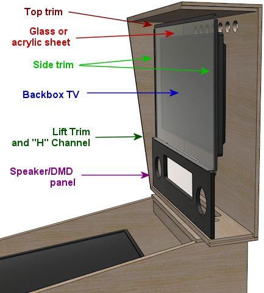

===  Mini cabs

A popular variation on the basic cab design is to scale things down a bit from the real machines. This can be especially attractive if you don't have a lot of space, and might help gain acceptance from skeptical spouses or housemates.

There's no "standard" mini-cab design, but you can find ideas from other people's builds by searching the cab forums at sites like link:https://www.vpforums.org/index.php?showforum=29.html[vpforums] . Many people who've built their own cabs post build logs with details of their design.

If you want to design a mini-cab from scratch, you can start with the basic WPC design, and just scale down all of the dimensions based on the playfield monitor you choose. A 32" TV makes a good core to build a mini-cab around; if you scale everything down proportionally, it yields a cab that's about 3/4 of the full size. That's enough of a reduction to fit more comfortably into a residential setting, but it's still big enough to be free-standing.

A few people on the forum have shrunk things down even further, to table-top or hand-held size, using a small computer monitor or tablet as the playfield.

For a mini-cab in the 3/4 scale range, you should be able to build it pretty much the same way that you'd build a full-size cabinet. You'll have to make the same adjustments to cabinet hardware discussed above under "custom width" and "custom length", but otherwise you should be able to use standard materials (such as ¾" plywood for the enclosure) and many of the standard hardware parts. One thing to keep in mind is that interior space will be a bit tight for the electronics, but you should be able to fit the necessary computer parts and a basic set of feedback devices.

If you reduce the scale to table-top or hand-held dimensions, you'll have to invent a lot more of the design on your own, since most of the standard hardware will be too large. That's beyond the scope of this guide, but you should be able to find one or two examples in the forums or elsewhere on the Web if you're looking for inspiration. Note also that all of the pinball software discussed in this guide is for Windows PCs, so if you're considering something else (like a tablet or Raspberry Pi) as the computer core, you'll also have to find other software to use. There are some decent commercial pinball games for tablets that could serve, but the commercial games don't tend to have any integration with cabinet features, so it might be challenging to make everything work the way you want it to.

== WPC cabinet plans

We now present our WPC standard-body cabinet plans. These are based primarily on measurements taken from actual WPC pinball machines, with some additions and modifications to accommodate the peculiarities of virtual pinball. I've tried to identify all of the deviations from the real machines, for those with a special interest in accurately re-creating the originals.

=== Other Internet plans

There are several other pinball cabinet plans available on the Web, including other replica WPC designs. Some of the other WPC plans I've seen have slight variations from mine, so you might want to compare and contrast any others you find as a sanity check, and to see if there's anything you prefer in the variations. I've taken a great deal of care to check my plans against actual WPC machines, and I believe the version presented here is the closest to the real thing that I've seen, but of course that doesn't mean they're the ideal plans for every build, just that they're close to what Williams actually did build. You might have good reasons to deviate from that. Most of the details can be changed in small ways without much affecting the usability of the finished machine. (One detail that you probably shouldn't tinker with is the placement of the flipper buttons, since that's such a crucial part of the feel, and it's highly consistent on the real machines.)

One set of plans I'll call out in particular is Jonas Kello's Sketchup model, available on link:https://www.github.com/[github] :

* link:https://github.com/jonaskello/wpc-cabinet.html[github.com/jonaskello/wpc-cabinet]

The nice thing about his 3D model is that you can look at it from all angles, which might be helpful whenever my illustrations leave something unclear about the spatial relationships between components. Jonas's model appears to have been prepared with excellent attention to detail. One warning, however: he explains that he took his measurements from a widebody WPC machine ( _Star Trek: The Next Generation_ ) and adjusted them to infer the standard-body dimensions. This creates an opportunity for errors and inconsistencies to creep in, and I have in fact found a couple of errors in his model that are likely due to this. My measurements were taken directly from standard-body machines ( _Theatre of Magic_ and _Medieval Madness_ ), so even though my figures undoubtedly have inaccuracies of their own, they're at least free of that particular source of error. In addition, even where our measurements essentially agree, there are a number of slight differences, on the order of 1/16" to 1/8", which I attribute to some combination of measurement error and actual variations in the machines we sampled.

Another set of plans worth mentioning can be found in this Pinside thread by Swinks, which has measurements from original WPC standard-body machines (per the thread, mostly taken from _Creature from the Black Lagoon_ , with some corroboration against _Bram Stoker's Dracula_ and Stern's _Iron Man_ ):

* link:https://pinside.com/pinball/forum/topic/bally-wms-cabinet-designs-help-needed.html[pinside.com/pinball/forum/topic/bally-wms-cabinet-designs-help-needed]

Finally, Greg Butcher, a/k/a mameman, drew up a set of WPC widebody plans many years ago that's often referenced in the virtual cab forums. They have some inaccuracies in the details of the construction, but they're still a useful reference. Jonas Kello captured them in his github repository:

* link:https://github.com/jonaskello/wpc-cabinet/blob/master/references/williams%20widebody%20cabinet%20rev3.pdf[github.com/jonaskello/wpc-cabinet/blob/master/references/williams%20widebody%20cabinet%20rev3.pdf]

[#cabJoinery]
=== Joinery

In wood-working, joinery is the art of forming joints where pieces of wood meet. There's a lot more to this than just nailing boards together; joins can involve angled edges to hide seams, and interlocking tabs and slots to add strength. Joinery is a huge subject that goes well beyond my expertise, so I won't try to offer a primer here. However, I do want to provide a quick overview of how the corner joints are built in the real pinball machines, because you might want to adapt these - either to something simpler or to something better.

Apart from the corner joins, most of the joins we use in the plans are straightforward enough that you probably won't need to change them. Most of the joins (save the corners) are simple dado or rabbet joins that you can execute with straight router bits or a table saw.

The only place in a pin cab where fancy joins are called for is at the corners of the main cabinet. The front corners in particular are prominently visible, so you'll want them to look nice, and they need to be fairly strong, given how heavy a pin cab is. There are several good ways to do these joins, and even the commercial manufacturers haven't settled on a single best way - they've used a number of approaches over the years. I'll go over the details for several good options below.

*Locking miter:* This is the corner join used on the WPC cabinets of the 1990s. It's called a "locking miter" because the outside edges meet at a 45° angle (that's the "miter"), and it has a sort of jigsaw-puzzle pattern of interlocking tabs and slots that align the pieces and hold them together (the "lock").

Locking miter join, shown at the front left corner of the main cabinet. This is the type of join that Williams used for the original WPC cabinets from the 1990s.

This is a really nice way to make your corners. The mitered corner makes the seam invisible, and the join is very strong when glued thanks to all of the surface area in the interlocking tabs. You can see from the diagram that that shape is a little complicated to cut, but it's surprisingly approachable, even if you don't have a lot of woodworking experience. For a complete recipe, using a table saw and router table, see xref:lockMiterI.adoc#lockMiter1[Lock Miter I: The Plywood-Friendly Way] . There's also an alternative approach that uses a special-purpose router bit, explained in xref:lockMiterII.adoc#lockMiter2[Lock Miter II: The Special Router Bit Way] . The first approach works a lot better with plywood, so I think it's the right one for a pin cab project.

*Locking rabbet:* This is essentially a simplified version of the locking miter join that dispenses with the 45° bevel at the corner.

This join was used on many commercial machines of the 1980s, including many Williams System 11 machines. It has the same self-aligning and self-squaring advantages as the locking miter join. It's a step down aesthetically, since there's a seam along one side, but that can be minimized by making the front tab fairly thin. The trade-off is that a thinner tab is more delicate prior to assembly, so you have to be careful handling the piece. This join is quite a lot easier to execute than the locking miter; it only requires three cuts at each corner.

I haven't written a recipe for this join, but it's easy to find Web tutorials, since it's used a lot in mainstream cabinetry, especially for drawers. Search for "locking rabbet join" or "locking drawer join".

*Mitered rabbet:* This is join has a mitered corner like the lock miter, but it dispenses with the interlocking tabs, and uses a simpler "rabbet" pattern instead.

Mitered rabbet join, at the corner between the front wall and left wall of the cabinet.

Top view of the front section, with a mitered rabbet at each corner.

The mitered rabbet has the same aesthetic advantage as the lock miter, in that it places the seam exactly at the corner. It's also fairly strong when glued.

You can make a mitered rabbet using either a special router bit set or just a table saw. I haven't attempted either myself, so I won't try to provide instructions, but you can find tutorials on the Web. Search for "mitered rabbet with table saw" or "mitered rabbet router bit". The difficulty level seems similar to that of the lock miter, but it doesn't require as many separate steps, so it's at least a little less labor-intensive.

*Double rabbet:* This is a simpler option that you can make with a table saw or a straight router bit. The double rabbet join dispenses with the diagonal cut out to the corner, and instead uses square interlocking notches. It's easier to construct, but it has a couple of drawbacks. For one, it leaves a visible seam along one of the joined faces. For another, it makes it a little trickier to translate the cabinet measurements to the wood pieces, because of the way one piece slightly extends the apparent length of the adjoining piece.

Double rabbet join, similar to the join used in Williams System 11 cabinets. This is a simpler alternative to the lock miter join used in the WPC cabinets, but it has the drawback that it leaves a seam along one face near the corner.

If you decide to use the double rabbet join, there are a couple of things you can do to minimize the visibility of the seam. First, choose the placement of the seam so that it's on the less visible face. The seam only affects one or the other adjoining face at each corner, so you have a choice of which wall will have the seam. The Williams System 11 cabinets placed the seams on the sides (rather than the front face), which seems like the better choice aesthetically, since the front is more visible. Second, cut the front piece a tiny bit wider (1/16", perhaps) than the final size, so that it leaves a little overhang when initially assembled, as illustrated below.

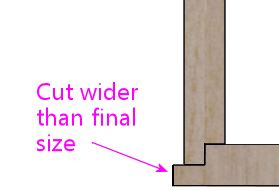

After assembly, the overhang lets you sand down the excess material until it's exactly flush with the adjoining section. It's almost impossible to get the surfaces perfectly flush in the initial cut, so your best bet is to start with a slight overhang that you can sand until flush. You can then add wood filler at the seam to further smooth it out.

*Simple 45° miter:* Some pin cab builders simply cut the ends of the main cabinet walls at a 45° bevel angle, for plain miter joins:

Woodworkers generally consider this an inferior join for large cabinets, since glue is weak when joining end-grain to end-grain like this, and because it's difficult to get the pieces aligned and squared properly given the lack of any interlocking structure. Even so, it might be viable for a pin cab if you're using the new-style Williams leg brackets (part 01-11400-1), since they add a lot of corner strength. I wouldn't personally use this join, but it's an option if you want to simplify the woodworking.

====  Adjusting dimensions for joinery

Pay close attention to the effects of your chosen corner joins on the overall dimensions.

The dimensions shown in our plans assume that you're using a mitered join of some kind for the main cabinet corners. Our illustrations show those corners with a mitered rabbet, so you'll see that join in the close-ups. Any miter join, including the locking miters and the simple 45° miter, is equivalent in terms of all of the measurements, so there's no need to make any adjustments for those.

With the mitered joins, note how each individual piece's dimensions exactly match the assembled cabinet's outside dimensions for that section:

In contrast, with the rabbet join, note how the "inside" piece (the one forming the face with the seam) is slightly shorter than the assembled cabinet's outside dimensions. This will be shorter at each corner by the depth of the rabbet groove, which is typically half the plywood thickness, so assuming there's a join like this at each end, the overall piece will need to be cut shorter than the desired final outside dimensions by 2 × ½ × the plywood thickness = 1 × the plywood thickness:

Likewise, for a butt join, the inside piece will need to be shortened by 2 × the plywood thickness, compared to the finished outside dimensions:

Our measurements for the main cabinet are based on using mitered joins at the visible corners, so be sure to adjust the dimensions before cutting if you're using a different join.

=== Edge finishes

On the original WPC cabinets, the outside bottom edges of the side and front walls are finished with a chamfer (a 45° bevel), about ⅛" wide. I don't think they did that for looks, but rather to soften the plywood edge, to make it less sharp and splintery. On my cab, I kept it simpler and just sanded the edges smooth. If you do decide to apply a chamfer with a router bit, it might be a good idea to test the bit on a piece of scrap plywood first - I've read that some plywood will chip if you try to bevel the edge like this, and that would defeat the whole purpose of smoothing it.

On the WPC machines, the front vertical edges (at the corners between the front wall and the left and right walls) are square, without any rounding or beveling. Some of the newer Stern machines round those edges out slightly - it looks like they route the edge with a 1/8" roundover bit. I just lightly sanded the corners on my cab until they felt smooth.

=== Exploded view

This view shows all of the pieces making up the main cabinet body.

The triangular wood pieces at the corners go under the metal brackets the leg bolts screw into. They provide reinforcement at the corners (to prevent the corners from splitting) and help strengthen the leg attachment. The leg bolts (two per corner) go through these at a 45° angle.

The two pieces at the top rear form a "shelf" that the backbox rests on. The rectangular routed opening in the horizontal piece is to pass power and video cables between the cabinet and backbox. The opening shown is what's used on the real machines, and it works well for a virtual cab as long as you only need to pass cables through. You might need a larger opening, though, if you plan to use a large monitor in your backbox that needs to extend into the main cabinet. This isn't an issue for a typical three-monitor setup with a laptop display for the DMD (or a real DMD device).

The smallish slat near the bottom front attaches to the floor on the real machines to form a niche to hold the cashbox. (The cashbox sits under the coin slots to collect the inserted coins.) Most virtual builds omit this piece to leave more room for the PC motherboard, which most people situate on the floor of the cab about halfway back.

=== Cutting up the plywood

There are numerous ways to divide plywood sheets into the panels making up the cabinet. For some suggested layouts, see xref:plywoodCuttingPlans.adoc#plywoodCuttingPlans[Plywood Cutting Plans for Cabinet Construction] .

[#sideWalls]
=== Side walls

Here are the side walls. The views are from the interior of the cabinet, to show details on the joinery routing.

(The flipper button holes and leg bolt holes are marked, but for the sake of readability, the dimensions aren't shown here. We'll provide close-up diagrams for these elements, with all of the measurement details, later in the section.)

image::images/main-left.png[""]

Left side wall, viewed from the cabinet interior side

Right side wall, viewed from the cabinet interior. The right wall is a simple mirror image of the left wall.

Remember that we're measuring the dimensions of the pieces based on a mitered join (either a mitered rabbet or lock miter) at the front and rear corners, meaning that the piece's dimensions match the outside dimensions of the assembled cabinet. If you're using a different join at the corners, be sure to make any necessary adjustments. See xref:#cabJoinery[Joinery] above.

Some more views to help with visualization:

*Backbox hinge pivot:* The backbox pivot is a ½"-diameter drilled hole for attaching the WPC-style backbox hinge. If you're using a different hinge system to attach the backbox, omit this.

NOTE: Some people prefer to wait to drill for the hinge pivots until after assembling the cabinet and attaching the hinges to the backbox, so that they can drill the pivots based on the actual assembled alignment of the backbox. The procedure I've always used is basically the opposite: drill the hinge pivot first, attach the hinges there, and then drill the backbox bolts for the hinges based on the final alignment. I haven't tried it the other way, so I'm not sure if that would be easier or harder overall, but the basic idea is the same either way. Use your discretion as to which approach sounds better.

*Floor dado:* The dado at the bottom is for the cabinet floor. Use a ½" straight router bit to cut a groove ⅜" deep (halfway into the thickness of the plywood), parallel to the bottom edge of the wall, ¼" from the bottom edge. This is on the *inside* face of the wall; the edge of the cabinet floor fits into this groove when assembled.

Left cabinet wall showing the dado (groove) for joining with the cabinet floor. Route the dado with a ½" straight bit to ⅜" depth, ¼" (or ⅜", if you prefer) from the bottom edge. This groove runs the whole length of the side wall. This is on the interior face, since it joins with the cabinet floor. The diagonal/step shape along the vertical edge at the left is the mitered rabbet cut for joining to the front wall, illustrated in more detail above.

NOTE: Some other people's WPC-replica plans show the floor dado at 3/8" from the bottom, rather 1/4" as depicted above. My original WPC cabinets measure 1/4", but I measured one older System 11 machine at 3/8". The larger 3/8" offset will make the joint a little stronger, and shouldn't much affect anything else, so I don't see any downside; use your discretion. Whatever you decide, be sure to route the corresponding dados in the front and back walls at the same offset, since they all have to align when assembled.

*Cashbox fence slot:* The slot for the xref:#cashboxFence[cashbox fence] is only needed if you plan on installing said fence, which is useful if you're going to use the standard type of coin collector box ("cashbox") made for commercial pinball machines. The cashbox sits at the front of the cabinet under the coin slots, and the fence helps hold it in place.

Most virtual cab builders don't use the standard cashbox because it takes up so much space. I'd omit the fence if you're not going to use the standard cashbox.

The routed slot isn't strictly necessary even if you do include the fence, but it makes it easier to install the fence during cabinet assembly by providing an anchor point to glue it to.

The slot only goes in the right wall. You can move it to the left wall if that's more convenient - it really doesn't matter which side it's on. But you only need a slot on one side or the other.

If you're going to use a custom cashbox that's not the standard size, you should move the fence (and thus the fence slot) to match the depth of the box.

[#edgeFinishes]
====  Edge finishes

The original WPC cabinets use a slight chamfer (a 45° bevel) on the outside bottom edges of the side walls, to soften the edge and reduce splintering. This is optional, but it will reduce the chances of snagged clothes and cuts from bumping into the side. See xref:#edgeFinishes[Edge finishes] above.

[#legBoltDrilling]
====  Leg bolts

The leg bolt holes are a little tricky. The bolts go through the corners at a 45° angle, so they bore through both adjoining walls at each corner. So, as shown in the illustration, the left and right walls only have "half a hole" for each bolt - really more of a semicircular notch.

Leg bolt holes, front (above left) and rear (above right). The distances are shown from the bottom of the cabinet. Note that the front legs are mounted higher on the wall than the rear legs. The legs themselves are the identical parts front and back, so the different mounting position is used to give the cabinet its characteristic tilt angle. The bolts are 3/8" diameter.

Cutaway view (with the front wall removed) showing the leg bolts installed, to better illustrate how the bolt holes intersect the side wall. The triangular wood piece that normally fills the gap between the metal plate and the inside wall is also hidden.

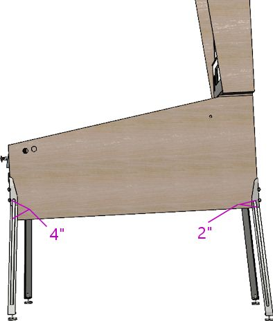

Illustration of how the leg install positions affect the cabinet slope. The legs are mounted higher on the cab in the front, which effectively raises up the back end slightly to slope the machine down toward the front. Standard pinball legs come with adjustable foot pads that you can use to make sure all four legs touch down and to fine-tune the playfield slope. The slope isn't needed for "physics" reasons on a virtual machine, but it's still desirable for an authentic appearance, and it also improves the viewing angle for the main TV.

There are two approaches to drilling the holes:

*  *Before* assembly, by cutting half-cylinder notches in each panel. The bolts are 3/8" diameter, so each notch needs to be 3/16" deep and 3/8" wide. You could accomplish this by hand with a round file, or using a router with a 3/8" round-nosed router bit. A round-nosed bit has a half-dome shape for its tip, so it routes half-cylinder grooves just as we need; route to a depth of 3/16".
*  *After* assembly, using a regular drill with a 3/8" bit to drill the holes. It's difficult to drill into a corner at a 45° angle free-hand, but it's doable using a "drilling block" - a tool with guide holes for different size drill bits. You'll need one that's designed for drilling into a corner; you can find these on Amazon by searching for "corner drill guide" or "45 degree drill guide". Some people have built DIY guides by bolting together a couple of 2x4 pieces to form a corner.

If you prefer something more purpose-built, here's a 3D-printable model for a drill guide that's designed just for the leg bolts. It fits over the corner and has two 3/8" holes at the standard 2¼" spacing.

* link:http://mjrnet.org/pinscape/downloads/leg-bolt-drilling-jig.zip[leg-bolt-drilling-jig.zip]

Preparing to drill for a leg bolt at the front right corner, using a general-purpose drill guide block. This drill block features a notch specifically for drilling into a corner at a 45° angle. I'm using a band clamp wrapped around the whole cabinet to hold the drill block in place. You have to clamp the drill block down pretty tightly, and even then you have to be careful to use a steady hand - those 45° notches are small, and the drill gives you a lot of leverage.

Personally, I find the "before" approach too difficult to do by hand, because of the 45° angle and because you have to get the notches on the adjoining edges align perfectly. This is probably only workable if you're making the panels with a CNC machine. I'd go with the drill-after-assembly approach otherwise.

With either method, the holes should end up being a tight fit for the bolts. That's good, since you don't want the legs to be wobbly on a 250-pound cabinet. But if they're too tight, try rubbing a little paraffin wax or a similar dry lubricant on the bolts. (I wouldn't use anything oily or greasy.) If that still doesn't work, you can use a small round file to expand the holes slightly - but as little as possible, to avoid weakening the corner.

[#flipperButtonDrilling]
====  Flipper buttons

Here's the drilling plan for a set of two flipper button holes on each side. The front button in each set is the regular flipper button, and the rear button is the "MagnaSave" button, which is for the benefit of some pinball games that have extra controls beyond the regular flipper buttons. The rear buttons are optional, and not everyone likes them since they're not all that common on real machines, but I think it's good to include them because of the large number of virtual tables that make use of them. See xref:magnaSaveButtons.adoc[Tables with MagnaSave Buttons] for more about these buttons, and a list of some of the tables that use them.

NOTE: Some side rails are wide enough to cover the flipper buttons, in which case they'll come with pre-drilled holes for the buttons. The WPC rails are narrow enough that they sit entirely above the flipper buttons, so they don't need any holes for the buttons. If you're using wide rails that do cover the flipper button area, ignore our drilling locations! Your cabinet flipper button holes need to line up with the ones in the rails. So use the button holes in your rails to determine where to drill.

image::images/flipper-button-detail.png[""]

Flipper button drill hole detail for WPC-type side rails. Measurements are in inches; distances are to the center points of the holes. (Don't use these locations if you're using older side rails that cover the flipper buttons. Instead, use the pre-drilled flipper button holes in your rails as drilling templates, so that the cabinet holes line up with the holes in the rails.)

The distances in the diagram are measured are from the center of the drill holes to the front and top edges of the wall, square with the front edge. The measurements are referenced to the *outside face* of the *fully assembled* cabinet. If you're measuring prior to assembly, make any adjustments needed to account for offsets from your front corner joins. Mitered joins shouldn't require any adjustments, since the outside edges of all faces go all the way to the corners.

Don't rely on the locations in the diagram if you're using wide side rails that extend over the flipper buttons. Those come with pre-drilled holes for the flipper button, so you'll need the cabinet wall drill locations to match the pre-drilled rail holes. Do a dry fit with the rails to determine the drilling location.

How to drill:

* The easy way: drill straight through with a 1⅛" diameter hole saw or Forstner bit. This works only if you're using something to anchor the button on the inside, such as the VirtuaPin flipper switch bracket or an LED board (see xref:buttonLamps.adoc#flipperButtonLights[Button Lamps] ) to illuminate the button.
* The original way (used on most of the real machines): This pattern has a narrow waist for the stem of the button, and larger insets on the outside and inside for the body of the button and the Pal nut, respectively.
** Drill a small pilot hole (1/8") on the center, all the way through
** Use a 1⅛" hole saw, Forstner bit, or router bit to drill a 5/16"-deep depression from the *outside* , on the same center
** Use the same 1⅛" bit to drill a 3/16"-deep depression from the *inside*
** Drill the rest of the way through with a ⅝" bit, on the same center

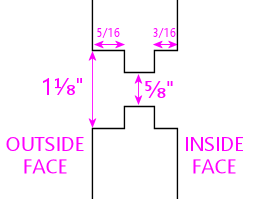

Schematic diagram of the "original" flipper button drilling pattern. This is an edge-on view of the side wall.

The original "stepped" pattern lets you fasten the button with a Pal nut, without any additional brackets on the inside. Use this pattern if you don't plan to use an LED board or switch holder bracket. The straight-through approach is better if you're planning to use an LED board to illuminate the button, since it provides a tunnel for the light to shine through. But you need some sort of bracket on the inside in this case, because the Pal nut fits through the larger 1⅛" hole. An LED board can serve as the bracket, as will a VirtuaPin flipper switch holder. If you're not planning to use one of those, the original stepped pattern is better.

Variations:

* The rear (MagnaSave) buttons are optional. If you don't want to include them, simply don't drill the holes. The regular flipper buttons go at the same position whether or not you include the MagnaSave buttons.
* There are at least two other good ways to position the MagnaSave buttons. Some people place them directly below the flipper buttons, and some people prefer them diagonally behind and below the flipper buttons. Both of those patterns have precedents in real pinball machines that had the extra buttons (see xref:magnaSaveButtons.adoc[Tables with MagnaSave Buttons] ). The layout in my diagrams is based on the Williams MagnaSave games from the 1980s, so it's probably the most familiar look to most players, but not everyone likes the feel, due to the stretch to reach the rear buttons. The more vertical layouts are arguably easier to reach, and make it it easier to keep a finger on each button.
* Williams System 11 games (1980s) placed the flipper buttons about 1/4" higher than shown in my diagrams, which are based on the WPC games (1990s). System 11 games used broader side rails that covered the flipper buttons, so I think the slightly different positioning is purely to accommodate the different rails. I don't think it noticeably affects the feel.

[#glassChannelSlots]
====  Glass channel slots

If you're going to install the standard side rails and a glass cover over the playfield, you should also install a set of "glass channels". These are plastic "U"-shaped trim pieces that fit under the side rails, along the left and right edges. These hold the glass at the sides.

Because the glass channels are "U" slots along the length of the machine, you can slide the glass in and out of the channels through the front of the machine, after removing the lockbar. This is part of the tried-and-true design of the real machines that lets an operator easily open up the machine for maintenance access, and I think it's a great thing to replicate in a virtual cab.

The glass channels are installed under the side rail. Here's a close-up of how they look when installed:

image::images/glass-channel-installed.png[""]

The channels attach to the side wall via a "spine" sticking out of the bottom of the plastic channel. The spine which fits into a slot in the top edge of the side wall.

image::images/glass-channel-profile.png[""]

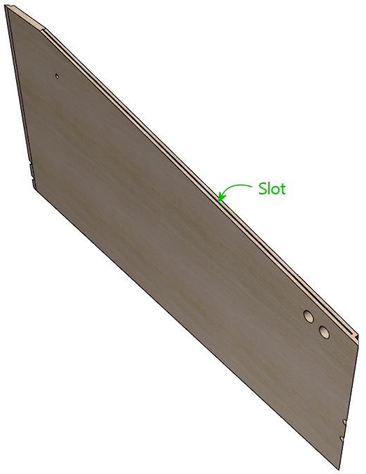

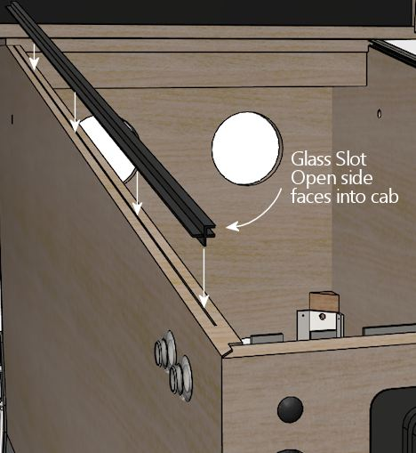

This is a neat design, in that you don't need any fasteners or adhesives. You just press the spine into the slot, and it's held there by friction. If it's ever necessary to take the channel out, you can just pull it out. On the other hand, it presents us with another little wood-working challenge: how do we cut that precise little slot?

As usual, it turns out that there's a special tool for this job, and it's really easy once you have that magic tool. What you need in this case is a special-purpose router bit called (naturally) a slot cutter. Just as a drill bit is designed to drill a hole of a specific diameter, each slot cutter bit is designed to make a slot of a specific width and depth. For this job, you need a bit with a 3/32" slot width and 3/8" slot depth. (A deeper slot, like 1/2" or 5/8", will also work if you can't find a bit for that exact depth. But the width is important - it should be exactly 3/32".) The bit I use for this is Freude part #63-106, which works perfectly.

Once you have the necessary slot cutter bit, cut a slot along the top edge of the sloped portion of each side wall, centered along the edge, starting about 1½" from the front and ending at the top of the sloped section. The photos below give an overview of how you set up the bit and cut the slot.

Slot-cutter bit, 3/32" slot width, 3/8" depth (the photo shows a Freude #63-106, but other brands are available with the same specs)

The slot-cutter bit set up in a hand router. This bit works best with a fixed-base router. A plunge router will also work - you just have to lock the depth. You can also do this with a router table, using your router table's setup for a bit with a pilot point. I'm using a hand router for these illustrations, since I've found that to be an easy way to use this bit, but the process is essentially the same with a table.

Measure the thickness of the plywood, and mark the centerpoint.

To make sure you found the exact center, flip the board over and measure the same distance from the other side. Adjust your measurement and repeat until the center mark is accurate.

Now clamp the board to a horizontal surface. Make sure the router is unplugged! Place the router base flat on top of the board, with the bit against the edge. Using the router's cut depth adjustment (see your router's instructions), adjust the bit depth so that the slot cutter blade lines up with the center line you marked in the previous step. Lock the router at this depth - this sets the bit to cut the slot at the center of the board's edge.

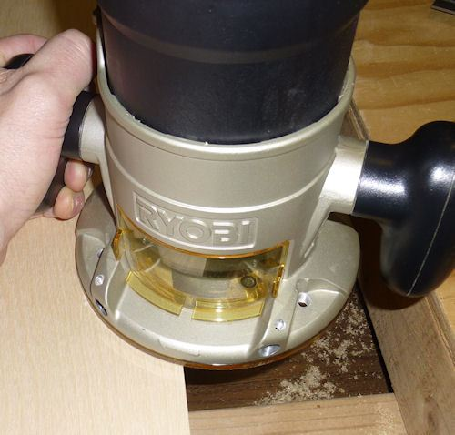

You're all set to cut the slot. Plug the router in. Make sure the board is securely clamped to a horizontal surface. Place the router flat against the board with the bit hanging over the edge right next to the starting point for slot. For safety, always make sure that the bit isn't touching the work piece (or anything else!) when you switch the router on - so position it so that the bit is just clear of the work piece, at the point you want to start the cut, with the base flat against the board. Keep the router base flat against the board at all times throughout this procedure, and hold the router in both hands to keep it steady. When the router is up to speed, gently slide it sideways into the edge of the board to start cutting the slot. The bit's pilot point will automatically stop the bit at the correct slot depth, so just keep sliding it into the edge until it hits the pilot point. Now slowly move the router along the edge of the board, parallel to the edge, keeping the pilot point pressed against the edge, until you reach the end of the span where you want the slot to be. Finally, withdraw the bit from the slot, by sliding the router sideways away from the edge of the board just far enough for the bit to move clear of the slot, then turn off the router.

[#frontWall]
=== Front wall

The front wall is the most complex section of the cabinet. It has a whole bunch of things attached: the coin door, several pushbuttons, the plunger, the lockbar, and the leg bolts. There are so many things vying for a limited amount of space that the positioning of each part is pretty constrained; everything fits together like a 3D puzzle.

I initially tried to cram all of the measurements for all of the cutouts into a single diagram, but I quickly abandoned that idea, since it was way too busy. So instead, I've broken it out into several diagrams, one for each set of cutouts. We'll start with the basic outline and its overall dimensions, with the purpose of each cutout labeled.

Main cabinet front panel, viewed from the front (exterior side).

Remember that we're measuring the dimensions based on a mitered rabbet join at the corners, and that you might need to adjust the dimensions slightly if you're using a different join style. See xref:#cabJoinery[Joinery] above.

More views for visualization:

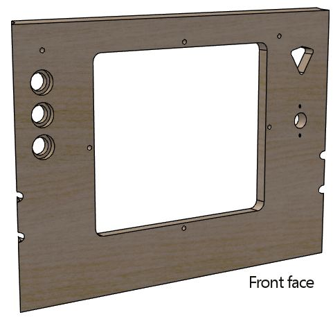

The overall width is based on the standard-body design. If you're building a widebody or custom-width cabinet, adjust the width of this piece accordingly. Keep the coin door cutout centered horizontally at the new width, and keep the buttons and plunger at the same distance from their respective side walls.

The dado at the bottom is for joining with the floor of the cabinet. This is exactly the same as the ones in the side walls: route a ½" wide groove to a depth of ⅜" (half the thickness of the plywood) along the whole bottom edge, on the interior side, ¼" from the bottom. As mentioned earlier, some other published WPC plans offset this dado from the bottom by 3/8" instead of 1/4"; use the same offset that you used for the side walls.

The leg bolts go through the corners of the front face at a 45° angle, just like the way they work with the side walls. Route notches for the bolts exactly as we described earlier for the side walls. Use the same positioning (measured from the bottom edge) as for the front legs on the side pieces. The front notches in the side walls need to align with the notches in the front wall when the cabinet is assembled.

[#frontWallBevel]
The top edge of the front wall should be cut at a 10° bevel angle, to match the slope of the side walls. This corresponds to a rise of about ⅛ over the thickness of the plywood. In other words, the height at the back face (the side facing the interior of the cabinet) should be about ⅛ taller than the height at the front face (the exterior side), as illustrated below.

Side view of front panel (viewed from right) showing the slight angle at the top, to match the slope of the side walls.

The angled top edge will result in the best fit, but you can just cut it square if your saw can't handle beveled cuts. If you cut it square, cut the piece according to the shorter *exterior* height. Using a square cut means that the back top edge won't quite align with the top edges of the side walls. But this whole area is covered by the lockbar when the machine is assembled, so it'll only be visible when you remove the lockbar to access the interior. The gap won't affect alignments for any of the trim hardware, so it won't have any functional impact.

If you do use the sloping top edge, note that all of the measurements shown in our diagrams and plans are based on the *front* face - the shorter exterior side. Things will be off by ⅛" if you measure with reference to the top edge of the back side, since it's slightly taller. So be sure to do all of your measuring and drilling from the front side.

====  Edge finishes

The original WPC cabinets use a slight chamfer (a 45° bevel) on the outside bottom edge of the front wall, to soften the edge and reduce splintering. This is optional, but it's a little nicer than a sharp square plywood edge. See xref:#edgeFinishes[Edge finishes] above.

[#coinDoorCutout]
====  Coin door cutout

The rectangular cutout in the center of the front wall is for a standard pinball coin door. All pinball manufacturers have been using the same coin door dimensions since the 1980s, so just about any coin door made for any modern pinball brand should fit the same cutout. Suzo Happ makes a universal replacement door that fits this template, and you can also still buy the original Entropy coin doors that Wiliams used in their 1980s machines. I'm not as certain that pre-1980s doors are as standardized, so if you have an older coin door, you should measure it before using the diagram below, to make sure it fits.

Coin door cutout and bolt locations, viewed from the *interior* face of the front panel. Important: the measurements referenced to the top edge will be slightly different (about 1/8" less) when measured on the exterior face, because of the angled cut on the top edge. The interior face is about 1/8" taller than the exterior face because of the slant.

The cutout in the diagram above is fairly generous. It leaves about 1/8" of play on all sides for an easy fit, so it should easily accommodate manufacturing variations in the coin doors. By the same token, when cutting it out, err on the side of cutting inside the lines. The actual cutout doesn't need to be even a hair bigger than depicted.

The four 9/32"-diameter drill holes around the perimeter of the coin door cutout are for the carriage bolts that fasten the door to the plywood. Use ¼"-20 x 1½" carriage bolts for these. Mate them to ¼"-20 hex nuts, which go on the inside. The carriage bolts are available in black, which is what the WPC machines use to match the powder black finish of the WPC-style doors. The bolts are also available in stainless steel, chrome-plated steel, and silicon bronze, one of which might look nicer if you have a door with a metallic finish.

Note! The spacing between the coin door cutout and the four bolt holes around the perimeter is tight (only about 3/16"). Measure and drill carefully.

The coin door is usually centered left-to-right. If you're using a custom width, simply figure the position so that it's centered horizontally. *Don't* try to center it vertically, though. The vertical position has to align with your lockbar receiver, because the coin door's top center bolt hole has to align with the receiver's center bolt hole, as illustrated below.

If you're using the standard WPC-era parts (a 1990s coin door and a Williams WPC lockbar receiver), the vertical position shown in our diagrams should align the receiver properly. If you're using different parts, they might have a different design, so you might need to adjust the vertical position to match. See the "dry fit" procedure in the lockbar receiver section below for advice on how to figure the right position for different parts.

If you're not using a coin door at all, you should obviously omit the rectangular cutout, as well as the drill holes around the perimeter. Note that the top center hole is shared by the coin door and lockbar receiver, though, so if you're using a standard lockbar receiver, you'll still need to drill that hole even though you don't need it for the coin door.

[#lockbarReceiverDrills]
====  Lockbar receiver

The three small drill holes shown at the top of the front wall plan are for the carriage bolts that fasten the lockbar receiver to the front wall. (If you're not sure what the receiver is or what it's for, we'll explain more about it shortly.)

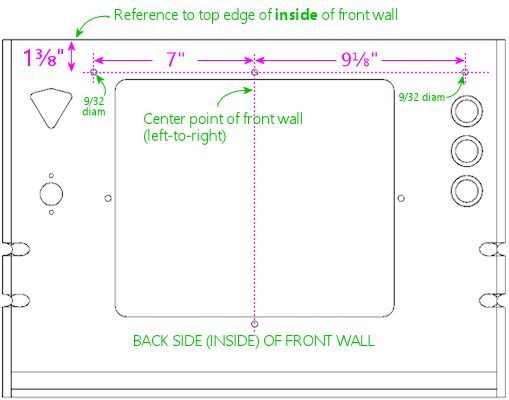

As with the coin door, use the center point of the front wall (left to right) as the horizontal reference point for the center hole.

The receiver has to be positioned vertically so that the lockbar will fit properly when inserted into the receiver. The vertical position of the bolt holes in our plans is specifically for a Williams WPC lockbar receiver, to place it at the right height so that the lockbar will fit properly.

*Fine-tuning:* I've found in my builds that the bolt positions above, which come from measuring original Williams equipment, can make the lockbar fit a little tighter than I like - not so much that it doesn't fit, just enough to make the fit feel a little clunky. Moving the bolt drill positions upwards by 1/32" to 1/16" might actually work a little better. If you do this, it would be a good idea to also move all of the coin door positions (cutout and bolts) by the same amount, since the coin door has to align with the lockbar center bolt. If you want to evaluate for yourself whether this would be a good idea or not, try the "dry fit" procedure described below - that's intended to help you re-figure the drill positions if you're using non-standard equipment, but it works equally well with the standard parts. I'd start by marking the standard positions above on your front wall panel, then do a dry fit and check the receiver's bolt holes against the markings. If they look a little off vertically, adjust accordingly. For the standard Williams receiver, the ideal vertical position is where the two little tabs sticking up at the front of the receiver line up exactly with the top edge of the front cabinet wall. (On my original Williams equipment, I see variations in this fit from the tabs being perfectly flush with the top of the wall, to being about 1/16" below.)

*If you're using a WPC receiver, but other side rails or glass guides:* The measurements here assume that you're using the WPC lockbar receiver *and* the WPC-style side rails and plastic glass guides. The thickness of the rails and guides is important to the overall positioning. If *any* of this is different in your setup, you might have to adjust the bolt positions vertically, since the lockbar might sit at a slightly different height than with the full set of standard parts. It's difficult to figure the right position on paper, because the parts have to fit together in a sort of 3D puzzle, and they fit tightly enough that there's not much room for error. I think it's easier and more reliable to do a "dry fit" with all of the parts together and take measurements from that. See the procedure below.

If you have to adjust the vertical position of the bolt holes, you should adjust the coin door position to match. The coin door has to line up with the lockbar's center bolt, so if you move the lockbar bolts up or down, the coin door has to be moved up or down by the same amount.

*If you're not using a WPC receiver:* There are several other options for a lockbar receiver besides the WPC part. If you're using something different, it'll probably have a whole different drilling pattern for its fasteners. It might not even use the same bolts. The best way to figure the right drilling positions (if needed at all) is to gather your equipment and do a "dry fit" as described below.

Note that the center hole is still needed for the coin door, if you're using one, regardless of whether your lockbar uses it.

*Dry fit:* Here's a procedure you can use to fit your lockbar and other related parts together prior to drilling any holes, to measure or fine-tune the positioning:

* Set up the front and side walls in their assembled positions.
* Set up the side rails with the glass guides, if they'll be part of the final setup.
* Plug the lockbar into the receiver.
* Position the lockbar at the top front where it'll be during normal use. You want the lockbar to sit snugly on top of the side rails when everything is put together, so at this stage it's a good simulation to simply set the lockbar on top of the rails.
* Now hold the receiver's front surface flush against the inside front wall. Make sure the lockbar is still where you want it.
* Mark the positions on the inside of the front wall corresponding to the positions of the three bolt holes in the receiver. (The bolt holes in the receiver are actually little slots, to give you a little wiggle room to make up for measuring errors, so mark the position at the center of each slot.)

You can now take it all back apart, and drill at the marked positions instead of the ones in the plans.

====  How the lockbar works

In case you're not already familiar with how all of the pinball trim pieces work, here's a brief overview.

The "lockbar" (also known as the "lockdown bar") is the metal trim piece along the top front edge of the machine. It's so named because it serves to lock the top glass cover in place. It also functions as a trim piece, for the sake of appearance as well as to provide a comfortable place to rest your hands while operating the flipper buttons. Standard lockbars have nice smoothly rounded corners. Try playing a round on a machine with the lockbar removed if you want experience for yourself how unpleasant the plywood edges are as a hand-rest.

image::images/lockbar.png[""]

If you're using standard pinball parts, the lockbar mates with a part inside the cabinet called the "receiver". A couple of prongs that stick down out of the lockbar fit into receptacles in the receiver, where there are some spring-loaded latches that grab the prongs and secure the lockbar. A lever on the receiver, which you can reach through the coin door opening, lets you release the latches and free the lockbar. With the lockbar off, you can slide out the glass to access the interior. It's all cleverly designed to let an operator open up the machine quickly and without any tools, while keeping it buttoned up against intrusion by mischief-makers.

The receiver attaches to the inside of the front wall of the cabinet. It's fastened with three carriage bolts. This is what the drill holes at the top of the front wall are for. The center bolt is shared between the coin door and receiver - both parts have holes in this position that align when everything is assembled. This is why the vertical position of the coin door is so important: the coin door aligns with the lockbar receiver, and the receiver has to align with the top of the wall so that the lockbar fits properly.

[#frontPanelButtons]
====  Front panel buttons

The three large circular holes at the top left of the front panel diagram are for buttons that the player uses to start and exit games and otherwise interact with the software. Our plans assume that you're using SuzoHapp small pushbutton (pictured at right), which are the type used for most of the front-panel button on real machines since the 1990s. These are the exact type that most pinball suppliers will sell you if you buy a replacement Start button, Extra Ball button, or generic "pushbutton with lamp assembly". There are other similar buttons available from other companies that you can use as well, but you might need to adjust the drilling dimensions and/or spacing for other models.

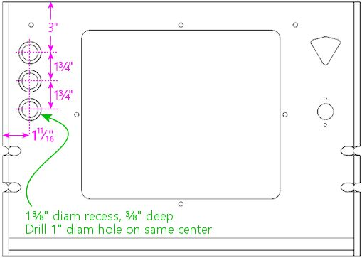

Typical button positioning, with three buttons (usually "Start", "Extra Ball", and "Exit"). Viewed from front/outside of front panel.

WARNING: *Replacement cabinet builders:* If you're building a replacement cabinet for a real pinball machine, take measurements from a factory original of the same title to determine the button placement. The cabinet artwork for some titles includes designs around the front panel button(s), so you might also want to check alignment with the art.

For the SuzoHapp style of pushbuttons, drill the holes in two stages. First, using a 1⅜" Forstner bit, from the front (outside) face, drill a recess 3/8" deep (about half of the plywood thickness). *Don't* drill all the way through. In the diagram, the recess is the larger circle drawn around each button. Then drill a 1" hole on the same center the rest of the way through. The recess allows the button to sit flush with the front surface of the cabinet.

image::images/button-hole-drilling.png[""]

Above left: Drilling detail for the button holes, viewed from the exterior face. Drill a 1⅜"-diameter recess to ⅜" depth (about halfway through the plywood). A Forstner bit works best for this. Then drill a 1" diameter the rest of the wall through, on the same center. Above right: when installed, the buttons are recessed in the routed depressions, so the button faces are roughly flush with the outer surface of the cabinet.

The recess is optional. It's the way that the buttons were mounted on the real 1990s machines, and I think it looks more finished. But if you want to keep things simpler, you can skip the recess and simply drill a 1" hole straight through. The buttons will jut out by about a quarter inch if you omit the inset, but this won't look "wrong", since the buttons are trimmed to work with this mounting style as well.

Our plans show the positions for three buttons, but that's only a suggestion. As far as software usability goes, the virtual pinball software more or less requires a minimum of two buttons: "Start" and "Exit". The third button in our plans can assigned be any other function of your choice, or you can omit it entirely. See xref:cabButtons.adoc#cabinetButtons[Cabinet Buttons] for ideas and recommendations. I think it's a good idea to include a third button, even if don't already have a clear use for it in mind, since it will be hard to add one later. You can change the meanings of the buttons at any time in the software, so you're not stuck with the functions you choose initially. I assigned my third button as "Extra Ball", since that's used on a lot of real machines from the 1990s. Another useful function is "Coin In" (to simulate inserting a coin), although I prefer implementing that via the coin return buttons on the coin door, since that's a more natural and inconspicuous place for it. Other possibilities include game-specific extra buttons, or special functions in your game navigator software.

Omitting a button is easy. If you only want to include two buttons, simply drill the top two holes at the positions shown, and skip the bottom one.

It's difficult to add more buttons beyond the three shown given the space constraints. With the spacing shown, there's not enough room for a fourth button at the top, since the lockbar receiver will get in the way, nor at the bottom, where the leg brackets will conflict. However, you just barely make room if you move the top button up about ½" (that's the limit before it conflicts with the lockbar receiver) and then tighten up the spacing on the other buttons by about ⅛". That will give you just enough room for a fourth button at the bottom.

[#ballShooterRouting]
====  Plunger and Launch button

Our plan includes a traditional mechanical plunger, at the standard position used on nearly all real machines, at the upper right corner corner of the front face. We also include a Launch Ball button, situated just below the plunger, to accommodate tables that originally used a button or trigger in place of the traditional plunger.

Be aware that this traditional plunger position doesn't work for everyone! In particular, it can get in the way of the TV if you want to place the TV very close to the front wall. See "Other plunger/Launch button layouts" xref:#otherPlungerLaunchButtonLayouts[below] for an alternative plan that swaps the positions of the plunger and launch button to make room for the TV. If you haven't thought about the TV conflict issue, see "The dreaded plunger space conflict" in xref:playfieldMounting.adoc#plungerTVSpaceConfict[Playfield TV Mounting] and "Positioning the plunger" in xref:plunger.adoc#positioningThePlunger[Plunger] .

WARNING: *Replacement cabinet builders:* If you're building a replacement cabinet for a real pinball machine, don't rely on my plunger positioning! The plunger on a real machine has to line up with the shooter lane on the playfield, so it depends on the playfield depth, which varies from one title to the next. The differences can be substantial - the Williams System 11 games generally have the plunger about 1" higher than on the WPC games. Your best bet is to measure the factory drill positions from an original cabinet for your specific game. If you don't have access to one, try asking on a pinball owners forum such as link:https://www.pinside.com/[Pinside] .

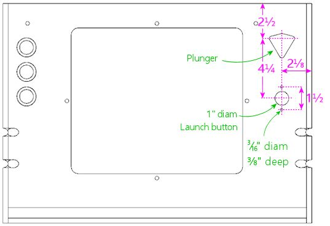

Drilling positions for plunger and Launch Ball button, with the plunger in the standard position used on real machines, and the Launch button below.

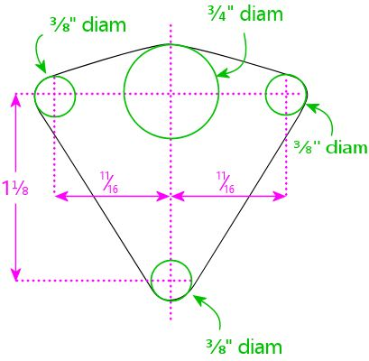

Drilling pattern for the plunger opening. Reference the vertical location from the main plan to the top dotted line. For the standard plunger-on-top configuration, this is 2½" from the top of the panel.

To cut the plunger opening:

* Drill a ¾" hole at the large green circle at top center. It's best to use a router, or a drill with a hole saw bit or Forstner bit. (Don't use a spade bit; they make ragged, chipped holes in plywood.)
* Drill ⅜" holes at the three smaller green circles.
* Use a jigsaw or router to cut along the perimeter of the shape described by the four holes, shown as the black outline on the diagram.

The illustration at right shows how this looks when assembled.

This arrangement, with the plunger on top and a Launch button below, is the one I prefer. It has two main virtues. First, the plunger position matches the real machines of the 1990s, so it looks "normal" if you're used to the way those machines look. Second, it's nice to have the dedicated Launch button for tables that use one, and this placement looks the most natural to me. You won't actually find any real tables that have both a plunger and a Launch button, so that much is not quite authentic - but many real machines did have _some_ sort of button at the same location (e.g., an Extra Ball button), so it doesn't look at all out of place.

[#otherPlungerLaunchButtonLayouts]
====  Other plunger/Launch button layouts

The traditional plunger location shown above doesn't work for everyone, because it can create a space conflict with the TV if you want to position the TV at the very front of the cabinet. Before you drill anything, take a moment to consider if you'd prefer some other setup. Here are the most common options:

* Include only the plunger, with no Launch button. Some people prefer a more authentic-looking setup with just the plunger. This an easy modification: just don't drill the hole for the Launch button.
* Invert the arrangement so that the Launch button goes on top and the plunger goes below. Some people use this arrangement to make room for the TV to fit closer to the front of the cab. To make this change, use the inverted plan below.
* Include only the plunger, but lower it to get it out of the way of the TV, so that the TV can be mounted closer to the front of the cab. To implement this, use the inverted plan below, and skip drilling the hole for the Launch button.
* Include only the Launch button, with no plunger. To do this, use the inverted plan below, but don't cut the plunger opening.

For more advice on choosing among these options, see xref:plunger.adoc#plungerPlunger] .

====  Inverted plunger/Launch button

Here's the inverted layout, with the plunger below the Launch button. This places the Launch button at the exact position used on real machines that use this control (which also happens to be the standard plunger position, not surprisingly), so it'll look authentic as far as that goes; of course, the addition of the plunger below the button isn't to be found on any real machines.

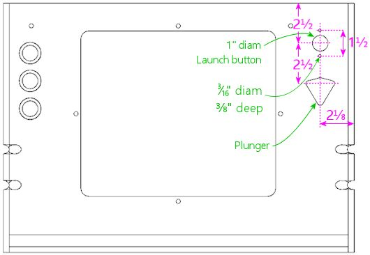

Inverted arrangement with the Launch button on top and the plunger on the bottom.

Note that the spacing between the plunger and Launch button is a tiny bit tighter with the inverted layout than with the normal layout (by about an eight of an inch). This is due to space constraints. The plunger can't safely be moved much lower, because the exterior side of the plunger housing will conflict with the front right leg if you do. If you really need to move the plunger even lower than shown (to make room for the TV, for example), you might be able to eke out a few extra 16ths of an inch, but it might be an uncomfortably tight fit. Measure your actual parts carefully before making changes.

====  Other cutouts

I don't recommend any other controls or ports in the front wall, since this is the most conspicuous part of the machine other than the playfield area, it's already pretty busy with just the standard controls. However, there are a few extra items that some people add here:

* Volume controls
* Night mode switch
* USB/keyboard/mouse ports

I'd personally avoid the front panel for all of these and place them on the bottom or back of the cab instead, where they'll be less visible.

For volume controls, I'd recommend using doubled-up flipper buttons instead of a separate knob (see my link:http://mjrnet.org/pinscape/PinVol.html[PinVol] page for an explanation). But if you really want a separate knob, and you don't want to have to reach under the machine to operate it, one way to make it inconspicuous is to install it in the coin door, by drilling a hole for the knob stem.

[#backWall]
=== Rear wall

The rear wall is a lot simpler than the front wall. It just has a couple of openings for cooling vents, and another for the power inlet. Nothing has to align with standard trim pieces here, so the placement of the openings is flexible.

Rear wall, viewed from the interior side.

The fan openings are designed to accommodate 120mm PC case fans, mounted just behind the openings (on the inside of the cab) and oriented to blow air out the back. These aren't authentic to the original WPC design (for the original layout, see the diagram below). The WPC machines had smaller, passive vents. Most virtual cab builders want to include fans to actively blow air through the cabinet for cooling, which the larger openings accommodate.

The power inlet opening is there to pass the machine's main power cord through the back, for plugging into a wall outlet. This is the same as the original WPC equipment, which has a C14 power inlet (the same type of power cord connector used on most desktop computers) behind the opening.

The size and placement of the fan openings and power inlet are merely suggestions. Customize them as you see fit. Take care that anything you install on the back wall doesn't get in the way of the playfield TV, but that usually isn't a problem, since the back end of the TV is usually well forward of the back wall. The leg notches and floor dado should be implemented as shown, since those do have to align with other parts.

WARNING: *Replacement cabinet builders:* The circular fan openings shown in the diagram above aren't authentic to the original WPC cabinet design. A replacement cab for a mechanical pinball machine should follow the pattern used in the Williams cabinets of the 1980s and 90s, with passive vent openings as shown below.

Original rear wall design used on the real machines, with passive cooling vents instead of fan openings, viewed from the interior side. This is the layout of the Williams cabinets of the 1980s and 1990s. Virtual cab builders usually replace the vent slots with larger circular openings that can accommodate PC case fans, to provide active cooling. Virtual cabs tend to need active cooling in the main cabinet because they typically house a TV and a PC motherboard, both of which can generate a lot of heat.

Most people use the same joinery style for the rear wall as for the front wall, but that's not required. I think a mitered join (such as a mitered rabbet or lock miter) is nice here, since it yields seamless corners, but that's probably not as cosmetically important as it is at the front. A simpler join that produces visible seams, such as a rabbet or even a butt join, can be perfectly adequate aesthetically.

Top view of rear section, showing the joinery shapes at the rear corners. This uses the mitered rabbet as described in the side walls section earlier.

The leg bolt notches work exactly like on the front and side panels. Use the same measurements as the *rear* leg notches on the side panels, since those need to align with the ones on the back wall when the cabinet is assembled. See the side wall section above for details.

The floor dado is a routed groove that the floor fits into when you assemble the cabinet. This is the same as the floor dados on all of the other pieces: use a ½" straight bit to route a a groove ⅜" deep (about half the thickness of the plywood), parallel to the bottom edge, offset ¼" from the bottom edge. See the side wall section above for a diagram. As mentioned earlier, some other published WPC plans offset the dado by 3/8" from the bottom rather than 1/4", which might be preferable for added strength at the joint. Whatever offset you choose, use it consistently for all of the floor dados on the sides, front, and back.

====  Power inlet

The hole near the lower right of the back wall plan is for the main AC power inlet. On the real machines, this is a 2½" diameter hole positioned as shown. There's nothing special about this location for a virtual cab; move it and/or resize it as needed for your own power supply setup. If you're not sure how you're going to set up the main power supply, you can just follow the generic plan, since it's pretty versatile; the opening is large enough that you could just feed a power strip's cord or an extension cord through it, and it could also accommodate a C14 inlet mounted in the opening. You can drill a hole of this size with a hole saw bit, or using a hand router with a circle jig.

====  Fan openings

The fan holes in our back wall plan represent a deviation from the real WPC cabinet design, to meet the special needs of the virtual cab. Real pinball machines don't need much cooling for the main cabinet, so the WPC cabs just have a pair of small passive vents at the back. Virtual cabs, in contrast, tend to need active cooling with fans, since the main cab has a big TV and (in most cases) a PC motherboard.

Our plans provide two openings in the rear wall designed for PC case fans. The idea is that you place an exhaust fan (blowing air out of the cabinet) on the inside of each opening. The cabinet floor (which we'll get to next) has another similar opening for an intake fan. This arrangement is designed to work with the natural air flow from the tilt of the monitor: the tilt makes the monitor higher at the back, so warm air will tend to flow towards the back of the cabinet as it rises. The exhaust fans at the back will help remove the hot air and pull cooler outside air into the cabinet from the floor vent.

The holes shown in the diagram are for 120mm fans (about 4¾" inches diameter). This is a common size for PC case fans, but other sizes are available; some people like to super-size their fans because larger tends to be quieter. Resize the openings for your fans as needed.

There's nothing magical about our placement of the fan openings, so move them as needed. I recommend keeping them relatively high up on the wall to take advantage of the natural flow of rising warm air. The point is to remove the hottest air from the cabinet, and that will tend to move towards the upper portion of the space.

For more on cooling, see xref:fans.adoc[Cooling Fans] .

====  Other rear wall cutouts

Here are some other optional items that you might want to consider, as long as you're drilling holes in this piece. There's no standard placement for any of these, so use whatever location is convenient for your setup.

* Ethernet port. Wired network ports can come in handy even if you're planning to install a Wi-Fi card or powerline Ethernet. The rear of the cabinet adjacent to the power inlet is an excellent place for this. Keystone jacks are useful here. See "External I/O plugs" in xref:pcInstall.adoc#externalIOPlugs[Installing the PC] .
* USB ports. It's also good to have some external USB ports, and the back of the cab makes a convenient place for a couple of these. As with Ethernet, you can use Keystone jacks. If you're installing a Keystone jack plate for Ethernet anyway, you can make it a 3-gang or 4-gang plate and populate it with a couple of USB ports while you're at it.
* Keyboard/mouse ports (these are usually just more USB ports). I prefer the floor of the cab near the front, since that's where you'll actually want to use the keyboard and mouse, but the back of the cab will do if you just want a single cluster of ports.
* Openings to pass wires for light strips on the back of the cab (see xref:lightStrips.adoc[Undercab Lighting] )

====  Back rails

The real WPC cabinets have a pair of wood rails on the back, as illustrated below. Each rail has a pair of hard plastic furniture slider pads attached (the nail-in type, typically 3/4" diameter, white or tan), one at each end. These are designed to let you stand the machine on its back, with the backbox folded. The machine is more compact in this configuration, which can be helpful for moving, shipping, and storage.

These rails are optional. If you want to include them, cut the two strips at the size shown. On the WPC machines, the ends are beveled at about 30°.

Shipping configuration: legs removed, backbox folded down, placed on back. The machine can be strapped to a pallet and boxed or plastic-wrapped. This is good for freight shipping because it has relatively small footprint and it's easy to move with a pallet jack.

[#mainCabFloorPlan]
=== Floor

The floor is constructed from 1/2" thickness plywood (or particle board or MDF, if you prefer).

Our plan for the floor of the cab makes some concessions to the special needs of the virtual cab, so its cutouts aren't quite identical to the normal WPC floor design. In particular, we moved the subwoofer from roughly the middle to closer to the rear of the cab, and we added an opening near the front for a PC case fan to actively draw outside air into the cabinet, to supplement the fans at the back that blow hot air out. The power button cutout is also slightly wider than on the WPC machines (1-3/8" in this plan vs. 1-1/8" in the originals), to accommodate an arcade-style pushbutton.

image::images/main-floor.png[""]

Main cabinet floor, viewed from above. Use 1/2" thick material.

When you assemble the cabinet, the floor fits into grooves (dados) routed in the side, front, and back walls of the cabinet. No additional joinery routing is required on the floor piece itself.

The "cashbox fence" isn't a cutout - it simply marks the location of a short wall installed here on the real machines, mostly to hold the cashbox in place. (The cashbox is a plastic box that sits under the coin slots to collect the booty. It comes in a standard size for Williams machines; you can buy one from a pinball vendor.) If you're not planning to use the standard type of cashbox, you can omit the fence, which will leave more open space for PC parts. However, you'll certainly need _some_ sort of container to collect coins, if you're using them; you don't want loose metal discs rolling around your electronics-packed cab interior. The standard cashbox is a convenient solution. But it's also awfully large. On my own cab, I improvised a much more compact coin box using a plastic food container.

If you want to install the fence, it's 3" tall by ¾" thick. Cut the length to match the inside cabinet width. Mount it at the position shown (or whatever position is right for your cashbox, if you use something custom). This isn't a structural element, so it doesn't have to be very strong; you can fasten it with glue and/or nails. Note: the distance shown (11⅛") is from the front of the floor piece, which recesses into the dado in the front wall by about ⅜". If you install this after assembling the rest of the cab, it goes 10¾" from the inside front wall.

The subwoofer opening is shown at the size used in the WPC machines, but the position is further back than in the real machines, where it's closer to the middle (22-1/4" from the back, to be precise). The virtual plan moves it back to create more contiguous floor space for the PC motherboard. I don't think it'll affect the acoustics much (if at all) if you want to move it further back still, for an even bigger stretch of open space.

You should consider changing the diameter of the subwoofer cutout to match the speaker you select. The 5-3/8" diameter cutout is based on the 6" speakers used in the WPC machines. Those are small by modern standards; automotive subwoofers are in the 8"-and-up range. If you do use a larger speaker, it'll sound better if the opening is roughly the same size as the speaker aperture.

The large fan opening towards the front isn't part of the original WPC design. It's a virtual cabinet add-on for our greater cooling needs. This is meant to be an *intake* fan, with a PC case fan mounted on the interior surface and oriented so that it blows air *into* the cab. This helps draw in cool air from the bottom to replace hot air being blown out by the fans at the back. See xref:fans.adoc[Cooling Fans] for more on this subject.

As with the fan openings in the back wall, the position and size shown are only suggestions, and there's nothing special about the exact placement shown, other than that it's generally close to the front of the cabinet to promote front-to-back air flow. The opening is sized for a common 120mm PC case fan. Some people think it's better to use two intakes to match the two vents in the back, so you could add a mirror-image opening on the opposite side (near the power button). But I wouldn't go too overboard on adding fan vents, as they eat into the space available for the PC components and other items, plus too many cutouts will weaken the floor.

The two small (1½" diameter) holes near the back corners are from the the original WPC design, and they're for ventilation. These are redundant in our design with the added opening for the PC intake fan, but I'd keep them anyway for freer air flow. They don't take up much floor space.

The power button opening is shown at the standard position for real machines, which works equally well in a virtual cabinet. The cutout in our plan is slightly wider than in the original WPC design (1-3/8" vs. 1-1/8"), to accommodate more types of buttons. The real machines use a "hard" on/off switch here that controls the AC power to the main transformer, so turning it off is basically the same as unplugging the machine from the wall. On a virtual cab, we usually want a "soft" power button instead, since we're working with a Windows PC, and Windows doesn't like abrupt power loss. Windows wants the power to remain on throughout the shutdown process, so a soft power control is needed. You just need a pushbutton that's wired to the "power button" connector on the PC motherboard. I use one of the common SuzoHapp rectangular arcade-style pushbuttons. This type of switch can be mounted as illustrated below, which recesses it nicely into the opening.

image::images/rectangular-pushbutton-drill-template.png[""]

[#softPowerButton]
Installing a SuzoHapp rectangular pushbutton (part #D54-0004-5x) in the power button opening. Cut a small piece of plywood (about 2" x 3") to serve as the mounting plate. Drill holes as shown. Mount the button on the plate, then insert the button into the cutout. Attach the mounting plate to the cab floor with a couple of small wood screws.

====  Cab floor materials

The real WPC machines had particle board floors. I'm usually all for faithful replication of the originals, but this is a detail that I only see as a negative. I'm sure the only reason they used particle board is that it cut a few dollars off the cost. Plywood is lighter and stronger, so I'd stick with that. The problem with particle board is that it tends to sag over time, especially in a big unsupported horizontal span like this. That's been known to happen with older real machines, and I suspect it might be even more likely in a virtual cab, because we tend to install more things on the floor.

====  Customizing cutouts to accommodate the PC

Before finalizing your floor cutouts, you might want to figure out where you're going to place the PC components, so that you can customize the cutouts to better suit the PC. Some particular things to consider:

* If you're going to install the PC in a full case (such as a desktop case or a mid-tower case), you might need to move the subwoofer opening further back to make room.
* The PC needs good air flow for cooling. The air intake openings should be positioned so that they're close to the PC, and so that they'll be unobstructed. If you're installing the PC in a full case, you should figure out where the case's air intake will end up, and place a floor opening at the same spot, so that the case can draw in outside air directly.

See xref:pcInstall.adoc[Installing the PC] for more on planning the placement of the PC components.

====  Other floor cutouts

Here are some ideas for other cutouts you might want to make in the cab floor, as long as you're working on this piece. These aren't things you'll find in the real machines, and there's no particular standard place to put them in a virtual cab, but you can consider making provisions for them if they look useful for your build.

* Keyboard and mouse ports (typically USB). The floor is a good place for ports for input devices that you might want to connect for doing administrative work on the PC, since it's out of sight but within easy reach. I'd pick an area near a front corner, perhaps opposite the power button. Keystone jacks work well for this. See "External I/O plugs" in xref:pcInstall.adoc#externalIOPlugs[Installing the PC] .
* Openings for undercab light wiring. If you're going to install light strips on the bottom of the cab for ambient lighting, you'll need a small hole somewhere in the floor for the wiring. A 1" diameter hole somewhere along one of the edges is pretty flexible for this purpose. See xref:lightStrips.adoc[Undercab Lighting] .
* Volume buttons or knob. Some people like to put dedicated volume controls somewhere on the cab, and the bottom (somewhere near the front) is a popular choice because it's out of sight but easily reachable. You can use a volume dial here if your amplifier uses one, or an up/down rocker switch. I installed a rocker switch for this purpose on my own cab, wired through the keyboard encoder to send the Volume Up and Volume Down keyboard commands to Windows. On a new build, I'd probably dispense with the extra switch, and use "shifted" flipper buttons in combination with link:http://mjrnet.org/pinscape/PinVol.html[PinVol] .

* Other hidden controls, such as an audio mute button or a "night mode" switch (to silence noisier devices for late night use).

The bottom of the cabinet is a good place for controls that you want to keep hidden but accessible. There's an even better place for controls that you want to be _restricted_ , not merely hidden: inside the coin door. Controls located there will not only be out of sight during normal play, but won't even be accessible to ordinary users who don't have the key, preventing kids or guests from messing with anything you don't want messed with. It's the same reason the real machines locate the operator menu buttons on the inside of the coin door. See xref:coinDoor.adoc#coinDoor[Coin Door] .

[#cashboxFence]
====  Cashbox fence

Cashbox fence. Cut from 3/4" plywood. This piece attaches to the cabinet floor just behind the cashbox area, to form a well for the cashbox. Note: adjust the width for your cabinet width if building a widebody or custom width. The piece should be 3/8" wider than your cabinet's inside width.

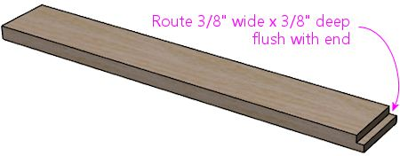

Route a 3/8" wide by 3/8" deep groove, flush with one end. This forms a locking tab that fits into the corresponding slot in the right side wall, for easier assembly.

NOTE: If you chose not to pre-route the cashbox fence slot in the right side wall, omit the locking tab. Simply deduct 3/8" from the piece's width, and don't route the groove at the end.

This is a short wall on the floor of the cabinet that delineates the space at the front of the machine where the cashbox goes. On the real machines, it makes a little cubby hole for the cash box and keeps it from sliding around, so that it stays positioned properly under the coin mechanisms.

I don't think most virtual cab builders bother to include a standard cashbox, since it takes up a lot of space at the front. A virtual cab often needs this space for the PC components and other electronics. You'll probably want to skip the fence if you don't use a cashbox. If you do use the standard type of cashbox, though, the fence is worth including, since it holds the box in place.

image::images/cashbox.png[""]

Cashbox fence. The metal tab sticking up is the "cashbox lock bracket", which is attached to the fence, and fits through a slot in the cashbox lid. This is designed to hold a padlock for higher security.

Cashbox lock bracket (Williams/Bally part 01-10030 or 1A-3493-1).

While you're cutting the piece for the fence, also cut two triangular pieces that we'll use to attach the fence to the side walls on the cabinet. These are normally triangular pieces 3" long, which can be made by slicing a 2x2 board in half down its length at a 45° angle. The triangular profile of these wedges isn't important; they just sit in the corners of the fence to help support it. A plain rectangular piece of 1x2 or 2x2 board would be just as functional. If you want to use the traditional wedge-shaped pieces, see xref:cornerBraceCutting.adoc#howToMakeCornerBrances[How to Make Corner Braces (and other wood prism shapes)] for ideas on fabricating them.

The original machines have a metal bracket in the middle, called the cashbox lock bracket (part number 01-10030 or 1A-3493-1), which can be used with a padlock to secure the cashbox. You probably won't feel the need for such strong anti-theft measures on a home-use machine, but if you want to include the bracket anyway for the sake of completeness, attach the bracket to the fence as illustrated below. Do this before installing the fence in the cabinet, since it'll be hard to drill the holes after it's in place.

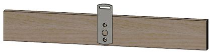

Cashbox lock bracket. Center the bracket left to right, and make it flush with the bottom of the fence. Attach with two #8 x 7/8" machine screws mated with #8 T-nuts, or with #8 wood screws.

The original WPC machines use two #8 x 7/8" machine screws and #8 T-nuts to secure the bracket; drill 7/32" holes for this setup, using the bracket as a template for the drill locations, and pound in the T-nuts on the back side of the fence. If you want to keep things simpler, use #6 or #8 wood screws instead of the machine screws and T-nuts. That won't be as strong, but it doesn't have to be built like a bank vault for home use.

[#rearShelf]
=== Rear shelf

This piece sits on top of the cabinet at the very back, where the slope of the side walls flattens to form a shelf for the backbox. The backbox sits on top of this piece. It has openings for the wiring between the backbox and the main cabinet, and holes for a pair of bolts that secure the backbox, so that it can't tip over.

*Cutting plan:*

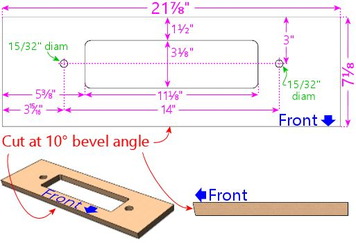

Rear shelf. Match the shelf's width to the *outside* width of your cabinet. Cut the front edge with a 10° bevel angle, to match the slope of the glass cover.

The width shown is for the standard-body WPC cabinet dimensions. If you're using a different cabinet width, match the shelf width to your main cabinet's outside width. Leave the bolt holes and center opening the same size, keeping them centered left-to-right as shown.

*Front edge 10° bevel:* Cut the front edge with a 10° bevel angle. This matches the slope of the glass cover, so that the plastic trim piece that holds the back of the glass is angled at the same slope as the glass. This makes the glass fit more easily into the trim. If your saw can't make the 10° angled cut, you can cut it square, but it'll make it a little harder to get the glass to fit into the trim.

*Routing:* Route the bottom edges of the shelf as shown below. This forms a "rabbet" that fits into the top of the cabinet.

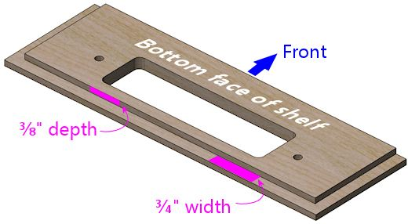

*Shelf lip:* A separate piece of plywood attaches under the shelf, at the very front edge, to form a "lip". This is mostly to make a big enough area to attach the plastic trim piece that holds the glass. On the original WPC machines, the lip is only as thick as the plywood:

image::images/shelf-lip-layout-1.png[""]

Shelf lip on the original WPC machines. The lip is simply another piece of plywood, about 1" deep. This should be the same width as the *inside* of your cabinet.

Optionally, you might want to make the lip extend further down, perhaps 2", like this:

image::images/shelf-lip-layout-2.png[""]

Alternative shelf lip design that extends further down, to cover a larger gap between the shelf and the TV and devices at the back of the machine (e.g., flasher panel).

The height is up to you. It's just a matter of how much space you want to fill between the shelf and the top of the TV and any other devices at the back of the TV, such as a flasher panel. On the original mechanical machines, the lip didn't have to be very tall, because they wanted to leave a lot of space open to make room for tall playfield features at the back, such as ramps and decorations. A virtual cab's "playfield" is just a flat TV panel, though. That might leave a big vertical gap at the back, which you might want to cover with the shelf lip. A lot of cabs use some of that space for flasher panels or LED light strips, in which case the lip can be shorter. If you haven't decided yet how you're going to use the space at the back of the TV, I'd probably use a short lip like on the WPC machines, and fill any leftover space in the final build with a back wall attached to the TV.

Note that the plywood-thickness lip is probably the smallest you should make it, so that there's a big enough area to attach the plastic trim channel for the back of the glass.

In any case, you should cut the lip with the same 10° bevel angle that you used on the front edge of the shelf so that the slope is continuous across both pieces.

*Central wire opening:* The rectangular center opening is for routing wire bundles between the main cabinet and the backbox. You can leave this the same size even if you're using a custom cabinet width - just keep it centered left-to-right.

The opening is large enough to accommodate a lot of wiring, but you might need to expand it if you plan to recess an oversized backbox monitor into the main cabinet. If you customize the cutout shape, remember to make the same changes in the cutouts in the backbox floor. For alignment, use the back edge as the reference point, because the backbox's back wall will be flush with the cabinet's back wall when the backbox is installed and placed upright. For left-to-right alignment, use the center point as the reference; the backbox is wider than the shelf, but it'll be centered horizontally when installed, so the center points will line up.

*Bolt holes:* The 15/32" drill holes on either side of the central opening are for bolts that secure the backbox in the upright position. Install a ⅜"-16 T-nut on the bottom side of each bolt hole. (A T-nut is a type of nut that attaches permanently to a piece of wood.) Insert the barrel of the T-nut into the hole as shown and pound it in to secure it.

When everything's assembled, these T-nuts will mate with wing screws that you install in the backbox to prevent the backbox from tipping over:

The wing screws are important for safety, so be sure to lay the groundwork for them by installing the T-nuts. Even if you're installing a latch on the back of the backbox, you should still use the wing screws and T-nuts, since most latches aren't strong enough to truly secure the backbox.

[#legBoltBraces]
=== Corner braces for the leg bolts

One last detail. We need some corner braces that go under the brackets used to fasten the legs.

image::images/leg-bracket-spacer.png[""]

The corner braces have a triangular profile, with these dimensions:

image::images/leg-bracket-spacer-2.png[""]

The normal way to make these is by cutting a 2x2 roughly in half, down its length, at a 45° angle. This is a bit tricky to do; for help, see xref:cornerBraceCutting.adoc#howToMakeCornerBrances[How to Make Corner Braces (and other wood prism shapes)] .

You'll need four pieces in this shape:

* Two for the front corners, 6" to 8½" long
* Two for the rear corners, 6" to 21½" long

The minimum length is 6" all around, to fill the space under the leg brackets. But you can make them longer if you want, to provide more reinforcement at the corners. At the front, they can reach from the floor of the cabinet to the top of the brackets, which is about 8½". They shouldn't go any higher than that, because if they did, they could get in the way of the plunger and front panel buttons. At the back, they can reach from the floor to the top of the cab, which is about 21½".

If you wish, you can pre-drill the holes for the leg bolts. (This is best if you're using the minimum 6" length. If you're making the braces taller, you'll probably want to install them in the corners first, and then drill holes from the outside, to make sure they line up with the holes in the cabinet corners.)

If you want to pre-drill the holes, drill ½" diameter holes in each piece. You can also just use your brackets as drilling templates. Drill through the diagonal face (the widest face), on the centerline, square through that face towards the opposite corner.

Drill starting on the diagonal (widest) side, square into that face. The hole should come out on through the opposite corner.

One hole will be near the center (vertically) of the wood piece, and the other will be near the edge. Make four identical copies of this piece.

=== Backbox

The backbox is (happily) a whole lot simpler than the main cabinet. It doesn't have as many cutouts, and we don't have to get as fancy with the corner joins. The top and bottom surfaces are typically out of view, so we can use joins that leave seams, by hiding the seams on the top and bottom edges where they won't be seen. All of the joins for the backbox can be accomplished with straight router bits.

The backbox is _mostly_ built from the same ¾" plywood used in the main cabinet. There's one exception, though: the back wall is made from ½" plywood. The original WPC backboxes had ½" thick back walls, so we're sticking to the same plan to keep the interior dimensions the same.

If you want to substitute ¾" plywood for the back wall, it's fairly easy. You just have to adjust the routed grooves in the other walls where the back wall joins to accommodate the thicker panel. We'll give you a reminder about that when we get there.

image::images/exploded-backbox.png[""]

Exploded view of backbox

Corner joins, viewed from the front. This type of join leaves a seam along one face, but we orient the joins to place the seams along the top and bottom , which are normally out of view.

(For purists, I have to confess that my design has a discrepancy from the original WPC design, which is that the joinery at the bottom of the back wall is different. The original WPC back wall simply butts up against the floor, whereas my design uses a rabbet to match the other three sides of the back wall. This is obviously an inconspicuous area - I didn't even notice the deviation until some time after publishing this chapter - and I can't think of any way the difference affects function. The rabbet is perhaps a bit stronger, and works as a glue joint, whereas the original butt join requires nailing. Williams might have used the original butt join simply for manufacturing convenience: it's more forgiving of measurement errors, in that you don't have to get the bottom and back pieces to line up precisely. If you want to modify my plan to reinstate the original design, cut the back wall 3/8" taller, make the floor piece 1/2" less deep, and omit the rabbet at the back of the floor.)

[#backboxTrim]
====  Translite and DMD guides

The WPC backbox requires some simple rectangular wood strips that acts as guides to hold the translite and speaker/DMD panels in place.

[cols="1,1,1"]
|===
|Quantity|Material|Dimensions

|2
|½" plywood
|4¾" x ¾"

|2
|½" plywood
|15" x ¾"

|1
|¾" plywood
|27⅛" x ¾"

|2
|¾" plywood
|12⅜" x 1"

|1
|¾" reducer molding *or* nominal 1x2 square-edge board, cut to a similar shape (see diagram below)
|27⅛" length

|===

The plywood pieces aren't visible to players, so don't worry about making the edges look pretty. They're all hidden behind the backglass or speaker panel when the machine is assembled.

The "reducer molding" shape is a more challenging trim piece that requires an angled cut. And this one _is_ visible to players - in fact, its whole purpose is cosmetic - so you'll want to make it look nice.

One way to make the molding piece is to start with a nominal 1x2 board, at least 28" long, and cut it lengthwise ("rip" it) with a diagonal cut, so that it has this approximate cross-section:

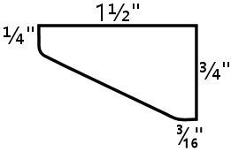

For help cutting this shape, see xref:cornerBraceCutting.adoc#howToMakeCornerBrances[How to Make Corner Braces (and other wood prism shapes)] .

The diagram above is based on the molding used in the original Williams machines, but you don't have to reproduce the shape perfectly, because this piece is purely cosmetic - the shape doesn't have to mesh with any other parts and doesn't serve any mechanical function. It's just there to hide the top glass channel and give it a finished look. The only important thing is to give it a pleasing tapered shape. The rounded corners are likewise not required, but they look a little nicer; you can get that effect simply by sanding the corners until they start to round out.

An alternative to cutting this shape yourself is to buy a pre-cut wood molding in roughly the same shape. There's a common type of floor trim called a *3/4" reducer molding* that has roughly this same shape and size. A 3/4" reducer molding will typically be a bit deeper than the profile we want, and it'll usually have a tab that sticks out from the back. You'll need to cut off the tab if present.

Once you have a strip with the right profile, cut it to a length of 27⅛".

[#transliteLockPlatePrep]
====  Translite lock plate preparation

If you're planning to install a translite lock plate, there's some preparation you can do at this stage that will make installing the lock easier and more secure when you get there. If you don't know what the translite lock plate is, you can learn about it in the "Translite lock" section in xref:cabHardware.adoc#cabinetHardware[Cabinet Hardware Installation] . Briefly, it's a keyed lock that you can install at the inside top of the backbox to secure the translite. For a home machine, the security function isn't important, but you might want to include the lock anyway if you're a stickler for realism, since it's there on all of the real machines going back at least to the 1980s.

The translite lock is installed in the front translite guide (described in the section above), which is part of the ceiling of the backbox. The front guide has a gap of about 2 inches in the middle, specifically for the lock.

image::images/translite-lock-plate.png[""]

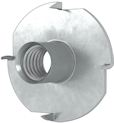
On the real machines, they install the lock plate with #8-32 "security" Torx machine screws, which have a special version of the Torx head that's meant to be tamper-resistant. These are *machine* screws, not wood screws,s so they can't self-tap in wood; they need to be fastened with nuts. If you look at the arrangement pictured above, you can see that there's no way to install ordinary hex nuts by hand with this setup, because you'd have to get behind the wood trim somehow - and that's going to be glued in place by the time you're ready to install the screws. So the question is: how do you install a nut in a place you can't reach? The answer is a T-nut. A T-nut is threaded like a hex nut, but it's permanently installed in the wood rather than being screwed on by hand. They're specifically for this type of situation where you need to pre-install a nut someplace that'll be inaccessible after assembly.

So, *if* you want to install the lock the original way, the required preparation is to pre-install T-nuts in the 12⅜" x 1" trim pieces:

* Mark the drill center at 1/2" from one end, centered across the width
* Using a 3/4" Forstner bit, drill an inset on the marked center about 1/8" deep, to countersink the T-nut
* Drill the rest of the way through on the same center with a 7/32" bit
* Insert a #8-32 x 1/4" T-nut from the recess side
* Pound it in flush into the recess

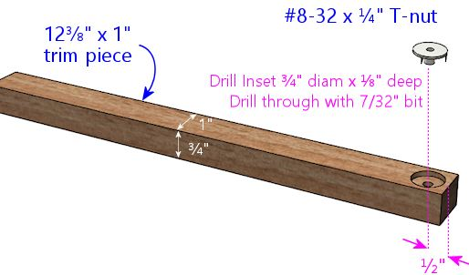

Simpler alternative: rather than pre-drilling and installing the T-nuts, you can discard the Torx screws that come with the lock plate kit, and attach the lock to the trim with ordinary wood screws instead. That eliminates the need for the T-nuts. The reason they use the machine screws and T-nuts on the commercial machines is to harden the lock against prying. You're probably not as concerned with that in a home-use machine, in which case wood screws are fine. You can install wood screws after the trim is installed, so there's no need for all this prep work if that's what you're going to use.

[#transliteLockTrimRouting]
====  Extra routing for translite lock

There's a little extra routing you need to do to ensure a good fit for the translite lock. You can skip this if you're not installing a lock.

In the 27⅛" x ¾" x ¾" piece, route a 2" wide notch in the center of one side, to ⅜" depth.

image::images/backbox-trim-routing.png[""]

This is necessary to leave room for the lock tab when it's in the "locked" position. The tab is slightly wider than the slot, so it needs this extra room on the other side.

[#backboxSidesPlan]
====  Backbox sides

Backbox left and right sides, shown from the interior side to detail the routed grooves for the joins. These are mirror images of one another. Note that the rear groove's width should equal the thickness of your back wall plywood. Our plans assume you're using ½" plywood for the back wall, so the groove is shown at ½" width.

3D view of the routed grooves in the side walls, to clarify the geometry.

The routing at the back edge assumes you're using ½" plywood for the back wall. If you're using a different thickness, simply increase the width of the groove to match the thickness of your back wall.

[#backboxTop]
====  Backbox top

The top of the backbox has a few special features:

* The front edge should be cut at a 7° angle to match the slope of the front edges of the side walls.
* The side edges are routed on the top side in a rabbet cut, to fit the rabbet grooves in the side walls.
* The back edge is routed on the bottom side in another rabbet cut, to fit the back wall.
* A 1/2" wide, 3/8" deep groove runs across the width of the bottom side of the piece. This matches the plane where the translite fits. The translite doesn't actually sit in this space most of the time, but this groove provides a little extra room to lift the translite into when inserting and removing it. You can omit this if you're not using a standard translite.
* A 2" wide rectangular depression is routed in the middle of the translite groove, on the bottom side of the piece, to accommodate the translite lock. Center this side to side, and refer to the diagram below for the dimensions. This is only needed to make room for the translite lock, so you can omit it if you're not using a lock.

Backbox top piece (roof)

[#backboxTopBevel]

To match the slope of the front sides, the front edge of the top piece should be cut at a 7° angle. This is an edge-on view from the left side.

3D view of top piece, viewed from top front, to show routing detail on the top side. The grooves at the wide are ⅜" deep and ⅜" wide, all the way to the outer edges.

Top piece, bottom side, viewed from the back, to show routing detail on the bottom side.

If you're planning to install any "toppers" (decorations on top of the backbox, such as a rotating beacon, fan, bell, or flashers; see xref:toppers.adoc[Backbox Toppers] ), consider pre-drilling any openings in the roof that will be needed for mounting hardware or wiring.

[#backboxFloorPlan]
====  Backbox floor

Backbox floor

[#backboxBottomBevel]

To match the slope of the front walls, cut the front edge at a 7° angle. This is an edge-on view from the left side.

3D view of backbox floor, viewed from back side, to show routing detail. The groove at back is ⅜" deep and ½" wide, flush with the back edge. The ½" width should match the plywood thickness of the back wall.

Backbox floor, bottom side, to show routing detail.

Above: Cutouts in floor of backbox. The rectangular cutout is for passing cables between the backbox and cabinet. The 1"-diameter holes on either side of the cable cutout are for safety bolts that lock the backbox in the upright position. The ¼"-diameter holes along the outer edges (three on each side) are for the WPC-style hinge brackets that attach the backbox to the main cabinet. The hinge bolt positions shown are for a standard-width main cabinet - they need to be adjusted for a widebody or custom-width cabinet (see below).

*Cable cutout:* The rectangular center cutout is meant to match the corresponding cutout in the "shelf" at back of the main cabinet. If you're customizing the shape of the cutout, remember to make the same changes in both places. To figure the alignment between the two parts, use the back edge as the reference point in both places. When the backbox is installed and placed upright, its back wall will be flush with the back wall of the main cabinet. For left-to-right alignment, use the center point as the reference: the backbox is wider than the shelf, but it will be centered side-to-side when installed, so the center points will line up.

*Lock bolts:* The 1"-diameter holes on either side of the center cutout are for locking bolts. These should be aligned on the same centers as the corresponding ½" holes in the main cabinet shelf. If you had to move those to accommodate a custom center cutout, move these holes to match. Note that the shelf holes are ½" diameter, whereas the corresponding backbox are 1" diameter. As with the center cutout, the reference point to use for alignment is the centerpoint of the back edge, because that will line up on the shelf and backbox.

[#backboxHingeBolts]
*Hinge bolts:* The ¼" diameter holes near the outer edges (three on either side) are for carriage bolts that attach the WPC-style hinges to the backbox. Drill these only if you're using the WPC-style hinges.

Important! The positions shown are for a standard-width main cabinet. If you're using a widebody or custom-width cabinet, *or* a custom backbox width, you'll need to refigure the positions. Use this formula:

Inset = (Backbox Width - Cabinet Width - 2⅜") ÷ 2

Plug in the *outside* widths of the backbox and cabinet (as they will be when assembled). The result is the inset of the bolt holes from the left and right edges of the floor, so simply substitute this for the measurement shown in our diagram.

If you don't want to take chances on getting the measurements perfect before-hand, you can wait to drill these holes until you've assembled your cabinet and backbox, at which point you can set it up and use the hinges themselves as a drilling template to mark the proper positions. This is getting a little ahead of ourselves, but here's the procedure:

* Make sure the shelf is in place in the cabinet, if you haven't already installed it. No need to glue it yet; just set it in place.
* Attach the hinges to the main cabinet using their pivot bolts. They'll rotate freely, so be careful not to let them scratch anything.
* Put the backbox in position. Center it left-to-right, and align the back wall of the backbox so that it's flush with the back wall of the main cabinet. The front of the shelf will stick out slightly further than the front of the backbox; that's normal. Have an assistant hold it up so that it doesn't fall over from this precarious position - it's heavy enough to be dangerous!
* Rotate the hinges up into position where they'll attach to the backbox. Make sure the contact area is flush with the bottom of the backbox. Mark bolt hole positions.
* Take down the backbox and drill at the marked positions.

[#backboxBack]
====  Backbox back wall

The back wall of the backbox on the real machines is typically 1/2" plywood (or particle board or MDF, if you prefer). It's a simple rectangular piece, with some holes for passive cooling.

Backbox back wall. The holes near the top are for passive ventilation. Note that the back wall uses ½" plywood.

====  Backbox ventilation

The original WPC backboxes used passive ventilation, via seven 1½"-diameter holes along the top of the back wall. ("Passive" meaning that they didn't use fans to circulate air; they relied on natural air flow driven by hot air expanding and rising.)

Some virtual cab builders add powered fans to the backbox for extra cooling. My experience has been that this passive cooling is adequate for the backbox (see xref:fans.adoc[Cooling Fans] ), but some people are concerned about heat from the backbox video displays. If you want to add active cooling, I'd remove the passive vent holes and replace them with one or two larger circular openings for 120mm PC case fans, similarly placed near the top of the back wall. You could also add some intake vents at the bottom, although I don't think that's necessary, as air will be drawn in from the main cabinet through the openings in the backbox floor.

If you add cooling fans, be aware of the space requirements for the other equipment plan to install in the backbox, such as the TV, DMD, replay knocker, and bells.

====  Backbox back door

Some virtual cab builders make the back of the backbox into a door rather than a fixed wall.

The plan I'm presenting here uses a fixed back wall, following the original Williams design. On the real machines, most of the main control electronics are mounted on this wall - the CPU board, sound board, power supply board, etc. To access these parts for service, the operator simply removes the translite and accesses the interior from the front side.

The complication for a virtual cab is that we fill most of the backbox with a TV. Some cab builders mount the TV in such a way that it can't be easily removed, in which case you won't be able to access anything behind the TV through the translite side. That's where a back door comes in handy.

I don't have an alternative set of plans to offer using the back door approach, so if you want to go that route, you'll have to improvise something. Other people have built such schemes into their cabs, so you might be able to find ideas by checking build threads on the forums.

I personally prefer the fixed back wall, instead of a door. The main reason is that it makes the backbox a lot stronger if the back is a solid, fixed panel. I also don't like the idea of using a permanent mounting for any of the TVs, since doing so makes it very difficult to repair or upgrade the machine later. I prefer to install all of the TVs (and other major components) in such a way that you can remove them non-destructively when necessary. In the case of the backbox TV, I favor mounting it so that it can be removed through the front of the backbox, preferably without having to disassemble anything. That removes any need for a back door. It also makes it easy to replace the TV, if that should ever become desirable or necessary.

See xref:backboxTVInstall.adoc[Backbox TV Mounting] for some ideas about how to mount the TV so that it can be removed.

====  Toppers

If you're installing some kind of "topper" (a decoration on top of the backbox, such as a beacon, fan, bell, or flashers: see xref:toppers.adoc[Backbox Toppers] ), consider pre-drilling any openings needed for the mounting hardware and wiring.

=== How to assemble the cabinet

Before you glue everything together more or less irrevocably, it's a good sanity check to do a "dry fit" of the pieces (fitting them together without any glue or nails) to check that everything is the right size and aligns as expected. Check for any dados that are too tight, and use sandpaper or a file to expand them slightly as needed. Check the alignment of the rabbet joins.

*Tip:* When you do the dry fit, once you have the whole thing together and you're happy with the fit of all of the corners, *make alignment marks* showing the current alignment of the floor with all four walls. In other words, draw a little line at the inside seam between the floor and the wall, somewhere along the seam. When you're doing the final glue assembly, you can use the marks to re-align the floor at the same, known-to-work position. This is helpful because it can be difficult to slide the floor around in the groove once the glue is applied, so it's good to be able to get it in exactly the right position on the first try.

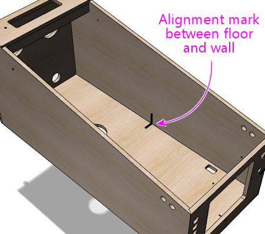

Have a good quality wood glue on hand. This will be used at all of the joints. Optionally, you can also use finish nails (perhaps ¾" #18 brads) along the seams, spaced a few inches apart. Nails will add some strength and will serve to hold the joints in place while the glue dries, but the trade-off is that they create a certain amount of risk of splitting wood around the edges. I used nails for my own build, but I don't think they're really necessary. If you're using the joins we suggested (dadoes at the floor seams, and either the mitered rabbet or double rabbet joins at the corners), I think glue alone will be plenty strong.

It's also great to have an assistant on hand. The job is easier with two people.

It should be fairly obvious how the pieces fit together, but here's a suggested assembly order.

====  Pre-assemble the shelf

Install a #6-32 x ⅜ on the bottom side of each bolt hole. (These are there to mate with safety bolts screwed in through the matching holes in the backbox, to secure the backbox in the upright position.)

Glue together the two pieces that make up the shelf as illustrated below. The front edge of the lip should be flush with the front edge of the top piece.

Set the assembled shelf aside for the glue to dry, so that it'll be set when we're ready to install it in the cab later on.

====  Main cabinet

Start by joining the floor to one of the side walls. Put glue along the inside of the dado (groove) at the bottom of the side wall as illustrated below. Don't use an excess of glue - you just want a single continuous bead down the center of the groove. Insert the floor into the groove. Make sure the front and rear edges are properly aligned and flush, and ensure that it's pressed down all the way into the dado.

If you made alignment marks during the dry fit, this is the time to use them! Make sure that the alignment marks made earlier on these two pieces line up. That should ensure that the floor is properly aligned relative to the front and back pieces later on.

Beware that this arrangement is precarious! The floor piece will want to tip over; the dado isn't strong enough by itself to hold it upright. Keep the floor piece supported so that gravity doesn't stress the joint. It's good to have an assistant to hold things in this position until you get to the next piece.

Next, add the back wall. Put glue along the dado and edge of the back wall that we're about to join, as shown below. Again, use continuous bead of glue. Put the back wall piece in place. As before, make sure that the edges are aligned properly and that the floor is pressed all the way into the dado in the back wall.

Now do the same thing with the front wall.

Add the remaining side panel.

[#installLegBoltBrackets]
====  Leg brackets

The next step is to install the leg brackets. The brackets will be permanently installed in the cabinet, so this is a one-time step that you won't have to repeat when you want to attach or remove the legs.

The procedure here assumes you're using the standard brackets used on newer machines, Williams/Bally part 01-11400-1. These brackets have integrated threading for the bolts, so no additional nuts or other fasteners are needed - you just screw the bolts into the brackets.

You'll need four of these brackets. The matching bolts are ⅜"-16, in 2½" or 2¾" lengths. Note that you'll probably want to buy the bolts from a pinball vendor rather than use generic hardware store bolts, for cosmetic reasons: the ones made for pinball machines have nice shiny finishes and rounded heads that look nicer than generic galvanized hex-head bolts. You'll need eight bolts (two per leg). No washers or nuts are needed, as the brackets are threaded and serve as the fasteners.

The recommended brackets have their own threading for the bolts, which lets you attach and detach the legs purely from the exterior of the cabinet. In other words, there's no need to reach inside the cabinet with a wrench to turn a nut or other fastener, since no other fasteners are needed - the bolts screw directly into the threaded holes in the brackets. That's important because it's difficult to reach into the interior corners (especially with a wrench) once all of the equipment inside is installed. So the threaded brackets make things much easier in the long run, but they require some extra work for the initial installation, since you have to align them and fasten them inside the cabinet. That's what the procedure below is intended to accomplish.

All four legs are interchangeable - there's no such thing as a "front leg" or a "back leg" or a "right leg" or a "left leg". You should simply have four identical parts for the legs. The same is true of the metal leg brackets.

Before we begin, it's worth noting how the positioning of the leg bolts relative to the floor of the cabinet affects how the brackets and corner braces are installed. The bolt holes are higher up on the wall in front, lower in back, to give the cabinet a slight forward tilt when it's set up. (The legs themselves are all the same length, so we get the tilt by mounting the legs at different heights.) Because of this asymmetry, we can flip the brackets upside down in front to keep them lower on the wall.

We'll start with a dry fit (no glue) to make sure everything fits, before we finalize the install. The bolt holes tend to be tight, which is good in that you don't want a lot of play or wobble when the legs are attached. But the bolt holes in the wood can be so tight initially that the leg bolts just won't fit. We need to make sure that the bolts will fit properly.

With the cabinet on its side, place the leg in position, and insert the bolts through the leg holes and into the cabinet. If the fit is too tight to get them through by hand, use a round file to ream out the holes enough to get them to fit.

The point of using the legs for this step is just to make sure that the spacing of the bolt holes in the legs matches the spacing in the cabinet. We're not actually attaching the legs permanently yet; we're only attaching the brackets at this point. The legs can be easily attached and detached at any time once the brackets are installed.

Once the bolts fit comfortably, slip the triangular wood space piece over the bolts.

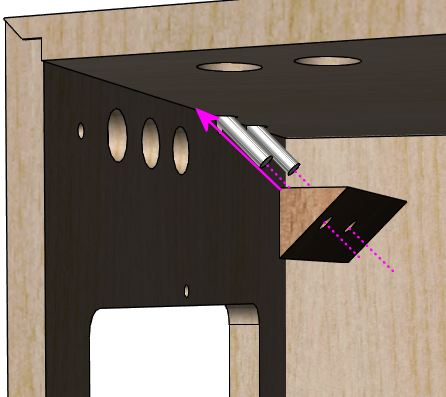

Now attach the metal leg bolt bracket. Screw in the bolts to make sure everything still fits.

If anything is wrong with the fit, go back and use a round file to open up the holes in the cabinet walls and/or the corner braces as needed. (Obviously, don't attempt to modify the legs themselves or the metal bolt bracket! We consider those to be the source of truth here - they're the reference points we're trying to match with the wood parts.)

Once you're satisfied with the fit, take the bracket off and remove the corner brace. We're now ready to install this all permanently.

Keep the legs and bolts in place, since we still want them there as the reference point for final alignment.

Apply glue to the sides of the corner brace that face the cabinet walls. (Those are the narrower sides. Don't glue the wider side that faces the bracket.) Use a thin layer of glue covering the whole face. Avoid the area around the bolt holes to avoid too much glue oozing in there.

Put the corner brace back in place. Press it against the cabinet walls to attach the glue.

Reattach the bracket and screw the bolts into it. Screw them in all the way this time so that the leg is firmly attached. Don't over-tighten.

Use *#8 x 5/8" wood screws* to attach the metal bracket to the cabinet walls and to the corner brace. The standard plates have holes for three screws on each side and two more in the middle to attach to the brace. Don't leave out any screws; we want the bracket attachment to be very sturdy, so we want to distribute the load over as many screws as possible. Tighten the screws but be careful not to over-tighten and strip the wood.

NOTE: some people recommend using #10 x 3/4" screws instead of #8, since the larger screws are a bit stronger. I don't think it's necessary - the original Williams cabs used #8 screws, and those seem to hold up over the years - but I also don't see it doing any harm to upgrade to the larger screws. The only thing to watch out for is that 3/4" screws could potentially poke through 3/4" plywood, or could come close enough to poking through to dimple the outer veneer. Check before screwing them in that they're not too long for your actual plywood stock. If it looks like it's going to be close, you can simply add a washer or two to each screw for some extra padding.

Use #8 x 5/8" wood screws to fasten the leg bracket to the cabinet and corner brace at the locations shown (arrows). You can substitute #10 x 3/4" wood screws for greater strength if desired, but check them against your plywood stock to make sure they won't poke through the other side.

Once the wood screws are all in place, unscrew the main leg bolts and remove the leg.

Repeat this process for each corner until all four leg brackets are attached.

====  Cashbox fence

If you decided to include the fence that delineates the cashbox area, this is a good time to install it. Flip the cabinet upright for this step.

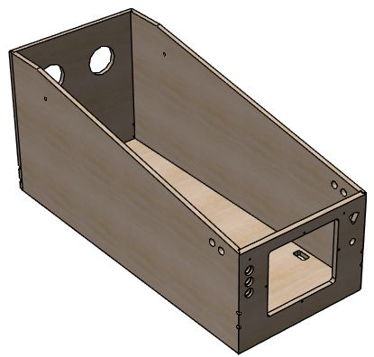

*Installation option 1: using the locking tab.* If you routed a slot in the side wall for the fence's locking tab, apply some glue to the tab and to the bottom of the fence, and fit the tab into the slot. Orient the piece so that the tab is on the side facing the *front* of the cabinet.

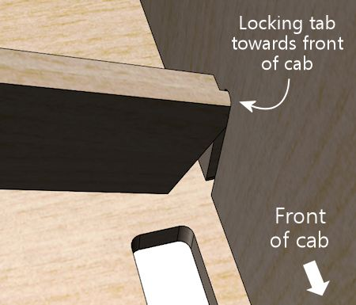

Place it against the floor, straight across the width of the cab.

Glue the triangular braces behind the fence at the corners.

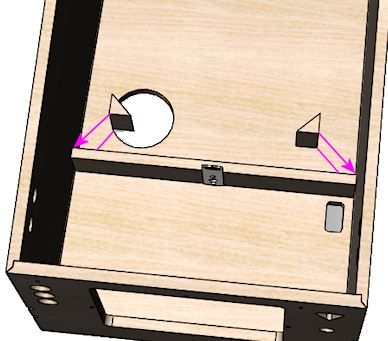

*Installation option 2: no locking tab.* If you chose to skip the locking tab and slot, you can position the fence now to fit your cashbox. Grab your cashbox and place it against the front wall. Position the fence to leave about 1/2" of play behind the cashbox.

Without using any glue yet, set the fence in place at the desired position. The normal location, to fit a standard cashbox, is 10-3/4" back from the inside of the front wall, but you should change this to match your cashbox's depth if you're using a non-standard size.

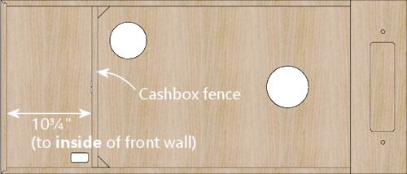

Apply glue to the two square sides of the 3"-tall triangular pieces that you cut along with the fence. Making sure to keep the fence at the desired position, press the triangular pieces into place on the rear side of the fence at each side, to fasten the wall to the two sides of the cab.

[#backRails]
====  Back rails

If you want to include the back rails, attach them to the back of the cabinet, oriented vertically, near the edges. The exact positioning isn't particularly important, as long as the rails form a stable base for standing the machine on its back, so make any adjustments needed to keep clear of your fan vents and other openings in the back wall.

Attach these to the back with glue and finish nails (1¼" #18 brads should work). Nail down the centerline, with a nail every 4" or so.

If desired, affix hard plastic furniture slider pads near the ends. The exact type isn't important; the ones Williams used in the 1980s and 1990s were typically the nail-in type, hard plastic, 3/4" diameter, white or tan.

====  Shelf

At this point, you can install the shelf that you assembled back at the start of the build process. We saved this for last, because the shelf gets in the way when you're trying to work around the back of the cabinet interior (such as installing the rear leg brackets). In fact, for just this reason, you might want to wait even longer on this step, and come back to it later, after installing parts that attach to the back wall, such as:

* Fans
* Power inlet
* Power strips
* Ethernet port
* USB ports

If you want to hold off installing the shelf for now, you can just set it aside and make a mental note to come back here when you're ready.

If you haven't already done so, install ⅜"-16 T-nuts in the holes on either side of the central rectangular opening, on the *bottom* side of the board. These mate with the wing bolts that are meant to be attached through matching holes in the floor of backbox. The bolts are an important safety measure to secure the backbox in the upright position while deployed.

Once you are ready to install the shelf, start by flipping the cabinet upright.

Run glue around the edges of the shelf where it joins the main cabinet (as shown below), and set it in place.

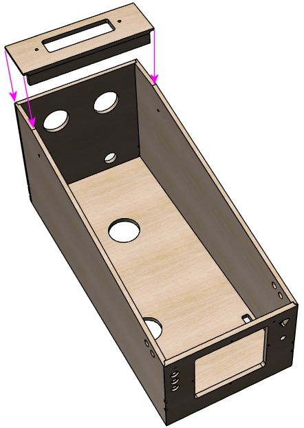

If the top of the shelf sticks out at all from the side or back walls, use a power sander to remove excess material until it's flush with the adjoining wall.

====  Backbox

Assembling the backbox is much like assembling the main cabinet. Start with the top and one of the side walls. Apply a bead of glue to the groove on the side piece, then fit the top piece into the groove.

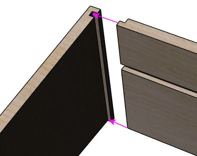

Attach the floor.

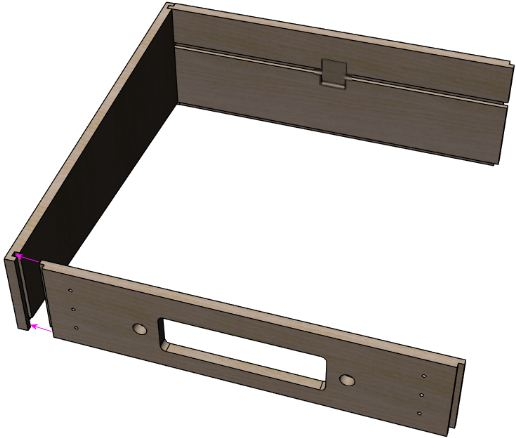

Add the remaining side wall.

The back wall should now fit into the grooves along the back edges of all four walls. Apply glue around the grooves, and put the back wall into place. It should fit so that it's flush with the edges of the walls.

The back should be flush with the back edges of the adjoining walls when installed.

In addition to the glue, you can add some finish nails to strengthen the back wall. Use small finish nails, such as 1" #18 brads. Drive them in from the back of the back wall, around the perimeter, set in about 3/16" from the edges. Space them every few inches; four or five nails on each side should be sufficient.

[#backboxCornerBracing]
====  Corner bracing

The original WPC backboxes had steel braces at the corners to strengthen the joints. The glued corner joints are actually pretty sturdy all by themselves, if you construct them using the rabbeted design described above, but apparently Williams deemed it necessary to add some heavy reinforcement. I'm sure that came from experiences with commercial operators who banged up their machines with rough handling and then complained when they broke.

In my opinion, you shouldn't need any corner braces for a machine in home use. The glued corners should be plenty strong. But if you'd like to reproduce the original construction faithfully, or you just don't trust the glue joints, here are the details for the Williams design. The part number for the braces is #01-9167, and they're fastened to the backbox walls with ¼"-20 x 1-¼" carriage bolts (black finish, 4320-01123-20B) and ¼"-20 flange nuts (4420-01141-00). You'll need four of the braces and sixteen each of the carriage bolts and flange nuts. Place one brace at each corner, more or less all the way back against the back wall, and use the holes in the brace as a drilling template to drill holes for the carriage bolts. Insert the carriage bolts with the heads on the outside, and fasten with the flange nuts on the inside.

WPC backbox brace, Williams part #01-9167, installed at the upper corner. The real WPC-era machines used one bracket like this at each corner. If you want to go this route, use the brace as a drilling template to drill ¼" holes for the bolts, and fasten the brackets with ¼"-20 x 1¼" carriage bolts (on the outside) mated with ¼"-20 flange nuts (on the inside).

The Williams corner bracing is about as strong as you can get. You'd have to rip the wood apart before those bolts would come out. The downside is the bolts are visible on the outside of the backbox. (Not _too_ visible, though; the WPC machines use black bolts that tend to disappear into the artwork unless you're looking closely.)

How the carriage bolts look on the outside. They have smooth rounded heads (with no screwdriver slots), and come in silver and black finishes.

If you don't care about using the exact original parts, but you still want some kind of corner reinforcement, you might consider using generic steel 1" corner braces instead. You can buy these at any hardware store. Use ¾"-long wood screws to attach them, in a size that fits the holes in the corner braces you buy (typically #6 or #8 wood screws). Use two or three braces per corner. Keep them within 5" of the back wall, so that they won't be visible when the translite is in place. This setup isn't as ridiculously strong as the Williams brackets and carriage bolts, but it provides some reinforcement, and it doesn't require any externally visible fasteners.

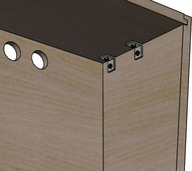

Alternative reinforcement using generic hardware-store corner braces, fastened with wood screws. Be sure to keep the braces behind the translite plane (5" from the back wall), so that they're not visible.

[#transliteGuideTrim]
====  Translite/DMD guides

The WPC backbox has some little wood blocks along the walls that act as guides for the translite and DMD/speaker panel. These might or might not be interesting to you for your virtual cab, because a virtual backbox is a little different from a real one. Specifically, our backbox uses a TV in place of the normal translite, and in some cases a single TV replaces both the translite and DMD panel.

But it's not a simple matter of TV _or_ translite. You might actually still want something similar to a translite, to mask out the bezel around the perimeter of the TV. There are two common ways to handle this:

* Create a custom wood cover for the TV area, with a cutout for the TV.
* Use a glass or plexiglass translate in front of the TV. Optionally, you can use paint of decals around the perimeter of the plexi to mask out the dead space beyond the edges of the TV display.

Both serve the same function, of hiding the TV's bezel so that you only see the screen, but I very much prefer the second option. The first option calls way too much attention to the virtual-ness of the cab. The second makes it look like a real pinball machine.

(There's a third, less common option. Some people route grooves into the side of the backbox exactly deep enough to contain the TV's bezels. This requires an extremely thin bezel, and requires that you use a custom backbox size chosen to perfectly match the TV, so it's not compatible with the standard plans.)

If you're planning to use a custom wood cover instead of a translite, you can skip this section, as your custom cover won't need the guides that hold the conventional parts in place.

Before proceeding with installing these, there are some cases where some of the guides should _not_ be installed:

* If you're not using a standard speaker/DMD panel, don't install the lower guides (the ones at the bottom of the side walls) until you've worked out whether or not you need them. These are designed for the pre-WPC-95 style of speaker panel only, and might not work if you're using a home-brew design of your own.
* If you're using a WPC-95 speaker panel - the type that's made out of a single piece of molded black plastic - don't install the lower guides. The lower guides are only for the older pre-WPC-95 speaker panel. If you're using a standard panel type but you're not sure whether it's WPC-95 or pre-, consult xref:dmdAssembly.adoc[Speaker/DMD Panel] for help.
* If you haven't finalized your backbox TV install plan yet, don't install the upper side wall guides. Those get in the way of some TV installation methods. See xref:backboxTVInstall.adoc[Backbox TV Mounting] for more.

Assuming that you're using the standard translite and the early 1990s style of speaker/DMD panel, here's a cutaway view showing the placement of the guides on the sides of the cabinet. Note that the right side wall isn't shown in this view, but (as you would probably expect) has the same two guide pieces shown on the left wall, at the same positions in mirror image.

Guides for the translite and speaker/DMD panel on side walls. The distances shown are to the inside surfaces of the back wall and floor in the assembled backbox. Note that some backbox TV installation designs work better *without* the 15" upper pieces, so you might want to defer installing these until you've finalized your backbox TV plan. Also note that the lower pieces are only used for the "original" style of speaker/DMD panel, *not* the WPC-95 molded plastic type.

The top piece is 15" x ¾" x ½", and the bottom is 4¾" x ¾" x ½". Orient them so that the ¾"-wide face is against the side wall. Both pieces run parallel to the rear wall.

There's nothing sophisticated about the installation of these on the real machines - they're just glued and nailed. You should do the same thing. Apply a little glue on the back of each piece and nail it into place with finish nails (I'd suggest 1" #18 brads). Use one nail about every 4" down the length of each strip, centered in the strip.

Here are the guides on the inside of the backbox "roof":

Cutaway side view of the top guides. The pieces labeled "A", "B", and "C" are detailed below.

Note how the "A" and "B" pieces align with the translite groove in the ceiling.

Note that piece "A" should be installed with the notch facing the ceiling of the cab.

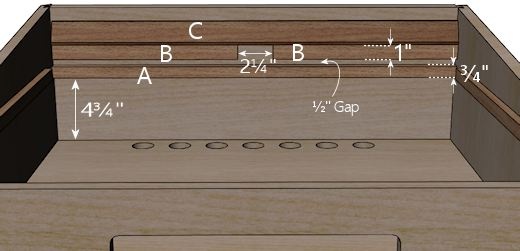

Top guides, viewed from below.

All three pieces run parallel to the rear wall.

* "A" is 27⅛" x ¾" x ¾". It should fill roughly the full width of the backbox interior; simply center it left-to-right relative to any leftover space. Install it with the routed notch for the translite lock (if you included that) facing up, towards the ceiling of the cab.
* "B" (quantity 2) are each 12⅜" x 1" x ¾". Leave a ½" gap front-to-back between these pieces and the "A" piece, and leave a 2¼" gap left-to-right between the two "A" pieces.

Important! If you installed T-nuts for the translite lock plate, see below.

* "C" is the wedge-shaped trim piece we described earlier. Orient it as illustrated in the side cutaway view above. Install it abutting the "B" pieces, without any gap.

*Aligning the T-nuts in the "B" pieces:* If you installed the T-nuts for the translite lock plate as described earlier, you should make sure they're correctly aligned for your lock plate when you install the "B" pieces. Use this procedure:

* Lay out the pieces at the install location as described above, but don't glue anything yet.
* Orient the pieces so that the T-nuts are on the side that will be glued to the ceiling of the backbox.
* Grab your lock plate and its Torx screws. You don't need to assemble the rest of the parts yet, but it's also okay if you've already done so.
* Put the lock into position. Make any adjustments to the positions of the "B" pieces to match up the screw holes in the lock plate with the pre-drilled holes in the "B" pieces.
* Fasten the lock plate by screwing in and tightening the screws.
* With the lock plate installed, glue and nail the trim pieces into position.

You can now remove the lock plate if desired (for example, if you still need to paint the backbox), knowing that the "B" pieces will be perfectly aligned for the lock plate when you're ready to re-install it.

