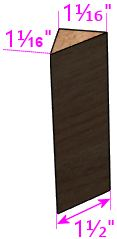
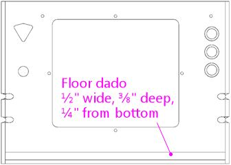

= Cabinet Construction Quick Reference

This section is a quick reference to the woodworking procedure to construct the main cabinet shell, based on the Williams/Bally standard-width cabinets of the 1990s (which is also used more or less unchanged by most newer commercial machines). The plan here includes plywood cutting dimensions and locations for drills, cutouts, and routed grooves, and it's organized into a step-by-step procedure that you can follow.

This is the same plan that's laid out in xref:cabBody.adoc#cabinetBody[Cabinet Body] , but it's distilled here to just the essential checklist steps, arranged into an efficient order of execution. The order of steps makes sure that dependencies are done by the time you need them, and groups operations that use similar tool setups, as much as possible, to minimize the time you have to spend changing drill bits and so forth. The goal is that you can just go down this list while doing the woodworking and carry out the steps in order. To keep it concise, there's not much explanation here, so I've provided links at each step to the more detailed corresponding material in the main Cabinet Body chapter.

This plan is primarily for virtual cab builders, but it can also be used to build replacement cabs for WPC-era machines and later System 11 machines, with some small variations. I've tried to point out in the text where changes are needed for replica cabs.

== Corner joinery

The plans below don't specify the type of corner joins to use for the main cabinet, so they don't include any routing for those joins. You can do the joinery a number of different ways, each with its own advantages, so that's left to your discretion. However, the measurements assume that all of the pieces extend all the way to the corners of the finished cabinet, which is only true when you're using one of the mitered joins (such as a simple 45° miter, a locking miter, or a mitered rabbet). If you're using non-mitered joins, such as butt or rabbet joins, you'll have to adjust the measurements for the pieces that don't extend all the way to the finished corners. References:

*  xref:lockMiterI.adoc#lockMiter1[Lock Miter I: The Plywood-Friendly Way] - this is the join used in the original WPC cabinets
*  xref:lockMiterII.adoc#lockMiter2[Lock Miter II: The Special Router Bit Way]
*  xref:cabBody.adoc#cabJoinery[Cab Body - Joinery]

The backbox plans do include specific joinery routing, which is based on locking rabbet joins.

== Width adjustments for different cabinet types

These plans are based on the WPC "standard-body" size, which has an inside width of 20.5" in the main cabinet. Williams also made "widebody" cabinets with an inside width of 23.25". You can also choose a custom width.

To adapt the plans to a different finished cabinet width, you need to adjust the widths of the following pieces:

* Front wall
* Back wall
* Rear shelf
* Cab floor

Reference: xref:cabBody.adoc#cabinetWidths[Cab Body - Standard and Widebody cabinets]

The backbox width is typically kept at the same standard size regardless of the cabinet width.

== Mark the panels as you go

As you cut the panels, I think it's a good idea to mark each piece with the following information, to avoid confusion as you work on them later:

* Function of the piece ("cab left wall", "backbox top", etc.)
*  *Inside* and *outside* face
*  *Top* and *bottom* directions

I just write all of this directly on each piece with a pencil.

== Cut the panels

Reference: xref:plywoodCuttingPlans.adoc#plywoodCuttingPlans[Plywood Cutting Plans for Cabinet Construction]

NOTE: There are other ways to divvy up the plywood, but for the sake of brevity, we're assuming the "grouped by size" layout here. See the chapter reference above for other layouts.

Plywood sheet #1 (4' x 8' x 3/4"):
link:http://mjrnet.org/pinscape/BuildGuideV2/cab-body-plywood-layout-1-quickref.png[
]

1. Cut the side pieces.
2. Cut the cab, front, and shelf pieces. *Note the 10° bevel angle* on the cut between the cabinet front and rear shelf - see xref:cabBody.adoc#frontWallBevel[Cab Body - Front Wall] . Adjust the width for widebody or custom widths.
3. Cut the backbox side panels.
4. Cut the cashbox fence and shelf lip.
Plywood sheet #2 (4' x 8' x 3/4"):
link:http://mjrnet.org/pinscape/BuildGuideV2/cab-body-plywood-layout-2-quickref.png[
]
5. Cut the backbox top and bottom pieces. *Note the 7° bevel angle* on the cut between the top and bottom - see xref:cabBody.adoc#backboxTopBevel[Cab Body - Backbox top] and xref:cabBody.adoc#backboxBottomBevel[Cab Body - Backbox floor] .
Plywood sheet #3 (4' x 8' x 1/2")
link:http://mjrnet.org/pinscape/BuildGuideV2/cab-body-plywood-layout-3.png[image:images/cab-body-plywood-layout-3.png[""]]
6. Cut the backbox back wall, 28" wide by 27-3/4" tall.
7. Cut the cabinet floor - adjust if you're building a widebody or custom-size cabinet.

== Cut the backbox trim pieces

[cols="1,2,1"]
|===
|Quantity|Material|Dimensions

|2
|½" plywood
|4¾" x ¾"

|2
|½" plywood
|15" x ¾"

|1
|¾" plywood
|27⅛" x ¾"

|2
|¾" plywood
|12⅜" x 1"

|1
|1x2 board cut to ¾" reducer molding shape (see diagram below)
|27⅛" length

|===

Reducer molding cross section:

image::images/backbox-trim-cross-section.png[""]

Reference: xref:cabBody.adoc#backboxTrim[Cab Body - Translite and DMD guides]

== Cut the main cab back rails

Two pieces of 5/8" thick plywood, 19" long by 1" wide. Cut ends at a 30° bevel angle. (Substitute 3/4" plywood if desired.)

Reference: xref:cabBody.adoc#backRails[Cab Body - Back rails]

== Cut the corner braces

Cut a 2x2 board diagonally down its length to form a triangular prism shape, for corner bracing under the leg brackets and to attach the cashbox fence. Optionally, you can use similar pieces to reinforce the joints between the floor and side walls. (Don't use them with the floor joints with the front and back walls, though, since those might get in the way of other hardware.)

For the front and back corners, the following profile is required to fit the space under the leg brackets:

Lengths:

* Front corners (leg bracket profile): 6" to 8-1/2" long, quantity 2
* Back corners (leg bracket profile): 6" to 21-1/2" long, quantity 2
* Cashbox fence: 3" long, quantity 2
* Floor braces along side walls (optional): up to 30" long, quantity 2

References:

*  xref:cabBody.adoc#cashboxFence[Cab Body - Cashbox fence]
*  xref:cabBody.adoc#legBoltBraces[Cab Bod - Leg bolt braces]
*  xref:cornerBraceCutting.adoc#howToMakeCornerBrances[How to Make Corner Braces (and other wood prism shapes)]

== Route the top glass guide slots

Use a slot cutter router bit, 3/32" slot width, 3/8" slot depth (Freude part #63-106 or equivalent).

Route the top edge of each side panel, along the slanted section, centered in the edge. Route from about 1" from the front to the top of the slanted section.

Reference: xref:cabBody.adoc#glassChannelSlots[Cab Body - Glass channel slots]

image::images/glass-channel-slot2.png[""]

== Mark all routing & drilling locations

At this point, I like to mark all of the panels with the locations of the routed grooves, cutouts, and drills - essentially everything below. It's easier to make many of the measurements now, while the pieces are still whole, and having everything pre-marked makes the execution much easier.

== Cut the corner joins for the main cabinet

Route or cut the grooves and miters for your selected style of corner joins for the main cabinet. This applies to the main cabinet side, front, and back walls, at all four corners.

(I prefer to cut the corner joins first, before the floor dados, so that the dados don't get in the way when you're aligning the cuts for the corner joins.)

References:

*  xref:cabBody.adoc#cabJoinery[Cabinet Body - Joinery]
*  xref:lockMiterI.adoc#lockMiter1[Lock Miter I: The Plywood-Friendly Way]
*  xref:lockMiterII.adoc#lockMiter2[Lock Miter II: The Special Router Bit Way]

== Route floor dados

Cabinet sides, front, and back - inside faces.

Route 1/2" wide by 3/8" deep, offset 1/4" from bottom edge.

NOTE: Some of the 1990s machines I've checked have bottom offsets closer to 3/8".

References:

*  xref:cabBody.adoc#sideWalls[Cab Body - Side walls]
*  xref:cabBody.adoc#frontWall[Cab Body - Front wall]
*  xref:cabBody.adoc#backWall[Cab Body - Back wall]

== Route the cashbox fence slot

In the *right wall only* , on the *interior face* , route a slot 3/8" wide by 3/8" deep by 3-1/4" high, with the bottom at the floor dado, and the front edge 11-1/2" from the front (the outside corner).

Reference: xref:cabBody.adoc#sideWalls[Cab Body - Side walls]

== Route the cashbox fence locking tab

Route a groove in the cashbox fence, 3/8" wide by 3/8" deep, flush with one end.

image::images/cashbox-fence-lock-tab.png[""]

Reference: xref:cabBody.adoc#cashboxFence[Cab Body - Cashbox fence]

== Route shelf bottom dados

Shelf, bottom side

Route 3/8" wide by 3/8" deep grooves at the back, left, and right edges, flush with the edges

image::images/main-shelf-routing.png[""]

Reference: xref:cabBody.adoc#rearShelf[Cab Body - Rear shelf]

== Route the translite lock cutout in the backbox top trim

In the 27-1/8" x 3/4" x 3/4" backbox top trim piece: route a 2" wide inset, 3/8" deep, centered side-to-side. (Ignore this step if you're not planning to install a translite lock.)

Reference: xref:cabBody.adoc#transliteLockTrimRouting[Cab Body - Extra routing for translite lock]

== Route the backbox corner joins

Left and right backbox side walls: Route grooves on *inside* faces, 3/8" wide by 3/8" deep, offset 3/8" from the top and bottom edges.

Backbox top: Route on *outside* (top) face, 3/8" wide by 3/8" deep, flush with left and right edges.

Backbox bottom: Route on *outside* (bottom) face, 3/8" wide by 3/8" deep, flush with left and right edges.

References:

*  xref:cabBody.adoc#backboxSidesPlan[Cab Body - Backbox sides]
*  xref:cabBody.adoc#backboxTop[Cab Body - Backbox top]
*  xref:cabBody.adoc#backboxFloorPlan[Cab Body - Backbox bottom]

== Route the backbox back wall grooves

Backbox sides, *inside* faces: Route 1/2" wide by 3/8" deep, flush with the back.

*Important:* Only route *between* the top and bottom corner join grooves. Only route the orange section as shown below.

Backbox top, *inside* (bottom) face: Route 1/2" wide by 3/8" deep, flush with the back.

Backbox bottom, *inside* (top) face: Route 1/2" wide by 3/8" deep, flush with the back.

References:

*  xref:cabBody.adoc#backboxSidesPlan[Cab Body - Backbox sides]
*  xref:cabBody.adoc#backboxTop[Cab Body - Backbox top]
*  xref:cabBody.adoc#backboxFloorPlan[Cab Body - Backbox bottom]

== Route the translite grooves

Backbox top, *inside* (bottom) face:

* Route a groove, 1/2" wide by 3/8" deep, 6" from the back edge, across the whole width of the piece. (The translite fits into this recess.)
* Route a rectangular inset, 2" wide by 2-3/8" tall by 3/8" deep, as shown in the diagram below. (This is for the translite lock.)

Reference: xref:cabBody.adoc#backboxFloorPlan[Cab Body - Backbox bottom]

== Cut the backbox floor cable opening

Backbox bottom: Cut a rectangular opening, 11-1/8" by 3-1/8", as shown in the diagram.

NOTE: this lines up with the cable opening in the shelf when the back edges are aligned.

Reference: xref:cabBody.adoc#backboxFloorPlan[Cab Body - Backbox bottom]

== Cut the shelf cable opening

Shelf: Cut a rectangular opening, 11-1/8" by 3-1/8", as shown in the diagram.

NOTE: this lines up with the cable opening in the bottom of the abckbox when the back edges are aligned.

Reference: xref:cabBody.adoc#rearShelf[Cab Body - Shelf]

== Test the lockbar fit

The measurements shown below for the coin door cutout and lockbar bolts are based on the standard equipment, but I've run into some slight manufacturing variations in the lockbar receivers, so I like to use the actual receiver I'm going to install as a template for drilling. That helps ensure that the final fit is closer to perfect.

Here's the procedure. Place your lockbar receiver against the *inside* face of the front panel, and align the two little tabs on the front so that they're exactly flush with the top edge of the panel. Mark the locations of the three bolt holes. Remove the receiver and measure the distance from the top edge of the panel to the center of the marked bolt hole locations. Compare to the diagram below:

image::images/front-panel-receiver.png[""]

If the position you mark by testing with the receiver differs by more than 1/32" vertically from the diagram above, I'd use the "test" positions instead of the diagram locations. You should also adjust all of the following up or down by the same amount to match, since all of these pieces fit together when installed:

* Coin door cutout
* Lockbar bolt holes
* Coin door bolt holes

Note that the lockbar receiver is drilled to give you about 1/4" of play side-to-side, so the horizontal locations don't have to be as exact.

== Cut the coin door opening

NOTE: see xref:html#adjustForLockbarFit[Test the lockbar fit] above before proceeding.

Cut a rectangular opening, 12-1/4" wide by 10-3/8" high, centered left to right. The top of the cutout is 1-23/32" from the top of the *inside* face.

(The distance is specified from the top, because the coin door has to align with the lockbar receiver, which has to be a certain distance from the top for the lockbar to fit.)

Reference: xref:cabBody.adoc#coinDoorCutout[Cab Body - Coin door cutout]

== Cut the plunger opening

Do this only if you're installing a plunger (ball shooter). This cutout shape only applies to the modern style, 1980s and later.

Cutout shape: Drill the four holes on the centers shown, then route or jigsaw along the perimeter they define (black outline in the diagram below).

image::images/plunger-drilling.png[""]

Cutout location: Varies. For virtual cabs, a location similar to that used in real machines is preferable for aesthetics, but you can move it if needed to avoid space conflicts with the TV. For replacement pinball cabs, the location is strictly dictated by the playfield geometry, because the plunger has to line up with the playfield shooter lane. The table below lists typical locations for Williams games of the 1980s and 1990s, but individual titles may vary, so check against a factory original if possible.

The reference point for all table entries below is the center of the top 3/4" diameter drill. The location is measured from the top and right edges of the *outside* face of the front panel.

[cols="3,1,1"]
|===
|Cabinet Usage|Distance from top|Distance from right

|Virtual pin cab - plunger only, or plunger above Launch Ball button
|2-1/2"
|2-1/8"

|Virtual pin cab - plunger below Launch Ball button
|5"
|2-1/8"

|Replacement cab for Williams System 11 and early WPC titles, through 1993
|1-5/8"
|2-1/8"

|Replacement cab for later WPC titles, 1994 and later
|2-1/2"
|2-1/8"

|===

Reference: xref:cabBody.adoc#ballShooterRouting[Cab Body - Plunger and Launch button]

== Cut the back wall vents

Virtual cabs: For 120mm PC case fans, cut 4-3/4" diameter circular openings. The exact location isn't critical, so adjust as desired.

Replacement pinball cabs: Cut two passive vents, 6" wide by 2" high, with 1" radius rounded ends, as shown in the diagram below. (Use a 2"-diameter hole saw to drill the rounded ends, then cut the straight edges between the holes with a router or jigsaw.)

Reference: xref:cabBody.adoc#backWall[Cab Body - Rear wall]

== Cut the power button opening

Cabinet floor: a rectangular opening, 2-1/4" long (in the long direction of the floor) by 1-3/8" wide (virtual cabs) or 1-1/8" wide (replacement WPC pinball cabs), at the location shown in the diagram.

Reference: xref:cabBody.adoc#mainCabFloorPlan[Cab Body - Floor]

== Cut the subwoofer opening

Cabinet floor: circular opening, 5-3/8" diameter, centered side-to-side. Increase the diameter, if desired, to match your subwoofer's aperture.

For virtual cabs, the exact placement is up to you, but it's typically fairly close to the back, to leave a large block of space for the PC equipment. The diagram says 9" from the back, but this is just a suggestion.

For replacement WPC cabs, the opening is typically at 22-1/4" from the back.

Reference: xref:cabBody.adoc#mainCabFloorPlan[Cab Body - Floor]

== Cut the floor intake fan opening

Virtual cabs only (omit for pinball replacement cabs): Cabinet floor, circular opening, sized to the intake fan (for a standard 120mm PC case fan, make it 4-3/4" diameter). There's no standard location. The diagram shows a possible location that should leave enough space for the PC motherboard. Some people also add a second intake fan for more air flow, mirrored on the opposite side.)

Reference: xref:cabBody.adoc#mainCabFloorPlan[Cab Body - Floor]

== Drill the Launch Ball button

If you're using a Launch Ball button in addition to or instead of a plunger: In the front wall:

* Drill a 1" diameter hole, for the main shaft of the button
* Drill with two 3/16" diameter holes about about 3/8" deep, spaced 1-1/2" apart, one above and one below; these are for little nubs on the button housing that prevent it from rotating freely

image::images/launch-button-drills.png[""]

The location isn't critical, other than avoiding space conflicts with the lockbar receiver, leg bracket, and coin door. Typical placements:

*  *Launch Ball button only (no plunger)* : Place the button where the plunger would normally go, with the drill center 2-1/2" from the top edge of the front wall, and 2-1/8" from the right edge.

(This is suitable for replacement cabs for most WPC titles that used Launch Ball buttons instead of plungers.)

image::images/front-panel-launch-button-only.png[""]

*  *Plunger + Launch button, plunger on top:* Place the Launch Ball button with its center 4-1/4" below the plunger's main drill center.

image::images/front-panel-plunger.png[""]

*  *Plunger + Launch button, button on top:* Place the Launch Ball button with its center 2-1/2" above the plunger's main drill center.

image::images/front-panel-inverted-plunger.png[""]

Reference: xref:cabBody.adoc#ballShooterRouting[Cab Body - Plunger and Launch button]

== Drill the front panel buttons

For SuzoHapp small round pushbuttons (the standard part used for the Start button on most machines since the 1990s): Using a Forstner bit, drill a 1-3/8" diameter inset to about 3/8" depth. Then drill the rest of the way through on the same center with a 1" diameter Forstner bit of hole saw.

Placement: For virtual cabs, you can put as many buttons as you like wherever you like. But the available space limits the options, and most people end up putting one to three buttons to the left of the coin door. A three-button layout that fits a standard cab (and fits with the standard hardware) is shown below. If you use your own layout, make sure that it doesn't conflict with the lockbar, leg brackets, or coin door.

For a replacement cab for a real pinball machine, it's best to measure a factory original and replicate its layout. The buttons might need to align with other cabinet hardware specific to the title, and/or with the cabinet artwork.

image::images/front-panel-buttons.png[""]

Reference: xref:cabBody.adoc#frontPanelButtons[Cab Body - Front panel buttons]

== Drill the lockbar receiver and coin door bolts

NOTE: see xref:html#adjustForLockbarFit[Test the lockbar fit] above before proceeding.

Drill the six 9/32" holes shown in the diagram (three across the top for the lockbar receiver, and three more around the perimeter of the coin door).

Reference the vertical position to the *inside* top edge of the front panel. Center the middle bolts horizontally in the panel (this should also be the center of the coin door cutout).

image::images/front-panel-lockbar-and-door-bolts.png[""]

References:

*  xref:cabBody.adoc#lockbarReceiverDrills[Cab Body - Lockbar receiver]
*  xref:cabBody.adoc#coinDoorCutout[Cab Body - Coin door cutout]

== Drill the flipper buttons

For WPC-style side rails (narrow rails that don't cover the flipper buttons), drill at the locations shown below. The flipper button goes at the same location whether or not you're including a MagnaSave button.

For System 11 rails or other wide rails that cover the flipper buttons, don't use these coordinates. Instead, drill at the same location as the pre-cut button hole in the rail, using the rail itself as a template.

How to drill:

* Original pattern used in most commercial machines (see diagram below):
** Drill a small pilot hole (1/8") on the center, all the way through; use this as the center for all of the remaining drills
** Use a 1⅛" Forstner bit or hole saw to drill a 5/16"-deep depression from the *outside*
** Use the same 1⅛" bit to drill a 3/16"-deep depression from the *inside*
** Drill the rest of the way through with a ⅝" bit

image::images/stepped-flipper-button-drill-schematic.png[""]

* Simplified alternative: If you're using an LED board or VirtuaPin flipper switch bracket, drill straight through with a 1-1/8" diameter hole saw or Forstner bit.

Reference: xref:cabBody.adoc#flipperButtonDrilling[Cab Body - Flipper buttons]

== Drill the backbox hinge pivots

NOTE: You might want to wait until after cabinet assembly to drill these holes, to fine-tune the positions based on aligning the backbox perfectly in the final fit. See the *Alternative Procedure* under xref:html#postAssemblyBackboxHinges[Post assembly: drill the backbox hinge bolts] below.

If you want to pre-drill these holes, drill a 1/2" diameter hole in each side of the cabinet, 9-1/2" from the back edge and 20" from the bottom edge.

Reference: xref:cabBody.adoc#sideWalls[Cab Body - Side walls]

== Drill the playfield pivots

This step applies only to replacement cabinets for Williams/Bally System 11 and WPC titles. Don't drill these holes for a virtual cab.

*Single pivot nut system (games through mid 1992):* The playfield is supported on a single pivot point on each side wall. The pivot point in older games (before about 1990) is a steel bushing (essentially a cylindrical steel spacer), 3/8" inside diameter, 1/2" outside diameter, that fits over a 3/8"-16 carriage bolt attached from the outside of the cabinet. The bushing was superseded by a 3/8"-16 threaded pivot nut starting in about 1990, and you can replace the bushings on older games with the pivot nuts when refurbishing, if desired.

The location of the pivots varies by title. I've collected measurements for a few machines listed below. If your specific machine isn't in the table below, you'll have to find a factory original to take measurements from. I'd like to expand this into a more comprehensive list, so if you have trustworthy information for a machine with a WPC-style cab that's not listed below, please send it to me.

Be especially careful with these to drill the holes perfectly straight and to line them up as precisely as possible on the two sides. The playfield won't seat properly if the pivot nuts are angled or misaligned.

Playfield pivot for machines with single pivot nut. Drill 3/8". The drills are the same on the left and right sides. The location varies by title - see table. *A* = distance from front corner, *B* = distance from bottom edge. Note that *A* is the distance to the front outside corner of the *finished cabinet* , so if you're measuring it before assembly, adjust for joinery. No joinery adjustment is needed for mitered joins, since the outer face of the panel extends all the way to the finished corner.

[cols="1,1,1,1,1"]
|===
|Title|A|B|Pivot Nut|Carriage Bolt

| _The Addams Family_ 
|36-3/4"
|14-7/16"
|#02-4329 (1/2")
|4322-01123-20B (1-1/4")

| _Whirlwind_ 
|36-3/4"
|14-7/16"
|#02-4324 (See note)
|4322-01123-20B (1-1/4")

|===

NOTE: Part 02-4324 is no longer available from any of the pinball vendors; it was a steel bushing/spacer with 3/8" ID, 1/2" OD, length 1/2", typically secured with a hex nut. One of the threaded pivot nuts (02-4329 or 02-4329-1) should work as a substitute.

*Slider bracket system (games from mid 1992):* This applies to titles starting with _Fish Tales_ . These support the playfield on the newer slider brackets (parts A-16637-1/A-16637-2 or A-17749.1-1/A-17749.1-2), which rest on two 3/8"-16 x 7/8" pivot nuts (02-4329-1) on each side. The pivot nuts fit over a spacer plate (01-11408) and mate with 3/8"-16 x 1-1/4" carriage bolts (4322-01123-20B).

Playfield pivot for machines with single pivot nut. Drill two holes at 3/8". The drills are the same on the left and right sides. Note that the horizontal locations are measured from the front outside corner of the *finished cabinet* , so if you're measuring it before assembly, adjust for joinery. No joinery adjustment is needed for mitered joins, since the outer face of the panel extends all the way to the finished corner.

NOTE: I think the pivot nut locations are the same for all titles using the sliders, but I've only verified it against a couple of machines ( _Theatre of Magic_ and _Medieval Madness_ ). link:https://pinside.com/pinball/forum/topic/bally-wms-cabinet-designs-help-needed.html[Swinks's plans on Pinside] make the same assumption, although they differ from mine on the exact locations of the drills by 1/8" to 1/4". That might be due to measurement error, manufacturing variations, or actual design differences in the titles we sampled. (The titles mentioned in the Swinks thread are _Bram Stoker's Dracula_ , _Creature from the Black Lagoon_ , and Stern's _Iron Man_ .) I think the slider system can tolerate this much variation without any functional impact, but even so, I'd measure a factory original of your particular title before drilling to make sure it really is in this range. If you know of a title that's significantly different from my figures, please let me know so I can include it in this section.

== Drill the backbox floor hinge bolts

NOTE: I prefer to do this *after cabinet assembly* , by installing the hinges first, then getting the backbox aligned perfectly, and marking the bolt locations once everything's in position. This ensures a perfect final fit. See xref:html#postAssemblyBackboxHinges[Post assembly: drill the backbox hinge bolts] below.

Alternatively, you can do the same alignment the other way around: pre-drill the backbox floor hinge bolts, and defer drilling the pivot holes in the main cabinet until after doing a test fit.

If you want to pre-drill these holes, drill three 1/4" diameter holes, 1-3/4" apart, starting at 1-1/2" from the back edge, and 2-1/4" from the outside left/right edges.

Reference: xref:cabBody.adoc#backboxFloorPlan[Cab Body - Backbox floor]

== Drill the backbox floor wing screws

Drill two 1" diameter holes in the backbox floor as shown below.

Reference: xref:cabBody.adoc#backboxFloorPlan[Cab Body - Backbox floor]

== Drill the shelf wing screw T-nuts

Drill two holes in the rear shelf, sized for 3/8"-16 tee nuts (typically 15/32" diameter), as shown below. Note: these should line up (on the same centers) with the backbox floor wing screw holes when the rear edges of the two pieces are flush.

Reference: xref:cabBody.adoc#rearShelf[Cab Body - Rear shelf]

== Drill the backbox vents

Drill 7 holes in the back wall of the backbox, 1-1/2" diameter, with the centers 2" from the top edge and spaced 2-1/2" from center to center, as shown below.

Reference: xref:cabBody.adoc#backboxBack[Cab Body - Backbox back wall]

== Drill the back wall power inlet

Drill a 2-1/2" diameter hole in the back wall, as shown below.

image::images/power-inlet.png[""]

Reference: xref:cabBody.adoc#backWall[Cab Body - Rear wall]

== Drill the floor vents

Drill two 1-1/2" diameter holes near the rear of the main cabinet floor, as shown below. (These are passive air vents for cooling on the original WPC cabs. You don't really need these on a virtual cab if you already cut separate floor openings for intake fans.)

Reference: xref:cabBody.adoc#mainCabFloorPlan[Cab Body - Floor]

== Drill the translite lock T-nuts

If you're installing a translite lock in the backbox, drill holes for tee nuts in the 12-3/8" x 1" trim pieces as shown below.

image::images/translite-lock-tnut.png[""]

Reference: xref:cabBody.adoc#transliteLockPlatePrep[Cab Body - Translite lock plate preparation]

== Drill the cashbox fence T-nuts

If you're installing a cashbox fence and cashbox lock bracket, drill holes in the fence for the tee nuts. Use the bracket as a drilling template, and drill for #8 tee nuts (typically 7/32" to 1/4").

image::images/cashbox-fence-bracket-drills.png[""]

Reference: xref:cabBody.adoc#cashboxFence[Cab Body - Cashbox fence]

== Drill the backbox corner brace bolts

This step only applies if you're using corner braces in the backbox, Williams part #01-9167, which attach with 1/4"-20 carriage bolts. Drill four 9/32" holes in each of the backbox top, bottom, left side, and right side panels, as shown below.

Note for widebody/custom widths: the #01-9167 corner braces can't be used on the bottom corners with a widebody cabinet, because the width of the cabinet requires the hinge brackets to be placed further apart, bringing them into conflict with the corner brackets. There's a special version of the corner bracket for widebody cabinets that fits over the hinge bracket and doesn't require any additional holes in the bottom panel. VirtuaPin sells the wide brackets under part number 01-9167-W. (I'm not sure if that's the official part number - I can't find it listed in any of the Williams parts manuals or for sale from any of the other pinball vendors.) For custom-width cabinets that are in between the standard and widebody sizes, you're likely to have the same conflict, with no easy way to resolve it, so I'd just skip the bottom corner braces.

image::images/backbox-corner-bracket-drills.png[""]

Reference: xref:cabBody.adoc#backboxCornerBracing[Cab Body - Backbox corner bracing]

== Drill the backbox insert panel bracket bolts

This applies only to replacement cabinets for real pinballs, for WPC and System 11 games that use a backbox insert (the plywood panel with lamps that sits behind the backglass to provide back-lighting). *Don't* drill these holes for virtual cabinets or for later WPC games with plastic "tub" inserts. These drills are for #10 carriage bolts, which fasten the insert hinge brackets, parts A-12497 (upper) and A-12498 (lower), to the inside of the left wall of the backbox. Drill four 3/16" holes as shown, in the *left side panel only* .

NOTE: These drill locations are the same on several machines I've checked, from a mix of System 11 and WPC-95 titles, but I haven't done an exhaustive survey. If possible, verify the measurements for your specific title by checking against a factory original.

== Post-assembly: drill the leg bolts

Two 3/8" drills in each corner of the main cabinet, 2-1/4" apart, at a 45° angle into the corner.

Front left/right: drill centers at 4" and 6-1/4" from the bottom edge

Back left/right: drill centers at 2" and 4-1/4" from the bottom edge

image::images/leg-tilt.png[""]

Reference: xref:cabBody.adoc#legBoltDrilling[Cab Body - Leg bolts]

== Post-assembly: drill the backbox hinge bolts

Attach the backbox hinges to the main cabinet with their pivot nuts.

Set the backbox on top of the cabinet. Center the backbox left to right, and align the back of the backbox flush with the back of the cabinet. *Secure the backbox in this position* with wing screws, screwing them through the holes in the floor of the backbox and into the matching T-nuts under the shelf.

Rotate the hinges up so that they sit flat against the bottom of the backbox, and mark the locations of the three bolt holes. Do this for both sides. Before marking positions, make sure that the hinges are parallel to the sides of the cabinet, and make sure there's enough of a gap that they won't rub against the sides when the backbox is rotated.

Remove the backbox and drill 1/4" holes at the marked positions.

*Alternative procedure:* Drill the six bolt holes in the backbox floor first, but *do not* drill the pivot bolt holes in the cabinet sides yet. Attach the cabinet hinges to the backbox with six carriage bolts (1/4"-20 x 1-1/4") and whiz flange nuts (1/4"-20). Position the backbox on top of the main cabinet as described above and secure it with wing screws. Mark the hinge pivot hole positions on the sides of the cabinet. Remove the backbox. Drill a 1/2" diameter hole on each side of the cabinet at the marked position.

References:

*  xref:cabBody.adoc#backboxHingeBolts[Cab Body - Backbox floor - Hinge bolts]
*  xref:backboxHardware.adoc#hingeInstall[Backbox Hardware - Backbox hinges]

