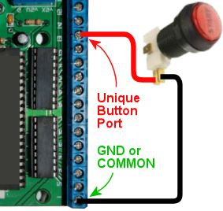
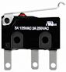
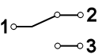
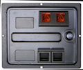

[#buttonWiring]
= Button Wiring

In the previous section ( xref:cabButtons.adoc#cabinetButtons[Cabinet Buttons] ), we looked at all the types of buttons that you might include in a virtual cab, and how to do the basic installation and wiring for each type. Now we'll look at the other end of the wiring: how you connect these buttons to your PC so that they can interact with the software.

If you're using a Pinscape Controller (either standalone or with the expansion boards), you might want to skip straight to xref:buttons.adoc#pinscapeButtonInputs[Pinscape Button Inputs] , since that's a more streamlined How To guide for the Pinscape controller specifically. Likewise, if you're using one of the commercial encoders, read through its documentation for a quick start with its wiring setup.

The basic approach that we use to connect the buttons to the PC is to make them act like keyboard keys. To do this, we need a device known as a "key encoder", which is essentially the same circuitry that's inside an actual PC keyboard to convert physical key presses into USB signals that Windows can read.

In fact, in the early days of virtual cabinets, a lot of people _literally_ used the circuitry from PC keyboards, disassembling an old keyboard and soldering their button wiring to the key switches inside. That was clever, but it was also rather difficult. If you've ever opened up any modern electronics, you know how microscopic and delicate everything inside is these days.

Fortunately, we no longer have to resort to such jury-rigged salvage jobs. There's a much easier way now: you can buy or build a dedicated key encoder built specifically for wiring arcade buttons. There are several turn-key commercial products available, or you can fairly easily build your own using the Pinscape Controller plans.

== Joystick encoders vs keyboard encoders

Note that some encoders send button presses to the PC as joystick button commands instead of keyboard keys. These work exactly like keyboard encoders in terms of all of the physical setup and wiring, so everything in this chapter applies equally well to joystick encoders. For the most part, we use the term "keyboard encoder" to refer to both types, since they're really no different other than the USB commands they send.

(In fact, some controllers use both types of commands. The Zeb's Boards plunger controller uses a mix of keyboard and joystick keys for its button inputs. The Pinscape Controller lets you use either type for any button, letting you configure the selection for each button individually.)

== Key encoder options

Several good commercial and DIY options are available. The commercial products are more expensive, but require little to no work to assemble or configure. The DIY options are cheaper but require some setup work.

* Standalone KL25Z: DIY. If you only need keyboard input (and not any feedback controller features), a bare KL25Z loaded with the Pinscape software is all you need. Fairly easy DIY setup and configuration, with no electronics assembly involved. The default configuration has 24 button inputs that can be mapped to any keys or joystick buttons, but you can assign more ports as button inputs (up to about 50 maximum) if you're not using them for other purposes.
* Pinscape expansion boards: DIY (very). The same Pinscape key controller functions as with the standalone KL25Z version are also there if you're using the expansion boards. 24 button inputs by default, with four more unassigned pins available. Requires extensive electronics assembly work and fairly easy software setup.
* Zeb's Boards plunger kit: Commercial. Provides inputs for 20 buttons.
* VirtuaPin plunger kit: Commercial. Provides inputs for 16 buttons.
* i-Pac 2: Commercial. 32 button inputs.
* i-Pac 4: Commercial. 56 button inputs.
* i-Pac Ultimate I/O: Commercial. 48 button inputs.

See xref:ioControllers.adoc#ioControllers[I/O Controllers] for more details on the controller options.

== Basic wiring plan

As with all wiring, make sure all power plugs are completely disconnected while you're working.

All of the key encoders (commercial and DIY) use the same basic wiring plan, so we'll show you how this works in general. You'll have to look at the instructions for your specific device to identify the actual physical terminals that we're talking about.

Here's the basic plan:

* At one end, you have the button. Electrically, each button is really just a switch that connects two wires together when pressed. So at the button end, we're connecting two wires, one to each terminal of the switch.

What about buttons with more than two terminals? No problem: you still only connect two wires. It's just a matter of figuring out which two terminals to connect. See "How to identify button terminals" xref:#identifyButtonTerminals[below] for help figuring out which two terminals to use.

(Any additional terminals on a button have other purposes that we don't care about when connecting the key encoder, so you can just ignore them for now. We might connect them to something else later, though. For example, an illuminated button with a lamp inside has terminals for powering the lamp, which we'd want to connect to the feedback device controller. But that's a separate matter for another chapter! For now, you can just leave any extra terminals disconnected.)

* At the other end, you have the keyboard encoder. We take those two wires that we connected to the button, and connect the other end of each wire to a terminal on the keyboard encoder.
* One wire to every button always connects to the "Common" terminal on the key encoder. Depending on which encoder you're using, this might be labeled GROUND, GND, COMMON, CMN, or C. Check your device's documentation if you're not sure which one that is.

Some key encoders have two or more Common terminals. If so, you an use any of them. They're all wired together internally so it doesn't matter which one you choose. Some of the controllers provide multiple Common terminals as a matter of convenience, to give you more flexible in how you wire everything.

* The other wire to each button connects to a *unique button port* on the key encoder. On dedicated key encoders like the i-Pac, these are often labeled with pre-assigned arcade button functions, so you might see labels like "Start", "Player 1", "Coin 1", and so on. You should check your encoder's documentation to figure out which input is appropriate for which pin cab function. If you're using a Pinscape Controller, see xref:buttons.adoc#pinscapeButtonInputs[Pinscape Button Inputs] .

If your encoder lets you customize the keyboard mapping (the i-Pac and Pinscape allow this), it really doesn't matter which button you wire to which unique input terminal, because you can assign any key to any button later in the software setup. The function labels on the i-Pac are just the defaults.

If you're using a controller with a fixed set of key assignments (like the Zeb's Boards plunger kit), you'll need to wire each key to the port that matches the function. Your encoder's documentation should list the pre-defined keyboard assignments. See "Common key assignments" xref:#commonKeyAssignments[below] for a list of the keyboard keys normally used in pinball software - that should help you match up each button to its appropriate port on your encoder.

* Every *unique button port* terminal can only connect to *one* button. That's why we call it "unique"!
* The COMMON or GROUND terminal will connect to *every* button in your system.

You don't have to connect a separate wire from every button all the way back to the Common/Ground terminal on the encoder, though! It's often easier to "daisy chain" the common, by connecting it from button to button:

All of the commons are connected together electrically, so it doesn't matter whether they connect back to the encoder with a separate wire or if they connect to each other in a daisy chain like this. You can mix and match the two approaches, too! Just connect each button's Common/Ground terminal to whatever's closest physically in the cab. If there's another button nearby, connect to the other button's Common/Ground. If the key encoder is closer than any button, run a wire back to the key encoder.

== What type of wire should I use?

Any ordinary stranded hookup wire will work fine here. These are all low-voltage, very low-power connections, so you don't need anything beefy. 24 AWG is fine. (Thicker wire is more expensive; there's no reason to waste money on thicker wires here.)

I like to use a mix of insulation colors to make it easier to trace wires through the cab when necessary. I'd use one color for all of the Common/Ground wires - black, if you want to follow the normal conventions - and a mix of other colors (never the same as the Common/Ground color) for the unique button port wires.

See xref:wire.adoc[Wire] for more on wire selection.

== Software setup

All of the key encoders emulate either a keyboard or a joystick, so there's no need for Windows device drivers. Windows should automatically recognize them as soon as you plug them in to the USB port or keyboard port.

If you're using a Pinscape Controller, you can configure how the buttons are mapped to keyboard keys or joystick buttons. Refer to xref:buttons.adoc#pinscapeButtonInputs[Pinscape Button Inputs] .

Some of the commercial controllers (such as the i-Pac) also have their own setup programs that let you configure the keyboard mappings. Refer to your controller's documentation.

If your controller uses joystick buttons instead of keyboard keys, you'll have to configure Visual Pinball and any other pinball software you use to recognize the joystick buttons. For VP:

* Run VP without loading a table (just open the blank editor)
* On the menu, select Preferences > Keys in VP 9, or Preferences > Configure Keys, Nudge, and DOF in VP 10
* In the Button Assignments section, set the drop list for each button function to match the joystick button number of the corresponding button, as you wired it to the key encoder. For example, if you wired the left flipper button to your key encoder port that sends Joystick Button 3 as its input, you'd set the drop list under Left Flipper to "Button 3".

[#commonKeyAssignments]
== Common key assignments

Here's a list of the key assignments that most of the PC pinball simulators uses by default. Most of the software gives you a way to change the key assignments, but it's always easier to use the defaults as much as possible. Fortunately, almost all of the PC pinball simulators have used the same core key assignments for decades, so you won't have fight with the software too much if you stick to the standard keys.

[cols="1,1,2"]
|===
|Function|Key|Notes

|Start
|1
|

|Exit
|Esc
|

|Extra Ball
|2
|

|Left Flipper
|Left Shift
|

|Right Flipper
|Right Shift
|

|Left MagnaSave
|Left Ctrl
|

|Right MagnaSave
|Right Ctrl
|

|Launch Ball
|Enter
|

|Left 2nd flipper
|L
|For double-contact leaf switches, rarely used; see "Single or double leaf switch" in xref:cabButtons.adoc#doubleContactFlipperSwitch[Cabinet Buttons]

|Right 2nd flipper
|R
|For double-contact leaf switches rarely used; see "Single or double leaf switch" in xref:cabButtons.adoc#doubleContactFlipperSwitch[Cabinet Buttons]

|Coin In (main/left slot)
|3
|Used in VP/VPinMAME; "5" is more typical in other games

|Coin In (middle coin slot)
|4
|VP/VPinMAME only

|Coin In (right coin slot)
|5
|VP/VPinMAME only

|Coin In (fourth slot/dollar bill)
|6
|VP/VPinMAME only

|Tilt bob
|T
|See "How to configure VP for a tilt bob" in xref:tilt.adoc#VPTiltBobConfig[Nudge & Tilt]

|Slam tilt
|Home
|

|Open/close coin door
|End
|

|Service Escape/Exit
|7
|

|Service Down/-
|8
|

|Service Up/+
|9
|

|Service Enter/Select
|0
|

|VP Volume Up
|+
|Only used in VP

|VP Volume Down
|-
|Only used in VP

|===

Note that the VP Volume Up/Down key assignments really aren't very useful. Those just adjust the relative volume of VP's table effects, and VP doesn't remember the settings across games, so you have to keep adjusting them over and over if you want to use them. It's pretty worthless. If you want general volume control buttons, I'd recommend skipping VP's keys and assigning the "Media Volume Up" and "Media Volume Down" keys instead, which Windows will use to adjust the master system volume level. That at least sticks across program sessions. Or better yet, use something like link:http://mjrnet.org/pinscape/PinVol.html[PinVol] , which gives you finer controls that let you set per-game volume levels that are restored each time you return to a game.

[#identifyButtonTerminals]
== How to identify button terminals

Electronically, every button is just a switch - basically a little gap between two pieces of wire that you can open and close. When the gap is open, the two wires are disconnected from each other, so no electricity can travel between them. When the gap is closed, the wires touch, conducting electricity through the switch.

So for each button, you need to start by identifying the two terminals for its switch.

This is trivial for some buttons, because two terminals is all they have! But a number of common arcade button types have multiple terminals, which makes it a little harder.

Let's take a look at some common button types and how to identify their switch terminals.

=== Arcade pushbuttons

This is the type you'll probably use for the front panel buttons on your machine. These combine a microswitch and a light bulb socket into a small plastic base. The complication is that they add two extra terminals for the lamp power wires, so you have to figure out which wires go to the lamp and which go to the switch.

Most of these have five terminals, arranged like this:

You should be able to find markings on the plastic body for at least two of the switch terminals, one labeled "C or "COM", and the other labeled "NO" or "NC". Match the markings to the diagram above, and take into account any changes.

* Connect the Ground/Common wire from your key encoder to the "C" or "COM" terminal on the button
* Connect the other wire to the "NO" (Normally Open) terminal

If there aren't any markings, or the terminals are laid out differently, you might have to resort to the xref:#experimentalButtonTerminalId[experimental method] described below.

What about the lamp terminals? That's a whole separate subject, because even though the lamp is part of the button assembly, it's controlled by a whole separate electrical system on your virtual cab. That's covered in xref:buttonLamps.adoc[Button Lamps] .

=== Microswitches

These come in small black plastic cases with two or three terminals. There's usually a metal lever on the top that actuates the switch, but sometimes the switch paddle is just a little bump on top.

These usually have some kind of markings on the case near the terminal legs telling you how the terminals are wired inside the switch. The markings might only be raised or embossed in the plastic rather than inked, so they can be hard to see. Try looking at the switch under a strong light if no markings are apparent.

*  *NO, NC, C (or COM)* . Look for these markings next to the terminal legs. These stand for *N* ormally *O* pen, *N* ormally *C* losed, and *C* ommon. The C or COM label might not be there at all, but if the other two are marked NC and NO respectively, the unmarked leg must be the Common.

For this type of marking, connect the Ground/Common wire from your key encoder to the *C* or *COM* terminal, and connect the other wire to *NO* .

*  *Numbered terminals.* Look for a small "1", "2", and "3" near each terminal leg. If you find these, you should also find a diagram printed (or embossed) on the case that looks something like this:

The "1", "2", and "3" lines represent the terminals. The diagonal line in the middle represents the moving contact in the switch. The diagram is telling you that normally, the moving contact connects between 1 and 2, but that when you press the switch, the moving part tilts the other way so that it connects 1 and 3. Connect the Ground/Common wire from your key encoder to terminal "1", and connect the unique button input on the encoder to terminal "3".

Note that the numbers themselves aren't what's important here: your switch might use different numbering or different labels entirely. The relationship between the terminals is what's important.

*Coin door buttons:* If you're using a real pinball coin door, it probably has several buttons and switches built in:

* Service panel buttons. A set of 3 or 4 pushbuttons inside the door. On a real machine, these access the operator menu.
* Slam tilt switch. This is a secondary tilt switch that's activated by hard jabs to the front of the machine.
* Coin chute switches. Each coin chute has a microswitch that's triggered when a coin is accepted.

You can connect all of these switches to your key encoder in the same way as other buttons. Visual Pinball has keyboard equivalents for all of these functions, so connecting these switches lets you access each function the same way you'd do it on a real machine.

Things get a little complicated at this point, though. The snag is that there are several types and several generations of coin doors available, and each one is wired differently. In particular, each type has its own special type of connector. You can find more details on the common types of connectors in xref:coinDoor.adoc#coinDoor[Coin Door] .

If you can't find a wiring diagram for your specific coin door type, you can use the xref:#experimentalButtonTerminalId[experimental method] described below to trace the wires.

Once you identify the button and switch wires, connect them to the controller just like any other buttons. The coin door wiring usually includes a single common wire that connects to one terminal on each switch, plus one unique wire per switch. That's exactly how the basic key encoder wiring is set up, so just connect the coin door common wire to the key encoder's Ground/Common wire, and connect each unique switch wire to a separate button port on the encoder.

*Coin door open switch:* On a real pinball machine, there's a switch that detects when the coin door is open. Pinball ROMs use this to control access to the operator menus, so I'd recommend including one in your build if you're using a coin door. The xref:coinDoor.adoc#coinDoor[Coin Door chapter] has suggestions for what kind of switch to use and how to mount it.

Once you have a switch set up, wire its "Common" terminal to the key encoder Ground/Common, and wire its *NC* or *Normally Closed* to a button port on the encoder. Note that this is backwards from most buttons, where you wire the Normally Open terminal. The reason for the reversal is that the geometry of the installation is kind of backwards: when the door is closed, it pushes down on the switch paddle, so the switch is "on". When the door is open, it releases the paddle, so the switch is "off". But we want Closed to read as "off" and Open to read as "on". The easy way to accomplish this reversal is to use the Normally Closed half of the switch, which reports the opposite status of the Normally Open side.

The coin door open button needs a little bit of special treatment in the software setup. On a real pinball, the coin door switch is just a switch: it's ON when the door is open and OFF when the door is closed. But Visual Pinball, by default, treats it as a toggle button, not a switch: push the button to open the door, push the button again to close the door. You can change this handling in VP with a little scripting work - see "Setting up the coin door switch in VP" in xref:coinDoor.adoc#CoinDoorSwitchInVP[Coin Door] .

=== Tilt bob

You can connect a tilt bob to a button input, to detect TILT conditions the same way a real machine does.

Note that the tilt bob *isn't* there for "nudging" in the simulation. It's far too blunt an instrument for that. The tilt bob is there to serve the same purpose it does in a real machine, which is detect the overly aggressive nudging that counts as cheating. For the kind of nudging where you want to influence the ball motion in the simulation, use an accelerometer. That can differentiate between gentle nudges and hard nudges and everything in between. See xref:tilt.adoc[Nudge & Tilt] for more.

To connect a tilt bob, simply connect the two usual wires from the key encoder (Ground/Common and a unique button input) to the two ends of the bob: one to the hanger hook, the other to the ring at the bottom. Standard pinball tilt bob assemblies have screw terminals where you can attach the wires - the arrows below show where.

Where to attach the switch wires to a tilt bob. Note that this is the tilt bob in a real pinball machine. If you're wondering about the diode visible in the photo, that's only there because of the "matrix" switching used on the real machines. It's not needed in a virtual cab.

=== Switches with four or six terminals

A switch with more than three terminals is probably a "double pole" switch, meaning that it has two separate switches inside, mechanically linked so that they turn on and off together. These can come with four terminals or six terminals.

If the terminals are marked, they should indicate some kind of grouping to let you know which terminals belong to which switch. For example, you might see something like "1NC - 1NO - 1COM / 2NC - 2NO - 2COM". All of the "1" terminals are part of the first switch, and the "2" terminals are part of the second. Alternatively, you might see a little switch diagram like the "numbered terminals" diagram above, but with two copies of that circuit. The two circuits represent the two switches.

This type of switch connects to your keyboard controller with two wires (Ground/Common and a unique button input), just like any simpler switch or button. The trick is just to ignore that second switch, acting like the extra terminals don't even exist. As before, you just need to identify one pair of Normally Open contacts. You can leave the other terminals unconnected.

[#experimentalButtonTerminalId]
=== Identifying button terminals experimentally

If you have an unusual button that doesn't fit any of the styles above, and you can't find any markings, you can always use a voltmeter to identify the terminals.

In fact, even if you've identified a button's terminals based on markings, it's not a bad idea to double-check your findings with a voltmeter to make sure you read correctly.

If your voltmeter has a Continuity Tester setting, select that. On this setting, the meter should emit a beep when it detects a good connection. If you don't have a Continuity setting, use the Ohms setting instead, and read it like this: INFINITY (∞) Ohms means no connection, 0 Ohms (or close to 0 Ohms) means there's a good connection.

If you already think you know which pair of terminals to use, touch the meter's leads to the two terminals. It should read as infinity Ohms (no beeping if you're in continuity tester mode). Keeping the leads on the terminals, press the button. The meter should change to 0 Ohms or should beep in continuity mode.

If you have no idea which terminals are which, simply try each pair in turn until you identify the pair that behaves as just described.

