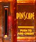
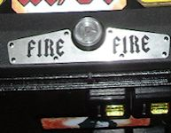
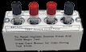
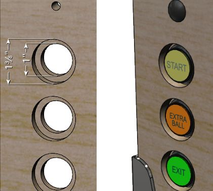
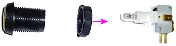
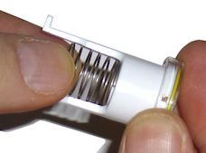
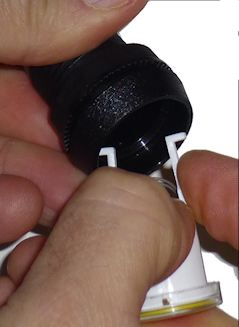
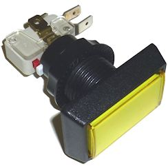
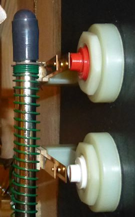

= Cabinet Buttons

One of the top ten questions that every new cab builder asks on the forums is:

"Which buttons should I include?"

I think most of us start off thinking the answer is so obvious that it's not even worth asking the question: why, the same buttons they put on _real_ pinball machines, of course! But as soon as you start actually designing your cab, it becomes apparent that it's not as simple as it seems. Some of the complications:

* Real machines don't all have the same buttons. There are three buttons that are pretty much universal: the two flipper buttons and the Start button. Beyond that, different machines have their own extra buttons, some common and some unique. Some common buttons that appear on many machines are the Magna Save buttons (alongside the flipper buttons), a flipper-like button on top of the lock bar (often labeled "Fire"), an Extra Ball or "Buy In" button on the front of the cabinet, and a Launch Ball button in place of the plunger. If you want to be able to play re-creations of tables with those extra buttons, you'll need some equivalent of the extra buttons on your cab.
* Modern pinball machines have some additional, hidden buttons, inside the coin door, that let the operator access the game's setup menus. It's useful to have these on a virtual cab, too, because you're going to be the operator and will want to be able to access the setup menus.
* Virtual pinball needs some additional controls for the "virtual" aspect, such as inserting virtual coins, navigating the game selection menus, viewing game instruction cards, viewing flyers, exiting an active game and returning to the game selection menu, and controlling the PC audio volume. Many of these functions can be comfortably assigned to the regular pinball buttons (flippers, Start, etc), so you don't actually need a big array of extra controls, but most people find it necessary to have at least one extra button, for the special function unique to virtual pinball of exiting out of the current table.

This section will try to help you answer that big question about which buttons to include. I don't want to presume to dictate a single slate of buttons that everyone should use. Tastes vary about whether you should have lots of buttons or as few as possible, and some cabs have more space than others available for buttons. So instead of trying to answer the question with a list of "these are the buttons you should include", we'll go over all of the buttons commonly used on virtual cabs, even the ones only rarely seen, and we'll explain each one's purpose and offer an opinion on each one's importance. (There is, however, a summary of recommendations xref:#summaryOfButtonRecs[below] , in case you want to cut to the case.)

Later in the section, after surveying all of the button functions, we'll get into the details of the equipment to use for each type of button, including what to buy and how to install it.

== Minimalist vs. maximalist

When you add up all of the buttons used across different real pinball machines, plus all of the special buttons for virtual pinball needs, you get a pretty long list.

One way to cover all the bases is to simply include every button you can think of. It's impractical to include every unique button on every machine - there are just too many of those - but you can include all of the special buttons for all of the games you think you might want to play. This "maximalist" approach gives you the best chance of replicating the original playing experience for all of the different games. It also gives you lots of blinking lights, and we all like shiny things.

Some cab builders prefer a more "minimalist" approach, with the aim of replicating the appearance of a real pinball machine more closely. Most real pinballs have only a few buttons, so a cabinet with too many extra buttons can start to look conspicuously "virtual". The minimalist tries to limit exterior buttons to about the same number found on most real machine, for a more authentic appearance.

Fortunately for the minimalists, the modern software environment makes it possible to access all of the important functions with only a few extra buttons beyond the core set found on all real pinballs.

If you're a determined maximalist, note that the practical limits of available space might cramp your style a bit. A standard cabinet with a coin door can really only fit a maximum of four buttons on the front panel, in addition to the plunger, the Launch Ball button, and the coin door controls.

I personally favor a middle path, closer to the minimalist side, but allowing a few extra buttons for the sake of the broadest playability. With this in mind, the list below has my recommendations for which buttons to include and which to skip, or at least find a way to hide.

== Master list of buttons

To help you decide which buttons you need, whichever camp you're in, here's a list of all of the common and less common virtual cab buttons, how important they are (in my opinion), and where they're usually situated. The list is roughly in order of importance, from most important to least.

*  *Power button:*  _Essential._ Pushbutton, bottom of cab, front right side. +On the real machines, the power is controlled with a toggle switch wired to the main power supply line, located in a little recess on the bottom of the cab at the front right corner. In a virtual cab, we usually replace this with a "soft" power button in the same location, wired to the PC motherboard's power control header. See "Floor" in xref:cabBody.adoc#softPowerButton[Cabinet Body] for details on installing a pushbutton in the proper spot, and xref:powerSwitching.adoc[Power Switching] for more on setting up the PC soft power controls.
* 
*Start:*  _Essential._ Round pushbutton, front panel, top left. +This is a core button found on every real pinball. Push it to start the game. Most "front ends" (the game menu software that lets you select games to play) also use this as a "select" button when navigating through menus.
*  *Flippers:*  _Essential._ Standard flipper buttons, sides of cab. +These are core buttons found on every real pinball.
* 
*Exit:*  _Essential._ Round pushbutton, front panel, below Start. +You won't find this button on real pinballs; you "exit" a real pinball game by walking away. But it's a must for a virtual cab. This button exits the current game and returns to the "front end" game selection menu. Front ends typically also use this to navigate within their menu structure (to back out of a menu or acknowledge a pop-up message, for example).
* 
*Coin In:*  _Essential._ No standard location, but commonly either a round pushbutton on the front panel, or repurposing the Coin Reject buttons on the coin door slots. +This button lets you simulate inserting a coin to add credits to the current game. Even though you'll probably be setting most of your games on Free Play via the operator menus, a Coin button is still needed in some cases, since some older tables simply don't have a Free Play option.

If you have a full coin door with coin slots, you don't absolutely need a separate button for this, since you can use actual coins instead, just like in a real arcade machine. Most coin doors don't come with coin mechs installed, so you'll probably have to separately purchase the mechs (about $10 each for US quarter acceptors) and install them yourself. You'll also have to wire the coin slot microswitches to your key encoder, which is just like wiring a button switch. This is all covered in detail in xref:coinDoor.adoc[Coin Door] .

Even if you do install and wire physical coin acceptors, you might still want to add a separate Coin In button, since a lot of people find it tedious to feed in quarters once the novelty wears off. The most obvious way to add a Coin In function is to simply add one more round pushbutton to the front panel. If you don't like the added visual clutter of another button, though, there's a neat way to hide it in plain sight. Specifically, you can use the "Reject Coin" buttons in your coin slots as your virtual coin buttons. To do that, you have to add microswitches behind the buttons, as explained in xref:coinDoor.adoc[Coin Door] .

My favorite option is to include _both_ the real coin mechanisms _and_ the Reject button switches. That way you can use real coins when you're in the mood for the full arcade experience, and just push the buttons when you're not.

*  *Magna Save:*  _Essential-ish._ Standard flipper buttons, sides of cab. +This is a second set of buttons on the sides of the cabinet, just behind or below the flipper buttons, using the same button style as the flipper buttons. Everyone calls these "Magna Save" buttons, because a few games in the 1980s famously used such buttons for a magnetic ball-save feature with that trademarked name. Calling them Magna Save buttons is a little misleading, because similar buttons were used on many other pinball machines over the years for all sorts of different special features, but we really don't have a better name, so Magna Save it is.

I'm grading these "Essential-ish", because you can get by without them in the majority of games. But if you omit them, you'll give up some important features in a lot of games - many more games than you'd think based on the Magna Save name. Dozens of real tables featured similar buttons. Even if you're a hard-core minimalist about buttons on your cab, there's a case to be made that these buttons appear on enough real pinball machines to be considered part of the basic set of authentic pinball controls. But the real reason to include them is that an even greater number of Visual Pinball tables rely on them for special game-specific features, because these buttons have become the standard fallback for emulating unique controls. You really need these buttons on your cab if you want to enjoy full playability for many Visual Pinball tables. To see what I mean, take a look at the lists in xref:magnaSaveButtons.adoc[Tables with MagnaSave Buttons] .

* 
*Tilt bob:*  _Essential-ish._ Inside the cab. +The tilt bob is a little mechanical pendulum that detects excess cabinet motion. This isn't exactly a button, but it acts like one in almost every way - you connect it to the key encoder like a button, and it provides input to the software as though it were a button.

Don't confuse the tilt bob with a nudge sensor. The purpose of a tilt bob isn't to simulate nudges in the software, but rather to detect when you're nudging _too much_ . The tilt bob serves exactly the same function in a virtual cab that it serves in a real pinball machine. See xref:tilt.adoc[Nudge & Tilt] for a full discussion of the distinction between "nudging" and "tilting", and the tilt bob's role in this.

Visual Pinball has its own simulated tilt bob, but I strongly recommend installing a physical tilt bob anyway. VP's version just isn't very realistic. The interaction between a real cabinet's motion and the tilt bob's motion is complex; it's one of those compound pendulums that's rather difficult to model, and VP doesn't really try. And I don't see why it should, when we can so easily get _exactly_ the right handling by just hooking up a real tilt bob! That's why I rank this as practically essential. And it doesn't affect aesthetics, since it goes inside the cab.

*  *Launch Ball:*  _Nice to have if you have a plunger; essential if not._  image:images/LaunchBallSmall.png[""]
Large round pushbutton, front panel, right.

A fair number of games from the 1990s used a Launch Ball button in place of a regular plunger. This was usually a large round pushbutton, but some games used unique devices instead, such as a gun trigger on _Terminator 2: Judgment Day_ or a gear shift lever on _The Getaway: High Speed 2_ . On the real machines that use such a thing, the button or device is typically positioned exactly where the plunger would normally go, at the top right corner of the front panel.

For a virtual cab, this button is optional if you're going to install a plunger using the Pinscape Controller or the plunger kit from Zeb's Boards. Both of those let you simulate the Launch Ball button using the plunger, so you don't absolutely need the button. Even so, I still recommend including the button in addition to the plunger, since it replicates the original playing experience more faithfully for Launch Ball tables.

Alternatively, you can use a Launch button _instead of_ a regular plunger. All of the PC pinball simulators are designed with desktop use in mind, so they all let you control the on-screen plunger with a key press. You can simply map the Launch Ball button to the software plunger key and dispense with the real plunger. This saves front panel space and the complexity and cost of a real plunger.

In my opinion, the best option is to have _both_ a regular plunger and a Launch Ball button. Controlling the on-screen plunger with a button is possible, but it's a really poor substitute for a genuine plunger. Besides, the plunger is a defining feature of pinball; for me it's simply a must in a virtual cab. If you do choose to include both the plunger and the button, the button can go just above or just below the plunger. I prefer to put the plunger in its standard location on a real pinball, which means the button has to go below it. But some people prefer putting the button above the plunger to make it easier to see and reach, which requires lowering the plunger by a couple of inches from the standard position to make room for the button. I'm not wild about the unusual appearance of the lowered plunger, but some cab builders have to lower the plunger anyway because the normal position is blocked by the playfield TV.

*  *Audio volume:*  _Recommended._ No standard location; preferably hidden. +I find that I adjust the audio volume quite frequently on my cab, so I very much like have a way to do this conveniently. Getting out the keyboard or mouse or opening up the cab don't count as convenient, so some kind of external control for this is recommended.

Some people like to use the straightforward approach of adjusting the volume via the amplifier's volume knob, so they locate the amp somewhere easily accessible.

My preference is to control the audio volume via external cabinet buttons for Volume Up and Volume Down. This is possible if you use some software to provide a keyboard interface to the Windows master line-out volume level, such as my link:http://mjrnet.org/pinscape/PinVol.html[PinVol] utility.

If your keyboard encoder has the concept of a "Shift" button (Pinscape and the i-Pac encoders do), you don't need separate physical buttons for volume. You can instead double up some of the regular buttons, using them as volume controls in addition to their normal functions. This is the approach I use myself, and I like it because it makes the volume controls easily accessible without requiring any extra physical buttons. I use the right MagnaSave/flipper buttons as Volume Up/Down buttons, in combination with my Extra Ball button as the Shift button. That is, when I press and hold Extra Ball, I can use the right buttons to adjust the volume. Easy, convenient, and requires no extra buttons.

If you prefer separate, physical Volume Up/Down buttons, where do they go? There's no standard location for these, but even the maximalists seem to agree that these particular buttons should be hidden. Some cab builders accomplish this by putting them inside the coin door. That's a little too inconvenient, in my opinion, for something I access so often. A better option is the bottom of the cabinet, near the front edge: that puts them out of sight, but they're easily accessible and you can find them by feel.

Another option that you might prefer is a knob that sends volume up/down keystrokes to the PC. See the vpforums thread link:https://www.vpforums.org/index.php?showtopic=42665.html[Coin Door Volume Control] for a way to build such a knob and mount it on the coin door.

*  *Coin door position switch:*  _Recommended._ Inside the coin door. +The real machines have a switch inside the coin door that senses whether the door is open or closed, like the switch in a refrigerator that turns on the light when you open the door. I'm sure this seems like a ridiculously nitpicky detail, but it's actually important, because a lot of the ROM software on the modern games requires the signal from this switch to access the service menus. (They're so insistent about it because they use it as a safety measure, to cut off the high voltage power supply when the operator is working inside the machine.) Installing the switch to match the software's expectations just makes things easier, and it's not difficult or expensive to install. For full details, see "Coin door position switch" in xref:coinDoor.adoc#coinDoorPositionSwitch[Coin Door] .

[#fireButton]
*  *Fire!:*  _Nice to have; essential for Stern fans._ Top center of lockdown bar. 
Many newer Stern games (2005 to present) feature this extra button on top of the lockdown bar, usually centered side to side. (The lockdown bar is the metal piece at the front edge holding the cover glass down.) The button itself is usually a clear flipper button and usually has a lamp inside.

Up until recently, I think many cab builders considered the Fire button to be one of those special, game-specific buttons that isn't widely enough used to justify including it as a physical button. But it's not _that_ game-specific any more, given that nearly every newer Stern title has one. I think it's on its way to becoming a new core button on the strength of Stern's consistent use, and because it's just a good location for an extra button. It's visually appealing even if you're in the minimalist camp, and it's easy to reach during play.

The complication is that you either need a special (more expensive) version of both the lockbar and receiver that are pre-drilled to accept the button, or you need to modify the standard ones. See "Fire button" in xref:cabHardware.adoc#lockbarFireButton[Cabinet Hardware Installation] for more on finding the required parts.

* 
*Service buttons:*  _Nice to have._ Inside the coin door. +If you're using a real coin door, it will probably come with a little "service button" panel pre-installed on the inside of the door. Modern coin doors for WPC and Stern machines have four buttons here; older 1980s games usually had three buttons. On a real machine, these let the operator access the setup menus for the game, which are used adjust pricing and feature settings and to access self-diagnostics. These menus are where you set up Free Play, for example, or change from 3-ball to 5-ball play. In a virtual cab, you can access the same menus via the authentic buttons if you have them, by connecting the buttons to your key encoder.

If you don't have a real coin door, or it doesn't include the service buttons, you can access the service menus via your PC keyboard. This isn't something you have to do very often, so I don't consider these buttons to be essential. But I do consider them to be a big convenience that I wouldn't want to do without on my own machine. Assuming you have a coin door, these buttons don't affect the aesthetics, since they're hidden inside the machine.

*  *Extra Ball/Buy-In:*  _Nice to have._ Round pushbutton, below Start. 
A few games from the 1990s feature an extra front-panel button labeled "Extra Ball", "Buy-In", or in a few cases something marketing-ese like "Super Ball". The button on the real machines is either below the Start button or below the plunger. It lets you buy an extra ball for a credit after the last ball ends (which can be a decent deal if you're close to a replay or close to beating the high score). Realistically, for virtual play, you'll probably never use it: why bother "buying" an extra ball when every game is free? Even so, I included one on my machine mostly for completeness, because I like a lot of games from the era where this button was common. If you do include it, it also gives you one more option for mapping special functions in games with unique buttons.
*  *Night Mode:*  _Nice to have._ Hidden; no standard location. +If your cabinet has mechanical feedback devices (contactors, solenoids, replay knocker, etc), you might want to include a button or switch to activate "Night Mode", which turns off the noisy devices for quieter play in the wee hours. The wiring depends on your output device controller; if you're using a Pinscape Controller for feedback devices, you can assign any button input to serve as the Night Mode button. The generic arcade controllers (LedWiz, PacLed) don't have this feature at all, but you can improvise something with a switch that cuts off power to the noisy devices. See xref:feedbackDevices.adoc[Feedback Devices Overview] . Like the audio volume controls, this button is an "operator" button that you'll probably want to place somewhere out of view, such as on the bottom of the machine or inside the coin door. With Pinscape, you can assign it as a secondary ("shifted") function of one of your other buttons.
* 
*Slam tilt switch:* Neutral. If you have a WPC-style coin door, it will probably have a slam tilt switch pre-installed. The slam tilt looks like a leaf switch with a big metal slug attached to the end of the main leaf. It's usually mounted on the inside of the coin door.

This is related to the tilt bob, but rather than detecting excess motion, it detects excess force. It's triggered by very hard jolts to the front of the cabinet. That big round slug at the end of the main leaf has a lot of inertia, which is what makes the switch work. A hard enough slam will propel the slug by sheer inertia far enough to close the switch and trigger the alarm.

I don't find the slam tilt to be all that necessary on a virtual cab, since its main purpose is to deter the sort of extreme abuse that a coin-op machine in a public place can be subjected to. It's unlikely you'd ever trigger it in regular play, even if you're an aggressive nudger. So I wouldn't go out of my way to add this device if your coin door doesn't already have one. But if it's already there, I'd go ahead and wire it up, since VPinMAME does recognize it as a standard input. The WPC doors usually do come with a slam tilt switch; the Stern and SuzoHapp doors don't.

See xref:coinDoor.adoc[Coin Door] for more on wiring a pre-installed slam tilt switch and information about how it's treated in the software.

*  *Virtual service buttons:*  _Kinda nice to have._ Inside the coin door. +There are a few miscellaneous "operator" functions specific to virtual pinball that might merit their own buttons inside the coin door, such as engaging night mode, doing a hard reboot of the PC or activating plunger calibration mode. One way to do this is to add your own bank of additional service buttons somewhere inside the coin door. See "Adding an extra service panel" in xref:coinDoor.adoc#customServicePanel[Coin Door] for ideas.
*  *Flyer, Instructions, Info:*  _For the maximalist only._ Below Start. +Some front ends (game selection menu programs) use keys to select selection certain functions within the UI, such as viewing a game's promotional flyer, viewing its instruction card, or displaying other information about the game. Some cab builders include a bunch of cabinet buttons dedicated to these front-end functions. Functionally, you don't really need a bunch of special buttons for the menu program, since the newer front ends let you access everything through the basic keys. You can include them if you like the aesthetics of lots of buttons, though, and they do give you more options for mapping special functions in tables that had unique extra buttons of their own.
*  *Nudge:*  _Not recommended._ No standard location. In the early days of virtual cabs, some cab builders added special extra buttons for nudging. This simply transplanted one of the bad features of desktop play (the lack of real physical interaction) into the cabinet, which is the opposite of our ultimate goal of emulating the elements of real pinball play in software. But it was the only option back then, so people did it to have some kind of nudge interaction, even if it wasn't very good. Fortunately, there's a much better way to handle nudging now: use an accelerometer. That lets you _virtually_ nudge the simulated game by _actually_ nudging the physical cabinet. Unlike the bad old days of push-button nudging, where the nudge command was one-size-fits-all, the accelerometer registers the amount and direction of the force you apply, so that the software response can be proportional. It makes the play much more natural and immersive than trying to fumble for buttons at critical moments. See xref:tilt.adoc[Nudge & Tilt] .

== Recommendations

Here's a summary of my recommendations, in descending order of importance.
[#summaryOfButtonRecs]
Essential (all cabs need these):

* Power button
* Start
* Flippers
* Exit
* Coin In

All but essential:

* Magna Save
* Tilt bob

Recommended:

* Audio volume up/down/mute
* Coin door position switch

Nice to have:

* Launch ball (essential if you don't have a plunger)
* Service buttons
* Extra Ball/Buy-In
* Night Mode
* Stern-style lockbar Fire button

Neutral:

* Slam Tilt
* Virtual service buttons

For the maximalist only:

* Flyer
* Instructions
* Info

Not recommended:

* Nudge buttons (use an accelerometer instead!)

== Illuminated buttons

Most people want illuminated buttons for the common front panel buttons - Start, Exit, Launch Ball, Extra Ball, Coin In, etc.

This is fortunately really easy to do, because you can buy pre-assembled button-plus-lamp assemblies in the "small round pushbutton" style used on modern pinball machines.

Most people further want to have the software control the button lights, so that the Start button flashes when the game is ready to start and the Launch Ball button flashes when a ball is ready to launch, and so on. This is also easily done, as long as you have a feedback controller like an LedWiz or Pinscape Controller.

A lot of first-time cab builders find this idea little confusing at first. The big question a lot of people ask is how you're supposed to connect a button lamp to your keyboard encoder. The answer is that you're _not_ supposed to connect the lamp to your encoder. You're supposed to connect it to your feedback controller.

This becomes a lot easier to grasp if you think about the _switch_ and the _lamp_ as two separate devices. What throws people is that the two are built into a single plastic housing. But, electronically, they're not connected at all. Think about it like this:

* there's a switch, which you connect to your keyboard encoder
* and there's a lamp, which you connect to your feedback controller

But then you might wonder: How does the feedback controller know that the lamp goes with the button, and how does the keyboard encoder know that the switch goes with the lamp? Well, they don't. And they don't have to. The key input and the feedback output port are separate entities in the software as well. So you don't have to worry about coordinating between the two physical devices in terms of the wiring; it's all handled in the software.

The switch wiring part is explained in more detail in xref:cabButtonWiring.adoc[Button Wiring] .

The lamp wiring part is covered in xref:buttonLamps.adoc[Button Lamps] .

=== Incandescent and LED lamps

Most of the button-with-lamp assemblies that you can buy from the pinball vendors come with incandescent lamps. The standard lamp type for most of these is called a #555 bulb. These are longish cylindrical bulbs with wedge-shaped bases. They run on 6.3V power and draw about 250mA of current.

Plug-and-play LED replacement bulbs are available for the #555 incandescents. You can find these at the pinball vendors as well as from Amazon or eBay. The LED versions draw considerably less power than the incandescent versions and run at full brightness on 5V (the incandescents need the unusual voltage of 6.3V for full brightness).

If you do opt for LED replacements, pay attention to color. White LEDs are actually composed of separate red/green/blue elements, so if you put a white LED behind a blue-tinted button cover, two-thirds of the light (the red and green parts) will be blocked out, so the light will only look 1/3 as bright as it should. What you should do instead is match the color of the LED to the button color as closely as you can: for a yellow button face, buy a yellow LED.

*Regular vs. "non-ghosting" LEDs:* Many of the pinball vendors offer two types of LED replacement bulbs: regular and "non-ghosting". The non-ghosting kind is marketed as a premium upgrade, so at first glance you might think it's worth spending a few extra dollars to get the "best". But beware! For virtual cab use, the non-ghosting type are actually a *downgrade.* A non-ghosting LED has a little capacitor inside that makes it switch on and off slowly. This is specifically designed to work around a strobing problem that can occur if you plug regular LEDs into older pinball machines. That strobing effect was a result of the design of the older machines, and it *doesn't* happen with the modern PWM controllers we use in virtual pin cabs. In fact, the delayed switching is actively harmful in pin cabs, because it interferes with PWM brightness control. So you should *avoid non-ghosting LEDs* for your virtual pin cab - use the regular kind instead. In most cases, if the vendor doesn't specifically say they're non-ghosting, they're probably not, because non-ghosting is inherently more expensive and so the seller will want to call attention to it as a selling point.

(An aside, for those interested in the technical details of the strobing effect. The pinball machines of the 1980s and 1990s used what they called a "lamp matrix" to operate the controlled lamps - the lamps that the controller could switch on and off individually during the game, such as an "Extra Ball When Lit" light. The lamp matrix was a way of reducing the amount of wiring and the number of transistors needed in the main control board. Rather than dedicating a transistor switching circuit to each lamp individually, the lamp matrix placed each lamp at the intersection of a "row" and "column" in the matrix, so that they only needed one transistor per row and one per column. This let them control 64 lamps with 8 row transistors and 8 column transistors. Transistors were more expensive in those days, so controlling 64 lamps with 16 transistors was a significant cost savings. Because of the shared transistors, though, the controller could only turn on one column at a time, so it had to rapidly cycle through the columns to make all of the lamps light up. This worked fine with incandescent bulbs, because incandescent filaments take a fairly long time to heat up and cool down. Even though each lamp was energized only briefly as the controller cycled through the columns, the filaments stayed hot enough between pulses that the bulbs kept glowing, with only a slight dip in brightness between pulses, too slight for the eye to see. When people started replacing the bulbs with LEDs, the column cycling became visible, because LEDs turn on and off almost instantly. They don't have filaments that retain heat between pulses. The column strobing was slow enough that the human eye could easily see it with an LED. So that's where non-ghosting LEDs come in. They have capacitors inside that replicate the slow switching times of incandescents, so that each lamp stays on long enough that it doesn't flash between column cycles. This is actively harmful with modern PWM controllers, because PWM also uses rapid flashing, to control brightness. In the case of PWM, the flashing is so fast that the human eye can't see it, so we don't _need_ to filter it out, and we don't _want_ to filter it out, since that would cancel out the brightness controls. If you put in the non-ghosting capacitors, the PWM controller won't be able to create the brightness fading effects that we want.)

== Common pinball button types

=== Small round pushbutton

Most cab builders use the SuzoHapp "small round pushbutton" for the Start, Exit, and (if present) Extra Ball buttons. These can also be used for any other front-panel buttons you're including, such as Coin In, Instructions, Flyer, etc.

This is the same type used on most real machines made from the 1990s to present, including the WPC machines and newer Stern machine, so it looks exactly like the real article. It's convenient to install because it combines the plastic housing, a microswitch, and a lamp in a self-contained package. No other parts are needed for installation; you just pop it through a 1" diameter hole and fasten it with the included nut.

You can buy these buttons in assorted face colors, with no labels installed, directly from the manufacturer, link:https://suzohapp.com/[SuzoHapp] . Search for part D54-0004-2.

They're also available from pinball suppliers with various pre-installed labels used on real machines (Start, Extra Ball, Super Ball, Buy In). Search for part numbers 20-9663, 500-6388-02.

I'd buy the pre-labeled buttons to the extent you can, since they're easier, but you won't find pre-labeled buttons for virtual cab functions like Exit, Coin In, etc. You'll have to make your own labels for those. Fortunately, it's pretty easy; see "Custom labels" below.

====  Installation

To install with the button flush with the outside surface:

* First, route a 1⅜" diameter inset, ⅜" deep
* Then, drill the rest of the way though with a 1" hole saw bit or Forstner bit (don't use a spade bit - they cause too much chipping with plywood)

The routed inset recesses the button enough that it'll be roughly flush with the outside wall. If you want to keep it simpler and you don't mind having the button stick out a bit, you can skip the inset, and instead just drill a single hole straight through with the 1" hole saw bit or Forstner bit.

* Gently twist the microswitch base 1/8 turn to release it

image::images/button-assembly-1.png[""]

* Pull the base out

image::images/button-assembly-2.png[""]

* Remove the nut

* Fit the button into the hole you drilled for it. Insert the button from the outside of the cabinet.

image::images/inside-front-buttons-1.png[""]

* Fit the nut over the shaft and tighten
* Fit the microswitch base back into the main body; when you find the spot where it fits, press it in slightly and give it a 1/8 turn to lock it back in place.

====  Wiring

Wiring these illuminated buttons is like wiring two completely separate devices: the switch, which you connect to your keyboard encoder; and the lamp, which you connect to your feedback device controller.

For details on wiring the switch to the key encoder, see xref:cabButtonWiring.adoc[Button Wiring] .

For how to wire the lamp to the feedback controller, see xref:buttonLamps.adoc[Button Lamps] .

If you don't care about controlling the lamp through software, you can just wire the lamp directly to a power supply so that it's always illuminated. Some cabinet buttons (such as Exit and Coin In) don't really have any interesting software effects anyway, so you can save a little effort this way (and conserve ports on your feedback controller). See xref:buttonLamps.adoc[Button Lamps] for how to identify the lamp terminals, then just connect those terminals directly to the appropriate power supply. #555 incandescent bulbs are designed to run on 6.3V (they'll work on 5V as well, but they'll be a little dimmer than intended). #555 LED bulbs are a little more forgiving about voltage and should look fully bright at 5V.

====  Typical key assignments

Here are the usual key assignments for the front-panel buttons:

* Start = "1" (the digit "1" key)
* Extra Ball = "2" (the digit "2" key)
* Coin In = "3" (the digit "3" key; "5" represents the second or right-hand coin chute in a door with two chutes with different denominations, such as dimes and quarters; "4" represents the middle chute for three-denomination doors, which are rarely seen in the US but are more common abroad; "6" represents a fourth chute, which is typically a dollar bill acceptor in the US)
* Exit = "Esc" (the Escape key)

====  Custom labels

You can install a custom label in these buttons by prying the lens cap off (see the step-by-step instructions below) and inserting a new label printed on transparency film.

If you want to customize the label, it's best to start with a _blank_ button, rather than one that's already labeled "Start" (or whatever). The pre-labeled ones from the pinball vendors usually have the label text printed directly on the little plastic diffuser inside the lens that gives the button face its color. I don't know of a way to remove the pre-printed text. So the best bet is to buy buttons that don't have any labels in them at all.

You can buy blank buttons from link:https://suzohapp.com/[SuzoHapp] . They're the original manufacturer of the buttons the pinball vendors sell, so you're getting exactly the same button, directly from the source. They also offer the buttons in more colors than you can usually find at the pinball vendors. Search on the SuzoHapp site for *D54-0004-2* to get the list of available colors.

Design your labels to fit a 7/8" circle, as illustrated below. These are just some random examples for you to use as templates for your own custom buttons, but feel free to use any of these you like.

This image is rasterized at 300 dpi for print reproduction. Right-click and "Save As" to save the PNG.

Some tips for printing:

* Use a laser printer only, not an ink-jet printer. Ink-jet inks aren't opaque enough
* Print onto transparency film
* Use film that's specifically designed for laser printers - it has a special coating that makes the laser toner stick properly
* You can use white paper in a pinch, but it's a poor substitute; the paper grain will be visible, and the text won't be opaque enough
* After printing, use an X-Acto knife to cut out the label _just inside the circle_

To install the label in the button:

* Twist the squarish micro-switch base about 1/8 of a turn to release it, then pull it out of the housing

image::images/button-assembly-1.png[""]

image::images/button-assembly-2.png[""]

* On the bottom of the housing, pinch the white prongs together and push them into the housing. This will free the movable part of the pushbutton and let you pull it out the front.

* Now the slightly hard part: pry the lens off the top. This isn't actually that difficult, except that it'll seem at first like it's stuck on there with super-glue and won't come off without shattering. It's actually just snapped on. Use a very small screwdriver, like the type for fixing eyeglasses, and slip it under the lip. Aim for the little notches in the perimeter of the white piece underneath.

* Pry the lens a little bit at a time at quarter turns until it comes loose; once it's loose, you can just pull it off.

* You'll now have three pieces: the button body, the clear plastic lens, and the colored diffuser.

* It's easiest to get the label aligned if you start by fitting into the lens, printing side facing out through the lens.
* Fit the diffuser back over the button body, place the lens (with your new custom label) over the diffuser. Note that orientation: the text should be oriented so that the prongs are "vertical" relative to the text.

* Fit the spring back into the button body between the prongs

* Compress the spring enough that you can pinch the prongs together and fit them back into the main housing. Push the prongs all the way through the other side.

=== Launch Ball button

The standard Launch Ball button is the SuzoHapp "large round pushbutton" (the red one is SuzoHapp part number D54-0004-10; other colors are available with the same prefix, D54-0004-1). This is the type used on several Williams machines from the 1990s that used launch buttons in place of the standard plunger, so it's the one to use for an authentic appearance.

The SuzoHapp version is sold with a blank face with no printed label. Pinball vendors sell these with pre-printed "Launch Ball" labels in various font styles - look for Williams/Bally part number 20-9663-B-4.

As with the small round pushbuttons, it's possible to use custom labels if you don't like any of the pre-printed options. The process is the same as for the small buttons, as described above.

These buttons are in almost every respect exactly like the "small round pushbuttons" described above. The only real differences are that the outer button face is larger, and the drilling pattern is slightly different.

Here's the drilling pattern for these buttons. The small holes above and below the main 1" drill are for little "nubs" on the back of the button face that help align the button and prevent it from rotating freely once installed. These don't have to be drilled all the way through; the nubs are only a couple of millimeters deep.

For wiring instructions, see xref:cabButtonWiring.adoc[Button Wiring] and xref:buttonLamps.adoc[Button Lamps] .

The typical keyboard assignment for the Launch Ball button is the "Enter" key.

====  Unique ball launchers

The Big Red Button above was used on several real machines from the 1990s ( _Medieval Madness_ , _Attack from Mars_ , _Monster Bash_ , _Champion Pub_ , among others), so it's a perfectly authentic choice.

But there's another option that provides an opportunity for extending your artwork theme. A few games that had auto-launchers used unique theme-based toys for the launch controls. Functionally, most of these were no different from plain buttons, but they added novelty and echoed the game's theme. Some examples:

* The gun grip launcher on _Terminator 2: Judgment Day_ (Williams, 1991)
* The phaser pistol launcher on _Star Trek: The Next Generation_ (Williams, 1993) (which was substantially the same equipment as _T2_ 's gun launcher)
* The gun launcher on _Indiana Jones: The Pinball Adventure_ (Williams, 1993) (exactly the same idea as the _ST:TNG_ and _T2_ launchers, but new equipment, styled to look like an antique pistol)
* The fishing reel launcher on _Fish Tales_ (Williams, 1992)
* The gear shifter lever on _The Getaway: High Speed II_ (Williams, 1992) (which, unlike most of the other unique launchers, is more than just a dressed-up button: it has two actions, Shift Up and Shift Down, which are used throughout the game)

Many of these unique controls are available as replacement parts from the pinball vendors, so if one of them fits your theme, you could buy one and use it in place of the generic round button.

Or, if you want to get more creative, you could design your own and fabricate it with 3D printing. Most of the unique launchers on the real machines were just fancy plastic housings with a small pushbutton embedded. You can find suitable pushbuttons from Mouser or DigiKey, and embed one in your own custom plastic housing to create theme-specific launcher toy.

=== Rectangular pushbuttons

Some cab builders prefer a rectangular or square shape for some of their buttons. These are particularly popular among the "maximalists" who want the Mission Control look for the cab's front face. These also work well as hidden buttons on the bottom of a cab, since they're large enough that you can easily operate them by feel. I recommend the large square button below for the main power button, for example.

Variations of the SuzoHapp pushbuttons are available to fit these needs, such as their "large rectangular pushbutton":

Search for SuzoHapp part number prefix D54-0004-5 for this button in assorted face colors, without any pre-printed labels. You can add custom labels to these using the same procedure described for the small round pushbuttons above.

To prepare for installation for the large rectangular buttons pictured above, use a hole saw bit or Forstner bit to drill a 1" center hole. You also have to drill shallow indents, about 3/16" diameter and 3/8" deep, at either side of the button. The indents are for small "nubs" that keep the button from rotating when installed.

image::images/rectangular-pushbutton-drill-template.png[""]

A variation with a square button face is also available; search for part number prefix D54-0004-4. These only require a simple 1" diameter hole for mounting.

In every other respect apart from the shape of the face, these buttons are identical to the "small round pushbuttons" detailed above. Installation and wiring are the same.

=== Flipper buttons

Here's the thing you have to know about flipper buttons: only leaf switches will do.

Some first-time cab builders want to use arcade buttons with built-in microswitches, like the SuzoHapp pushbuttons above or similar buttons from DIY arcade cabinet companies. You might be especially inclined in this direction if you've built a MAME video game cabinet in the past, since you've probably already bought buttons from these DIY arcade places before and it's easier to go with what you know. Even if you're not a MAME cab veteran, the the assembled pushbuttons can seem attractive just because they're easier, being self-contained. And indeed, they're great for Start buttons, Exit buttons, and pretty much all of the other buttons - but _not_ for flipper buttons.

The problem with the assembled buttons is that they don't have the right feel for the flippers. Flipper buttons have a very specific mechanical and electrical action that comes from the *leaf switch* inside. The microswitches used in most of the self-contained buttons have a mechanical snap action instead, which feels very different and doesn't have the same fast and precise response you get with a leaf switch.

I also think it's important to use standard flipper buttons as the pushbutton part, also to get the feel right. They have a specific size, shape, and spring weight. The arcade buttons are designed for video games; they don't try to match the mechanical feel of a flipper button.

My advice is to just do this the right way: Go to a pinball supply vendor (Pinball Life, Marco Specialties, VirtuaPin) and get a set of the real pinball flipper flippers and the matching leaf switches. Don't waste your time trying to find "close enough" products from the MAME gadget Web stores; the exact right buttons are easy to find at any of the pinball vendors.

Here's the full menu of parts:

* Flipper buttons, standard length (1-1/8"); Williams/Bally part A-16883
* Flipper buttons, longer length (1-3/8"); Williams/Bally 3A-7531-5, 3A-7531-9; Stern A-711, 515-7791-00
* Pal nuts (one per button), metal or nylon; Williams/Bally 02-3000
* Flipper leaf switch, single contact, low voltage (gold contact points); Data East/Stern 180-5048-01
* Flipper leaf switch, double contact, low voltage (gold contact points); Williams/Bally SW-1A-192
* Optional: link:https://virtuapin.net/index.php?main_page=product_info&products_id=40.html[VirtuaPin leaf switch bracket] ; works with longer (1-3/8") button only

You don't need all of these - for each button position, you just need one of the buttons (shorter or longer), one of the leaf switches, one Pal nut, and, if desired, the switch bracket. Read on for details of the variations and how to choose.

====  Which color?

If you're going to illuminate your flipper buttons (which is a nice effect - see "Flipper Buttons" in xref:buttonLamps.adoc#flipperButtonLights[Button Lamps] ), get them in clear transparent. That lets you light them up in any color under software control.

If you don't want lighted flipper buttons, choose whatever color you like with your cabinet artwork. You can buy transparent or opaque buttons in a wide range of colors in the standard 1-1/8" length (the longer 1-3/8" buttons are more limited in this regard). I personally prefer the appearance of the transparent ones over the opaque buttons, even when they're not illuminated, but that's just an arbitrary preference.

====  Longer or shorter button length?

Nearly all of the machines made from the 1980s onward used the shorter 1-1/8" flipper buttons, so I consider these the "standard" length, and they're the easiest to find and have the most color variations available.

Many older machines used the longer 1-3/8" flippers, so this longer length is still being made, but it's not in as much demand so they don't make them in as many colors. The only options I've seen are opaque red, opaque white, and clear transparent. Clear transparent is all you need if you're lighting the buttons, but if not, I suppose the limited color choices might be a reason to use the shorter ones.

Reasons to use the longer buttons:

* They work with the VirtuaPin switch brackets

Reasons to use the shorter buttons:

* They're available in more colors
* They're easier to fit into the limited space next to the plunger (especially if you're using a plunger position sensor that needs extra space)

I personally use the shorter ones, but mostly because the longer ones weren't available in clear transparent when I built my cab, and I needed transparent buttons so I could illuminate them. A transparent version of the longer button is now available now, so that's no longer a limiting factor. I might still use the shorter ones anyway, though, because they really do fit better on the plunger side.

====  Installing the button

For the recommended drilling locations, see the "Flipper buttons" in xref:cabBody.adoc#flipperButtonDrilling[Cabinet Body] .

On the real machines, they usually drill a three-level structure for each flipper button:

* Using a *1⅛" diameter* hole saw, Forstner bit, or straight router bit, drill 5/16" deep from the *outside*
* Using the same *1⅛" diameter* bit, drill 3/16" deep from the *inside* , on the same center
* Drill the rest of the way through, on the same center, with a ⅝" drill bit

This three-level structure creates a narrow "neck" that the central shaft of the flipper button fits through, with a recess on the outside for the bezel and a recess on the inside for the Pal nut.

I recommend a simpler approach: just drill *all the way through* with the *1⅛" diameter* bit. This method is better in two cases:

* You're using the VirtuaPin bracket. That bracket provides its own collar on the inside, so you don't need the "neck".
* You're using the LightMite boards to illuminate the button. You don't want the narrowedr neck in this case, because it gets in the way of the LEDs. The wider opening lets you fit the LEDs into the opening alongside the button. And the LightMite board serves as the collar on the inside.

For either type of drill, fit the flipper buttons through the holes from the outside, and attach the Pal nut on the inside.

====  Leaf switch - VirtuaPin holder

The VirtuaPin switch brackets make it easy to install the leaf switches. They come pre-assembled with leaf switches properly aligned for the longer 1-3/8" buttons. To install them:

* Fit the flipper button into the cabinet hole
* On the inside, fit the switch bracket over the button shaft
* Slip the Pal nut onto the end of the button shaft and tighten

They look like this when assembled:

These *only* work with 1-3/8" flipper buttons (the "longer" length buttons).

These *won't* fit with the LightMite boards for illuminating the buttons. You'll have to use the wall mounting (below) for that.

====  Leaf switch - cabinet wall mount

If you're using the standard 1-1/8" flipper buttons, or if you want to use the LightMite board to illuminate the buttons, you can't use the VirtuaPin switch holders. Fortunately, it's fairly easy to mount the switches directly to the cabinet wall instead.

For the installation procedure, see "Flipper buttons" in xref:insideTheCab.adoc#insideTheFlipperButtons[Inside the Cabinet] .

====  Switch gap adjustment

Leaf switches can be finicky about the size of the gap between the contact points. If you see any flaky behavior from your flipper buttons, such as weird auto-repeats, or flippers flipping randomly while you're holding the button down, you might need to make some adjustments to the switches. See "Adjusting the leaf switch gap" in xref:insideTheCab.adoc#leafSwitchGapAdjustment[Inside the Cabinet] .

[#doubleContactFlipperSwitch]
====  Single or double leaf switch?

Single-contact leaf switch (left) and double-contact switch (right)

For most people, the single-contact leaf switch is all you need.

The double-contact switches are used in real machines with extra flippers on one or both sides, such as the upper flipper on _Funhouse_ (Williams, 1990) or the double right flippers on _Aladdin's Castle_ (Bally, 1976). On those machines, they wired each flipper to a separate switch contact. This lets you control each flipper separately _with the single button_ , by carefully modulating how far you press in the button.

I don't think most pinball players are aware that this is possible. So most people would never miss it on a virtual cab. But if you're one of those super-skillful players who knows how to take advantage of this feature - or maybe if you just aspire to get there someday - you'll undoubtedly want to re-create this feature on your cab. It'll certainly impress your pinball nerd friends if you include it.

As a practical matter for virtual cabs, the double-contact feature is _not_ an inherent part of Visual Pinball or other simulators. Visual Pinball tables _can_ take advantage of it, but they have to be specially programmed to do so on a table-by-table basis. This is an uncommon feature even among cab builders, so most table authors have no idea it's even possible, and it's not widely implemented in existing tables. If you're a big fan of the feature, and you know your way around Visual Pinball and its scripting language, you can add the feature to tables yourself with a little work.

In Visual Pinball tables that don't specially implement the double-contact feature, as well as in most other simulators, extra flippers will usually just be tied to the main flipper button input, so you'll see the same effect as if you had a regular single-contact switch. In other words, both flippers on each side will fire when you press the button far enough for the first level of the double switch to make contact, and the second level won't do anything at all.

====  Flipper feedback effects

Most cab builders these days want some kind of feedback effect for the flippers, usually with contactors or solenoids, to reproduce the palpable "thunk" that the flippers produce on a real pinball machine. Some new cab builders imagine that it's necessary to add some extra wiring between the flipper buttons and the contactors or solenoids in order to achieve the feedback effect.

If you're planning to include xref:DOF.adoc[DOF] in your setup, no extra wiring is necessary to achieve flipper feedback effects. DOF will automatically fire your flipper solenoids at the appropriate times to match the flipper action in the software simulators. This is the best way to handle flipper feedback effects, because it will make the flipper effects exactly match the on-screen effects in the simulation.

If you're not using DOF, though, you can add some rudimentary feedback effects by hard-wiring your flipper buttons to flipper solenoids or contactors. This requires some extra parts, because of the high voltages needed for the flipper solenoids. You can't just directly wire both the solenoids and the key encoder to your flipper switches, because the solenoid voltage will damage the key encoder. The extra wiring is described under xref:contactors.adoc#flipper-feedback-control[Flipper button feedback control] in xref:contactors.adoc[Flippers, Bumpers, and Slingshots] .

====  Wiring

For a single-contact leaf switch, wire one contact to the "common" or "ground" terminal your key encoder, and wire the other to a unique input for the button. The order of the terminals doesn't matter.

For a double-contact switch:

* Connect the "common" or "ground" key encoder input to the *middle* blade of the switch
* Connect the regular "Flipper Button" input to the blade *closest to the button*
* Connect the "Second Flipper Button" input to the blade *farthest from the button*

====  Typical key assignments

Left flipper: the left "Shift" key

Right flipper: the right "Shift" key

Left MagnaSave: the left "Control" (Ctrl) key

Right MagnaSave: the right "Control" (Ctrl) key

Second-level contact in a double leaf switch, left side: "L" key

Second-level contact in a double leaf switch, left side: "R" key

====  Optical interrupter switch

Okay, this is going to seem crazy after all of that lecturing and haranguing earlier about how _you must use leaf switches_ , but...

The pinball manufacturers stopped using leaf switches in the early 1990s.

That's when they switched to "opto-interrupter" switches. An opto-interrupter is basically an "electric eye" type of switch, with a light beam and a receiver that detects if anything is in the way of the beam. In the case of the new flipper switches, this is all packed into a compact little unit about a centimeter wide, with a thin gap between the light source and receiver. There's also a little piece of plastic that sits in the gap, blocking the light from hitting the receiver. When you press the flipper button, it moves the little plastic shield out of the way and lets the light hit the receiver. That's what activates the switch, taking the place of the direct electrical contact between the two metal blades in the old leaf switches.

The first question is, why did they make this change? Reliability, mostly. The metal contact points on a conventional switch tend to get dirty over time from dust and grime in the air, plus the metal can oxidize and abrade. This all makes the contacts become less conductive as they age, which can weaken the flippers or make them operate sporadically. The leaf switch blades also tend to lose some of their elasticity and bend out of alignment from the constant back-and-forth flexing. Arcade operators always had to spend lots of time cleaning and re-aligning flipper leaf switches to keep their machines working properly. The optical switches, in contrast, are essentially maintenance-free. Arcade operators like that feature because it keeps their machines working and earning money more of the time, and reduces their repair budgets. Since arcade operators were their main customers, the pinball makers often designed around what the arcade owners wanted, and in this case, opto switches were desirable because of their improved reliability.

Second question: do the opto switches "feel right"? In other words, do they have the same force feedback properties and switching action as traditional leaf switches? In my opinion, yes. Some people disagree and believe the opto switches have a different and inferior feel compared with leaf switches, but I can't personally perceive a difference. I have real machines with both kinds of flipper switches, and they feel about the same to me. In fact, I owned both kinds of machines for many years before I even knew about the different switch types. If you look at the innards of the opto switches, you'll see that their construction is very much like that of leaf switches, physically: a flexible plastic blade takes the place of the metal leaf, and the motion of that blade controls the motion of the light shield in the optical portion of the switch. The mechanical action is essentially the same as for a leaf switch. The electronics are different, obviously, but I don't think that was ever much part of the feel; the mechanical action is what matters.

Third question: can I use these in my virtual cab? Yes, with some extra work getting the wiring right.

Fourth question: _should_ I use these in my virtual cab? Probably not. They're more expensive and more complex to install, and I don't think there's enough of a benefit for a virtual cab. Remember that the main benefit of the optos is that they're low maintenance. That's a big deal for an arcade machine that's getting played all day every day. It's less of a concern for a home machine, though, since we don't put nearly as much mileage on it. The electronics in a virtual cab aren't as hard on the switch, either, since we're using low voltages. The leaf switches on the old pinball machines directly switched the 50V coil power, and that high power caused much more rapid oxidation of the switch contacts than you get with the 3V logic switching we use. What's more, you can get leaf switches with gold-plated contact points, and since gold doesn't oxidize, the contact points won't degrade from age alone.

Fifth question: how can I use these in my virtual cab? If you really want to use them despite the dubious benefits for home use, it's not too complicated. The part to buy is the WPC Fliptronic opto board and switch assembly, Williams/Bally A-17316. (The components are also available separately.) The opto switches should be compatible with most keyboard encoder devices; wire them as normal, connecting the Ground (GND) pins on the opto board to the Ground or Common terminal of the encoder, and connecting the SW1 (switch 1) and SW2 (switch 2) pins of the opto board to the flipper button inputs on the encoder. These boards have two optos to provide the same effect as a double-contact leaf switch; if you only want a single-contact switch, connect SW1 and leave SW2 unconnnected. You also have to supply the board with a +12V power supply connection to the labeled pin; this powers the light source for the optical switch.

=== Tilt bob

The easiest option is to buy a complete tilt bob assembly; look for part A-15361 at the pinball vendors. You can also buy the parts separately:

* Mounting plate A-15360
* Upper bracket 01-3444
* Lower bracket 01-3445
* Pendulum 03-8668
* Plumb bob wire 535-5319-02
* Plumb bob 535-5029-00

You'll also need two #6-32 x 3/8" machine screws to assemble the pieces to the mounting plate, and two #6 x 1" wood screws to mount it to the cab wall.

You can skip the mounting plate if desired and simply screw the two brackets directly into the cab wall. The mounting plate just makes it easier to get everything aligned properly.

In the real machines, the tilt bob is usually installed on the left side wall near the front of the cab.

When installing, you should have the machine set up with its legs attached and leveled, so that the machine is sitting at the same angle that it'll have in regular use. Angle the tilt bob so that the pendulum is centered in the ring when at rest.

Adjust the sensitivity of the tilt by moving the plumb bob up or down on the hanger wire. (Loosen the thumb screws to free the plumb bob to move up and down; tighten them again when the plumb bob is at the desired position.) A tilt is signaled when the plumb bob comes into contact with the surrounding ring, so it increases the tilt sensitivity when you move the bob upwards on the wire (reducing the margin between the bob and the ring). You can always come back and adjust the sensitivity after play-testing if it's too sensitive or too permissive.

To wire the tilt bob, connect one wire from the keyboard encoder to the terminal on the upper bracket, and connect the other wire to the terminal on the ring bracket.

image::images/TiltBobWiring.png[""]

The standard keyboard assignment for the tilt bob in Visual Pinball is the letter "T" key. But some extra configuration is required! See "How to configure VP for a tilt bob" in xref:tilt.adoc#VPTiltBobConfig[Nudge & Tilt] .

=== Slam tilt

A slam tilt switch is a leaf switch with a big weight slug attached to the main leaf. This detects excessive jolts to the cabinet via the mechanical inertia of the slug.

WPC coin doors normally have a slam tilt switch pre-installed, so all you have to do is connect its wires to your keyboard controller. See xref:coinDoor.adoc[Coin Door] for details on how to access the pre-installed wiring in the WPC door.

Slam tilt switch in a WPC coin door (interior side of coin door shown). The WPC doors typically have the switch pre-installed.

If your coin door doesn't already have a built-in slam tilt switch, and you want to install one separately, look for these parts at the pinball vendors:

* Weighted leaf switches: B-8372, 27-1066, 502-5032-00
* Mounting bracket (should be usable with any of the above): 01-1168
* Weighted switch with mounting bracket (pre-assembled): B-9141
*  link:https://www.planetarypinball.com/[Planetary Pinball Supply] weighted switch with mounting bracket: A-17195

Slam tilt switch with bracket, mounted to cabinet floor. It'll also work mounted to the front or side walls. Install near the front of the cab.

Mount the switch to any convenient spot on the cab floor, front wall, or one of the side walls, close to the front end. It should be within a foot or so of the front so that it'll be triggered if the front is lifted and dropped.

To wire, simply connect the wires from your keyboard encoder to the two leaf switch terminals.

The standard keyboard assignment for a slam tilt in VPinMAME is the "Home" key (the cursor navigation key).

=== Service buttons

If you have a WPC coin door with built-in service buttons, the buttons can be connected through the coin door's wiring harness. See "Wiring to the key encoder" in xref:coinDoor.adoc#coinDoorKeyEncoderWiring[Coin Door] for details.

The Stern/SuzoHapp coin doors don't typically come with service buttons installed. You can separately buy a Stern 4-button service assembly (Stern part number 515-1963-00) that fits these doors. These come with four pushbuttons that you have to wire yourself. Connect a wire from the Common/Ground of your keyboard encoder to one terminal of each button (you can daisy-chain this connection across the buttons - there's no need to run a separate wire for each button back to the encoder). Connect the other terminal of each button to a unique key input on the encoder.

The standard key assignments for these buttons are:

* Green button = Cancel = "7" (the "7" keyboard key)
* Left red button = -/Down = "8" (the "8" keyboard key)
* Right red button = +/Up = "9" (the "9" keyboard key)
* Black button = Enter = "0" (the "0" keyboard key)

If you're not using a standard coin door, but you want a service button panel somewhere, you might be able to adapt the Stern 4-button panel above to another mounting location. Or you could just get some small pushbuttons and attach them somewhere convenient with an improvised mounting. Wire them and assign keys the same way described above.

=== Coin door position switch

This is covered in detail under "Coin door position switch" in xref:coinDoor.adoc#coinDoorPositionSwitch[Coin Door] .

