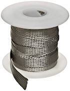
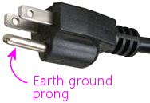

= Cabinet Grounding

All of the externally exposed metal parts in your pin cab should be "grounded", meaning that the metal parts are all electrically connected to the Earth ground wire in your AC power plug. This includes the leg bolts, side rails, front lockbar, coin door, and plunger housing.

Grounding serves several puproses:

* Safety. If a wire inside the cab carrying voltage ever comes loose, it could come into contact with one of the exposed metal parts, which would create an electric shock risk to anyone using the cab. Grounding all of the metal parts reduces shock risk by shunting any stray voltages directly to ground. It also reduces the chances of a fire or other damage from an electrical mishap, in that a short to ground should quickly trip a fuse or circuit breaker and cut off power at the source, hopefully before anything can get red-hot inside the cab.

This alone makes grounding a must, since the combination of electricity and exposed metal surfaces creates a real risk to human safety in the absence of proper grounding.

* Static electricity protection. Semiconductors are extremely sensitive to static electricity. You can destroy a computer chip or transistor just by touching it if you have a static charge on your body. The cab itself can accumulate a static charge as well, which can likewise be a threat to the chips inside the cab. Grounding the metal parts in the cab neutralizes any charge on them, and neutralizes the charge on your body when you touch them.

Grounding the metal parts is a huge convenience any time you're working inside the cab, because it lets you discharge any static on your body simply by touching the side rails or lockbar. That greatly reduces the chance that you'll zap any chips you touch.

* Radio interference shielding. Virtual cabs have computer motherboards and other electronics inside that both generate radio frequencies and can be affected by radio waves in the air. The big metal parts in a cab can act like antennas to transmit and receive this energy. Grounding the metal parts prevents that, and reduces the ability of radio waves to penetrate in or out of the cabinet. This will reduce the chances that your cab will interfere with nearby Wi-Fi networks or garage door openers or cell phones, and it'll help avoid things like picking up local radio stations on your cab speakers.

== When to install

Grounding is infrastructure work that should be done early in the build. The best time is after you've assembled the cabinet body and installed the metal trim parts, and before you've started installing the internal components (PC, TV, feedback devices). Running the grounding wire is easier while the cabinet is still mostly empty.

== Parts

The ideal type of wire to use for grounding is _flat copper braid_ . This is a bare (no insulation) wire bundle with a large number of small wires woven into a wide, flat braid.

Braided wire is great for this because it has high current capacity, and the flat form factor makes it easier to connect to metal parts by providing a large surface for contact. The high current capacity is important because the whole point is to carry the large surge current that would occur if a power supply voltage is ever shorted to ground. The ground wire has to be robust enough that it won't melt before the fuse or circuit breaker trips and cuts off the power at the source.

I'd recommend 1/4" (or larger) tinned copper braid. 20 or 25 feet should be adequate. You can find this at electronics vendors, Amazon, or eBay.

== What is Earth ground?

Earth ground is pretty much what it sounds like: an electrical connection into the soil. If your house is wired properly, there's a big metal stake driven into the ground somewhere in or around your foundation, and the stake is wired to the "third prong" in all of the AC outlets in your house. In the US, that's the round prong at the bottom of the plug. (In older houses, a buried water pipe might serve in place of a metal stake, and in older houses still, where the old two-prong outlets are installed, you might not have any Earth grounding at all.)

For the purposes of a pin cab, we rely on the house wiring to provide the connection to Earth ground, via that third prong on the AC plug.

== How to connect to the Earth ground

One end of your grounding wire needs to connect to the Earth ground in your house wiring. To get there, we can piggy-back on the AC power connection you're using for your PC power supply. That should have a three-conductor power cord, since your PC power supply needs to be grounded.

There are several ways to tap into that ground connection. The best option will depend on your setup and the type of power supply you're using, so look these over and pick the one that works best for you.

=== Option 1: ATX case

If your PC power supply has a bare metal case, the case itself can serve as the ground connection.

Any ATX power supply with a metal case will have its case connected to Earth ground, for the same safety reasons we need to ground the metal parts on the pin cab. If the case isn't painted, you should be able to get good electrical contact to ground using with the case itself.

It's a good idea to test this with a multimeter, to make sure there's not some kind of coating that insulates the case. With the PSU unplugged from power, and your meter set to resistance (Ohms) mode, measure the resistance between the ground prong on the power supply's AC wall plug (in the US, that's the round bottom prong) and random points on the exterior of the case. It should read close to zero Ohms (you might see a very small resistance on the order of 1 ohm or less). If you get consistent near-zero readings at various random points on the case, the case will make an excellent grounding connection.

To connect the ground braid to the power supply case, you can simply pin the braid under the power supply, pinching the braid between the PSU and the cabinet surface where you're installing it. As long as the PSU is attached tightly to some surface, pinning the braid under it should keep the braid in place and provide a nice solid electrical connection.

=== Option 2: ATX case screw

If your PC power supply has a painted or lacquered case that prevents the first approach, you might still be able to use the case, by connecting to one of the mounting screw holes - the screw holes intended to be used for mounting the PSU inside a PC tower or desktop case. Even if the case is painted, there's a good chance that the threaded screw holes will be conductive.

You should be able to check this visually. If the threads look metallic, this is probably a good place to connect.

If the visual check looks promising, try the multimeter test. With the PSU unplugged from power, and your meter set to measure resistance (Ohms), test the reading between the ground prong on the PSU's AC wall plug (the bottom round prong, in the US version) and the threads in the screw hole. If you see a reading close to zero Ohms, you have a good place to connect ground.

To use this method of connection, you'll need:

* About 2 feet of 14 gauge (or thicker) wire
* An unpainted metallic #6-32 x ¼" machine screw
* A "ring" terminal that fits around the screw and that fits the wire

To install:

* Cut the wire to about 2 feet
* Attach a ring terminal to each end (by crimping or soldering, according to what kind of ring terminal you're using)
* Slip one of the ring terminals over the screw, and screw it tightly into the case
* Slip the other ring terminal over a wood screw, and then screw it _through the grounding braid_ and into the cabinet wall

The last step can wait until you're ready to install the power supply in the cab. The dangling ground wire should serve as enough of a reminder, but put it on your to-do list if you think you might forget! And when you're running the grounding braid around the cabinet, make sure you bring it close enough to the area reserved for the power supply that the ground wire will be able to reach it easily.

=== Option 3: AC plug

If you can't find a way to make a connection to your ATX power supply, you can connect directly to the power line. I don't recommend this approach unless you have some electronics experience, since it requires cutting into the main AC power wiring. This approach also has the downside that it doesn't make the ground connection as permanent as the others, since it uses a removable plug. Someone down the road might decide to unplug it because they want to use the outlet for something else, without realizing how important it is to leave it in place.

In order for this approach to work, you'll need a setup that follows the basic plan we outlined in xref:powerSwitching.adoc#powerSwitching[Power Switching] . Something like this:

image::images/PowerSwitchingOverview.png[""]

Specifically, you'll need an unswitched power strip that connects directly to the wall outlet. All of the outlets on that power strip will have a connection to Earth ground through the wall outlet plug, so we can get the Earth ground connection we need inside the cab via an unused outlet on the power strip.

The idea here is simple: we need a power cord that _only_ has a connection to the ground prong in the outlet. I can suggest three ways to achieve this:

* Buy a "ground plug", such as a "Desco universal ground connection" or "StaticTek banana jack outlet plug ground adapter" (try Amazon or eBay). These are AC plugs with dummy prongs for the two power prongs, and a ground prong that connects to a banana jack or similar connector. They're designed to be used with anti-static wrist straps and mats for doing electronics work. You'll also need a banana plug that fits the jack. Attach a wire (14 gauge or thicker) to the banana plug; plug it in the jack and secure it; and connect the other end of the wire to the braid.

This approach has the advantage that you can't get the wiring wrong, since the ground plug only has a connection to the one ground prong. The downside is that the banana plug isn't permanently installed, so it could fall out, disconnecting all of the ground connections you went to all this trouble to install. If you go this route, I'd find some way to permanently secure the plug so it can't fall out, perhaps with electrician's tape or heat-shrink tubing.

* Buy a replacement power supply cord (making sure it's the 3-prong type). This has a regular AC outlet plug at one end and three insulated wires (black, white, and green) coming out the other end. The *green* wire is the one that connects to the Earth ground prong. Use wire nuts to cover the white and black wires, which you *don't* want to connect to anything, and secure with electrician's tape. Connect the green wire to the braid.
* Buy a replacement power plug (e.g., Leviton 3W102-E, GE 54301 household plug). This is similar to the above but doesn't have any wires attached - it's _just_ the plug, with screw terminals to attach wires. I like this option a little better than using a cord because you don't have to secure any stray wires. Simply connect a 14 gauge (or thicker) wire to the ground screw terminal (which is usually indicated by a green screw, or might simply be labeled "ground" or "Earth"). Leave the other two terminals unconnected. Connect the other end of the wire to the braid.

For all of these options, plug the plug into a free outlet on the unswitched power strip. Connect the ground wire from the plug to your braid with a "ring" terminal: connect the ring terminal to the wire (by crimping or soldering, for example), slip the ring over a wood screw, and drive the screw _through the braid_ into the cabinet wall or floor.

Whichever type of ground plug you choose, it would be a good idea to do something to lock the plug into the outlet it's using, so that it doesn't fall out on its own and so that you don't remove it while working on something and forget to put it back. This is the crucial link for all of the grounded metal, so it should always be connected. Wrap a couple of loops of electrician's tape around the plug and the power strip, for example. At the very least, put a big "do not unplug" placard on it.

=== Option 4: Tap into the power strip

If you're confident that you know what you're doing, there's a better alternative to the approach above: tap directly into the power strip's internal wiring. It's better in that it's not easily undone (unlike the plug-in approach above, where someone could unplug the plug, thinking it's not important). But it's dangerous unless you know exactly what you're doing, since it requires modifying the power strip.

The idea is to connect an additional wire directly to the ground wire in your main unswitched power strip.

* Open up the power strip (by removing its case)
* Identify where the ground wire from the cord connects to the internal wiring
* Connect a length of 14 gauge (or thicker) wire to this point (using whatever technique is appropriate to the way the power strip is constructed: solder the new wire to the existing wire, add it to the existing screw terminal, or whatever else works)
* Find a way to route the new wire out of the power strip's case, perhaps by drilling a hole somewhere for it
* Reassemble the case with the newly added wire routed through to the outside
* Connect a ring terminal to the other end of the wire
* Slip a wood screw through the ring terminal, and drive the screw through the braid into the cabinet wall

== How to connect cab parts to the ground braid

The basic technique is to run a single, uninterrupted braid around the perimeter of the cab, bring it into contact with each metal part that needs to be connected.

The reason it's best to use a single run of wire is that it greatly reduces the chance of severing the connection to multiple parts. Consider what might happen if you daisy chained _separate_ wire segments from one metal part to the next: suppose the Earth ground connects to A, and A connects to B, and B connects to C. If the connection between A and B gets disconnected for some reason, you lose not only the connection to B, but also the connection to C. With a single braid, in contrast, the only way that could happen is if the braid itself were to break, which is highly unlikely.

Here's a suggested routing:

Use staples to fasten the braid to the cabinet wall every few inches between connections, so that it doesn't flop around.

Remember that the ground braid is uninsulated, so you don't want to let it come into contact with exposed terminals on any powered devices. Ideally, you should avoid having any bare wire or exposed terminals (other than the ground braid) in the first place, since they're inherently dangerous. If possible, cover any exposed terminals that are present on devices you install with some kind of insulator, such as heat-shrink tubing, electrical tape, or a plastic cover.

To connect an individual metal item to the braid, all you have to do is bring the braid and the metal into contact.

* For anything that has a large surface that fastens tightly to the cabinet, a great way to accomplish this is to run the braid under that part, sandwiching the braid between the part and the cab. This provides a large contact area, ensuring a good electrical connection, and secures the braid in place mechanically. It also has the virtue of being easy to set up.
* Alternatively, if there's a place where a metallic screw is attached to the item, you can drive the screw through the braid, or pin the braid under a washer held down by the screw.

=== Legs

Simply run the ground braid under each leg bolt plate.

=== Side rails

The side rails are held on by carriage bolts at the front. Those are metallic, and they're in contact with the rails, so we can ground the rails by grounding the bolts. The bolts don't by themselves offer much surface area to make contact with the ground braid, though, so we have to add something to serve as a connector.

My approach was to use a small metal plate with two holes, one for the bolt itself, and a second for a wood screw. I ran the braid under the plate, and fastened the wood screw through the braid to ensure a solid electrical connection.

On some of the real machines, they simply pin the braid under a washer.

image::images/ground-braid-side-rail-2.png[""]

=== Plunger housing

Run the ground braid under the mounting plate, or fasten it with a wood screw through one of the free holes in the plate.

=== Lockbar

Route the braid under a portion of the lockbar receiver where it attaches to the front wall, or fasten it with a wood screw through one of the free holes in the receiver.

image::images/ground-braid-lockbar-2.png[""]

=== Coin door

You can ground the coin door through the carriage bolts that attach it. (It'll also be grounded indirectly through the lockbar receiver, assuming you've grounded that, since the top coin door bolt also is in contact with the receiver.) Run the ground braid alongside one or two of the carriage bolts on either side of the door, and pin it under a washer.

== Backbox

There's not any metal trim in the standard backbox setup, so you might not need to extend the ground wire there. However, the real machines do, because they have some hidden metal pieces that benefit from grounding. In particular, they place a metal grating over the vent holes along the top of the back side of the backbox, primarily to serve as radio frequency shielding. That needs to be grounded to be effective as shielding. They also run the ground braid under the metal backing plates that mate with the carriage bolts that fasten the hinge arms, as safety grounding for the exposed carriage bolt heads. (I guess there actually _is_ some metal trim on the backbox, if you count those bolts.)

If you do want to run a ground wire to the backbox, I'd use a separate braid loop in the backbox, and connect it to the braid in the main cabinet via a run of regular hookup wire (14 gauge or thicker). The reason to use hookup wire to bridge the sections is that this portion will need to be long enough to cover the added distance when the backbox is folded down.

== Testing

Before declaring the grounding project complete, test that you have a good connection between the metal parts and the ground plug on your main power inlet.

Set your multimeter to resistance (Ohms). With the power unplugged from the cab, measure the resistance between the ground prong on your main AC power plug for the cab and each of the exposed metal parts. It should read close to zero Ohms in each case.

