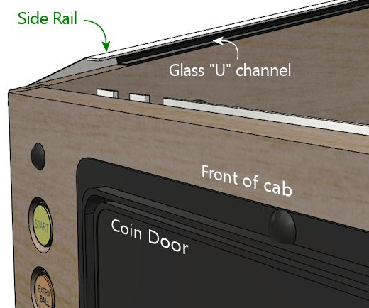
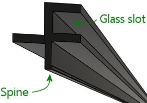
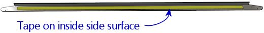
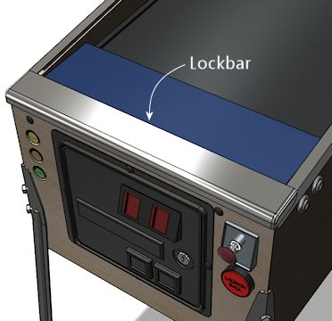
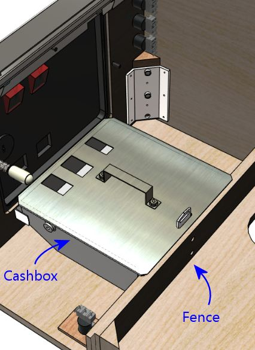

= Cabinet Hardware Installation

This section covers the hardware trim on the main cabinet, with details on what all the hardware does and how to install it.

We assume that you've already built the basic plywood cabinet as described in xref:cabBody.adoc[Cabinet Body] , and that you've already painted it and/or applied decals, as described in xref:cabArt.adoc[Cabinet Art] . It's best to finish the artwork before installing any hardware, since some the hardware will get in the way of painting or applying decals once installed.

The sections below are arranged in our recommended order of installation. The order matters in some cases because of dependencies among parts. For example, you should install the side rails before installing the lockbar, since the lockbar's final alignment depends on the side rails being there, and you have to install the glass channels before the side rails because the channels act as spacers and supports for the rails. We've tried to present things in the easiest overall order, to get alignments right the first time and to minimize backtracking.

== What to buy

We'll describe the parts needed at each stage as we go, but the full list of hardware parts can be found in xref:cabParts.adoc[Cabinet Parts List] .

== Leg brackets

You should attach the leg brackets early in the cabinet build, during the basic wood assembly. The brackets are meant to be permanently installed; they can be left in place with the legs on or off the machine.

If you followed our plans in xref:cabBody.adoc[Cabinet Body] , you should have already installed the leg bolt brackets on the inside of the cabinet. If you haven't done this already, see the section on xref:cabBody.adoc#installLegBoltBrackets[Leg brackets] in that chapter.

You probably won't want to attach the legs themselves early on, since you'll probably want the cab sitting on the floor or workbench while you install the PC, TVs, and other internal components.

Note that we won't get to the legs themselves until xref:#installLegs[near the end of this chapter] , as you'll probably want to keep the cab on the floor or on your workbench while you're installing the PC, TVs, and other internal components.

[#glassChannels]
== Glass channels

These are plastic pieces that go under the side rails, to hold the top glass cover in place.

The glass channels aren't visible, so they're not "trim" in the cosmetic sense, but they have two important functional roles. The first is that they let you slide the top glass in and out of the machine at any time, without tools. To remove the glass, you just unlatch and remove the lockbar, then slide the glass out the front. To put the glass back, slide it in the front, and pop the lockbar into place.

image::images/glass-sliding.png[""]

The second important functional role of the glass channels is to act as vertical spacers and supports for the metal side rails. All of the side rails made since the 1970s or so are designed to be paired with the glass channels. The geometry of the rails simply takes it for granted that the plastic channels will be there - if they're not, there will be a big gap under the rails, which would make them too weak.

To install the glass channels, the first step is to route a groove along the center top of the side wall. (If you followed our construction plans in xref:cabBody.adoc[Cabinet Body] , you should already have done this.) There's a special router bit for this job, called a slot cutting bit. For this particular slot, you need a slot cutter bit with a 3/32" slot width and a depth of ⅜" or greater. I used Freude part number 63-106; equivalent bits are available from other brands.

image::images/glass-channel-slot.png[""]

=== Alternative to routing the slot

Some virtual cab builders forego routing the slot, because it seems too difficult, or just because they don't want to buy a special tool that they'll only ever use once. But they still want to install the channels. How do you make the spine fit without the slot? You can't, but you _can_ chop off the spine to take it out of the picture. The glass channels are a fairly strong plastic, but they are just plastic, so it's possible to remove the spine with a sharp utility knife, a Dremel tool, or something similar. With the spine removed, you can install the channel with staples or glue. You don't have to go overboard with a super-strong attachment, since the metal rail will sit directly on top of the channel, and that by itself will largely keep it from going anyway.

Personally, I don't recommend this approach. I'd install it the "right" way with the slot, since it makes a tidier installation and doesn't risk damaging the plastic piece. Cutting the slot probably seems intimidating if you haven't done that sort of thing before, but the special bit makes it really easy.

=== Installing the channel

Once the slot is routed, install the plastic channel simply by pressing the "spine" that runs along the bottom of the channel into the plywood slot. *Don't* use any glue or fasteners; the spine will be held in place by friction, and if that's not enough, the side rail on top of it will prevent it from going anywhere.

You should expect the spine to be a tight fit in the slot. You'll need to press it in fairly firmly. Don't force it too aggressively, though - you don't want to split the plywood. If the channel is way too tight, you can always go over the channel with the router bit again to widen it out slightly.

image::images/glass-channel-insertion.png[""]

=== Alternatives to the glass channels

What if you don't want to include the glass channels? Not all virtual pin cab builders do, either because they're not using the cover glass at all, or because they want to install it some other way.

My own recommendation is to use cover glass and use the standard glass channels. That'll look the most authentic and it'll be easier to set up than something improvised. But if you're intent on another approach, you'll still need _something_ to serve as spacers under the rails.

If all you need is to fill the space, and you don't care about sliding the glass in and out, you can use any material of the right size. Something like foam tape or rubber weather-stripping material would work. The target size for the spacer is about 7/16" thick, 5/8" wide, and 42" long. Affix your chosen spacer material with glue or double-sided foam tape, starting about 3" from the front of the cab.

Be sure to take the thickness of the adhesive into account when sizing the spacer - the *total* overall thickness (height) of the spacing material should be about 7/16", *including* any adhesive layer. If you're using foam tape that's ¼" thick, for example, the spacer material would only need to be about 3/16" thick.

Improvised spacer material under the side rail. *Only* use this if you're *not* using the normal glass channels! The point is to substitute something that provides the same vertical spacing and support as the glass channels if you're *not* using the actual glass channels.

If you're using cover glass and want to be able to slide it in and out, I don't think there's any reason to look for alternatives to the standard plastic channels. They're the exact right thing for the job.

== Side rails

These are trim pieces that go along the top side edges of the cabinet. On all modern machines, they're made of sheet metal, usually with a stainless steel finish.

(In the very early days of pinball, the side edges were trimmed with wood molding instead of metal, which is the source of the term "wood rail pinballs" that's often used to refer to such machines. If you want to use something like that, it would require custom wood-working; there's no such thing as a "standard" wood side rail, and nothing of the sort that you can buy off-the-shelf, as they haven't made commercial wood-rail machines in many decades.)

WPC-style side rail. Note that the rail is narrow enough along the side wall that it doesn't reach the flipper buttons. Older side rails (from the 1980s and before) extend further down the side and typically *do* cover the flipper buttons, requiring holes in the rails for the flipper buttons.

The WPC-style rails

The design of the side rails varies by manufacturer and vintage. The illustration above shows the WPC style from the 1990s, which continues to be the standard for everything made since. It's the type I'd recommend if you're buying new parts from a pinball supply vendor. It's the easiest type to find, too, since it's the only type anyone has been using in new machines for the last 30 years or so.

If you're using side rails salvaged from an older (1980s or earlier) machine, they might look different. The big difference with the older designs is that they're usually much wider, extending down the sides far enough to cover the flipper buttons. Because they overlap the flipper buttons, the older rails usually have pre-drilled holes for the buttons - so you have to be careful to drill the cabinet button holes so that they line up with your rails. The WPC rails don't have any such alignment requirement because they don't overlap the flipper buttons. The only alignment you have to worry about for them is making sure that the buttons are entirely below the rails.

The WPC-style rails are symmetrical. They don't have "left" and "right" versions because the same rail can be used on either side. Simply flip the rail over to switch sides. The older rails with pre-drilled flipper button holes can't do that trick, so they come in left/right sets.

=== Fasteners

Three fasteners are required for each side rail:

* At the front, an #8-32 x 1-1/4" carriage bolt, #8-32 ESN lock nut, and #8 washer
* Along the sides, double-sided foam tape, about 3/4" wide by .03" thick
* At the back, a spiral nail (Williams part numbers FA-701, 20-6505-L, or 20-6505-K), or a plain nail or wood screw (see notes below)

*Foam tape:* Side rails sometimes come with foam tape already installed. If yours didn't, you can buy the tape separately from a pinball vendor (search for "side rail tape"), or use a generic double-sided foam tape. You need tape that's about ¾" wide and about .03" (0.75mm) thick. (The original Williams specs called for .032" thickness, but you don't have to match that perfectly.) Each rail takes 40" of tape, for 80" total.

*Rear fasteners:* The original machines used spiral nails to fasten the rails at the back. Spiral nails have flat, smooth heads like nails, and spiral ridges like screws. You pound them in with a hammer like regular nails. The spiral ridges give them a lot more grip than regular nails, to prevent loosening from vibration.

Spiral nails, 0.1" diameter x 1" length, Williams/Bally part 20-6505-L. These are traditionally used to fasten the side rails at the back.

I actually don't much like the spiral nails, because they're quite difficult to remove, which causes a lot of grief to collectors restoring old machines. You might wonder (I sure did) why you can't use the same carriage bolts as at the front. The answer is that the shelf gets in the way on the inside - you can't access the fastener from the inside to attach a nut. So you need a fastener that screws in or pounds in purely from the outside, without the need to attach anything on the inside. Spiral nails fit the bill, but so would a plain nail or wood screw. The next question, then, is why not just use regular wood screws? You could simply unscrew them if you ever wanted to remove them. Part of the rationale at the factory might be tamper resistance, which you probably don't care about for home use, but the other reason is that whatever fastener you use has to fit into the tiny gap between the side rails and the backbox hinge arms. Most nails (including the spiral nails) meet this need. Most regular screws don't; the heads are too thick. You need something that's 1mm or less. For reference, the spiral nail heads are about 0.8mm thick.

Here are the thinnest options I've found in a wood screw:

* "Pancake-head" roofing screws, such as Bolt Depot part number 27072 (#10 x 1" combination Phillips/square drive, pancake-head, type 17, zinc-plated steel)
* Grabber BP32Z screws (#8 x 1" Phillips drive, modified truss head, fine thread)

The heads on both of those are quite thin as screws go, but they're still too thick for our purposes. The heads on the Bolt Depot roofing screws are about 1.6mm thick, and the Grabbers are about 2mm thick. That's thicker than our maximum of 1mm. One solution is to modify these screws, by using a metal file or grinding wheel to shave some material off the tops until they're down to 1mm.

image::images/truss-head-screw-filed-side-view.jpg[""]

Grabber BP32Z screws, original condition on left, and with the head filed flatter on the right. The original head is about 2mm thick; I was able to get this one down to about 1.2mm, which was thin enough to fit under my backbox hinges.

Top view of the BP32Z screws, original on left, filed down on right. I filed it until there was no evidence of the domed part in the center, leaving the head almost as flat as a nail head. There's still enough of the Phillips indents to work with.

Alternatively, you might be able to make a flat-head wood screw work, if you can countersink the conical part of the head far enough to make the top more or less flush with the rail.

You could also use a plain old nail, if you don't care about eventual removal and you don't want the bother of finding the unusual spiral nails. A regular nail might work itself loose over time more easily than a screw or a spiral nail, but that's probably not a huge concern for a home-use-only machine.

If you find another option that works, please let me know and I'll mention it here.

=== Install the glass guides first

Before installing the side rails, install the plastic channels that hold the top glass (see xref:#glassChannels[Glass channels] above). If you're not planning to use the standard plastic channels, you should install some kind of spacers of roughly the same size. Part of the function of the channels is to act as vertical supports for side rails, so you need something to fill that space if you're not using the plastic guide channels.

=== Installing the side rails

Start by sticking a strip of the double-sided tape to the inside of each rail. The tape should cover most of the length of the "L" shaped part of each rail, out to about an inch from each end. Don't put any tape on the tapered end sections.

The tape goes along the inside side surface - the surface that will face the side wall of the cabinet. Only peel off the backing on the side facing the metal rail at this point. Leave the backing in place on the other side.

Next, do a "dry fit" to the cabinet, placing the rail in position, resting it on top of the glass channel. The front of the rail should be *almost* flush with the front wall of the cab. Leave just enough of a margin (1/16" to 1/8") that it doesn't stick out at all, so that it won't snag anyone's clothing.

We're going to assume that you haven't drilled the holes for the side rail carriage bolts yet. This is the time to do that. Mark the cabinet positions where the front holes in the rails line up. Only drill for a carriage bolt at the front; at the back, you'll have to use a screw or nail, because a bolt would conflict with the shelf. Remove the rails and drill at the marked positions (straight through) with a 11/64" drill bit.

WARNING: if you installed decals that cover this area, you might want to use an X-acto knife to cut an opening in the decal before drilling, so that the drill bit doesn't catch on or pull at the decal while you're drilling. This area will be covered by the side rail once that's installed, so the decal cut-out won't be visible.

You're now ready for final installation. There are two ways to proceed from here: you can stick the rail to the cabinet with the foam tape, or you can leave the tape un-sticky for now and only use the front bolt. The first way - using the tape - is the way it's meant to be done for permanent installation. The second way - without sticking the tape yet - is better if you're not ready to commit to the final setup yet (for example, if you might want to touch up the artwork later). The bolt will hold the rail in place well enough for testing and casual play, so there's no hurry to finalize the tape yet.

In either case, start by setting the rail in place again and lining it up with the carriage bolt hole you just drilled. Insert the bolt from the outside, and attach the nut on the inside. If you *don't* want to finalize on the tape yet, just tighten the nut, secure the back of the rail (with a spiral nail, plain nail, or wood screw, as mentioned earlier), and call it done for now.

If you want to finalize the installation by attaching the double-sided tape, here's the recommended procedure:

* Start with the side rail bolted on as described above.
* Run a length of wide painter's tape along the bottom edge of the rail, down its whole length, centered on the bottom edge. In other words, half of the width of the tape should be sticking to the side rail itself, and the other half should be sticking to the adjoining side of the cabinet.

* Remove the bolt.
* Leaving the painter's tape in place, fold the side rail down, using the painter's tape as a "hinge". The rail should now be hanging upside down from the painter's tape, with its inside face (and the double-sticky tape) exposed.

* Remove the adhesive backing from the double-sticky tape.

* Carefully fold the side rail back up and into position, using the painter's tape as a hinge again. This should precisely return it to the original position.

* Press along the side to adhere the double-sticky tape to the cab wall.
* Re-fasten the carriage bolt.
* Install the fastener at the back (spiral nail, plain nail, or wood screw, as mentioned earlier)
* Remove the painter's tape.

[#rearGlassTrim]
== Rear glass trim

Assuming you're going through this section in order, you've already installed the glass channels that go under the side rails. If not, you should go back and do that before proceeding.

After the side glass channels are installed, there's one more part to install for the top glass, which a piece of plastic trim at the back of the machine. This provides a slot for the rear edge of the glass to fit into.

This piece of trim attaches to the "shelf" at the back of the cabinet with a few screws, so it's pretty simple at that level (no wacky new router bits required!). But I found it a bit tricky to get the alignment right when I installed it on my machine.

image::images/rear-glass-trim-3.png[""]

The thing that makes it tricky to install is that the opening in the trim for the glass is just about the same thickness as the glass, so there's not much room for error in aligning it. If the trim isn't aligned perfectly with the glass, the glass will snag on the edges of the trim when you try to slide the glass into place.

The procedure I used was to try to position the trim using the glass itself as a guide. Like I said, I found this a bit difficult in the execution, but I don't have any better ideas.

* Slide the glass into the side channels, almost all the way to the back
* Fit the trim onto the back of the glass, orienting it as shown below

* Slide the glass all the way back, pushing the trim flush against the back shelf

* Mark the position of the trim on the rear wall
* Remove the glass

At this point, the obvious thing to do is to put the trim back at the marked position and screw it into the shelf with some wood screws. That's indeed how I proceeded. The problem I had is that the position we marked above had the glass already in place, and the glass tends to apply a little pressure on the bottom lip that tilts it down slightly. If you install it at exactly this position, the bottom lip of the trim will spring back up without the glass there, so when you try to insert the glass, it'll get hung up there.

I ended up just iterating this a few times with test installs before I found the magic spot. Before you commit to a position, try testing the proposed location with something to hold it in place temporarily, such as masking tape, or a trusty assistant. Slide the glass in and out at the test position. Adjust until you find the spot where the glass will slide in smoothly.

Once you find the right spot, fasten the trim to the rear wall with wood screws. #6 x ¾" should work.

For what it's worth, the install positions on the real machines I've looked at vary from the top of the trim being flush with the top of the shelf, to being as much as ¼" above the shelf. So maybe there's not a mathematically predictable position, as it seems that even the pros resorted to ad hoc alignment. I think this was especially hard on my virtual cab build because my shelf was cut square at the front edge - I didn't use the 10° bevel angle that's recommended in the xref:cabBody.adoc#rearShelf[cabinet body plans] . With the square front edge, my plastic trim piece wasn't aligned properly with the slope of the glass cover. You'll probably have an easier time with this than I did if you used the bevel angle.

== Lockbar and receiver

The "lockbar" is the metal trim piece at the front top of the cabinet, so named because it serves to lock the glass cover in place. You'll also see it called a "lockdown bar" and a "lock bar" and various other variations on the "locking" theme. The vendors use all of these terms, inconsistently, so you might want to try them all if you're searching to buy one online.

The "official" name that appears in the Williams parts books is "front molding assembly", so that's another search term to try when shopping.

The lockbar (the name we'll settle on here) serves three main purposes. The first is the locking function that's right in the name. The bar serves to lock the top glass in place, by preventing the glass from sliding out the front. If you want to remove the glass, you first have to remove the lockbar. The lockbar itself is secured by some latches inside the machine, which can be engaged and released via a lever you can reach by opening the coin door. So you can't take off the glass without removing the lockbar, which you can't do without opening the coin door, which you can't do without the keys.

image::images/glass-sliding.png[""]

The second function of the lockbar is cosmetic. It serves as decorative trim along the top front edge, as suggested by the official Williams name for the part, "front molding assembly".

The third function is to provide a comfortable place to rest your hands while playing. The natural hand position while playing is to grip the front corners of the machine with your fingers on the flipper buttons. The lockbar has nice rounded corners right where your palms go. This hand-rest function becomes apparent the first time you try playing a round of pinball on a machine without the lockbar installed - the bare plywood corners can be awfully sharp.

If you're not planning to use a genuine pinball lockbar, you should come up with a substitute that at least provides a comfortable hand-rest, and, if you're using a glass cover, that prevents the glass from sliding out.

In the standard setup, the lockbar mates with another part, usually called the _lockbar receiver_ . (The official part name that appears in the Williams manuals is "lever guide assembly".) The receiver attaches to the inside of the machine, at the top of the front wall, and isn't visible to players.

The receiver is installed at the top of the front wall, on the interior side:

image::images/lockbar-into-receiver.png[""]

[#FireButtonWithStandardLockbar]
[#lockbarFireButton]
=== Fire button

Many of the 2000s Stern machines feature a button on the top of the lockbar, usually labeled "Fire" or something similar. The button typically activates special features in the game, so it's another interactive game control on par with the flipper buttons and plunger.

You don't have to install a physical Fire button on your virtual cab to play the Stern games that feature a Fire button, since the Visual Pinball re-creations always provide a substitute control that you can use instead, usually the MagnaSave buttons (see xref:magnaSaveButtons.adoc[Tables with MagnaSave Buttons] .) But some people like to install a dedicated lockbar Fire button anyway, since it replicates the playing experiences more faithfully for tables that featured the button in the original arcade version. If you're a big fan of the more recent Stern titles, it might be worth including a physical Fire button on your lockbar.

The simplest and surest way to install a Fire button is to buy a Fire-button-ready lockbar and receiver made for the Stern machines. Those parts are specifically designed to accept the button, so installation is straightforward. You can also adapt regular lockbar parts to use a Fire button, but it's more work - we'll explain how below.

*Option 1: Use Stern parts designed to include the Fire button.* This is the simplest approach, since you don't have to modify any of the parts.

* To find a lockbar that can accommodate the button, the search term that seems to work best is "premium lockbar", because Stern typically only includes the extra button as an added feature on the upgraded versions of their games ("premium" or "limited edition"). One example: lockbar for _Star Trek_ Premium, Stern part 500-7283-22.
* The receiver that's compatible with a center button is Stern part 500-7237-00
* The button itself is an extra-long (1-3/8") clear flipper button, Stern part 515-7791-00
* Button collar (mounted on top of lockbar), Stern 545-7292-10
* Mounting plate (mounted under lockbar), Stern 545-7291-00
* Palnut (secures button to lockbar), Stern 240-5003-01, Williams/Bally 02-3000
* #8-32 Keps nuts, quantity 2 (secures mounting plate), Stern 240-5104-00

As far as I can tell, there's no such thing as a "generic" lockbar-with-button. They're all made for specific games ( _Star Trek_ , _Lord of the Rings_ , _Game of Thrones_ , _AC/DC_ , etc), and all of the ones I can find come with powder-coat finishes (not the standard chrome) and special game-specific badges. The game-specific badge in particular would be a big negative for me, in that it would clash with my custom theming, but it's actually a separate part that you could remove and replace with something custom. You'd also almost be forced to use the matching powder-coat finish on the legs and side rails. That might be something you want anyway, as it can look snazzy, but it would increase the cost for those parts. And finally, keep in mind that these lockbars are only available in the standard-body cab width, so these wouldn't be an option if you're building a widebody or custom size.

Feedback request: I'd sure like to know if there are any *generic* lockbar-with-button options ( _with_ the button hole, in the standard _chrome finish_ , and _without_ any game-specific badging). Please pass along a pointer if you know of such a product available commercially. Also, if you've personally modified a _regular_ lockbar and receiver combo to include a Fire button, I'd like to hear about how you did that and how well it turned out. I'd be thrilled to have detailed conversion plans to add to this section. The options above seem regrettably limiting.

*Option 2: Add a Fire button to a regular lockbar.* It's possible to install a Fire button in a standard Williams lockbar and receiver, but you have to modify some of the parts and do some custom assembly work.

Parts:

* Transparent flipper button, 1-1/8" length, part A-16883-13
* Pushbutton mounting spacer, part 545-7292-10
* Pal nut, Part 240-5003-01
* Use my custom board:
** Grab these plans and fabricate them at link:https://oshpark.com/[OSH Park] : link:http://mjrnet.org/pinscape/downloads/Lockbar-Fire-Button-LED-plus-switch.zip[mjrnet.org/pinscape/downloads/Lockbar-Fire-Button-LED-plus-switch.zip]
** Switch: DTS-62K-V
** LEDs: Kingwin WP154A4SEJ3VBDZGC/CA, quantity 2 (or any other 5mm common-anode RGB LED)
** 100 Ohm resistors, 2mm x 7mm size, qty 2 ("R" resistors)
** 47 Ohm resistors, 2mm x 7mm size, qty 4 ("B" and "G" resistor)
** Molex 22-05-3071 connector
** Generic 0.1" crimp-pin wire housing, 7 pin positions
*  *Or* use a generic membrane switch (search Amazon or eBay for *single key membrane switch* ) and any LED that you can fit into the space

Step 1: Drill a hole in the center of your lockbar the same diameter as the *stem* of the flipper button (typically 5/8", but measure yours to be sure). I haven't tried this myself, but the advice I've heard is to use a stepped drill bit. Drilling metal usually works better with the drill at low speeds, and a drill press is better than a hand drill.

Step 2: Place the spacer on the button, insert the button in the lockbar hole you just drilled, and secure on the back with the Pal nut.

Step 3: Connect the LED and switch.

If you're using a membrane switch and a separate LED, you'll have to improvise mountings for them. You should attach everything to the receiver, not the lockbar, so that you can easily remove the lockbar. Make sure that all of the wiring connections are insulated so that nothing shorts if it comes into contact with the metal parts in the receiver or lockbar.

If you're using my circuit board, solder the parts, then attach it to the receiver (not the lockbar) directly behind the button. It should just fit into the space between the lockbar and receiver, so I think you can get away with a simple approach like taping it to the receiver with something strong, perhaps electrical tape or duct tape. Make sure there's a layer of insulation between the board and the metal receiver parts, to prevent shorts. Electrical tape will work for this, but something like "fish paper" would be better.

Build the wire housing and wire it to the control boards. The terminals marked *SW* connect to the switch, so connect these to your key encoder (connect one to the key encoder "Common" or "Ground" terminal, and connect the other to the switch input you've assigned as the Fire button). Connect the pin marked *+* to a +5V power supply. Connect the pins marked *R* , *G* , and *B* to your DOF output device controller ports for the Red, Green, and Blue segments of the Fire button light.

=== Installing the lockbar receiver

Before you install the lockbar receiver, install the side rails, as described earlier in this section. The lockbar should fit snugly on top of the side rails, so the rails have to be in position before you can fine-tune the lockbar positioning.

Start by fitting the lockbar into the receiver (with nothing installed in the cab yet).

image::images/install-lockbar-1.png[""]

Put the lockbar/receiver assembly into position. On the inside of the cab, the vertical part of the receiver should be flush with the front wall. On the outside, the lockbar should be resting on the side rails, slightly overlapping their front edges so that there's no gap. The front of the lockbar should overhang the front wall of the cab slightly (by about 1/8" to 3/16").

If you haven't already drilled the holes in the front wall for the receiver's three carriage bolts, mark the center positions of the bolt holes in the receiver on the inside wall. The positions of the bolt holes are illustrated below. After marking the locations of the holes, remove the lockbar/receiver assembly and drill them at 5/16" diameter. Put the assembly back in place.

The receiver attaches with three ¼-20 x 1¼" carriage bolts and ¼-20 lock nuts. These are available in silver or black finishes. Most of the real machines use black bolts to make them less conspicuous. I've only been able to find them in black from the pinball supply vendors (Pinball Life, Marco Specialties) - they're not just painted black, but actually have a black oxide finish.

Insert the carriage bolts from the outside of the cabinet:

Attach lock nuts on the inside. You might need to pull the lever on the receiver to access one or more of them, since parts of the mechanism can slide in front of the bolt holes. If it's too hard to fit the nuts onto the bolts with the lockbar in place, remove the lockbar for that step. I'd put it back in place before final tightening, though, to make sure things stay properly aligned. The receiver provides a little bit of play in the bolt holes to let you fine-tune the position, and the best way to do that is to use the lockbar itself as the guide.

Note that the center bolt is shared with the coin door, so you should leave that out for now if you're going to install a coin door next. I'd still insert the center bolt during the fitting process to make sure the holes are all properly aligned, but don't actually fasten it yet.

Check final alignment by removing the lockbar and then putting it back in place. You should be able to smoothly remove it and re-attach it, and it should still be sitting at the desired position when latched in place again. If it's too tight or too loose, you can loosen the bolts again and tweak the receiver positioning to improve the fit. The receiver has oversized bolt holes to give you a little play to get the position right.

You can also adjust the locking tension slightly via the two brass adjustment screws on the top of the receiver, as illustrated below. Tighten the screws (turn them clockwise) to push down on the latches and increase the tension when the lockbar is installed.

=== DIY alternatives to real pinball lockbars

Some pin cab builders don't use real lockbars because of the cost, or because they're building an unusual cab design where the standard lockbar doesn't fit the style or the available space.

If size (not price) is the only factor, note that you can buy lockbars in custom widths (made to your specifications) from link:https://virtuapin.net/[VirtuaPin] .

Fashioning your own metal lockbar seems like a challenging job for a DIYer, short of having access to a well-equipped metal shop. I'm afraid I don't have any workable suggestions here; it's not the sort of thing you can make on a 3D printer, which is the magic answer to almost everything else these days. The closest starting point might be an "L" bar, which you can buy from hardware stores in various metals and thicknesses - but I'm not sure how you'd mold that to the more complex shape of a standard lockbar with its rounded corners at each side.

If you're going for a furniture look with wood trim all around, it's possible to craft a wood version using fairly ordinary wood-working tools. Here are some vpforums threads that might be helpful:

*  link:https://www.vpforums.org/index.php?showtopic=40245.html[Wooden custom lockdown bar]
*  link:https://www.vpforums.org/index.php?showtopic=39523.html[Alternative for a custom lockdown bar]

Another possibility is to use a 3D printer to fabricate a plastic lockbar. Here's a vpforum thread about that, with advice about materials and finishes to make it look like a metal lockbar:

*  link:https://www.vpforums.org/index.php?showtopic=42759.html[Alternative for a custom lockdown bar]

=== DIY alternatives to a real lockbar receiver

To save a little money, some virtual cab builders omit the receiver, even while using a real lockbar. The receiver is a purely internal part, so it doesn't serve any cosmetic function, and some pin cab builders find the price (currently about $80) unreasonable for a part with such a simple job. The main thing that makes a standard receiver so expensive is that it has to be rather heavy-duty to fulfill its role as a security lock. For a home machine, you might not be concerned about teenagers trying to pry the thing apart to steal quarters.

One simple solution might be to use Velcro. You'd have to attach some filler material to the bottom of the lockbar to fill the space between the lockbar and the top of the front wall. Once the two areas are in contact, you can simply glue a bunch of Velcro to each side. This would hold the lockbar reasonably well, although obviously not in a truly "locking" way, and it would probably feel a bit wobbly compared with the real ones.

A more elaborate home-made alternative is described here:

link:https://www.vpforums.org/index.php?showtopic=38841&p=390452.html[Question about lockdown bars and receivers for mini cabinet (message #5)]

Briefly, the idea is to place a pair of toggle latches on the inside front wall of the cabinet, positioned to align with the hooked prongs that stick out of the bottom of the lockbar. To fasten, you reach in through the coin door, hook the latches to the prongs, and engage the latches. To release, you again reach in through the coin door and disengage the latches. The downside is that it would require a fair bit of dexterity to reach the latches through the coin door, since they need to be positioned around the corner on each side. In contrast, the standard receiver can be engaged and disengaged with a lever that's positioned within easy reach.

Note that some of the newer Stern machines actually use lockbars with a similar toggle-latch design. Compatible Stern lockbars are equipped with under-carriage latch-hook parts that are specifically designed to be used this way, so you might find it easier to use this approach with a compatible Stern lockbar than with a lockbar designed to fit the standard Williams/Bally receiver. Refer to these parts:

* Stern lockbar, dual luggage latch, 5500-6882-03-00
* Luggage latch, 355-5038-00

[#cashbox]
== Cashbox

If you're planning to drop coins into the coin slots, you'll need something to catch the coins on the other side. You don't want them rolling around loose where they could randomly short out wiring or get wedged in something mechanical.

The real machines' solution is the "cashbox". It's a low-profile plastic box with a metal lid, with slots in the lid that line up with the coin chutes. It sits just inside the coin door. When a coin goes through one of the chutes, it drops straight into the cash box. The cash box is sized to fit through the coin door, so the operator can easily collect the machine's income when making rounds.

The cashbox has essentially just one design these days, which looks like the illustration above. Older machines used a variety of shapes and sizes, but nearly all pinballs made since the 1990s use the same design that Williams used in the WPC machines. Since it's so close to a standard, it's the one you can buy from pinball vendors. Most of them sell it in two separate pieces: a plastic tray, and a metal lid. They don't separate them just to make your life difficult; it's for modularity, so that the same tray works with lids with different slot patterns for different coin door layouts. The three-slot lid illustrated above is for the typical US coin door configuration. If you have a non-US coin door, you should be able to find a matching cashbox lid at a European pinball parts vendor.

=== Installation

The cashbox itself doesn't require installation per se; you just pop it into the space at the front of the machine. But you do have to install two brackets to hold it in place, plus a little "fence" or divider wall, called out in the illustration above.

The first bracket goes at the front of the cab, directly under the coin door. This is the "cashbox nest bracket", Williams part 01-6389-01. It prevents the box from sliding back and forth.

The nest bracket has three screw holes. The center one is meant to align with the bottom bolt in the coin door, so that you share the same bolt between the coin door and this bracket. If you haven't already installed the coin door, slip a carriage bolt (¼-20 x 1¼") through the hole from the front of the cab for alignment. (If you've already installed the coin door, just remove the nut from the bottom bolt.) Slip the nest bracket's center hole over the bolt to position the bracket. Make sure it's level, then fasten the two outside holes to the cab's front wall with wood screws (#6 x ¾" should work).

If you've already installed the coin door, reattach the nut on the center bolt. Otherwise just leave that off (and take the bolt back out) for now; you'll install it when you get to the coin door.

The second bracket is the "cashbox lock bracket" (Williams part 01-10030 or 1A-3493-1), which attaches to the fence called out in the earlier illustration. If you followed our plans from xref:cabBody.adoc[Cabinet Body] , you've already installed that. If not, you should go back now and follow the plans in that chapter under "Cashbox fence".

Once both brackets are in place, installing the cashbox is a simple matter of dropping it into the space delineated by the fence, fitting the slot at the back of the cashbox lid over the lock bracket. To remove the cashbox, lift the back edge high enough to clear the lock bracket, and pull the cashbox out. This is all meant to be done through the coin door, since the cashbox is sized to fit through the door.

(If you look more closely at the lock bracket, you'll see that it has a little slot at the top. That's for attaching a padlock, to add an extra layer of security to protect the booty even if someone gets past the coin door. Probably not something you'll need in a home machine.)

=== DIY cashbox

Apart from cost, the main reason you might want to consider designing your own home-made cashbox substitute is that the real ones are rather large. The standard cashbox is great at its job, but it takes up a whole foot of floor space at the front of the cab, which impinges on space you might want to use for PC parts or feedback devices.

Improvising a home-made cashbox isn't too challenging, since it's just a box with a couple of holes in the lid. You could easily fashion one out of plywood or acrylic. I created one using a plastic food container; I found one with about the right depth, and used an X-acto knife to cut slots in the lid that line up with the coin chutes. I use a bungee cord (connected to a couple of eyelets screwed into the floor) to hold it in place. It's certainly not as elegant as the real cashbox (particularly the bungees pinning it down), but it only takes up about 5" of floor space.

== Coin door

The coin door is a complex enough subsystem that we've devoted a whole chapter to it ( xref:coinDoor.adoc[Coin Door] ). But we'll go over the basic installation process here.

If you're using a standard lockbar-and-receiver combination, it's easier to install the receiver before installing the coin door. Follow the procedure above. The receiver shares its center attachment bolt with the coin door, so you'll need to remove the center bolt in the receiver if it's currently in place.

The standard coin door assembly comes with the door itself and the frame already assembled, so there's not much to installing it. Start with the door closed and locked. Fit it into through the coin door opening in the front wall.

Holding the door in place, insert carriage bolts (¼-20 x 1¼") through the four holes around the perimeter of the door frame. Fasten them on the inside with ¼-20 lock nuts.

The top bolt in the coin door is shared with the lockbar receiver, if you're using one. Thread the bolt through the matching hole in the receiver mechanism, and attach the lock nut on the interior side of the receiver, so that it secures the receiver as well as the coin door.

If you're installing the full set of cashbox hardware, the bottom bolt in the coin door frame will be shared with the cashbox "nest bracket". Thread the bolt through the matching hole in the nest bracket and attach the lock nut on the interior side of the bracket.

=== Coin mechs

If you bought a brand new coin door, it probably didn't come with coin "mechs" (mechanisms), the gadgets that sit behind the coin slots to validate inserted coins. You can buy those separately. The mechanical quarter acceptor used in typical US coin doors is an inexpensive add-on (about $10 each). I think it's worth including these in a virtual cab, for the added realism of being able to use real coins. The installation procedure is detailed under "Coin mechs" in xref:coinDoor.adoc#coinMechs[Coin Door] .

=== Custom coin slot inserts

On most types of coin doors, it's possible to replace the illuminated "25¢" signs (known as "inserts") on the coin slots, to show different coin denominations, or better yet, your own custom graphics. See "Custom coin slot inserts" in xref:coinDoor.adoc#customCoinSlotInserts[Coin Door] .

=== Coin door position switch

On real pinball machines, there's a switch inside the cabinet that detects whether the door is open or closed, just like the light switch in a refrigerator door. It's useful to include this switch in a virtual cab, because many ROM-based tables won't let you access the setup menus unless they get a signal from the switch indicating that the door is open.

Full instructions on setting up the door switch (as well as connecting it to the virtual pinball software) can be found in xref:coinDoor.adoc#coinDoorPositionSwitch[Coin Door] , under the section "Coin door position switch".

[#plunger]
== Plunger

If you bought a full plunger assembly, it probably came assembled. If not, or if you bought the separate components, assemble as shown below.

image::images/PlungerAssemblyDiagram.png[""]

* Slip the barrel spring over the shooter rod and push to the knob end
* Slip the washer over the shooter rod and push down to the barrel spring
* Insert the nylon sleeve into the shooter rod opening in the housing (from the inside of the housing)
* Insert the shooter rod into the opening the housing (from the outside of the housing)
* Slip the other washer onto the shooter rod
* Slip the main spring onto the shooter rod
* Attach the E-clip to the rod. You'll have to hold the spring back while you do this, since the spring will be compressed in its normal position. The E-clip fits into the groove near the end of the rod. Use needle-nosed pliers to snap it into position.
* Fit the rubber tip over the end of the rod. (This is optional in a virtual cab; you probably don't need the tip unless you're using some kind of optical sensor that requires it. Leaving it out will save a little space if you have tight clearance to the TV.)

If you haven't already routed the opening in the front wall for the plunger, see "Plunger and Launch button" in xref:cabBody.adoc#ballShooterRouting[Cabinet Body] .

For installation in the cabinet, you'll need three #10-32 x ⅝" machine screws (¾" length will also work) and a ball shooter mounting plate (Williams/Bally part 01-3535). You can improvise something to replace the mounting plate if you prefer, but the plate makes things a lot easier and only costs about $2.

Fully assemble all of the plunger parts (except for the mounting plate) as described above, then fit the assembly through the triangular opening in the front wall, from the outside. The three prongs in the front of the housing should fit in the obvious way at the corners of the triangular cutout. Align the mounting plate on the inside, fitting the large hole at the center over the shooter rod. The mounting plate should sit flush with the front wall of the cabinet. Screw in the three #10-32 bolts.

[#installLegs]
== Legs

You'll probably want to leave the legs off for most of the build process. It's easier to install the internal parts (the PC, TVs, buttons, feedback devices, etc) with the machine on the floor or on your workbench. That's why we've saved this for near the end of the hardware chapter. On the other hand, it's easy to attach and detach the legs as needed, so you can always test them for fit.

Assuming the leg brackets are already installed (see xref:html#legBoltBrackets[above] ), attaching the legs is pretty easy. You'll need eight bolts (two per leg), ⅜-16 by 2½" or 2¾". The longer length is usually needed if you have leg protectors of some kind. You should buy the bolts from a pinball vendor rather than using generic hardware store parts, as the pinball bolts look nicer; this is a cosmetic item.

The legs on modern machine are all interchangeable front/back/left/right, so you should have a set of four identical legs. (The front and back legs are the same length. The forward tilt of the machine comes from the back legs being attached lower on the cabinet than the front legs.)

If you haven't already attached the "levelers" (the round foot pads) to the legs, do so before installing the legs. These simply screw in to the holes on the bottoms of the legs.

The levelers let you adjust the slope of the machine slightly, and also let you adjust each leg so that all four legs are planted on the floor (to solve the classic wobble problem with a four-legged table on an uneven surface). It's best to screw all of the levelers all the way in initially (so that they're as "retracted" as possible), then adjust as needed once the machine is situated. The levelers can get a little wobbly themselves at their maximum extension, so keep them retracted and only extend as needed.

Start by setting the machine on its back. This lets you attach the front legs without any weight on them.

Position each leg at the corner of the cabinet where it goes, aligning the bolt holes in the leg with the bolt holes in the cabinet. If you're using leg protectors, they go between the leg and the cabinet.

Insert the two bolts and thread them into the bracket. There's no need for any nuts or washers, as the brackets themselves are threaded and serve as the fasteners. Use a hex driver or wrench to tighten the bolts. They should be tight enough that the legs won't wobble, but don't tighten so much that you strip the threads or crush the plywood.

Tip the machine forward until the front legs touch down on the floor, then lift the back of the machine high enough to attach the back legs.

Have an assistant hold the back of the machine up while you install the rear legs, which bolt on just like the front legs. Be sure to have your assistant continue holding the machine off the ground in back until all of the rear bolts are fully tightened.

When the machine is situated at its permanent location, adjust the leg levelers (the foot pads at the bottom) to level the machine, so that all four feet are firmly on the floor without wobble. (On a real machine, you'd also take this opportunity to adjust the leg levelers to fine-tune the cabinet's tilt to level the playfield side-to-side and make its slope match the manufacturer's prescription. But this is superfluous on a virtual cab, where game gravity only exists within the simulation.)

To remove the legs, simply reverse the installation procedure.

*Leg protectors:* A lot of people use some sort of padding between the legs and the cabinet, to protect the cabinet corners where the legs attach against wear from the pressure and motion of the legs. You can find these on pinball parts vendors by searching for "leg protectors". I've seen two types: felt and metal. The felt protectors will just protect against scratches, while the metal ones help reinforce the whole corner. In commercial pinball machines, it's common to see wear and damage at the leg attachment points, so a lot of collectors consider leg protectors a must. My own experience is that machines in home use don't need them, but they won't do any harm, and they're a relatively inexpensive bit of insurance. One case where I'd consider them more seriously is a cabinet built from MDF, since MDF isn't as strong as plywood, especially for concentrated pressure points like the leg joints.

*Protecting decals:* With commercial machines, it seems to be a common problem that cabinet decals can wrinkle around the legs, due the pressure that the legs apply against the side of the cabinet and motion at the joint. I haven't seen many reports of this with virtual pin cabs, so it might not be as much of an issue in home-use-only settings, but I think it's worth taking some precautions. One preventive measure that's often suggested is to use metal leg protectors, but I've seen mixed reviews of how well this works. The solution I prefer is to cut out the decals under the legs, to eliminate any contact between the legs and the decals. With the legs installed, take an X-Acto knife and cut through the decal around the perimeter of each leg. You can then peel off the part of the decal under the leg, or just leave it - even if that section wrinkles, it shouldn't affect the rest of the decal, since it's no longer attached.

== Top glass

If you've set things up as we described above, with the plastic channels for the glass along the side rails and in back, the glass can be easily installed and removed at any time, without tools.

To install the glass, remove the lockbar, and slide the glass through the front of the machine, fitting the edges into the plastic channels under the side rails. Slide it back until it's nested in the trim at the back. Put the lockbar back in place to keep the glass from sliding back out on its own.

To remove the glass, simply reverse the procedure.

image::images/glass-sliding.png[""]

