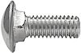

[#cabinetPartsList]
= Cabinet Parts List

When I built my cabinet, one of the unexpectedly big jobs was just figuring out what I needed to buy.
This chapter is an attempt to save you some of that legwork by presenting a master list of everything that goes into a virtual pinball machine.
The list is organized into categories to make it easier to digest and easier to find things.

The list starts xref:#masterPartsList[below] after a few preliminary notes.

== Pinball part references

Many of the items on the list are replacement parts for real pinball machines.
When possible, these are listed with the original manufacturer part numbers.
This makes it easy to find the exact part you're looking for, since most arcade suppliers include these numbers in their catalogs and databases.
You can enter one of these numbers into the search box on most pinball vendor Web sites to find that exact part, without having to wade through a ton of hits for similar items, as is often the case if you search by name or description.
Most of the part numbers are even unique enough to yield good results from a Google search.

The part numbers listed are mostly for Williams/Bally 1990s era machines, also known as WPC machines (for "Williams Pinball Controller", the core electronics platform used throughout that generation).
Those machines had a very uniform cabinet design, and most of the core cabinet parts used a single design shared across many games.
Williams is no longer in the pinball business (much to the regret of pinball enthusiasts), but the modern machines being made by Stern and a few smaller boutique pinball companies still hew very closely to the WPC cabinet design, and use most of the same parts, or equivalents that can be used interchangeably.
As a result, it's easy to find new replacement parts for most of the WPC cabinet components, which makes the WPC hardware an excellent basis for building a new cabinet from scratch.

== Fasteners

Pinball machines use a lot of different fasteners, including machine screws, wood screws and sheet-metal screws, carriage bolts, hex nuts, flange nuts, and T-nuts.
Most of these are generic parts that you can buy anywhere, but some of them are unusual and can be hard to find outside of the pinball vendors.

Here's a quick overview of the terminology and sizing specifications for most of the fasteners used in a pin cab.

Wood screws and sheet-metal screws have pointy ends that are designed to penetrate soft material and form threads in the material as you screw them in the first time.
Machine screws and bolts have flat ends that can only be used with pre-threaded receptacles, usually nuts.

Machine screw sizes are specified by three quantities, like so:

_diameter_-_thread_ x _length_

For example:

#8-32 x 1" bolt = diameter #8, thread pitch 32, length 1"

There are two unit systems for this:

* The American (also known as Imperial) system, used for most American products, expresses the diameter in inches or "#" units (see below); it gives the length in inches; and the thread pitch is expressed in _threads per inch_ .
So a #8-32 x 1" machine screw has a diameter of #8 (about 5/32"), 32 threads per inch, and 1" length.
* The Metric system, used almost everywhere outside of the US, expresses everything in millimeters.
Metric parts are designated with an "M" before the diameter.
An M5-0.8 x 12mm machine screw has a diameter of 5mm, thread pitch of 0.8mm between threads, and a length of 12mm.

Wood screws and sheet metal screws are sized by just the diameter and length, as in #6 x 1".
Since they form their own threads when screwed in, you don't need a matching part with the same thread pitch, so that's not usually specified.
Sheet metal screws and wood screws are basically the same thing, with subtle differences in the way the threads are shaped.
Sheet metal screws come in a bewildering variety of options for the exact shape of the pointy end, with the different shapes being optimized for tapping into particular types of material, but I've never found any virtual pinball situation where this matters.
Sheet metal screws often work well with wood, and in fact, they're often used this way in the original pinball machines.

The length of a screw or bolt is the portion excluding the head.

The "\#" diameter units are used in the American system for sizes less than 1/4", where the fractions become inconvenient to write.
(In this context, "#" is pronounced "number".
Modern audiences will be tempted to call a \#8 screw a "hashtag eight", but that will get you funny looks from machinists.) Each "#" size represents an exact size in fractions of an inch, but I don't think there's any kind of formula for it; you just have to look it up in a table.
Higher "\#" numbers are larger diameters: #10 is bigger than #8, which is bigger than #6.
Here's a quick reference to the "#" sizes commonly used in pinball machines (you can find more comprehensive tables on the Web):

[cols="1,1,1,1"]
|===
|# Size|Decimal Inches|Nearest fraction|Metric

|#4
|0.109375"
|7/64"
|2.778mm

|#5
|0.125"
|1/8"
|3.175mm

|#6
|0.140625"
|9/64"
|3.572mm

|#8
|0.15625"
|5/32"
|3.969mm

|#10
|0.1875"
|3/16"
|4.763mm

|===

Every hardware manufacturer and hardware store uses these standard units to label their parts.
#6 always means the same thing in a machine screw no matter where you buy it.

NOTE: M6 and \#6 are different sizes, and can't be used together.
This can be confusing because the "M" sizes and "#" sizes happen to look very close to each other when you eyeball them, but they're not close enough to actually mix and match parts.

For machine screws, the _thread_ number (the "32" in "#10-32", for example) is an important extra spec giving the thread pitch (the number of threads per inch).
Screws and nuts will only fit together if they have the same diameter _and_ thread pitch; for example, a ⅜"-20 bolt won't fit into a ⅜"-32 nut, because the threads are spaced differently.

The terms "machine screw" and "bolt" are basically interchangeable.
"Bolt" is usually used for larger parts, above about 1/4", but otherwise a bolt is just a big machine screw.

Here are the most common fastener types you'll see in the parts lists:

* Machine screws with slotted heads for tightening with a screwdriver (usually flat or Phillips)
* Hex-head machine screws and bolts, for tightening with a socket wrench
* 
Carriage bolts.
These are bolts with smooth rounded heads, for places where an external bolt should be inconspicuous and not easily removable from the outside.
They have square necks that fit into square holes on the receiving end, which is what serves in place of a wrench to hold them still when you're tightening a nut on the other end.
Most of the carriage bolts used in a pinball machines are available with a black finish that makes them blend better with the artwork.

* 
Flange nuts are hex nuts with integral washers.
Whiz flange nuts or flange lock nuts have serrated surfaces on the bottom of the integrated washer to help lock them in place when tightened.

* 
T-nuts are threaded sockets that are installed permanently in a piece of wood.
These are used when you need to be able to screw a bolt into an internal location that you can't access to insert a regular nut by hand.
Some T-nuts have prongs that let you pound them into like a nail to secure them, while others can be screwed in to their install location with wood screws.

=== SEMS screws and lock nuts

Almost all the machine-screw fasteners in a commercial pinball machines are special vibration-resistant variations of the basic types.
It's easy to understand why, given the amount of mechanical action in a physical pinball game.
I think it's worth using these parts in a virtual cabinet, too, especially if you're including tactile feedback devices.
It's annoying to have to keep re-tightening screws that shake loose over time, and parts that work themselves free can cause damage.

There are three special fasteners in particular that are used over and over in the commercial machines.
You can substitute these just about anywhere that regular machine screws and nuts are called for.

*  *SEMS machine screws* are regular machine screws with the addition of an attached lock washer at the head.
The lock washer adds a lot of grip between the head and the attached part once once the screw is tightened down.
("SEMS" is reportedly a shortening of "asSEMbled".)
*  *Elastic Stop Nuts (ESN)s* are steel hex nuts with nylon thread inserts that add a lot of friction, requiring extra torque to turn the nut.
Also known by the trade name Nyloc nuts.
Note that we're not talking about nuts made entirely of plastic - the nylon part in these is just a lining inside the threading, and the main body is made of steel, zinc, or stainless steel.
*  *Keps nuts* are hex nuts with permanently attached lock washers.
As with SEMS screws, the lock washers add grip between the nut and the attached part when the nut is tightened.
In the commercial pinballs, ESNs are much more common and could be considered the default, but Keps nuts are useful in places where you can't (or don't want to) apply a lot of torque to the screw that the nut attaches to.
("Keps" is a trade name, taken from "shaKEProof".
They're also called K-lock nuts and washer nuts.)

== Cabinet trim hardware variations

The WPC cabinets were basically all the same - Williams came up with a good design and stuck to it for many years.
But there was one significant variation to be aware of: a number of titles, marketed as the "Superpin" games, had extra-wide bodies for the main cabinet, allowing a wider-than-normal playfield.
All of extra-wide titles came in the same extra-wide size, so even taking these into account, there are still only two widths we need to concern ourselves with: the standard machines and the widebody machines.
What's more, the only thing that's different about the widebody machines is the width of the main cabinet; the other dimensions (including the backbox dimensions) and all design elements are identical between the regular and widebody machines.
As a result, the widebodies share all the same hardware with the standard machines except for the main front-top metal trim piece, known as the lockdown bar, and of course the glass cover.

If you go back further in time, before the 1990s, the cabinets become increasingly different from WPC machines.
You should be aware of this when you go shopping, particularly if you shop on eBay for used parts.
If you're building from scratch to the WPC plans, you'll want to make sure that any used parts you buy are compatible with WPC cabinets.

By the same token, if you're refurbishing a used cabinet from the 1980s or before, check carefully when buying new replacement parts from arcade suppliers, because arcade suppliers mostly stock parts for 1990s machines.
New parts probably won't fit a 1970s cabinet unless they're specifically listed as such.
If you are trying to refurbish an old cabinet, one particularly good arcade vendor to try is Marco Specialties.
They have an unusually deep catalog with parts for lots of older machines.
Find the original operator's manual for the machine you're restoring, if possible, since that will usually include a detailed list of the machine's parts, with manufacturer part numbers that you can look up on pinball vendor Web sites to find the exact version.
If you shop on eBay, it's harder to be sure of compatibility.
Ideally, look for parts for the exact title you're refurbishing, but failing that, go by manufacturer and year; the pinball makers mostly re-used parts across their product lines for a few years at a time, so a part of the same vintage from the same manufacturer will usually fit.

== Where to buy

Most of the parts in the master list are fairly standardized, interchangeable parts used in most WPC-era machines, and in most cases, used in 2000s machines from Stern, Jersey Jack, and others.
Most of these parts are readily available on the Web from pinball parts vendors and arcade machine dealers.
If you live in a major metro area, you might even be able to find a local arcade dealer who stocks some parts, although you'll probably need to look to the Web for the more obscure stuff.

Some of the vendors I've used:

*  link:https://www.pinballlife.com/[Pinball Life]
*  link:https://www.marcospecialties.com/[Marco Specialties]
*  link:https://planetarypinball.com/[Planetary Pinball Supply]
*  link:https://virtuapin.net/[VirtuaPin]

Most of the generic hardware (nuts, bolts, screws) can also be found at hardware stores, Amazon, and eBay.
Note that some of these are available in special finishes from the pinball vendors that you might not find at regular hardware stores (e.g., carriage bolts in black, chrome bolts for attaching the legs).

Custom-cut pieces of glass can be found locally almost anywhere from window glass stores.
Check for local businesses that install and repair residential windows.
Custom sizes of acrylic and other plastics can be found locally at plastics stores and some hardware stores.
(If you're on the west coast, check for a local link:https://tapplastics.com/[TAP Plastics] .) You can also buy an uncut acrylic sheet from a hardware store and cut it to size yourself with a special plastic cutter knife, but that doesn't produce as clean a cut as you can get from a pro at a plastics store.

== VirtuaPin part bundles

If you're building a cab from scratch, you can save some time on shopping (and possibly save money as well) by buying a pre-packaged parts bundle from link:https://www.virtuapin.net/[VirtuaPin] .
You can find these on their Web site under "Bundle Deals".
They offer two packages of particular interest to new cab builders:

*VirtuaPin Cab Builder's Kit:* This includes most of the standard cabinet hardware items used on typical 1990s era machines (the "Williams WPC" style).
The kit comes in standard-body and wide-body versions, so choose the one matching your cabinet plans.
Parts included in these kits are marked in the lists below with #VP Cab Kit#

I recommend this kit.
It's cheaper than buying the same parts individually, and it gets you about 80% of the way to a complete cab in terms of the accessories.

The only downside is that the kit is only available in the standard chrome/stainless steel finishes for the trim parts.
That's exactly what most people want, since it's the standard look on most real machines.
But some of the newer Stern machines come with a powder-coat finish on most of the metal trim, color-coordinated to complement the artwork.
That's a nice upgraded look that you might want for your own build.
Other metallic finishes are possible as well, such as brass.
Another custom upgrade that some people want is a lock bar with a "Fire" button in the middle.
That requires a special lock bar and matching "receiver", which you can't currently get with the VirtuaPin kit.
If you want to choose your own finishes (see "Custom finishes" below) or include a "Fire" button on the lock bar, you're better off skipping the kit and buying everything _à la carte_ , since you'd throw away most of the kit.

It's also possible to adapt the standard lockbar hardware for a Fire button, but it takes a bit of work.
See xref:cabHardware.adoc#FireButtonWithStandardLockbar[Cabinet Hardware Installation] for details.

*VirtuaPin Button Kit:* This includes most of the buttons in a typical virtual cab.
In the list below, we've marked the items in this kit with #VP Button Kit#

I'm ambivalent on this kit.
It'll save you some time, but it's less of a bargain than the cab builder's kit because it includes some buttons you probably won't use.
It also lacks some that you might want to add.
If you don't mind doing the extra planning and shopping, I'd skip this kit and buy buttons individually, so that you can get exactly what you want.

== Custom finishes

Most of the exterior metal trim - legs, side rails, lockdown bar - is available in multiple finishes.
The "standard" finishes are chrome for the legs, brushed stainless steel for the lock bar and side rails, and black powder-coat for the coin door.
With some extra work, you can get all these parts in other finishes, such as brass, gold, or just about any powder-coat color.

The big vendors mostly just offer the standard finishes, but Marco Specialties often has a few alternatives available to match recent Stern titles.
Stern typically releases a Limited Edition version of each new title, with upgraded trim, usually in a powder-coat color that complements the cabinet art.
Marco usually stocks a selection of such trim, but it's hit or miss.
If you're lucky, you might be able to find a full set of trim in a color featured on a past Stern LE game.

You might also be able to find trim in alternative finishes from pinball "mod" sellers.
A number of small vendors sell upgrade parts, including custom-finished trim, to the pinball collector market.
These guys all sell online and on eBay; try a Web search for "pinball side rail" (for example) plus the type of finish you're seeking.

If you have a specific idea for the look you want, your best option might be to buy "raw" or "unfinished" trim and find someone to apply the desired custom finish.
link:https://www.pinballlife.com/[Pinball Life] sells unfinished legs, side rails, and backbox hinges, specifically as a base for custom finishes.
This is a much better starting point than the standard parts, because a refinisher would have to strip the existing finish off first, which is expensive and time-consuming.

You can find services online that offer custom powder coat and metallic finishes - you ship them the parts, and they do the work and ship them back.
You might also be able to find a local business that does this, if you live in a major metro area.
Try looking for local shops that refinish antiques and/or auto and motorcycle parts.

[#masterPartsList]
== Master parts list for a virtual pinball machine

Miscellaneous supplies

[cols="1,3,1"]
|===
|Item|Description|Quantity

|Wire: 22-24 AWG stranded
|You'll use a surprising amount of wire to connect various parts of the machine together: buttons, lights, feedback devices.
It's convenient to have a few spools of wire on hand throughout the build.
You can use 22 or 24 gauge wire for practically everything, and it's cheaper (by the foot) to buy wire in large spools, so I'd pick one size and buy lots of it.
If you're only installing buttons, 100ft should be adequate; if you're installing feedback devices, you'll probably want at least 200ft on hand.
Buy several assorted insulation colors to make the wiring easier to trace.
|100ft+

|Wire: 18 AWG stranged
|You'll also need some thicker wire for some of the power wires and speaker wires.
I recommend 18 AWG as a good general-purpose choice for these higher power wires.
50 to 100 feet should be adequate for most pin cabs.
I'd start with two 25' spools, one with white insulation and one with black.
|50ft

|Solder
|A good quality solder makes a surprising difference in the ease of work and the quality of your results.
I really like Kester 44 rosin core solder.
You can get it in 1oz tubes, but the 1lb rolls are a much better deal if you think you might do any significant amount of soldering in the future.
|1oz-1lb

|#6 wood screws, various lengths
|I found that I used an amazing number of wood screws for all sorts of random tasks.
The vast majority were #6 wood screws - these are the right size for all sorts of miscellaneous jobs.
Keep an ample supply on hand so that you don't have to keep running to Home Depot.
Recommendation: buy 100 #6 x ½", 100 in ¾", 100 in 1", 100 in ¾", and perhaps 25 1¼".
|Lots

|Nails
|As with #6 screws, it's convenient to have a supply of various nails on hand.
You'll mostly need finishing nails rather than anything heavy-duty.
I mostly used 1" and ¾" brads, so I'd recommend buying a bunch of each.

|Lots

|Wood glue
|If you're doing your own woodworking or building from a flat pack, you'll need a good wood glue for the joints.
It's a good thing to have on hand for miscellaneous jobs even if you have a pre-assembled cab.

|1 tube

|Epoxy
|Some things are easiest to assemble or attach with a strong glue.
Get a two-component epoxy (the type with two tubes of goo that you mix together just before use).
I don't recommend "superglues" (cyanoacrylate glues) for most cab uses.
|1 tube
|===

Cabinet wood shell

[cols="1,3,1"]
|===
|Item|Description|Quantity

|Hardwood plywood, ¾", 4'x8' sheet
|If you're doing your own woodworking from scratch, I recommend using a furniture-quality hardwood plywood for all the cabinet pieces.
This is what they used on the real machines.
The ¾" thickness is important for making the accessories fit properly.
Some people use particle board or melamine, which are cheaper, but I prefer plywood.
MDO plywood (a hybrid sheet product with a plywood core and an MDF veneer) is an excellent alternative if you can find it.
It combines plywood's superior strength with the perfectly smooth surface finish of MDF, so there's essentially no prep work needed for paint or decals.
It's possible to make do with a single 4'x8' sheet, but it's easier with two sheets.
See xref:plywoodCuttingPlans.adoc#plywoodCuttingPlans[Plywood Cutting Plans for Cabinet Construction] .
|1 or 2

|Plywood, ½", 4'x8' sheet
|The cabinet floor and the back wall the backbox are typically made from 1/2" material.
Most commercial machines use particle board for these parts, since they're not cosmetic.
I prefer plywood since it's stronger and lighter.
|1

|Flat pack kit
|As an alternative to raw lumber, you can buy a pre-cut flat pack kit.
VirtuaPin and others sell these.
A flat pack has all the cabinet pieces cut to size and ready to assemble.
|1
|===

Cabinet artwork

Most cab builders opt for decals printed with custom artwork.
You can create your own artwork with a computer graphics program.
Decals are popular because they can make your cab look just like a real machine - done properly, they make for a very professional finish.
Some people prefer a simple black paint job or natural wood finish, and some go with stenciled paint decoration for a more vintage look (like machines from the 1960s or 1970s).
See xref:cabArt.adoc#cabinetArt[Cabinet Art] for ideas and resources.
[cols="1,3,1"]
|===
|Item|Description|Quantity

|Custom cabinet decal set
|A set of decals covering the visible surfaces of the cabinet and backbox.
|1

|Translite decal
|The backbox TV's display area will necessarily be smaller than the translite, so there will be some gaps around the edges. You can use decals to fill the gaps decoratively.
|1

|DMD panel decal
|The real machines during the late 1980s and early 1990s had printed artwork filling the DMD panel, with a custom design for each title to complement the backglass artwork. The later WPC-era machines (from about 1995 to 2000) switched to generic, matte black panels, decorated only with the manufacturer logo. I personally prefer the more ornate look of the early 1990s machines, which you can reproduce using a printed decal with your own custom artwork based on the graphics theme for your main cab. If you prefer the more neutral style of the later generic panels, you can approximate that with a simple black paint job.
|1
|===

Main cabinet hardware

[cols="1,3,1"]
|===
|Item|Description|Quantity

|Side rails
|WPC style: Williams/Bally A-12359-3, 01-8993-2
|2 #VP Cab Kit#

|Mounting tape for side rails
|Double-sided foam tape, ¾" wide, .032" (approx) thick. This goes between the rails and the side of the cabinet. About 80" length required.
|80 inches

|#8-32 x 1¼" carriage bolts
|For attaching the side rails
|2

|#8-32 hex ESN lock nut
|These go with the carriage bolts for attaching the side rails
|2

|Lockdown bar
a|* WPC Standard: Williams/Bally D-12615, A-18240
* WPC Widebody: Williams/Bally A-16055, A-17996 +
* WPC Custom width: available from link:https://www.virtuapin.net/[VirtuaPin] and others
* Stern standard width with center "FIRE" button: search for "premium lockbar"
|1 #VP Cab Kit#

|Lockdown bar receiver
a|* WPC (standard, widebody, or custom): Williams/Bally part A-16673-1, A-9174-4
* Stern lockbar receiver with center "FIRE" button: Stern 500-7237-00
*Important:* This part mates with the lockdown bar, so make sure you choose a receiver that matches the type of lockdown bar you have. The Williams WPC receiver is the same for standard, widebody, and custom widths of WPC lockbars. For other brands, check the vendor site for the compatible receiver after you select a lockbar.
|1 #VP Cab Kit#

|Leg brackets
|Williams/Bally 01-11400-1
|4 #VP Cab Kit#

|#8 x 5/8" wood screws, hex-head, slotted
|For attaching the leg brackets to the cabinet. Williams/Bally 4108-01219-11, 4608-01081-1
|32

|Steel legs
|Williams/Bally A-19514
|4 #VP Cab Kit#

|Leg levelers with nuts
|Williams/Bally 08-7377
|4 #VP Cab Kit#

|Cabinet leg protectors
|Optional; these can help protect the cabinet decals or paint from wear around the leg joints. These weren't original equipment on WPC-era machines; Marco Specialties and Pinball Life carry several options, including felt and metal versions. The metal ones are said to be better for decals, but this is moot if you trim the decals around the leg contact area.
|4

|Leg bolts, ⅜"-16 x 2¾" or 2½"
|The longer 2-¾" length is easier to work with, especially if you're using leg protectors. The type sold by pinball vendors has a chrome finish and rounded dome ("acorn") head for a nicer appearance than generic hex bolts from hardware stores. Williams/Bally 4322-01125-40
|8 #VP Cab Kit#

|Leg bolt nuts, ⅜"-16 thread
|Hex nuts, ⅝" outside diameter. Williams/Bally 4422-01117-00
|8

|⅜"-16 T-nuts
|Install in the "shelf" at the back of the cabinet, to mate with the wing bolts installed in the backbox floor to secure the backbox in the upright position.
|2

|Coin door
|The WPC style is available fully assembled with the mounting frame, coin slots, slam tilt switch, operator buttons, and wiring harness, but generally without the coin acceptor mechanisms. Williams/Bally part 09-37000-1; alternate part numbers: 09-46000, 09-96017, 09-17002-26, 09-23002-1, and 09-61000-X, 09-61000-1.
Available as an add-on in the VP cab kit
|1

|Coin mechanisms for coin door
|Optional. You need these if you want use actual coins. One "mech" is required per coin slot (the WPC doors above have two slots).
|1-2

|¼"-20 x 1¼" carriage bolts, black
|For attaching coin door and lockdown bar. Williams/Bally 4320-01123-20B
NOTE: another 6 are needed for backbox

|6 #VP Cab Kit#

|¼"-20 flange locknuts
|Williams/Bally 4420-01141-00
NOTE: another 6 are needed for backbox
|6 #VP Cab Kit#

|Cashbox
|Optional. Sits under the coin slots to collect inserted coins. You need _something_ for this purpose if you plan to use coins; the standard box is well designed for the job, but it's rather large. You might prefer to improvise something more compact. The standard cashbox consists of two parts: the plastic tray (Williams part 03-7626, Stern part 545-5090-00), and a metal cover (Williams part 01-10020, Stern 535-5013-03, 535-5013-02, 535-5013-01).
|1

|Cashbox nest bracket
|Optional; recommended for use with a standard cashbox. Attaches to the inside front wall the cabinet just under the coin door to keep the cashbox from sliding around. Williams part #01-6389-01.
|1

|Cashbox lock bracket
|Optional; recommended for use with a standard cashbox. Attaches to the short dividing wall on the cabinet floor that delineates the cashbox area at the front, to anchor the cashbox when installed. Williams/Bally part 01-10030 or 1A-3493-1.
|1
|===

Playfield glass
[cols="1,3,1"]
|===
|Item|Description|Quantity

|Tempered glass sheet for playfield cover
a|* Standard body: 43" x 21" x 3/16", Williams A-08-7028-T
* Widebody: 43" x 23¾" x 3/16", Williams A-08-7028-1
* Custom cabinet: 3/16" thick tempered glass, cut to a custom size per your plans. You should be able to order this at a local window glass shop.
Tip: ask the shop to omit any marking or etching certifying that it's tempered glass. Glass makers might assume that you want a certification mark, since some building codes require the marking for certain uses in home construction, such as a glass shower enclosure. You don't need any certification for use in a pinball machine, though, so you'd probably prefer to omit any such markings, to avoid visual clutter.
|1

|Playfield glass rear plastic channel
a|Standard width: Williams/Bally 03-8091 Widebody: Williams/Bally 03-8091-2
|1 #VP Cab Kit#

|Playfield glass side rail plastic channels
|Williams/Bally 03-7135-1
|2 #VP Cab Kit#
|===

[#ballShooterAssembly]
Plunger

[cols="1,3,1"]
|===
|Item|Description|Quantity

|Fully assembled: Williams/Bally B-12445-1, B-12445-6, B-12445-7.
a|You can also buy the individual parts separately if you wish to customize. Pinball Life lets you choose colors for the knob and rubber tip, but you'll have to buy _à la carte_ if you want a custom knob. Note that you can buy a knobless shooter rod and epoxy on your own custom knob for a unique look. Note also that springs are available in different tensions. I'd recommend a lower tension spring for virtual pinball use since you're never going to hit an actual ball: lower tension means lower speed and less cabinet rattling. The part numbers below are Williams/Bally references as usual:

* Shooter rod: 20-9253
* Shooter housing: 21-6645-1
* Shooter housing sleeve: 03-7357
* Barrel spring (¾" long x ⅝" diam): 10-149
* Inner spring (5½" long x ½" diam): 10-148-1
* E-clip (⅜" shaft, 5/16" groove): 20-8712-37
* Washers (25/64" x ⅝", 16 gauage, qty 2): 4700-00051-00
* Rubber Tip: 545-5276-00

If you buy a commercial plunger kit, the plunger assembly is usually included.

|1

|Ball shooter mounting plate
|Williams/Bally 01-3535
Note! This *isn't* typically included in the commercial plunger kits or the "complete assemblies" sold by arcade vendors.
|1

|#10-32 x ⅝" machine screws
|Not typically included with commercial plunger kits or complete assemblies.
|3

|===

Tilt-up playfield TV mounting

Hardware for the tilt-up mechanism described in xref:playfieldMounting.adoc#playfieldMounting[Playfield TV Mounting] . Only needed for that design (or a a similar design).

[cols="1,3,1"]
|===
|Item|Description|Quantity

|Playfield holder bracket (left side)
|Williams/Bally 01-8726-L-1
|1

|Playfield holder bracket (right side)
|Williams/Bally 01-8726-R-1
|1

|Pivot nut, 7/16"
|Williams/Bally 02-4244. The 1/2" version (Williams 02-4329) will also work.
|2

|Carriage bolt, 3/8"-16 x 1-3/4", black
|
|2

|Washer, 3/8" x 1" outside diameter (quantity 2)
|
|1

|Hex nut, 3/8"-16
|
|2

|===

Backbox hardware

[cols="1,3,1"]
|===
|Item|Description|Quantity

|Backbox hinges
|Williams/Bally 01-9011.2-R, 01-9011.2-L
|2 #VP Cab Kit#

|Hex pivot bushings for backbox hinges
|½" shaft, ¾" diameter head, ¼" hex center, ⅜-16 thread. Williams/Bally 02-4352
|2 #VP Cab Kit#

|Pivot bushing carriage bolts
|⅜"-16 thread, ¾" long. Williams/Bally 4322-01139-12B
|2 #VP Cab Kit#

|¼"-20 x 1¼" carriage bolts, for attaching backbox hinges
|Williams/Bally 4320-01123-20B
This is in addition to the 6 needed for the coin door and lockdown bar. The VP cab kit provides 10, so you need two extra for the full set.
|6 #VP Cab Kit#

|Backbox hinge backing plates
|These go inside the backbox to strengthen the connection points for the carriage bolts above. Williams/Bally 01-9012
|2

|¼"-20 whiz flange locknuts
|Williams/Bally 4420-01141-00
This is in addition to the 6 needed for the coin door and lockdown bar. The VP cab kit provides 10, so you need two extra for the full set.
|6 #VP Cab Kit#

|Backbox latch
|Williams/Bally 20-9347
|1 #VP Cab Kit#

|Backbox latch bracket
|Williams/Bally 01-8397
|1 #VP Cab Kit#

|Wing bolts, ⅜"-16 x 2"
|Install in the floor of the backbox to lock the backbox in the upright position. Williams/Bally 20-9718
|2

|Backbox translite lock plate assembly
|Keyed lock to secure the translite. Not truly necessary in home use, but a nice touch to complete the look of the real machines. Williams/Bally A-13379
|1

|Lower speaker panel bracket
|A black metal "U" channel that screws into the bottom of the backbox, to hold the DMD panel in place. The only place I've seen the original part for sale is link:https://planetarypinball.com/[PlanetaryPinball.com] , but you can sometimes find upgraded versions in custom finishes (brass, chrome) from "mods" vendors. You can substitute a generic aluminum ⅝" x ⅝" U channel from a hardware store, cut to the required length (27⅛" for the standard backbox width) and painted black. Williams/Bally 01-8569-1
|1

|===

Translite

[cols="1,3,1"]
|===
|Item|Description|Quantity

|Tempered glass or acrylic (Plexiglass) sheet, 18⅞" x 27" x ⅛" thick
|
|1

|Backglass side trim
|Black trim pieces that attach to the side edges of the translite. Williams/Bally 03-8228-3
|2 #VP Cab Kit#

|Backglass top trim
|Black trim piece that attaches to the top edge of the translite. Williams/Bally 03-8228-2
|1 #VP Cab Kit#

|Backglass lift channel
|Black trim piece that attaches to the bottom edge of the translite, and serves as a handle for removing it from the backbox. This fits into the speaker panel H channel. Williams/Bally 03-8229-1
|1 #VP Cab Kit#

|===

Speaker/DMD panel (pre-WPC-95 style)

This is the separate panel at the bottom of the backbox, below the backglass, that you see on real 1990s pinballs. Many virtual cab builders reproduce this look by using the same type of panel, since it gives the machine a modern appearance and also provides an excellent place to put the audio speakers. This whole panel is optional, though; if you prefer the vintage look where the entire backbox is devoted to a single large backglass, you can skip the panel and use a larger backbox TV.

These parts are for the pre-WPC-95 style, used on Williams machines from about 1990 through 1995. A different style was used on later machines, with a single-piece molded plastic panel; those parts are listed below. See xref:dmdAssembly.adoc#dmdAssembly[Speaker/DMD Panel] for a comparison of the two types.

[cols="1,3,1"]
|===
|Item|Description|Quantity

|Speaker panel H channel
|Black trim piece that attaches to the top edge of the DMD panel. The "H" shape makes a channel in the top that the translite fits into, to hold the translite in place. Williams/Bally 03-8265-1
|1 #VP Cab Kit#

|Speaker panel latch brackets
|These hold the speaker panel in place in the backbox. Williams/Bally 01-8535
|2

|#8-32 x 3/8" flat-head countersunk machine screws
|These attach the latch brackets to the speaker panel. Williams/Bally 4008-01041-06
|4

|#8-32 x 3/8" pan-head machine screws
|For attaching the speakers and "H" channel trim to the speaker panel. Williams/Bally 4008-01005-06, or SEMS version (with attached locking washer) 4006-01003-06
|12

|#8 external tooth locking washer
|For attaching the speakers and "H" channel trim to the speaker panel (required only if you're not using a SEMS screw with attached washer). Williams/Bally 4703-00008-00
|12

|4" Speaker screen for backbox speakers
|Use for DMD panels with 4" speaker openings. The standard type is black plastic; they're also available in metallic finishes (brass, chrome). Stern 535-8081-00, 535-8081-01
|2

|WPC-95 speaker screen for backbox speakers
|This is specifically designed for the molded plastic WPC-95 speaker panel, but it should also be adaptable to a 5.25" speaker opening in the older style of panel. You might have to cut holes for the speaker mounting screws to make it fit properly. Williams/Bally 04-10382-7-4
|2

|7" Speaker screen for backbox speakers
|Can be used for DMD panels with 5.25" speaker openings, but you have to cut it to size. Williams/Bally 03-8603-1, 03-8603-3, 01-6733.
|2

|Dot Matrix Display device
a|This is the display device that goes in the opening in the middle of the panel to display the score and other graphics. Options

* 15-16" LCD TV, monitor, or laptop display
* PinDMD 2 or 3 (commercial "real DMD" device)
* Pin2dmd (DIY open-source LED DMD device)
|1

|===

Speaker/DMD panel (WPC-95 style)

These parts are for the WPC-95 style of speaker panel used on Williams machines from 1995 and after. This type of panel is made from molded plastic. Machines from 1990 through 1995 used a different style with an MDF panel and plastic facing printed with graphics; the parts for the older style are listed above. See xref:dmdAssembly.adoc#dmdAssembly[Speaker/DMD Panel] for a comparison of the two types.

[cols="1,3,1"]
|===
|Item|Description|Quantity

|WPC-95 speaker panel
|Available with embossed Williams or Bally logos in silver or gold. Williams/Bally 04-10382-7A, 04-10382-7B, 04-10374-7A, 04-10374-7G.
|1

|Bushing buttons
|Installed in the backbox to support the speaker panel. Williams/Bally 02-5223
|4

|Speaker grill
|Usually included with the speaker panel assembly; available separately if not. Williams/Bally 04-10382-7-4
|2

|Speaker retainer rings for 5.25" speakers
|The speaker panel assembly might include retainer rings for 5.25" and 3" speakers. For a virtual cab you'll usually want two of the 5.25" retainers, so you might need to order one separately. Williams/Bally 04-10382-7-2
|2

|Dot matrix display shield
|Clear plastic cover for the DMD window. Might be included with the speaker panel assembly. Williams/Bally 01-13636
|1

|===

PC

For the sake of making this list fairly comprehensive, here's a list of the typical PC components you'll need. This is only an outline, though; we must leave it to you to decide on specific products. See xref:pc.adoc#pc[Designing the PC] for guidance.

[cols="1,3,1"]
|===
|Item|Description|Quantity

|Operating System
|Windows 7, 8, or 10 recommended. Home edition is fine.
|1

|CPU
|A CPU with 4 or more cores is recommended, such as a current generation Intel Core i5 series.
|1

|Motherboard
|Choose a motherboard based on the CPU you wish to use. Motherboards are designed to work with specific CPU types, so your choices will depend on the CPU type you plan to use.
|1

|CPU fan
|Most modern CPUs require a powered fan to be directly mounted on the CPU itself. Your CPU purchase might include this if you buy a boxed retail package; if not, many suitable third-party options are available.
|1

|Graphics adapter
|Virtual Pinball isn't as demanding as other 3D games but does require at least a mid-range graphics adapter. If cost is no object, buy a high-end gaming card. But those are usually two to three times as expensive the mid-range cards, which are fine for pinball. Get a card with at least 2GB, preferably 3G or more. You generally should use only *one* graphics adapter even for a 2- or 3-monitor system, as performance is usually higher with one card driving multiple monitors than with multiple cards.
|1

|ATX power supply
|Choose the wattage capacity according to the needs of your motherboard and graphics card.
|1

|RAM (system memory)
|Choose RAM chips that match the specs for your motherboard. RAM contributes to performance; more is better.
|1

|Hard disk or SSD
|I'd recommend using an SSD (solid-state disk) over a conventional hard disk, both for the dramatically faster boot times and for the immunity to shock and vibration.
|1

|Case or tray
|Optional. Some people like to use a conventional PC case, but this takes up a lot of room inside the cabinet. It's more common to mount the motherboard and other components directly to the cab wall or floor. You might also consider a conventional metal case to enclose the PC parts, or a "motherboard tray" (an open frame that holds the motherboard and helps secure the expansion cards, but doesn't enclose anything).
|1

|Fans
|Most cab builders include at least two standard PC case fans to move air through the cabinet. These can be mounted on the floor and/or the rear wall.
|2+

|Disk cables
|Your motherboard will probably come with suitable cables for connecting your hard disk, but if not, you can buy these separately.
|1

|===

Power line input

[cols="1,3,1"]
|===
|Item|Description|Quantity

|Power strip
|Most cab builders like to be able to control power to the whole system through the PC's soft power button. You can do this with a "smart" power strip inside the cab, or you buy an ordinary power strip and make it "smart" with a contactor. A separate power strip in the backbox is useful (perhaps a small one with only 3 or 4 outlets), for plugging in the backbox TV(s) and any other devices situated there.
|1+

|12VDC contactor
|Not needed if you buy a "smart" power strip. If you buy an ordinary power strip, though, you use a contactor to make it act like a smart one. Route the line power to all devices other than the PC (including the TVs and the feedback device power supplies) through the contactor, and control the contactor via the main PC power supply's 12V output. When the PC is on, the contactor turns on and supplies power to everything else. More on this in xref:powerSwitching.adoc#powerSwitching[Power Switching] .
|1

|===

Buttons

This is a list of the most common buttons needed for a virtual cab. Many cabs have extra buttons beyond these. See xref:cabButtons.adoc#cabinetButtons[Cabinet Buttons] for specific products to buy and a more comprehensive list of optional buttons.

Some buttons have light bulbs inside. You can hard-wire these to be always lighted, but most people want the software to be able to control them so that they turn on and off at appropriate times during game play. To do this, you have to treat the lights as _output_ devices, meaning the lights have to be connected to a separate output controller. The button controller only handles the switch part of the button. See xref:feedbackDevices.adoc#feedbackDevices[Feedback Devices Overview] for more on this.

[cols="1,3,1"]
|===
|Item|Description|Quantity

|Flipper buttons
a|You need two for regular flipper buttons, and another two for Magna Save buttons if desired. If you want to light the buttons, buy a transparent type; if you want to light them with variable color (RGB) lights, buy clear transparent buttons.

Flipper buttons come in two lengths: 1⅛" and 1⅜". The VirtuaPin button kit uses the longer type to mate with their switch holders. Most real machines use the shorter length, so most of the options available from pinball vendors are only available in the shorter length. If you're looking for transparent buttons for illumination but you want the longer length so that you can use the VirtuaPin switch holders, look for part 515-7791-00.

* 1⅛" buttons: part number A-16883
* 1⅜" buttons (not transparent): part 3A-7531
* 1⅜" buttons, transparent: 515-7791-00, 3A-7531-13

|2-4 #VP Button Kit#

|Flipper button leaf switches
|The flipper buttons mentioned above are just the _buttons_ , without the electronic switch part. The buttons have to be paired with switches. The gold standard is *leaf switches* . Some newbie cab builders really want to use microswitches instead, since they're so much easier to find and install, but it's almost universally agreed that leaf switches are the only thing that feels right. The problem with microswitches is that they have some intentional mechanical hysteresis at the point of contact, whereas leaf switches are perfectly smooth. That's critical for flippers because it gives you greater control and better tactile feedback.

For a virtual pin cab, it's best to use low-voltage leaf switches with *gold-plated contact points* . That's the only type VirtuaPin sells, so you'll be safe if you go with theirs. If you buy from a pinball vendors like Pinball Life or Marco Specialties, make sure you get the low-voltage, gold-plated type, because the pinball parts vendors also sell a high-voltage type designed for older pinball machines. The high-voltage switches use tungsten contact points, which have higher electrical resistance than gold contacts, so they don't work as well in low-voltage logic circuits.

|2-4 #VP Button Kit#

|Flipper button leaf switch holders
|Optional. VirtuaPin sells their leaf switches with plastic holders that fit over the buttons and are held in place with Palnuts (below). This makes the switch positioning and installation dead simple, but be aware that these only work with the long (1⅜") buttons. If you're using the more common 1⅛" buttons, these won't fit. The holders might also conflict with lighting devices for the buttons, such as the LiteMite boards (below).

If you can't use the holders, it's still fairly easy to install the leaf switches, by attaching them directly to the wall the cabinet. So you definitely don't _need_ the holders. But they're convenient if you're using compatible buttons.
|2-4 #VP Button Kit#

|Palnuts
|This screw onto the flipper button shaft on the inside of the cab to hold the button in place. You need one for each button. I prefer the nylon type, because they won't run the risk of shorting any nearby wire connections. Williams/Bally 02-3000, 20-9222, 3A-7532.
|2-4 #VP Button Kit#

|LiteMite PCBs for flipper button lighting (optional)
|These make it easy to install LEDs to illuminate transparent flipper buttons. Buy the full-color RGB type to let DOF set custom colors per game. Use one per flipper and Magna Save button.
|2-4

|Start button
|
|1 #VP Button Kit#

|Exit button
|
|1 #VP Button Kit#

|Extra Ball button (optional)
|
|1

|Launch Ball button (optional)
|
|1 #VP Button Kit#

|Coin button (optional)
|
|1

|Main PC power button
|
|1 #VP Button Kit#

|Tilt bob (optional)
|
|1

|===

Audio system

The list below shows the basic elements needed in your audio system. There are too many options to list specific products here, so most of these are generic descriptions. There are also several common audio system configurations, so some of this equipment only applies to certain configurations.

Quick overview: The "primary" audio system is usually a pair of speakers in the backbox plus a subwoofer in the main cabinet. Some cabinets also have a "secondary" system that places a separate set of speakers inside the main cabinet to play back mechanical playfield sound effects (ball rolling sounds, flippers, bumpers, etc). This can use two speakers, two speakers plus a subwoofer, or four speakers for "surround sound". The secondary system can even replace other tactile feedback devices, especially if you're using an "exciter" (also known as a tactile speaker or tactile subwoofer) in place of the regular speakers.

See xref:audio.adoc#audio[Audio Systems] for more details on o the various audio system configurations, and more specific product recommendations.

[cols="1,3,1"]
|===
|Item|Description|Quantity

|Amplifier for primary (backbox) audio system
|The standard setup needs a "2.1" channel amplifier (two stereo channels, one subwoofer channel). Most people use 12VDC car amplifiers. You can skip the amplifier if you're using powered PC speakers with their own built-in amplifier.
|1

|Midrange speakers for backbox speaker panel (primary audio system)
|
|2

|Subwoofer for main cabinet (primary audio system)
|
|1

|Amplifier for secondary audio system
|Optional. Only needed if you have a second audio system for mechanical playfield sounds.
|1

|Midrange speakers for secondary "in-cabinet" audio system
|Optional. Use one or two speakers for a basic system, four for a "surround" system (for placing sound effects at their proper location in the playfield area).
|1-4

|Subwoofer for secondary audio system
|Optional. Used for a 2.1 or 4.1 in-cabinet speaker system.
|1

|Tactile subwoofer for secondary audio system
|Optional; replaces the regular "subwoofer for secondary audio system" above. This can be used as a substitute for other tactile feedback devices, or together with them.
|1

|7" Speaker screen for subwoofer (or larger, if you're using a larger subwoofer)
|Williams/Bally 03-8603-1, 03-8603-3, 01-6733.
|1

|===

Feedback devices

Everything in this section is optional, applying only if you want to include feedback systems on your cab. If you're not sure you want feedback at all, you can build your cabinet without it initially, and add feedback systems later as a retrofit if you change your mind. It's a fairly isolated system that can be worked into a finished cabinet, although like anything else, it's always easier and neater if you plan for it from the outset. For recommendations for specific products and parts, see xref:feedbackDevices.adoc#feedbackDevices[Feedback Devices Overview] .

[cols="1,3,1"]
|===
|Item|Description|Quantity

|Output controller
a|USB device that receives commands from the pinball software on the PC and switches lights, solenoids, and motors on and off. Options:

* LedWiz
* PacLed
* Pinscape Controller
* SainSmart
|1

|Power boosters
a|Most output controllers can only handle devices with low power, such as LEDs. Power boosters let you connect higher power devices, such as solenoids and motors.

* Zeb's booster board
* Pinscape expansion boards
* DIY MOSFET circuit (described in xref:outputs.adoc#outputs[Pinscape Feedback Outputs] )
* Relays
|1

|Secondary PC power supply
|Most cab builders install a second ATX power supply for feedback devices, so that the main PC supply isn't affected by the extra load. PC power supplies are great for 5V and 12V devices because they have very large capacity; a cheap and low-end supply is fine for this job.
|1

|24V power supply
|Some devices require higher voltages. You can add an inexpensive closed-frame 24V supply if you have any devices that need it.
|1

|Step-down converter for 6.3V
|If you're using front-panel buttons with #555 incandescent bulbs, you can supply them using a step-down converter board to convert 12V from the PC PSU to the required 6.3V. Inexpensive converters are available on eBay to convert to selectable voltage levels. You can also find fixed-voltage 6V converters at link:https://www.pololu.com/[pololu.com] .
|1

|Step-down converter for shaker motor
|A second step-down converter can be used to supply your shaker motor. You can use this to reduce the voltage level if the shaking effect is too strong at full speed.
|1

|Step-up converter for replay knocker
|Pinball replay knockers are built for 50V supplies; they'll run on less but will make a weaker sound. A step-up converter can be used to supply them with higher voltages if desired.
|1

|High-output RGB LEDs for flashers
|A set of five bright RGB lights to reproduce the bright flashing lights on pinball playfields, for a more faithful reproduction of the real thing's brightness than the video rendition can achieve. Most people use 3W RGB "star" LEDs available on eBay.
|5

|Pinball dome lights for flashers
|
|5

|Strobe light
|This supplements the RGB flashers with an extra-bright white light for strobe effects. Most people use 22-LED white car strobe lights available on eBay.
|1-2

|Flipper feedback simulators
|A device inside the cabinet to simulate the tactile "thunk" of a flipper firing. You can use a real flipper assembly for the most authentic effect, but most people use a lower-cost option such as a contactor (a large relay) or a solenoid.
|2

|Slingshot feedback simulators
|Another tactile "thunk" effect generator. This is the same sort of effect as the flippers or bumpers, so most people use the same types of devices for all these, but some like to vary the devices to get different effects.
|2

|Bumper feedback simulators
|Another "thunk" device, usually done with the same types of devices as for flippers and slingshots.
|6

|Shaker motor
|A DC motor with an off-balance weight attached, to make the machine vibrate when activated for a rumble or earthquake effect.
|1

|Gear motor
|A DC motor with an integrated step-down gear, used for the noise the gears make. This is to simulate the sound of the motors that many real pinballs use to animate playfield elements.
|1

|Replay knocker
|
|1

|Fan
|Usually placed on the top of the backbox, _à la_  link:https://ipdb.org/machine.cgi?id=2765.html[Whirlwind] .
|1

|Beacons
|Rotating or flashing lights like on a police car, usually placed on top of the backbox. This is another light-show element, but it's also popular because so many real pinballs have these.
|1

|Under-cab or rear-facing RGB light strips
|RGB light strips attached to the underside of the cabinet and/or the back of the backbox, for ambient lighting while playing.
|1

|In-cab addressable RGB light strips
|A different type of light strip that allows each LED to be controlled individually. These can create animated lighting effects like on a theater marquis. A controller is required (below).
|1

|Controller for addressable RGB light strips
|
|1

|===