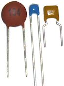
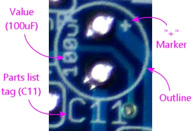

= Capacitors

The capacitor is a basic electronic building block that adds a measured amount of "capacitance" to a circuit, or the ability to temporarily store a quantity of electric charge.

The ability to store charge makes capacitors look glancingly similar to batteries, but they're rather different in their physical construction and electronic properties, and they're used for different purposes. A battery uses a chemical reaction to store energy, which allows it to store potentially large amounts of energy over long time spans. In contrast, a capacitor stores its energy in a standing electric field, so it can only store a (relatively) small amount of energy over a short period of time. This makes a capacitor a poor power source. Instead, the property of a capacitor that's most often used in circuit design is its ability to resist changes in applied voltage, which happens because the stored electric field acts as a sort of buffer that has to be charged up or depleted before voltage changes can get past the capacitor. This effect can be exploited for purposes such as signal frequency filtering and power line conditioning.

== Types of capacitors

All of the capacitors used in the Pinscape projects fall into one of two categories: ceramic disc capacitors and electrolytic capacitors. These aren't the only types that exist - there are about a dozen in all - but they're by far the most common in everyday electronics. Most other types are only seen in specialized applications.

=== Ceramic disc capacitors

These capacitors are usually flat and disc-shaped, but sometimes they're flat and squarish. Small ones can be bulbous or cigar-shaped.

Ceramic capacitors aren't polarized, so they can be installed in either direction. There's no "+" or "-" leg.

Disc capacitors tend to have small capacitance values, usually below 1 µF (micro Farad). Common sizes are measured in fractions of a µF, such as 0.1µF, or in whole nF (nano Farads). Very small ones are measured in pF (pico Farads).

It's best to keep disc capacitors with their packaging until you're ready to use them, because they can be so tiny that it's difficult to read any markings. If you need to identify a disc capacitor, look for a three-digit number printed on the face of the disc.

image::images/disc-cap-markings.png[""]

For a three-digit number, take the first two digits, and add the number of zeroes given by the third digit. So for the "154" example pictured above, we'd take out the "15" and add 4 zeroes, giving us 150000. This is always a value in pF units - pico Farads, equal to trillionths (10^-12^ ) of a Farad. 1000 pF is the same as 1 nF, so our "154" capacitor above is 150000 pF or 150 nF, which is also the same as 0.15µF.

If a letter follows the three-digit number, it's a tolerance code telling you how precise this measurement is. This is typically K for ±10% or M for ±20%. (You can find tables of these codes online if you need the full set; search for "disc capacitor code".)

=== Electrolytic capacitors

image::images/miscElectrolyticCaps.png[""]

Electrolytic capacitors usually come in cylindrical metallic cases as pictured above. The leads may be "radial" as shown (both sticking out the same end), or "axial" (each lead sticking out one end of the cylinder).

These capacitors are polarized, meaning that they're sensitive to the direction of the voltage applied. One leg has to be connected to the "+" voltage and the other to the "-" voltage. See the section below on orientation for help figuring out which leg is which.

Most electrolytic capacitors have relatively large capacitance values, measured in whole µF (micro Farads). The smallest electrolytics are around 1µF, and the largest are very large indeed, sometimes in the hundreds of thousands of µF. (Very large ones might even be measured in mF - milli Farads - although it seems more common to stick with the µF units even for very large values.) For the Pinscape projects, the largest ones you'll see are around 1000µF, which run about an inch tall and half an inch in diameter.

The capacitance value of an electrolytic is usually printed right on the case directly, including units, as these capacitors are big enough physically that there's no need for secret codes. You might see a label saying "1000µF", for example.

== Installing in a circuit board

Most of the capacitors used in the Pinscape project use radial through-hole leads, meaning that they have two wires sticking out their bodies, side by side.

Find the marked spot on the circuit board for the capacitor. It should show an outline that roughly matches "footprint" of the part when installed. Then fit the leads through the holes in the solder pads. Feed the leads all the way through until the part is nearly flush with the board.

For example, a ceramic disc capacitor is typically shown on the circuit board with a little rectangular outline:

image::images/disc-cap-pcb-markings.png[""]

An electrolytic is shown on the circuit board with a circular outline, with one solder pad marked with a "+" sign to indicate which way to orient the part:

== Orientation

Ceramic disc capacitors are unpolarized, meaning that they don't have a preferred direction. You can install these in a circuit in either direction.

Electrolytic capacitors, in contrast, are polarized. They must be installed in the correct direction. To determine the correct direction to install one on a circuit board, find the part outline printed on the board, and look for a little "+" sign printed next to one of the solder pads:

This is the pad where you solder the "+" leg of the capacitor, so the other, unmarked pad is for the "-" leg.

Now look at the capacitor itself. There should be a prominent stripe painted along one side of the barrel. In most cases, this will be marked with "-" (minus) signs. The leg closest to this stripe is the "-" leg of the capacitor. In addition, the legs will usually be different lengths: the short leg is "-".

Match up the leg on the capacitor near the "-" stripe with the unmarked "-" solder pad on the board, and match up the unmarked "+" leg of the capacitor with the marked "+" solder pad on the board.

image::images/capacitor-installed.png[""]

As with most components, it's best to seat the capacitor close to the board. There's no need to force anything, but get it as close as you comfortably can. Solder the leads on the bottom side of the board, and snip off the excess after the solder cools.

== On schematics

Capacitors on schematics are shown with symbols that look like two parallel lines, or one straight line and one slightly curved line.

image::images/schematic-capacitor-1.png[""]

For electrolytic capacitors, which are polarized and thus have "+" and "-" ends, the schematic symbol will show a little "+" sign on the positive end. If there isn't a "+" sign, it means that an unpolarized capacitor, such as a ceramic disc type, has to used here.

Capacitors are usually marked with a *C _number_* designator, such as C7 or C9. The "C" is for Capacitor, and the number is arbitrary, purely to serve as a reference to the parts list. One of the cardinal rules of schematic writing is that designators have to be unique in the schematic, so that every part can be individually identified.

The schematic will usually also show a capacitance value in Farads (F). This will almost always use one of the following formats:

*  *100pF* means *100 pico Farads* or 100 trillionths of a Farad
*  *100nF* means *100 nano Farads* or 100 billionths of a Farad
*  *100uF* means *100 micro Farads* or 100 millionths of a Farad

== Selection

Capacitors have three main specs: the type, the capacitance value in Farads, and the maximum voltage rating.

*Type:* In most cases, either *ceramic disc* or *electrolytic* . There are about a dozen other more exotic types (glass, air-gap, film), but ceramic disc and electrolytic are by far the most common. They're the only types needed for the Pinscape projects.

You always have to match the type shown in the schematics and parts list. If it's not clear from the parts list, check the schematic symbol for the capacitor: if it includes a "+" sign, an electrolytic type is needed, otherwise a ceramic disc type must be used.

*Capacitance:* A value in Farads, almost invariably expressed in µF, nF, or pF (micro, nano, or pico Farads). Match the value specified in the parts list or schematic exactly when selecting a capacitor.

Pay attention to the units - µF, nF, and pF are very different! 1 µF is 1000 nF, and 1 nF is 1000 pF. If you substitute a 1nF capacitor for one that was supposed to be 1pF, you'll be off by a factor of 1000; if you substitute 1uF for 1pF, the error is a factor of a million!

But by the same token, you can take advantage of the factor-of-1000 relationships to figure equivalences. If you're looking for a 0.1uF capacitor, you can substitute 100nF, since it's exactly the same value expressed with a different multiplier.

*Voltage rating:* Every capacitor is rated for its maximum allowable voltage. This is the highest voltage that it can be exposed to in the circuit.

If the parts list specifies a voltage rating (e.g., "100uF/50V"), you must select a capacitor rated for _at least_ that voltage. So if the parts list says you need a 50V capacitor, you can use a 50V capacitor, or a 100V capacitor, or anything higher.

If the parts list doesn't specify a voltage rating, it means that the lowest rated available capacitors (usually 25V) can be used.

*Precision:* Capacitors are also rated for precision, also known as tolerance. This is usually given as a percentage, typically 10% or 20%. This means that the manufacturer claims the part will be within the stated range of its nominal capacitance value. For some applications, it's critical to be very close to a particular value, so the engineer who designed the circuit might specify that you need a 5% or 1% tolerance capacitor in a particular spot. The Pinscape projects don't have any such requirements, so you don't have to worry about the tolerance value when selecting parts for these boards.

