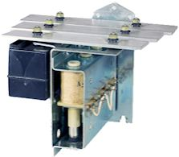
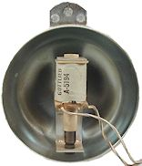

[#chimes]
=  Chimes and Bells

Next time you're watching a TV show or movie, and you notice a pinball machine being played in the background, pay attention to the sound effects. I can almost guarantee you that the sound effects will mimic the bells and chimes from a 1960s electromechanical machine, even if the on-screen machine is a 1980s or 1990s solid-state table. You and I know that those solid-state machines actually have electronic sound systems that include speech and music, but when you see them in TV and movies, the sound effects will almost always be EM chimes. Why is this weird technical gaffe so comically predictable? Maybe in part to avoid music licensing costs, but the main reason, I think, is that the sound designers know that those chimes are what most people think of when think of pinball. They're not going for technical accuracy with those sound effects; they're trying to create a sonic impression. EM chimes are the "audio icon" for pinball.

Which brings us to the topic at hand: chimes and bells in a virtual cab as physical feedback devices. Before the solid state machines came along in the 1980s, pinball machines made those iconic bings and bongs with little solenoid-driven percussion instruments. These instruments came in two main types. The first is known as a "chime unit", which is essentially a miniature xylophone consisting of three or four metal keys. The second type is bells, typically the circular half-shell type you might find in an old-fashioned alarm clock or fire alarm.

If you play only games from the 1980s and later, these will be of little interest to you. If you enjoy games from the electromechanical era, though, real chimes and bells can be a great enhancement. Recorded effects played through speakers can't approach the visceral impact of real percussion instruments.

== Chime units

A chime unit is a miniature xylophone played by solenoid-actuated hammers. The xylophone keys are metal bars tuned to selected musical notes, and each key has a solenoid positioned underneath with its plunger aimed at the key. When the solenoid fires, the plunger pops up and strikes the key, setting it ringing.

The chime unit pictured at right is a classic Gottlieb model, which was mass-produced and used in numerous Gottlieb EM titles throughout the 1960s and 70s. The black box at the back is a resonance chamber: an enclosed air space sized to resonate at each bar's fundamental frequency, to amplify the sound and make the ringing last longer. The resonance chamber is probably the most important part of the design acoustically, since it can make the notes sound richer and warmer by sustaining the ringing effect. Williams and Bally also manufactured chime units with similar basic designs, but Gottlieb's is widely considered to be the most sonorous, thanks to its particularly well-designed resonance box.

*What to buy:* The pinball manufacturers had a few standard chime unit designs that they mass-produced during the 1960s and 1970s. They stopped making the originals a long time ago, but you can often find used ones on eBay. There are also two modern reproduction models available for purchase (as of March 2022):

*  link:https://marcospecialties.com/[Marco Specialties] sells a 3-bar reproduction based on the Gottlieb units from the 1970s. Search for part number B-12023. About $300.
* McCullough's Chime Unit, available at link:https://www.chimeunit.com/[www.chimeunit.com] . This is apparently an approximation of the original designs, not an exact replica of any particular original. I haven't seen these in person; the reviews I've read are positive but say that they don't sound quite as good as the original Gottlieb units. About $150.

== DIY chime unit

Given the difficulty of finding an original chime unit and the high prices of the modern reproduction units, a few pin cab builders have at least explored the idea of building their own chimes from scratch. The basic design is straightforward, but the details are tricky enough that I don't think many people have successfully built them. I haven't attempted it myself, but it seems like an interesting project, so I'll pass along a few things I've learned from reading about other people's attempts. If you do build your own, I'd love to hear about how you went about it and how it turned out.

The basic components are:

* Metal bars to serve as the xylophone keys
* Solenoid hammers to strike the bars
* A resonance chamber to sustain the ringing effect

The solenoid coils are easy to find. You need nylon-tipped plungers for the coils to serve as the hammers; the ones used in replay knockers should work. You could just buy a replay knocker coil and plunger for each key, although knocker coils are probably overpowered; the original chime units had smaller 24V coils.

You can find replacement metal bars for the original chime units from online pinball vendors. It's also fairly easy to create your own from raw metal stock, which you can find at hardware stores or online. You just need to cut bars to appropriate lengths for the different chime tones. There isn't a simple formula for length vs. frequency, since many variables go into it; it depends on the type of metal as well as the thickness and length of the bar. Other things being equal, though, a longer bar produces a lower tone. You can find Web sites on the subject if you want to work out the math, but I think it might be easier to do some ad hoc experiments by cutting metal bars to different lengths until you find a pleasing set of tones.

Some additional tips:

* Use a solenoid plunger with a nylon tip, not a metal tip. A metal tip will make a sharp metal-on-metal sound; a nylon tip will just set the bar ringing, producing the bar's pure tone without any sharp contact noise.
* Support the bars with small rubber grommets, to minimize damping (you want the bar to ring after being struck). You can find purpose-made grommets as replacement parts from pinball vendors, but generic grommets from a hardware store will probably work just as well.
* Place the supports at two points, centered relative to the bar's width and inset from each end by about 22% of the total bar length. To find the exact positions, sprinkle some sawdust or salt evenly over the bar and give it a whack with a hammer. The dust/salt will settle at the nodes of the bar's acoustic vibration waveform, which are the exact points where the supports should go because they're stationary while the bar is ringing.

More on the acoustics of xylophone-type chimes: link:https://www.mmdigest.com/Gallery/Tech/XyloBars.html[www.mmdigest.com/Gallery/Tech/XyloBars.html] .

Aside from the xylophone keys, a good chime unit also needs a resonance chamber: a rigid box with an opening on the side facing the chime. This serves to sustain the ringing sound for a time after each hammer strike, which creates a more sonorous effect than the chimes alone. The size of the box has to be chosen according to the frequency of the adjacent chime, so each bar needs its own box. You can find formulas for calculating the resonant frequencies of chambers with various shapes in the Wikipedia article on link:https://en.wikipedia.org/wiki/Acoustic_resonance.html[acoustic resonance] .

The resonator boxes in the original chime units were made of some kind of hard plastic. I don't think the material is critical, as long as it's something rigid and fairly smooth, so that it doesn't absorb much of the sound energy. I imagine that you could make this work with 3D-printed plastic.

Here's a forum post about a DIY chime unit (using metal pipes rather than the more conventional bars):

link:https://www.vpforums.org/index.php?showtopic=43988.html[Homemade Tubular Pinball Chimes]

=== How many chimes?

Gottlieb and Bally each mass-produced their own three-chime units in the 1960s and 70s, and used them as standard parts in most of their games during that period. That makes the three-chime setup by far the most common in EM games you're likely to see re-created in the virtual systems.

In addition, Bally created a four-chime system that they used in a few machines from about 1976 to 1979. This wasn't actually a whole new design; it consisted of their pre-existing three-chime unit, plus a second unit with a single, extra-long chime bar installed. The combination extended the three-tone set to four tones, with the fourth tone being a new extra-low note.

DOF has a provision for a fifth chime bar as well, but as far as I can tell from reviewing link:https://www.ipdb.org/[IPDB] game descriptions and other sources, there were never any real machines that actually used a fifth chime. DOF's use of it appears to be entirely in the "fantasy" realm - an embellishment for virtual pin cabs, not something that replicates a real machine feature. So if you do install a fifth chime, it's completely up to you what tone it plays: there's no authentic reference point from the real machines for what it "should" sound like.

For a pin cab, I'd personally go with a three-chime unit. Only a few real games were made with the four-chime units, so the extra work and cost of a fourth physical chime probably isn't worth it to most people. And DOF's fifth chime slot is purely a DOF embellishment, and is only used by a handful of tables. You can always map DOF's fourth and fifth chimes to fire your other physical chimes, so you'll still be able to get something to happen when it fires, even though it won't be a distinct tone.

=== Musical notes

The real three-chime units typically play notes in the fifth octave, usually about two musical notes apart. If you're designing your own chimes, a good target set of notes might be C5, F5, A5. The extra chime on the Bally four-chime units is reportedly about a C4.

== Shell Bells

Chime units weren't the only type of percussion instrument in the EM machines. Some machines had "shell" bells instead: circular shell bells, with solenoids positioned to strike them at the edge. These bells are similar to those you'd find on a children's bicycle.

Machines equipped with bells usually had two of them, one larger and one smaller, to produce different tones. A common arrangement was one 3" bell and one 5" bell.

You can buy similar bells as replacement parts from the pinball supply vendors; look for "bell" and "bell assembly". You can also find these used on eBay.

You could also use any sort of similar bell, such as a bicycle bell, a bell from an old alarm clock or phone, from a fire or burglar alarm, etc. You can improvise your own firing mechanism using a pinball bell strike coil assembly, or using a cheap eBay push-type solenoid.

Chimes and bells were mutually exclusive in the real machines, as far as I've seen. They serve exactly the same purpose and worked the same way, the only difference being the shape of the ringing element. The pinball manufacturers probably chose whether to use chimes or bells in a given machine according to parts cost and availability, and perhaps the whims of the game designers.

For a virtual cabinet, should you install bells, chimes, or both? In my opinion, a chime unit should be your first choice. Chimes were by far the most common noisemaker in the real EM machines over the years, so a chime unit will create the most authentic simulation for most games; and a chime unit can easily stand in for shell bells for games that used those instead. My second choice would be a chime unit _plus_ a pair of shell bells (one large and one small), if your budget allows it and you have space in your cabinet. Shell bells do have a different tonal quality compared to chimes, so they'll add some variety to your EM games, and they'll give you better authenticity for games that used them.

If you do install shell bells, you can assign them to the *Shell Bell Large* and *Shell Bell Small* devices in the DOF Config Tool.

== Repeating bells

This isn't exactly in the same category as chimes, but it's related. A few real machines over the years have featured repeating bells, like the ringer in an old-fashioned telephone, or a fire alarm. The key is that the hammer rapidly hits the bell over and over as long as the bell is energized, rather than just hitting it once.

_Space Shuttle_ (Williams, 1984) has a bell like this that fires each time you complete the stand-up targets, and also serves as the replay knocker. _Taxi_ (Williams, 1988) also has a bell like this, which sounds when multiball starts or when you collect a jackpot.

You might be able to find the original bell unit for a game that featured one (such as _Space Shuttle_ or _Taxi_ ) from a pinball parts vendor. It might be easier to find some other electrically operated bell and adapt it, though. Look for "12V alarm bell" on eBay, for example.

The DOF Config Tool has a device type called *Repeating Bell* that you can assign to a physical device like this, if you install one.

== Bells as toppers

Large decorative bells make good backbox toppers. Some real machines used bell toppers as part of their theming, most famously _Fire!_ (Williams 1987).

You might be able to find the specific replacement part for _Fire!_ form a pinball vendor or used on eBay, but it's probably easier to find a random decorative bell with the right size and shape. As with the shell bells, you can improvise your own firing mechanism using a pinball bell striker coil assembly, or a cheap eBay push-type solenoid.

If you assign a decorative bell, you can assign it to the device named *Bell* in the DOF Config Tool.

== Installing in a virtual cab

If you found a chime unit (or built your own), it will probably be too big to fit in the backbox. In the original EM machines, these were typically mounted in the front corner of the main cabinet, under the plunger. I think they mounted them there simply because it was a convenient place to put them, not because it's a special spot in terms of acoustics, so install it wherever you have space available.

Bells were more typically mounted in the backbox. Again, though, I don't think there's any need to slavishly replicate this placement. Placing them in the main cabinet should also work if you don't have room in the backbox.

== Wiring

Bells and chimes are wired just like any other output device, as described in xref:feedbackWiring.adoc#feedbackDeviceWiring[Feedback Device Wiring] .

Each chime in a chime unit has its own coil, so simply wire each coil to a separate output controller port.

If you're using the Pinscape expansion boards, you can connect a chime or bell directly to any MOSFET Power Board or Chime Board port. If you're using an LedWiz, don't connect a chime coil directly to it, since these coils use more power than the LedWiz can handle; you'll need some kind of booster circuit to use chime with an LedWiz.

Always use diodes with coils. Diodes are required to protect your output controller and other electronics from interference from the magnetic field generated by a coil. See xref:diodes.adoc#coilDiodes[Coil Diodes] .

If you're using a repeating bell (the type where the hammer strikes repeatedly), it might cause more electrical interference than a regular coil does due to the way it operates. A ringing bell uses a mechanical switch in the hammer to produce the rapid repeat firing, by interrupting the power to the coil every time the hammer strikes. This mechanical switching action can inject a great deal of electrical noise into the circuit. If you have any problems after installing the bell with your other electronics (e.g., the output controller resets or disconnects from USB when the bell fires, or other devices fire when the bell fires), try adding a small capacitor (maybe a 0.1uF disc capacitor) in parallel with the coil diode. If possible, place it directly across the mechanical switch terminals inside the bell; if you can't do that, place it physically close to the bell's electrical terminals.

== Timer protection circuits

Pinball coils like those used in bells are designed to be fired in short bursts only. They'll overheat if they're energized for long periods. Under normal conditions, this isn't a concern for chime coils, since games that use chimes should naturally fire them in short bursts, exactly as they're designed to be used. However, PC software sometimes has bugs or glitches, and one of the things that can happen when something goes wrong on the PC is that an output port can get stuck on. This can destroy a pinball coil if it's not quickly fixed.

The Chime Board from the Pinscape expansion boards has a dedicated hardware timer for each output to protect against exactly this failure mode. If you're using the Pinscape boards, it's recommended to use Chime Board outputs for chimes and bells.

Note that this doesn't apply to repeating alarm-type bells, since those are intended to fire for a longer periods.

If you're using the Pinscape software but not the Chime Boards, you can still get some of the same protection by using the "Flipper Logic" feature for your chime ports.

See xref:coilTimers.adoc#coilTimers[Coil Timers] for more details.

== DOF Setup

In the link:https://configtool.vpuniverse.com/[DOF Config Tool] , go to the Port Assignments page. Find the port numbers where you wired your chime/bell coils. Assign to the appropriate DOF devices:

*  *Chime Unit High Tone* through *Chime Unit Low Tone* are for traditional three-bar chime units. Assign the shortest bar to *Chime Unit High Tone* , since the short bar has the highest-pitched tone. Assign the remaining bars in descending tone order.
*  *Chime Unit Extra-Low Tone* is for the fourth chime in the Bally four-bar chime units from the late 1970s. If you have a fourth chime bar, assign the *Extra-Low Tone* DOF slot to the physical bar that produces the deepest tone (the one with the longest bar). If you have a more typical three-chime unit, you can assign this DOF slot to the same physical chime as your "Low Tone" port.
*  *Chime 5* is an extra DOF chime that doesn't correspond to any physical chimes from any real machines, but is used as a DOF embellishment for a few tables, to add some extra variety to their sound effects. If you have a fifth physical chime device, you can assign it here. If not, you can assign this to the same physical device as one of your other chimes. Very few games use this, so you won't miss much if you just leave it unassigned.
*  *Shell Bell Small* and *Shell Bell Large* are for shell bells like those found in some 1960s machines (see link:http://mjrnet.org/pinscape/BuildGuideV2/shellBells[shell bells] above). These work exactly like chimes, but use circular metal bells rather than bars as the ringing element, for a different tonal quality.

If you install physical shell bell devices, assign them to these DOF slot. If you don't have physical shell bells but you do have a chime unit, assign *Shell Bell Small* to your shortest chime bar, and assign *Shell Bell Large* to your longest chime bar.

*  *Repeating Bell* is for a bell that rings continuously when energized, like on an old-fashioned telephone (see link:http://mjrnet.org/pinscape/BuildGuideV2/repeatingBell[repeating bell] above). If you have such a device, assign it to this slot. Since this slot is specifically for repeating bells, I wouldn't map it to any other single-firing chimes or bells; I'd just rely on the digital sound effects recordings in the games instead for this one.
*  *Bell* is intended for a large novelty bell of the sort found as the backbox topper on _Fire!_ If you have a device like this, assign it here. If not, and you have chimes or shell bells, I'd assign this slot to fire the one with the deepest tone.

