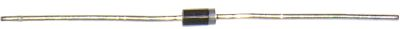
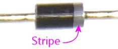
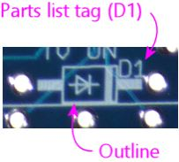
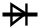
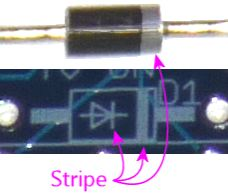
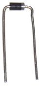
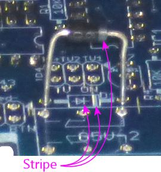
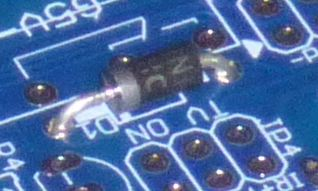
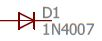
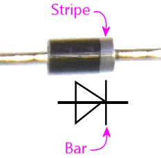

[#cmpdiodes]
= Diodes

The diode is perhaps the most fundamental semiconductor component. It serves as a one-way valve in a circuit, allowing current to flow in only one direction.

If you've looked at installing any tactile feedback devices for your system, such as solenoids or motors, you've probably already run into one common use of diodes in pin cabs, which is to block the harmful "flyback" current that coils produce when switching off (see xref:diodes.adoc#coilDiodes[Coil Diodes] ). Diodes have many other uses as well, such as voltage rectification (converting AC current to DC) in power supplies, and as components in logic circuits.

Physically, a diode typically looks like a small black cylindrical body with wire leads sticking out of each end.

== Orientation

Diodes are polarized (they have a "+" end and a "-" end), so it's important to orient them correctly when installing in a circuit.

The standard convention is that the "-" end of the diode is marked with a painted stripe - a ring around the cylinder. It's usually a white stripe to contrast with the black case, although sometimes the ink is so thinly applied that it comes out a pale gray. You might need a bright light to see it. I had to artificially increase the contrast in these photos to make the stripe apparent.

== Installing in a circuit board

The circuit board install location for a diode is marked with a little outline of the diode as seen from above when installed, showing the cylindrical body, and lines extending on either side to represent the wire leads. The lines extend to the solder pads where the diode is to be installed.

This looks very similar to the outline for a resistor, so to help clarify that it's a diode, the outline has the schematic symbol for a diode inside:

This symbol is also there as an orientation marker, so pay close attention to it! The stripe on the diode goes on the side with the stripe in the picture:

As with resistors, a diode's wire leads usually start out sticking straight out from the body, so you have to bend each lead at a 90° angle to fit it through the closely-spaced holes in the circuit board. You can bend the leads by hand, or use needle-nose pliers if you want a sharper corner, which can make for an easier fit on the board. Use the spacing of the holes on the circuit board to determine where to bend the leads - usually they have to bent as close to the body as you can get.

With the leads bent to fit the hole spacing in the circuit board, fit the ends of the leads into the holes in the solder pads, then feed the leads through until the diode is seated flat against the board. As always, you should get it as close as comfortably possible, but don't force it.

Be sure to orient the diode properly! Remember, the stripe painted on the aligns with the stripe in the circuit board outline, and also with the "bar" in the diode symbol printed on the board.

With the diode seated - and after you've double-check the orientation! - hold the diode in place, flip the board over, and solder the leads to the pads on the bottom side of the board. Snip the excess length from the leads after the solder cools.

== On schematics

A diode is represented by a symbol like this on a schematic:

This is meant to represent the diode's one-way-valve property; the arrow points from positive to negative, and the little bar indicates the barrier to reverse flow.

When relating the schematic symbol to an actual diode, the key is to line up the bar on the schematic symbol with the stripe on the diode body.

The diode symbol on a schematic should always be accompanied by a reference designator, usually a "D" number (D1, D2, etc), "D" for diode. As always, this is just an arbitrary name for looking up in the parts list and doesn't mean anything by itself.

You'll also usually see (as we do here) a part number for the diode, in this case 1N4007. Many diodes have generic "1N" numbers, indicating a common type of diode that's made by multiple manufacturers to the same specs.

(If you've taken a high school physics class, you probably know the jaded history of this symbol and how it points in the "wrong" direction in a physical sense. During the early days of electronics, it was believed that the charge carriers in an electronic circuit were positively charge ions, so the convention was to draw diagrams showing current flowing from positive to negative. It was later discovered that the actual moving particles are electrons, but everyone agreed it would be too confusing to change, given all of the existing literature based on postive-to-negative current flow. So we still use those original conventions to this day, even though everyone now understands that the electrons are actually traveling _against_ the arrow. Engineers today just make the reversal mentally whenever they have to think about the physics of it. At least they're consistent: the same wrong-way-arrow can be found throughout electronics symbolism, such as in the symbols for transistors and MOSFETs.)

== Selection

Unlike resistors and capacitors, diodes don't have any simple "unit" that describes them. So instead, schematics and parts list will specify a particular diode to use, by part number.

Part numbers starting with "1N" are common, generic types of diodes that are made by multiple manufacturers to the same specs. There are also less common diodes manufactured for specific properties by one company, so you might see specific manufacturer part numbers instead of "1N" numbers as well.

In any case, use the part number to search at Mouser or another vendor to find matching parts. It's always easiest to go with an exact match, but in some cases, you might find cross-references where the manufacturer says that a different part can be substituted for the part you're looking for. These substitutions are usually listed in tables in the data sheets, so searches on vendor sites might not turn them up, but Google searches might. You can try search terms like "1N4007 equivalent" if you have trouble locating the exact part you're looking for.

