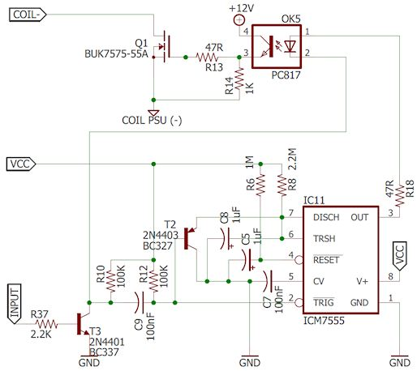

[#coilTimers]
= Coil Timers

If you're using any real pinball coils in your virtual pin cab, you might want to consider using some kind of "time limiter" circuit with them. The reason is that most types of pinball coils are only designed to be energized for very brief intervals, typically just a fraction of a second at a time, and can overheat if energized for too long at a time. Overheating will melt the wire inside the coil and destroy the device.

Examples of pinball coils where this is an issue:

* Replay knocker
* Bumpers
* Slingshots
* Chime units

This is actually a fairly common property of solenoids in general, not just pinball coils, so it might apply to your pin cab if you're using other types of devices to simulate any of the above:

* "Open frame" solenoids bought on eBay or elsewhere
* Automotive starter solenoids

== How a time limiter circuit works

A time limiter circuit can be used as a fail-safe to protect your coil devices against getting stuck on for long periods. A time limiter adds some special additional circuitry to an output controller port that automatically limits the amount of time the port can be "on" continuously. If the port stays on for longer than the limit, the timer circuit forces the port to turn off, overriding any software signal to the contrary.

The reason to implement this with a hardware timer, rather than with some kind of software fix, is that the main thing we're worried about is software failure. A separate hardware circuit won't be affected by any errors or crashes in the software.

The Pinscape expansion boards include built-in time limiters for the Replay Knocker port and for all ports on the Chime boards. You can add your own custom timer to any other type of output controller as well, which we'll describe below.

== Why this is a concern

There are two places in a virtual cab where coil overheating can be a problem: flippers, and everywhere else.

For flippers, it should be fairly obvious why this is an issue. The player can keep a flipper button pressed indefinitely to trap a ball, consider a shot, have a beer... The flipper coil will stay energized this whole time. It might seem like a typical player wouldn't typically hold the button on all _that_ long, but it's not the typical case we have to be concerned about. We have to consider the longest time that anyone will ever leave hold the button on, since all it takes is that one time to fry the coil.

For bumpers, slingshots, replay knockers, chimes, and everything else, there's no reason in _normal_ operation that any of these will ever stay on for more than a brief instant at a time. So it might seem like you don't have to worry about them. But you do, because of the chance of abnormal operation. Specifically, the devices in a real cab are controlled by software, and software can fail unexpectedly. There's a particular failure mode in Visual Pinball where VP can crash just after turning on a device, leaving the device stuck on until the user can intervene manually. This isn't just a random fluke, either; if it were, it wouldn't be likely enough to worry about. The reason it's a concern is that it's relatively likely to happen in this particular way (device turns on, then VP crashes) because of the way VP scripts are constructed.

=== Devices that you _don't_ have to worry about

Not all coils or solenoids have this problem:

* Contactors. These are large electrical relays designed for high-power switching applications. They're specifically designed to be activated continuously for indefinite periods (even for months or years) without overheating. They're popular for simulating flippers in virtual cabs for exactly this reason.
*  *Older* pinball flipper coils, for machines made before about 1990. On the real machines, they had to deal with exactly the same issue that we do when it comes to the flippers: the player can press the button and hold the flipper on for long periods. So the pinball manufacturers came up with various ways to prevent the coils from overheating. The technique they used up until about 1990 also works well on virtual pin cabs, so flipper assemblies for those older machines are usually safe to use on a pin cab without any special timer protection. See "Flipper assemblies" below for more on the different types.
* Some other solenoids. Some non-pinball solenoids are built for long duty cycles and others aren't. If you have a data sheet for your device, it might list the maximum continuous "on" time or maximum duty cycle. If not, you can test it. Apply power and carefully monitor the device's temperature. You don't need a thermometer; it's enough to check if it's getting hot to the touch. If it starts getting hot, cut power immediately. If it got hot in a few seconds, you definitely want to do something to limit the device's "on" time. If you can leave the device continuously on for a few minutes and it's not getting noticeably hot, it should be safe to use without any time limiter. If it's somewhere in between, you should err on the side of caution and limit its "on" time.

====  Flipper assemblies

As mentioned above, _some_ flipper assemblies are safe for use in virtual pin cabs, without any special timer protection. Real pinball machines have to deal with the same problem we do when it comes to flippers - that the player might press and hold the button for long periods. The manufacturers came up with a variety of solutions over the years.

The standard approach for many years was to use *two* coils for each flipper: a high-power "lift" coil and a low-power "hold" coil. The lift coil fires briefly when you first press the button, to carry out the the rapid "flip" action. As soon as the flipper is all the way up, the lift coil cuts out, and the low-power hold coil takes over, to keep the flipper flipped while you hold the button. The hold coil had much less lifting power - just enough to hold the flipper up. Less power means less heat, so the hold coil stays cool enough that you can leave it activated indefinitely. Problem solved.

Note that the two coils were always wound together into one physical unit, so it _looks_ like there's only one coil involved. The giveaway is that the coil has three terminals instead of the usual two.

Up until the early 1990s, the two-coil flipper assemblies switched between the "lift" and "hold" coils using an end-of-stroke switch embedded in the flipper assembly. The coil was wired directly to this switch. When the flipper flipped all the way up, it hit the switch, cutting off the lift coil power and activating the hold coil power. This system works well in virtual pin cabs, since the flipper assembly itself takes care of switching between the two coils.

Starting in the 1990s, Williams changed to their "Fliptronic" system. This also uses the two-coil design, but the end-of-stroke switch is no longer wired directly to the coils. Instead, it's wired to the CPU, and the CPU decides when to switch between the two coils. The Fliptronic assemblies *aren't* safe with a virtual machine, because the coil switching is no longer part of the flipper assembly - it has to be directed by the software. The pinball emulators on the PC don't have the necessary programming. If you connected one of these newer Fliptronic assemblies to DOF, DOF would just leave the "lift" coil on the whole time, and we'd be back to the overheating problem.

Newer Stern flipper assemblies also aren't safe for virtual pin cabs, because they use an even newer design that uses just one physical coil and uses software to reduce the coil power during the "hold" period.

To see if you have a "safe" flipper assembly using the two-coil design, first check to make sure there's an "end-of-stroke" switch. If there's not, you probably have a newer Stern assembly that's not safe for virtual use. If you _do_ have an end-of-stroke switch, inspect its wiring. Check that it's wired directly to the flipper coil. If it's only wired to an external connector, you have a newer Fliptronic assembly that's not safe for virtual use. If it's wired directly to the coil, you have the older type that _is_ safe for a pin cab.

If you have one of the newer types, don't panic! There's still a way you might be able to make it work. If you're using the Pinscape boards, you can enable the Pinscape "Flipper Logic" feature, which uses the same PWM power reduction approach that the newer Stern machines use. Flipper Logic is handled directly in the Pinscape firmware, so it doesn't require anything on the PC to be aware of it, meaning it's compatible with all PC software that can access the flippers at all. See "Flipper Logic" xref:#flipperLogic[below] for more details.

=== Pinscape expansion boards

The replay knocker output on the main Pinscape board has a time limiter circuit built-in. All outputs on the Chime boards feature the same time limiter. (The time limiter is the whole point of the Chime boards.)

Connect devices to the timer-protected output ports exactly the same way you would connect devices to any of the other Pinscape output ports. The timer function is built into the port's hardware and is always active. There's nothing to configure and no software setup required.

The timers on these output ports cut off power after about 2 seconds of continuous "on" time. They automatically reset as soon as the port turns off.

The short time limit is designed for devices like replay knockers, chime units, bumper coils, and slingshot coils. In normal use, these devices always fire momentarily. The instant reset allows the devices to be fired in quick succession, such as when the ball is bouncing rapidly back and forth between two bumpers.

=== DIY time limiter circuit

Here's the schematic for the coil timer circuit used in the Pinscape expansion boards. This is a standalone circuit that doesn't depend on anything else on the expansion boards; it can be used with any type of microcontroller to control just about any kind of coil.

External connections:

*  *VCC* is the positive voltage supply for the microcontroller. This circuit will work equally well with 3.3V and 5V microcontrollers.
*  *GND* is the "ground" for the microcontroller power supply. Connect this to any GND pin on the microcontroller.
*  *Input* is the GPIO pin on the microcontroller that will be controlling the device. This is a *high* trigger circuit, meaning that the GPIO line must be driven high (to VCC voltage) to turn the coil on.
*  *COIL-* is the negative terminal of the coil to be controller. Connect the other terminal of the coil directly to the coil power supply's positive voltage.
*  *COIL PSU (-)* is the coil power supply's negative or GND terminal.

This circuit is designed to be used with a microcontroller, so the input takes a "high" voltage value (the same voltage as VCC) to turn the coil on.

The circuit as shown includes a high-current MOSFET that controls the coil, so you can connect this circuit directly to the coil without any external relays or amplifiers needed. The MOFSET shown in the schematic will handle 14A at 55V, which is enough for any pinball coil.

*Adapting for LedWiz use:* The circuit could be adapted for use with an LedWiz or similar device, but I'm going to leave this as an exercise to the reader, because I haven't actually built or tested an LedWiz interface version. There are two changes you'd have to make:

* First, you must change the input to trigger on a "low" voltage value, since that's how the LedWiz signal works. You can do this by adding an optocoupler to the input stage. Connect the optocoupler LED anode (+) to +5V, connect the cathode to a 100Ω resistor, and connect the other end of the resistor to the LedWiz output. Connect the Input line in the schematic above to the optocoupler emitter, and also connect it to ground through a 1K resistor. Connect the optocoupler collector to +5V. Use +5V for VCC throughout.
* Second, you'll have to "smooth out" the PWM signal produced by the LedWiz. The circuit is designed for a simple digital logic high/low GPIO output from a microcontroller. The LedWiz produces a pulsed signal that's never 100% on. Every pulse will reset the timer circuit, which will prevent the timer from ever expiring, which will defeat the entire purpose of the timer. To overcome this, I think you could use a simple low-pass filter on the input from the LedWiz. I think a simple first-order filter, with one resistor and capacitor, would do the trick. You'd have to choose the filter parameters according to the actual controller device you're using; the LedWiz PWM runs at about 50 Hz.

If you successfully build and test an LedWiz-compatible version of the circuit, I'd really like to hear about it! Send me the actual circuit that you got working and I'll publish it here instead of this "exercise for the reader" dodge.

=== Pre-built timer device

You can buy a pre-built timer device on eBay that provides similar functionality, and put it in your output circuit between your output controller and the coil you want to protect.

The product offerings and sellers on eBay are constantly changing, so I can't provide you with a link to a specific product; if I did, it would just be a dead link by the time you read this, and that wouldn't be very helpful. So I'll have to tell you how to search for it yourself. I'll warn you, though: this will take some persistence on your part, and maybe some trial-and-error buying, because the relevant eBay listings can be difficult to decipher. The products you're looking for will all be from Chinese sellers who don't always write perfect English ad copy on their pages.

The basic search term that usually works best is:

*multi-function relay timer board*

In very vague and general terms, you're looking for:

* a relay to control an output
* with adjustable timers
* and a big list of different timing modes

These will usually have 15 to 20 different "modes" or "functions" listed. They'll say things like "Function 1: timing on: after power, time delay pull relay T1, between adjustable 0.1 seconds 270 hours, CH1 interface to high level signal, repeat function", and then a giant list of similar tortured sentence fragments.

That much is pretty easy to find on eBay. What's a little harder is making sure that the list of 15-20 modes includes the exact mode we're looking for. In my experience, anything that has a big list of modes like that _will_ have the right mode in there somewhere, so if you're feeling lucky and don't want to make your brain hurt parsing Google Translate output, just buy one and give it a try. But if you don't want to risk the $20, you'll need to scan through the modes and verify that there's one that does what we need.

So I'll try to describe the specific mode you need, in terms that hopefully _are_ comprehensible. *Don't* look for my exact words. I'm trying to use sensible English, which the ads generally don't. I'm trying to give you an understanding of what the mode is actually supposed to do, on the theory that if you can internalize this with a solid mental model of the desired function, you'll have a better chance of fitting the poor descriptions on eBay to your good internal understanding. So here's what you're trying to accomplish with the device:

* You fire a trigger signal (by "you" I really mean "the LedWiz" or whatever: the point is that the signal is being fed into the relay board from an external source)
* In response to the trigger signal, the relay board immediately turns the relay output on
* After a timer expires, the relay board turns the output off, _even if the trigger signal is still on at that point_
* When the trigger signal turns off, the cycle resets, so that the board is now ready to receive a new trigger signal and start the whole process over

As an example, here's some actual verbiage I just pulled from a random eBay ad for a random device that does what we're looking for:

Function 14: Disconnect and then pull the trigger timing: After power relay does not act, a high-level interface to CH1 pulse signal, immediately pull the relay, the relay off delay time T1 after arrival; T2 arrive after disconnecting time relay, delay time between T1 and T2 in 0.1 seconds -270 hours adjustable, repeat CH1 interface to a high level pulse signal, repeat the above functions;

Again, _don't try to look for these exact words_ . This is just one example. Every eBay seller will use their own words for this, and they'll all be different, and they'll all be bizarre and hard to read in their own way. But let's pull this particular example apart, as a practice exercise and to help illustrate how this relates to the functions we're looking for:

* "After power relay does not act": this is telling you that the timer doesn't do anything special when first powered on. Weird that they say what it _doesn't_ do, right? Well, they're just spelling this out because a lot of the other functions of these boards _are_ all about doing something special when the power first comes on. So they're trying to be helpful by saying explicitly that this function isn't related to the power initially coming on.
* "...a high-level interface to CH1 pulse signal": this is the user-generated trigger signal. "CH1" probably stands for "channel 1", which is the input that you'd connect to the external signal source, such as the LedWiz output we want to use as the control. Some of these boards have more than one trigger input, so they might have "CH1" and "CH2" for the two inputs. We only need one input for our purposes, but if the board has two or more, that shouldn't be a problem, as long as there's a mode that operates on the basis of a single input. This particular mode's description doesn't say anything about any other inputs being involved. "High-level" means that the board's input terminal senses the trigger when the connected voltage goes "high", meaning it goes from 0V to 5V or whatever the supply voltage is.
* "...immediately pull the relay": the relay turns on. Just what we want. I'm not sure why the verb is "pull"; maybe they're thinking of the relay's magnetic coil turning on and tugging on the switch contacts to toggle the switch. I bet it makes more sense in Chinese. The Google Translate round trip probably looks hilarious when you translate it back.
* "...the relay off delay time T1 after arrival": the relay turns back off after a delay. "T1" is one of the programmable delay times.
* "T2 arrive after disconnecting time relay...repeat": everything resets after the further delay time T2, also programmable. In other words, you get a forced "off" time of T2 before you can fire the relay again. That's not part of what I said to look for, but we can effectively ignore this by setting T2 to a very short delay time (minimum 0.1 seconds according to this ad).

*High-level inputs:* As with my "DIY timer circuit" above, most of these relay boards require a "high-level" input, meaning that they trigger when the input signal changes from 0V to 5V (or whatever the logic voltage is for the board). And as I mentioned with my DIY timer circuit, that's the opposite of how LedWiz's work. See "Adapting for LedWiz use" in the DIY timer circuit section above for some pointers on interfacing to an LedWiz.

=== Slow-blow fuses

"Slow-blow" fuses are designed to perform a similar function to the type of timer we've been talking about. Rather than blowing immediately on overload, a slow-blow fuse is designed to tolerate an overload for a certain amount of time, eventually cutting off power if the overload goes on too long.

I'd consider a slow-blow fuse to a be a good back-up to a timer. Add one if you want to be extra-cautious, just in case the timer doesn't do its job. But I wouldn't consider a fuse to be a good replacement for a timer. The problem with fuses is that they're not precision devices; they don't blow after precise time periods or when exact loads are exceeded. You can count on a timer to have precise timing characteristics; you can't expect the same thing from a fuse. And, of course, fuses are expendable, and must be replaced if they ever actually do stop an overload; a timer can be triggered over and over without any harm done.

See xref:fuses.adoc#fuses[Fuses] for information on selecting slow-blow fuses and how to predict their timing and loading properties. That chapter includes a section on pinball coils and how to select appropriate slow-blow fuses for them.

[#flipperLogic]
=== Pinscape "Flipper Logic" setting

The Pinscape Controller firmware has a Flipper Logic feature that can be used to provide similar timer protection at the controller firmware level.

The Flipper Logic feature is implemented in software, so I wouldn't consider it as bulletproof as a dedicated hardware timer. Software is just categorically less reliable than hardware. But I'd consider it far more reliable than software on the PC, since it runs in the KL25Z, which is a much more isolated and controlled environment. So it's a good first line of defense, and much better than nothing. If you're using the Pinscape software, and you don't want to go to the extra trouble and expense of implementing hardware timers, you can greatly reduce your coils' exposure to overload by enabling the Flipper Logic feature for them.

*What Flipper Logic does:* The feature wasn't actually created as an alternative to coil timers, but it can serve that purpose anyway.

What it was actually created to do was to emulate the "lift" and "hold" power settings in real pinball machine flipper assemblies. As we mentioned above, most real pinball flippers generally use two physical coils, a high-power "lift" coil, and a low-power "hold" coil, which are engaged, respectively, as the flipper is first activated and then held.

Some newer Stern machines do the same thing with a single physical coil, simulating the low-power "hold" coil by reducing power to the main coil. That's exactly what Flipper Logic does. Flipper Logic provides full power to a port for a given initial interval immediately after the port is first activated, and then reduces power to a lower PWM level if the port is kept on beyond that initial period.

*How to use it as a coil timer:* The trick to using this as a software coil protection timer is that the "hold" power can be set to zero, cutting off power to the coil entirely. When the hold power is set to zero, it's effectively the same thing as a coil timer. The only difference is that it's implemented in software rather than as a dedicated hardware circuit.

*How to use for flippers:* For flipper emulators, you don't want the flippers to un-flip when the time limit expires. You want them to act like real flippers and stay flipped, just with reduced "hold" power, to avoid overheating. So you want to find lowest hold power level that keeps the solenoid activated. The required power level is a function of the specific coils or solenoids you're using, so you'll have to experiment. Start at the lowest setting, and turn it up until the flipper stays flipped. Once you find that level, test it to make sure it doesn't overheat the coil! Carefully monitor the coil while holding the flipper on - you can just check to see if it's getting hot to the touch. If it stays cool after being on for a couple of minutes, it should be safe indefinitely. Note that a little heating is okay, but it shouldn't ever start feeling hot.

*Enabling Flipper Logic:* Flipper Logic can be enabled individually on each output port via the Pinscape Config Tool. Go to the Settings page and scroll down to the Output Ports section. In each port, you'll find a little "flipper" icon in the group of control icons at the right side of the page. Click the flipper icon. This will let you enter two parameters: the initial full-power time allotment, and the "hold power" PWM level. To use this as a coil timer, set the initial full-power time to a suitable value (around 500ms should be good for any momentary device like a bumper, slingshot, knocker, etc), and set the hold power level to 0.

Remember to click "Program KL25Z" after you've finished making changes, to save the new settings to the controller board.

