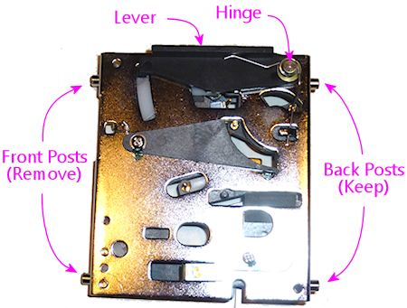
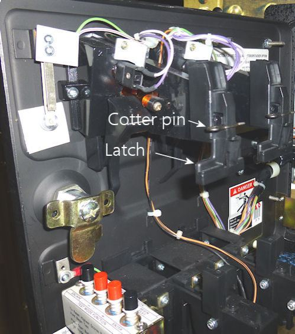
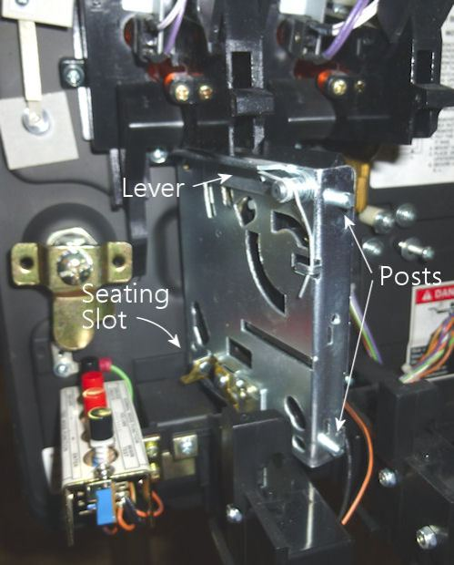
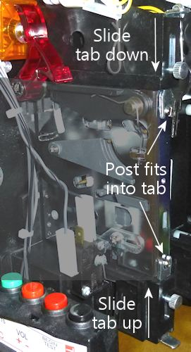
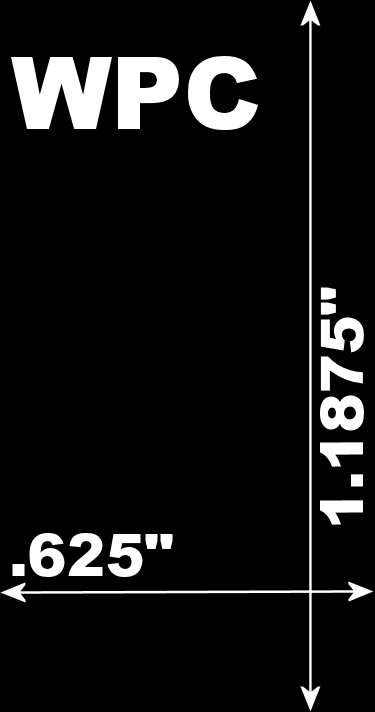
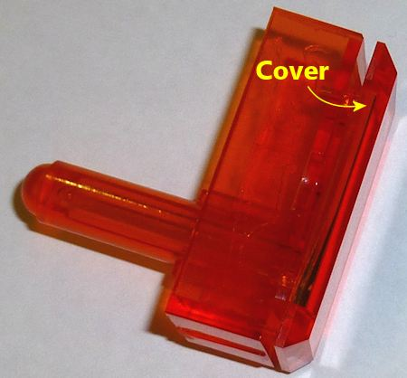
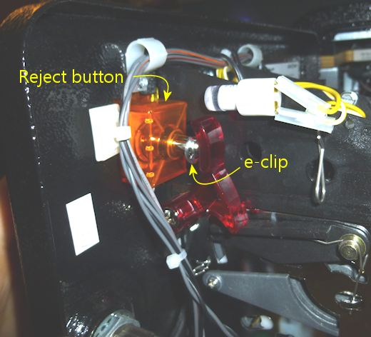
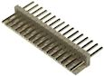
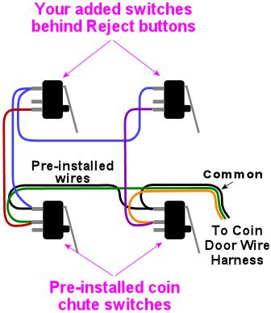
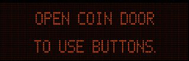

[#coinDoor]
= Coin Door

image::images/CoinDoor.png[""]
If you want your pin cab to look authentic, a standard coin door is a must.
The coin door has been a fixture on pinballs since the 1950s, and the design has been fairly uniform since the 1980s.
It's so ubiquitous that I'd consider it part of what makes a pinball machine look like a pinball machine.
Even if you haven't taken conscious notice of the coin doors on real machines up until now, you've probably seen them often enough that you'd notice that something was missing if you didn't include one on your virtual cab.

Beyond the cosmetic value, the coin door also has some practical, functional features that make it worth including.
If you've only experienced pinball as a player, as opposed to as an owner or operator, you probably only see the coin door as the place you feed in quarters.
But for a machine you own and operate, which your cab will be, the coin door actually has some other important functions.

For one thing, the coin door is the access port for opening the machine up for maintenance work.
Opening the coin door lets you access the lever that releases the lock bar, which in turn lets you take off the top glass, which in turn lets access the playfield, and (on a real machine) lift up the playfield to get access to its underside and to the interior of the cabinet.

The coin door is also the place where you'll find the "service buttons": a cluster of three or four push-buttons inside the coin door, which are let you access the operator menus in ROM-based tables.
These menus are where you set the game options: Free Play mode, 3 ball or 5 ball mode, replays as extra balls, and so on.
In a virtual cab, you can always use your PC keyboard to access the menus, so the physical menu buttons inside the coin door aren't absolutely required, but I think they're a lot more convenient.

The inside of the coin door is also an excellent place to conceal any added custom controls of your own.
Some people put the volume knob for their audio amplifier here, for example.
It's obviously not a great place for anything you'll access frequently, but it's ideal for any operator controls that you only need to access once in a while for setup purposes.

Finally, the coin door is useful for its nominal purpose as the place to insert coins.
Even for a virtual cab, it's useful to be able to feed in quarters - either for real or in a virtual way, such as by pushing a button.
In either case, the coin door is the ideal place for the coin chutes and/or coin buttons.
The reason it's important to have some kind of coin feature in a virtual cab is that some tables don't have a Free Play mode, so the only convenient way to play them is to make them think you're adding quarters.
The early solid-state ROM-based games in particular tend to have very primitive software with few or no configurable options.
A lot of the older EM (electro-mechanical) tables also lack coinless play options, although for those you can at least add it yourself via scripting.
In any case, it's nice to have an easy way to add coins to deal with tables you can't set to Free Play.
One way is to make the physical coin chutes functional, and another is to add a button that simulates inserting a coin.
I personally like having both options.
Both approaches are covered later in this chapter.

== Buying a coin door

If you're salvaging an old pinball machine to use as your cab's body, and it already has a coin door installed, you're set.
If you're building a new cab from scratch, you can buy a new pinball coin door from an arcade parts supplier (see xref:resources.adoc#resources[Resources] ).
You can also look for used ones on eBay, although as always, check prices for new parts first: used pinball parts on eBay tend for whatever perverse reasons to be more expensive than new ones.

One really nice feature when you're buying a coin door is that most of the different types can be used interchangeably, since they're all designed to fit the same cutout.
They've been using a standard size since about the mid 1980s.
Doors designed for Data East, Stern, Williams, and Bally machines will all fit the same the standard cutout, as long as they're for machines from the 1980s or later.
However, the different makes do have some differences on the inside, such as the type of service buttons and the type of wiring plugs used.

Here are the top options currently available commercially:

* Williams/Bally WPC-era coin door, Williams part numbers 09-17002-26, 09-23002-1, 09-37001, 09-46000, 09-61000-1, 09-61000-1, and 90-96017.
These typically come fully assembled, with the lock and key, slam tilt switch, brackets for two coin mechanisms, coin chute lamps, coin switches, and service buttons.
All of the electronics are pre-wired to a 13-pin connector.
The only parts not included are the coin mechs (the little Rube Goldberg devices that check inserted coins to make sure they're real).
You can buy those for about $10 apiece and pop them into the chutes if you want to be able to use real coins.

This is the door I used on my cab.
I like it because it exactly replicates the look of the Williams 1990s machines, which is the cohort that includes most of my all-time favorite games.
It does have a couple of downsides, though: it's more expensive than the SuzoHapp door below, and the design makes it way more difficult than it should be to replace the coin inserts (the little lighted coin chute labels saying "insert quarters").

WPC coin door (with my custom Pinscape coin slot inserts!)

* SuzoHapp universal coin door, manufacturer part number 40-0696-30.
This is a third-party replacement part compatible with OEM parts for almost any machine from the mid 1980s or later.
It's also the factory-installed part on some of the newer Stern and Jersey Jack machines.
This one comes with all of the coin slot hardware installed, including the coin mechs (for quarters), but it doesn't have any pre-installed wiring and doesn't include service buttons.

This is my top pick for the DIYer.
It's about 40% cheaper than the pre-assembled Williams door above, and it's functionally equivalent after you add the service buttons.
The lack of pre-installed wiring might actually be a plus in a pin cab, since you can wire it with your own connectors instead of the obscure Molex connector used on the WPC doors.
The design is also nicer in some ways than that of the WPC doors: it's easier to install the coin mechs in this door, and it's _much_ easier to install custom coin slot inserts.
The only downside, really, is that it doesn't look exactly like the original WPC doors, although it's close enough that most people wouldn't know the difference.

If you want service buttons (which I think you do!), you can easily add them as an extra part.
Buy the *Stern 4-button service assembly* (part number 515-1963-00).
Note that there's a similar service button panel designed for the WPC doors, but it has a different mounting bracket that won't fit this door, so be sure to buy the Stern version.
You get the same set of buttons with either assembly, so there's no functional difference; it's just the mounting hardware that's different.

One other minor feature missing in this door vs.
the WPC door is a slam tilt switch.
You can add that separately if you want 100% parity with the Williams door.
I personally don't see any functional reason to include a slam tilt switch on a virtual cab, since it's only present on the real machines to discourage extreme abuse that you'd never subject your home machine to.
But you can certainly include it for the sake of completeness if you like.

SuzoHapp coin door, also used on most modern Stern machines

* Stern coin doors, for SAM machines (Stern part 501-5018-172) or SPIKE machines (501-5018-173).
SAM and SPIKE refer to the last two generations of the Stern platform, not to specific table titles.
These are functionally about the same as the Williams door listed above.
The main difference from the Williams door is that these use different connector plugs for the electronics.
The SPIKE version is actually the same equipment as the SuzoHapp option above, but adds pre-installed service buttons and wiring.
* Data East coin door.
These come bare-bones, with nothing installed except for the key and the basic coin slot brackets (no coin mechs).
As a result, they're cheap.
They're a good budget option if you only want the facade of a door (without all the functional bits) for cosmetics.
I wouldn't recommend this if you _do_ want all of the functional elements, though: you probably won't save any money after adding all of the parts it's missing compared to the turn-key options above, and it'll be a lot of hassle to source the parts and assemble everything.
* Smaller video game coin doors.
If you're building a mini-cab, the regular pinball coin door might be too large.
There's a narrower type of door commonly used in video games.
Try link:https://suzohapp.com/[SuzoHapp] for a variety of options.
* Fakes/Decals.
If you only want the cosmetic effect of a coin door without any functionality, you could use a 3D-printed plastic façade, or simply a custom-printed decal with a photo of a coin door (see xref:cabArt.adoc#cabinetArt[Cabinet Art] for more on decals).
This might let you squeeze out a little cost if you're on a tight budget, or if your cab is too small for a real coin door.

[#coinMechs]
== Coin mechs

Coin "mechs" (mechanisms) are the gadgets that validate coins inserted through the slots in the door.
These use a modular design, with a standardized physical form factor, that lets you swap in mechs for different types of coins or tokens.
If you want to use quarters, you install a mech that takes quarters; if you want to accept arcade tokens, you install a token mech.

Your new coin door assembly probably came without any mechs installed - just empty brackets where the mechs go.
So if you want your pin cab to accept quarters or other coins, you'll have to buy the mechs separately and install them in your coin door.

US coin doors (anything from the 1990s to present) are almost always set up with two coin slots fitted with brackets for the standard coin mechanisms.
The pinball vendors (Pinball Life, Marco Specialties) sell mechs that accept US quarters.
Those run about $10 each.

You can also find mechs that accept other coin types besides US quarters, but not at the pinball vendors; they only sell the quarter mechs.
Here are some leads on where to find mechs for other coin types:

*  link:https://suzohapp.com/[SuzoHapp] sells mechs that accept Canadian coins (quarters, loonies, and toonies), plus mechs for several types of arcade tokens.
They also sell matching arcade tokens.
*  link:https://coinmech.com/[Coin Mechanisms, Inc.] sells acceptors for nearly all types of US coins, plus acceptors for numerous other countries' coins.
Navigate to *Coin Doors, Coin Mechs & Face Plates* > *Mechanism Coin Mechanisms* .
* You might also find mechs for various coin types on eBay, but be careful that you're buying a compatible mechanism.
I'd consider only *mechanical* coin acceptors, not anything electronic.
The electronic mechs are usually meant only for Asian and European markets, where the coin doors have a different setup.
The electronic mechs usually won't fit a US coin door, and even if they do, they might not interface easily to a virtual cab's key encoder.

Here are a few pictures to help you identify the right type by physical form factor, if you're looking for a non-quarter denomination on eBay:

Note that your mechs might have the stubby little posts coming out of both sides.
The SuzoHapp/Stern doors need all four posts to seat properly, whereas the WPC doors only use the rear posts.
The pictures above show the WPC configuration with only the rear posts in place.
If your mech has all four posts, and you have a WPC door, no problem: you can easily remove the unwanted extra posts by unscrewing them.

=== "Any Coin" dummy coin mech

The standard coin mechs described above are designed to accept specific coins or tokens.
Since they're sold for commercial use, they're designed to validate the coin's authenticity by size and weight.
They'll reject anything besides the correct coin type.

For home use, you might not care about the validation part, since you might want to use tokens or assorted coins instead of keeping a supply of quarters on hand.
In that case, there's an alternative dummy coin mech available that accepts just about anything resembling a coin, without trying to validate it:

link:https://www.arcadeplastics.com/any-coin-v3-replacement-arcade-coin-mechs.html[ArcadePlastics.com "Any Coin" replacement mechs]

The Any Coin mechs are drop-in replacements for the standard mechs, so you should be able to use them in any of the common coin doors.
The price is about the same as the standard mechs, so the main reason to buy them would be that you like the option of using assorted coins and tokens instead of just quarters.
They might also be less likely to jam than the standard mechs, since they don't need the intricate internal maze that the standard mechs use to reject invalid coins (although I don't find that the real mechs jam much either).

I'm personally happier with the standard mechs, just for the sake of authenticity.
But then again, I rarely use coins anyway when playing games on the machine, so it makes little difference at a practical level.

=== How to install a mech in a WPC door

If your coin mech has *four* of the little stubby posts, remove the ones on the front side - the side that faces the coin door.
Simply unscrew the posts and set them aside (you can put them in your misc parts drawer, or just discard them).
The mechs often come with all four posts installed, because some other coin doors require them, but they won't fit into the WPC-style doors.

Coin mech with all four posts installed.
You'll have to remove the posts on the front (door) side before installing the mech in a WPC-style door.

Open your coin door and find the brackets that hold the mechs.
These are right behind the coin slots.
You should see a couple of big latch levers near the top of the door, as pictured below.

There might be a cotter pin installed in each latch to lock it in place; if there is, remove it.
Pull the latch outward from the bottom and flip it all the way up.
(It might offer a little resistance when all the way down, but you shouldn't have to exert too much force.)

The coin mechs fit in the space below the latch, in the area marked in the photos (above and below) as the "seating slot".
This area isn't very well delineated - figuring out exactly where the mechs should land is the hardest part of installing them, in my opinion.
The picture below shows more of a head-on view that might help.
The "slot", such as it is, is that open space between the two stubby little protrusions along the front wall.
You want to fit the front bottom corner of the mech between those nubs.

That big adjoining opening in the floor is *not* part of the seating slot, by the way.
It's the opening that the coins drop through.
Don't try to squeeze the mech in there; it'll end up resting right on top of that opening.

To orient the mech, find the big plastic lever that's alongside one of the edges.
(The lever is engaged when you press the "push to reject" button to clear a coin jam.) When you install the coin mech, install it with the lever facing up, and the hinge towards the back, facing away from the coin door.
The hinge side should also be the side with the two posts.

Insert the coin mech into the slot.
You'll have to insert it an angle, as shown below, to get around the back end of the bottom bracket.
Orient it as shown, with the little metal posts sticking out the back, and the metallic side of the unit facing you.
At this stage, there won't be any sensation that you're fitting the mech into a slot; it just kind of sits there.
But the bottom front corner should be nestled between those two little nubs we pointed out above, and you should push the mech as far forward as you can against the door.

If everything's aligned correctly, you should now be able to push the bottom rear of the mech - the part where the bottom post is sticking out in back - into the bottom bracket.
This should straighten things out so that the mech is square with the door.
This will be a fairly tight fit, but it shouldn't take a lot of force.
If it doesn't slide into the bracket fairly easily, the mech is probably sticking out too far in back because you don't have the front aligned correctly with the nubs.
Try wiggling the front to get it more completely into the little recess between the nubs.
You might also have to slide it upwards slightly to fully seat.

Now flip down the top latch (the one we flipped up in the first step).
It should fit over the top post at the back of the mech.
If it doesn't seat, try sliding the mech upwards a little, and try moving the top back and forth a little to fit into the lever.

If you took out a cotter pin at the start of the procedure, re-install it now.

Done! If you have a second coin mech for a second slot, the procedure is exactly the same for that.

The blank space in the left half of the WPC-style door is designed to accommodate a paper dollar bill acceptor.
I haven't installed one of those myself, so I don't have any installation instructions to offer (and I doubt that most virtual cab builders would be interested anyway).
Some cab builders use the space for other purposes, such as audio volume knobs or extra buttons.

=== How to install a coin mech in a SuzoHapp/Stern door

Open the coin door and find the brackets that hold the mechs.
They're right behind the coin slots.

Make sure the metal tabs at the top and bottom of the slot are in the "open" position, meaning they're out of the way of the slot.
Slide the upper tab all the way up, and slide the lower tab all the way down.
Loosen the set-screws if necessary. (The brackets might take a little effort to slide up and down even after loosening the screws, but of course don't force anything.)

At the front of the area where the mech will sit, you should see two little circular recesses at the front of the slot. These are where the posts on the front edge of the coin mech fit.

Slip the mech into the space, fitting the posts on the front edge into the recesses. Orient the mech as shown below, with the metallic side facing you. You can also identify the orientation by the "ledge" that sticks out on from one side of the mech. The ledge is at the top, and should be on the side facing you.

image::images/suzo-coin-mech-install-4.png[""]

The back of the mech should now align with the metal brackets above and below. Slide the brackets so that the posts on the back of the mech fit into the openings on the brackets.

Now all that remains is to tighten the set-screws to fix the mech in place. Done!

=== European coin doors and coin mechs

My understanding is that the coin doors sold for European markets use a different design that's not compatible with the mechanical quarter acceptors used in the US. The European coin doors are set up for electronic coin acceptors that can be programmed for multiple denominations, to accommodate a wider range of coins. The electronic coin acceptors have a different physical form factor from the mechanical ones used in the US, so they need different brackets and have a different installation procedure. I'm afraid I don't have any experience with these, so I have to leave it up to you to figure out the procedure. (If anyone wants to supply me with a photo sequence for European doors, I'll be happy to add that here.)

[#customCoinSlotInserts]
== Custom coin slot inserts

Each coin slot on the coin door has a "reject" button at the top for clearing coin jams. These usually come with pre-printed legends indicating the type of coin accepted, usually "Quarters" or "25¢" for a US door.

The legend is printed on a little piece of transparency film sandwiched inside the button, so you can take that out and replace it with a custom label. This lets arcade operators swap in labels saying "Tokens Only" or "SBA Dollars", for example. For a virtual cab, it's an opportunity to personalize your machine.

You can buy pre-printed inserts for common denominations, but it's pretty easy to create your own custom inserts with a laser printer. To help you get started, here are the dimensions for the most common coin door types:

If you're not sure that your inserts match one of these layouts, you can just measure the old one currently in your door after extracting it, which we'll get to in the "how to install" sections below.

Your inserts will look best if you use white text and graphics on a black field. That's the way the "real" ones look. The black background should ideally be completely opaque, which is why you need a laser printer; the ink used in ink-based printers just isn't opaque enough.

When I created my labels, I had good results with plain white paper printed on a laser printer. Your mileage may vary, though; laser printers certain vary in how darkly they can print. I've seen posts on the Web from other people who tried to create custom inserts this way and weren't satisfied with the opacity. If you try it and find that the results look too washed out when back-lit, you might try a double layer approach: print a bottom layer on white paper, and a top layer on laser printer transparency film. Cut out the two pieces and carefully align them to overlay the graphics. The double layer of toner should greatly improve the opacity of the black, and since the top layer is clear film, it won't (much) dim the white parts. You can try two layers of white paper if you don't want to spring for the special laser transparency sheets, but the white parts will probably be too dim with that approach.

Once you have the inserts printed, you still need to install them in the buttons. The exact procedure for that depends on the type of coin door you have.

I think white paper makes a better base layer than making the whole thing transparent, by the way, because white paper will do a better job of diffusing the back-lighting. The original inserts that come with your coin doors will probably be printed on thin white plastic film, which is probably even better than paper, since it doesn't have the visible grain that paper has. You can find laser-printable translucent film sheets on Amazon and at art-supply shops, but I haven't tried any of them myself. (Try searching for "backlight film" or "lightbox film".) If you've used a particular product that you'd like to recommend, let me know and I'll pass along the recommendation here.

=== Replacing inserts in WPC coin doors

Fair warning: this process is a bit of a pain with the WPC doors. (Which I hope you won't find to be too much of an understatement.) I'd strongly recommend doing *one chute at a time* : leave one chute fully assembled while working on the other one. That way, if you get stuck during re-assembly, you can use the still-assembled one as a reference to figure out how things are supposed to go. This could be especially important if your door doesn't exactly match the one I used to formulate these instructions. I'm sure there are some little variations in different versions of this product that they've shipped over the years.

To get to the orange button, you have to take off the entire top coin mech bracket. Start by removing the coin mech itself (reverse the procedure for installing a coin mech in this door, described above). Then remove the four screws shown below.

The screw labeled "A" above attaches the bracket for the lamp that back-lights the button. Pull the lamp out of the bracket (it'll be sitting in a hole in the back of the bracket). You *don't* have to disconnect the lamp or disconnect any wires. Just let the lamp dangle from the wire.

Screw "D" holds down both the bracket and a wiring clip. Try to keep the wiring clip attached to the wire to make it easier to put things back the same way later. (I did warn that this was going to be a pain.)

The bracket should now be free, so gently remove it. It might be a little tangled in the wiring, so if it doesn't come right out, gently ease it out from under any wires pinning it down. Again, you shouldn't have to disconnect any wiring at any point in this entire process.

You can now easily remove the orange button. In fact, it'll probably pop out on its own when you pull out the bracket, because there's a spring actively pushing it away from the door, and the bracket was the only thing keeping it in place.

Note that you'll want to remove that entire black bracket that the button is housed in, even if the button came out before you had the bracket all the way out. It'll be easier to get it back together later if you just take the bracket out entirely.

We've almost reached our objective of removing the old insert. The orange button might look like a single piece of molded plastic with the insert forever locked inside, but it's not. There's a removable cover, and the insert is just under that. You should be able to see the seam pretty easily about a millimeter from the front. The cover isn't molded in or glued on; it's just held in place by four friction pins. You should see a notch on each side along the seam. You can stick a flat screwdriver in there and twist gently to pry the cover off. Be gentle so that you don't break the little plastic pins, and do the prying as evenly as you can. Pry a little on one side, then pry a little on the other side, and rock it back and forth like that a few times until the cover comes loose.

Once you have the cover off, just take out the old plastic film and insert the new one. The cover has a very slight recess for the insert, so I'd put the cover face down on a table, put the new insert into the cover, and then reattach the back to the cover, keeping the cover lying flat so that the new insert stays put. Align the pins and press the two pieces together until flush.

Pay attention to the subtle asymmetry of the cover! One side has curved corners, and the other side has square corners. You'll want those to align when it's back together, so make sure you install the new insert right-side-up.

Put the spring on the button stem, noting that the narrow end of the spring faces the button.

The rest is just a matter of reversing the disassembly steps. It's a bit of a hassle to get the bracket back in the proper position in the door, especially since the spring-loaded button wants to keep falling out. Be patient, and you should be able to get it seated again. Remember to look through the coin button opening in the front side of the door as you get the button seated - that'll make it easier to get everything aligned again.

When you have the bracket aligned properly (with the coin slot and button in the right place as viewed from the front side of the door), hold it in place while you screw in the bottom screw (screw "C" in the first photo above). That should be the longest of the four screws you removed.

Fasten screw "B" (on the left side) next. That's one of the two middle-size screws.

For screw "A" (at the top), remember that this also attaches the lamp bracket. Use the smallest screw in this slot. Insert the lamp back into hole in the back of the button bracket, and fasten screw "A" though the lamp bracket.

Similarly, screw "D" (on the right side) attaches a wire clip, so put the wire clip back in place (hopefully with all of the wiring still threaded through) and fasten the screw through the clip. Screw "D" is one of the middle-size screws.

Now you just have to repeat the whole thing for the second coin chute. If it's any consolation, it should be easier the second time through, now that you've had some practice.

*Customizing the coin button colors:* The WPC coin doors come with orange plastic buttons, so you're kind of stuck with a Halloween color scheme for your inserts (orange and black). But there's a way to fix this: you can buy clear plastic replacements for the orange buttons. With clear buttons, you can use whatever color scheme you want for the printed inserts, and/or you can change the back-light color, by replacing the white #555 lamps with color LED bulbs. For the clear buttons, search for part number PBL-100-0072-00 at Pinball Life, or 27-1081-CC at Marco Specialties. Both companies also sell #555 LED bulbs in various colors.

=== Replacing inserts in Stern/SuzoHapp coin doors

If you opted for a SuzoHapp door instead of a WPC door, good news: they made the process of replacing the inserts quite simple in these doors - much less of a chore than for the WPC-style doors.

In the SuzoHapp doors, the orange button is held in place by an e-clip on the button stem inside the coin door. To remove the button, just pry off the clip. You might be able to get it off with fingers alone, or you can use needle-nose pliers to pull it loose.

Removing the clip frees the button and lets you pull it out of the door on the front side.

Removing the old insert is just a matter of sliding it out through the paper-thin slot in the top of the button.

There's nothing holding the insert in place except friction, but there's enough friction that it won't fall out on its own. There's a narrower slot in the bottom of the button that you can feed something super-thin into (try a folded piece of paper) to dislodge the old insert, or you might try just blowing into the bottom slot.

Once the old insert is removed, simply slip the new insert in through the top slot.

To put the button back into the door, just reverse the removal process. Put the spring back on the stem, push the button into the socket, and slip the e-clip back onto the stem on the inside. You'll probably need to use needle-nose pliers to snap the e-clip into place.

== The coin door wiring harness

If you buy one of the pre-built and pre-wired coin doors, it will come with a connector plug, known in the jargon as a "wiring harness", with pins for all of the electrical connections inside the door. If you want to take full advantage of the functional components in the door, you'll have to connect the pins in the wiring harness to other points in your cab:

* Connect the switches and buttons to your key encoder. This includes the operator buttons, the coin chute switches, and the slam tilt switch, if present. All of these connect to the key encoder following the same pattern as other cabinet buttons, as explained in xref:cabButtonWiring.adoc#buttonWiring[Button Wiring] .
* Connect the lamps at the top of the coin chutes to power, to make them light up when the machine is on. You can optionally connect them to your output controller to make them light up under software control; if you want to go that route, connect them just like any other feedback device, as explained in xref:feedbackWiring.adoc#feedbackDeviceWiring[Feedback Device Wiring] . In my opinion, there's no good reason to go to that kind of trouble; I'd just hard-wire them directly to power. That's exactly what the real machines do, so there's no "realism" gained from controlling these through software.

The wiring harness connectors on the pre-built doors are standard parts, which means that you can buy mating connectors from an electronics vendor like Mouser. I'd recommend doing exactly that: I like using modular plug-in connectors wherever possible, because it makes the wiring neater, and it makes maintenance easier if you ever have to remove anything.

Some cab builders don't want to deal with the hassle of finding matching connectors, so they use wire cutter to snip off the wiring harness connectors and then make their connections either by soldering the wires, or using a screw-down terminal block. I don't recommend cutting off the connector, since you can't easily undo that, but some people go this route for the sake of expediency.

Whether you use the pre-attached connector or cut it off and connect the bare wires, you'll need to know how the wiring is all connected. See the sections below for wiring diagrams for the various door types.

=== Williams 13-pin connector

The Williams coin door comes with a pre-wired 13-pin connector of this type: link:https://www.mouser.com/search/ProductDetail.aspx?R=538-09-50-3131.html[Molex 09-50-3131] . This connector is designed to plug into a circuit board that has the mating header: link:https://www.mouser.com/search/ProductDetail.aspx?R=538-26-60-4130.html[Molex 26-60-4130] .

Here's how the pins in the connector are wired:

The 13-pin Williams connector. The pin marked "Blocked key pin" is physically blocked in the connector, so that the mating pin won't fit into it. The matching pin on the PCB connector must be clipped off. This ensures that you can't insert the plug backwards, or plug it into the wrong circuit board. The "Middle coin" pin isn't wired at all in coin doors for the US market, which only have two chutes (left and right). The pin colors in the diagram approximate the wire colors leading to the harness, but note that some of the wires are striped in two colors; the diagram only shows the base color.

The "All switch common" pin is daisy-chained to one terminal of each switch and button, so it corresponds exactly to the "Common" terminal on your key encoder and should be connected there. Each of the other switch pins should be wired to the corresponding button input on your key encoder.

The odd man out among the switches is the "slam tilt" wiring, which has its own separate pair of pins rather than connecting through the "common" pin. You can simply connect one of these pins (it doesn't matter which) to the "common", and connect the other to the appropriate button input for the slam tilt switch.

The coin chute lamp pins provide the 6.3V power connections for the lamps that illuminate the coin chutes. These are normally hard-wired to power on a real pinball machine, so I suggest doing the same in a virtual cab. The lamps normally installed are incandescent #555 lamps, which are designed to run on 6.3V but will run (noticeably dimmed) on 5V. Incandescent bulbs aren't polarized, so it doesn't matter which order you connect (+) and (-) on these. See xref:powerSupplies.adoc#powerSupplies[Power Supplies for Feedback] for advice on adding 6.3V power to your cab. You can connect the coin lamps to your output controller to put them under software control if you wish, but I personally wouldn't bother: it won't add much of a special effect, since the software will just leave them on all the time anyway.

====  How to connect to the plug

Now that you know how the connector is wired, there's still the matter of physically connecting wires to it. There are three main options:

* Cut off the connector and use your own wiring
* Use a "Z" adaptor and wire your own matching wire harness
* Use a custom circuit board

The first option is the most straightforward, especially if you're not much into electronics as a hobby, but I don't like it much because it's not easily reversible should you want to re-purpose the coin door in the future. The Z adapter option is easy to understand, but it's really about as much work as setting up a custom circuit board, since you have to build the mating plug out of crimp pins. That's why my favorite option is the custom circuit board. That takes a little more up-front planning work, but the assembly process is easy and it's very convenient to install and use once it's assembled.

Read on for the details on how to implement each option.

====  Custom circuit board for Williams 13-pin plug

On the original Williams machines, the 13-pin connector plugged into the mating header on a small circuit board mounted on the left inside wall of the cabinet. This circuit board in turn had other connectors that led back to the CPU board (for the switch terminals) and the power connections (for the coin chute lamps).

You can create a simple circuit board for this, using the 13-pin header linked above. For your convenience, I've drawn up EAGLE plans for a board that includes the pin header and breaks out the connections for easy wiring to other points in your cab. You can have this board made by link:https://www.oshpark.com/[OSH Park] for under $10. Simply upload the EAGLE plans to their site and they'll make 3 copies of it for you.

The board design includes a 6.3V regulator to provide the correct voltage for the coin chute lamps. Just plug in a 12V supply (you can use an ATX power supply for this). The on-board 6.3V regulator can also supply power to up to four additional front panel button lamps, which usually use the same 6.3V bulbs.

Plans for the board and assembly instructions are in the appendix section xref:CoinDoorBoardPlans.adoc#CoinDoorBoardPlans[Coin Door Interface Board] .

====  "Z" adapter for Williams plug

It might seem like too much work to build a whole separate circuit board just to accommodate that special coin door plug. The thing that would be a lot simpler would be to find a mating wire-harness connector that you could wire to your key encoder and power supply, and then just plug the two connectors together directly, without any extra circuit boards in between. There is a way to do this, but it requires a special adapter plug that serves as a gender changer for the Molex plug, so that you can plug two of the same Molex plugs together. The adapter is often called a "Z Connector" because of its shape.

You can find these at pinball suppliers and some electronics vendors. Search for part number MWWS156-1624. Get the version with at least 13 pins (MWWS156-1624-13). A version with more pins will work if you can't find the 13-pin version.

Once you have that part in hand, you can build your own cable connector using the same connector that's on the coin door harness ( link:https://www.mouser.com/search/ProductDetail.aspx?R=538-09-50-3131.html[Molex 09-50-3131] ). Then just plug the two cables together using the "Z" adapter.

This option is marginally less work than the circuit board approach above, and slightly cheaper. I don't think it's quite as tidy, since it leaves these two big cable plugs loose in the cab, but you can fix that easily enough with some cable ties.

image::images/WilliamsCoinDoorWithZAdapter.png[""]

This connector is a "crimp pin housing" type. See xref:crimpPins.adoc#crimpPins[Crimp Pins] for help with ordering the necessary parts assembling the connector.

====  Connecting to the bare wires

The most straightforward option is to cut off the 13-pin plug and connect to the bare wires. If you're using a circuit board or a Z-adapter as described above, you can obviously skip this section. And I generally recommend you do use one of those other options, since cutting off the plug is destructive and not easily reversible, and because pluggable connectors are easier to work with later when doing maintenance. But if you don't have the patience for one of the more structured approaches above, this is a workable last resort.

image::images/ScrewTerminalBlock.png[""]
One fairly easy way to deal with the bare wires after cutting off the connector is to wire them to a screw-terminal block like the one pictured at right. Look for a terminal block with 12 or more terminal positions. You can mount the block on the cabinet wall adjacent to the coin door. Install the coin door first, then connect each wire from the coin door to one of the screw terminals. Then you can run a wire from each screw terminals to the corresponding connector on your key encoder, in the case of the switch wires, or to the appropriate power connections in the case of the coin chute lamps.

Alternatively, you can create your own wiring harness using a different connector of your choice. I personally don't see a lot of benefit in this approach, since it's about the same amount of work as creating a connector that mates with the existing 13-pin plug.

=== Stern SAM connector

The SAM-era coin doors use a 12-pin Molex connector for their switch wiring. Unfortunately, I haven't yet been able to confirm the gender or pin pitch - it looks like a Molex .063" plug ( link:https://www.mouser.com/search/ProductDetail.aspx?R=538-03-06-2122.html[Molex 03-06-2122] ), which makes the matching connector the .063" 12-position receptacle ( link:https://www.mouser.com/search/ProductDetail.aspx?R=538-03-06-1122.html[Molex 03-06-1122] ). But it could be the other way around. If you're buying one of these doors, you'll have to wait until you have it in hand to determine the exact plug type - and when you do, please let me know which it is so that I can improve the advice here!

These are connected as follows (refer to the diagram at right for pin numbering):

........... Left coin
........... Not used
........... Right coin
........... Not used
........... Not used
........... Slam tilt switch
........... Back/Cancel service button
........... Down/- service button
........... Up/+ service button
........... Enter/Select service button
........... Key (blocked pin for orientation)
........... Switch common

These doors appear to have an additional four-pin connector for power to the coin chute lamps. I don't know the type of connector used here, so again, please let me know if you have reliable information so I can include it here. At any rate, the wires you want to connect in that plug are the yellow and yellow/white wires: those connect to 6.3V power. The bulbs are incandescent, so the order of the (+) and (-) connections doesn't matter for these. You can leave the other two pins unconnected.

To integrate this connector into your own wiring, you have basically the same options as for the Williams 13-pin connector: you can either build a matching plug, or you can cut off the plug and connect the bare wires. I think it's a better idea to keep the plug for the sake of ease of maintenance down the road, but that requires a little more up-front work. Review the section on the Williams 13-pin plug above for thoughts on these options.

=== Stern SPIKE connector

The SPIKE-era coin door wiring harness is terminated in two connectors, each female 0.1" pin header connectors that connect to 0.1" single-row pin headers. These are common connectors that you can find easily from electronics vendors; see xref:connectors.adoc#connectors[Connectors] for more on these. One of the plugs has the wiring for the service buttons, and the other has the wiring for the coin chutes and slam tilt switch.

The first connector, which has the service button wiring, fits a 6-pin, single-row 0.1" header. The pins are arranged as follows. The "Key" is a blocked pin to ensure that you insert the plug in the right direction; this pin must be snipped off on the header to allow the plug to fit.

* Escape/Cancel
* -/Down
* +/Up
* Enter
* (Key - blocked pin)
* Switch common

The second connector has the wiring for the coin chutes. This one fits a 9-pin, single-row 0.1" header. The pins on this connector are arranged as follows. There's no key pin on this connector, so you have to be careful to plug it in the right way. You can identify the end with the LED power pins by the yellow wires going to the plug.

* +5V (power to coin chute LEDs)
* 0V (power to coin chute LEDs)
* Switch Common
* Slam tilt switch
* Coin 5
* Coin 4
* Coin 3
* Coin 2
* Coin 1

Connect the coin chute LED pins to your 5V power supply. I recommend connecting these directly to the power supply, since they're similarly hard-wired to power on the real machines. But if you prefer, you can connect the 0V side to a port on your output controller to place the coin chute lights under software control. I don't feel that's worth the trouble, since the software will just leave the lights on all the time. See xref:feedbackWiring.adoc#feedbackDeviceWiring[Feedback Device Wiring] for more details.

The Switch Common pins on both connectors correspond to the Common port on your key encoder and should be connected there. Connect the other button and switch pins to corresponding input ports on your key encoder.

To integrate these connectors into your own wiring, you have basically the same options as for the Williams 13-pin connector: you can either build the matching connectors, or you can cut off the plugs and use the bare wires. I think it's a better idea to keep the existing plugs for the sake of ease of maintenance down the road, but that requires a little more up-front work. Review the section on the Williams 13-pin plug above for thoughts on these options.

=== Creating your own wiring harness

If you buy one of the basic coin door options that requires you to install the wiring yourself, I'd recommend creating your own plug-and-socket connector for it, rather than wiring everything directly to other points in your cab. This will make future maintenance easier. The Molex .063" wire-to-wire connectors are good for this, as they come in a wide variety of pin counts. See xref:connectors.adoc#connectors[Connectors] for more on building custom connectors.

== Wiring to the key encoder

The service buttons are just like any other cabinet buttons, so wire one terminal of each button in a daisy chain to your key encoder's Common terminal, and wire the other terminal of each button to an individual button port on the encoder. See xref:cabButtonWiring.adoc#buttonWiring[Button Wiring] for more on the general wiring plan for buttons.

The coin chute switches and slam tilt switch all act just like buttons, so wire them the same way.

All of the pre-wired door types provide wiring that's compatible with the general key encoder wiring plan. They all use a Common wire that's daisy chained to the various buttons; this corresponds exactly to the Common terminal on your key encoder, so simply connect the two.

*What about multiple Common wires on the coin doors?* Some of the pre-wired doors provide multiple Common wires for different groups of buttons. You can just connect all of the Common wires together if there are more than one. The doors that use multiple Common wires do so for compatibility with the more complex "matrix" wiring used in real machines from the 1980s and 1990s, where switches were grouped into blocks that had separate commons. The key encoders we use in virtual cabs have more modern electronics that allow a simpler scheme, with a single common across all buttons.

=== Key assignments

If your key encoder is programmable, assign the coin door button ports to keyboard keys as follows. (The first four items represent the labels on the "service" buttons.)

* Cancel = *7*
* -/Down = *8*
* +/Up = *9*
* Enter = *0*
* Coins = *3* (see "How to set up multiple coin chutes" xref:#MultipleCoinChutes[below] )
* Slam tilt = *Home*

If your key encoder isn't programmable, and it uses a fixed set of joystick buttons as inputs, you'll have to do the programming in Visual Pinball instead of in the key encoder. Open the Visual Pinball editor, with no game running, and select Preferences > Keys from the menu. For each of the buttons you connected, find the entry in the dialog for that button. (The Coin buttons are labeled "Add Credit", "Add Credit 2", "Coin 3", and "Coin 4". The service buttons are grouped together in a section labeled "Service Buttons".) Under each button label, you'll find a drop list where you can select the joystick button number assigned to each input. You'll have to repeat this process with each version of VP that you intend to use on your cab (VP 9, VP X, PhysMod5, etc), since each version keeps its own separate settings.

If your key encoder isn't programmable, and it uses a fixed set of keyboard key assignments, you'll have to pick the ports on your key encoder that are already assigned to the keys listed above when wiring these buttons. If your key encoder doesn't provide some of these, you won't be able to use these buttons with that encoder. In that case, you might consider adding a Pinscape unit purely for the additional programmable key inputs. It only costs about $15, and the procedure for wiring it for button inputs is essentially identical to the procedure used for the commercial key encoders.

=== Check your VP "Coin 1" setting

Open the Visual Pinball editor and bring up the keyboard preferences dialog (select Preferences > Keys from the menu). Check that the entry for *Add Credit* is the *3* . If it's not, click the *Add Credit* button, then press the *3* key on the keyboard.

While you're at it, also check that *Add Credit 2* is set to *4* , and change it as well if necessary.

Make sure *Add Credit* is assigned to *3* and *Add Credit 2* is assigned to *4*

Note that each version of VP (9, 10, PhysMod5) stores it settings independently of the other versions, so you'll have to repeat this process for each version of VP that you intend to use on your cab.

This is required *even if you're using joystick input* , and in fact it's especially important if you're using joystick input due to a bug in the VP core scripts. Current versions of the VP scripts ignore these settings and always use *3* and *4* respectively, no matter what you set in the dialog. That's confusing at best, but it's even worse if you're using a joystick, because VP will internally map the joystick input to the key assigned in the dialog. If that doesn't match the hard-coded *3* and *4* keys used by the scripts, your coin inputs will be ignored by most tables.

[#MultipleCoinChutes]
=== How to set up multiple coin chutes

In the US, the most common coin door configuration is two slots that both accept quarters. Each slot has its own separate switch, so you'll have two inputs to connect to your key encoder. You have two options for this:

* Wire the two switches together to the same key encoder input
* Wire them to separate inputs

If both slots accept quarters, I recommend the first option: wire both switches to the same key encoder input, and assign this input to the *3* key on the keyboard. In the PC pinball simulators, this represents the primary coin slot. You can instead wire the two slots to separate inputs; if you do, use the *4* key for the second slot's key assignment, as this represents the secondary coin slot in the PC pinball software's mappings.

The reason I recommend using a single key encoder input for two quarter slots is that it simplifies the software setup considerably. Almost all Visual Pinball tables will handle the primary coin slot the same way, but the handling for secondary coin slots can vary from one table to the next. You'll have to use the operator menus to adjust pricing options on many tables if you want consistent handling for the secondary slot.

The advice above only applies if your two (or more) slots all accept the same coin denomination. If you're using slots that accept different coins (e.g., dimes and quarters), you should wire each slot to a separate key encoder input so that the software can distinguish the different coin types properly. Visual Pinball allows up to four distinct coin keys for this purpose. However, be warned that this is a bit of a pain to set up in the software. You'll have to go into the operator menu for each individual table to set up pricing options. This is handled by the emulated ROM software, so there's no way to share the settings among games; Williams and Bally and the rest sadly lacked the foresight to build Internet cloud storage into their games in the 1980s and 1990s. What's more, each table has its own unique operator menu tree, so you'll have to learn how to use each one. The Williams games from the 1990s have nicely designed menus that are easy to navigate, but games from earlier generations can range from mildly confusing to utterly obtuse, roughly in proportion to age. Be prepared to hunt through the operator's manuals for older games.

To use two distinct coin denominations, assign the primary coin slot to the *3* key, and assign the secondary slot to *4* . You'll have to go through your installed games and set up the suitable pricing options in each one via its operator service menus.

If you're using three denominations, assign the third to the *5* key. Assign a fourth denomination to the *6* key. The PC pinball software stops at four slots, so there's not much you can do on a virtual cab with slots beyond the fourth.

== Using the Reject buttons as virtual coin buttons

We've already mentioned that you should include some way to insert coins, either real or virtual, because of the difficulty of converting some older games to Free Play mode. If you're installing coin mechanisms in the chutes and wiring the coin switches, you'll be able to accomplish this using real coins. Alternatively, you can skip the coin mechs and just install a "Coin" button that simulates coin insertion. And in my opinion, you really should include a "Coin" button even if you install real coin mechs, since it's fun to use real coins once in a while, but only once in a while. You'll want the convenience of a front-panel button the rest of the time.

The perfect place for the "Coin" button, in my opinion, is the Coin Reject buttons at the top of the coin chutes. You could just add another pushbutton to your front panel of the same sort as the Start button, but that adds clutter and makes the machine look less "real", since real pinballs are almost all very minimalistic about buttons. The Reject buttons let you hide the Coin button in plain sight, using a button that's going to be there anyway. It's also an intuitive place for the virtual Coin button since it serves a coin-related function already. It's not realistic, of course; an arcade machine obviously isn't going to provide a button that lets anyone add free credits. But that's just all the more reason to "hide" the button like this.

Using the Reject buttons as coin buttons isn't just a matter of wiring them to the key encoder, because there's no wiring to these buttons to begin with. They're not the electrical kind of button that operates a switch; they instead operate mechanical levers in the coin acceptor mechanisms that widen the coin passage to help free jammed coins. To make these into buttons we can wire to our key encoder, we have to add microswitches in such a way that pushing the button operators the microswitch.

Basic geometry of the coin reject button for the Williams-style coin doors (other types vary slightly in the details but have roughly the same layout). A plunger sticking out from the back of the button engages the lever when pressed. The button's total travel range is about ¾".

The obvious place to add a switch is just behind the plunger:

That's workable but not ideal. The problem is that the plunger has to travel about ¾" in order to fully engage the lever that clears jams in the coin mechanism. If you put the microswitch directly behind the plunger as shown above, it'll block that full range of motion. An over-zealous player could also push the button hard enough to bend the microswitch or break it off its mounting. If you're not using real coin mechs, though, this simple arrangement might work for you, since you probably don't care about giving the button the full range needed to clear jams.

The next most obvious arrangement, if you want to avoid blocking the full travel range, is to position the switch at the _end_ of the plunger's travel. There's no good way to do that in such a way that the plunger engages it directly, since as you can see, that large lever is in the way. What you can do, though, is let the lever engage the switch.

This arrangement, like the first, works but isn't great. This plan has the benefit that you _can_ press the button all the way in, but it has the drawback that you _must_ press it all the way in. That's unpleasant for players, because it takes a bit of effort to push the button all the way in; there's a lot of friction and spring force in the coin mech levers. It also makes the button feel very different from the other front-panel buttons, which all take a light touch.

Fortunately, there's a better arrangement that overcomes both of these problems: it doesn't block the full travel range of the button, and it lets you engage the coin switch with only a slight push. The trick is to install the coin switch "backwards", so that the microswitch is compressed by the coin mech lever in the normal position, and released when the lever moves forward. It's backwards in the sense that pressing the button releases the switch, and releasing the button engages the switch.

This arrangement trips the switch after pushing the button only a short distance, so it gives the button the same light touch as the other front-panel buttons. And it doesn't get in the way of the normal jam-clearing function of the button.

It takes a little finesse to get the positioning right. You have to position the switch so that its metal arm is held down by the big coin door lever when the button isn't being pressed. You also have to arrange it so that the switch arm stays out of the way of the plunger. This doesn't leave a lot of room to maneuver, but it can be done.

You'll have to improvise something for a mounting bracket for the switch. My recommendation is to fashion a bracket from sheet metal, or perhaps use a 3D printer to create a custom bracket with the right geometry for your switch. There's a good attachment point for whatever bracket you come up with, just above the coin chute where the lamp holder is attached. You can unscrew the lamp bracket and add your own bracket on top of it, fastening it with the same screw.

Microswitch added to Coin Reject button in "backwards" arrangement, so that the spring-loaded coin lever presses the switch when the Reject button is in its rest position. Pressing the Reject button pushes the lever forward, which releases the switch. The microswitch is mounted on an improvised sheet-metal bracket. The bracket is fastened to the door with the same mounting screw that fastens the lamp holder for the chute.

Recommended mounting point for the microswitch bracket. The coin door should have a lamp holder installed above the chute, on a bracket fastened with a machine screw at the top of the chute. If you use a similar thin metal bracket for the microswitch, you can share the mounting point. Remove the mounting screw, layer your switch bracket behind the lamp bracket, and put the screw back in through both brackets. The microswitch isn't installed in this view; this is just the "before" view to show where it goes. The purple and white wires visible here are the power wires for the lamp.

=== Wiring the coin switch

If you use the "better" plan above, where the switch is installed so that pressing the button releases the switch, the trick with wiring is to use the switch's Normally Closed terminal. This is the terminal that connects to the switch's Common terminal when the switch isn't engaged (its "normal" position). That lines up with our "backwards" switch arrangement. So with this mounting plan, simply connect the wiring to the switch's NC and COM terminals.

If you're using one of the more straightforward plans where pressing the button engages the switch, wire to the switch's NO (normally open) and COM (common) terminals instead.

My advice for the next step is to solder the two wires from the microswitch directly to the two terminals wired to the coin chute switch directly below it. That will make button switch and the coin chute switch interchangeable. They'll both end up wired to the same key encoder input, so pressing the Reject button for one of the chutes will have exactly the same effect in the software as inserting a coin into that chute.

The diagram below shows this wiring plan, with one small adjustment: we identify the existing "all switch common" wire, which is daisy-chained in the pre-installed wiring from switch to switch, and we extend that daisy chain to our new switches as well.

Wiring the Reject button switches. Identify the "common" wire in the existing wiring first: this is the wire that's daisy-chained between the existing coin chute switches. Extend that daisy chain to one terminal each on your new switches. Then connect the other terminal of your new switch to the corresponding other terminal of the existing coin chute switch.

=== Wiring a Free Play mode switch

If you want to get really fancy, you can add a switch that enables or disables the Reject button switches. That will let you turn Free Play mode on and off as desired. This requires only a small change the basic wiring plan above: splice a switch into the "common" daisy chain wire before your first added switch. When the switch is off, this will disconnect both of your added switches from the common wire, so they'll do nothing when pressed. When the switch is on, the common connection is restored, so they'll work as normal.

== Other places to hide buttons in the coin door

Many cab builders these days prefer to minimize the number of visible buttons on the front face, to better replicate the uncluttered look of a real pinball machine. You might like the aesthetics of fewer buttons, but sometimes you do want a few extra buttons for the sake of functionality and ease of use. One way to resolve these conflicting goals is to create "secret" buttons that function like regular pushbuttons but don't look like buttons. We saw above how you can do this with the Coin Reject buttons, taking a standard feature of the coin door that's there anyway, and turning it into a pin cab pushbutton - you get a functioning extra button without any added visual clutter. The coin door offers a few other opportunities for secret buttons:

*Coin return slot flaps:* If you don't plan to implement working coin chutes, you can use the little flaps in front of the coin return chutes as secret pushbuttons. Just install a microswitch behind each flap, so that pushing the flap operates the switch. (This won't work if you do want working coin chutes, since you'll want to leave the return chutes clear, so that you can remove rejected coins as usual.)

*Coin door lock:* If you're using an entirely fake coin door, it'll probably have a fake lock tumbler, to simulate the appearance of the real doors. If that's removable or made of flexible plastic, you could position a microswitch behind it and use it as a button.

*Dollar bill acceptor plate:* All of the modern coin doors for the US market (including the WPC, Stern, and SuzoHapp models) include removable rectangular plates where you can install a dollar bill acceptor mechanism. The space behind these plates on the inside of the door is always left open, to leave room for the bill reader, for operators who install them. I've never heard of anyone installing a dollar bill reader in a home-use pin cab, so this space usually goes unused. You could either drill one or more holes in the plate and install pushbuttons, or replace the plate with your own button panel. This isn't really hidden the way the other ideas above are, but you can at least make it inconspicuous by using low-profile black pushbuttons. Alternatively, with a little improvisation, you could make the cover plate itself into a button by attaching a hinge on one side and placing a switch behind the plate.

[#customServicePanel]
== Adding an extra service panel

The inside of the coin door is a good place for any extra "operator" controls you need in your cab. I wouldn't put anything you might access frequently here, but it's great for controls you use occasionally, since it avoids adding any visible clutter to the exterior of the cab, but is still in easy reach when you need them. Some examples of suitable controls:

* Night Mode switch
* PC hard-reset button
* Plunger calibration button
* Master volume knob for your audio amplifier
* Audio mute
* TV power controls (in case you have a balky TV that doesn't always power on at the right times, or that needs to be power cycled occasionally because it loses the signal from the PC video card, like my DMD monitor occasionally does)

Most of the modern US coin doors have a large open space next to the coin chutes where you can install a dollar bill acceptor, and include mounting screws in that area. That makes a good place to mount an additional set of buttons.

You can buy an extra operator button panel of the same sort that's already installed in the WPC doors, and install it in the dollar bill reader area. Those control panels are just rows of ordinary buttons, so they're easy to wire for any control that uses a momentary switch. These are also fairly easy to improvise using individual pushbuttons and a sheet-metal bracket.

The extra service buttons in my pin cab, inside the coin door, in the space provided for a dollar bill acceptor.

[#coinDoorPositionSwitch]
== Coin door position switch

On real pinball machines, there's switch inside the coin door that detects when the door is open and closed. You'll probably want to install one of these on your virtual cab, for reasons we'll come to shortly.

The coin door switch works like the light switch in a refrigerator door. The switch is located just inside the door at the bottom of the hinge. A metal actuator plate attached to the door presses down on the switch's plunger when the door is closed.

Above: Coin door switch on a 1990s Williams machine. These machines typically use two switches stacked vertically; you can see the individual switch plungers. One switch is the high-voltage power supply safety interlock, which cuts power to the playfield solenoids when the door is open. The other switch is a logic input to the CPU that lets the ROM software detect when the door is open.

Top view of the switch and actuator, to make the geometry easier to see. The "actuator" is just a fixed metal plate attached to the door that presses down on the switch plungers when the door is closed.

The switch is a safety interlock on the original arcade machines. The 50V power line that supplies voltage to the big solenoids on the playfield is routed through this switch, which disables the 50V feed as soon as the door is opened. That helps avoid electric shock when working inside the machine.

The ROM software on machines from the 1990s and later also monitors the switch. When you open the door, the software typically does three things:

* Displays a message to let the operator know that the high-voltage power has been turned off
* Enables access to the game's setup menus through the operator buttons
* Enables write access to the game's non-volatile memory, so that settings changes made through the setup menus can be saved

Which brings us to the reason to include a coin door switch in your virtual cab. When you're running a re-creation of a modern game, you'll have to send the "coin door is open" signal to the VPinMAME emulator before the software will allow access to the menus. That might seem like a ridiculous restriction to replicate in a simulated version, but remember, we're usually running the original ROM software, so _everything_ in the software works just like on the real machines. Even odd things like this.

If you really want to avoid installing a coin door switch, there are ways to work around the ROM warnings, such as pressing keys on the keyboard to simulate the door switch. But why bother? Installing the switch is pretty easy and cheap, and it makes things work exactly like they're supposed to. I think it's easier in the long run to set it up like the software expects.

The answer to the virtual pin cab FAQ, "Why do I need a coin door switch?" With many games from the DMD era, a message like this will appear on the DMD if you try to use the operator menu buttons while the coin door is closed. This is a safety precaution on the real machines, but it carries over to virtual cabs because we're running the same ROM software.

=== Toggle mode or switch mode

The *old, bad* way of handling the coin door switch was as a "toggle" button. That is, each time you opened or closed the _real_ coin door, you had to send a key press to Visual Pinball to toggle the open/closed status of its _simulated_ coin door.

Up until recently, that was VP's only way of handling the coin door switch. This comes from VP's desktop heritage. In desktop play, you don't have an actual coin door with a switch; you do everything with a keyboard and mouse. So VP gave desktop users an easy way to simulate an imaginary coin door: press a key to open the imaginary door, and press the same key again to close it.

Needless to say, this desktop/keyboard scheme made things tricky for cabinet builders with real coin doors. The "natural" way for a door switch to operate is to be ON or OFF according to whether the door is open or closed. There's no simple way for a switch to "press a key" whenever it _changes_ between ON and OFF, which is what the old VP model asked it to do.

Fortunately, VP now has a option that lets cab builders wire their coin door switches the natural way. You don't have to worry about the old "toggle" scheme any longer. The installation and wiring instructions below are all designed with the new and better system in mind. You'll have to do a little setup work in VP to enable the new "switch mode", since the old "toggle mode" is still the default, but it's fairly easy (certainly easier than setting up the physical switch as a toggle control), and we'll explain everything below.

If you read forum posts about the coin door switch, be warned that you'll see a lot of material about setting up toggle-mode switches, and it might make you worry that we're missing something important: everyone on the forums says it's so hard! My advice is to just keep reminding yourself that all of that is old and obsolete advice, from back in castle times when toggle-mode was the only option and you had to get your Internet on AOL dial-up. If you follow the instructions below, the result will not only work, but will work more reliably than the old toggle schemes did.

=== Recommended parts

In your virtual cab, you'll wire this switch to your key encoder, just like any other button (see xref:cabButtonWiring.adoc#buttonWiring[Button Wiring] ). This means that you can use almost any type of switch or button. Many people improvise with an ordinary microswitch, for example. My recommendation is to do it the easy way and use the same parts they use in the real machines:

* Switch: Williams part no. A-18249-1, A-18249-3; Stern 180-5136-00
* Mounting bracket: Williams 01-12676

You can search for those part numbers at any pinball or arcade supplier to find the correct parts. You can also find equivalent switches under these part numbers: Cherry E75-E79, Lamp PP2-1H7-2A2.

You can also use an ordinary microswitch, but I find those harder to set up for this situation, because they have very short throws that require pretty precise alignment. The plunger switches are much easier to set up for this, especially if you're using the purpose-built mounting bracket, mostly because they have nice long throws that give you lots of leeway in aligning them.

=== Installing the switch

You should install your coin door before installing the switch, so that you can use the coin door as the alignment guide. You'll also want to remove the playfield TV or lift it up so that you can access the inside of the coin door area from above, with the coin door closed.

Start by installing the switch in bracket, as shown at right. The rotation of the switch doesn't matter.

Close and lock the coin door. Position the switch so that the plunger is pressed against the actuator plate on the coin door, and pressed down most of the way so that the switch is in the "on" position. It doesn't have to be pressed in 100%, but it should be pressed in most of the way, to ensure that the actuator will reliably engage the switch every time you close the door.

Once you have a good position mapped out, hold the plate in place while you mark the locations of the screw holes on the front wall of the cab.

Remove the switch assembly and drill some small pilot holes at the screw locations you marked. (Be sure not to drill more than 1/2" deep so that you don't drill through the front face!) I recommend using 1/2" #6 wood screws for this (and most other things that you need to attach to the inside cabinet walls). Remove the switch from the plate, and screw the plate securely to the wall using your pilot holes as a guide.

The plate should now be positioned properly, so you just have to pop the switch back in. Before you do, though, you might want to connect the wires, since that's easier while the switch is dismounted.

Once you're ready to re-mount the switch, slip it back into the mounting plate opening, then test that the switch clicks on and off when you open and close the door.

[#coinDoorKeyEncoderWiring]
=== Wiring the door switch

If you're using one of the big "plunger" switches recommended above, it might look a bit confusing, since it'll have six terminals. It's easier than it looks, though, because we only have to connect wires to two of the terminals: the Common (COM) and the Normally Closed (NC) for one of the two switches inside the device. For the Lamb and Cherry switches listed above, use these two terminals:

Check the labeling on your switch to make sure it matches this terminal layout. On the Lamb switches, they usually print the legends COM1, NC1, NO1, COM2, NC2, NO2. Other switches might use a notation like this:

Labeling on some switches of this type. The numbered circles represent the switch contacts; the vertical lines lead out to the corresponding external terminals. The diagonal line shows the "Normally Closed" (NC) connection, that is, the terminals that are connected when the switch is at rest, with the plunger not depressed. The other terminal is the "Normally Open" (NO) terminal. This type of diagram can be ambiguous because it doesn't show clearly which terminal is the "Common" and which is the NC. In the case of these plunger switches, the *outside* terminal is typically the Common. So the correspondence with the COM/NC/NO labeling format is 1=COM, 3=NC, 5=NO.

The terminal layout for the Cherry and Lamb switches listed above is the same, but it's always a good idea to check the labeling to be sure your switch matches. You can double-check with a multimeter in continuity test mode if you're not sure how to read the labeling.

Once you've identified the COM and NC terminals to use, wire your switch to your button encoder like this:

image::images/QQQIcon.png[""]

*Why use the Normally Closed side? Don't people usually use Normally Open when wiring a switch?* Yes, that would be more typical, but in this case VP lets you wire it either way, and our VP setup instructions below assume you're wiring to NC. Given that it's all the same to VP, we suggest wiring to NC because of the effect it will have on your regular keyboard input. Wired this way, the key encoder input will be OFF whenever the coin door is closed, which it probably will be most of the time. That means the key encoder won't be sending any key presses on behalf of the coin door as long as the door stays closed. When you open the door, it will return the switch to its default position, connecting the NC side of the switch and turning the key encoder input ON. So your key encoder will tell the PC that you're holding down the End key whenever the coin door is open. When running VP, this won't make any difference. But when you're _not_ running VP, wouldn't you rather _not_ have the key encoder sending the extra End key press all the time, so that you can use the End key on the keyboard for text editing and other functions? That's why we suggest wiring things this way: as long as the coin door is closed, the coin door won't cause any extra key presses to register on the PC.

=== How to choose which key encoder input to use

* If your key encoder has a special dedicated input for "Coin Door", use that
* If your key encoder has a special dedicated input for the "End" key, use that
* If your key encoder is programmable, use any free input. Run the setup program for your key encoder (e.g., for Pinscape, run the Pinscape Config Tool; for i-Pac, use the i-Pac setup program). Find the input that you wired the switch to. Set this input to send the keyboard *End* key to the PC.
* If your key encoder isn't programmable, and uses joystick buttons as inputs, use any free input, and note the *joystick button number* assigned to that input. Run Visual Pinball - don't load or run a table; just open the blank editor. (Click Cancel if VP shows an Open File dialog.) Select Preferences > Keyboard in VP 9 or "Keys, Nudge, and DOF" in VP X. Find the section in the middle labeled "PinMAME Buttons", and find the entry for "Door (END)". Underneath that label, use the drop list to select the joystick button number assigned to the key encoder port you selected. Note that you'll have to repeat this process with each version of VP (9, 10, PhysMod5, etc) that you intend to use, since they all keep their own independent settings.

[#CoinDoorSwitchInVP]
=== Setting up the door switch in VP

As described earlier, Visual Pinball is programmed by default for desktop users who use the keyboard to simulate an imaginary coin door, by pressing the End key on the keyboard to "toggle" the door's open/closed status. That's no good for us, since we're using a real coin door with a real position switch. Fortunately, VP can handle this situation as well, but we have to specifically tell it to override the defaults.

If you're already read through xref:software.adoc#software[Pinball Software Setup] , you might recall my advice to set up a "customization log" - a text file on your cab's desktop where you record special changes you make to your VP setup, so that you can repeat them the next time you update to a new VP version. This is one of those situations! Make a note of the changes you make here.

* Make sure no VP windows are open
* In the Windows desktop, go to your Visual Pinball installation folder
* Open the Script sub-folder
* Find the file VPMKeys.vbs. Right-click it and select *Edit* from the menu. (If that doesn't work for some reason, open Notepad, then select File > Open from the menu to open this file.)
* Find the following lines:

toggleKeyCoinDoor = True' If true then...inverseKeyCoinDoor = False' If false then...

* Change those lines to:

toggleKeyCoinDoor =False' If true then...inverseKeyCoinDoor =True' If false then...

* Save changes (Ctrl+S)

The next time you run VP, it will read this script when you run a table, and the table should respect these keyboard settings for handling the coin door switch input. Note that these scripts are shared by all versions of VP installed in this same folder, so you don't have to do anything extra for the different versions.

Setting *toggleKeyCoinDoor = False* changes from the default "toggle mode" that desktop players use to the switch mode that cabinets use.

*inverseKeyCoinDoor = True* tells VP you're using the "Normally Closed" wiring recommended above in xref:html#WireTheCoinDoorSwitch[Wiring the coin door switch] : it tells VP that the key is pressed when the door is open. (I wish they'd chosen more intuitive variable names for this!) If for some reason you prefer to use "Normally Open" wiring for your switch, leave the default (False) setting in effect for this one.

*What about Future Pinball or others?* As far as I know, VP is the only available pinball emulator that currently uses emulated ROMs, which makes it the only one where the coin door switch is used at all. All of this extra setup should therefore be irrelevant to other pinball programs.

== Cashbox

If you install coin acceptor mechanisms in your coin chutes, you should install a container under the chutes to capture inserted coins. You don't want them bouncing around loose inside the cabinet where they could come into contact with wiring or make other mischief.

The easiest solution is to use a real pinball cashbox, like the one pictured at right. There's a standard design for these, with slots in the lid that align with the coin chutes. See the "Cashbox" sections in xref:cabBody.adoc#cabinetBody[Cabinet Body] and xref:cabHardware.adoc#cabinetHardware[Cabinet Hardware Installation] for more on how to install these.

The only downside of the standard cashbox is that it's rather large: about 10.5" wide and 11" deep. That consumes a lot of floor space at the front of the cab that you might prefer to use for PC parts, fans, or feedback devices.

If you want something more compact, you can improvise a smaller box using wood, plastic, or cardboard. For my own cab, I didn't have enough space for the regular cashbox, so I found a rectangular plastic food container of about the right height, and used an X-acto knife to cut slots in the lid that line up with the coin chutes. A bungee cord hooked to a eyelets in the cab floor holds it in place. It's not an elegant solution, but it doesn't have to look nice given that it's hidden inside the machine.

