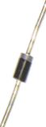
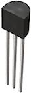
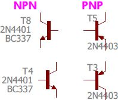
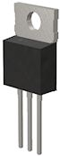
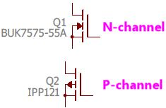
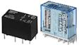

= Field Guide to Components

Or, how to recognize electronic parts from quite a long way away. Here's a quick visual reference guide to the major components used in the Pinscape expansion boards. We'll cover each category in greater detail in the chapters that follow.

Note that the example photos are just that - examples. All of these parts come in an almost infinite variety of shapes, sizes, and colors. These photos should at least look similar to most of the parts used in the Pinscape projects, but there's a lot of variation even in that limited scope, so don't worry if you don't see an exact picture of one of the parts you're using.

[cols="1,1,1"]
|===
|Description|Examples|Schematic symbols

| xref:resistors.adoc[Resistor]

Resistance value in Ohms (Ω)

| image:images/miscResistors.png[""]

|image:images/schematic-resistor-1.png[""]

| xref:capacitors.adoc[Capacitor (ceramic disc)]

Capacitance value in Farads (F); ceramic capacitors are unpolarized

|image:images/miscDiscCaps.png[""]

|

| xref:capacitors.adoc[Capacitor (electrolytic)]

Capacitance value in Farads (F); electrolytic capacitors are polarized (one lead is "+")

|image:images/miscElectrolyticCaps.png[""]

|

| xref:cmpdiodes.adoc[Diode]
|

|image:images/schematic-diode-1.png[""]

| xref:leds.adoc[LED] (light-emitting diode)
|image:images/misc-leds.png[""]

|image:images/schematic-led-1.png[""]

| xref:transistors.adoc[Transistor (bipolar)]
|

|

| xref:transistors.adoc#darlingtons[Transistor (Darlington)]
|

|image:images/schematic-darlington-1.png[""]

| xref:mosfets.adoc[Transistor (MOSFET)]
|

|

| xref:icchips.adoc[Integrated Circuit (IC) chip]
|image:images/misc-ics.png[""]

|image:images/SchematicTLC5940NT.png[""]

| xref:icchips.adoc#ic-PC817[Optocoupler]
|

|

| xref:relays.adoc[Relay]
|

|image:images/schematic-relay-1.png[""]

| xref:pinHeaders.adoc[Pin headers]
|image:images/pinHeaderSample.png[""]

|image:images/schematic-pinheader-1.png[""]

|===

