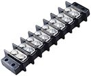

[#connectors]
= Connectors

One of my "design rules" when I built my own cab was that everything should be modular: pieces should be self-contained, and it should be easy to take anything out for servicing or replacement without major surgery, and just as easy to put it back.
In the case of the electronics, this meant that nothing should be "hard-wired" into the cabinet.
I should never have to cut a wire or unsolder anything just to remove an electronic device.
The way to achieve that is to make sure all the connections in the wiring are made with modular connectors that can be plugged and unplugged, just like a power plug in a wall outlet.

When I started planning my cab, then, I knew I wanted to use some kind of pluggable connectors throughout, but I didn't have enough electronics experience to know exactly what to buy.
I looked to see how other cab builders handled this, and found that there aren't any widely agreed "best practices" in this area.
Looking at Mouser to see what's available only muddied the waters further, because they have literally thousands of options for connectors.
Worse still, many of the available connectors are themselves fairly complex systems, where you have to assemble plugs and sockets out of multiple.
It's hard to know where to begin when faced with the vast array of available options.

That's why I'm devoting a whole chapter to this seemingly trivial subject.
In the course of building my own cab, I managed to narrow the huge range of available connector options to a few versatile types that have served me well.
The Pinscape parts lists use some of these directly, so some of the information we'll cover is simply to help you recognize and use the parts required for the Pinscape components.
We'll also look at some of my go-to connectors for other miscellaneous connections throughout the cabinet, to save you the trouble of repeating all that research.

== 0.1" pin headers

image::images/pinHeaderSample.png[""]
image::images/shroudedHeader.png[""]
This is one of the most ubiquitous connectors that you'll see in hobbyist electronics, and really electronics in general.
A pin header is basically just a row of connector pins sticking up out of a circuit board, to provide a connection point to the outside world for a group of circuits.

You plug into the pin headers with matching connectors.
In most cases, the connector attaches to a ribbon cable or hookup wires that lead off to whatever is meant to be connected to the board.
This lets you plug and unplug the whole collection of circuits represented by the header with a single connector.

Pin headers can be out in the open, as in the top two examples at right, or can be enclosed in a plastic "shroud", like the bottom example at right.
The pin spacing is the same either way; the shroud is there primarily to make sure you can't orient the mating plug the wrong way when plugging it in.
The little slot you can see in the picture of the shroud at right lines up with bump on the connector, so if you try to insert the connector backwards, the bump hits the other side of the shroud and prevents you from inserting it.

Pin headers and the matching connectors are described in more detail (with product links and installation instructions) in xref:pinHeaders.adoc#pinHeaders[0.1" Pin Headers] .

== PC disk power connectors

An ATX power supply comes with an array of power cables with different connectors on the ends.
If you want to use an ATX supply to power feedback devices or audio equipment, the easiest way to tap into its power outputs is via the disk connectors.
These are the four-pin female connectors that look like this:

image::images/ATXDiskConnector.png[""]

The four pins are connected to color-coded wires.
You can identify the pins by the wire colors:

[cols="1,1"]
|===
|Wire Color|Voltage

|Black
|0V (Ground)

|Red
|+5V

|Yellow
|+12V

|===

The easiest way to connect to these is to snip the connector off the end of one of the cables, strip the wires, and solder your other wires directly to the ends, or connect them through screw-terminal blocks.
But that's not great because it permanently modifies the power supply.

A better way is build your own mating connectors and just plug into them, the way you'd plug in a PC disk.
It's pretty easy to build the matching connectors.
Here are the parts you need:

*  link:https://www.mouser.com/search/ProductDetail.aspx?R=571-14804260.html[TE/AMP 1-480426-0] 4-pin housing
*  link:https://www.mouser.com/search/ProductDetail.aspx?R=571-606201.html[TE/AMP 60620-1] male crimp pins, quantity 4 per housing

Those are crimp-pin housings, so see xref:crimpPins.adoc#crimpPins[Crimp Pins] for instructions on how to assemble them.

Also see xref:powerSupplies.adoc#powerSupplies[Power Supplies for Feedback] for more on using ATX power supplies for feedback device power.

== PC motherboard "front panel" connectors

Most modern PC motherboards feature a standardized connector for the miscellaneous case buttons and indicator lights - the soft on/off button, reset button, power light, disk activity light, etc.
This is known as the F_PANEL or Front Panel connector, and is usually labeled as such on the motherboard.

Intel defined a standard layout for this connector, so that motherboards and cases can easily inter-operate without proprietary connectors.
It happens to use the standard 0.1" pin header layout, with a 10-pin (dual-row, 2x5 pins) header.

You can plug into these with one of the 0.1" crimp pin housings described above.

See xref:powerSwitching.adoc#powerSwitching[Power Switching] for more on the front panel connector and how to set up PC-controlled power switching in your pin cab.

== Molex wire-to-wire connectors

For any parts that you want to be able to easily remove from the cabinet, I always recommend using plug-in connectors.
The pin headers described above are one type of plug-in connector, but those are mostly suitable for circuit boards.
What about cases where you want to create a pluggable connection for something that's not a circuit board, like, say, your shaker motor?

For those connections, I like using a "wire-to-wire" connector.
This is what they call any connector used to join two wire runs.
A familiar household example is the connector at the end of an extension cord: it's there so that you can plug one wire (the power cord of an appliance) into another wire (the extension cord itself).
Inside a pin cab, there are lots of situations where similar wire-to-wire plugs can be helpful.

There are lots of options for these.
In my pin cab, I made lots of use of a couple of connector types made by Molex: their Standard .062" and Standard .093" systems.
I was familiar with these because they're the connectors Williams used for similar purposes in their real machines for many years.
The .062" and .093" systems are similar; the difference is the pin size, with the larger .093" pins having a higher power capacity.
Both systems use plastic crimp-pin housings that come in a range of pin counts, with keyed connectors that only fit one way.
This makes them pretty foolproof: the keying ensures that you can't plug a particular connector in the wrong way, and the different pin counts let you use a variety of different connectors in your cab to prevent mistaking one connector for another.
You can't plug a 9-pin plug into a 12-pin socket.

image::images/molex-062-unplugged.png[""]

Molex .062" 9-pin connector, plugged (top) and unplugged.

These systems are available as separate parts (male and female housings and crimp pins/sockets), but the easier way to buy them is in kits.
You can find the kits on Amazon as well as Mouser.
Here's a Mouser search that should work:

link:https://www.mouser.com/Connectors/Pin-Socket-Connectors/_/N-ay0mm?P=1z0yxz4.html[Mouser Pin Socket Connectors]

(That's a search for Connectors > Pin & Socket connectors, product=Kits.)

Amazon searches for "Molex .062 kit" and "Molex .093 kit" shoudl also turn up similar results.

These are crimp-pin systems, so see xref:crimpPins.adoc#crimpPins[Crimp Pins] for instructions on assembling them.

== Terminal blocks

An easy way to make point-to-point connections without soldering is with a screw-terminal block - a plastic block with a set of paired screw terminals, like the one pictured at right.
Screw terminals are easy to connect and can be removed or changed at any time.

To make a connection between two wires with a screw terminal:

* Strip 1/4" or so of insulation from the end of each wire
* Pick a pair of connected screws on the terminal block
* Unscrew the screws a few turns (don't unscrew them completely)
* Wrap one of the wires around one of the screws, and tighten the screw to secure the wire
* Wrap the other wire around the other screw and tighten

Terminal blocks like this can be easily found on Amazon and eBay.
I'd recommend getting the type that comes with plastic cover, which protects the terminals against accidental contact with other wires or metal parts.

Screw terminals are good for wiring that's more or less permanently installed in the cabinet.
I wouldn't use screw terminals for any wiring that attaches to parts that you want to be able to remove frequently, because it's a bit of a pain to disconnect and reconnect the wires.
It's better to use pluggable connectors, such as one the Molex wire-to-wire connectors mentioned above, for anything that you might have to remove more than rarely.
For example, any parts that you have to remove to access other parts should be easily pluggable.

