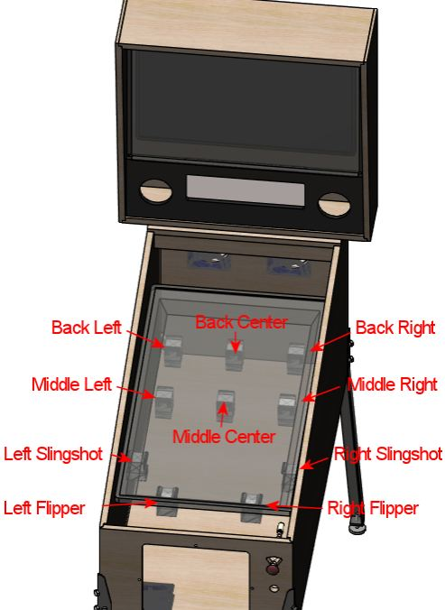
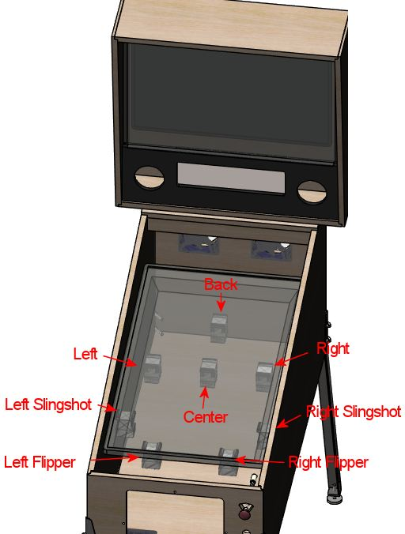

[#contactors]
= Flippers, Bumpers, and Slingshots

Real pinball machines are mechanical contraptions with lots of moving parts.
It's what makes them stand apart from just about every other kind of arcade game.
When you translate pinball into a video game, you lose that physicality.
In a virtual pin cab, you can bring back some of the mechanical feel of the real thing by adding similar moving parts that can be actuated in sync with the game action.

The moving parts on a real machine that produce most of the tactile experience for the player are the ones controlled by solenoids: flippers, slingshots, bumpers, kickers.
all these are driven by powerful magnetic coils that propel the metal parts at high speed.
The kick of the solenoids is palpable while playing.
This chapter is about reproducing that tactile solenoid effect in a virtual cab.

== How many? Where do they go?

It's up to you which devices to include in your setup.
The common setups, which DOF supports most readily, use two devices to simulate flippers, two to simulate slingshots, and four to six devices to simulate pop bumpers.

*Flippers:* The most basic solenoid setup uses just two solenoids, one for each flipper.
These should be positioned near the location where the actual flippers appear in the video presentation, near the bottom of the TV.
You can mount these inset a bit from the sides of the cabinet, where the actual flipper solenoids would be on a real machine, or you can mount them directly to the cabinet walls.
If you're using slingshot solenoids in addition to the flippers, you might want to use the inset positioning for the flippers, and position the slings further apart, to make the sounds more noticeably separated in space.

*Slingshots:* These go just behind the flipper devices.
Most people mount these directly to the side walls of the cabinet, since real slingshots are also close to the walls.

*Bumpers:* There are two common configurations for bumpers.
The "deluxe" arrangement uses six devices, arranged as a row of three across roughly the middle of the playfield TV, and a second row of three closer to the rear of the TV.
This provides devices at enough different places that DOF can do a good job of placing each sound effect close to its simulated origin in the game.
The other common arrangement uses a single row of three across the middle of the TV, and one more near the rear center.

DOF refers to these two common bumper configurations as "10-Bumper" and "8-Bumper" setups.
That's a bit confusing, because it doesn't really mean _bumpers_ .
In both cases, two of the devices are flippers and two are slingshots.
So what DOF really means is "10-Solenoid" and "8-Solenoid".

Here's what the two arrangements typically look like in a cab.

"10-Bumper" placement.
The actual "bumpers" are the six devices across the middle and back playfield area.
The two devices at the front are the flippers, and the two just behind those are the slingshots.

"8-Bumper" placement.
The actual "bumpers" are the four devices across the middle and back playfield area.
The flipper and slingshot devices are the same as in the "10-Bumper" layout.

== Parts

The most effective way to reproduce the sensory effects of a pinball solenoid is to use some of kind of solenoid.

In a real pinball machine, they have to use a specific mechanism for each job, because each mechanism has to do the actual work of propelling the ball (or whatever it's meant to do).
In a virtual cab, we don't have that constraint.
Our devices don't have to actually do anything physical in the game; they just have to produce the right sensory impression.
So we're free to substitute anything that sounds and feels similar.
That opens up our options and lets us consider other properties when we're selecting devices, such as cost, size, durability, and power needs.

If you open up the field to consider anything with a solenoid in it, you have an overwhelming number of options.
Fortunately, people have been building pin cabs for long enough now that a few winning options have emerged, so you won't have to spend months doing research on this; you can just pick one of the common solutions below.
Like most pin cab features, everything has some tradeoffs, so there's not a perfect one-size-fits-all solution.
We'll give you the pros and cons of each to help you decide.

Note that you don't have to settle on a single device type! Many pin cab builders do use one device type for everything, but others think it's a plus to use different devices for different roles, so that each type of device sounds a little different.
For example, you might use the Siemens contactors for the flippers, and starter relays for the bumpers and slingshots.

=== Contactors

A contactor is a type of electrically controlled switch used in high-power applications, such as controlling industrial equipment or large appliances like air conditioners.
"Contactor" is just another word for "relay" - they're fundamentally the same thing - but they call it a contactor when it's the higher power type.

On the inside, a contactor is a mechanical switch controlled by a solenoid.
The solenoid moves a set of mechanical switch blades when energized.
Because of the high power that a contactor is designed to handle, the switch blades have to be hefty, and they have to move across a wide gap when switching.

It's that big moving switch element that makes contactors useful for our purposes.
The large moving parts make a nice "thunk" when the device switches on and off, strong enough to resemble a pinball flipper, slingshot, or bumper.

image::images/SiemensContactorExample.png[""]
*What to buy:* The type of contactor that's popular with pin cab builders is made by Siemens.
One particular known quantity that many cab builders use is Siemens model number 3RH1140-1BB40 (pictured at right).
It's safest to look for that exact part, but Siemens makes a large number of similar devices, and I suspect that any Siemens model that physically resembles this one will have substantially the same component parts inside and will produce similar sensory effects.

Many other types of contactors are also available from other manufacturers, so there are undoubtedly many more options out there that would work.
However, there's no reason to assume that any random contactor would sound "right".
If you're considering another device, ask in the forums to see if anyone else has tried it; or try it yourself if you want to be a pioneer, but ideally buy it from someone who will let you return it if it doesn't do the job.

*Cost:* You _can_ buy these devices new, but you shouldn't: they're $50 and up apiece new.
Given the performance tradeoffs, they're not worth the money; if you have that kind of budget, real pinball parts would be a far better investment.
So you should instead buy them used on eBay, where they can be found for about $10 apiece.
You might have to be patient to find them at a reasonable price, since they seem to be a fairly low-volume item on eBay.

*Power supply:* The Siemens contactors require 24VDC power.
That's not available from a computer ATX power supply, so you'll need a separate power dedicated 24V supply.
See xref:powerSupplies.adoc#powerSupplies[Power Supplies for Feedback] for advice.

The Siemens contactors draw about 400mA each.
I'd plan on sufficient power for three or four of them to fire simultaneously, so be sure your 24V power supply is rated for at least 2A (equivalent to 48W).

*Wiring:* Here's how to hook up the typical Siemens contactors:

Note that most of the terminals on the contactor are left unconnected.
The other terminals are all intended to be wired to whatever circuits the contactor is controlling, but in our case, we don't control anything at all with the contactor.
It's just there for the sound effect it makes when it switches on and off, so we only connect the terminals that control its coil, typically A1 and A2 on the Siemens devices.

The diode is required to protect the output controller and computer electronics from noise from the magnetic coil inside the contactor.
See xref:diodes.adoc#coilDiodes[Coil Diodes] .
The stripe on the diode must connect to the positive (+) power side.

*Pros:* The biggest "pro" with contactors is that they're happy to be left in the "on" position indefinitely.
That's not at all true of most solenoids: most solenoids will overheat if left on for long periods, and many can only tolerate a couple of seconds at a time.
For simulating flippers, the ability to stay on for long periods is critical, because the player could hold the flipper button indefinitely to trap a ball.

The tonal quality of audio/tactile effect of the Siemens contactors is another plus.
It's a nice solid mechanical "thunk" that creates the impression of a large device.

Other good features: they're compact, self-contained, easy to install, run on fairly low DC voltages (the Siemens devices referenced above run on 24VDC), and use relatively little power (about 350mA for the common Siemens device).

*Cons:* The biggest negative is that the effect is far weaker than a real pinball solenoid (even though the tonal quality is good).
Also, they require 24V, which means you have to add an extra power supply for them.
The Siemens devices are pricey, unless you buy them used, and used ones sometimes have a lot of wear that greatly reduces the strength of the "thunk" effect, which is the whole point for our purposes.
Used ones might not be entirely reliable, either; a couple of my own Siemens contactors are intermittently "sticky", where they'll stuck in the on or off position for a while and won't make any noise.
I've heard from other people seeing the same problem.

*Recommendation:* The Siemens contactors are a popular way to implement the simulated flippers and other solenoids because they're simple to install and they won't overheat if left activated for long intervals.
The tolerance for long activation times makes them especially attractive for flipper effects.
They're the best bet if you want to keep things simple.
But the effect isn't nearly as strong as the real thing, so if realism is a high priority, look at other options.

=== Automotive starter solenoid relays

This is another kind of high-power relay, in this case specific to cars. Starter solenoids are used in automotive engine starting systems; they switch the high-current connection between the battery and the big solenoid that cranks the engine when you turn the ignition key. As such, they have very much the same purpose as contactors - switching high-power loads through a relay switch - and similar construction.

Like contactors, these have big moving parts inside that create a nice "thunk" effect when actuated. The effect is similar in tonal quality to the Siemens contactors, and it's often quite a bit stronger, but usually not as strong as real pinball coils.

Starter relays are cheaper and easier to find than the Siemens contactors. Many types sell for under $10 at auto supply stores, eBay, Amazon, Wal Mart, and other big retailers. Like the contactors, they're self-contained and easy to install.

Unlike contactors, these devices will overheat if energized for extended periods, so they're not ideal for flippers. You might be able to use them for flippers if you take special precautions, such as using Flipper Logic (see xref:#contactorFlipperLogic[below] ). Overheating is less of a risk when you use these devices for bumpers and slingshots, since those typically only fire in brief bursts in normal play.

Reliability is also a concern. If you think about it, these devices aren't typically fired all that often in their intended application of starting a car. A pin cab will subject them to much heavier use than the manufacturers presumably expect (and design for). Some people on the forums have reported that they need to replace these as frequently as every few months, which I'd find overly frustrating. But I'm sure the durability varies a lot according to how you use your cab and which specific devices you buy.

image::images/StarterSolenoidExample.png[""]
*What to buy:* The type most often mentioned on the forums is the Ford SW3 type (pictured at right). As with the contactors, numerous other options are available, but this one is a known quantity that other pin cab builders have found to work well.

*Power supply:* Almost every automotive device runs on 12V DC (but as always, check the product documentation or seller page to confirm details for the actual product you buy). You can use the 12V output from your secondary ATX power supply. Note that these devices place a large load on the power supply - about 6A, or 72W - so make sure you have a powerful enough 12V supply, and don't connect them to the same ATX power supply running your computer motherboard. When calculating power needs, take into account that there will be times during normal play when several of the devices fire simultaneously, so multiply the amps/wattage rating by three or four to figure how much total power you might need. See See xref:powerSupplies.adoc#powerSupplies[Power Supplies for Feedback] .

*Wiring:* For the Ford SW3 type commonly used, the wiring plan looks like this:

On the Ford SW3 type, you'll find four screw terminals sticking out from the body of the device. The ones on top (in the orientation shown above, anyway) should be labeled "S" and "I". The ones sticking out from the sides aren't typically labeled. In addition, the large metal plate that looks like a mounting bracket is indeed a mounting bracket, but it's also the electrical ground connection for the device. The terminals of interest for pin cab use are the one labeled "S" and the mounting bracket/ground plate.

If your solenoid isn't labeled like the Ford type above, you'll have to figure out which terminals are which. On any automotive device, you can count on any exposed metal on the outside being wired to the electrical ground, so look for an unpainted mounting plate or a socket for a mounting bolt. Now get out your multimeter. Set it to measure resistance. Connect one probe from the meter to the ground point (that exposed metal or mounting plate or whatever), and use the other probe to measure the resistance to each of the other terminals, one at a time. One terminal should have a low but non-zero resistance, probably something like 3 or 4 ohms. That should be the +12V coil terminal - the one that corresponds to the "S" terminal on the Ford devices.

Connect +12V from the secondary ATX power supply to the "S" terminal. Wire the mounting bracket to an available port on your output controller.

The diode is required to protect the output controller and computer electronics from noise from the magnetic coil inside the contactor. See xref:diodes.adoc#coilDiodes[Coil Diodes] . The stripe on the diode must connect to the positive (+) power side.

These are high-power devices. Do not connect them directly to an LedWiz output; you'll need some kind of booster circuit or relay with an LedWiz. If you're using Pinscape expansion boards, you can connect these directly to any power board port or chime board port.

*Pros:* Inexpensive, readily available, self-contained, easy to install, run on 12V DC power. The sound effect they produce has a good tonal quality, and it's stronger than the Siemens contactors (though probably weaker than real pinball solenoids).

*Cons:* They're not designed for continuous activation, so they shouldn't be used for flippers without special precautions. Some types might not be durable enough to last more than a few months with the heavy use they get in a pin cab. For most starter relays, the effect isn't as powerful as real pinball solenoids.

*Recommendation:* These are a good choice for everything except flippers, and they can even be used for flippers if use something like the Pinscape "Flipper Logic" feature to reduce hold power. Many people think they sound more realistic than the Siemens contactors. Durability is the main drawback; some people on the forums have had to replace them after only a few months. Given their low cost, though, that might be an acceptable risk, as long as your cab allows easy maintenance access.

=== Real pinball mechanisms

If you want maximum realism, you can use real pinball assemblies for flippers, slingshots, and bumpers.

This is rarely done, but not unheard of. A few cab builders on the forums have reported going this route. It has a number of challenges compared to the other methods:

* It's really expensive. The relevant pinball assemblies run about $50 each, so a full set (two flippers, two slings, six bumpers) comes to about $500.
* The assemblies take up a lot of room in the cabinet.
* They require a high-voltage (50V), high power (600W) power supply. That's expensive, and many pin cab builders are uncomfortable working with such hazardous voltages.

*What to buy:* Buy these at any pinball supplier (Pinball Life, Marco Specialties). You can also buy them used on eBay, but my standard warning about used pinball parts on eBay applies: they'll be beat up and the sellers all think you're an idiot who wants to pay new prices for old parts. At least price the new ones first so you know whether an eBay bargain is really a bargain.

The key word when searching the pinball vendors is "assembly":

* "Flipper assembly" (e.g., Williams reference C-13174-L, C-13174-R)
* "Slingshot assembly"
* "Bumper assembly" (e.g., Williams reference A-9415-2, B-9414)

*Important note on flippers:* Real flipper assemblies from the 1980s and 90s should have "dual coil" arrangements. You won't actually see two separate coils - the two coils are wound around a common core and look like a single coil. But you should see three terminal wires coming out of the coil. The flipper assembly should have an end-of-stroke switch that diverts power from the high-power "lift" coil to the low-power "hold" coil when the flipper reaches the end of its arc.

The dual-coil arrangement makes it safe to hold the flipper button on for long periods. The lower-power hold coil is specifically designed for continuous activation without overheating.

I mention all of this because some newer Stern assemblies _don't_ use the dual-coil design and aren't safe to use in a virtual pin cab without special software provisions. If you use one of these newer assemblies, it's critical that use something like the Pinscape Flipper Logic feature (see xref:#contactorFlipperLogic[below] ) to reduce power to the flipper coil when it's held on. Because of this additional complication, I'd recommend avoiding the Stern assemblies and using a traditional dual-coil Williams/Bally assembly. That should be safe to use with any controller without any additional setup work, since the hold power reduction is handled directly in the flipper assembly hardware itself.

*Cost:* About $50 per assembly. A full "10-Bumper" setup (in DOF parlance - two flippers, two slings, six bumpers) is about $500.

*Power supply:* Real pinball coils in modern machines require 50V DC power supplies. Most of them draw 3-5A. To allow for multiple devices firing at once, you should plan on a minimum 10A (500W) capacity.

50VDC power supplies are expensive hard to find. It's easier to find a 48V supply, which will work about as well. 48V supplies are widely used for LED lighting applications; you can find them in the 500W range on eBay for about $50.

CAUTION: 50V (or 48V) is a hazardous high voltage that can cause electric shock. With most of the pin cab output controllers (including LedWiz and Pinscape), the controller requires you to wire solenoids so that one terminal is connected directly to the "+" power supply voltage. This means that +50V is always present at one terminal of each coil, _even when the coils are off_ . Real pinball machines have a hard-wired safety interlock switch in the coin door that cuts off all coil power to the playfield when the coin door is opened, to protect an operator from shock hazard while working inside the cabinet. If you install real coils and a 50V supply, I'd strongly recommend using a similar safety interlock. The switch should disable the +50V power supply when the door is open.

*Wiring:* Each coil will have two terminals for the power connections. Connect these following the generic output device wiring plan (see xref:feedbackWiring.adoc#feedbackDeviceWiring[Feedback Device Wiring] ).

Many of the flipper, bumper, and kicker assemblies for modern machines include diodes pre-installed on the coils. If a coil is already installed, it should have markings for the "+" and "-" wires. This is often by wire color: red is "+" and black is "-".

If a diode _isn't_ already installed, you must add one. See xref:diodes.adoc#coilDiodes[Coil Diodes] . When a diode isn't present, the coil itself will be unpolarized, so the order of the wires doesn't matter. Just be sure that the diode you add is installed with the correct polarity.

If you're using an LedWiz, these devices require some kind of booster or amplifier, because they use much more power than an LedWiz can handle. If you're using Pinscape expansion boards, you can connect these to any Power Board or Chime Board port.

I'd recommend using the Pinscape Chime Boards, if you have them, for the bumpers and slingshots (but *not* for the flippers). Those coils will overheat and melt if they get stuck on by a software fault. If you don't have any Chime Boards but you're using the Pinscape software, use the Flipper Logic feature (see xref:#contactorFlipperLogic[below] ) to cut off device power if a port gets stuck on, by setting the "hold power" to 0%.

*Pros:* Not merely realistic - _real_ .

*Cons:* Expensive; take up a lot of space; vulnerable to overheating if they get stuck on; require high-voltage power supply; electric shock hazard.

*Recommendations:* The ideal solution, if cost is no object and you're willing to work with the high voltage.

=== Open-frame solenoids

image::images/OpenFrameSolenoid.png[""]
The core element of every solenoid-based pinball device is the solenoid itself, so some cab builders bypass the various devices built _around_ solenoids (like the contactors and starter relays mentioned above) and just use standalone solenoids. You can find options on eBay, and from hobby robotics suppliers like Adafruit and Sparkfun.

Plain solenoids don't seem to be widely used on pin cabs, and many of the people who have tried them seem to be dissatisfied with the results, judging by the forum discussions on the subject. I think it's possible to create a good effect with a plain solenoid, but it's much more challenging than with the pre-made devices like contactors and starter relays. There are two main reasons for this.

The first is cost. Many pin cab builders who use plain solenoids do so because they think it's a cheaper way to accomplish these effects. You can find cheap solenoids, but the cheap ones tend to be small toy solenoids that aren't nearly as powerful as pinball coils. The effects they produce will be correspondingly small and unimpressive. They'll just make metallic clicks. If cost is your main concern, you're probably going to do better with something like a starter relay.

The second challenge is that pinball assemblies we're simulating aren't _just_ big solenoids. They're big solenoids with other moving parts attached. Typically big, heavy, metal parts. Those other parts are integral to creating the right sensory effect. If you want to produce a convincing effect, you'll have to contrive your own additional moving parts similar to what's in the pinball assemblies. This is what makes the contactors and starter relays so plug-and-play: they have their own built-in moving parts that happen to produce effects similar to what we're after.

I think this can be a promising avenue to pursue, but moreso if you're willing to buy somewhat more expensive parts and do some experimentation to find the right combination of attached parts to produce the right effect.

*What to buy:* On eBay, look for "open frame solenoid". I'd avoid the small 12V devices; those are little toy solenoids that will just sound like metallic clickers. Look for something 24V or above. Sparkfun sells a 36V solenoid that a couple of people on the forums have mentioned favorably.

*Cost:* $5 and up. The Sparkfun 36V device sells for about $20 as of this writing.

*Power supply:* Varies by device. Check the specs on what you buy to determine what voltage you need.

If you have to buy an additional power supply, pay attention to the Volts and Amps required by the device. Make sure the power supply has a voltage that is the same as the solenoids, and that it provides *at least* the required amperage. If you're using multiple devices of the same type, the power supply will need to provide enough power for several of the devices simultaneously; I'd multiply the solenoid amperage by 3x or 4x to get a suitable minimum.

If you see specs in Watts for either the solenoid or power supply, you can convert between Watts and Amps using this formula:

stem:["Watts" = "Volts" * "Amps"]

*Wiring:* The solenoid should have two wires attached. Solenoids aren't polarized, so the order of attaching the wires doesn't matter. Connect one lead to the (+) supply voltage (use the correct voltage for the solenoid), and connect the other to your output controller, as shown below.

The diode is required to protect the output controller and computer electronics from noise from the magnetic coil inside the contactor. See xref:diodes.adoc#coilDiodes[Coil Diodes] . The stripe on the diode must connect to the positive (+) power side.

*Pros:* Many options are available; infinite customization possibilities.

*Cons:* Sensory effects are less predictable than with contactors or starter relays; you might have to experiment with several devices and several mounting styles to get a satisfactory effect. More complex to set up than contactors or starter relays if you want to contrive additional moving parts to improve the sound effect. Smaller devices will produce weak, tinny effects. Most solenoids will overheat if actuated for more than a couple of seconds at a time, so special measures (such as Flipper Logic) might be needed, especially when used for flippers.

*Recommendations:* If you're thinking of using cheap eBay solenoids to save money, I'd reconsider: you'll probably be unhappy with the results and end up replacing them with something better, so your total cost will be higher than if you just started with something better. But plain solenoids might work for you if you're willing to buy more expensive ones with more force, and you're willing to do some extra work to improvise additional moving parts to simulate the action of the full pinball assemblies.

== DOF setup

In the link:https://configtool.vpuniverse.com/[DOF Config Tool] , go to your Port Assignments page. Find the numbered ports where you wired your solenoid-type devices. Assign each one to the appropriate output device.

If you're using a full 10-device setup (see the diagrams above):

* Flipper Left/Right
* 10 Bumper Middle Left/Center/Right or Back Left/Center/Right
* Slingshot Left/Right

If you're using an 8-device setup:

* Flipper Left/Right
* 8 Bumper Left/Center/Right/Back (if you're using an 8-device setup)
* Slingshot Left/Right

[#contactorFlipperLogic]
== "Flipper Logic"

If you're using a Pinscape controller, a special feature is available to help avoid overheating devices that aren't designed to be activated for long periods. This isn't necessary with contactors or most real flipper assemblies, since those are specifically designed to tolerate continuous activation. It's useful for almost everything else: all other standard pinball coils, automotive starter relays, and miscellaneous open-frame solenoids.

The idea behind Flipper Logic is to simulate the way real pinball machines solve the overheating problem for their flipper coils. Real flipper coils would have the same overheating issue as our substitutes if they didn't take special measures. On older pinball machines, the special measure is that they use two separate coils in the flipper. A high power "lift" coil provides the initial jolt of power to flip the flipper and propel the ball, and a low-power "hold" coil takes over as soon as the flipper is all the way up. (This isn't obvious looking at them, because the two coils are wound into a single body. But electrically, there are two coils there.) In the real machines, an end-of-stroke switch in the flipper mechanism redirects power from the lift coil to the hold coil.

In some newer Stern machines, they keep the hardware simpler by using a single high-power coil, and solve the heating problem through software, by modulating the power using PWM controls. When you press the flipper button, the software initially applies full power to the flipper (simulating the "lift coil" power). If you continue to hold the button for more than a brief time, the software automatically reduces the power through PWM (simulating the lower "hold coil" power). The lower power is enough to keep the flipper flipped, but it's low enough that it won't overheat the coil even if it's held on for a long time.

Flipper Logic works like the newer Stern machines, reducing the power to the port after a brief period at full power. This makes it possible to use more types of devices as a flipper substitutes, by avoiding the overheating problem common to many solenoids.

You can activate this feature on a port-by-port basis, for any PWM-capable port. To activate it:

* Run the Pinscape Config Tool
* Go to the Settings page for your controller
* Scroll down to the Output Ports section
* Click the flipper icon (
) at the right side of the port you want to set up

This lets you enter two parameters: Initial Time and Hold Power. The Initial Time specifies how long the port receives full power each time it's activated. You can adjust this from 50ms (1/20 of a second) to 800ms (0.8 seconds) in 50 millisecond increments. The Hold Power is the PWM power level that's provided to the port after that point, as long as the port is held on. This can be adjusted from 0% to 100% in increments of about 7%.

To determine the proper reduced power level for a device, you'll have to experiment with it. Each device is different. Start at the lowest non-zero setting. Try the coil: turn it on and leave it on. If it actuates and then returns to the rest position after about a second, the power is too low, so try the next higher setting. Repeat until the device actuates and remains actuated as long as the port is on.

CAUTION: always monitor the device for heating! Once you find a setting that's high enough to keep the device actuated, you have to verify that it's not _too_ high a setting that overheats the device. It's possible that some devices don't have a safe operating zone at all - that is, a power level where they'll stay actuated and won't overheat. You should be able to monitor the device by touch: if it gets hot to the touch, turn if off immediately, since it's heating too rapidly and will probably overheat if you leave it on. If you can leave it on for a couple of minutes without having it get hot to the touch, it's probably in thermal equilibrium, meaning it should be safe to leave on in that state indefinitely.

[#flipper-feedback-control]
== Flipper button feedback control

One question that a lot of new pin cab builders ask on the forums is: how do I make the flipper buttons control the feedback solenoids for the flippers? In other words, how do I wire it so that pressing the flipper buttons activates the flipper solenoids?

There are two ways to go about this. The way that most people do it these days, which I consider the correct way, is to let DOF handle it. Happily, this is also the easiest approach, because it doesn't require any extra wiring or any extra configuration beyond the normal DOF setup you're going to do anyway.

The older way of handling this, which people did before DOF came along, was to hard-wire the flipper buttons to the flipper solenoids. This might seem simpler at first glance than the DOF approach, since it's just a directly wired connection. But it's actually more complicated to build! Some extra parts are required because you have to isolate the higher voltage that the solenoid uses from the low voltage that the key encoder uses. So DOF takes less work and fewer parts, assuming you're going to use DOF anyway. The only reason to use the hard-wired approach is if you're not going to include a DOF controller.

The thing I particularly like about the DOF approach, apart from its simplicity, is that it does a better job of simulating real pinball machines. If you think about how a real pinball machine works, the flippers only fire when the game allows them to fire - not between games, not after a TILT condition, etc. If you use the hard-wired approach, the flipper solenoids will end up firing every time you press the buttons, so the feedback effects won't always match the on-screen simulation. With DOF, they'll always match.

=== The modern way: let DOF handle it

If you're using xref:DOF.adoc#dofSetup[DOF] , you don't have to do any extra work for flipper effects. Just set up DOF, and the flipper solenoids will work just like all the other DOF effects. DOF will take care of activating the flipper devices whenever the on-screen flippers flip in a DOF-enabled game. The wiring for the flipper buttons and solenoids is exactly the same as for every other type of button and every other type of feedback device: wire the flipper buttons to your key encoder, just like all of your other buttons, and wire the flipper solenoids to your output controller, like your other feedback devices.

If you're trying to picture how the flipper solenoids actually operate with a DOF setup, here's the sequence of events:

* You press the flipper button, closing its switch
* The flipper button switch signals the key encoder
* The key encoder sends a "Flipper Button Pressed" keyboard event to the computer
* Visual Pinball (or whatever simulator you're using) gets the "Flipper Button Pressed" key event and fires the simulated flipper in the game
* DOF sees the simulated flipper event, and sends a FLIPPER SOLENOID ON command to the output controller
* The output controller activates the output port wired to your flipper solenoid
* The flipper solenoid fires

This approach is better than hard-wiring the solenoid for two reasons. First, it keeps the wiring simpler. The flipper button switch is only wired to the key encoder, and the flipper solenoid is only wired to the output controller - exactly the same wiring as for all of your other buttons and feedback devices. Second, it allows full software control over the flipper. That's the way it works on a real machine: try walking up to a real pinball machine some time and pressing the flipper button while GAME OVER is showing on the display. Does anything happen? No, of course not: the flippers are dead when a game isn't in progress. By wiring the flipper solenoids through the output controller, you'll get exactly the same effect. Hard-wired flipper solenoids would fire every time you press the buttons, whether or not a game was in progress.

What about latency? When DOF was new, and people started switching over to the DOF approach, there was some worry about the extra software steps adding a noticeable lag time between pressing the flipper buttons and hearing the feedback effects. Fortunately, it turns out that DOF is fast enough that this isn't a problem. You could measure the added latency using lab equipment, but it's not enough to be perceptible to a human. The human nervous system has a latency perception limit of about 30 milliseconds, and DOF in a properly working system is comfortably faster than that.

=== The old-fashioned way: hard-wire the buttons to the solenoids

If you're using DOF, you should ignore this section, because there's no reason to even consider hard-wiring the flipper buttons to the flipper solenoids. However, if you're not using DOF, you can get some very basic feedback effects by wiring your flipper buttons to your flipper contactors or solenoids, so that pressing the buttons directly activates the solenoids.

At first glance, it seems like it would be dead simple to wire the buttons to the solenoids. The complication is that you also need to wire the buttons to your key encoder, so that pressing the buttons sends key presses to the PC, to operate the simulated flippers in Visual Pinball and other pinball software. That dual wiring makes things more complex because of the different voltages used in the key encoder and the contactor or solenoid. The higher voltage needed for the contactors or solenoids would damage or destroy the key encoder if you wired both of them together directly. Instead, we have to isolate the two voltages, so that the solenoid voltage doesn't damage the key encoder.

To isolate the voltages, we can use something called an "optocoupler". That's a sort of solid-state relay that lets the voltage in one circuit control a separate circuit with a different voltage, while keeping the two voltages separated and isolated from one another. Which is exactly what we need in this case.

If you've tinkered with electronics before, you might be more familiar with regular mechanical relays, and you might be tempted to go with a mechanical relay to keep things simpler. That would work, but I don't recommend it, because mechanical relays are fairly slow. Slow enough to cause an annoying amount of lag time in the software every time you press the buttons. Mechanical relays also tend to wear out with heavy use. Optocouplers are better because they're very fast and last a lot longer.

Here's the basic circuit design that should work for any of the common key encoders.

If you trace through the circuit, you'll see that the flipper button is wired so that it activates both the contactor and the optocoupler when pressed. Activating the contactor makes it fire, so you'll get the flipper feedback effect whenever you press the button. Activating the optocoupler completes the circuit on the key encoder side, so pressing the button will also send the key press for the flipper button. So whenever you press the button, you'll simultaneously hear the flipper feedback effect and send the key press to the PC. The optocoupler is the key to making both devices work together, because it uses the higher voltage on the solenoid side to control the key encoder side, but it does so without allowing the higher voltage to reach the key encoder side.

The diode is needed to protect the rest of the circuit from the voltage surge effect from the contactor or solenoid. A diode like this is needed for every device with a coil or motor. See xref:diodes.adoc#coilDiodes[Coil Diodes] for more details.

*Parts selection:* The PC817 optocoupler shown is only an example. Just about any standard optocoupler should work, if there's another type you prefer or that you can find cheaper.

The resistor has to be selected according to the contactor's power supply voltage and the type of optocoupler you're using. Here are the appropriate resistor sizes for the PC817 and common power supply voltages for the contactor:

[cols="1,1"]
|===
|Voltage|Resistor

|5V
|180 ohms, 1/8 Watt or higher

|12V
|560 ohms, 1/4 watt or higher

|24V
|1200 ohms (1.2K), 1/2 watt or higher

|48V
|2400 ohms (2.4K), 1 watt or higher

|===

If you're using a different optocoupler chip, the required resistor values might vary slightly from the table above, so you should calculate it using an LED resistor calculator. See xref:ledResistors.adoc#ledResistors[LED Resistors] for help with this - that chapter includes an interactive calculator that will figure the right resistance value for you. You'll have to look up the following numbers in the data sheet for your optocoupler, which you can then plug into the calculator in the LED Resistors chapter:

* I~F~ , the Forward Current for the optocoupler LED
* V~F~ , the Forward Voltage (also known as Voltage Drop) for the optocoupler LED

Plug those two values into the calculator in the LED Resistors chapter, along with the power supply voltage for your contactor, and the calculator will tell you the size of resistor to use.

