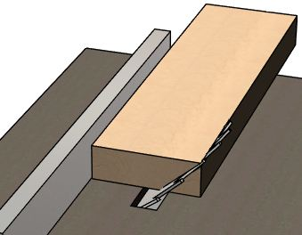
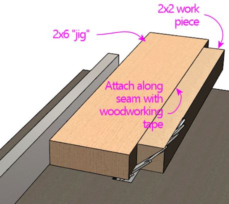

= How to Make Corner Braces (and other wood prism shapes)

If you build a pin cab from scratch, you have to cut two types of wooden "wedge" shapes - or to be more precise, triangular prisms. One is the for the corner braces that sit under the leg bolt brackets:

The other is the cosmetic trim piece at the top of the backbox:

When I first tried to make these for myself, I found them to be surprisingly challenging. So I thought I'd offer some suggestions from what I've learned.

== Pre-fabricated options

The simple triangular corner brace is the same shape as a type of trim molding called a *chamfer strip* . Unfortunately, it's not easy to buy such a thing. I've looked but haven't been able to find any retail sources. Apparently there's not enough demand that anyone wants to sell them.

The backbox trim piece is (surprisingly) easier to find. It roughly matches the shape of a common piece of floor trim called a *3/4" reducer molding* . You might be able to find these at your local Home Depot or Lowe's, and they're also available online. The floor trim usually has a tab that sticks out in back, which you'll have to cut off, but that should be easier than fabricating the whole thing. You can probably even do that with hand tools, such as a utility knife, hand saw, or jigsaw.

== How to make them yourself

When I first tried to make these pieces myself, I realized that it wasn't going to be as easy as feeding a 2x2 into a table saw. In fact, the more I thought about it, the harder it seemed. So I consulted the Internet. Which didn't actually help a lot; I found a lot more questions about the subject than useful answers. But I did find a few interesting leads. Here's what I came up with:

* Most people asking about how to make pieces like this are trying to do it with a table saw. That's what I intended to use as well. And it _is_ doable with a table saw - it's just not nearly as straightforward as I would have thought. Most of the rest of this section explains the table saw technique that I came up with, which worked well enough for me that I'll at least explain it. I'm not sure I should actually recommend it, because the main thing I learned from my Internet research is that this is a particularly risky kind of cut to make with a table saw. But I came up with some things that I think make it safer, so I'll share my approach so that you can make up your own mind about whether or not to use it.
* I found several comments suggesting that a band saw (with a table and fence) is the safest way to make this cut. I don't have a band saw myself, so I can't weigh in with any personal experience, but this does seem to be widely considered the best and safest tool for ripping narrow boards. Band saws don't tend to cause "kickback", which is what makes narrow ripping with table saws so dangerous.

If you have a band saw and want to give this a try, the technique should be straightforward. Set the table to the desired cut angle, set the fence to the correct depth, and feed the board through length-wise. See the sections below on the corner braces and backbox trim for the specific cut angles and dimensions.

* One person (making corner braces for a pinball machine, no less!) reported that he cut a 2x2 in half diagonally with a hand-held oscillating saw. I can't imagine doing this myself - my hand just isn't steady enough. The corner braces don't have to look pretty, but the parts that go under the leg brackets have to be fairly precise if they're going to fit well, and I just can't imagine making a straight enough cut with a hand-held tool. But maybe you can make this work if you're really careful.
* I was partially successful making these with a track saw. The trick is to firmly wedge the work piece (the 2x2 or 1x2) between scrap wood of the same height as the work piece. That forms a platform for the track to sit on (which is important because the track is much wider than a 2x2), and it locks the work piece in place throughout the cut. But I found it difficult to get consistent results this way. I also found that the depth of the cut was challenging for my track saw.

== How to make them with a table saw

CAUTION: Table saws are dangerous tools. Please don't attempt any of this unless you're experienced enough with your equipment that you can evaluate the safety of what I'm suggesting. I'm a newbie at this stuff myself - don't take any of this as expert-approved. (By the same token, if you know a better way to accomplish these tasks, I'd love to hear from you.) If anything seems off or you're just uncomfortable with anything I suggest, trust your instincts and find another way that you're happier with.

WARNING: The big risk with making beveled cuts with a table saw is "kickback", which means that the blade grabs the work piece and throws it back at you at high speed. This can cause severe injuries. Your saw's owner's manual will have safety advice on how to position your body during a cut to reduce your chances of getting hit if kickback occurs. Please read that section and follow it carefully. (My table saw's owner's manual is one of the lengthiest of any tools I own, but I found it worth the effort to read it all.) Kickback is always a risk, but it seems especially likely with beveled cuts, so be extra careful.

Let me start with what _not_ to do - which happens to be the thing that's most obvious, to me at least. Don't just take a 2x2 and try to feed it into the saw directly.

*Don't do this.* Ripping a 2x2 in half diagonally with a table saw, with the blade set to a 45° bevel cut. This is dangerous for several reasons.

Woodworkers call it "ripping" the board when you're cutting it down its length like this. Table saws are great for ripping sheets of plywood. They've even good for ripping narrow boards like this, _if_ the blade is oriented straight up. But a diagonal "bevel" cut like this is dangerous with a narrow board. The big problem is that the top half of the board coming out of the saw blade isn't supported by anything, so it'll tend to press down against the blade, which can potentially turn it into a projectile. It's also tricky to control a narrow board like this, even with a regular vertical cut, because there's so little room to push the board through between the fence and the blade. For a 90° cut, you can solve the second problem with a "tunnel" push block, like a Microjig Grr-ripper. But that doesn't help with the top-half support problem when cutting at an angle. In fact, I think it would actually make the top-half support problem worse, because the push block applies additional downward pressure on the unsupported half.

In my Internet searching, the best advice I found was to _not_ try this with a 2x2 at all, but instead to use a wider board, and cut off just a corner. Let's see how this looks with a 2x6 in place of a 2x2 in the original setup:

Better: Use a 2x6 instead of a 2x2 to rip a wedge-shaped piece off one side.

A 2x6 is the same thickness as a 2x2, so it yields the same result we were trying to get from the 2x2, but this seems a lot safer. Unlike with the 2x2, the "top" portion remains well supported throughout the cut - it's not going to tip over onto the blade. The wider board is also easier to control, and you have a lot more room between the fence and the blade to guide the board. The gap between the fence and blade is still tight enough that you need a push stick or push block, but at least it's not insanely scary this time. What's more, this setup lets you work with your saw's blade guard and anti-kickback pawls installed, which is a major safety improvement.

Note how the saw blade is oriented relative to the fence in the diagram above: the blade is tilted *away from the fence* . This is widely recommended as the safer way to orient the saw for a bevel cut, because this geometry is less likely to trap the work piece between the fence and the blade. I think this is true on any table saw, but just in case your saw has some special design that makes it different, please read the relevant section in your saw's owner's manual to make sure that it agrees. You should of course also check it for any other safety advice it has about beveled cuts.

The downside of using a 2x2 to make a 1" wide strip is that you end up with a lot of wasted material. You could get one more wedge shape out of this by flipping the leftover portion of board over and making a regular 90° straight-up cut just inside the newly beveled portion, but even then you have 2/3 of the board left over. I don't think you want to attempt a third cut, since the remainder is getting back to the point of being dangerously narrow.

This got me thinking about how we could do the same thing without using such a wide board. I think using a wider board like a 2x6 is probably the safest option overall, so maybe you should just stop here and do that, but the alternative I came up with worked pretty well for me. I built a very simple jig that holds a narrow board at a set distance from the fence. You move both boards through the saw at the same time, so that the wider board steers the narrow board through the cut. We're effectively making a shape like the 2x6 out of two boards, but we're only cutting up the narrow board, so there's less waste.

The simplest version of this jig is just a 2x6 and some woodworking tape. Take the 2x6, and attach the narrow board (a 2x2 or even a 1x2) to one edge, making sure that the bottom of the work piece is flush with the bottom of the 2x6. Attach it with "woodworking tape", which is a thin double-sticky tape made for just this kind of temporary attachment while you're working on a piece of material. Search for "woodworking tape" on Amazon for numerous options.

As with cutting a 2x6 directly, you should be able to use your saw's blade guard and anti-kickback pawls with this setup. Be sure that the work piece is securely attached to the wider board.

Instead of a 2x6, you could use two pieces of 3/4" plywood cut, stacked one atop the other and glued together, which gives you the same thickness as a 2-by. I'd use glue, not nails nails or screws, so that there's nothing metal for the blade to hit if you should ever accidentally cut through part of the jig.

It's important that the sides of the jig are straight and parallel. There are several easy ways to do this; do a Web search for "jointing with a table saw" for videos showing techniques. The basic idea that you need another board that already has one straight edge that you can use as a reference against the fence, and then you use that board to guide the board that you want straightened (the jig, in this case) through the saw, to take off just enough material from the rough edge to make it perfectly straight. After you've "jointed" one edge of the jig this way, you can run the jig through the saw again, holding the newly straight edge against the fence, to make the other edge perfectly parallel to it.

It would be possible to elaborate on this jig with something that holds the narrower board in place without tape, but I'll leave that to your ingenuity.

== Corner braces

Here's the target size for the corner braces:

image::images/leg-bracket-spacer-2.png[""]

Unfortunately, this is _not_ the size you get when you cut a 2x2 exactly in half diagonally.

To get the right size, you have to cut the 2x2 a little off-center. Exactly how far off-center depends on the thickness of your saw blade, so the easiest thing to do is probably to make a series of test cuts, and measure and adjust until you hit the right size.

If you want to test the fit against an actual leg bracket, grab a couple of small pieces of scrap wood, make a corner out of them, and screw a leg bolt bracket to the inside of the corner. Then slip the test piece under the bracket to see if it fits. When the size is right, the test piece should fit snugly.

The diagonal angle is 45°, so set your saw blade at a 45° bevel tilt.

*Lengths:* The most critical function of the braces is to fill the gap under the leg bolt brackets. The brackets are about 5½ inches long, so you can satisfy this function by making all four corner braces about 6" long. Alternatively, you can make them a bit longer, so that they provide additional reinforcement along a greater section of the corner seams:

* At the front, the braces can extend from the cabinet floor to the top of the brackets, which amounts to about 8½". You shouldn't make them extend above the top of the brackets, since they might get in the way of the plunger and front-panel buttons.
* At the back, the braces can extend all the way from the cabinet floor to the top, about 21½".

== Backbox top trim

The backbox top trim piece has this profile:

image::images/backbox-trim-cross-section.png[""]

This piece is purely cosmetic, so you don't have to hit those dimensions perfectly. Those dimensions are just what the WPC machines use. I don't think anyone would notice the slightest difference if you had a bit more or a bit less than the 1/4" lip at the front.

You can accomplish this shape by cutting a 1x2 with the blade set at a 20.5° angle. The 1x2 should be oriented the "tall way", and set up the fence offset so that the bottom edge is cut to 1/4" thick. (Approximately - again, it doesn't really matter that hit that size exactly.)

As with the corner braces, the easiest way to get the fence position set up is to make a test cut, and adjust the fence based on the results.

