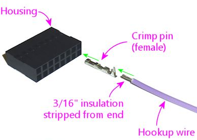
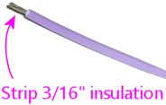
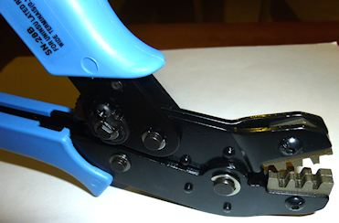
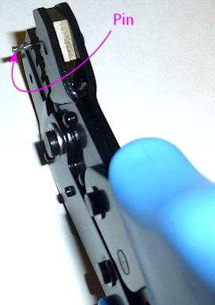
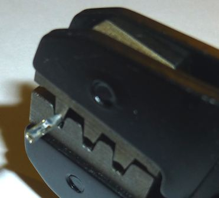
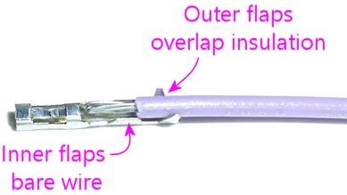
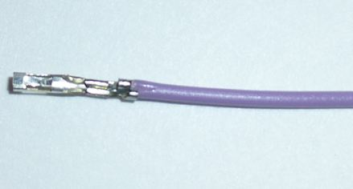
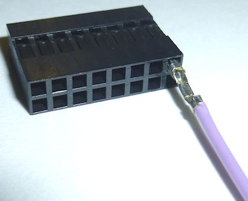

[#crimpPins]
= Crimp Pins

A crimp pin housing is a connector that you build yourself, by crimping hookup wires to individual metal pins, and then inserting the pins into the housing.
The housing is essentially a plastic shell, with sockets that the pins lock into.

What makes crimp pin housings useful is that you get to attach your own wiring to the connector, with an individual hookup wire for each pin.
That makes them ideal for connections where the individual wires won't all go to the same place at the other end.
Some examples:

* The button input header on the Pinscape expansion boards.
The header is set up for a single connector with 26 pins.
Each pin connects to a wire that connects to an individual button, so these wires will all go off to different parts of the cabinet.
* The feedback device outputs on the Pinscape boards.
Like the buttons, these headers provide a group of pins that plug into a single connector, and each pin on the connector will connect to a separate device.

Crimp pin housings are more work to assemble than ribbon cables with IDC plugs because of the pin-by-pin construction.
That makes ribbon cables better for connections where all of the wires go off to the same place on the other end, such as a board-to-board data connection.
Ribbon cables lose their convenience advantage when the wires all go to different destinations, because a ribbon cable is inherently constructed as a single unit with all of the conductors bundled together.

== Tools

The key to easy assembly for these connectors is a *crimp tool* .
This is a sort of hyper-specialized pliers that's purpose-built to perform the crimping step, where you attach the wire to the pin.
If you have the right crimp tool, the crimping step is quick and easy.

This is the tool I use:

link:https://www.pololu.com/product/1928.html[Pololu crimping tool, 16-28 AWG, item #1928]

They also have a similar but slightly cheaper option, item #1929, which is basically the same tool with a more limited size range of 20-28 AWG.
Either one of these will work with the parts needed for the Pinscape boards, but I'd spend the extra $5 on the wider-range model.
That gives you the flexibility to use some of the larger Molex crimp connector systems elsewhere in the cabinet.

== Assembly

We'll illustrate the assembly process using the Pololu 0.1" connectors.
The other types of crimp connectors all work very much the same way, so you should be able to follow these steps for any of the other pin sizes and types.

This procedure is specifically for the Pololu crimper.
The overall procedure should be the same for other crimper types, but I'm not sure they all use the same orientation for how you insert the pins.
Check your crimper's instructions to see if you have to reverse anything in our illustrations.

*Step 1: Prepare the wire.* Cut a piece of hookup wire to the desired length.
Strip about 3/16" (5mm) of insulation from one end.

Make sure that the strands are nice and straight, and all tightly bundled.
You can give them a little twist with your fingers if necessary to tighten the bundle.
What you don't want is to have any stray strands sticking out sideways.

Be sure you're using the right wire gauge for the pin.
Each type of pin has a compatible range of wire gauges, listed in its data sheet.
The 0.1" type listed in the Pinscape parts list are good for wires in the 30-22 AWG range.

*Step 2: Prepare the pin.* Take the pin you want to crimp out of its packaging.
The pins might come attached to a metal strip:

image::images/crimp-pins-on-strip-1.png[""]

The pins are only attached to the strip by thin metal filaments that are meant to break away easily, so just bend it back and forth a few times to release it by way of metal fatigue.

*Step 3: Prepare the crimp tool.* If you're using the Pololu tool, make sure its jaws are full open.
If they aren't, squeeze the handles all the way together and release.
That should release the ratchet and let them spring open.
If they lock shut, squeeze the handles even more tightly and release.

Orient the tool as shown below.

*Step 4: Choose the slot.* Choose the slot to use based on the size of the pin you're using.

(The cheaper Pololu 2-slot tool has the same "small" and "medium" slots as the 3-slot tool.)

If you're not sure, try the slots from small to large.
The pin should fit snugly when placed as in the next step.

*Step 5: Insert the pin.* Insert the pin on the *left* side of the slot as illustrated below.
Be sure to use the correct slot for the pin size as shown above.
Position the pin with the open side of the flaps pointing down.

Be sure that *only* the part with the folding flaps is inside the teeth.
The rest should be hanging out the left side.

Tip: you should be able to find the magic spot by feel.
Hold the pin in the slot starting at the right side of the slot, and pull it left while keeping downward pressure on it.
You should feel a little resistance when it reaches the right spot - this is where the larger outer flaps on the pin come up against the slightly narrower part of the teeth at the halfway point in the slot.

*Step 6: Lock the pin.* Lock the pin into place - but *don't* bend anything yet - by *gently* squeezing the handles until the teeth are closed _just far enough_ to grasp the pin.

Remember, nothing gets bent at this point.
The teeth should just be tight enough to hold the pin so that it can't move, but not any tighter.

Tip: if you got something wrong and you need to start over, you can release the ratchet early.
*Very* gently apply just a little pressure to the handles, then press the little lever illustrated below to release the ratchet lock.

*Step 7: Insert the wire.* Insert the stripped end of the wire into the pin from the right side as illustrated below.

It's hard to see what you're doing with the pin held in the jaws, but here's how the wire is supposed to be positioned:

The idea is that the "inner" flaps grasp the bare part of the wire (for the electrical connection), and the "outer" flaps grasp the insulation (for a strong mechanical bond).

If you're using the right wire size for the pin, it should be easy to insert it to the right point by feel, because the insulation should easily fit through the outer flaps and then get blocked at the inner flaps.
Make sure the wire strands make a nice straight bundle - any stray strands sticking out sideways can make it hard to find the right insertion point by feel.

*Step 8: Crimp!* Making sure everything stays in place, squeeze the handles all the way together.
That'll crimp the pin and release the ratchet.
The finished wire-and-pin combo should pop out.

*Step 9: Seat in housing.* Find the slot where the pin goes in the housing.
Insert it from the "back" side of the housing (the side the wires come out of).
This is the side with the *larger* pin openings.

The pin should slide into the slot fairly easily.
Push it all the way in until snaps into place.

If you can't get it to snap or lock into place, try taking the pin back out and rotating it 90°.
The slot in the housing should have a little plastic latch that grabs onto a little tab sticking out from one side of the pin, so those have to align for the pin to lock.
Each pin/housing system has its own peculiar mechanics for this (it's where the MEs at the connector companies earn their salaries, I suppose).
Some of them work with the pin in any orientation, and some of them only work if the pin is lined up a certain way.
It should be pretty obvious how the latch is supposed to work if you look closely at the pin and housing, but it's usually easy enough to do it by feel.
I can usually get them on the second try if the first one didn't work.

