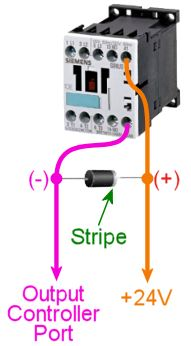

[#coilDiodes]
= Coil Diodes

For every mechanical feedback device that you install in your cabinet, you should install a protective diode.
This applies to *anything with a magnetic coil* :

* Contactors
* Solenoids
* Replay knockers
* Chimes
* Bells
* Relays
* Motors of any kind (shaker, gear, etc)
* Rotating beacons

It's important to install diodes on these devices, because all them have magnetic coils that generate voltage spikes as part of their normal operation.
These spikes, known as "flyback" current, can be quite powerful and can damage your computer motherboard and other electronics, such as your output controllers and other USB devices.
Diodes suppress these spikes and block them from propagating through your system.

Note that these voltage spikes from the coils are unrelated to power surges in your house wiring, the kind that you buy surge-suppressor power strips to protect against.
The coil voltage spikes come from the devices _inside your cabinet_ , so a surge suppressor on your power strip will provide no protection against them.
You always need a diode on each individual coil, to cut off the spike at the source.

Fortunately, diodes are simple to install, and you don't need to know anything about electronics to set them up.

You don't need protective diodes for LEDs, incandescent bulbs, LED strobe lights, or LED light strips.

Diodes are also used in the Pinscape expansion boards, and have many other uses besides coil protection.
This chapter is only concerned with the coil protection usage.
If you want to know more about diodes as circuit board components, see xref:cmpdiodes.adoc#cmpdiodes[Diodes] .

== Don't use diodes with AC devices

Everything we say here applies only to *DC devices* , using DC voltage as the power supply.
*Don't* use diodes this way with devices that run on AC power (for example, anything that plugs directly into a wall outlet for 120V or 240V mains power).
Doing so will cause a short circuit that will blow a fuse (or worse).

== Choosing a diode

I'll just cut to the chase here: link:https://www.mouser.com/search/ProductDetail.aspx?R=621-1N4007[1N4007] .

1N4007 diodes are cheap (15¢ apiece) and have pretty ideal electrical specs for this job.
Buy one for each coil-type device in your cab.

Like any other engineering question, there are different schools of thought on this, and you'll probably be able to find competing recommendations if you ask around.
But the 1N4007 is an excellent general-purpose choice that works well for everything in a pin cab.
If you look at the real pinball machines made in the 1980s and 1990s, they all use 1N400x diodes for this same job.

(One question that's come up in the forums is whether 1N4007 diodes are suitable for high-current devices, such as 4A knocker coils or 3A shaker motors, when the 1N4007 data sheet says the "forward current" limit is only 1A.
The answer is yes, 1N4007 is still suitable for this! As we'll see below, we're not actually using the "forward current" capacity of the diode to carry the 4A knocker coil current or the 3A shaker motor current, because we're going to install these diodes _backwards_ .
The diode will only carry the "flyback" current from the coil, which is quite different from the supply current when the coil is operating.
The 1N4007 has good properties for this job because it has a very high reverse voltage rating [700V], which makes it safe to install backwards for high-voltage devices, and it has a high rating for momentary surge current [30A], which is precisely the nature of the flyback current.)

== How to install them

Each coil-type device in your system should have its own diode.
That's one diode per motor, one per solenoid, one per contactor, and so on.

Type of Device::
Use a diode for everything with a coil, magnet, motor, or really anything with moving parts: relays, contactors, solenoids, knockers, motors, bells, chimes, rotating beacons.
You *don't* need to add diodes to lights with no moving parts (incandescent lamps, LEDs, LED strips, strobes, flashers).

Location::
Install each diode as close to the coil as is convenient.
The diode's purpose is to shunt the voltage surge from the coil back into the coil, to keep the surge from propagating into the rest of the wiring.
As such, you want it physically close to the coil.
I recommend installing the diode directly across the coil's terminals or connecting wires.
+
Don't worry about getting _extremely_ close to the coil.
I've talked to a few people who took the advice about getting close to the coil very seriously, to the extent of disassembling the packaging around a motor or solenoid so that they could get a few centimeters closer.
It's really not necessary to do that.
Just attach the diode at a convenient place where the device's terminals or wires are exposed for connecting externally.
The same terminals where you attach the power wires to the coil are perfect for the diode.

Orientation:: The striped end of the diode *must* be attached to the positive (+) supply voltage to the device.
The other end must be attached to the (-) terminal, which you'll connect to a port on your output controller.

CAUTION: *Orientation is critical!*
Always double-check that you get it right.
If you get it wrong, it'll create a short circuit as soon as you turn on the device, which will most likely damage your output controller.

image::images/QQQIcon.png[""]

But doesn't the stripe on a diode always go to minus?::
In _normal_ uses for diodes, you're exactly right.
But this is a somewhat unusual use case, and in this case we really do want the diode to go *against* the normal flow of current.
The striped end really must go to the *positive* voltage.

How to attach them::
The best way to attach a diode to a particular device can vary depending on the type of terminals it has.
No matter what, though, I recommend always *soldering* the diode to _something_ .
This creates a permanent connection, which is much more reliable than temporary connections like screw terminals.
It will also help protect against accidentally reversing the diode if you should ever have to disconnect the wires, since the diode itself will be permanently installed.
+
If you're using contactors, or anything else with screw terminals, I recommend soldering the diode to your wiring.
Put it a few inches from the ends that you connect the screw terminals.
+
For devices with solder terminals, such as pinball coils and DC motors, you can usually solder the diode directly to the device's terminals.
If they're not close enough together, simply add a short piece of wire to connect one end.
+
If you're using a genuine pinball coil, such as a replay knocker, it might already have a factory-installed diode.
If so, you don't need to add another one.
+
Wherever the diode ends up, you should take care that the bare wire leads of the diode can't come into contact with any other metal or wires.
I recommend wrapping any exposed wire or solder with electrical tape to insulate it.

== My system works without 'em! Why bother?

Some people build their systems without ever hearing about the need for diodes, and sometimes they get away with it, with no obvious problems appearing.
But even if your system seems to work without any diodes installed, you're running the risk of something breaking in the future.
You're putting stress on your other components every time a coil or motor switches off.

The coil surge current isn't always big enough to fry everything instantly.
You can often get away without diodes for a while without any obvious problems.
But the surge current is happening nonetheless, and chances are that it's causing incremental damage that will eventually make something break.

In some cases, missing diodes can cause symptoms that appear to be software problems.
The most common issues that can often be traced to missing diodes are phantom keyboard input (keys seemingly pressed at random), and intermittent USB device disconnections.
If you're seeing anything like that, make sure your coils all have diodes installed, and that the diodes are installed correctly.

== Do I _really_ need this with a motor?

There's a common notion that the surge current from a motor comes from the "generator effect" of the motor.
As you probably know, any electric motor can also serve a generator: turn the shaft with an outside force and you'll generate some electricity with the motor.
So you might reasonably think that the motor's momentum will cause it to keep spinning for a few moments after you turn off the power, making it generate some residual electricity.
Is this what causes the voltage spike in a motor?

The generator effect is real, but no, it's not the source of the spike that we're worried about.
The generator effect voltage is too low to be a problem.

Motors have magnetic coils - that's what makes them go - and these coils have the same physics as solenoid coils.
That means they have the same surge current as other coils.
This is completely separate from the mechanical action of the motor; it's a purely electromagnetic effect, and it causes the same problems in motors that it does in other inductors.

The main reason I point this out is that it's easy to talk yourself out of adding a diode to a motor if you think in terms of the generator effect alone.
You might look at the motor and decide that it just doesn't have enough momentum for this to be a problem.
But that misses the more important point that you need a diode for a motor anyway, simply because it's an inductive device with a magnetic field.

== Theory of operation

If you're interested in learning more about the physics behind this, read on.
You can skip the rest of this section if you only care about the practical dimensions.
Just install the diodes as outlined above and you'll be set.

=== How it works

If you know a thing or two about electronics, you might have noticed that the diode is installed "backwards" from how you'd normally use it, in that we have the stripe attached to the positive side.

Good catch if you noticed that, but it's not an error! We really do want the diode to be installed *opposite to the normal current flow* .
Why?
Think about what would happen if it were installed the other way: when the power goes on, the diode would happily conduct all the current straight through, bypassing the load.
In other words, it would create a short circuit from the power supply directly to the output controller.
This would instantly fry something - the diode, the power supply, or the output controller - with the unrestrained current.

With the diode installed opposite to the flow, though, it doesn't conduct at all when the power goes on.
It's like it's not even there.
all the power goes through the load (the feedback device) just like we want it to, and nothing gets fried.

So if the diode never conducts, what good is it?
Well, it's not quite true that the diode _never_ conducts.
It never conducts _in the power supply direction_ .
But it does kick in when the power turns *off* .
That's when the coil releases the current surge we've been talking about.
Due to the physics of magnetic fields, it turns out that the surge current goes in the opposite direction of the original current that created the field in the first place.
Basically, the energy that gets stored in the magnetic field by the power supply current comes rushing back out in the opposite direction when you take the power away, like the air coming back out of a balloon if you stop inflating it.
The surge current is going "backwards", and the diode is installed "backwards", so the surge current is actually forwards from the diode's perspective.
The diode thus allows the surge current through, sending it back into the coil.
This blocks it from flowing down the other wires that go to the power supply and the output controller.

The electrical resistance of the coil wiring quickly turns the surge current into heat, safely disposing of it.
So the surge fizzles out without damaging any sensitive components at the ends of the wires.

There might appear to be a couple of contradictions in what we've just said.
Let's address any lingering doubts.
First, if it would have fried something to run the _original_ current through the diode, why doesn't it fry something when we run the _reverse_ current through it?
The answer is that the total energy in the reverse current is much lower, because it's not being driven by a power supply; it's limited to the energy stored in the magnetic field, which is fairly small in absolute terms.
The surge does heat up the coil a tiny bit - that's where the excess energy goes - but only a tiny bit.
Not enough that you'd be able to feel it by touch, and not enough to do any damage.
Second, if the flyback current is so dangerous, why doesn't it hurt the coil, or the diode itself?
In this case, the answer is in the different natures of the different components.
Transistors and IC chips are extremely sensitive to voltage, even at very low total energies, because their internal structures are so tiny.
Exposing them to high voltages can punch holes in their internal structures and destroy them.
Coils and wires, on the other hand, are relatively indifferent to voltage levels as long as the total power is limited.
The point of the diode is to isolate the surge current so that it stays inside the coil - and away from your other circuitry - since the coil isn't affected by momentary high voltages.
As for the diode itself, it's a perfect gate-keeper, because the 1N4007 can handle high voltages _and_ high momentary current surges, which is exactly what the flyback current looks like.

=== Where the surge current comes from

When you send electricity through a coil of wire, the moving electric charge induces a magnetic field in the region around the coil.
For devices like solenoids and motors, the magnetic field is the whole point, because it's what converts the electrical energy into mechanical action.

The inductive effect converts the energy going into the coil from electric to magnetic energy.
Most of that magnetic energy goes straight into the mechanical action that the device is designed to produce, such as spinning the motor or moving the solenoid plunger.
But a portion of the energy goes into the field itself.
So the field contains a certain amount of energy as long as it's standing.

When you switch off the electricity, you stop feeding energy into the magnetic field, so the field can no longer sustain itself and starts collapsing.
At this point, the energy contained in the field has to go somewhere.
The most direct path for the field energy to escape is straight back into the coil wiring.
Like many processes in physics, induction works in both directions: an electric current induces a magnetic field, and a magnetic field induces an electric current.
The collapsing magnetic field induces a current through the coil wiring.
This "field collapse" current moves in the opposite direction of the original current (from the power supply) that created the field.

The current induced by the magnetic field collapse is the surge we've been talking about.
The thing that makes it harmful is that the field collapse happens very quickly.
When the electricity shuts off, the magnetic field has a Wile E.
Coyote moment where it suddenly realizes it's suspended in mid-air, and instantly plummets to the ground.
In this case, the magnetic field energy escapes rapidly into the coil, transferring all of its energy to the coil in a few milliseconds.
The sudden surge of charge drives the voltage very high.
For a 12 Volt coil, the surge can spike to 300 or 400 Volts.

Even though that's a very high voltage, it's not typically a threat to human safety, because the total amount of energy in the collapsing field is relatively small.
The voltage gets so high only because the surge is so brief.
But a brief high voltage _is_ a threat to certain types of electronic components, especially the microelectronics in integrated circuit chips.
Those devices are physically so tiny that it doesn't take much energy to damage them.
It only takes a brief blast of high voltage.
It's the same thing that makes static electricity discharge such a danger for many electronic devices.

You can find more about this in the Wikipedia article about link:https://en.wikipedia.org/wiki/Flyback_diode[flyback diodes] .

