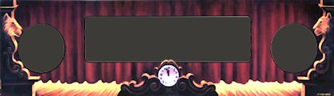
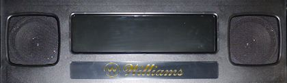

[#dmdAssembly]
= Speaker/DMD Panel

The speaker/DMD panel is a fairly complex piece of equipment, and new cab builders can find it challenging to assemble and install.
This is one of those features of the real machines that's not well documented anywhere, and it's really not obvious looking at the parts how they're supposed to go together.

There are two rather different styles of speaker panels that were used in the Williams machines from the 1990s that most of us use as the model for our virtual cabs.
Both types can be adapted to a virtual cab, so the first step in setting up your speaker panel is to decide which one to use.
This chapter provides some details on the two types to help you decide.
In the two following chapters, we'll provide detailed instructions for assembling and installing each type.
They're different enough that we'll give each type its own chapter.

== Original 1990s style

The first type of speaker panel that we'll look at is the "original" style that was used in Williams machines from the early 1990s to about 1995.
This style uses an MDF panel with a front plastic facing silkscreened with game-specific graphics.
For example, here's the panel from _Theatre of Magic_ (Bally, 1995):

This design is something you can fabricate yourself, since the main elements are the MDF base (which you can make with a router) and the plastic facing (which you can have made by a laser-cutting service).
You can also buy the pre-cut MDF panels and the plastic facing (in acrylic) from VirtuaPin.

The _original_ original speaker panels that Williams used had asymmetrical speaker cutouts - a 5.25" cutout on the left and a 3" cutout on the right.
This was because they used different speakers on the two sides: a large midrange driver on the left and a smaller tweeter on the right.
This arrangement might seem strange in a modern context, where the whole point of a left/right speaker pair is stereo sound.
But it makes more sense if you remember that all the audio source material on these games is monophonic.
They had no need for left/right channel separation.
It's just a single-channel enclosure with a woofer and a tweeter.

For virtual cabs, everyone (almost everyone, at least) uses a matched stereo pair of full-range speakers instead of the midrange/tweeter combination that the real machines used.
As a result, we don't want that bizarre arrangement with two different cutout sizes; we want the same cutouts left and right.
So that's what we use in our plans presented later in this chapter: we give you the choice of two 4" diameter cutouts or two 5.25" inch cutouts.
VirtuaPin's MDF panels are available with the same options.
(VirtuaPin also sells the original asymmetric design for people replacing original equipment on real machines, but you probably don't want to use one of those for a virtual cab.)

Another small difference between the "original original" design and the reproduction design we use for virtual cabs is that the originals used a PETG plastic facing with the graphics directly silkscreened onto the plastic, whereas a reproduction typically uses acrylic with printed decals.
There's no practical difference in the results; the arcylic-with-decals approach is just a more DIY-friendly process.

== WPC-95 panel style

Most of the Williams machines made in 1995 and later used a revamped design for the DMD panel, which we refer to as the WPC-95 style.
In this design, they greatly simplified the manufacturing process by making the whole panel a single piece of molded plastic.
They dispensed with the MDF base and the plastic facing, integrated the H-channel trim into the plastic form, and got rid of most of the extra hardware.

They also made the appearance more generic, to make the part interchangeable among games.
The plastic facing with the custom graphics for each game is gone; instead, you just see the matte black face of the plastic panel.
The only graphics on the production machines were a Williams or Bally logo.

Because of the single-piece molded plastic design, it's not practical to fabricate these as a DIYer.
But you can buy new ones as replacement parts from any of the pinball suppliers, for about $100.

== Stern Spike 2 style

Many of the newer Stern games, made from about 2016 onwards, feature a 15.6" LCD video display in place of the 1990s dot matrix display.
Like the WPC-95 panels, the Spike 2 panels omit any game-specific graphics.

Virtual cab builders have long used LCD panels of this same size to emulate the older DMD devices.
15.6" is a common panel size that's widely available, and it just happens to be almost exactly the same width as the traditional 128x32-dot plasma DMDs used in the 1990s machines, so it's a near-perfect fit as a DMD replacement.
The only incongruity is that a 15.6" laptop panel is a lot taller than the original plasma DMDs, but that's an easy problem to solve: just stick the LCD panel behind a regular speaker panel with a standard DMD-sized cutout, and the panel hides the excess height.
Some of the screen area goes unused, since it's hidden behind the panel, but the player doesn't care.

The Stern Spike games take this same setup and open up the cutout vertically to show the full height of the panel.
This lets the Stern game designers use the full 16:9 display area rather than confining the graphics to the smaller (shorter) DMD area.

The Spike 2 speaker panel would work well in a virtual cab if you like the idea of exposing the entire video display, rather than simulating the older DMD look.
I don't have enough information on these panels to provide fabrication instructions, but there's little reason to build your own anyway, since the original factory part is readily available.
Here are the Stern part number references:

* Spike 2 display/speaker panel, 515-9842-00
* Speaker panel spacer, 545-9877-01
* Speaker panel hinge, 515-9845-00
* 4" speaker, 031-5004-02

Note that the Stern panel doesn't include a mounting bracket for the LCD panel, since the bracket has to be customized to fit the specific panel you choose.
You'll probably have to improvise your own bracket.

This panel style might be interesting as future-proofing.
At the moment, most Visual Pinball simulations won't take advantage of the extra display height compared to the WPC DMD style, since their score graphics are exact reproductions of the original DMD layout, leaving most of the top and bottom of the screen blank.
As time goes on, though, it's possible that newer games will take more advantage of larger displays.
I imagine that the newer Stern games will eventually make their way into Visual Pinball simulations, at which point the original full-screen graphics would take full advantage of your larger display area.

== Recommendations

My personal favorite style is the "original" 1990s style (the type with printed artwork on the plastic facing).
I like the ability to customize the artwork to complement the overall cabinet theme, and the structure (MDF base and acrylic facing) is something that a DIYer can fabricate.
What's more, the old design is flexible about what type of speakers you use, since you can cut the speaker openings to any size you desire (if you're fabricating it yourself), and you can drill additional holes in the MDF as needed for fasteners, in case the speakers don't fit the exact layout of the original design.

Some people prefer the WPC-95 style (the one-piece molded plastic design) because it looks more modern to their eyes, being the style used on the last generation of machines that Williams made.
Some people also prefer it because you can buy the factory part rather than having to build something yourself.
I think the plain black styling is a bit boring, but that's arguably a big plus for a virtual cab, where you want the cab to be a chameleon.

The Stern Spike 2 style is gaining popularity among virtual cab builders because of its larger display area, and because it looks the most modern, being the format that the newest Stern machines use.
I personally have a nostalgic preference for the early 1990s look, as most of my all-time favorite titles are from that era, but that's an aesthetic preference.
In terms of function, the Spike 2 format's larger display area is clearly more versatile, and will leave your system better prepared for virtual versions of the newer Stern games with full-screen video.

== Assembly and installation

The details of the two panel types are very different, so we'll break them out into separate chapters:

*  xref:dmdAssemblyOriginal.adoc#dmdAssemblyOriginal[Original WPC Speaker Panel]
*  xref:dmdAssemblyWPC95.adoc#dmdAssemblyWPC95[WPC-95 Speaker Panel]

