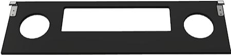
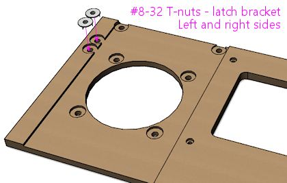
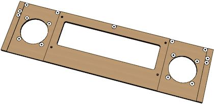
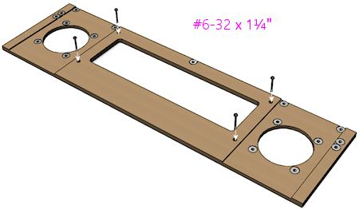
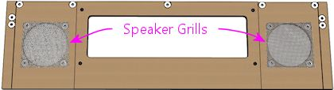
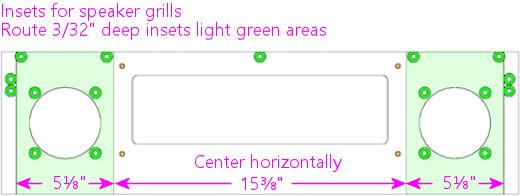
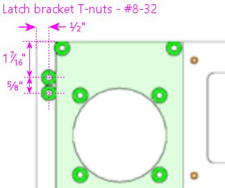
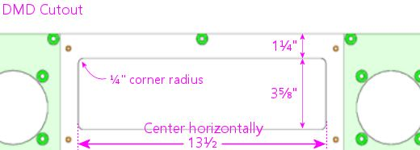
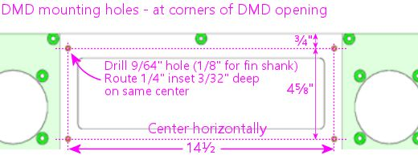
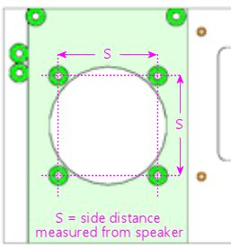

[#dmdAssemblyOriginal]
= Original WPC Speaker Panel

This chapter goes into the details of the "original" WPC style of speaker/DMD panel, based on the ones used in the Williams and Bally machines of the early 1990s.
These panels feature flat plastic front facings with silk-screened graphics, customized for each game.
As an example, here's the speaker panel from _Theatre of Magic_ (Bally, 1995):

image::images/tom-speaker-panel.png[""]

Panels for other games from this era have the same overall shape, with the same cutouts for the speakers and display, but each game has its own unique graphics that harmonize with the backglass artwork (which is, of course, positioned immediately above this panel).

Around 1995, Williams switched to a different style of panel, which dispensed with the artwork to make them interchangeable among games, and which was constructed as a single molded piece of plastic to reduce assembly cost.
See xref:dmdAssembly.adoc#dmdAssembly[Speaker/DMD Panel] for more about the two main types of panel, and see xref:dmdAssemblyWPC95.adoc#dmdAssemblyWPC95[WPC-95 Speaker Panel] for details on the WPC-95 type in particular.

== Buying or building

Fabricating your own speaker panel from scratch is a fair amount of work, because it requires a lot of precise cuts with a router.
If you do want to do it yourself, we'll give you complete plans xref:#dmdPanelPlans[later in this chapter] .

If you want to buy a fully pre-fabricated panel, you can get a "blank" panel (without any game-specific graphics) from link:https://virtuapin.net/[VirtuaPin] .
These come fully assembled with all the required parts (MDF base, clear acrylic facing, H-channel, speaker grills, and fasteners).
You just need to add a decal for graphics.
The price is about $130.

Notably, none of the pinball supply companies currently sell the MDF base panels.
VirtuaPin seems to be the only place you can get those.
The pinball suppliers do sell all the miscellaneous hardware, such as the latch brackets and H channels, but not the MDF base.
The Marco Specialties catalog lists a large number of game-specific "speaker panels", but those are just the silk-screened plastic face plates - they don't include the MDF base.
The same is true for almost every "speaker panel" listing you'll see on eBay.
If you're looking for full ready-to-use panel, check carefully before buying to make sure you're getting the complete panel and not just the facing.

There are also two options for partially building the panel, with some help with the trickiest wood-working portion:

*  link:https://virtuapin.net/[VirtuaPin] sells the bare MDF base, with all cutting and routing done, but without any hardware.
That runs about $30.
This takes care of what I consider the hardest parts of making the MDF panel, which are cutting out the openings for the display and speakers.
Those have to be precisely measured and neatly cut for the result to look professional.
The rest of the work with this option is just installing a bunch of T-nuts and other hardware, which is comparatively easy.
* You can have a laser-cutting or CNC service cut the panel outline, the speaker and display cutouts, and the drilled holes, all from a computer template, and then do the routing and assembly by hand.
The price varies a lot by vendor, but you should be able to have this done for about $30 including materials.

== Installing the panel

Let's start with how you install the speaker panel in the backbox.
This is one of the big mysteries for first-time cab builders, so I think it'll help with the rest of your planning to see how the panel fits into the backbox, and how you install it and remove it.

First, there's one set of parts that we have to install on the speaker panel.
Specifically, we have to install the latch brackets that hold the panel in place.
(If you already have a fully assembled panel with the latch brackets installed, you can skip this step.) These are Williams/Bally part number 01-8535, and they look like this:

image::images/speaker-dmd-bracket.png[""]

They install on the back of the panel at the top corners:

If you bought a pre-cut speaker panel from one of the pinball vendors, it should already have two holes drilled for each bracket, and a T-nut (#8-32) should be installed behind each hole, so all you have to do is line up the brackets and screw them in.
Use #8-32 x 3/8" machine screws, of the "countersunk" type illustrated below.
If you're fabricating your own panel, see our plans xref:html#dmdPanelPlans[later in this chapter] for the drilling locations.

Fasten the latch brackets with #8-32 x 3/8" countersunk machine screws

Next, there's some prep work in the backbox.
The DMD panel is held in place by a couple of wood rails attached to the walls (which we call the "guides"), and a "U" channel at the bottom of the backbox.

If you followed our WPC cabinet plans to build the backbox, you should already have installed the guide rails.
If not, you should go back and put those in place now.
The detailed plans are under "Translite/DMD guides" in xref:cabBody.adoc#transliteGuideTrim[Cabinet Body] .
(Note that speaker/DMD panel only requires the lower set of guide rails described there.
The upper set is for the translite, and you might not need or want those, depending on how you're installing your main backbox TV.)

To save you a little time, here's a quick summary of the plan:

Our WPC cabinet plans didn't say anything about that "U" channel, though.
We intentionally saved that for now, because it's easiest to get it aligned properly using the assembled DMD panel as a guide.

The "U" channel is also known as the Lower Speaker Panel Bracket, Williams/Bally part number 01-8569-1.
The original part is available at link:https://planetarypinball.com/[PlanetaryPinball.com] (none of the other pinball vendors seem to carry it), and you can also find upgraded replacements with custom finishes from "mods" vendors.
You can substitute a generic *⅝" x ⅝" U channel* from a hardware store, cut to the required length to fit your backbox width (27⅛" for the standard WPC backbox).

This type of U channel is available in aluminum from Home Depot and other hardware stores.
Note that it's only sold in fixed lengths (like 4' or 8'), so you'll have to cut it to the right length yourself.
But that's easy to do with a hacksaw; the metal is pretty thin.

To prepare it for mounting screws, drill three holes in the bottom of the channel as illustrated below.
I'd use 3/4" #6 wood screws for this, so drill to fit those.
The exact locations aren't important; just eyeball them, one hole near each and and one near the center.

Paint it as desired before installing.
In the original pinball machines, it was always painted to match the backbox interior color (usually black).
But it is a visible piece of trim, so some people use a metallic finish to match the side rails and lockbar, especially if they're using custom finishes for those.

To install it, use the speaker panel as a template to figure the alignment:

* Put the U-channel on the floor of the backbox at about the front edge; this is the tentative position where it'll go
* Tilt back the speaker panel slightly, and fit the hooks on the back of the panel over the guide rails

* Lower it into position on the rails and into the U channel (adjusting the U channel position as needed), until the panel is resting in the channel

* Mark the position of the U channel
* Remove the speaker panel
* Make sure the U channel is aligned with the markings you just made, and secure it using wood screws

Any time you need to remove the DMD panel, simply lift it out of the U channel, lift the latch brackets clear of the guide rails, and it's free.
To put it back, repeat the procedure above: fit the latch brackets over the rails and lower the bottom into the U-channel until it's firmly seated.

== Designing graphics for the panel facing

The speaker panels on the real machines from the early 1980s to mid 1990s were printed with custom game-specific graphics.
This was sometimes an extension of the backglass art, such as in _Theatre of Magic_ , and sometimes included extra display features, such as _The Addams Family_ 's ☆THING☆ lights or _Earthshaker_ 's jackpot value display.

image::images/tom-speaker-panel.png[""]

Speaker panel graphics examples: *Theatre of Magic* (Bally, 1995); *The Addams Family* (Midway, 1992); *Earthshaker* (Williams, 1989)

For a virtual cab, this is another area where you can create your own custom graphics.
Here's my speaker panel, for example:

=== Printing the decal

There's a slight complication in using a decal for the speaker panel graphics: the cutout in the middle for the display.

With all the other decals in your cab, holes in the middle are no problem.
You can just cut them out with an X-acto knife after installing the decal, by running the knife around the edge of the hole.
That technique works for the flipper button holes, coin door cutout, etc, but it won't work here! The problem is that we're going to affix these decals to the clear acrylic facing, and _there's no DMD hole to trace_ in the acrylic facing.
In the original design that Williams used, and in both our plans and VirtuaPin's products, the acrylic facing is continuous across the DMD area with no cutout.
The speaker openings _are_ cut out, by necessity, but not the DMD area.
This was intentional in the Williams machines, probably mostly to protect the display physically, but it also creates a cleaner appearance.

So if it's impossible to use the X-acto knife tracing technique, what can we do? There are a couple of potential ways to handle this, but really only one good way:

* Not so good: Print the whole decal on transparent film.
This is what I thought of first when I was building my cab, but Brad Bowman (the printing pro who did my decals) set me straight on this, explaining why it's not a good idea.
To do it right, you'd need the print shop to print an opaque white layer under your graphics, which most retail print ships can't do.
Without an opaque white backing, the graphics would be invisible against a black MDF background, and washed out against a white MDF background.
In addition, you don't want the sticker to cover the DMD opening anyway, even if it were transparent, since it wouldn't be as crystal clear as the acrylic.
* Good: Print on normal opaque stock, and have your print shop laser-cut the DMD opening out of the decal during production.
This is the right solution, and most print shops can do it.
You give them a cutting template and they'll make the cutouts as specified.
You can have them laser-cut the speaker openings at the same time so that you don't have to cut those out by hand later.
I used this approach for my speaker panel decal and it worked perfectly.

Applying a decal with cutouts is easier than you'd think.
The trick is that the print shop will install a "mask" on the visible side of the decal.
The mask is a layer of adhesive paper (similar to masking tape) that covers the whole decal, including the cutout areas.
It makes installing a decal with cutouts just like installing a decal without any cutouts.
Once the decal is in place, you peel off the mask, and what's left behind is the decal with your cutout areas removed.

Here's the cutting plan for the decal.
This is based on the plans we provide later in this section, so it'll work if you're fabricating your own panel based on our plans.
If you're using pre-cut panels from VirtuaPin or another vendor, I'd take measurements from your physical panel instead of relying on this, since there might be some variations in different vendors' versions of the panel.

Some notes:

* Center the speaker cutout circles vertically
* The speaker cutout circles should be exactly the same size as the ones used in your MDF panel and acrylic facing (the usual sizes are 3¾" diameter cutouts for 4" speakers, and 4¾" diameter cutouts for 5.25" speakers)
* Center the speaker cutout pair left-to-right in the overall decal width
* Center the DMD cutout left-to-right in the overall decal width
* Many printers will want you to include some extra padding around the perimeter of your design, such as an extra 1" all the way around.
Adjust the cut positions accordingly.

== Painting

Before assembling the panel, you should paint the MDF panel in the desired finish color.
The most important areas to paint are the inside edges of the DMD and speaker openings, since those are visible through the cutouts.
Everything else is hidden - the whole front is hidden by the plastic facing, and the back is inside the machine.
I found it easiest to paint the whole front side, getting the edges of the cutouts while I was at it.
This also ensures that you won't see any raw MDF poking out around any of the openings.
The original Williams panels are painted flat black, which helps avoid any reflections around the display.

I think it's better not to paint the back side, in case you want to use any adhesive fasteners for anything attached to the back.

== Assembling the panel

Here's the procedure for assembling the panel from parts.
If you bought a partially assembled panel from VirtuaPin, just skip the parts where we talk about things they've already installed for you.

=== Install the T-nuts

Install #8-32 T-nuts for the speakers, latch brackets, and H-channel, as illustrated below.
The T-nuts are all installed from the *front* side of the panel.
The front is the side with the insets around the speakers.

When all the T-nuts are installed, it should look something like this:

=== Install the DMD screws

The original WPC speaker panels used an unusual type of screw for the DMD attachment points, known as a "spiral fin shank" screw.
These have flat nail-like heads, machine screw threading down most of their length, and wood screw threading at the top (head) end.
This weird combination is designed so that you can permanently fasten the screw to a wood panel with the threaded end sticking out, to make an attachment point.

These are so minutely specialized that you can probably only find them from pinball vendors like Marco Specialties or Pinball Life.
Look for Williams/Bally part numbers 237-5957-00 (#6-32 x 1-3/16") or 4506-01104-20 (#6-32 x 1-1/4").

If you prefer to avoid the special pinball parts, you can make this work with ordinary #6-32 x 1-1/4" machine screws.
It takes a little extra improvisation, which we'll explain below.

With either type of hardware, you insert screws from the *front* side of the panel, as illustrated below.

Note how the screws go in through the front side of the panel so that the threaded ends stick out the back.
These screws are going to serve as mounting posts for the DMD device or laptop display screen.
The DMD (or mounting bracket for your video panel) has holes that will fit over these screws, and you'll use nuts to fasten it.

The arrangement with these screws is unusual in that you want them locked in place on the panel.
You'll use them to secure the DMD device, by fitting nuts onto the bolts - but to make this work, the bolts must be fixed in place so that they can't turn, because you won't be able to access the screw heads after assembling the panel.
If you're using the special fin shank screws mentioned above, they're specifically designed to work this way, but if you opted for ordinary machine screws instead, they'll need a little help.

For the special spiral fin shank screws:

* Push the screw into the hole in the panel, tapping it with a hammer if necessary, until it's pushed through up to the "fin" portion
* Slip a #6 washer over the threaded end sticking out the back
* Fit a #6-32 nut onto the threaded end
* Tighten the nut, holding/pressing the head to keep the screw from turning
* As you tighten the nut, the fin threading will be forced to tap into the wood like a wood screw
* Keep tightening the nut until the fin is fully embedded in the wood and the head is flush
* Remove the nut and washer; the screw should stay securely locked into the panel by the fin threading

For ordinary #6-32 machine screws, the best way I can think of to keep the screws locked to the panel is to glue the heads into place with epoxy or other strong glue.
I don't recommend using nuts or other fasteners instead, in part because they might get in the way of the DMD or video panel, and in part because they could loosen over time.
You won't be able to access the heads after assembly because of the way the front plastic facing will be attached with adhesive, so the screws really have to be permanently installed.
Here's the procedure I used:

* Mix up some epoxy, or use some other strong glue of your choice
* Insert the four DMD screws from the *front* side of the panel, so that their heads are all the way into the little recesses
* For each screw, back it out just enough to expose the head, put a generous dab of glue all around the head under it, then push it back in all the way in
* Keep the panel turned front-side-down while the glue dries, so that the glue won't ooze down the screw threads
* Put wax paper (or something that the glue won't stick) to under the panel while it dries, in case any glue drips

The idea is to glue all the screws in place at the heads without spreading glue over the rest of their length.
You still want to be able to fit nuts onto them to install the DMD panel, so you don't want any glue smearing onto the threads while you insert the screws or dripping down the threads after they're installed.

=== Install the speaker grills

Parts:

* For 4" speaker openings: Stern 535-8081-00, 535-8081-01.
Available in a variety of colors, including metallic finishes.
* For 5.25" speaker openings: I can't find any speaker screens specifically for 5.25" speakers in the old panels.
The closest thing is the speaker grills for the WPC-95 panels, Williams/Bally 04-10382-7-4.
Those are for the 5.25" squarish openings in the newer panels, but they should also fit the round openings in the old panels, possibly with a little trimming required.
Another option is to get a pair of the 7" screens designed for use with the subwoofer ports in the bottom of the main cabinet (Williams 03-8603-1, 03-8603-3, 01-6733).
Those are the same material, and it's easy to cut them to a smaller size with scissors.
* If you want to look for the raw materials, the screens are made from perforated plastic, black, 1/16" thick, with 1/8" holes on staggered 3/16" centers, 40% open.
That turns out to be a common perforation pattern for both plastic and metal sheets (such as stainless steel or brass, which can look nice in some color schemes).
You can find materials like this from bulk industrial supply vendors online.
The snag is that those guys all sell in large sheets, which can be pricey.
Expect to pay upwards of $50 for a 24x24 inch or larger sheet of plastic, and more for metal sheets.
The other snag is that, for whatever reason, it's hard to find the bulk plastic sheets in black - they're usually white or gray.
But that might be just the thing for your color scheme.

The speaker grills install on the front side of the panel.
Fit them into the recesses around the speakers.

The 4" type should come with holes pre-cut at the corners to match the screw holes, so align those with the T-nuts.
For the 7" type, you'll have to cut holes at the corners to match the screw holes.

You might want to tape these in place with a little masking tape, to keep them from sliding around during the rest of the assembly procedure.
The screws that attach the speakers will help hold the grills in place once they're installed, but we need something to keep them stationary until then.
Make sure that the tape isn't be visible through the cutouts.

=== Install the acrylic facing

If you're planning to use decals with graphics, apply the decals to the acrylic before installing it.

The acrylic attaches to the MDF with double-sticky tape.
(It seems jury-rigged, but that's the way they built many of the originals.
Some apparently used glue instead, but I find the tape easier to work with.) Use a good quality foam tape, but not one of the super-strong permanent adhesives, because you might want to be able to pry this thing off at some point.
There all of those buried parts that you can't get to any other way.
And don't get carried away with vast amounts of tape.
A couple of pieces of tape at the bottom corners should be enough.
The whole top edge will be held in place by the "H" channel molding, so you don't really need any tape there.

Once the tape is in place, carefully align the facing with the MDF and press it onto the tape.

=== Install the latch brackets

The latch brackets are Williams/Bally part number 01-8535:

image::images/speaker-dmd-bracket.png[""]

They install on the back of the panel at the top corners:

Install each bracket with two #8-32 x 3/8" countersunk machine screws:

=== Install the H-channel trim

The H channel trim goes across the top of the panel.
Orient the channel so that the screw holes are on the back side, on the bottom half, so that they align with the screw holes in the MDF.

Fasten the panel with four #8-32 x 3/8" pan-head machine screws.
On the real machines, they also use external-tooth lock washers with these.

Note that the H channel and MDF panel both have holes for five screws.
You should *omit the middle screw* .
The Williams panels also usually left out the middle screw, because it's too close to the DMD.
This is even more important with an LCD video display, since it'll extend a little past the top of the H channel - if the screw is there, it can come into contact with the face of display and scratch it.
Better to leave it out to avoid that.

image::images/speaker-panel-h-channel-3.png[""]

== Installing the speakers

This part should be easy.
Your speakers should have mounting holes arranged in a square pattern around the perimeter of its base plate.
Assuming your speakers are the right size for your panel, these should line up with the four pre-installed T-nuts around the perimeter of each speaker opening in the panel.

Fasten with #8-32 screws.
You might need to try different lengths to find the right length, since it depends on how tall the base ring around the speaker housing is.
Make sure the screws aren't so long they hit the acrylic on the other side; you can always add some washers to take up extra length if needed.

The real machines use external-tooth lock washers with the screws to help secure them.
This is to help prevent the screws from working themselves loose from vibration - and obviously, a speaker's whole job is to produce a lot of vibration.

If your speakers don't fit the panel, you can either replace them with speakers that do fit, or you can create an ad hoc adapter from another piece of MDF or plywood.
To create an adapter, cut a piece of MDF slightly larger than your speaker's footprint, with a circular cutout large enough for the speaker aperture, and mount your speaker to that.
Drill holes in the adapter to match the speaker mounting holes in the speaker/DMD panel, then mount the adapter to the panel.

[#speaker-led-strips]
== Installing speaker LED strips

One of the popular mods with the pinball collectors these days is speaker lighting, usually via LED strips placed around the perimeter of the speaker openings.

You can buy retail kits to retrofit this kind of lighting into the real machines.
One of those would easily adapt to a virtual cab since we're using identical speaker panels.
But as long as you're assembling your own panel, it's actually pretty easy (and inexpensive) to add lights yourself.

The parts required are:

* The common "5050" RGB strips sold on eBay, RGB, 1cm wide, 60 LEDs per meter (the exact same type used for xref:lightStrips.adoc#lightStrips[undercab lighting] ).
You need a length equal to the twice the circumference of your speaker openings; about 1 meter should be plenty.
* 
One "Mini Controller for RGB LED light strips" from eBay; many types are available, including remote controlled and Wi-Fi, but the cheap "mini 3 key" type (about $3-5) like the one pictured at right is more than adequate for this job
* 1cm nylon spacers for your speakers, quantity 8
* Stiff cardboard or similar material, black

If you're lucky, you won't even need the spacers and cardboard.
The 4" speakers I got from Flipper Fidelity have a built-in 5/8"-deep spacer ring at the front, which is perfect for this - I simply stuck my LED strips around the inside perimeter of the spacer ring.

But most speakers don't have any sort of spacer at the front, so you have to fashion your own.
Cut a 1 cm-wide strip of the cardboard or other material you're using as the spacer - equal to the width of the LED strip.
Form this into a circle.
Stick the LED strip to the inside.
Position it over the speaker opening in the panel.
Use the nylon spacers to install the speaker just behind the ring.

Alternatively, you might be able to stick the LED strip directly to the perimeter of the speaker cutout circle in the MDF itself.
The only snag is that the MDF isn't as thick as the LED strips are wide, so it's not a perfect fit.
The LED strips are 1 cm wide, and the MDF is only about 7 mm thick here because of the speaker grill routing on the front, so the LED strip will stick out beyond the back of the panel by about 3 mm.
If your speaker's cone is a little recessed, the excess might happen to fit into the recess, in which case you're done.
But if there's not room, you can add 5 mm nylon spacers between the speaker and the panel, or you can just use a few washers to serve as spacers.

=== Wiring the speaker LEDs

The red and black wires coming out of the mini-controller have to be wired to 12VDC power, so you'll need to run some hookup wire into your cab where you can get to a 12V power supply.
The LED connection to the mini-controllers usually use those little 4-pin LED strip connectors, which you can also find on eBay.
See xref:lightStrips.adoc#lightStrips[Undercab Lighting] for information on the peculiar little connectors used with these light strips - since these are the same type of light strip, you should be able to cobble together the right set of connectors by consulting that section.

It can be a little difficult to manage the wires attaching to the LED strip.
I don't have any particular tricks to suggest; just be patient until you find an arrangement that works.
You should secure the wiring to the back of the panel with a couple of wire clips once you have a good setup so that you don't pull it loose in future work.

I simply wired the strips in my two speakers together with hookup wire, so that they both run off of the same controller.
The controller I have remembers its last mode setting, so it's a set-and-forget sort of thing.
You just click through the modes until you find one you like, and leave it there; that same mode will then be used each time you power up the machine.
The mode I use on my machine is a slow color rotation.

If you prefer, you can skip the mini-controller entirely, and instead use your feedback controller and DOF to control the speaker lights.
This is just a matter of wiring the speaker LED strips exactly like the same way you wire your undercab strips, as explained in xref:lightStrips.adoc#lightStrips[Undercab Lighting] .
The DOF config tool doesn't have a pre-programmed toy for "Speaker Lights", so the simplest thing to do is wire the speaker lights directly to your undercab lights, so that they use the same DOF color effects.

==

== Foam tape around the DMD opening

This is optional, but on the real machines, they installed a ring of 1/4"-thick black foam tape around the DMD opening on the back of the panel.
Common weatherstripping tape works perfectly, and it's cheap.
To match the original equipment, use tape that's 1/4" thick and 3/4" wide, self-adhesive on one side.
(Don't use double-sticky tape - you don't want it to stick to the display device.) Simply affix a strip on each edge of the DMD opening, flush with the edge.
Black tape is best because it'll be essentially invisible and won't reflect any glare from the display, and it's the easiest thing to find anyway.

Use black foam weatherstripping tape around the edges of the DMD opening, 1/4" thick by 3/4" wide.
This protects the display panel from scratches and creates a little gap between the display and the back of the MDF, which is especially helpful for LCD panels.

They used foam tape on the real machines with the original amber plasma DMD devices, but it happens to be even more beneficial with LCD panels.
The tape protects the display from scratches, reduces rattles (there are speakers attached right next to this thing, after all!), and it spaces things out a little bit.
The extra space is especially helpful with LCDs because of the way they stick up slightly above the top of the MDF panel.
The extra space keeps the panel from pressing against the top "H" channel trim.

== Installing a real DMD

It's easy to install a real DMD device in the standard panel, since the layout of the "posts" you installed earlier is designed specifically to fit the mounting holes on the DMD.
All real DMD devices should use exactly the same mounting hole pattern that they used on the original displays from the 1990s.

Your DMD device should have corner mounting holes that line up with the four "posts" sticking up out of the back of the panel - those 1¼" screws that we epoxied into the panel earlier.
Fit the DMD mounting holes over the posts and seat the front of the DMD flush against the panel.
Use #6-32 nuts with lock washers to fasten it.

== Installing a video panel for the DMD

Installing a laptop LCD panel in place of a DMD device takes some improvisation, since the speaker panel wasn't designed with this in mind.
There are some slight mismatches that we have to work around.

The first mismatch is that the laptop panel will probably be too tall.
A 15.6" 16:9 LCD display is a perfect fit for the width of the DMD opening, but it's much taller than the opening, and it's even a little taller than the speaker panel overall.
Being taller than the opening is no problem; when you set up the window layouts in your various pinball programs, you can just move the DMD window so that it's in the visible portion of the display, and leave the hidden portion of the display unused.
Being taller than the whole panel is a little more of a problem in that a small portion (usually less than an inch) will stick up above the top of the panel.
But that's usually not a problem.
If you're using a translite, the translite will sit directly above the top of the panel, resting in the H-channel, so the excess portion of the laptop display will be hidden behind the translite.
There's usually nothing else occupying this space, so there shouldn't be any conflicts.
So the height mismatch, at least, is one of those things that looks like it might be a problem, but ends up solving itself.

The second mismatch, which does require some work on your part, is that the LCD panel won't have any mounting hardware that lines up with the "posts" on the speaker panel.
A suitably sized panel should just fit between the posts side-to-side.

So you have to come up with your own mounting apparatus.
It's not hard, but I don't have any "standard" solution to suggest.
I used sheet metal to fashion some brackets that fit over the "posts" and hold down the edges of the panel, securing these with nuts on the posts.
If you want something more off-the-shelf, you might try looking at picture/mirror hangers at a hardware store - something like a mirror clip would probably work.

[#dmdPanelPlans]
== Speaker panel construction plans

The original Williams speaker/DMD panel was designed to hold an asymmetrical speaker pair, with a large 5.25" speaker on the left and a small 3" speaker on the right.
The speaker cutouts and mounting holes in the panels were sized to match.
The different speakers were used because, contrary to appearances, they were _not_ a left/right stereo pair.
They were in fact a midrange/tweeter pair, and were wired for monophonic playback.

In contrast, most virtual cab builders today use a pair of full-range car speakers, and connect them as a stereo pair.
As a result, we want the two speaker openings to be the same size, unlike the original Williams panels with their asymmetrical cutouts.

Fortunately, it's easy to adapt the basic speaker panel plan to whatever mix of speaker sizes you prefer.
Everything about the plan stays the same except for the size of the speaker cutouts and the positions of the screw holes for mounting the speakers - those obviously have to be changed to match the speakers you're using.

So we'll start with the base plan, with all the specs that are independent of speaker size.
Then we'll provide two sub-plans for the most commonly used speaker sizes: 4" and 5.25".
Those are the sizes that almost everyone uses because they're standard sizes for car speakers, which means that lots of options aFre available.

=== Materials

* The main panel is *3/8" MDF* (medium-density fiberboard)
* The plastic cover on the original equipment was 2mm PETG, but most virtual cab builders use *2mm clear acrylic* , since it's easier to find
* Optionally, a decal printed with custom artwork

The original equipment had the artwork screen-printed directly onto the PETG cover, but that's not practical for most DIYers.
You can easily have a custom decal printed, and it'll look just as good.

=== Base plan

Everything in the base plan is independent of speaker size, so start with this regardless of what type of speakers you're using.

all the routed insets (shown in the diagrams below as green and orange areas) are on the same side, which will be the front of the panel when it's done.

The panel is symmetrical left to right (the left side is a mirror image of the right side), so everything in the panel should be referenced to the center point.
This will be especially helpful if you're using a custom width.

All illustrations below show the front side of the panel (the side with the acrylic overlay, facing the player).

NOTE: if you're using the special spiral fin shank screws for the DMD attachment posts, drill 1/8" holes; if you're using ordinary machine screws, drill 9/64".
The smaller hole will help the fin shank screw fasten more securely.

=== Cutouts for 4" speakers

Use these speaker cutouts if you're using speakers that fit the standard 4" car speaker design.
Everything else is the same as in the base plan above.
Center the cutouts in the speaker grill area.

=== Cutouts for 5.25" speakers

Use these speaker cutouts if you're using speakers that fit the standard 5.25" car speaker design.
Everything else is the same as in the base plan above.
Center the cutouts in the speaker grill area.

=== Cutouts for custom speaker sizes

Since the base plan is independent of speaker size, it's easy to use any non-standard speaker size.

To create a custom plan:

* Start with the base plan
* Measure the distances between the *centers* of the mounting holes on your speaker, as shown below:

* For the circular cutout, use a diameter of *D minus 3/4"*
* Center the circular cutout in the speaker grill area

* Use the speaker as a template to mark the positions of the mounting holes, centering it on the circular cutout, or use the measured side distance "S":

* Drill and route the mounting holes using the normal #8 T-nut scheme from the base plan

=== Front facing

The plastic facing, thankfully, has a much simpler cutting plan than the MDF.
The only cut lines needed are the exterior outline and the two speaker opening cutouts.

image::images/speaker-panel-orig-facing.png[""]

Center the speaker cutouts vertically, and center the pair horizontally, with the spacing between their centers as shown.

The cutout circles should be exactly the same size as the speaker cutout circles in the MDF panel.
The usual sizes are 3¾" diameter cutouts for 4" speakers, and 4¾" diameter cutouts for 5.25" speakers, but go with whatever you used for the MDF panel.

The width we're using for the plastic facing is a hair less than the width of the MDF panel (1/16" less, to be precise).
This is intentional, and it also seems to be what Williams did, at least for the panels I've measured.
My rationale for making it slightly narrow is to allow a little room for error in case you don't get the width cut perfect on both pieces.
The MDF is sized to be a tight fit to the backbox, so if the facing were to overhang the MDF on either side, it might not fit at all.
Cutting the facing a hair narrower than the MDF makes it a little more forgiving, especially considering that you also have to line up the speaker cutouts on both pieces.

=== WPC-95 style facing

If you want to emulate the xref:dmdAssemblyWPC95.adoc#dmdAssemblyWPC95[WPC-95 style] using the original style's MDF construction, you could substitute matte black acrylic for the clear acrylic, and cut out the DMD opening in the facing.
(With clear acrylic facing, the DMD is normally left covered by the acrylic, and that portion is left transparent rather than being covered by graphics.)

One visual difference with the WPC-95 style facing is that the speaker cutouts in the front facing are square rather than round.
Approximately square, anyway; the sides are a little rounded, as illustrated below.

Here's a cutting plan for the acrylic layer using this design.

Use that for the acrylic facing only.
For the MDF portion, use the base plan with 5.25" circular speaker cutouts.

Note that this still won't look exactly like a true WPC-95 speaker panel.
The plastic on those panels is textured to give it a satin finish, which you wouldn't be able to reproduce precisely with acrylic.
In addition, the edges of the speaker and DMD cutouts are beveled with a rounded fillet; the edges will be squared with laser-cut acrylic.
But those differences are very minor; only a real pinball nerd would ever notice them.

=== Customizing the width

If you're using a custom backbox size, adjust the overall width of your panel to just slightly less than the inside width of your backbox - 1/16" to 1/8" less, depending on how tight a fit you want.
For comparison, the original Williams speaker panels are about 1/16" less than the inside width of the standard backbox.

Here's how to adjust the other elements when changing the width:

* Keep the DMD cutout centered, and at the same height
* Keep the latch bracket T-nuts at the same distances from the outside edges
* Keep the H-channel T-nuts at the same distance from the top edge
* Place the middle H-channel T-nut on the left/right centerline, and position all the other H-channel T-nuts based on their distances from the middle one
* The standard H-channel trim will fit fine on a wider-than-standard panel; it'll just leave some uncovered space at the sides.
You'll have to cut the H-channel for a narrower-than-standard panel.
Cut equal amounts from either side so that the screw holes remain centered.
* Adjust the speaker positions left-to-right for the desired appearance; nothing else depends on these positions, so you can put them wherever you like as long as they don't conflict with the DMD, latch brackets, or H-channel

