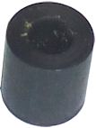
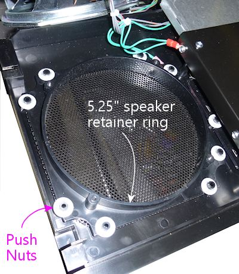

[#dmdAssemblyWPC95]
= WPC-95 Speaker Panel

This chapter goes into the details of the WPC-95 style of speaker/DMD panel, which is the type used in Williams and Bally machines from about 1995 and later.
This type of panel is formed from a single piece of injected-molded plastic, in matte black, usually with a Williams or Bally manufacturer logo in metallic paint.

image::images/dmd-panel-wpc95.png[""]

These panels didn't have any artwork apart from the manufacturer logo, so they're interchangeable across games from the WPC-95 generation.

There's a different style used in Williams/Bally machines made before 1995, which had an MDF core and plastic facing with screen-printed graphics specific to each title.
See xref:dmdAssembly.adoc#dmdAssembly[Speaker/DMD Panel] for more about the two panel types, and see xref:dmdAssemblyOriginal.adoc#dmdAssemblyOriginal[Original WPC Speaker Panel] for details on fabricating, assembling, and installing the older style.

== Buying or building

It's probably impractical to fabricate your own version of this type of panel.
The originals are single-piece injection-molded plastic, which is a process that's very cheap if you're making a lot of copies of something, but expensive if you're just making one.
3D printing can often come to the rescue in a situation like this, but in this case it's probably not workable, since the part so large - 27" wide.
A commercial 3D-print service might be able to fabricate an item this large, but it's likely to cost at least twice as much as buying the factory part.

If you really want to create your own panel of this style from scratch, I think you're better off not trying to duplicate the exact construction, but instead faking it a little bit, by building one that _looks like_ this style but uses the construction techniques of the xref:dmdAssemblyOriginal.adoc#dmdAssemblyOriginal[older panel style] .
You can use the old design to make a panel that looks very much like the WPC-95 style simply by using a matte black plastic piece for the front facing.
It'll still be a little different in the details, mostly in that it will lack the beveling around the speaker and display cutouts, but you'd have to look very closely to notice.

If you want an exact match to the WPC-95 style, you can simply buy one as a replacement part from a pinball supply vendor, such as Marco Specialties or Planetary Pinball.
Replacement panels are available with Williams or Bally logos pre-printed in silver or gold.
Look for part numbers 04-10382-7A, 04-10382-7B, 04-10374-7A, 04-10374-7G: those are all the same except for the logo selection.
They run about $100.

== Backbox preparation

The WPC-95 panel installs in the backbox via "bushing buttons", Williams/Bally part 02-5223.
You need four of these.
These install with #8 x 1" flat-head wood screws.

Install on the inside of each side wall (left and right) of the backbox, as shown below:

image::images/speaker-panel-wpc95-bushings.png[""]

* Locations are to the centers
* Drill a small pilot hole for each screw
* The lower bushing is 1" above the floor, 5-9/16" from the back wall
* The upper bushing is 7⅜" above the floor, 5-9/16" from the back wall
* Screw in each bushing with a #8 x 1" wood screw
* Orient the bushing so that the side with the conical indent for the screw head faces out - the screw head should recess into the indent so that it's flush with the bushing once installed
* Install the other two bushings on the opposite side

== How to insert and remove the panel

The panel has slots on the back that fit over the bushing buttons.

To install the panel initially, lay it flat with the back facing up.

Fit the bottom edge _under_ the lower bushings.

Align the bottom slots in the panel with the lower bushings, then lift the panel to fit the bushings into the slot.
Pull the panel forward about an inch to seat the bushings in the slot.

image::images/speaker-panel-wpc95-install-4.png[""]

The panel is now installed! You can remove it again at any time by reversing the process to free it from the lower bushings and slide it out of the backbox.

The current position, with the panel attached to the lower bushings and folded down, is the normal service access position.
You can fold it down like this any time you need to access the back of the panel, or any time you need to access the interior of the backbox behind the panel.
This ability to fold the panel down without removing it is a convenience feature for the repair staff - one of the little improvements in the WPC-95 design.

To finalize the installation and get the panel into its proper position, simply tilt the panel up, rotating it around the lower bushings.

When it's almost straight up, you'll have to lift it slightly to fit the top slots in the back of the panel over the upper bushings.
Once you have it aligned, push the panel back onto the bushings, then lower the panel into the seated position.

To fold it back down for service access, lift the panel straight up to get the top slots aligned with the upper bushings again, then ease the top edge forward to get it free of the upper bushings.
It'll now rotate on the lower bushings to fold down flat against the top of the cabinet.

== Installing the speaker retainer rings

Important: if you're not using 5.25" car speakers in your panel, you might want to skip installing the retainer rings, if they're not already installed.
The retainer rings are designed specifically for 5.25" speakers.
For other sizes, it's better to skip the original rings and create your own adapter instead.
If you _are_ using 5.25" speakers, you should install the rings, since they make it really easy to mount the speakers.

In keeping with the molded plastic design, the WPC-95 panel has some companion parts called "speaker retainer rings" that are needed to install speakers.

There are two types of these retainer rings:

* "Large", for 5.25" car speakers, Williams/Bally part number 04-10382-7-2
* "Small", for 3" car speakers, Williams/Bally 04-10382-7-3

For a virtual pinball project, you'll usually want two of the 5.25" rings, which look like this:

And when installed:

In addition, you'll need speaker grills that are cut into the right shape to fit the openings.
Pre-cut grills are available under Williams/Bally part number 04-10382-7-4.

WPC-95 speaker grills, part #04-10382-7-4

On the 1990s machines, Williams always used an asymmetrical speaker pair, with a large midrange speaker on the left and a small tweeter on the right.
You'd think this would have been a stereo pair, but it wasn't; Williams thought of the panel as a single-channel speaker with two drivers.
As a result, if you order a complete WPC-95 speaker panel assembly with all the goodies included, it'll probably include one large and one small retainer ring.
So you might need to order a second large ring to accommodate your second speaker.

Some panels come with speaker rings pre-installed, and if so, the right side will usually have the small 3" ring.
In this case, you'll probably want to remove the small ring so that you can replace it with a 5.25" retainer ring instead.
To do so, remove the eight push nuts around the perimeter; once they're gone, you can simply lift the retainer ring off the posts.
The push nuts are designed to be installed once and then never removed, so you might have to break them in half to get them out.
Many people who have done this say that the best or maybe only way to extract them is to cut them in half with wire cutters; others report success prying them out with small screwdrivers.
In either case, be very careful not to break the molded plastic posts while you're working.
The push nuts are expendable, but the posts would be hard to fix.

If your panel didn't come with the retainer rings already installed, or if you have to install a second large ring after removing a small one on the right speaker cutout, installation is easy:

* Install the speaker grill first - it has to go under the ring.
Fit it over the opening with the notches at the corners aligned with the posts in the panel.
* Fit the ring onto the eight posts around the perimeter of the speaker cutout.
* Install a 1/4"-shaft push nut on each post to secure the ring.
The push nuts work just like the name says - push them onto the posts as far as possible.
* If your assembly didn't come with push nuts, or you had to destroy your old ones to remove them, you just need some generic 1/4"-shaft push nuts.
The pinball suppliers don't seem to have anything matching, so you'll have to get these from a hardware store or online.
They're kind of obscure for the likes of Home Depot, so it'll probably have to be online.
One part that reportedly fits is Tinnerman PS250385.

== Installing 5.25" speakers

If you haven't already installed a 5.25" speaker retainer ring in each speaker cutout, follow the procedure above.
If your speaker panel came with the retainer rings pre-installed, but one of them is for a small 3" speaker, you'll have to remove the 3" retainer ring and replace it with the 5.25" version.
This is also explained in the section above.

Once the retainer rings are installed, there's nothing to installing 5.25" speakers.
The rings have screw holes that should line up with the mounting screw holes on your speakers.
Line up the speaker and fasten it with #6-32 machine screws.
The length of screw needed will vary depending on the thickness of your speaker's mounting frame base.
Start with 3/4" screws, and use something longer if necessary.

== Installing other speaker sizes

Williams designed these panels for 5.25" and 3" speakers, period.
They didn't make any attempt to facilitate installing other sizes of speakers.

If I had some other size of speaker that I wanted to install, my first inclination would be to return them and get some standard 5.25" speakers instead.
It's easy to find good speakers in that size, and the integrated mounting hardware on the panel makes it practically no work to mount them (see the section above).

If you really insist on using a different speaker size, it can be done - you just have to create your own improvised adapter plate.
This will take the place of the normal retainer ring.

* First, remove any existing retainer rings already installed on the panel.
See the section on installing the retainer rings above for details on how to remove rings that are already in place.
* Create an adapter from a 4½" square piece of ½" thick MDF.
Cut a circular opening in the middle of the MDF matching your speaker's aperture, and drill holes around the perimeter that line up with the mounting holes on the speaker.
Also drill holes at the corners that match the pattern of the eight posts on the back of the speaker panel that are used to attach the speaker retainer ring.
* Mount the speaker to the MDF board using machine screws and nuts.
* Attach the MDF board to the back of the speaker panel, where the speaker retainer ring would normally go.
Fasten with push nuts.
* For more detailed instructions, try link:https://www.dziedzic.us/[Joseph "Tony" Dziedzic's] tutorial for upgrading original WPC-95 speakers:

link:http://www.dziedzic.us/wpc_speaker_plastic_display_panel[www.dziedzic.us/wpc_speaker_plastic_display_panel.html]

== Lighting the speakers

Some people install LED strips around the perimeter of the backbox speakers, just for the sake of another lighting effect.
See "Installing speaker LED strips" in xref:dmdAssemblyOriginal.adoc#speaker-led-strips[Original WPC Speaker Panel] .
The same approach should work for the WPC-95 speaker panel.
The retainer rings should serve as a good mounting surface, assuming your speakers don't protrude too far in front of their mounting base; if they do, you can add some spacers between the speaker and retaining ring to create more room for the LED strips.

== Installing a real DMD

Before installing a DMD, you should install the clear acrylic display shield (Williams/Bally part number 01-13636).
Fit it over the posts and fasten with push nuts.
The same push nuts used with the speaker retainer rings (such as Tinnerman PS250385) will work here.

The speaker panel is designed specifically to fit the plasma DMD devices that were used in the original WPC machines.
The DMD should have mounting holes at its corners that align with screw holes in the back of the speaker panel.
Align the device and fasten with #6-32 machine screws.
You might need nylon spacers between the device and the panel.

== Installing a video panel for the DMD

You'll probably want to install the clear acrylic display shield (Williams/Bally part number 01-13636) before installing a video display.
Fit it over the posts and fasten with push nuts.
The same push nuts used for the speaker retainer rings (such as Tinnerman PS250385) will work here.

The speaker panel's mounting holes are specifically designed for the plasma DMD devices used in the WPC machines.
Williams didn't anticipate that these would ever be switched to a different type of display, so they made no provision for attaching modern video panels.
You'll have to improvise your own brackets.
Laptop panels are small enough and light enough that you don't need anything particularly strong, so this isn't too difficult, but I don't have any "standard" solution solution to suggest.
On my "original style" speaker panel, I used sheet metal to fashion some brackets that fit over the edges of the video panel, and then fastened those to the speaker panel using the screws intended for the DMD.
If you want something more off-the-shelf, you might try looking at picture/mirror hangers at a hardware store - something like a mirror clip might work.

Note that a laptop video panel in the appropriate width for the DMD window is usually just a little too tall for the speaker panel.
It'll probably stick up above the top of the speaker panel by a little under an inch.
That's usually not a problem, since the extra height will be hidden behind the translite.

