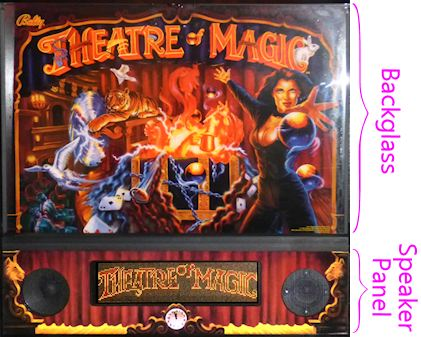
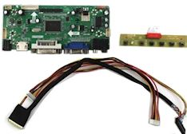

[#selectingDmdDevice]
= Selecting a DMD Device

Most real pinball machines from the mid 1980s to present use a split backbox setup, with a backglass at the top showing the game's theme artwork, and a separate panel at the bottom containing a scoring display and the audio speakers.

Typical WPC backbox layout.
The bottom 1/3 is the speaker panel, containing the audio speakers and a dot matrix display (DMD).
Games made up until about 1995 used the style shown here, with silkscreened graphics on the front of the speaker panel.
Later Williams games used a more generic black plastic panel without any graphics apart from a Williams or Bally logo.
The upper 2/3 is the backglass, displaying backlit still artwork for the game.

The backglass portion on most machines from the 1990s is just some static artwork, usually a "translite" (a screen-printed piece of plastic film stuck to the back of a clear sheet of glass), lit from behind.

The scoring window changed over the years.
In the 1980s, they used segmented numeric displays, and later alphanumeric displays, like on old pocket calculators.
In the early 90s, they switched to monochrome dot matrix displays ("DMDs"), typically 128x32 dots.
The DMDs could display full graphics, although 128x32 monochrome pixels is obviously very coarse by today's standards.

Many virtual cab builders follow the 1990s design, except that they replace the backglass with a video monitor.
This means that you need a separate display device in the DMD area, which is why this design is usually called the "three-screen" cabinet: you have one screen for the playfield, a second for the backglass, and a third for the DMD.
The third screen can be an actual 128x32 monochrome plasma DMD, just like in the the 1990s originals, but most cab builders these days substitute a small video panel instead, since that's cheaper, easier to set up, and more versatile.

This section looks at the options for the third screen, to help you decide which type to use, and offers some pointers for buying the equipment you decide on.

== Overview of DMD technologies

The DMDs in the original 1990s pinball machines were monochrome plasma displays, 128 pixels wide by 32 pixels high.
That made for very large pixels that you could see individually.
This visible "dot" structure, and the particular amber color of the plasma, gave the displays a distinctive appearance that many people now see as a defining feature of this generation of pinballs.
To a lot of people, it doesn't feel like real pinball if it doesn't have the amber dots.

You can still buy the original plasma panels, and it's even possible to use them in a virtual cab (although, as of this writing, there are no commercial interface kits available to facilitate this).
There are also newer display technologies that can be substituted into the score panel to achieve similar looks, with some modern improvements.

The first newer alternative is LED-based 128x32 dot matrix displays.
LED displays are available with the same pixel pitch and layout as the original plasmas, so they can serve as close substitutes.
LEDs don't perfectly replicate the nuances of plasma's visual effect, which has a soft, analog, neon feel to it that some people find charming.
LEDs are crisp and bright but can seem a little harsh in comparison.
But LEDs definitely share some of the more important positive properties of plasma, particularly high brightness and wide viewing angle.
LEDs are also cheaper than plasma and longer lasting, so collectors of the real machines often replace defunct plasmas with LED panels when repairs are needed.
LEDs are also being used on many new titles being shipped today, so plasma is no longer the sole "original equipment" on real pinballs.
Stern no longer ships new games with plasma displays at all; they switched to LED DMDs in 2013.

The original LED DMD panels were monochrome (available in a variety of colors, including something approximating the distinctive plasma amber), but panels are now widely available with RGB pixels, which can display full-color graphics.

The other newer alternative to plasma is to use an actual video display, typically an LCD panel.
For a virtual cab, an LCD panel is easier to set up in terms of software, since it just looks like another video monitor as far as Windows is concerned.
Pinball simulators will happily simulate the look of a plasma DMD on a video display by drawing large amber dots to simulate the 128x32 pixel structure.
Of course, an LCD panel can't perfectly reproduce the brightness or viewing angle of a plasma, but it can at least do a passable impression of the appearance.

A 15" diagonal 16:9 LCD screen happens to fit the width of the standard DMD opening in the pinball speaker panels.
It's a trifle taller than the standard panels overall, but since it sits behind the panel, that's not typically a problem, as it's hidden behind the translite, which sits directly on top of the speaker panel.

=== Recommendations

For a virtual cab, you can in principle use any of these technologies - an original plasma DMD, a monochrome LED DMD, a full-color RGB LED DMD, or a video display.
(Although what you can actually buy right now is somewhat more limited.) The tradeoffs are complex, but it mostly comes down to your priorities:

* If you have fond memories of the 1990s machines, and you want to match that look, a plasma display is the way to go.
Plasmas are the authentic equipment, so they'll look exactly right.
A plasma is also quite bright, so some people like the way it becomes part of the "light show".
The downsides are that plasma displays are expensive and fairly complex to set up.
They require a special high-voltage transformer as the power supply; VirtuaPin sells an appropriate transformer, so it's at least easy to source, but it adds to the complexity for installation.
Another downside to plasma devices is that they fade as they age and eventually wear out, although I believe their longevity is a function of powered-on time, so you can probably expect a plasma to last a very long time in home use.
I have several real pinball machines with original plasma displays that have been in home use for over 25 years, and I haven't had one exhibit any signs of fading or failing yet.
* If you want to replicate the 1990s look but want to reduce the complexity a bit, a monochrome LED is a good choice.
These look very close to the plasmas - they're even brighter, and you can even get them in a fairly close color match to that special plasma amber if you want, as well as in a range of other colors.
They're a bit simpler to set up than plasmas because they don't require the special power supply.
They also have a longer reliable service life than plasma.
They're more complex to set up than a video display, though, and more expensive.
* If you like the "dots" look of the 1990s machines but want to add full color support, consider an RGB LED.
These are slightly more expensive than the monochrome LEDs, and they're about the same in terms of setup complexity.

I was really excited when the RGB LEDs first came out, because I thought they were going to be the perfect combination of the original plasma look and modern full-color flexibility.
But I'm sorry to report that the reality isn't that simple.
I know some people are going to hate me for saying this (particularly people selling RGB DMDs!), but I actually think a video display does a more convincing job of replicating the "dots" look than an RGB LED.
The problem is that the sub-pixel structure on the RGB LEDs is way too obvious; it makes the individual dots look too small.
It's very noticeably different from the plasma and monochrome LEDs.
That's a first-hand opinion, too: I have machines with both kinds of displays at home, and to my eye the video display looks more like the real thing.

* If you're not attached to the idea of using 1990s-era equipment for its own sake, a video display is the best overall option.
It's cheaper than any of the 128x32 DMD options, it's easier to set up, it's more flexible, and to my eye it actually does a better job of re-creating the "dots" look than the RGB LED displays do.

The only drawback of a video display (other than that it's not authentic 1990s pinball equipment, which you might or might not consider a drawback) is brightness.
The plasma displays are quite bright, and a monochrome LED is even brighter.
(RGB LEDs are a mixed bag on this score because of the sub-pixel structure; brightness depends quite a bit on the color being displayed at any given pixel.) From comparing my own machines with different display technologies, though, I think this is often overblown when people talk about it on the forums.
Side by side, they're really not that different.
And I think when you compare the overall visual quality, an LCD video panel has the edge.

In terms of flexibility, a video display can do both "dots" and full-resolution graphics.
The "dots" look can be easily simulated on a full-res display, and all the pinball software is set up to do just that, because it's all written primarily for desktop machines where video displays are the only thing going.
What a video panel can do that a 128x32 DMD can't is display high-res graphics when it's not displaying "dots".
For example, when playing an EM game that doesn't use the score window at all, you can use it to display added game graphics or manufacturer logos at full resolution.
Video panels also look much nicer when playing 1980s "alphanumeric display" games, because they can accurately simulate the 14-segment display look.

Video is also the most compatible option.
Every pinball program for Windows naturally works with a video display, since that's just how Windows works; support for a DMD device has to be intentionally added on by each program's creator (or hacked in by reverse-engineering, which the pin cab community has successfully accomplished with several commercial titles).

When I first started on my virtual pin cab project, almost everyone building cabs felt that plasmas were the Cadillac of scoring displays, worth almost any amount of extra cost and extra trouble to set up.
But I think this has completely reversed in the time since then, because the real pinball world has largely moved on to more modern technologies.
These days, pinball machines you might see in public places use such a mix of dot matrix and video displays that both seem perfectly "real" now.
Some of the newer Stern titles are shipping with DMD-sized video displays as original equipment, and Jersey Jack Pinball's entire line uses large video monitors in place of the DMD panel.
You even see lots of classic 1990s machines retrofitted with full-color video displays, thanks to link:https://colordmd.com/[ColorDMD] , a company that makes drop-in replacement displays for the old machines.
So I expect that many cab builders starting new projects now and in the days to come will be less fixated than earlier cab builders were on the idea that the plasma DMDs were the only "real" pinball displays.
There's definitely a lot of nostalgia value to the old plasmas, but overall I've come to think that video is the best option.

== Purchase options

At one point, it was possible to buy any of the display technologies mentioned above - plasma, monochrome LED, RGB LED, or video.
But the buying options have become a lot narrower lately.
The PinDMD v2 doesn't appear to be available any longer, and that was the only readily available way to hook up an original plasma display or a monochrome LED panel.

So at the moment, there are two options: video, or RGB LED.

=== LCD video panel

If you plan to use a video panel for the score display, the best fit is a 16:9 panel, approximately 15.5" diagonal.
This is just about a perfect fit for the 13.6" width of the standard DMD opening in a speaker panel.
A panel of that size is just barely taller (by about a centimeter) than the standard speaker panel's outside dimensions, but that's typically not a problem, because the excess height is easily behind the translite panel, assuming you're using one.

A few TVs are available in this size range, but I'd recommend against those.
They tend to use low-quality LCD panels.
The much better solution is to use a laptop display panel.

You can buy replacement laptop LCD panels in this size range on eBay or Amazon.
These panels come bare, with no interface electronics, because they're sold for repair work where you only need to replace the panel and nothing else.
This means that you have to buy a separate piece of electronics, called a video controller, that serves as the interface between the panel and the PC video card.

To find these parts, start by searching eBay for "15 wuxga".
You should find a number of matches, usually listed as replacement parts for Dell, HP, Acer, and other laptop brands.
You should narrow the list to panels that specify 1080p or, equivalently, WUXGA (1920x1080) resolution, and a screen size of 15.5 or 15.6 inches.
The price range for these panels as of this writing is about $50 to $100.
The matches you're looking for are just bare laptop display panels - an LCD screen in a thin metal shell.
They'll look something like this:

Don't try to choose a specific panel yet; just keep the search results ready.
The next step is to find a video controller that works with one of these panels.
eBay doesn't provide any tools to help with this, so you'll have to do some manual searching.
Open a new eBay search window.
Go down your list of panels.
For each one, find its model number in the listing and type it into the search window, adding "controller".
For example, if you find a panel with model number LP156WH4T, type "LP156WH4T controller" into the search box.
If you're lucky, that will turn up a few hits with the model number in the title.
Be sure the model number is actually in the title or is explicitly mentioned in the listing as a compatible model.
The controllers will usually look something like this:

If you don't have any luck, or you're not sure you found the right match, I'd recommend picking a panel that looks good and contacting the seller to ask which controller to use.
The seller should be able to point you to the right device.
Most of these panels use similar control interfaces, so you don't actually need a controller designed especially for your panel.
Sellers list them for specific panels simply because they know people like us are searching for them that way! Technically, you just need a controller that matches the interface type on your panel, but the ads don't usually list enough information to find them that way, so a model number search is the only way to be sure.

Pay attention to connectors.
Most of the interface boards will have a VGA input and either a DVI-D or HDMI input.
If you've already picked out a graphics card for your cabinet PC, be careful to pick an interface board that has a connector matching an available output on your graphics card, taking into account the outputs you'll be using for your main playfield TV and backbox TV.

How do you know if a panel is good in terms of video quality, reliability, etc.? You're not going to find reviews (professional or user-written) for any of these OEM parts, so it's a bit of a crapshoot.
Fortunately, laptop panels in this class have gotten to be good enough that you should be okay with anything that meets the specs.
Do pay attention to the resolution, though: the WUXGA laptop displays seem to be uniformly good, but the lower res displays are uniformly bad.

One note on setting up your new panel: be aware that the control board might support more resolution modes and refresh rates than the panel itself does.
Many of the modes that the controller allows you to select with the Windows control panel might simply not work with the panel or might produce poor-quality video.
When you first set up the panel in Windows, make sure you select the screen size (resolution) and refresh rate that exactly match the panel's physical design.
That might take some trial and error, since eBay OEM parts don't usually come with any documentation.
If the display looks fuzzy or distorted, or doesn't show anything at all, try other refresh rates to see if you can find one that looks better.

=== RGB LED

If you decide on to use an RGB LED dot matrix display device, there are two ways to accomplish it: you can buy one commercially, or you can build one yourself using DIY plans that some pin cab enthusiasts developed and published.

====  RGB LED - commercial

link:https://virtuapin.net/[VirtuaPin] sells the PinDMD v3, a full-color (RGB), LED-based, 128x32 dot matrix display.
The display panel has the same physical dimensions and dot pitch as the original plasma displays in the 1990s machines.
It's about $270.

This is a turn-key commercial kit, so it's relatively plug-and-play.
It uses a USB device to interface to the PC.
It requires some software setup; instructions are included, and VirtuaPin offers warranty support.

====  RGB LED - semi-DIY

link:https://pin2dmd.com/[Pin2DMD] is a DIY project for building an RGB DMD panel from parts.
The site provides a parts list and assembly instructions, as well as software for a microcontroller to interface to the PC and run the display.
The prices for the parts vary, but at a guess they'll total about $100.

Note the confusingly similar name: Pin2DMD is the DIY project, and PinDMD v3 is the commercial product above.

The Pin2DMD site includes software to install on a microcontroller board (one of the parts that goes into building the project) that interfaces with the PC and runs the display.
However, note that the software is _not_ open-source, and requires payment of a license fee.

The closed-source software makes me hesitate to recommend the project.
It's supposedly "DIY", but given that you don't have any control over the software or any ability to change it to suit your needs, I think "DIY" is actually a negative in this case.
You have to do the assembly yourself, you don't get any warranty support, and you don't even get any control over the final product.
Open-source projects have the first two drawbacks, but they make up for it by giving you full control to customize and expand.
You don't get that here; you just get the bad aspects of DIY and the lack of control of commercial products.
But I guess you can at least save some money vs the retail version.

=== Plasma panels

Plasma doesn't appear to be an option at the moment.
VirtuaPin formerly offered the "v2" PinDMD, which was a monochrome of the PinDMD v3 device mentioned above that worked with your choice of monochrome 128x32 LED panels or the original plasma panels used in the 1990s machines.
But that product doesn't appear to be available anywhere as of this writing.

You can still buy the bare Vishay plasma panels from link:https://virtuapin.net/[VirtuaPin] , along with the special 80V/100V transformers needed to power their high-voltage sections, but VirtuaPin doesn't sell anything that would let you hook it up to a PC.
I don't know of any other commercial or DIY options for connecting these.

If you're an experienced software developer with some hardware knowledge, you could design your own controller using one of the inexpensive ARM-based microcontroller boards, such as a Raspberry, BeagleBone, or one of the STM32F series boards.
The software involved is actually very simple: you just need to consume USB packets from the PC and send out a clocked serial bit stream to the plasma device, 1 bit per pixel.
The electronic interface is documented in the Vishay data sheets, and it will be immediately recognizable and straightforward to anyone who's done any device interface work with a microcontroller before.
If you do create such a project, please publish it as open source, and let me know about it so I can include here.

=== Monochrome RGB panels

As with the plasma panels, you can buy monochrome RGB panels as components, but there's no software interface to the PC available.
The panels are available from a few after-market pinball suppliers who sell them as drop-in replacements for dead plasma displays in real pinballs. Since they're specifically designed as drop-in replacements for the Vishay panels, their electronic interface is identical, so any solution you can find that will work with the Vishay panels will work equally well with these. As requested above, please let me know about any solution you develop or find for this and I'll add it here.

