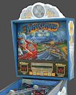
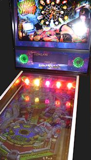

= DOF Config Tool Device Descriptions

When you set up your cabinet with DOF, you'll want to use the link:https://configtool.vpuniverse.com/[DOF config tool] to map out the physical devices in your cab. This lets the Visual Pinball table scripts know how your physical devices relate to the events in the game.

The Config Tool lets you make these assignments by telling it the type of device attached to each output controller port. The tool has a pre-defined set of standard types, so you just choose the matching type for each device. These are all in terms of pinball abstractions, because that's how DOF knows to connect them to events in the game. Most of these pinball device types are self-explanatory, but some of them are obscure, and some use virtual pin cab jargon that might not make sense even if you're a long-time pinball fan. To help clear up the confusing parts, below you'll find a list of all of the device names that appear in the Config Tool, along with explanations of what they mean and how they're usually implemented in a virtual cab.

*Start Button:* The lamp inside the Start button on your cab's front panel. On most games, this either stays lit the entire time, or lights up or flashes when there are coin credits available to start a new game. See xref:buttonLamps.adoc[Button Lamps] .

*Launch Button* and *Authentic Launch Ball:* Both of these options are for the lamp inside your Launch Ball button, if you have one. They're both meant to be used with the same button light, but they behave slightly differently. You get to choose the one whose behavior you prefer. See xref:buttonLamps.adoc[Button Lamps] .

The difference between the two options is pretty subtle:

* The regular "Launch Button" setting turns on the button lamp in most games whenever a ball is in the plunger chute.
* The "Authentic Launch Ball" setting only turns on the button lamp when you're playing a machine that _originally_ had a Launch button in place of a plunger. On those machines, it reproduces the original behavior of the Launch button light on the real machine. When you're playing a game that had a plunger in the original arcade version, this setting generally leaves the Launch button light off.

For example, suppose you load _Earthshaker_ into Visual Pinball. The real _Earthshaker_ has a plunger, not a Launch button, so the "Authentic Launch Ball" light will stay off the whole time you're playing this table. Now suppose you load _Medieval Madness_ into VP. Real _MM_ machines have a Launch button instead of a plunger. In this case, "Authentic Launch Ball" will control the lamp using the same pattern it would on a real _MM_ machine. In contrast, the regular "Launch Button" setting would turn the light on in either game whenever a ball is in the plunger chute.

The Config Tool offers both options for the sake of flexibility, to let you customize it according to your tastes. If you want the button to light up for most games, even games that originally had plungers, choose Launch Button. If you want the button to faithfully simulate the way the real machines work, choose Authentic Launch Ball.

My advice is to choose according to whether or not you have a plunger in addition to the Launch button:

* If your cabinet _only_ has a Launch Ball button, and no plunger, choose Launch Button. Since you don't have a plunger, you'll be using your Launch button in every game, so it's nicer to have it light up most of the time.
* If your cabinet has _both_ a plunger and a Launch button, use Authentic Launch Ball. That's better if you have both controls, because it will make your cabinet give more prominence to whichever control is appropriate for the game you're playing at any given time. When you're playing a plunger table, the Launch button will stay dark and discretely step into the background. When you're playing a plunger-less table, the Launch button will light up whenever a ball is ready, inviting the player's attention.
* If your cabinet only has a plunger and no Launch button, there's nothing to choose, so this whole question is moot!

*ZB Launch Ball:* This is an unusual output in that it's a "virtual" output only. You can ignore this for now, because it's not intended to be connected to a physical feedback device; it's related to the plunger setup instead. If you're curious, you can read about it in xref:zblaunch.adoc[ZB Launch Ball] .

image::images/FireButton.png[""]
*Fire Button:* The lamp inside the Fire button, which is an extra button on top of the lockbar on some real machines. This is common on newer Stern machines, but various machines through the years have featured similar extra controls. It's uncommon on virtual cabinets, but some people include it for completeness. This light turns on in some games during special modes where the button becomes active. See xref:buttonLamps.adoc[Button Lamps] .

image::images/ExtraBallButton.png[""]
*Extra Ball:* The lamp inside the Extra Ball light. Many real machines from the 1990s had an "Extra Ball" or "Buy-In" button on the front panel, usually situated below the Start button or below the plunger. This let players buy an extra ball for a credit after the last ball drained. This lamp turns on in most games that had these buttons when the extra ball buy-in offer is available. See xref:buttonLamps.adoc[Button Lamps] .

*10 Bumpers* and *8 Bumpers:* These are tactile feedback devices that simulate the mechanical kick of a pop bumper on a real machine. Virtual cab builders use a variety of devices to simulate these, including "contactors" (a type of electronic relay), automotive starter solenoids, open-frame solenoids, or even real pinball bumper coils. Most virtual cab builders set up an array of these devices spread across the middle and back of the playfield area so that the sound effects are properly positioned in space. See xref:contactors.adoc[Flippers, Bumpers, and Slingshots] .

The names "10 Bumper" and "8 Bumper" are a little misleading. A "10 Bumper" setup actually has 6 bumper devices, and an "8 Bumper" setup really has 4 bumpers. It would be clearer if the names were something like "10 Solenoid" and "8 Solenoid", because the "10" and "8" don't count just the bumpers, but rather _all_ of the solenoid-type devices in your whole system, including two for the slingshots and two for the flippers. So if you have two flippers, two slingshots, and four bumpers, you have an "8 Bumper" setup. If you have two flippers, two slingshots, and six bumpers, you have the "10 Bumper" setup.

Here's the typical "10 Bumper" device placement:

image::images/10BumperPlacement.png[""]

"10-Bumper" placement. The actual "bumper" simulators are the six devices across the middle and back playfield area. The two devices at the front are the flipper simulators, and the two just behind those are the slingshots.

If you're using ten of these solenoid-type devices overall, and you've arranged them roughly like this, you'd assign six of your ports as "10 Bumper" devices. The one at the back left corner is "10 Bumper Back Left", the rear center one is "10 Bumper Back Center", and so on for the others.

If you're building a smaller cabinet, or you just want to keep things a little simpler, the "8 Bumper" arrangement is almost the same, but only uses one device in the back row:

image::images/8BumperPlacement.png[""]

"8-Bumper" placement. The actual "bumper" simulators are the four devices across the middle and back playfield area. The flipper and slingshot devices are the same as in the "10-Bumper" layout.

*Slingshot Left* and *Slingshot Right:* The solenoid-type devices that simulate the mechanical kick of the slingshots on a real machine. The slingshots on a real machine are the kickers in the rubber-band triangles just above the flippers on most pinball tables. On a virtual cab, these are usually simulated by a pair of solenoid-type devices (the same types of devices used to simulate the bumpers - see above), usually placed near the front of the playfield TV on or near the left and right walls of the cabinet. See xref:contactors.adoc[Flippers, Bumpers, and Slingshots] .

*Flipper Left* and *Flipper Right:* The solenoid-type devices that simulate the mechanical kick of the flippers. These are usually placed near the front of the playfield, set in slightly from the cabinet walls, to simulate the usual placement of flippers on real machines. See xref:contactors.adoc[Flippers, Bumpers, and Slingshots] .

*Knocker:* A solenoid device that reproduces the replay knocker in a real cabinet. Many virtual cabs simply use actual pinball knockers for these. They're usually placed in the backbox, near the top left corner. See xref:knockers.adoc[Replay Knockers] .

*Shaker:* A shaker motor. This is a motor place inside the cabinet, with an off-balance weight attached to its shaft. When activated, it makes the cabinet vibrate, creating a mini-earthquake effect. Placement of the motor isn't critical, since the point is to make the whole cabinet shake, but it's usually fastened to the floor of the cabinet around the middle section. See xref:shakers.adoc[Shaker motors] .

image::images/GearMotor.png[""]
*Gear:* A gear motor, which is just what it sounds like: a small motor with gears attached to the shaft, placed somewhere inside the cabinet. The function in a virtual cabinet is purely as a sound effect device, to mimic of the sound of the small motors that are frequently used in real machines to animate playfield elements (think of the Thing hand coming out of its box in _The Addams Family_ , the rotating trunk in _Theatre of Magic_ , or the drawbridge in _Medieval Madness_ ). These are usually placed around the middle playfield, slighly rear of center, to allow for a reasonable approximation of a range of devices in real games. See xref:gearMotors.adoc[Gear motors] .

*Beacon:* A rotating, lighted, police-car type beacon, usually placed on top of the backbox. This is a common backbox topper found on many real machines, and it's a favorite for virtual cab builders because it adds to the light show. See xref:beacons.adoc[Beacons] .

*Fan:* A fan that blows air at the player when activated. A handful of real machines had these, notably _Whirlwind_ , which had a 4" fan on top of the backbox that turned on during multiball and other game events. Virtual cab builders who include fans usually put them on top of the backbox, à la _Whirlwind_ , but some people put them in other places, such hiding them behind vents in the coin door. See xref:blowers.adoc[Fans] .

*Strobe:* A bright white light, usually placed at the back of the main cabinet or on top of the backbox. Cab builders usually implement these using LED floodlights meant for use on pickup truck light bars. The strobe is essentially a virtual pinball community invention that doesn't correspond to any common feature from real machines, although a few real machines had something vaguely similar (notably _Flash_ ). See xref:flashers.adoc[Flashers and Strobes] .

*5 Flashers:* The "5 Flashers" are a set of five separate bright lights, usually implemented with high-power, full-color "RGB" LED lamps. In real pinball machines, "flashers" were high-intensity lamps placed around the playfield in various spots to create dramatic lighting effects. Most pinballs from the mid 1980s had five or six of these placed strategically around the playfield, usually enclosed in colored plastic domes. Virtual cab builders can't easily place these around the playfield, since our playfields are actually TVs, so we usually position at the back of the main cabinet, or sometimes on top of the backbox. And we usually arrange them in a simple row of 3 or 5 evenly spaced lights.

Typical "5 Flashers" arrangement: five flasher domes in a row across the back wall of the cabinet above the playfield TV.

The Config Tool's "5 Flashers" devices are designed for cabinets that have a row of five of these lights. The Config Tool assumes that your flashers are arranged in a single horizontal row, so it gives you entries for the Outside Left, Left (which really means "Inside Left"), Center, Right (really "Inside Right"), and Outside Right positions.

The flashers are usually RGB devices, meaning that each one is actually made up of three separate LEDs - one Red, one Green, and one Blue. These three color LEDs have to be wired individually so that they can be controlled separate. That means that a single flasher actually acts like three separate devices on your output controller. You have to run three separate wires to three separate port connectors on your controller. For five flashers, you have to assign 15 ports.

The Config Tool knows all about RGB devices, but it imposes a special rule for them: the Red, Green, and Blue ports for each device *must* be consecutively numbered, and they *must* be in this order: Red, Green, Blue. For example, let's consider the Outside Left flasher. If you connect its Red LED to port 15 on your controller, then you have to connect its Green LED to port 16, and its Blue LED to port 17. The Config Tool doesn't give you any other way to group the color connections, so be sure to arrange your wiring in that order for each flasher device.

Once you've set up your port wiring in the correct Red-Green-Blue order, the Config Tool makes it really easy to set up an RGB device. You simply go to the port number where the Red LED of the group is connected, and you select, say, "5 Flasher Outside Left". This automatically assigns the whole group of three ports to the corresponding color channels for the same device. So even though you have to wire 15 physical channels to your 5 flashers, you only have to make five port assignments in the Config Tool - one for the Red channel for each flasher. The Green and Blue channels for each flasher will be automatically assigned to the adjacent channels.

See xref:flashers.adoc[Flashers and Strobes] .

*3 Flashers:* If you're building a mini-cabinet, you might only have room for a row of three flasher lights. Choose the "3 Flashers" devices if you're using this configuration. Assign one set of RGB channels to each of your left, center, and right LEDs. As with the "5 Flashers", the DOF Config Tool requires these to be RGB devices, so you have to assign a block of three color channels (Red, Green, Blue) to each of the three flashers. See xref:flashers.adoc[Flashers and Strobes] .

*RGB Flippers:* These are for miniature RGB LEDs inside the flipper buttons, to illuminate the buttons from within. The Config Tool assumes that you've wired your left and right flipper buttons together to the same output controller ports, so you just have to assign one set of outputs for these. As with the "5 Flashers", these are required to be RGB outputs, so a set of three consecutive ports is required, and they must be wired in Red, Green, Blue order. See xref:buttonLamps.adoc[Button Lamps] .

*RGB Left Magnasave* and *RGB Right Magnasave:* These are for miniature RGB LEDs inside your left and right MagnaSave buttons, which are the second set of flipper-like buttons found on some real machines and many virtual cabs. Like the flipper buttons, these can be illuminated from within with RGB LEDs. Unlike the flipper buttons, DOF provides separate Left and Right channel assignments for these. The reason is that some real machines had asymmetrical MagnaSave buttons (such as only including a left or right button, or using different colored buttons on the two sides), so it's desirable to be able to control the two sides separately to replicate these asymmetries. As with the flipper button lights, these are required to be RGB devices, so you have to wire each Magnasave light to a block of three output controller ports, and arrange them in Red, Green, Blue order. See xref:buttonLamps.adoc[Button Lamps] .

*RGB Undercab Smart* and *RGB Undercab Complex* : These are for RGB light strips mounted on the underside of your cabinet, and sometimes the back of the backbox, to create a glowing pool of light around the machine. This is another case where there are two options for the same physical device type, to let you choose which type of programming you prefer. The "Smart" version generally uses a single, fixed lighting color for each game. The "Complex" version changes the colors in some games sync with game events, creating more of a light show. Some people prefer the light show effect, while others find it to be too distracting. See xref:lightStrips.adoc[Undercab Lighting] .

*"MX" devices:* There are a bunch of entries in the list ending in "MX": PF Left Flashers MX, LF Left Effects MX, etc. You can ignore these when you're setting up your main feedback devices, because they're only for "addressable light strips", a special type of device that requires its own dedicated controller. See xref:addressableLightStrips.adoc[Addressable Light Strips] .

*Coin:* This is for the lamp inside your Coin button, if you have a separate button for this. A Coin button isn't something you'd find on real machines; it's a button that some virtual cab builders add so that they can easily simulate inserting a quarter. If you're using a standard door with coin slots, you could use the Coin output to control the lamps in the coin slots, but there's no reason to do this for the sake of authenticity: the coin chute lights on the real machines are simply wired to be permanently on. In any case, the Config Tool settings for the Coin lamp generally leave the Coin light turned on any time a table is loaded, so it's not much different from wiring the lamp to be always on. See xref:buttonLamps.adoc[Button Lamps] .

*How to play:* This is for the lamp inside another virtual-only button, this time a "How to play" button. This button is meant to display a game's instruction card when you're navigating an older menu system like HyperPin. This kind of extra button was fashionable for a while in the early days of virtual pinball, but it's more common now for cab builders to avoid buttons that aren't common on real pinball machines. And the newer menu systems like PinballX don't need dedicated buttons like this, since they expose extra features like this with on-screen menus instead of extra buttons. See xref:buttonLamps.adoc[Button Lamps] .

*Genre:* This is for yet another virtual-only button lamp, in this case a "Genre" button that lets you switch categories in older menu systems like HyperPin. Like the "How to play" button, this button isn't common on more modern virtual cabs, since the newer menu systems don't need it. See xref:buttonLamps.adoc[Button Lamps] .

*Exit:* The button lamp inside the Exit button. "Exit" is the one virtual-only button that you really can't do without; it stops the current game and returns to the menu system. You need a special button for this function because real pinball games simply don't have a concept of "exiting" to a menu system. See xref:buttonLamps.adoc[Button Lamps] .

*Custom Output 1-4:* These are extra outputs available for you to assign to any unique feedback devices in your cabinet that don't correspond to anything else in the Config Tool lineup. The standard Config Tool database doesn't do anything at all with these outputs, but it lets you define your own rules for triggering them during game play.

Be warned that it can be a lot of work to set these up, because you have to manually create rules for them in every table where you want to use them. See xref:CustomizeDOF.adoc[Customizing a table's DOF effects] for details.

*Custom RGB 1-2:* These are just like *Custom Output 1-4* above, but in this case they're for you're custom RGB lighting devices. That is, devices with color channels for Red, Green, and Blue.

*Bell:* A large mechanical bell, such as the one on the top of _Fire_ 's backbox, which some games use for dramatic effect. This type of bell is meant to produce a loud, deep note like a church bell. See xref:chimes.adoc[Chimes and Bells] .

*Chime Unit High Tone* through *Chime Unit Low Tone:* These are for a traditional chime unit with three chime bars, of the sort used in many electromechanical pinballs of the 1960s. You can install a real chime unit (or a replica) for more authentic re-creations of the sound effects in older games. See xref:chimes.adoc[Chimes and Bells] .

*Chime Unit Extra-Low Tone:* A fourth chime bar, if you have a four-bar chime unit like those used in some Bally machines in the late 1970s. See xref:chimes.adoc[Chimes and Bells] .

*Chime 5:* This is for a fifth chime bar, which (as far as anyone can tell) is a DOF extension that doesn't correspond to real chimes in any real machines, but can be used to add extra variety to EM game play by adding a fifth chime tone. See xref:chimes.adoc[Chimes and Bells] .

*Shell Bell Small* and *Shell Bell Large:* These are for a pair of shell bells, which are similar to chime units but use circular ringing elements for a different tonal effect. Some EM machines from the 1960s and 1970s used this instead of chime bars. See xref:chimes.adoc[Chimes and Bells] .

*Repeating Bell:* A bell that mechanically strikes repeatedly as long as it's energized, like the bell in an old-fashioned telephone or in a fire alarm. A few games ( _Space Shuttle_ , _Taxi_ ) use repeating bells for sound effects during play. See xref:chimes.adoc[Chimes and Bells] .

*Hellball Motor* and *Hellball RGB:* These outputs are designed to control a Varytec Hellball, which is a sort of disco party ball. The Motor output controls motion, the RGB output controls the spotlight color.

