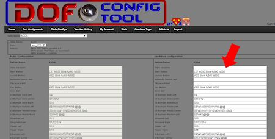
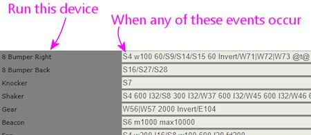

[#dofEventCodes]
= DOF Event Codes

How does Visual Pinball know which flashers to fire when the ball hits a target, or when to turn on the shaker motor?

VP _doesn't_ know, really; VP just thinks in terms of events related to the game, such as a certain target being hit or a certain simulated lamp on the playfield lighting up.
VP passes those events to DOF, telling DOF, for example, "switch 15 on the playfield was triggered".
DOF is the part where these game-specific events are converted into feedback device actions in your cabinet, such as a flasher firing yellow or the shaker motor activating.

But that still doesn't answer the question! It just changes it from _how does VP know?_ to _how does *DOF* know?_

DOF knows because the configuration files tell it so.
These are the .ini files that you download from the link:https://configtool.vpuniverse.com/[DOF config tool] when you click the "Generate Config" button, and these files in turn get the information from the gigantic list of cryptic codes in the Table Configs section of the config tool - the lines that say things like "L57 m550 Blink fu500 fd550".

Those codes are painstakingly hand-crafted for each individual table, to create a pleasing set of effects for each game during play.
Thank goodness (or more to the point, thank Arngrim) that someone (Arngrim) _already_ hand-crafted a good set of codes for nearly all the tables in existence, and put them in the DOF Config Tool's public database for all of us to use.
That saves you the work of going through that whole coding process for the many dozens of tables you'll eventually want to install on your cab.

If you're happy with the default DOF effects provided by the Config Tool's database, and you don't want to make any customizations of your own, then you don't have to know anything about how DOF works apart from the basics of installing it on your system, which we covered separately in xref:DOF.adoc#dofSetup[DOF Setup] .
But if you do want to customize anything, you'll have to learn what the cryptic DOF codes mean.
DOF's documentation has some of this information, but it's incomplete and (in my opinion) poorly organized and almost as cryptic as the codes themselves.
So this section is my attempt at a more approachable and more thorough explanation of what the codes mean and how to use them.

The actual procedure for customizing tables in the Config Tool is covered separately, in xref:CustomizeDOF.adoc#CustomizeDOF[Customizing a table's DOF effects] .
The present section covers just the syntax that you enter in the Config Tool to make those customizations.

== Event/Toy/Port associations

Before we get into the event code syntax, it might be helpful to explain the overall conceptual framework that the Config Tool uses.
The elements of this framework aren't what I'd call intuitive, so I think it's worth taking a moment to think about the "data model".

The real function of the DOF Config Tool is to tie together two big collections of data.
Each collection is like a "database table" or a spreadsheet, where you have a list of information organized into rows and columns.
Here are the big things that the Config Tool keeps track of for you:

* The port assignments.
This is where you tell the config tool which "toy" is attached to which numbered output port on your output controllers.
In DOF speak, a "toy" is a particular feedback device that carries out some concrete effect, such as the shaker motor or the left rear bumper solenoid.
For example, you might tell the Port Assignments list that Port 17 on your LedWiz is the shaker motor.
* The Table Config for each game.
This is a big list of the event codes assigned to each toy.
This relates the abstract simulation events in Visual Pinball to one or more concrete effects on a given toy, on a game-by-game basis.
For example, if you go to the table config for _Funhouse_ , the Shaker Motor line might have codes that say "run for five seconds whenever switch 19 is activated".
("Switch 19" is the part that Visual Pinball knows about, and it represents some action on some game element, such as a particular target getting hit by the ball.) If you go to the table config for _Earthshaker_ , the Shaker Motor line will have a whole different set of triggers appropriate to that game.

The Config Tool's main job is to take those two lists, and combine them into the _even more cryptic format_ that the DOF .ini files use.
When you click Generate Config, the Config Tool sorts through all the elements in those lists to form the hardware assignments for your machine.
It combines "run the shaker motor for five seconds when switch 19 activates" and "shaker motor is LedWiz port 17" to form "turn on LedWiz port 17 for five seconds when switch 19 activates".
That's how DOF knows to turn on the shaker motor in your specific cabinet wiring at the right time in the game.

It's a lot of abstraction to keep track of! But it makes sense when you consider that everyone's cab is unique, and every pinball table is unique.
It would be terrible if the DOF just assumed that "Port 17" meant "Shaker Motor", or that "Switch 19" is the "left drop target".
Those numbers might be right on one person's cab and one Visual Pinball table, but they're certainly not universal.
So we really do need the multiple levels of abstraction.
At least we have the Config Tool to make these connections for us, so that we don't have to put this all together in the right order by hand.

== Toy/event mappings

Since the DOF Config Tool takes care of the details of mapping everything to your output controller and physical hardware ports, the only thing we have to worry about when customizing an effect is the event codes.

Whenever I think about an effect I want out of DOF, my intuition is to think about it like this: "when _this thing happens in the game_ , I want _this toy to fire_ ".
For example, I might say "when the ball hits the castle, I want the shaker to fire for a couple of seconds".

To get into the Config Tool's (and DOF's) way of thinking, you have to turn that around: "The shaker fires for a couple of seconds when the ball hits the castle."

That might sound like the same thing, and it really is, but the ordering of the nouns is important.
The reason you have to think about it as "Toy fires when Event happens" is that the entries in the Table Configs page are all organized that way:

This becomes more apparent when you want to do something like "When I hit the Extra Ball target, run the shaker motor for two seconds and flash red on the middle flasher." For that case, you have to turn it into two commands: "Shaker runs for two seconds when I hit extra ball", _and_ "Middle flasher flashes red when I hit extra ball".
You have to break it into two pieces like that because you're going to have to enter the trigger event twice, once under Shaker Motor and once under Middle Flasher.

== Events

Now we come to the part I really wanted to document here, because it's just not written down anywhere else as far as I can tell: what do those event codes in the cryptic strings on the right side mean?

There are lots of details to get into, but at a high level, the codes are all about (a) specifying some physical object in the table that makes the device activate, and (b) specifying the timing details about when and for how long it activates.

Let's look at an example, and take it apart to see how it works.
We'll use the shaker motor (the "Shaker" row on the Table Configs page) for _Medieval Madness_ .
Here's the default definition in the DOF database:

S4 600 I32/S8 300 I32/W37 600 I32/W45 600 I32/W46 600 I32/E102 600 I32

The first step in deconstructing this is to split things up at the "/" marks.
Those let us combine independent triggers, to give the shaker motor more than one triggering game event.
So what we really have here is six separate, independent triggers for the shaker motor:

S4 600 I32 S8 300 I32 W37 600 I32 W45 600 I32 W46 600 I32 E102 600 I32

What we mean by "independent" is that all these triggers are always in effect, without any interaction with one another.
If any one of the triggers occur, DOF will fire the shaker.
They don't interact with each other in any way, so we can look at each one separately, as though the others didn't exist.

Within each trigger, the first item is always the triggering event.
Most triggering events are simulated objects in the table, such as:

* A lamp (e.g., an Extra Ball When Lit light) turning on
* A solenoid (e.g., the top bumper or the left slingshot) firing
* A switch (e.g., the rollover switch in the right outlane) closing

DOF represents most of these game objects with one letter codes: S is for Solenoid, W is for sWitch, L is for Lamp.
There's a full list later in this section.
There's also a number after the code indicating which specific switch/lamp/whatever we're talking about: S8 in the first line is Solenoid 8.
Figuring out the number that corresponds to a given solenoid/lamp/whatever in a given game is a whole separate (and equally cryptic) subject that we'll get into in xref:CustomizeDOF.adoc#CustomizeDOF[Customizing a table's DOF effects] .

So the first event, `S8 300 I32` , means that we fire this effect when Solenoid 8 in the game turns on.
The second one, `W37 600 I32` , fires when sWitch 37 closes.
And so on.

What does "fire this effect" mean, exactly?
To a first approximation, it just means "turn on this device".
For example, if we had a trigger in here that *only* said `L11` and nothing else, it would mean "turn on the shaker motor whenever lamp 11 is lit, and keep it on the whole time it's lit." Most triggers aren't quite that simple, though.
The ones we're looking at for the shaker all have some extra gibberish at the end, which modifies the simple "turn the device on when this table object is on" and makes it a little more subtle.

Each of the triggers in this example has the same format: _trigger-object_  _number_ I _number_ .
This is a really common format that you'll see all over the place in the DOF config.
When you see a bare number like that immediately after the trigger object, it sets the duration for the effect - how long the effect runs.
The value is always in milliseconds.
So `S8 300` means "run the shaker motor for 300 milliseconds when Solenoid 8 fires".
This is an important distinction from just `S8` , which would mean "run it for exactly as long as Solenoid 8 fires".

There's also a way of setting a minimum and/or maximum duration for the effect instead of setting an exact time for it.
`S8 M50` means "run for at least 50 milliseconds, but keep going longer if Solenoid 8 stays on longer", and `S8 MAX300` means "run for as long as Solenoid 8 stays on, but stop after 300 milliseconds no matter what".
You can combine min and max times, too, as in `S8 M50 MAX300` .
None of the _Medieval Madness_ shaker events use the min/max limits, but you'll see them in other events.

The final item in all these definitions is `I32` .
"I" is another modifier meaning "run with this intensity".
The intensity is on the rather odd scale of 0-48 (why?
because DOF was originally designed around the LedWiz, and the LedWiz uses a 0-48 brightness scale).
So I32 is about 2/3 of full intensity.

There's another common detail that's worth calling out.
Some devices are "RGB" devices, meaning that they're lighting devices capable of showing different colors by blending red, green, and blue light at different brightness levels.
In your physical output controller wiring, of course, this has to be wired as three separate ports, one for each color channel.
The Config Tool mercifully combines the three channels into one line item, so you'll see "5 Flasher Left" as a single device rather than as its three physical wiring channels.
For these RGB devices, the Config Tool lets you set a color as part of the programming, so you might see things like `S12 Magenta` .
That means that we set the RGB channel mixing to show Magenta when Solenoid 12 activates.
You can also use HTML-style #rrggbbaa syntax, with hex numbers for reg, green, blue, and alpha (transparency, usually just set to FF for fully opaque).
For example, #ff0000ff is 100% red.

Now that you know how to take these definitions apart, you still need a list of all the specific code letters.
The rest of this section is basically that.

=== Table variables

Before we get to the cryptic strings, there's actually one weird special case that we have to mention first.
If you open up the DOF Config Tool to the Table Configs list, you'll see that a slot at the top of the list called "Table Variables".

That slot is special.
It's not like the others.
It looks like the others, but it's not the same thing at all.

Table Variables is a unique slot where you can enter symbolic names for more complex expressions that you want to use elsewhere in the effects list.
These are essentially macros, if you're familiar with that term: text that will be substituted for the variable name.

To use a table variable, you surround the variable name with "@" signs.
For example, to use the variableplayon, you'd write@playon@.

Variable names are defined like this in the Table Variables box:

playon=(W43=0)

This means that the variable *@playon@* will be replaced by the text `(W43=0)` wherever it appears in a toy definition line.
Note that the parentheses are part of the substituted text.

=== Pre-defined global variables

In addition to the table variables, there are some pre-defined variables that are always available.
As with the table variables, these are simply substituted into the text where they appear.

[cols="1,1"]
|===
|Variable|Description

|@dt@
|The "drop targets" settings from your Port Assignments page, in the form _duration_ I _intensity_ .
For example, if you have the default 60ms duration and 48 intensity,@dt@ will expand to `60 I48` .

|@t@
|The "targets" settings from your Port Assignments page, in the form _duration_ I _intensity_ .
For example, if you have the default 60ms duration and 48 intensity,@t@ will expand to `60 I48` .

|@allrgb@
|Applies only to RGB devices (flashers, RGB flipper buttons, etc), and works only for certain pseudo-tables that represent "front ends" and other special programs, such as PinballX and PinballY.
Substitutes the RGB colors for the device where the rule appears, for the "current table", whatever that means in the program context (for PinballX and PinballY, it's the game selected in the wheel UI).
For example, if you use `@allrgb@` within the RGB Left Flipper rule, the RGB Left Flipper color for the "current table" is used.
(In order for this to work, the client program must activate a named DOF event using the DOF ROM name of its current table selection at any given time.
PinballX and PinballY do this automatically.)

|===

=== Multiple event triggers

Each effect slot can have any number of independent effects, separated by slashes ("/"):

S16/S27/S28

That means that this toy should be activated on _any_ of the listed events - S16, S27, or S28.

=== Event syntax

Within the "/" elements, an event looks like this:

_trigger-code_  _effect-codes_

The trigger code specifies _when_ this effect is fired; the effect codes specify _what_ happens.
So the way you read this is "When _trigger-code_ happens, do _effect-codes_ on the current device".
The trigger codes are mostly things that happen in the game, such as "switch 9 hit", and the effect codes are mostly things like "fade in for 100 milliseconds".
So we can put this together to say things like "when you hit the castle (switch 9), fade this light on for 250ms then fade it back out for 100ms".

You can list multiple trigger codes for the same effect, by separating them with vertical bars ("|"), so you could have something like this:

S7|S9 fu100 fd250

That means that we trigger this effect on S7 _or_ S9, and carry out the effect codes "fu100 fd250".

=== Trigger codes

The first element of an event code is the "trigger", which specifies what event in the game makes the toy activate.
Remember the multiple trigger codes can be combined with "|".

[cols="1,1,3"]
|===
|Code|Example|Description

|$ _name_ 
|$PBYMenu
|Named event.
These are pseudo-events defined by the table, so they're specific to the table.
I think these are mostly (only?) used for non-pinball programs such as PinballX and PinballY, which obviously don't have actual table events (switches and solenoids and so on) to work with.
The link:http://mjrnet.org/pinscape/PinballY.php[PinballY] documentation has a full list of PinballY's codes.

|( _condition_ )
|(S7 > 1)
|A condition event.
The toy fires whenever the condition evaluates to true, or a non-zero integer value.
See below for more.

|0
|0
|Same as OFF.

|1
|1
|Same as ON.

|B _number_ 
|B1
|Score digit.
I don't know how these are used; I think they're related to scoring reels in EM games.

|BLINK
|BLINK
|The toy is always on, and blinks on and off at 1-second intervals.

|C _number_ 
|C1
|Score.
I don't know how these are used; I think they're related to scoring reels in EM games.

|D _number_ 
|D4
|LED.
Refers to a controlled LED in a 2000s Stern game.
The numbering is determined by the original game ROM programming.

|E _number_ 
|E4
|EM table element.
The "E" events are programmed in a table's Visual Basic scripts, specifically to trigger DOF effects.
The event numbers are arbitrary and up to the table author.
If you look at a table script for an EM table that's been programmed with DOF effects, you'll find lines like this:

Controller.B2SSetData 11,1 DOF 118,1

The first number in the pair in these lines is the "E" event code.
The second number is the value for the event, usually 0 for OFF and 1 for ON.
So "E4" in the DOF config is triggered when the table script executes a line like `DOF 4,1` .

|G _number_ 
|G1
|General illumination (GI) string.
The toy is activated when the given general illumination on the playfield is switched on.
GI refers to the little lamps scattered around the playfield, mostly under the plastics, that provide background lighting.
These lights aren't individually controlled; they're controlled as a group, known as a GI "string".
Some games only have one GI string for all the playfield lights, and some divide the GI lighting into two or more strings.
Many of the 1980s and 1990s games have separate GI strings for the upper and lower playfield lights.
The exact layout is determined by the game's original programming.

|L _number_ 
|L7
|Lamp.
The toy is activated when the given lamp on the table is on.
Lamps refer to the individually controlled lights on the playfield or backbox, such as an "Extra Ball When Lit" light or a bumper lamp.
The lamp numbers are defined by the particular table, according to the game's original ROM programming.
See xref:CustomizeDOF.adoc#CustomizeDOF[Customizing a table's DOF effects] for tips on figuring out which lamp is which for a given table.

|M _number_ 
|M3
|Mechanical object.
The toy activates when the given mech object is activated.
Mech objects are special programming added to a few games in VPinMAME or B2SServer, not something from the original real table.
I don't know of a list of these objects anywhere; I think you just have to look at the VPinMAME source code to find out about them.

|N _number_ 
|N3
|Mech object value from GetMech.
I have no idea what this is about.

|OFF
|OFF
|Another pseudo-event, meaning that the toy is always off.

|ON
|ON
|A pseudo-event meaning that the effect is always on when the table is running.
This is typically used for things like the Coin and Exit buttons that you just want to stay lit all the time.

|S _number_ 
|S15
|Solenoid.
The toy is activated when the given playfield solenoid is activated.
Solenoids refer to (simulated) physical solenoids in the game, such as bumper coils, kick-out coils, and slingshots.
The Williams games also controlled the flasher lamps as though they were solenoids (since they required relatively high power), so some solenoid numbers refer to flasher lamps on original playfields.
The solenoid numbers are assigned by the game's original ROM programming; see xref:CustomizeDOF.adoc#CustomizeDOF[Customizing a table's DOF effects] .

|W _number_ 
|W9
|Switch.
This toy is activated when the given playfield switch is activated.
A switch is usually a (simulated) physical switch on the playfield, like a rollover switch, stand-up target, or bumper contact.
The switch numbering is determined by the game's original ROM programming; see xref:CustomizeDOF.adoc#CustomizeDOF[Customizing a table's DOF effects] .

|===

=== Effect codes

The part following the "trigger code" is a list of effect codes, separated by spaces.

[cols="1,1,3"]
|===
|Code|Example|Description

| _number_ 
|100
a|A number on its own sets one of two things:

* If there's a BLINK specifier before it, this is the blink interval, in milliseconds
* If there *isn't* a BLINK specifier, this sets the duration of the effect, in milliseconds; the effect will run for exactly this long, even if the trigger turns off earlier or stays on longer

| _number_  _number_ 
|100 300
|If there's a BLINK specifier, a pair of numbers sets the blink time and overall effect duration, both in milliseconds.
(This is invalid syntax in the absence of a BLINK command.)

| _color_ 
|red _or_ #FF0000FF
|This can only be used as the first effect code in the list, and can only be used for RGB devices like flasher LEDs, flipper button lights, or undercab light strips.
This specifies the color to use for the effect.
This can be a color name taken from the pre-defined set in the config tool (listed at the bottom of the Table Configs page), or it can be an HTML-style #rrggbbaa code, with hex values for _rr_ (red), _gg _(green), _bb_ (blue), and _aa_ (alpha transparency channel, almost always FF for fully opaque)._ _

|BL# _low_ 
|BL10
|Sets the brightness of the "low" part of the blink cycle, from 0 (fully off) to 255 (fully on).
By default, this is 0 for fully off.

|BL _low_ 
|BL20
|Sets the "low" blink brightness on scale of 0 to 48.
This is exactly the same as BL# except for the different scale used.
BL48 is the same as BL#255.
(This older scale is an historical relic from when DOF was all about LedWiz access, as the LedWiz uses a native 0-48 brightness scale.
DOF generalized this to a 0-255 scale for finer shades of brightness possible on more modern controllers.)

|BLINK
|BLINK
|Blinks the effect on and off at 1-second intervals

|BNP _time_ 
|BNP20
|Sets the "nested" blink interval, in milliseconds.

|BNPW _pct_ 
|BNP25
|Sets the "nested" blink pulse width, as a percentage of the nested blink interval (1 to 99).
For example, BNP25 sets the ON time of the blink to 25% of each blink interval.

|BPW _pct_ 
|BPW25
|Sets the blink pulse width, as a percentage of the blink interval (1 to 99).

|E _time_ 
|E20
|Extended duration, in millisecond.
This makes the event continue for the given duration after the trigger turns off.

|F _time_ 
|F100
|Sets the fade in/out duration for the effect, in milliseconds.
This sets the fade-in and fade-out to the same interval; they can also be set separately via FU and FD.

|FD _time_ 
|FD100
|Sets the fade-out (-down) duration for the effect, in milliseconds.

|FU _time_ 
|FU100
|Sets the fade-in (-up) duration for the effect, in milliseconds.

|I# _intensity_ 
|I20
|Sets the intensity/brightness of the effect, from 0 (fully off) to 255 (fully on).

|I _intensity_ 
|I20
|Sets the intensity/brightness of the effect, from 0 (fully off) to 48 (fully on).
This is the same as I#, but uses the older/coarser LedWiz 0-48 scale.

|INVERT
|INVERT
|Inverts the trigger.
For example, `S7 INVERT` means that the event is triggered when Solenoid 7 is *off* rather than when it's on.

|L _layer_ 
|L3
|Sets the "layer" of the effect.
Layers allow multiple effects to overlap in time.

|M _duration_ 
|M60
|Sets the minimum duration of the effect, in milliseconds.
Normally, the effect ends as soon as the trigger turns off.

|MAX _duration_ 
|MAX500
|Sets the maximum duration of the effect, in milliseconds.
The effect ends after this time even if the trigger condition remains activated.
Normally, the effect continues for as long as the trigger remains on.

|NOBOOL
|NOBOOL
|Makes the trigger non-boolean.
The trigger codes (e.g., S7 for Solenoid 7) are all integer values from 0 to 255 in the interface between Visual Pinball, VPinMAME, and DOF.
By default, DOF reinterprets these as simple OFF or ON values, by considering 0 to be OFF and everything non-zero to be ON.
So 1 is ON, 2 is ON, etc.
NOBOOL overrides this and makes DOF apply the trigger's actual numeric value as the brightness/intensity level for the effect.
This can be used for tables where the ROM software controls the brightness of a flasher, for example, to pass the flasher brightness value through from the ROM to the output device.

|W _time_ 
|W50
|Sets the wait time in milliseconds.
This is the wait time after the event trigger turns on before the effect starts (normally zero, so that the effect starts immediately when the trigger occurs).

|===

The following all apply to "area effects", for addressable light strip matrices.

[cols="1,1,3"]
|===
|Code|Example|Description

|AA _accel_ 
|AA10
|Sets the area effect acceleration.

|AAB _behavior_ 
|AABL
|Sets the area bitmap animation frame repetition behavior (O = play once, L = start at first frame then loop, C = start at next frame from last playback then loop)

|AAC _count_ 
|AAC10
|Sets the area bitmap animation step count.

|AAD _dir_ 
|AADF
|Sets the area bitmap animation frame direction (F = step by frame in animated GIF, R = step from left to right through source image, D = step from top to bottom through source image)

|AAF _duration_ 
|AAF3
|Sets the area bitmap animation frame duration.

|AAS _step_ 
|AAS5
|Sets the area bitmap animation step size.

|ABF _frame_ 
|ABF3
|Sets the area bitmap frame.

|ABL _left_ 
|ABL5
|Sets the area bitmap left.

|ABH _height_ 
|ABH10
|Sets the area bitmap height.

|ABT _top_ 
|ABT5
|Sets the area bitmap top.

|ABW _width_ 
|ABW10
|Sets the area bitmap width.

|AD _shift_ 
|ADL
|Sets the area shift direction (L=left, R=right, U=up, D=down).

|AFDEN _density_ 
|AFDEN5
|Sets the area animation flicker density.

|AFMAX _duration_ 
|AFMAX60
|Sets the maximum area animation flicker duration in milliseconds.

|AFMIN _duration_ 
|AFMIN7
|Sets the minimum area animation flicker duration in milliseconds.

|AFFADE _duration_ 
|AFFADE100
|Sets the area animation flicker fade time in milliseconds.

|AH _height_ 
|AH20
|Sets the height of the matrix effect area.

|AL _left_ 
|AL0
|Sets the left of the matrix effect area.

|APC _color_ 
|apcRED
|Sets the color for a plasma effect; see link:https://www.bidouille.org/prog/plasma[www.bidouille.org/prog/plasma] .

|APD _density_ 
|APD25
|Sets the density for a plasma effect, 0 to 100; see link:https://www.bidouille.org/prog/plasma[www.bidouille.org/prog/plasma] .

|APS _speed_ 
|APS10
|Sets the speed for a plasma effect; see link:https://www.bidouille.org/prog/plasma[www.bidouille.org/prog/plasma] .

|AS _speed_ 
|AS5
|Sets the area speed.

|ASA _accel_ 
|ASA10
|Same as AA.

|ASD _shift_ 
|ASDU
|Same as AD.

|ASS _speed_ 
|ASS5
|Same as AS.

|ASS _speed_ MS
|ASS100MS
|Sets the area speed in milliseconds.

|AT _top_ 
|AT0
|Sets the top of the matrix effect area.

|AW _width_ 
|AW20
|Sets the width of the matrix effect area.

|SHP _shape_ 
|SHPNumber0
|Shows the given pre-defined shape.
The shapes are defined in a separate DOF config file, *DirectOutputShapes.xml* , which is included in the ZIP file that the DOF Config Tool downloads when you click Generate Config.
You can look through that file for a list of available shapes.

|===

=== Conditions

If a trigger code is enclosed in parentheses ("( )"), it's a condition expression.

For the most part, these are used for simple And/Or combinations of multiple event triggers.
For example, `(W7 And L9)` is a combined trigger that fires when Switch 7 and Lamp 9 are both on, and `(S5 or s6)` fires when either Solenoid 5 or Solenoid 6 is on.

You can create more complex conditions than that, though.
The parser uses a full expression language, based on C# notation.
all the trigger codes can be used as variables ("S7" for solenoid 7, for example).
They evaluate to numeric values based on the values sent from the VPinMAME or the table's Visual Basic scripts; in most cases, these will simply be 0 for off and 1 for on, but they can take on other values in some cases, usually limited to a range of 0 to 255.
EM table simulations sometimes use the "E" event codes with numeric values, for example.

The following operators are available:

[cols="1,1,1"]
|===
|Operator|Description|Example

|+
|Add
|100 + S7

|-
|Subtract
|100 - S7

|*
|Multiply
|100 * S7

|/
|Divide
|S7 / 100

|%
|Remainder
|S7 % 100

|^
|Power
|S7^3

|-
|Negation
|-S7

|+
|Concatenation
|"abc" + S7

|<<
|Left bit-shift
|S7 << 3

|>>
|Right bit-shift
|S7 >> 3

|=, ><, <, >, <-, >=
|Comparison
|S7 > 100

|And, Or, Xor, Not
|Boolean logic
|($x > 1) and (S7 < 10)

|And, Or, Xor, Not
|Bitwise logic
|S7 and 0x0F

|If
|Conditional
|If(S7 > 1, "yes", "no")

|Cast
|Type conversion
|Cast(S7, int)

|[]
|Array index
|S7[1]

|.
|Property/member
|S7.color

|===

You can also use the following literal value types:

[cols="1,1"]
|===
|Description|Example

|String
|"red"

|Character
|'c'

|Boolean
|true, false

|Real (double)
|100.25

|Float
|100.25f

|Integer
|100

|Integer (unsigned)
|100U

|Integer (64-bit)
|100L

|Integer (64-bit unsigned)
|100LU

|Hex integer
|0xFF, 0x1000L, 0xFFFFU

|===

