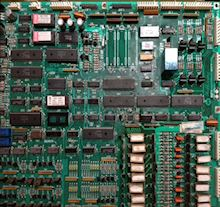

= End Notes

== Acknowledgments

Many thanks are due to the members of the virtual pin cab forums at link:https://www.vpforums.org/[vpforums] .
My own build would never have gotten off the ground if the forums hadn't inspired me with lots of great examples of what you can accomplish, and I wouldn't have made it very far without the forums' collective expertise to draw on.
This is one of the most helpful and on-topic online forums I've ever encountered, with a dedicated group of regulars who go way out of their way to help the newbies and solve the tough technical problems that inevitably come up in a project this complex.
A lot of the information in the Cabinet Building section of this book came more or less directly from forum discussions; my main contribution here was to organize it into a more accessible format.
As much as the forums are a gold mine of useful information, their free-form discussion format makes it extremely difficult to find specific topics that were discussed in the past.
I hope that this guide is at least a little easier to navigate than old forum threads.

Another big thanks to the open-source developers who created and continue to improve the collection of software that makes virtual cabs possible: Visual Pinball, VPinMAME, DOF, and B2S.
I especially want to thank them for keeping it all open-source.
That helps ensure a strong future for these projects, by empowering their user communities to improve them and build upon them.

== Colophon

This book as you see it in your browser is generated from "source code" via a set of php scripts purpose-built for this application.
The scripts take my source material, written in a simple ad hoc markup format, and generate the styled HTML.

The original motivation for the custom scripts was more than just for the sake of formatting.
The real reason for custom scripts was that I planned to let you generate a highly customized subset of the material, based the unique combination of features you planned for your cabinet.
The idea was that there are so many ways to build a virtual cab that it can get overwhelming to wade through the instructions for _everything_ , so I thought I could organize it better by letting you set some filters to select only the features that were interesting to you.
As I wrote the material, though, I could see that there's much, much more material that's common to all pin cabs than there is unique feature-based material, and I also realized that there are so many necessary cross-references that I couldn't safely filter out very much without a risk of links that go nowhere.
Finally, when I stepped back and thought it about some more, I saw that this idea about filtering was a misguided attempt to reinvent a wheel.
Book writers have been organizing complex material for centuries, and tools like the Table of Contents, Index, and cross-referencing are already known to work pretty well when applied competently.

Most people (myself included) prefer to view technical material like this online, where it can be easily searched and where cross-reference links can be immediately followed, so my scripts are designed primarily with Web browser presentation in mind.
However, I still have an old-fashioned affection for printed books, so I also tried to arrange things to produce pleasing hard-copy results.
If you click the little Printer icon at the bottom, it will append all of the chapters together into a single (rather large) document that you can send to your printer to make a hard-copy edition.

A few people have asked about the CAD model that I used to generate illustrations throughout this book.
Unfortunately, there's no practical way for me to share it, because it's based on an old proprietary software package that's no longer available, and it doesn't convert well to more modern formats (I've tried).
Besides, most of the people who have asked were hoping to use some of the components for 3D-print manufacturing or at least for taking detailed measurements for planning purposes, but I'm afraid the model isn't accurate enough for those purposes.
I only made it close enough to look about right in the illustrations.

== Notes on the section photos

[cols="1,1"]
|===
|
|Cutaway view of a CAD model of a virtual pinball machine, used as the basis for many illustrations throughout this guide

|
|Start button from a _Whirlwind_ pinball machine (Williams, 1990)

|
|3D rendering of plans for a standard-body pin cab replicating the Williams/Bally "WPC" cabinet design of the 1990s

|
|A flipper assembly (the parts under the playfield that actuate the flipper), from a Williams machine circa 1995

|
|A Williams System 11 CPU board, which contains the main control electronics used in Williams pinball machines manufactured circa 1986-1990; in many ways, it amounts to a stripped-down 8-bit personal computer from the Apple II era

|
|Closeup of an unpopulated main interface board for the Pinscape expansion boards

|image:images/appendix.png[""]
|The Extra Ball buy-in button from _Theatre of Magic_ (Bally, 1995)

|===

