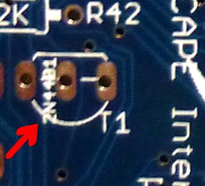

[#eurotrans]
= European Transistor Substitutions

If you're in Europe, you might find it convenient and cost-saving to use different transistors from the ones specified in the parts list.

The expansion boards use two types of transistors, which are known by their part numbers, 2N4401 and 2N4403.
We chose these because they're inexpensive and easy to find in the US.
There's nothing else particularly special about them; we use them for simple logic switching, which is a job that many other similar transistors can perform equally well.

If you're in Europe, the 2N440x series is reportedly hard to find, and importing them from the US is expensive in terms of postage and customs fees.
Fortunately, these parts have equivalents that are readily available in Europe:

* 2N4401 → BC337
* 2N4403 → BC327

You can simply make these substitutions everywhere you see the 2N440x parts on the circuit boards.
Be sure to replace each 2N440x with the *corresponding* BC3xx device as shown above, since these are complementary pairs (NPN and PNP).

== Attention! Reversed Leads!

If you do make these substitutions, there's a *really important detail* : the order of the leads is reversed on the BC3xx versus the 2N440x.
This isn't a big problem, though.
If you use the BC3xx parts, simply rotate the device 180 degrees from the 2N440x part orientation.
That'll put the leads in the right order for the board wiring.

But there's yet another complication! It's a complication that's designed to make your life easier, but it's still something to be aware of.

There are *EU* versions of the expansion boards that are marked properly for the BC3xx parts parts.
These are *electrically* identical to the US boards, but the *silkscreen printing* on the board is drawn for the BC3xx parts.
If you have the EU boards and you're using the BC3xx parts, the orientation marker on the board is already correct, so you don't have to rotate the parts from what's shown on the board.

If you're not sure if you have US or EU boards, check the tiny text printed inside the transistor outlines on the board.
This will tell you the type of transistor that the board is marked for - it will show either "2N440x" or "BC3xx".
The text really is tiny, so you might need a magnifying glass.

*If you see 2N440x* printed there, you have a US board, so you'll need to *rotate your BC3xx parts 180°* from the outline printed on the board.

*If you see BC3xx* printed on the board, you have an EU board, so simply install the BC3xx exactly as shown on the board.

