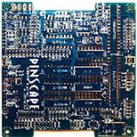
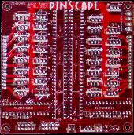
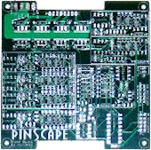

[#expan]
= Expansion Boards Overview

The Pinscape expansion boards are a set of printed circuit boards that you can build yourself to add capabilities to the basic Pinscape system that runs on the KL25Z.
The main functions of the expansion boards are:

* An almost unlimited number of high-power outputs for feedback devices (lights, solenoids, motors, etc) with full PWM brightness/speed/intensity control
* Circuitry for switching on a TV at system startup, for TVs that don't automatically turn on when the power is connected
* Neater wiring connections for buttons and plunger inputs

== Expansion boards vs. Standalone KL25Z

The expansion boards are one way to run the Pinscape software.
The other way is to run it directly on the KL25Z, without the expansion boards, which we refer to as the "standalone" KL25Z.

All by itself, the KL25Z can handle accelerometer-based nudging and button input, without any additional circuitry required.
The only wiring involved is the wiring between the KL25Z and any buttons you want to connect.
You can also connect any of the compatible plunger sensors directly to the KL25Z.
The plunger sensor wiring is a little neater and more self-contained with the expansion boards, but there's no difference in how you build the sensors.

What the KL25Z _can't_ do well on its own is controlling feedback devices, such as solenoids and lights.
There are three big limitations on the bare KL25Z's capabilities in this area:

* It has a limited number of GPIO pins (the KL25Z's electrical connections to the outside world).
Each output device you want to connect requires its own GPIO pin, but so does each button input.
The plunger sensor and IR devices also require one or more pins each, if you want to include those in your system.
The KL25Z has a total of about 40 pins that you need to divide up among these various functions, so the more buttons you want to include, the fewer feedback devices you can have, and vice versa.
The KL25Z by itself simply doesn't have enough pins for all the buttons and feedback devices in a well-equipped pin cab.
* Separately from the limited number of GPIO pins, the KL25Z only has 10 PWM channels.
PWM ("pulse width modulation") is needed for LED outputs to control brightness, and for motors to control speed.
10 PWM channels isn't enough to cover a standard set of five RGB flashers (which require 15 channels: one per red/green/blue color channel per flasher).
* The GPIO pins can only control a tiny amount of voltage and current (no more than 3.3V and 4mA, which is barely enough for the smallest LEDs).
External circuitry is required to boost this to a level that's sufficient to control a flasher LED, motor, or solenoid.

The biggest difference the expansion boards make is their extensive feedback device control capabilities.
The expansion boards overcome the KL25Z's limitations on the number of available pins and PWM channels by adding an external set of PWM controller chips that provide nearly unlimited additional output ports, all with full PWM control.
The expansion boards also overcome the KL25Z's power limitations by adding MOSFET boosters on the outputs.
A MOSFET is a type of transistor that can control very high-power loads, so the MOSFET boosters make it possible to connect all the standard pin cab feedback devices directly.

The expansion boards also add circuitry for powering up one or more TVs at system startup.
That's another bit of circuitry that you can build on your own (the circuit diagrams are included in this guide), but the expansion boards make it a little easier by integrating it into the board design.

== DIY vs. Buy

Most of the rest of this section of the guide is about how to build the DIY design for the expansion boards.
DIY means that you do the whole "manufacturing" process yourself.
We provide CAD files for the circuit board designs, which specify the exact layouts and component lists for the boards.
They're open-source designs, so you're free to modify them as you wish, or you can just upload them as-is to any PCB maker to have them made into physical boards.
The designs include complete parts lists with the exact components needed, for ordering from an electronics supplier such as Mouser or Digikey.
Once you have the blank PCBs and the components, you solder the components onto the boards.
I know it sounds complex, but the individual steps are all pretty straightforward, and they're explained in detail in the pages ahead.

If you don't like the idea of building the boards yourself, though, there's at least one option footnote:[In the past, there was another source for pre-built boards, Oak Micros, which sold a couple of boards based directly on the Pinscape expansion boards.
Those are no longer available, but for historical reference, here's the original announcement: link:https://www.vpforums.org/index.php?showtopic=42631.html[Pinscape All-in-One product]](as of this writing) for buying pre-built boards that come fully assembled and ready to use:

*  link:https://shop.arnoz.com/en/16-pinscape-boards.html[L'atelier d'Arnoz] (Arnoz's Pin Cab Shop).
Arnoz sells a collection of circuit boards of his own design that work with the Pinscape software and replicate many of the functions of the DIY expansion boards.
Like the original expansion boards, Arnoz's boards comprise a set of modules that you can combine to build your overall system.
See his site for details and purchase options.

Which is better, DIY or pre-built? They both have their trade-offs.
The big advantage of the DIY approach is that you can customize everything, from the hardware to the software, since the entire design is open-source.
But it requires a lot of time and effort.
Buying something ready-to-use is probably a better option if you don't have a hobby interest in building your own electronics.
The price of the pre-built boards has so far been similar to what it would cost to build them yourself.

=== DIY: the three-board set

For do-it-yourselfers, the expansion boards are a system made up of three separate circuit board designs: the main board, the power board, and the chime board.
The boards work together, and each board serves a different function.
You don't have to build the full set; you can use the boards in different combinations to suit your needs.
The main board is the only one that's required in all systems.
The other two are optional, and you can add one or more of each according to the number and mix of feedback devices you want to connect.

=== Which boards do I need?

For most people, I recommend one main board and one power board.
That covers all the specialized functions like the TV control circuits, and gives you a total of 65 feedback device outputs: the main board's dedicated outputs for the RGB flashers, strobe, replay knocker, and flipper button LEDs, and the power board's 32 general-purpose outputs for everything else (button lights, contactors/solenoids, shaker motors, gear motors, fans, beacons, undercab LED strips).
This is enough for a system that includes every feedback device described in xref:feedbackSect.adoc#feedbackSect[Feedback Devices] , and still leaves four or five spare power board outputs in case you can think of anything else (and find room for it in your cab!).

You might also consider adding one or more chime boards if you're using any pinball coils or other solenoids that are vulnerable to rapid overheating.
For pinball parts, this applies to almost any coil-based assemblies designed for the real machines: xref:chimes.adoc#chimes[chime units] , bells, slingshot assemblies, or bumper assemblies.
Flipper assemblies are sometimes safe, but not always; see xref:coilTimers.adoc#coilTimers[Coil Timers] for details.
If you do decide to add chime boards, each board will handle eight coils.
Any chime boards will simply add more ports to your system, so you'll still have all the ports on your main board and power board(s).

The chime board isn't strictly necessary even for coil devices, since the Pinscape firmware can emulate the timer protection via its "Flipper Logic" feature (also described in xref:coilTimers.adoc#flipperLogic[Coil Timers] ).
The main reason to use the chime board instead of software is that I consider a hardware timer to be inherently more reliable than a software version.
That's not to say that the firmware isn't also reliable; it's just that software is inherently more complex, and can fail for reasons unrelated to the task at hand.
The hardware timer is immune to software faults, so it's almost certain to do its job no matter what else goes wrong in the system.

=== Main board

The interface to the KL25Z.
The KL25Z plugs into sockets on this board.
This board is required for all expansion board systems, since it's where the KL25Z connects, and you can only use of these (unlike the other boards, where you can you two or more if you need more ports).

This board provides:

* A pin header for up to 24 button inputs.
This is just a convenience compared to the standalone KL25Z, where the GPIO pins for buttons are scattered around the headers.
This groups all the buttons into one connector.
* A pin header for connecting a plunger sensor.
all the Pinscape plunger designs in this guide use a common connector plug layout that fits this header.
As with the buttons, this is just a convenience; on the standalone KL25Z, the pins for plunger connections are scattered around, but here they're neatly grouped into one connector that works with all the plunger types.
* Outputs (grouped onto a single pin header) for a set of 5 RGB flashers, with high-resolution, high refresh rate PWM control, for connecting a xref:flashers.adoc#flashersAndStrobes[flasher panel] (a feedback device consisting of five high-intensity RGB LEDs, usually placed at the back of the playfield TV).
These outputs have sufficient power to supply two flasher panels in parallel, in case you want to install one both in the main cabinet and on the backbox.
* A dedicated output for a bright white strobe lamp, which is another popular feedback device typically deployed along with the flasher panel.
* Outputs (grouped onto a single pin header) for an additional 16 channels of low-power (20-50 mA) LEDs.
This is aimed primarily at powering four small RGB LEDs for your flipper buttons (one for each flipper button and one for each MagnaSave button), which leaves four additional channels that can be used for other small LEDs, such as front panel button lamps.
* A dedicated output for a replay knocker.
This has enough power handling for a pinball knocker coil, so you can wire it directly without any other circuitry (unlike, say, an LedWiz, where you'd need a relay or MOSFET booster for such a high-power device).
This output also has a special timer protection circuit that protects the knocker from software faults that could leave it stuck on, which is an occasional problem with PC pinball software that can destroy the coil by overheating it.
The timer protection ensures this can never happen by shutting off the coil after a couple of seconds even if the software crashes.
See xref:coilTimers.adoc#coilTimers[Coil Timers] for more about the timer protection circuit.
* A "TV ON" relay that you can hard-wire to the soft on/off button on your TV, so that the software can turn on the TV at system startup.
See xref:tvon.adoc#tvon[TV ON Switch] .
* An IR transmitter, which can be used to transmit the remote control codes for your TV to turn them on when you power up the system.
This is a less invasive alternative to the hard-wired on/off button connection.
The IR transmitter can also be controlled from Windows, so you can make it send whatever IR codes you want at any time.
* Circuitry that detects when the system is powering up, so that the software can tell when it's time to send the remote control codes or switch signals to turn on your TVs.
* An IR receiver, which can be used to teach the Pinscape software the IR codes for your TV's remote control, so that the software can send the codes via the IR transmitter when it's time to turn the TV on.
The IR receiver can also be programmed to send key presses to the PC when it receives certain codes, so you can use it as a way to access more control signals without adding physical buttons to your cabinet.

=== Power board

Adds 32 general-purpose high-power feedback device control ports, which can be used to control almost any sort of feedback toy.
Each port can directly handle about 5 Amps and up to about 50V, which is enough for shaker motors, gear motors, fans, beacons, contactors, and solenoids.
They'll also work just fine with LEDs and lamps, including fairly long lengths of LED strips (the non-addressable kind, anyway; you need a separate, dedicated controller for the addressable kind).

Every on the power board port has high-resolution, high refresh rate PWM control, so these ports provide brightness control for lighting devices, full color mixing for RGB devices, speed control for motors, and intensity control for solenoids.

The power board is an add-on to the main board.
It's not required, but most people use one main board and one power board, since the main board doesn't have any general-purpose feedback outputs of its own (all of its outputs are for more specific purposes).

Multiple power boards can be daisy-chained.
The Pinscape software can handle up to 128 feedback ports in total, which is enough for three of these boards if you're not using all the main board ports.
In practice, one power board is enough for a very decked-out system.

=== Chime board

This is another optional add-on to the main board, adding eight high-power outputs with timer protection circuits, for controlling chime units and pinball solenoids.
These outputs have the same power handling capacity as the power board outputs, but add cut-off timers to prevent attached devices from being activated for more than a couple of seconds at a time.
These outputs are exactly like the dedicated replay knocker output on the main board.

See xref:coilTimers.adoc#coilTimers[Coil Timers] for more about why timer protection is helpful for chime units and some other types of original pinball equipment.

Like the power board, the chime board can be daisy-chained, so you can add as many of these as you need, as long as your overall system doesn't exceed the 128-port limit of the Pinscape software.
You can use any combination of chime boards and power boards that suits your system.

== Schematics and board layouts

The boards were designed using a CAD program called link:https://www.autodesk.com/products/eagle/overview.html[EAGLE] , from link:https://www.autodesk.com/[Autodesk] .
EAGLE works in terms of schematics and board layouts.
A schematic is a symbolic, visual representation of the components in a circuit and how they're connected to one another.
A board layout is the physical design of the circuit board, showing the locations of drill holes, solder pads, copper traces, and so on.
The schematic and board layout are really two views of the same information.

You can download the EAGLE files for all the expansion boards here:

link:http://mjrnet.org/pinscape/expansion_board/download.php[mjrnet.org/pinscape/expansion_board/download.php]

The downloads are ZIP files containing the following main file types:

*  *.sch* files are the schematics for the boards
*  *.brd* files are the physical circuit board layouts

The files also contain JPEG snapshots of the board layouts and PDF printouts of the schematics, in case you want to peruse the circuit plans without going to the trouble of installing EAGLE.

A free version of EAGLE (with some feature limits, naturally) is available if you want to view the plans interactively.
See the Autodesk site linked above for downloads.
Monthly subscription plans to the premium versions are also available.
I recommend installing at least the free version if you're going to build the boards, so that you can explore the schematic and board layout files in detail - that's especially useful if you need to do any troubleshooting or debugging after building them.
Installing EAGLE also gives you the ability to edit the plans if you want to customize them.

EAGLE is, unfortunately, rather difficult to learn.
It has an extremely idiosyncratic user interface that goes against many of the Windows conventions.
EAGLE somewhat makes up for its bizarre UI by being powerful and competent, once you get past the steep learning curve.
To help with that, there are numerous tutorials and guides and videos available on the Web - search for "EAGLE tutorial".
EAGLE is hugely popular with electronics hobbyists, so there's lots of help out there on getting started with it.

