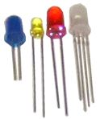
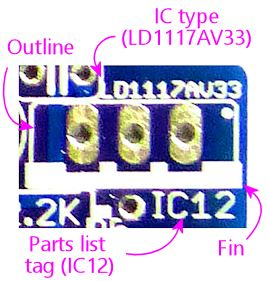
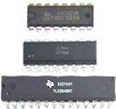
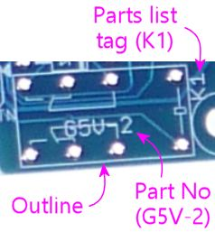
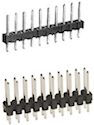
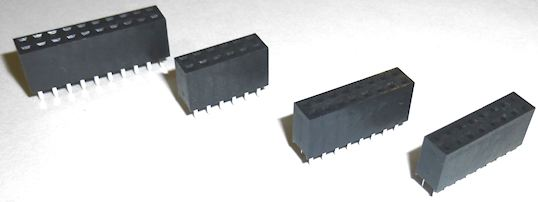
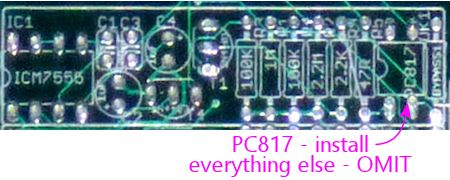

= Building the Expansion Boards

If you've worked with PCBs before, you should find building the Pinscape boards to be pretty straightforward. The boards can look pretty daunting to build, because there are admittedly a lot of components to install, but all of the components are individually pretty easy to handle. All of them are "through-hole" parts, with wire leads that install through holes in the board. That type of part is easy to solder by hand. (Modern electronics has largely moved to "surface-mount" parts, which are more designed for installation by robots, and can be tricky to solder by hand. I think it's in keeping with our fundamentally retro hobby that these boards use the older style parts that are more human-friendly.)

If this is your first time working with electronics or building printed circuit boards, you might want to browse through our introductory section, xref:electronics.adoc[A Crash Course in Electronics] . The expansive-sounding name notwithstanding, we've tried to keep it focused on the practicalities of building the Pinscape boards, so hopefully it won't waste too much of your time on academic points. Among other things, you'll find help there with reading the markings on the blank circuit boards, so that you can figure out where the parts go, and an introduction to the different component types used in the boards.

The electronics section also some advice on soldering technique (see xref:pcbTips.adoc#solderingTips[Circuit board assembly tips] ), in case you're looking for help with that. I've found this to be an area that a lot of new cab builders are particularly worried about when embarking on this project because of unhappy past experiences with their soldering irons. There's definitely a little bit of technique needed for successful soldering, but it's not all that hard to learn the basics, so I've tried to offer a few tips that will hopefully make things easier this time around.

== Where to begin

Before you start the assembly process, look over the "Optional elements" below and decide if there's anything you want to omit or change in the default configuration. There are some parts you can just omit entirely if you don't need them, and there are variations in the parts you can choose from to slightly change the way some parts of the board work.

When you're ready to proceed, gather the necessary items:

* The blank PCBs - see xref:expanFab.adoc[Fabricating the Expansion Boards]
* The component parts - see xref:partslist.adoc#electronicPartsList[Electronic Parts List]
* Soldering tools and other miscellaneous tools - see xref:psTools.adoc[Tools]

Then just start fitting the components into the boards and soldering them in place. There's no particular order that you have to use to install the components, but I usually like to start with the smaller and flatter components and finish with the taller ones, to avoid having to squeeze into tight spaces between the larger parts.

== Component cheat-sheet

Matching the parts to their spots on the circuit board might seem a little intimidating at first, but the "language" of the circuit board markings is designed to make it as straightforward as possible. All of the markings on the circuit board are there to let you see at a glance what goes where. They also tell you how to orient the parts where that matters. (Some parts, like resistors, don't care which direction they go; other parts, like transistors and diodes, have to be oriented the right way to work properly.)

There are only about a dozen different types of components on these boards, so you'll see the same "footprints" used repeatedly. Once you learn to recognize the common ones, you'll be able to quickly identify the right parts.

Here's a quick visual reference to the circuit board markings for the various component types. See the linked sections for more details on the component type.

[cols="1,1,1"]
|===
|Component|Board Markings|Example

| xref:resistors.adoc[Resistor]
|image:images/resistor-pcb-markings-1.png[""]

|image:images/miscResistors.png[""]

| xref:capacitors.adoc[Capacitor (ceramic disc)]
|

|image:images/miscDiscCaps.png[""]

| xref:capacitors.adoc[Capacitor (electrolytic)]
|image:images/electrolytic-pcb-markings.png[""]

|

| xref:cmpdiodes.adoc[Diode]
|image:images/diode-pcb-marking.png[""]

|image:images/miscDiodes.png[""]

| xref:leds.adoc[LED]
|image:images/led-pcb-marking.png[""]

|

| xref:transistors.adoc[Transistor (TO-92 package)]
|image:images/to-92-pcb-outline.png[""]

|image:images/to-92.png[""]

| xref:mosfets.adoc[MOSFET (TO-220 package)]
|image:images/moset-pcb-marking.png[""]

|image:images/to-220.png[""]

| xref:icchips.adoc#ld1117av33-chip[LD1117AV33 (IC chip, TO-220 package)]
|

|

| xref:icchips.adoc[IC chip]
|

|

| xref:relays.adoc[Relay]
|

|image:images/miscRelays.png[""]

| xref:pinHeaders.adoc[Pin headers]
|

|

|===

=== KL25Z sockets

The footprint on the circuit board for the KL25Z consists of four slots that look like ordinary 0.1" pin headers:

Even though they look like the standard pin header footprints, they're actually intended for 0.1" pin *sockets* , which look like this:

Those mate with the corresponding 0.1" pin headers, which you're supposed to install on the *bottom* of the KL25Z (the side *without* the IC chips).

The KL25Z simply plugs into those sockets when you're done assembling the board. Flip the KL25Z top-side-up so that the pins are facing down, and plug the pins into the sockets on the main board.

But don't plug it in just yet! There are a bunch of parts on the circuit board underneath where the KL25Z sits, so you'll need to leave the KL25Z out for now while soldering parts there. For now, just install the sockets on the main board, and the matching pin headers on the KL25Z, and set the KL25Z aside. You can plug in the KL25Z when the rest of the board is done. The KL25Z just plugs in, so it can inserted and removed at any time; it's not permanently installed.

=== Special note on JP12 on the main board

This isn't mentioned anywhere in the parts list or on the board itself, but you might want to *omit* the JP12 pin header on the main board. Just leave that slot blank by not installing the pin header.

*What this header is for:* This header connects back to four unused GPIO ports on the KL25Z. I call it the "expansion port", which I know is a silly port name for an "expansion board", but it fits: this port is for custom additions, if you want to make some custom mods to the firmware to do something with those four free GPIO ports, and similarly for future uses I might come up with some day that I haven't thought of yet.

*Why you might want to leave it blank:* This header is really confusingly marked (sorry I didn't notice this problem during the design process). See how the word STROBE is written next to it, with an arrow? A lot of people understandably take this to mean "Hey, guys, the STROBE is over HERE!" But it doesn't mean that at all. The STROBE marking is actually for the next pin header over, that little 2-pin header JP9. The arrow is just the "Pin 1" arrow used on most of the headers, and isn't an "over here" kind of arrow at all.

The confusion is potentially harmful to the KL25Z, because it might trick you into connecting the STROBE device to pin 1 on JP12. That connects directly to a GPIO pin on the KL25Z, so connecting it to a 12V strobe device can destroy the KL25Z.

Leaving out the pin header entirely will eliminate that risk.

*Why you might want to install it anyway:* There actually is one thing that JP12 is good for with the current firmware: you can use it for four extra button inputs. If you're going crazy with the buttons, and you need more than the standard 24 button inputs already on the main board, you can use JP12 to get an extra four.

You can always wait and install the header later if you decide you need it. Or you can just install it up front now that you're aware of which header is which. It's only a risk if you get confused about which pin is for the STROBE, and hopefully that won't be a problem now that you've read through all of this.

=== Special note on IC12 on main board

Note that the slot for IC12 (a 3.3V regulator IC chip) looks *exactly* like the slot for a MOSFET (the big power transistors we use repeatedly on the power board):

That's because this IC chip is packaged in a TO-220 case, which is exactly the same case type used for all of our MOSFETs.

Installing this part is exactly like installing a MOSFET. The only thing you have to be careful about is making sure you use the right part! Don't install a MOSFET there; be sure to read the label on the part and install the LD1117AV33 regulator chip. You can't tell the difference just looking at the shape of the case - you have to read the tiny text printed on the face of the case.

=== Special note on BYPASS resistors on the chime board

The chime board has eight resistors labeled *BYPASS* . Normally, you *don't* install anything there. Just ignore this slot and leave it empty. One less part to solder!

The BYPASS slot is there for the "Timer Bypass" option, which lets you skip the timer protection circuits for the replay knocker and/or any of the chime board outputs. See "Bypassing the timers on the chime board" later in this section for details on how to do that.

[#optionalBoardElements]
== Optional elements

Some of the components on the boards are optional. You only need to install them if you want to use the features they implement.

=== Omitting the JP12 pin header on the main board

Read the "Special note about JP12" above for why you might want to omit this pin header.

[#configureSmallLedRegulator]
=== Configuring the "Small LED" current level

The "Small LED" ports on the main board (on pin header JP8) are "constant current" outputs. This means that they have a built-in current limiter that caps the current at a selected level, which allows you to connect LEDs to these outputs *directly* , without any current-limiting resistors. The function of the current-limiting resistors is replaced by the built-in current limiter, eliminating the need to install the resistors separately.

All of the Small LED ports have the same current limit, but you can adjust what that common limit is, because it's determined by the value of resistor *R5* . If you use the R5 value specified in the parts list, 2.2K, the limit is set to 20mA. You can change this by using a different value for R5.

You can select any value from 10mA to 60mA. To determine the resistor value for a desired current level, use this formula:

(Resistance in Ohms) = 39060 ÷ (Desired current in milliamps)

For your convenience, here are some pre-figured values showing the standard resistor sizes that approximate some selected current levels:

[cols="1,1"]
|===
|Current|R5 value

|10mA
|3.9K

|20mA
|2K

|30mA
|1.3K

|40mA
|1K

|50mA
|750Ω

|60mA
|680Ω

|===

Don't use a resistor that would set a current above 60mA. Higher currents might stress or even overheat the TLC5940 chip.

Any small-wattage resistor (1/8W or 1/4W) with the chosen Ohms value will work here.

=== Omitting the TV relay

If you don't need the TV ON feature, you can simply omit all of the following parts:

* D1 (1N4007)
* K1 (G5V-2 relay)
* OK15 (PC817)
* R39 (560R)
* R49 (2.2K)
* T6 (2N4401)

=== Omitting the TV IR remote features

If you don't need the IR remote control features, you can simply omit all of the following parts:

* C2 (150nF)
* R7 (220R)
* R9 (2.2K)
* R11 (27R)
* T8 (2N4401)
* U$2 (TSOP38438)

=== Configuring the IR remote for 1 or 2 emitters

If you're including the IR remote control features, you can build it to power either one or two IR "emitters" (the IR LEDs that transmit the remote control signals).

Why might you want to use two emitters? To control two TVs! If you use two emitters, you can place one near each TV's remote control receiver, to ensure that both TVs get strong signals. Given the way things are packed into a pin cab, it might not be possible to set up a single emitter with a good line of sight to both TVs.

The only change you have to make between one IR emitter vs. two IR emitters is the value for resistor *R11* on the main board:

* For one IR emitter, use a 39Ω, 1/2W resistor for R11
* For two IR emitters, use a 27Ω 1/2W resistor for R11

When connecting two emitters, connect them *in series* . This means that you wire then in a daisy chain:

Recall that the longer leg of an LED is the positive (+) lead. IR LEDs such as these emitters follow the same rule.

=== Omitting the knocker output

The whole knocker output circuit is optional. To remove it, simply omit all of the following parts:

* C5 (1uF)
* C7 (100nF)
* C8 (1uF)
* C9 (100nF)
* IC11 (ICM7555)
* OK5 (PC817)
* Q1 (MOSFET)
* R6 (1M)
* R8 (2.2M)
* R10 (100K)
* R12 (100K)
* R12 (100K)
* R13 (47R)
* R14 (1K)
* R18 (47R)
* R37 (2.2K)
* T2 (2N4403)
* T3 (2N4401)

The list above includes all of the parts that make up both the knocker's time-limiter circuit and the output control circuit, so if you omit all of those parts, you can skip the section below about bypassing the knocker output timer. The output timer won't be there at all if you omit the parts above, so there's nothing left to bypass!

=== Bypassing the knocker output timer

The replay knocker output on the main board has a built-in hardware timer that cuts off power to the output if it stays on continuously for more than a couple of seconds. This is designed to protect your replay knocker from software faults on the PC - it's been known to happen that Visual Pinball can crash in the middle of an operation that leaves the knocker coil energized. Leaving a knocker coil on for more than a few seconds can overheat it and burn it up. However, if you like to live dangerously, or if you want to re-purpose this output for a different kind of device that doesn't need the timer protection, it's possible to bypass the cut-off timer and turn this into a general-purpose output with no time limiter.

NOTE: the procedure here omits just the _timer_ part of the circuit, leaving the output circuit for the knocker in place. If you want to leave out the _entire_ knocker circuit instead, including both the timer _and_ the output portion, see "Omitting the knocker output" above.

To bypass the timer circuit and turn this into an un-timed, general-purpose output:

*  *Omit* all of the following parts (simply don't install anything in their slots on the board):
** C5 (1uF)
** C7 (100nF)
** C8 (1uF)
** C9 (100nF)
** IC11 (ICM7555)
** R6 (1M)
** R8 (2.2M)
** R10 (100K)
** R12 (100K)
** T2 (2N4403)
* In place of the 47Ω resistor for R18, install an 82Ω resistor
* Install a jumper wire between pins 3 and 8 of IC11 (remember, we're *not* installing the IC there). "Jumper wire" just means that you can use an ordinary piece of hookup wire.

With these changes, the replay knocker output will turn into an ordinary, general-purpose, digital output with no timer cut-off. "Digital" means that it's purely an on/off port: it doesn't have PWM capabilities, so you can't use it for a device that requires brightness or intensity control.

The power-handling capacity isn't affected by the timer bypass. No changes are needed in the software (either in the Pinscape firmware setup or on the PC), since it's invisible to the software in the first place; the timer (when installed) acts to cut off power at the hardware level without any software involvement.

=== Bypassing the timers on the chime board

The chime board's outputs are designed to be protected by hardware timers, to prevent a coil from getting stuck "on" in case of a software crash. If you wish, though, you can bypass the timers to turn these outputs into ordinary, general-purpose outputs that you can use for devices that don't need the timer protection. The timers can be installed or bypasses individually for each output, so you create any mix of timer-protected and general-purpose outputs on each board.

Bypassing a timer doesn't have any impact on the software on the KL25Z or on the PC. The timers are completely invisible to the software, since they intervene directly at the power switch level.

Note that the chimer board outputs are all "digital": they don't have any PWM control capability, so you can't adjust the brightness or intensity on one of these outputs. They can only be fully on or fully off. That's true with or without the timer circuit.

To bypass an individual timer circuit:

* First, identify the timer block area for the output whose timer you want to bypass. Each output has its own timer, and each timer can be built or bypassed independently of the others. The timer block for a each output is outlined on the board in a white rectangle. The blocks correspond to the outputs as shown below - timer block 1 on the diagram corresponds to output 1, etc.image:images/chime-board-timer-blocks.png[""]

* You can also identify which block connects to which output by looking for the ICM7555 IC chip within the block. These are numbered the same as the outputs: IC1 is in timer block 1 for output 1, IC2 is in timer block 2 for output 2, etc.image:images/chime-board-timer-block-1.png[""]

* Now we're going to build the "null" timer circuit, without the timer. This means we're going to basically *omit* all of the normal parts.
* The only part from the original timer that you're going to install here is the *PC817* optocoupler chip, also labeled *OK _n_* where _n_ is the timer block and output number (OK1 for timer block 1 and output 1).

* Now we're going to add two parts within this block that _aren't_ part of the normal timer circuit. First, find the BYPASS resistor slot. It's the slot with a resistor footprint, labeled BYPASS _n_ ( _n_ is the block/timer number we're working with again).

* Install a *jumper wire* in that slot. In other words, simply install a short piece of hookup wire between the two ends of the resistor footprint.
* The second part is trickier. In the timer block, find the 2.2K resistor and the 47R resistor that are placed right next to each other. Every timer block has a pair like this. And there's a really unusual marking on this pair: a white diagonal line across the pair.

* That diagonal line is where you're going to install the second extra part: a *220Ω resistor* . Install it with one lead going through the solder pad hole at one end of the diagonal line, and the other lead in the solder pad hole at the other end of the diagonal line. (As always for resistors, the orientation of the resistor itself doesn't matter.)

And that's it! You've successfully converted this output into an ordinary output with no timer cut-off.

