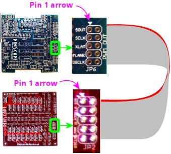
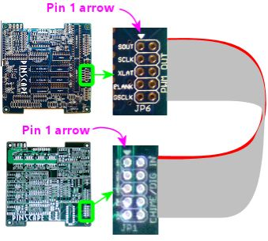
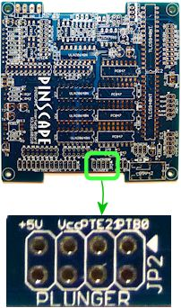

= Connecting the Expansion Boards

Before connecting of disconnecting any of the expansion board cabling, you should have the power off to the PC and all of the power supplies. The same applies for seating and removing the KL25Z in the main board sockets.

== Attach the KL25Z

The KL25Z simply fits into the sockets on the main board. It only fits in one way, since the sockets are asymmetrical.

In addition, connect the "KL25Z port" to the PC via a USB cable.

image::images/kl25z-usb-ports.png[""]

The "KL25Z port" is the one that Pinscape uses for all of its joystick emulation, keyboard emulation, and output controller features. The "OpenSDA port" is only needed when downloading new firmware onto the KL25Z, so you don't have to leave it plugged in all the time. But it's fine to do so - it doesn't interfere in any way with normal controller operations. I leave it plugged in on my cab so that I don't have to mess around with connecting cables when I want to update the firmware; it's always plugged in and ready to go with updates.

== Connect power cables

All of the expansion boards have *two* power input: one labeled *PC PSU* and one labeled *2ND PSU* . Both of these inputs must be connected to power in order for the boards to operate.

The connectors on the boards use special cables that you can build yourself. See xref:expanPower.adoc[Expansion Board Power Cables] for full instructions.

The *PC PSU* connector is meant to connect to the ATX power supply that's powering your PC motherboard. You should connect the cable for this connector to a free disk power plug on your PC's power supply.

The *2ND PSU* connector is meant to connect to a separate, "secondary" ATX power supply that's dedicated to powering your 5V and 12V feedback devices, such as flasher LEDs, light strips, motors, fans, beacons, and possibly solenoids.

=== Do I really need _two_ power supplies?

Not absolutely, but it's better to use two.

If you have some serious constraint that prevents using two supplies, you _can_ get away with sharing a single ATX power supply for both the PC power and the feedback devices. The reason we recommend against this is that it places a lot of load on the one PSU. Some of the feedback devices draw enough power that they can momentarily overwhelm the PSU's voltage regulator, especially when switching on and off, which can make the PSU's output voltage levels fluctuate. Exposing a PC motherboard to that kind of fluctuation can cause glitches, such as USB disconnects or random Windows crashes. Using a separate power supply unit avoids placing that kind of load on the PC's supply.

If you do decide to run everything on a single power supply, the expansion boards _still_ need both connectors to be plugged in. In this case, you simply plug both connectors into the main PC power supply, rather than plugging them into separate supplies.

== Connect the first power board to the main board

Connect the power board to the main board via a 10-pin ribbon cable. See xref:ribbonCables.adoc[Ribbon Cables] if you haven't built this cable yet. This cable connects between *JP6 (PWM OUT)* on the main board and *JP2 (PWM IN)* on the power board.

*Be sure to align pin 1* on both ends of the cable. I recommend marking a red stripe along one edge down the whole length of the cable, and calling that the Pin 1 side. That makes it easier to get the orientation right at both ends, since all you have to do is align the red stripe with the "Pin 1 arrow" marked on the board at each end.

=== Connect additional power boards

If you're using two or more power boards, connect their data cables in a daisy chain, from the PWM OUT port of one board to the PWM IN port of the next board:

* The second board's PWM IN port connects to the first board's PWM OUT port
* The third board's PWM IN port connects to the second board's PWM OUT port
* And so on

image::images/2nd-power-connector.png[""]

== Connect the first chime board to the main board

Connect the ribbon cable between the main board's CHIME/DIG OUT port (JP5) and the chime's board's CHIME/DIG IN port (JP1). As with the power board ribbon cable, make sure that the cable is aligned so that Pin 1 on the main board header connects to Pin 1 on the chime board header. I recommend marking a red stripe on one edge for the whole length of the ribbon cable to mark the Pin 1 side, to make it easier to get the orientation right when plugging it in.

=== Connect additional chime boards

The chime boards connect in a daisy chain, like the power boards. In this case, you connect the CHIME/DIG OUT port of one boards to the CHIME/DIG IN port of the next board.

image::images/2nd-chime-connector.png[""]

== Connect the plunger sensor

The plunger sensor connects to the main board pin header marked *PLUNGER (JP2)* .

The easiest and best way to connect to this header is using a ribbon cable. There's a separate chapter for each type of plunger sensor, and each contains instructions for building the ribbon cable connector for that sensor. Also see xref:ribbonCables.adoc[Ribbon Cables] for general instructions on building ribbon cables.

When connecting the plunger sensor connector, take care to line up the *Pin 1* connection on the plunger sensor with the Pin 1 arrow marked on the main board.

== Connect button inputs

The buttons all connect to the header on the main board marked *BUTTON INPUT (JP1)* .

The numbered pins on this connector correspond to individual button inputs. The pin marked CMN is the "Common" pin.

Physically, pin cab buttons are typically either microswitches (such as the SuzoHapp pushbuttons most people use for the front panel buttons, such as Start and Exit) or leaf switches (usually used for flipper buttons). In either case, the part you wire to the expansion board is a "Normally Open" switch - a switch with two terminals that come into contact when you push the button. To wire a button to the expansion board, then, you connect one terminal of the switch to one of the numbered button input pins, and you connect the other terminal to the CMN (Common) pin. All of the buttons connect to the Common pin (thus the name!), but each button gets its own individual numbered input pin.

Full instructions for connecting the buttons can be found in xref:buttons.adoc[Pinscape Button Inputs] , and much more information about buttons in general (a list of all of the common pin cab buttons, what to buy, how to install buttons in the cabinet) is in xref:cabButtons.adoc[Cabinet Buttons] .

The pin header is designed to mate with a 26-pin crimp housing (listed in the parts list). For help assembling crimp pin housings, see xref:crimpPins.adoc[Crimp Pins] .

Some advice on assembling the crimp pin housing for this connector: I'd start with an empty housing (without any wires installed yet), and gradually install the wires as you install the buttons themselves. One nice thing about these crimp pin housings is that you can insert pins one at a time, so there's no need to install all of the pins at once. Each time you install a button, run the wiring from the button back to the expansion board, crimp a pin on the end of the wire, and insert the pin into the housing.

The one pin you probably will want to install up front is the Common wire, since all of the buttons will need to connect to that. You might want to connect that to a terminal block or something similar, so that you can easily add more wires that connect to this same common point as you add more buttons.

== TV ON connections

See xref:tvon.adoc[TV ON Switch] for details on connecting the TV ON switch.

== IR remote control connections

See xref:irRemote.adoc[IR Remote Control] for how to connect the IR remote control emitter.

== Feedback device connections

See xref:psOutputsExp.adoc[Pinscape Outputs Setup (Expansion Boards)] for how to connect feedback devices to the expansion boards.

