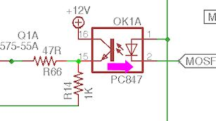

[#expanDebug]
= Debugging the Expansion Boards

This section has some things you can try to diagnose and fix any problems you've having with a set of expansion boards.

If you haven't already, you should run through the test procedures in xref:expanTesting.adoc#expanTesting[Initial Expansion Board Testing] . That should give you a clearer idea of what's working and what's not working. That section also includes some basic debugging steps that might solve some simpler problems.

If you go through all of the debugging suggestions for a particular symptom without identifying the problem, let me know. I'd like to include as many causes and fixes as possible, so if you come up with a new one that I haven't covered here, I'd like to add it.

== Top problem sources

Here are the main causes of problems I've seen when helping people debug expansion boards:

* Bad solder joints. These boards have lots and lots of solder pads, so it's very easy for a couple of them to fail. A so-called "cold solder joint" is one that looks good visually, but has tiny fractures in the solder, blocking electrical contact. The best way to test for these is continuity testing (see below); we'll point out which points in the circuits you should test for each failure mode.
* Defective chips. Some chips are simply defective when they roll off the factory assembly line, and some get damaged during shipping or storage. I've had defective chips a couple of times even when ordering from Mouser, but it seems to happen a lot more with eBay. With Mouser, you can count on them to sell you authentic, factory-direct parts, and to handle them properly at their warehouse, but a few dead parts still slip through the cracks. With eBay, who knows what you're getting. I've heard from several people who had problems with their boards that turned out to be dead TLC5940 chips that they ordered from eBay. You can't get those chips anywhere but eBay these days, so you just have to hope for the best. I've also run into a couple of bad optocouplers (PC817 and PC847). Unfortunately, there's no easy test procedure you can perform for the TLC5940 or PC8x7 chips individually (and you shouldn't have to do that anyway, since you should be able to count on the factory to do quality control checks). But there are some things you can do once they're installed to trace a problem to a particular dead chip, which we'll get to shortly.
* Simple chip insertion or cabling errors. See "quick sanity checks" below.

== Quick sanity checks

At the risk of belaboring the obvious, it's always good to double-check some of the basics:

* Make sure all power cables are connected. The PC PSU and 2ND PSU connectors must *both* be connected for the boards to function properly.
* Make sure cables are inserted the right way. For ribbon cables, I always recommend marking one edge of the cable with a red stripe (or something similar), and making sure that the red stripe is on the side with the "Pin 1" marking on the circuit board connector at both ends.
* Make sure IC chips are inserted the right way. See xref:icchips.adoc#icchips[IC Chips] for how to properly orient each type of IC used in the project.
* If you're using sockets for the IC chips, visually inspect them and make sure the chips are fully seated, and that all of the pins are inserted. Make sure none of the pins are sticking out the side of the socket or got folded under the chip.

== Visual solder check

I recommend giving the board a careful visual inspection with a magnifying glass, looking for suspicious solder joints. This is an easy test, and it's pretty effective - I can usually catch one or two bad connections this way after first assembling a board. Some bad solder joints can evade visual detection, so this probably won't catch them all, but it can save you some time later if you catch the obvious ones up front.

== Continuity testing

One of the main tests we'll recommend throughout this section is "continuity testing," which means that you use a multimeter to check that there's a solid connection between two points.

I think the most common cause of problems I've seen with the expansion boards is bad solder joints. It's no wonder, since these boards have quite a lot of individual pin pads, and I think even the most experienced soldering experts still have some percentage of "cold" (non-connected) solder joints on the first attempt. Every time I've built these boards myself, I've had two or three bad connections per board.

The tricky thing about cold solder joints is that they can look perfectly normal to visual inspection. The solder can sometimes form tiny fractures as it cools that aren't readily visible but are big enough to prevent electrical contact. So the best way to find them is to test for electrical continuity. We'll point out specific places to test for each set of symptoms.

Most multimeters have a continuity testing mode that makes this fairly easy. The way this usually works is that the meter beeps when it detects good continuity, so you can test connections between several points quickly without having to stop and look at the meter. A slower alternative if you don't have a proper continuity-test mode is to use the resistance mode (to measure Ohms). A good connection should show a very small resistance value, well below 1Ω, and usually something like .01Ω.

Always test continuity with the power OFF.

When testing continuity to an IC pin, always test (if possible) at the *pin* itself. Not the solder pad on the bottom of the board, but rather the metal leg coming out of the chip, on the top side of the board. That's the surest place to test. If the problem is a cold solder joint, the whole problem is that the solder hasn't adhered properly to the pin. It might have adhered properly to the copper trace on the circuit board, so you might see continuity to the little glob of solder. But that doesn't matter if the solder isn't attached to the pin. So if you measure at the solder, you might see good continuity, even if the pin isn't attached properly. So measure at the pin when possible. The same goes for resistors, capacitors, transistors, and so on. Likewise, when testing a pin header, measure directly at the pin on the top side.

If a continuity test fails, the best and easiest remedy is to get out your soldering iron and re-melt the solder at each end of the connection. You might also apply fresh solder, but I'd only do that if the current joint looks starved for solder; you don't want a giant glob that might create a short circuit with an adjacent pad.

After re-soldering to try to fix a failed test, check continuity again. If it looks good, go back and repeat the *live* test that led you to do the continuity test in the first place - test the button input, output port, etc. Most problems are due to single continuity errors, so re-soldering the pins when you find such a problem will usually fix the whole problem.

== EAGLE plans

For trickier problems, we might ask you to open the plans for the boards in the EAGLE software, which is the circuit board design program used to create them. I know - that might sound scary. But the tasks needed for this section are pretty simple, and we'll walk you through them. The EAGLE files are the definitive source of information on the details of how the parts on the board are connected, so that's really the most reliable way to get some of the needed information when tracing connections.

If you do get to a point where we ask you to go to the board plans, here's how to set that up:

* Download and install the free personal-use version of EAGLE from link:https://www.autodesk.com/[Autodesk] :

link:https://www.autodesk.com/products/eagle/overview.html[www.autodesk.com/products/eagle/overview]

* Download and UNZIP the board plans:

link:http://mjrnet.org/pinscape/expansion_board/download.php[mjrnet.org/pinscape/expansion_board/download.php]

* Launch EAGLE
* In the EAGLE control panel menu, select *File* > *Open* > *Board*
* Select the .BRD file for the expansion board you want to look at

=== A few EAGLE usage tips

* The .BRD (board) file represents the layout of the board, as a 2D top-down view; everything is in the same place as on the physical boards
* Spin the mouse wheel to scroll in and out
* Press and hold the mouse wheel to pan the circuit board view
* Right-click on pins or circuit traces for a context menu with possible commands for the object
* On the main menu, select *File* > *Switch to schematic* to view the circuit schematic
* For help reading the schematic, see xref:schematics.adoc#schematics[Schematics]

=== How to trace a circuit in EAGLE

EAGLE makes it easy to see exactly what's connected to a particular point on the circuit board. This is the best way to trace a connection.

* Run EAGLE and load the .BRD file you want to look at as described above.
* Find the header pin, IC pin, or other component connection point you want trace
* Right-click on the center of the pin
* Select *Show* from the context menu 

* The network of connections to that pin will light up, including the copper traces on the circuit board, and the IC/header/component pins connected at the other end or along the way. For example, here's the connection from a pin on the Button Input header to the KL25Z sockets: 

[#debugButtonInputs]
== Button inputs

Test button switch the Button Tester window in the Config Tool - not, say, by checking for Windows keyboard or joystick input. The Button Tester window is a more direct view of the hardware input.

Double-check the System Type setting in the Config Tool settings to make sure it's set to Pinscape Expansion Boards.

=== No buttons are working

If none of the button inputs are working, the CMN (Common) pin on the button input header is the likely culprit, because that's the one connection that all of the inputs share. Check continuity from the CMN pin on the header to a ground pins on the KL25Z, such as J9 pins 12 or 14 (see xref:kl25zPinOut.adoc#kl25zPinOut[Pinout] ).

=== Some buttons are working, some aren't

If button #6 is the only one that's not working, there's a very good chance that your System Type in the settings is set to Standalone KL25Z. If so, change it to Pinscape Expansion Boards.

The individual button input pins connect directly to KL25Z GPIO pins, so really the only thing that can go wrong other than software configuration problems is cold solder joints. Check continuity on each non-working button as follows:

* Use the Button Tester window to identify the GPIO port for the non-working pin. The number in the *Button#* column corresponds to the pin number on the expansion board header. The *GPIO Pin* column tells you the KL25Z GPIO port. If you move the mouse over the button's row, the location of the GPIO pin will be highlighted on the KL25Z diagram on the right.

* With the power off, test continuity from the pin on the Button Inputs pin header (testing the pin on the top side of the board) to the KL25Z pin highlighted in the diagram.
* If the continuity is bad, try re-soldering the Button Input header pin and the corresponding KL25Z socket pin on the expansion board. While you're at it, re-solder the header pin connection on the KL25Z itself - it might be bad at the KL25Z end.
* If the continuity is good, you might try re-soldering the KL25Z header pin connection anyway, as you can't really check continuity all the way to the KL25Z itself - only to the pin. So the problem could still be a cold solder join in the KL25Z pin header.
* If none of that helps, go back and check the software configuration again, and cross-check it against the EAGLE plans for the board:
** Check the GPIO pin assignment in the Config Tool
** Open the .BRD file for the main boards in EAGLE
** Find the pin of interest on the Button Inputs header
** Right click in the center of the pin and select *Show* from the menu
** That'll light up the whole network of things connected to that pin, including the traces on the circuit board and the KL25Z socket pin on the other end. Zero in on the KL25Z socket pin. Make sure it's in the same position as the one you've been testing.
** See "How to trace a circuit in EAGLE" above for more on this.

== Feedback device outputs

Test feedback outputs using the Output Port Tester in the Config Tool, not DOF or LedBlinky or other third-party programs. The Output Port Tester is the most direct test of the hardware, bypassing any configuration problems with other software. DOF in particular has lots of its own things that can go wrong; you don't want to have to guess whether the problem is in the software or the hardware.

=== Main board flasher/small LED ports: none are working

The RGB Flasher ports and Strobe port are controlled by the first TLC5940 chip, labeled IC1 on the circuit board. The Small RGB LED ports are controlled by the second TLC5940 chip, IC2.

If all 32 of these ports are dead, the most likely cause is a bad connection to one or more of its main data or power inputs. These chips have several critical inputs that all have to be working for the chips to function, so a single continuity problem in any of the input pins will make the entire chip appear to be dead.

Another possibility is that one or both TLC5940 chips are defective - the chips are daisy-chained, so a defective IC1 can make both chips appear to be dead.

If you installed the TLC5940 chips in sockets, and you have additional TLC5940 chips on hand (spares, or the chips installed in a power board), it's easy to swap the installed pair for another pair to check for bad chips. Even though the DOA rate for these chips is fairly high with eBay sources, I don't think I've talked to anyone who had more than one or two bad chips in a batch. So if you bought at least four or five of them, the odds are good that _some_ of them will work. So:

* First, try swapping IC1 and IC2 with one another; do another test run
* If everything's still dead, try replacing both IC1 and IC2 with spares

If that didn't help, it's still possible that you got an entirely bad lot of TLC5940 chips, but hopefully not - I haven't heard from anyone who's had that happen yet. It's more likely that at least some of your chips are good, and that the problem is instead in the wiring.

Make the following continuity tests. I'd recommend having the .BRD file open in EAGLE while you're doing this, since that makes it a lot faster to find the test points on the physical boards. If you prefer, you can refer to the xref:kl25zPinOut.adoc#kl25zPinOut[KL25Z pin-out diagram] to locate the pins on the KL25Z. When we say something like "J1 pin 11" on the KL25Z, we're talking about the location KL25Z's pin headers, not the expansion board headers.

* Pin 17 on *IC1 only* should connect to PIN 26 on IC2
* Pin 18 on IC1 and IC2 should connect to KL25Z PTA1 (J1 pin 2 on the KL25Z)
* Pin 19 on IC1 and IC2 should connect to the GND pin on the PC PSU connector
* Pin 22 on IC1 and IC2 should connect to the GND pin on the PC PSU connector
* Pin 23 on IC1 and IC2 should connect to KL25Z PTC7 (J1 pin 1 on the KL25Z)
* Pin 24 on IC1 and IC2 should connect to KL25Z PTC10 (J1 pin 13 on the KL25Z)
* Pin 25 on IC1 and IC2 should connect to KL25Z PTC5 (J1 pin 9 on the KL25Z)
* Pin 26 on IC1 should connect to KL25Z PTC6 (J1 pin 11 on the KL25Z)
* Pin 26 on *IC2 only* should connect to Pin 17 on IC1 (as already noted above)
* Pin 27 on IC1 and IC2 should connect to the GND pin on the PC PSU connector

If all of that looks good, check that the chip's power supply is working. With the power on, carefully measure DC voltage at pin 21 (on both chips). Connect the meter's red probe to pin 21 on the chip, and connect the black probe to one of the PWM OUT pins in the row nearest the edge of the board. This should read 3.3V. If not, check the pin 21 solder connection, and check all of the solder connections for IC12 (the LD1117AV33 chip that looks like a MOSFET).

=== Main board flasher/small LED ports: no flasher ports work, some/all Small LED ports work

The most likely problem here is that the +5V connection on the flasher header isn't connected properly to power. Check continuity between that pin and the +5V pin on the 2ND PSU header (JP10). If that looks good, try measuring the voltage at the flasher +5V pin, carefully, with the power on. Connect the red probe of your meter to the flasher +5V pin, and connect the black probe to one of the middle pins (pin 4 or 5) on IC8. If that doesn't read 5V, the problem must be in your 2ND PSU power cable - check its connections carefully.

The next possibility, although it's really unlikely, is that IC1 is defective. Given that IC2 must be working for the Small LED ports to work, we can easily test this possibility by swapping IC1 and IC2. If the working and non-working ports trade places, the problem is a defective chip - the one in IC2 after the swap. If nothing changes, both chips are probably good, and the problem is in the wiring.

Go back to the "none are working" section and check the power inputs to IC1. You can also check the signal inputs, but it's unlikely that IC2 would be working at all if any of IC1's signal inputs aren't working, since IC2 takes its signal input from IC1's output, so a broken IC1 will usually prevent IC2 from working either.

=== Main board flasher/small LED ports: some/all flasher ports work, no Small LED ports work

If some of the ports are working, but *all* of the Small LED ports are broken, the problem is probably the second TLC5940 chip, IC2. This is a direct corollary to "none are working" above, but isolated to IC2. The main things to look at in this case are continuity to the IC2 data and power inputs, and the possibility of a defective IC2.

One other, simpler possibility is that the +5V pin on the Small LED header isn't working. Check continuity between that pin and the +5V pin on the PC PSU header (JP7). You might also want to check the DC voltage reading on that pin with the power on - to read that voltage, connect the red meter probe to the +5V pin on the Small LED header, and connect the black probe to one of the Ground pins on JP6 (PWM OUT) - any of the pins on that header in the outer row (closer to the edge of the board). If continuity to the PC PSU header is good, the problem must be a bad connection in your power cable.

If you installed the chips in sockets, we can easily check to see if IC2 is bad by swapping IC1 and IC2. We know that IC1 is a working chip, since some or all of its ports are working. If we swap IC1 and IC2, then, we move the known-working chip into the IC2 socket, and the questionable chip into the IC1 socket. So power down, swap the chips, and run the port tests again. Here's what we'll learn:

* If all of the ports are dead now, or the live and dead ports trade places (the working ports move to the Small LED group, and all of the flasher/strobe ports are now dead), you have a bad chip - the one that's now in the IC1 socket is the dead one, and the other one is good. Throw out the chip in the IC1 socket and try a new one.
* If the same set of ports remain working as before, the chips are both good, so the problem is in the wiring. Proceed with the continuity checks below.

If the problem is in the wiring, it's most likely either the power connections to IC2, or the data connections to IC2. Follow the same procedures to test continuity to the TLC5940 inputs described above under "none are working", but you should only have to look at the IC2 inputs in this case.

=== Main board flasher/small LED ports: some work, some don't

If some of the flasher and small LED ports are working and some aren't, it's almost certain that the TLC5940 chips are working properly and that all of their power and data inputs are working properly. The chips and their inputs have to be working for _any_ of the ports to work, so we can rule out those sorts of problems if even a single port works correctly.

If you installed the TLC5940 chips in sockets, one easy test that you can do to rule out a partially defective chip (mostly working, but with a few dead ports) is to swap IC1 and IC2 with one another. If the bad ports followed the chips, you must have a chip with one or more bad ports. I haven't talked to anyone who's encountered such a thing, but it seems like a possibility in principle. If the dead ports are exactly the same before and after the swap, the chips must be good - it's the wiring.

====  Checking the small LED output wiring

The Small LED outputs are connected directly to the TLC5940 output ports, so if one of those ports isn't working, it's probably just a bad solder joint at either the Small LED header pin or the corresponding TLC5940 pin. To identify the path to trace:

* Launch EAGLE and load the .BRD file
* Right-click in the center of the Small LED header pin of interest
* Select *Show* from the context menu
* This will highlight the circuit trace from the Small LED header pin to the TLC5940 pin for the port. The highlighted TLC5940 pin is the one to check. Test continuity between that pin and the header pin.
* If there's no continuity, re-solder the connection at each pin (the header pin and the TLC5940 pin)
* If you're using sockets, also check to make sure that particular TLC5940 pin is properly inserted in its socket

====  Checking the flasher/strobe output wiring

The flasher/strobe ports are more complex to trace than the Small LED ports, because the former are connected through optocouplers and Darlington transistor chips to allow them to drive larger devices. The problem for a flasher port could therefore be a continuity problem along the chain of connections through those other components, or it could be that one of those components is defective.

You'll need the EAGLE .BRD plans to trace these connections:

* Launch EAGLE and open the .BRD file
* Right click on the RGB FLASHERS header (JP11) pin or STROBE (JP9) pin that you want to trace
* Select *Show* from the context menu
* This will highlight a trace leading back to one of the ULN2064BN chip pins. Continuity check the connection between the header pin and the UL2064BN pin. If that's bad, re-solder both pins - this might be the whole problem, so do a new power-on test of the output.
* For the next step, you'll need the schematic window to be open: on the main menu, select *File* > *Switch to schematic*
* In the "Sheets" list on the left, select Sheet 3 ("Flasher/Lamp Outputs")
* Click on the Board window's title bar to bring it to the front, and *Show* the pin again
* Click on the Schematic window's title bar to bring it to the front. The same pin should be highlighted on the schematic in two places: on the JP11 header and on one of the ULN2064BN chips. Find the highlighted ULN2064BN pin - this should be labeled "O1", "O2", "O3", or "O4" inside the ULN2064BN box.
* Trace across the ULN2064BN box to the corresponding "I" pin on the opposite side - from "O1" to "I1", "O2" to "I2", etc.

* Right-click the red line sticking out of the ULN2064BN box for that pin and select *Show*
* Click on the Board window's title bar to bring it to the front. You should now see two new pins highlighted: a ULN2064BN pin, and a pin on a PC847 chip. Check continuity between those two pins. If it's bad, re-solder both pins - this might fix it, so do a new power-on test of the output.
* Still not there? Click on the Schematic window's title bar to bring it to the front, and find the PC847 pin that's now highlighted as part of the circuit trace. This should be the "emitter" of a PC847 - a line with a little arrow pointing out of the box. Find the pin on the opposite side of the PC847 box - right click it and select *Show* .

* Go back to the Board view. Yet another pair of pins should be highlighted: one on the PC847, and one on the TLC5940. Check continuity between these pins. If it's bad, re-solder both pins, and do another power-on test of the output.

We've now traced the circuit all the way from the pin header to the TLC5940, so if it's a continuity problem, you should have found it by now. The remaining possibility is that one of those two components we just traced is bad - either the ULN2064BN or the PC847. (Hopefully you paid attention in the steps above to which ULN2064BN and which PC847 we were tracing through. If not, go back through the tracing steps to identify the chips. Write down their chip numbers so that you know which ones to look at more closely.)

If you installed these chips in sockets, the easiest test is always to do a chip-swap. Do one swap at a time: first swap the ULN2064BN with one of the others on the board, or with a spare if you have one. Run the live test again. If that doesn't fix it, swap the PC847 with one of the others on the board or with a spare.

=== Main board knocker port isn't working

The knocker port is a pretty complex one to trace because of the timer circuit. For whatever reason, though, this one doesn't seem to give anyone any trouble. The parts in this circuit are simple ones that are likely to be reliable, so any problems are probably due to a bad solder connection. Rather than trying to trace through the many connections one by one, I'm going to just point you to the parts to check. Check the solder joints on each part and re-solder any that look suspicious. On the circuit board, these parts are mostly clustered around the knocker/strobe output header, but a few are scattered elsewhere.

* C5
* C7
* C8
* C9
* IC11
* OK5
* R6
* R8
* R10
* R12
* R13
* R14
* R18
* R37
* T2
* T3
* Q1

For the definitive list of parts, look at the EAGLE schematic, on Sheet 2 ("Knocker Output").

=== Power board ports: none work

The power board ports are controlled by TLC5940 chips, like the flasher and small LED ports on the main board, so the diagnosis process is similar. If all of the ports on this board are dead, the main possibilities are:

* The data cable from the main board isn't connected properly. Visually check that it's installed properly and that both ends are oriented properly. Make sure that the same edge of the cable aligned with the "Pin 1" arrow on the main board is aligned with the "Pin 1" arrow on the power board. Make sure that it's plugged in the PWM IN port on the power board, and the PWM OUT port on the main board. (The PWM IN and PWM OUT ports on the power board look identical, so read the label and make sure you have the IN port on the power board. Likewise, the PWM OUT and CHIME OUT ports on the main board look identical. Make sure you're using the PWM OUT port on the main board and not the CHIME OUT port.)
* If the data cable looks to be installed properly, check continuity (with the cable connected, and power off) for each pin on the headers headers. Unlike the usual rule about testing the pin, this time you want to check continuity on *bottom* of the board, testing at the solder pads. The reason is that we're testing the cable this time, so we want to make sure we have a good connection from solder joint to solder joint. Check pin #1 on the main board PWM OUT against pin #1 on the power board PWM IN, pin #2 against pin #2, etc. All pins must be connected.
* Assuming you have all of the outputs on the main board working at this point, and assuming you installed the TLC5940 chips on both boards in sockets, you can test for a defective chip by swapping the TLC5940 chips on the power board with the ones on the main board. We know that the ones on the main board must be working if their outputs are working.
* If the chip swap doesn't change anything, test continuity to the data connections. This is similar to testing the TLC5940 pins on the main board:
** Pin 17 on *IC1 only* should connect to PIN 26 on IC2
** Pin 18 on IC1 and IC2 should connect to KL25Z PTA1 (J1 pin 2 on the KL25Z)
** Pin 19 on IC1 and IC2 should connect to the GND pin on the PC PSU connector
** Pin 22 on IC1 and IC2 should connect to the GND pin on the PC PSU connector
** Pin 23 on IC1 and IC2 should connect to KL25Z PTC7 (J1 pin 1 on the KL25Z)
** Pin 24 on IC1 and IC2 should connect to KL25Z PTC10 (J1 pin 13 on the KL25Z)
** Pin 25 on IC1 and IC2 should connect to KL25Z PTC5 (J1 pin 9 on the KL25Z)
** Pin 26 on *power board IC1 only* should connect to Pin 17 on *main board IC2* (note that we're testing ICs on separate boards here!)
** Pin 26 on *IC2 only* should connect to pin 17 on IC1
** Pin 27 on power board IC1 and IC2 should connect to the GND pin on the PC PSU connector
* If all of that looks good, check that the chip's power supply is working. With the power on, carefully measure DC voltage at pin 21 (on both chips). Connect the meter's red probe to pin 21 on the chip, and connect the black probe to one of the PWM OUT pins in the row nearest the edge of the board. This should read 3.3V. If not, check the pin 21 solder connection, and check all of the solder connections for IC12 (the LD1117AV33 chip that looks like a MOSFET).

=== Power board ports: some work, some don't

As with the main boards, if some ports are working, the data and power inputs to the TLC5940 chips must be good, since these chips won't work at all if there's a problem in any of those inputs. So the problem is either an isolated port failure in one of the TLC5940 chips (unlikely - I haven't heard of a case of this actually happening in the wild, only complete failures of the entire chip), or more likely, a problem in the wiring between the TLC5940 and the output port pin.

If you installed the TLC5940 chips in sockets, you can do a quick test to rule out the bad chip scenario by swapping chips. Simply swap the two TLC5940 chips with one another, and do another power-on test. If the pattern of bad ports remains the same, the chips are okay; if the pattern changes after swapping the chips (in particular, if the bad port follows the chip to a new port), the chip controlling the bad port probably has a bad output. Try replacing it with a fresh TLC5940 chip.

If the chip swap doesn't turn up anything, we have to trace the output circuit from the TLC5940 pin to the output pin header. You'll need to open the .BRD file in EAGLE for this process. As always, if you find a continuity problem, re-solder the pads at each end of the connection, re-check continuity, and if it looks good, run another live test to see if the problem is resolved.

* In the EAGLE Board view, right-click the pin on the HI POWER OUTS header that you want to trace, and select *Show* from the context menu
* This will highlight a trace back to one of the MOSFETs. Test continuity between the two points (the pin and the MOSFET - try to test at the MOSFET leg on the top side of the board if possible).
* Next, test the other two MOSFET legs. One will be connected to the super-wide ground trace; test continuity from that MOSFET leg to the GND pins on the 2ND PSU power connector (JP4). The other will connect to a resistor; check that connection from the MOSFET leg to the resistor leg.
* The other end of that resistor will connect to *two points* : another resistor right next to it, and a pin on a PC847 chip. Check both connections.
* At this point we have to consult the schematic to find the next jump. On the main menu, select *File* > *Switch to schematic* . In the "Sheets" list on the left, select page 2 ("MOSFET Outputs").
* Click in the Board window's title bar to bring it back to the front. *Show* the connection to the PC847 again. Note the chip number (OK1, OK2, etc). Click on the Schematic window's title bar to bring _it_ to the front. Find the same OK _n_ chip, and find the highlighted pin. It will be hard to spot because it's just a short wire segment, but it'll connect to the "emitter" side of one of the OK's. 

* Trace across the OK chip from the highlighted emitter pin side to the pin on the opposite side of the box. Right-click that pin and select *Show* .

* Click on the Board window title bar to bring it back to the front. You should see a highlighted trace from a highlighted PC847 pin to a highlighted TLC5940 pin. Check continuity between those two pins.

That's the whole circuit, so if it's a continuity problem, it should have turned up somewhere in that process. If there are no continuity problems, you must have either a bad PC847 or a bad MOSFET. If you installed the PC847 chips in sockets, try swapping the suspect PC847 with one of the others, and do another live test.

Replacing the MOSFETs is more difficult since there's no good way to socket them, but at least they only have three pins, so it's possible to de-solder them with some patience. If you want to do a more definitive live test of the MOSFET before going to the trouble of de-soldering it, it's possible, but a little tricky. You have to do this as a live test with the power on, so be really careful about touching wires anywhere other than the exact points we say to:

* Go back to the schematic and find the PC847 controlling the MOSFET, following the procedure above to trace through the circuit.
* Identify the pin shown below on the schematic. Use the right-click *Show* command on each pin to highlight it and identify the physical pin location on the Board view. This is the first pin we're going to short in our test. 

* In the board view, type into the command box at the top *show +12V* and press Enter. That will highlight a bunch of pins on each PC847 - one of them should be right next door to the one you identified above. This is the second pin we're going to short.
* With the power running, carefully short the two pins identified above. If the MOSFET is working, the output should turn on. If it doesn't, the MOSFET is probably dead, so I'd try replacing it.

=== Chime board ports: none work

There are two main "single points of failure" that would make the whole chime board fail to work:

* The data cable
* The 74HC595 chip

Start with the data cable, since it's easy to check. Make sure that it's installed with the same edge facing the Pin 1 arrow on the main board and the chime board. (I recommend the "red stripe" trick to make that easier: mark a red stripe down the whole length along one edge, and check that the red stripe aligns with the Pin 1 arrows marked on both boards.)

Make certain that the cable is plugged into the *CHIME/DIG OUT* port on the main board and the CHIME/DIG *IN* port on the chime board. Check the markings carefully - the OUT port on the chime board looks exactly like the IN port. And the CHIME port on the main board looks exactly like the PWM port; make sure you're using the CHIME port with the chime board.

If you're sure the cable is installed correctly, check continuity across the pin headers connecting to the cable. Do this with the cable connected and the power off. Unlike the usual rule about testing at the pin, this time you want to check continuity on *bottom* of the board, testing at the solder pads. The reason is that we're testing the cable this time, so we want to make sure we a good connection from solder joint to solder joint. Check pin #1 on the main board CHIME/DIG OUT against pin #1 on the chime board CHIME/DIG IN, pin #2 against pin #2, etc. All pins must be connected.

The next thing to check is the 74HC595 chip. This controls all of the outputs, so if none of them are working, the problem could be a defective chip or a bad data or power connection. The chip won't work at all if the data or power connections aren't working.

If you installed the chip in a socket, and you have a spare, you can swap the chip with the spare, as an easy way to check for a defective chip.

To test the data connections to the 74HC595, leave the data cable to the main board attached, so that we can test continuity all the way back to the KL25Z pins:

* Pin 8 on the chime board 74HC595 should connect to the GND pin on the PC PSU connector (JP7)
* Pins 10 and 16 on the chime board 74HC595 should connect to the 3V3 pins on the KL25Z (J9 pins 4 and 8)
* Pin 11 on the chime board 74HC595 should connect to PTA4 on the KL25Z (J1 pin 10)
* Pin 12 on the chime board 74HC595 should connect to PTA12 on the KL25Z (J1 pin 8)
* Pin 14 on the chime board 74HC595 should connect to PTA5 on the KL25Z (J1 pin 12)

The next test will require voltage testing with the power on, so be careful - don't let your multimeter probes short any pins together while working.

* Power up the system for a live test
* Connect the multimeter's black probe to one of the Ground pins on the CHIME/DIG OUT connector - the pins on the side nearest the edge, *except for pin 2* (the one near the pin 1 arrow), which isn't connected
* Use the red probe to measure the voltage
* Pin 13 on the 74HC595 should read a low voltage, about 0.6V

If pin 13 reads zero voltage, or nearly zero, or weird random fluctuating voltages, there might be a continuity problem - check the connection to the pin 7 (ENA) on the CHIME/DIG IN connector on the chime board. If it reads about 3.3V, the problem is probably on the main board side. Check wiring to the following *main board* parts:

* R3
* R4
* T7

For the definitive connections in that section, see the main board EAGLE schematic for the connection to the CHIME/DIGITAL OUT header (JP5) pin 7 (ENA).

=== Chime board ports: some work, some don't

If some individual chime board ports are working and others aren't, the data cabling and the 74HC595 wiring must be sound, so the problem lies in the timer circuit or MOSFET for the individual non-working outputs. These are fairly complex circuits, and fortunately they don't seem to give anyone trouble, so I'm not going to go through a complete tracing process for them here.

If you do need to debug one of these circuits, note how each output's timer circuit is grouped together into a little rectangular section of the circuit board, marked on the top of the board with a box around it:

The numbers in the diagram show the correspondence between the output port pins and the timer block boxes. So if output pin 3 isn't working, for example, find the box marked 3 on the diagram, and focus on the parts within that box. You can also identify which block connects to which output by looking for the ICM7555 IC chip within the block. These are numbered the same as the outputs: IC1 is in timer block 1 for output 1, IC2 is in timer block 2 for output 2, etc. 

Given the number of parts and complexity of the network, it's probably more trouble than it's worth to trace individual connections and check continuity. Instead, I'd just inspect all of the solder joints within the bad output's timer block carefully, and if you can't find a visually apparent bad one, re-solder them all. Do a live test.

If that doesn't solve it, try the following live test. As always with live tests, be really careful not to short any pins besides the ones we're going to test.

* Find the PC847 chip within the block
* Identify pin 1 (by the dot on the chip)
* Short together the two pins shown below 

That test will bypass the timer block and simply activate the MOSFET. If the output turns on when you do this, the MOSFET is good, and something is wrong in the timer block. If the output doesn't turn on, the MOSFET is probably bad. To identify the MOSFET in this case, look for the "Q" label that matches the output port number: port 1 is MOSFET Q1, port 2 is Q2, etc.

