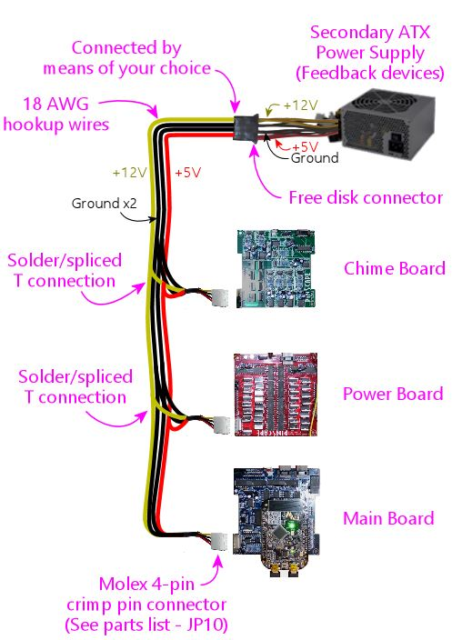
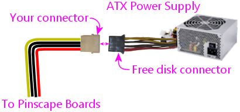
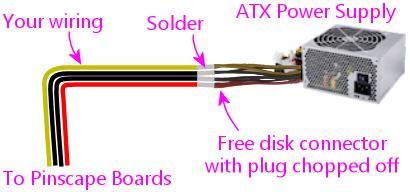

[#expanPower]
= Expansion Board Power Cables

Each of the expansion boards has two connectors that have to be plugged into ATX power supplies.
These are designed to work with special, custom power cables that you build as part of the expansion boards.
This section explains what's needed and how to build the cables.

== Connection plan

There are two cables, one for the "primary" ATX power supply, which is the one that powers your pin cab's PC motherboard, and one for the "secondary" ATX supply, which is dedicated to powering feedback devices.

The "primary" cable connects to your PC's power supply at one end, and then runs in a daisy-chain to each expansion board, plugging into the "PC PSU" connector on each board.

Here are some things to note:

* This is a custom power cable that you're going to construct out of hookup wire and the Molex 2-pin crimp-pin connectors in the parts list
* The connection at the ATX power supply end can be handled in a few different ways, such as using a compatible plug to plug into a free disk connector, using a breakout board, or soldering directly to a disk cable on the power supply; we'll look at the details later in this section
* The primary power connector only needs two wires: the red +5V wire, and the black Ground wire; these connect to the corresponding wires in the ATX disk connector or breakout board
* Each expansion board has its own plug
* The plug for each board is the same type
* Each plug connects back to the main wire with a "T" connection
** You can solder the connection at each "T"
** Or you can a "T-Tap" splice connector for a solderless joint (available at Amazon, Home Depot, etc)

The "secondary" cable, similarly, connects to your secondary PC's power supply at one end, and runs in a daisy-chain to each expansion board, plugging into the "2ND PSU" connector on each board.

== Wire

To build these cables, use ordinary hookup wire.
Here are the recommended wire types:

* Primary PSU connectors:
** 22 AWG
** One black wire
** One red wire
* Secondary PSU connectors:
** 18 AWG
** Two black wires
** One red wire
** One yellow wire

Note that the secondary PSU connector uses *two* black wires, which connect to the corresponding black wires in the disk connectors.
Be sure to connect both of these even though it seems redundant to use two.
The reason we use two is that it doubles the current-carrying capacity.
The black wires on these connectors carry the *combined* current from *all* of the feedback devices, so they can be subjected to very high currents at times.
It's the same reason the ATX power cables use two black wires - all the current for all the different voltages ends up going through these wires.

For each wire:

* Cut one piece long enough to reach from the power supply to the *farthest* expansion board
* Cut one additional piece for each additional expansion board, long enough to reach from the main cable to that board

== How to connect to the expansion boards

See the xref:partslist.adoc#electronicPartsList[parts list] for the necessary connectors.
There are two distinct connector types:

* A *two-pin connector* for the *PC PSU* (primary power supply) connections
* A *four-pin connector* for the *2ND PSU* (feedback devices/secondary power supply) connections

These are crimp pin housings, so you have to build them by crimping the pins onto the ends of the wires, and inserting the pins into the housings. Full instructions are in xref:crimpPins.adoc#crimpPins[Crimp Pins] .

Here's the pin ordering for the two-pin primary power supply connector. To orient it properly, look for the "ramp" side, which is the side that faces the ramp on the circuit board header when you plug it in. (The ramp is the vertical plastic projection on one side of the header, which ensures that you plug the connect in the right way.) The ramp side on this connector isn't marked very clearly, but you can identify it because it's the solid side - the opposite side has narrow slots where the crimp pin lock tabs fit. You can also tell the difference between the two sides by the distance to the pin openings in the bottom: notice in the picture how the pin openings are closer to the ramp side.

Here's the pin ordering for the four-pin secondary power supply connector. To orient it, look for the "ramp tabs" - the little triangular tabs sticking out on one side of the connector. This is the side that faces the ramp on the circuit board header when you plug it in.

Once the housings are built, you connect them to the Pinscape boards simply by plugging them in to the matching headers. The connectors and headers are keyed so that you can only plug them in one way.

== How to connect to the ATX power supplies

One end of each of the special Pinscape power cables connects to one of your ATX power supplies. There are several ways to handle the connection at this end.

=== Through a disk connector plug

My preferred way to connect to each ATX power supplies is through a free disk power connector on the power supply. This approach doesn't require any modifications to your power supply; you just plug into it the way you'd plug in a disk drive.

The disk power connectors are the four-pin connectors that look like this:

image::images/ATXDiskConnector.png[""]

This is a standard connector - the brand name is AMP Mate-N-Lok. (It's commonly misidentified as a Molex connector. There is in fact a similar-looking Molex connector, but it has a slightly different plug shape that's not compatible.) The connector that's attached to your ATX power supply is female, so to connect to this, you need the male side:

*  link:https://www.mouser.com/search/ProductDetail.aspx?R=571-14804260[TE/AMP 1-480426-0] Mate-n-Lok 4-pin housing
*  link:https://www.mouser.com/search/ProductDetail.aspx?R=571-606201[TE/AMP 60620-1] male crimp pins, quantity 4 per connector

These are crimp pin housings, so they require some assembly. See xref:crimpPins.adoc#crimpPins[Crimp Pins] for details on how to build this kind of connector.

One slight complication: the AMP crimp pins for this housing are designed for wire gauges from 20AWG to 14AWG. That's fine for the secondary PSU connector cabling, for which I recommend 18AWG hookup wire. But the primary connector cabling can't be thicker than 22AWG because of the crimp pins we use at the expansion board end! You might find that these large AMP crimp pins don't crimp onto the 22AWG wire tightly enough. If it won't stay in place after crimping, you can secure it by soldering the wire to the pins. Which defeats the purpose of the crimp pins (easy of assembly), but works. Alternatively, you can use thicker wire (18AWG, say) at the AMP connector end, and solder those thicker wires to the thinner 22AWG wire needed at the Pinscape end.

=== Through a breakout board

If you're using a breakout board to access your ATX power supply's 5V and 12V connections, you should use whatever connector type your breakout board uses. For example, if your breakout board uses screw terminals, simply strip 1/4" or so of wire from the end of the custom Pinscape power cable that's going to connect to the breakout board, and screw the ends into the appropriate terminals.

=== Hard-wired

The simplest way is to solder the Pinscape cabling directly to your ATX power supply's wiring, preferably to one of the disk power connector cables. This isn't my favorite approach, because it permanently modifies the power supply, but it's quicker and easier than messing around with crimp pins, and cheaper than adding a breakout board.

To do this, chop off one of the disk connector plugs on the power supply. That'll leave you with four bare wires you can solder to. Strip 1/4" or so of insulation from the end of each wire. Do the same with the wires in the Pinscape cable. Solder the ends together. Cover the exposed solder joints with shrink-wrap tubing or electrician's tape.

This leaves you with an ATX power supply with one less disk power cable, and a permanently attached Pinscape power cable. You can still plug and unplug the Pinscape ends, so there's no loss of modularity.

== Frequently asked questions about the power connectors

I've helped a number of people debug problems that came down to missing power connections, so I wanted to clarify some points about the power wiring. Some of the confusion probably comes from the LedWiz and some of the other arcade devices that have a bunch of connectors that you don't really need, so people probably get used to the idea that the connections on these controllers are mostly for "other people" with unusual setups. Not in this case! The connectors on these boards are for everyone. So, to answer some questions that have come up several times:

*  *Do I really need to connect the 5V _and_ 12V wires in the secondary connectors?*

Yes! These power connections actually provide power to the logic chips and transistors on the board. If the supply voltages aren't connected, the logic chips and transistors won't have power, and they simply won't work.

*  *Do I really need the _both_ black wires in the secondary connector?*

Yes! The secondary connector provides the common ground connection for *all* of your feedback device power connections. When your 3A shaker motor runs, that 3A goes through these wires. When your 3A shaker motor runs at the same time as your 4A gear motor and your 2A fan, the combined 9 Amps from all of those devices goes through these wires. We use two wires because it doubles the current-carrying capacity of one wire. We need that extra capacity because of the high combined current that can result when multiple feedback devices are running at the same time.

*  *Do I really need to connect _both_ the primary _and_ secondary connectors to each board?*

Yes! The two power connectors supply power to separate circuits on each board. The primary PSU connector supplies power to the "logic" circuits that connect to the KL25Z, such as the TLC5940 chips on the main and power boards, and the 555 timer chips on the chime boards. If the primary PSU connector isn't connected, none of the logic circuits receive any power, and nothing works. The secondary PSU connector supplies power to the MOSFETs that carry out the power switching, _and_ they provide the ground connections for _all_ of the feedback devices' power supply connections. If this connector isn't connected, the MOSFETs can't switch and the feedback devices don't have any connection to ground, so nothing works.

*  *Do I really have to use _two separate_ ATX power supplies for these boards?*

No. It's possible to run everything off of the single ATX power supply that's powering your PC motherboard. You *do* still have to connect both power cables, though - you'd just connect them both to that single ATX supply, if that's all you have.

But this is one of those cases where you shouldn't do something just because you can. The reason that we take it for granted that you're using two power supplies is that sharing a single power supply with feedback devices places too much load on your single PSU, and creates too much opportunity for electrical interference.

