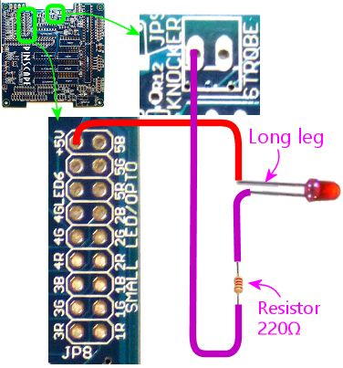

[#expanTesting]
= Initial Expansion Board Testing

This section gives you some tests you can perform on your newly built expansion boards to make sure they're working. I'd recommend going through these tests with a new board before installing it in your cabinet, since it's a lot easier to isolate and debug problems before everything is connected. The test procedures here are designed to test each subsystem in isolation (as much as possible).

If anything isn't working properly, the next chapter, xref:expanDebug.adoc#expanDebug[Debugging the Expansion Boards] , offers some ideas for how to diagnose and fix any problems.

== Configure the firmware

Before plugging anything into the expansion boards, you should make sure that your Pinscape firmware is installed, and that you've configured it for the expansion boards. Some of the GPIO pin assignments are different between the standalone configuration and the expansion board configuration, so things won't work properly if you don't set the right system type.

You can do all of the initial software setup and configuration with the KL25Z on its own, not plugged into the expansion boards.

For initial firmware installation, see xref:kl25zSoftwareSetup.adoc#kl25zSoftwareSetup[KL25Z Software Setup] .

To configure the firmware for the expansion boards:

* Launch the Pinscape Config tool
* Click the Settings icon for your device
* Make sure the *System type* (near the top of the page) is set to *Pinscape Expansion Boards* 

* Set the boxes below that to reflect the correct number of power boards and chime boards you're going to connect

== Tools and supplies for testing

For the initial testing, it's really helpful to have some items available:

* An ATX power supply. You can use the power supply that you're using with your pin cab motherboard if it's convenient, or you can use a separate one.

If you're using a separate power supply, make sure you've hacked it so that it powers up without a PC motherboard attached. If you're using a "breakout board" to get at its power connections, that should do the trick. If you're using your own connectors, you have to bridge a pair of pins on the motherboard connector to tell the PSU to power on. See "Overriding the soft power circuit" in xref:powerSupplies.adoc#ATXOverrideSoftPower[Power Supplies for Feedback] for the procedure.

For testing purposes, it's okay to just use a single ATX power supply. As we've said before, it's best to use two separate ATX supplies for your full cab setup - one for the PC, a separate one for the feedback devices. And if you have both power supplies conveniently available, you might as well test with the full setup. But it's also okay to use a single power supply for now, since we can do all of the testing with low-power devices.

* The special expansion board power cables, to connect between the ATX power supply and the Pinscape board. Two cables are required - one for the primary power supply connection, one for the secondary power supply connection. The two cables use different connectors (the primary uses a two-pin connector, the secondary uses a four-pin connector). You need both cables, even for testing purposes. See xref:expanPower.adoc#expanPower[Expansion Board Power Cables] for instructions on assembling the cables.
* Some "Dupont" cables, for making temporary test connections to the 0.1" pin headers. You can find these on eBay by searching for "Dupont cable", and you can get them from any of the hobby robotics Web stores (Pololu, SparkFun, Adafruit). These are simply hookup wires with individual 0.1" pin header male pins/female sockets attached to the ends. They let you safely plug a wire into any pin on any of the headers to test the connection. It's convenient to have a full set of the different gender combinations - male-to-male, female-to-female, and male-to-female.

If you buy a set of these on eBay, they'll often come as a sort of "ribbon cable", with all of the wires joined together in a flat bundle. For testing purposes, we'll just need a few individual wires, with one pin on each end. You can peel individual wires (or groups of wires) off of the ribbon cable bundles as needed simply by zipping them along the seams between the wires. The insulation should tear easily at the seams. You can pull off individual wires as needed - no need to separate them all up front.

* Alligator clip cables are also handy, for making temporary test connections to everything else, apart from the 0.1" pin connectors. These aren't a good substitute for the Dupont connectors, though, since it's hard to use them with pin headers; it's too hard to keep the bare metal of the jaws from coming into contact with the pins adjacent to the one you're trying to connect to.
* A small "bubble" LED - the type that runs on 5V or less and draws about 20mA.
* A 220Ω resistor to use with the LED. (220Ω should work with any 20mA LED and a 5V supply, but you can find the exact value for your particular resistor using the calculator in xref:ledResistors.adoc#ledResistors[LED Resistors] .)

We're going to assume you have these items on hand, but feel free to improvise or substitute similar items as you see fit.

== Cautions about connecting power

As a general rule, make sure the power supplies are OFF whenever you plug in or unplug the expansion board power cables.

Similarly, make sure that all power is OFF and that both USB cables to the KL25Z are unplugged when inserting the KL25Z into the expansion board sockets or removing it.

== Static electricity precautions

It's a good idea to ground yourself from time to time while working with the bare boards. Touching the metal case of a plugged-in ATX power supply is a good way to do that, or the metal back plane of a PC. See xref:staticSafety.adoc#staticSafety[Static Electricity Precautions] .

== Connect the KL25Z and the power supplies

Nothing should be connected the main board at this point - no power cables, no cables for the button or plunger inputs, no feedback outputs, and none of the connections to the other boards. It should just be completely on its own.

Unplug the KL25Z from USB, and seat it in the sockets on the main board.

Plug in the USB cable(s) between the KL25Z and the PC. You can connect both ports or just the "KL25Z port":

image::images/kl25z-usb-ports.png[""]

Plug the "PC PSU" and "2ND PSU" cables into the main board. Again, the power supply should be OFF while doing this.

Remember that *both* power connectors are always required. If you're only using one ATX power supply for the testing phase, you still need both cables - just plug them both into the single ATX supply.

== Turn on the power

Okay, we're all set up to try applying power. If the PC isn't already booted up, do so now.

Go ahead and turn on the power supply or supplies. Be ready to cut power quickly if anything seems wrong.

Pay attention to any burning odors coming from the board, and check by touch to make sure that nothing is getting hot. If there's any sign of overheating, cut power immediately (by turning off the power supplies - as always, *don't* unplug the expansion board power connectors while the power supplies are on).

If nothing seems to be overheating, check that the KL25Z has connected to Windows as usual. It should be showing up in the Pinscape Config Tool's list of attached controllers in the main window.

== Test button inputs

If the board passes the initial power-on test, the first actual function I'd test is the button inputs, since they're really easy to test.

In the Pinscape Config Tool, click on the Buttons icon for your device.

That'll bring up the Button Tester window. This is the most direct way to test buttons, because it shows you the status of the physical GPIO pins. The firmware has to do some work to turn those hardware pin states into keyboard key presses and joystick button events, so other ways of testing are less direct, and any problems could reflect software or setup issues rather than hardware issues. The Button Tester lets us look at the hardware more or less directly to check the basic wiring.

The first thing to check is that all of the buttons are showing their Pin Status as *OFF* . A button input that isn't connected counts as OFF, so assuming you haven't already connected any of the button pins to anything else, an ON indication indicates a problem. Specifically, it means that the wiring for that button is shorted to the KL25Z "ground" connection.

*Tip: If button #6 is stuck ON:* This is a frequent setup problem that lots of people run into. If button #6 is stuck ON, and the others all look okay, you probably have the System Type still set to "Standalone KL25Z" in the settings. Button #6 has different GPIO pin mappings in the Standalone vs Expansion Board configurations, because the pin originally used in the standalone setup had to be moved to a different function for the expansion boards. This commonly manifests as button #6 being stuck ON, because the software is monitoring that re-deployed pin instead of the pin on the Button Inputs header. To fix this, all you usually have to do is go back to the Settings and make sure System Type is set to Pinscape Expansion Boards.

Next, get out one of the Dupont cables we mentioned earlier. Use a female-to-female type - one with a 0.1" socket at each end. Find the Button Inputs header (JP1), and find the pin on that header labeled CMN (Common). If you orient the board so that the Button Inputs header is at the bottom, the CMN pin is at the bottom left of the header.

Attach one end of the Dupont cable to the CMN pin.

The button inputs work by connecting the individual button pins to the CMN pin. So to test a given button pin, all you have to do is plug the other end of the Dupont cable into the pin you want to test.

Go through the pins one by one. Connect the free end of the Dupont cable to the button pin, and observe the on-screen status in the Button Tester window. The status for each pin should change to *ON* as long as the cable is plugged in to that pin.

*Debugging tips:* The button inputs are really simple - they're just direct wiring connections from the Button Input header pins to the KL25Z GPIO pins. So there's really nothing that can go wrong with these other than bad solder joints.

The first thing I always try if nothing is working is to swap in a different set of Dupont cables. The cheap ones sometimes have bad connections at one or the other end. I've had this happen with Dupont cables and alligator clip cables multiple times - it's such a huge waste of time when it turns out your test equipment is the problem, and not the board you're trying to test! If you find a bad one, fix it or throw it out immediately so you don't keep stumbling over this red herring on future tests.

Barring bad cables, the most likely problem if none of the buttons are working is the CMN (Common) connection. All of the buttons have to go through that, so it's the prime suspect when the whole thing isn't working. Check the solder joint on the bottom of the board for the CMN pin.

If some buttons are working and some aren't, you know the CMN pin is good. The problem must be in the individual non-working button pins. Check the solder joint for the non-working pin. If that looks good, trace it back to the corresponding pin on the KL25Z connector. Check the solder joints on the expansion board (for the KL25Z socket at that pin), *and* check the solder joint on the KL25Z itself for the corresponding pin.

It's also a good idea to sanity-check the software configuration to make sure the pin you're tracing is the same one the software is using. In the Settings page, in the System Type section, there's a checkbox for "Show KL25Z pin assignments". Check that box, then scroll down to the Buttons list. Each button port will be listed with the KL25Z GPIO port that it's assigned to - "PTC2", "PTB3", etc. Make sure that the connection for the pin you're trying to debug actually does trace back to the port listed in the settings.

== Test the TV ON relay

If you installed the TV ON relay, it's easy to test that the relay itself is working:

* Return to the main Config Tool window
* Click the *TV Relay* button for the device
* In the TV ON Tester window, click the *Pulse Relay* button
* You should hear a couple of soft clicks from the relay on the board as it switches on momentarily and then back off
* You can also switch it on indefinitely by clicking the *Relay On* button; click the button again to switch it off

== Check the power status reading

Still in the TV ON Tester window, check the *Status* . It should read *PSU2 Power is on* .

If you're using two separate power supplies for these tests, you can test the power sensing circuit further by switching OFF the secondary (feedback device) power supply. (Don't unplug it from the expansion boards - just turn off the power supply itself with its on/off switch.) You should see the status change to *PSU2 Power is off* when you turn off the supply. When you turn it back on, you should see it change to *TV ON delay timer is running* for a few seconds, then switch to *PSU2 Power is on* . You might see it briefly flash *Pulsing TV ON relay* just before that last step, and you should again hear the TV relay click on and off briefly.

== Test the Small LED outputs

This is another easy set of functions to test. For this, you need one a small (20mA) LED, and a few Dupont cables and/or alligator clip cables.

Do this test with the power on. There's no need to shut down before making the LED connections for this test.

You _might_ also need the 220Ω resistor, but probably not. Remember the option to set a custom current regulator level for the Small LED outputs, in xref:expanAssembly.adoc#configureSmallLedRegulator[Building the Expansion Boards] ? If you followed the procedure there to set a custom current regulation level above 20mA, you should use a 220Ω resistor with this LED. You don't need the resistor now if you used the default current regulator resistor when you built the board. If you don't know what I'm talking about, you probably used the default one, so you don't need the extra resistor now.

Set it up like this:

* Connect the long leg of the LED to +5V on the Small LED header
* Connect the short leg of the LED to the pin labeled "1R" on the Small LED header
* If you need the extra resistor (see above), put it between the short leg of the LED and the "1R" pin

Use whatever combination of Dupont cables and alligator clip cables works for you. I find it easiest to plug into the pin headers with the Dupont cables, and then use alligator clip cables to connect everything else.

Once you have that set up, bring up the Config Tool's output tester:

* Launch the Pinscape Config Tool
* Click the Outputs icon for the device 

The Output Port Tester window shows a list of all of your configured output ports. Each port shows the following information:

* The first column, *Port No.* ( *Output #* in prior versions of the Config Tool), corresponds to the *Port No.* in the output port list on the settings page.

All of the ports are listed in exactly the same order as on the settings page.

If you're trying to puzzle out how a port in the Settings page list is related to a port in the Output Port Tester list, it's super easy: the first row in the Settings list is the first row in the Output Port Tester list, the second row is the second row, etc. Just look for the port number in the first column of each table.

* The *Pin* column shows the GPIO pin or IC chip port controlling this output.

Most of the expansion board outputs are handled by TLC5940 chips, so these will mostly say things like "TLC5940 #3 OUT7", which means that this is port 7 on TLC5940 chip #3. The TLC5940 chips are numbered in sequential order of attachment; the two on the main board are #1 and #2, the two on the first attached power board are #3 and #4, and subsequent power boards on the daisy chain have sequentially higher numbers.

Note that the Pin number is *not* related to the output port number in any way. The Pin number tells you the location of the physical circuit controlling the port. The output port number is just an abstract label that DOF uses to refer to the port. It can be confusing to see "OUT6" in the Pin column and think that has something do with "Port 6" in the settings list or the DOF list. It doesn't - "OUT6" in the Pin list is just the physical pin location on the chip.

* The *Setting* column is where you can test the output. This column shows a slider control or an on/off button for each port. Ports that have PWM (brightness) control get sliders; non-PWM ports just get on/off buttons.

On the sliders, 0 is all the way off and 255 is all the way on. Values in between are proportional intensity/brightness levels, so 128 is about half of full brightness.

Now that you know everything about the Output Port Tester, let's go ahead and test the port. All of the Small LED outputs are controlled by TLC5940 #2, so find the port listed in the Pin column as *TLC5940 #2 OUT0* . If you didn't move any ports around in the settings, this should be *Port No. 50* . Turn the slider all the way up. The LED you wired above should light up to full brightness. You should be able to adjust the brightness by adjusting the slider.

To test the second port, simply move the connector from "1R" to the next port, "1G", and use the corresponding slider control to activate the port. Repeat for each port. The ports are wired to the TLC5940 #2 pins in sequential order:

[cols="1,1"]
|===
|Pin on JP8|Pin name in Output Tester

|1R
|TLC5940 #2 OUT0

|1G
|TLC5940 #2 OUT1

|1B
|TLC5940 #2 OUT2

|2R
|TLC5940 #2 OUT3

|2G
|TLC5940 #2 OUT4

|2B
|TLC5940 #2 OUT5

|3R
|TLC5940 #2 OUT6

|3G
|TLC5940 #2 OUT7

|3B
|TLC5940 #2 OUT8

|4R
|TLC5940 #2 OUT9

|4G
|TLC5940 #2 OUT10

|4B
|TLC5940 #2 OUT11

|5R
|TLC5940 #2 OUT12

|5G
|TLC5940 #2 OUT13

|5B
|TLC5940 #2 OUT14

|LED6
|TLC5940 #2 OUT15

|===

*Debugging tips:* If *none* of the ports are working, make sure that you've got the LED installed in the right direction. It won't light up if installed backwards.

Also try different test cables, in case the ones you're using have bad connectors. I've had this happen more than once!

Using a voltmeter set to Volts DC (VDC), conenct the red probe from your meter to +5V pin on JP8, and the black probe to one of the JP6 PWM OUT pins closest to the edge of the board. (Those are all Ground pins.) This should read 5V. If it doesn't, the problem is in the wiring to the +5V pin.

See xref:expanDebug.adoc#expanDebug[Debugging the Expansion Boards] for further tests.

== Test the RGB Flasher outputs

Testing the flasher outputs is very much like testing the Small LED outputs. For this test, though, you'll definitely need the 220Ω resistor, because the Flasher outputs don't have any built-in current regulation.

The wiring is very much the same as for the Small LED tests:

* Connect the long leg of the LED to the *+5V* pin on *JP11* (RGB Flashers)
* Connect the short leg of the LED to one end of the 220Ω resistor
* Connect the other end of the resistor to pin *1R* on JP11

The flasher ports are normally assigned to port numbers 1 to 15. They correspond to the pins on TLC5940 chip #1 as follows:

[cols="1,1"]
|===
|Pin on JP8|Pin name in Output Tester

|1R
|TLC5940 #1 OUT0

|1G
|TLC5940 #1 OUT1

|1B
|TLC5940 #1 OUT2

|2R
|TLC5940 #1 OUT3

|2G
|TLC5940 #1 OUT4

|2B
|TLC5940 #1 OUT5

|3R
|TLC5940 #1 OUT6

|3G
|TLC5940 #1 OUT7

|3B
|TLC5940 #1 OUT8

|4R
|TLC5940 #1 OUT9

|4G
|TLC5940 #1 OUT10

|4B
|TLC5940 #1 OUT11

|5R
|TLC5940 #1 OUT12

|5G
|TLC5940 #1 OUT13

|5B
|TLC5940 #1 OUT14

|Strobe
|TLC5940 #1 OUT15

|===

Note that the last row is different from all of the others: it's the Strobe output, which we'll come to next.

== Test the Strobe output

The Strobe output is wired to the same chip that handles all of the RGB Flasher outputs, so you can test it almost exactly like the flasher outputs. It's just on a different pin header. So continue with the same test setup used for the RGB Flashers above, but move the "-" end of the connection over to the Strobe pin on JP9. And in the Output Port Tester window, use the port assigned to TLC5940 #1 OUT15, usually port 16.

WARNING: The Strobe connector is on that little *2-pin* header labeled *JP9* . There's a really confusing marking on the board (my fault for not noticing it in the design process) that makes a lot of people think that the Strobe output is the next one over, on that 4-pin header labeled JP12 - the thing that makes it look that way is that the "pin 1" arrow for JP12 is so close to the word "STROBE" printed on the board that it looks like the two are supposed to be connected, like it's saying "Hey guys, strobe is over here." Sorry for the misleading marking, but that arrow is just the standard "Pin 1" arrow that I use for all of the headers - it's not connected to the word STROBE in any way. The 4-pin JP12 header just connects into four unused GPIO ports on the KL25Z, for custom uses or future software updates. *Never connect a strobe or any other output device to JP12.* image:images/JP12Warning.png[""]

== Test the knocker output

You can keep the same test rig we've been using so far, and move the "-" side over to the Knocker pin on JP9. That's the one right next to the Strobe pin.

This one has a different appearance for its Pin assignment in the Output Port Tester window: the Pin column for the knocker will show *PCT8 (Digital)* . "Digital" means that it's a non-PWM output, with on/off control only (no brightness or intensity). As a result, there's no slider control for this port, just an on/off button.

Once the LED is wired to the output, click the button to turn on the output.

The knocker output is one of those special "timed" outputs, with a timer circuit that cuts off power after a couple of seconds of continuous ON time. So you should see the LED light up for a couple of seconds and then turn off. If you click the button to turn the port off, and then click it again to turn it back on, the cycle should repeat.

The timer _doesn't_ set a _minimum_ ON-time. It only sets a maximum. So if you quickly click the button ON and back OFF, the LED will turn off immediately; it doesn't stay on for the timer duration.

== Test the power boards

If you've been following our procedures so far, you've now tested all of the major systems on the main board at this point, so you can move on to the power board. Before attaching the power board, power down the system and turn off the ATX power supplies.

Connect the power board to the main board via a 10-pin ribbon cable. See xref:ribbonCables.adoc#ribbonCables[Ribbon Cables] if you haven't built this cable yet. This cable connects between *JP6 (PWM OUT)* on the main board and *JP2 (PWM IN)* on the power board.

*Be sure to align pin 1* on both ends of the cable. I recommend marking a red stripe along one edge down the whole length of the cable, and calling that the Pin 1 side. That makes it easier to get the orientation right at both ends, since all you have to do is align the red stripe with the "Pin 1 arrow" marked on the board at each end.

image::images/main-to-power-connector.png[""]

Also connect the two power connects (PC PSU and 2ND PSU) to the power board, exactly as on the main board. As always, *both* power connectors *must* be connected for the board to function properly.

Power up the PC and the ATX power supplies. As with the original main board test, pay close attention to any signs of overheating parts, and be ready to shut down the power supplies immediately if necessary.

Assuming that nothing is overheating, we can proceed with testing the power board outputs.

The test rig here is the same one we used for the flasher, strobe, and knocker tests on the main board. Keep one end of the LED attached to the +5V output on the RGB Flasher header on the main board.

You might wonder: why are we using +5V flasher pin from the _main_ board to test the _power_ board outputs? There's nothing magic going on here. The reason this works is that +5V flasher pin is simply a direct connection to the 5V rail on your secondary ATX power supply. You could just as well connect to the ATX 5V wire (the red wire in the disk power connectors) directly. That's more like what you're going to do with the actual deployed devices that you connect to the power board. But I think the 5V flasher pin is more convenient for this test. It's the same thing electrically, so you might as well use what's easiest.

In the Config Tool Output Port tester, the power board ports are the ones with Pin labels *TLC5940 #3* and *TLC5940 #4* . #3 controls the first bank of outputs, on JP5. #4 controls the second bank of outputs, on JP6. The outputs are numbered across the pins, starting at the "Pin 1 arrow" on each header. In the standard setup, JP5 is assigned to Port No. 18 through 33, and JP6 is Port No. 34 through 49. But pay more attention to the TLC5940#3 and #4 in the Pin column - that's the way to identify these ports for sure.

As with the flasher ports, each one has a slider. When the LED is connected to a given port pin, sliding the port's slider up to 255 should turn the LED on at full brightness.

== Testing a second power board

If you have a second power board, the test procedure is very similar to the first. The only difference is that you're going to connect the "starting" end of the second power board's ribbon cable to the _first power board_ 's *JP3 (PWM OUT)* connector instead of connecting it to the main board. That forms the daisy chain from the main board to the first power board to the second power board.

As always, power everything down before connecting the data cables or power cables to the new board. And as before, monitor it for overheating parts for the first couple of minutes, just in case something's installed wrong.

The second power board's ports will be the ones with Pin labels *TLC5940 #5* and *TLC5940 #6* . Otherwise, the test procedure is exactly the same as for the first power board.

== Test the chime boards

Testing the chime boards is very similar to testing the power boards. Power everything down before proceeding. Connect the PC PSU and 2ND PSU power cables - as always, both cables must be connected to each board.

Connect the ribbon cable between the main board's CHIME/DIG OUT port (JP5) and the chime's board's CHIME/DIG IN port (JP1). As with the power board ribbon cable, make sure that the cable is aligned so that Pin 1 on the main board header connects to Pin 1 on the chime board header. I recommend marking a red stripe on one edge for the whole length of the ribbon cable to mark the Pin 1 side, to make it easier to get the orientation right when plugging it in.

image::images/main-to-chime-connector.png[""]

We'll continue using the same test rig used for the power board ports and main board flasher ports. Keep the "+" end of the LED connected to the +5V flasher output on the main board, and move the "-" end over to the chime board outputs, one at a time.

image::images/chime-board-test.png[""]

The chime board ports will be listed with Pin names starting with *74HC595 #1* . That's the digital controller chip that's used on these boards. There's one chip per board, so the first chime board attached will be 74HC595 #1. If you attach a second chime board, it'll be labeled 74HC595 #2.

The chime board outputs are "digital", meaning they're simple on/off outputs without PWM control. So the Output Port Tester just shows a simple on/off button for each port, just like the knocker port on the main board. And like the knocker port, these ports have hardware timers that will cut the power if the port is left on for more than a couple of seconds. As you test each port, you should see the LED light up for a couple of seconds and then automatically shut off.

== Testing a second chime board

The procedure for testing a second chime board is almost identical to testing the first one. The only difference connecting it is that you connect the starting end of its ribbon cable to the *CHIME/DIG OUT (JP2)* port on the _first chime board_ instead of connecting it to the main board. And the only difference testing is that the output ports will have Pin names in the Output Port Tester starting with *74HC595 #2* for the second board (and #3 for the third board, and so on).

== Test the IR transmitter and receiver

If you installed the IR devices, you can test them simply by running through the IR TV control setup procedure in xref:irRemote.adoc#irRemote[IR Remote Control] . I don't have any more simplified tests to suggest, since there's nothing really to test other than their ability to receive and transmit signals, which the programming procedure will exercise.

