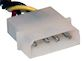

[#fans]
= Cooling Fans

The TV and the PC components inside a pin cab generate heat when running, so it's necessary to ventilate the cabinet to keep it cool.
Most pin cab builders accomplish this by cutting a couple of air vents in inconspicuous places on the cab and installing fans in the vents to move air through the cabinet.

Most cab builders use PC case fans for this.
They're a good fit because they're designed for exactly this type of use, and they're quiet and inexpensive.
They also fit well with our electrical setup, since they're built to work with a standard PC power supply, which we'll already have to run the PC components.

== How many fans?

It seems pretty standard to use two exhaust fans at the back of the main cabinet, using common PC case fans.
Most people also add one or two intake fans on the floor of the cabinet.
Passive intake openings (without additional fans) will also work, since the pressure from the exhaust fans will draw air in through the intakes anyway, but intake fans will help increase the air flow.

This design is driven more by the practicalities of available space than anything else.
The back wall the cabinet can easily fit a couple of PC case fans, and you can usually find room on the floor of the cabinet for at least one more, as an intake.
I haven't attempted any sort of quantitative analysis of how much cooling is needed, or how much cooling this fan arrangement provides, but I think it's pretty well proven in practice.
Lots of people have built cabs with roughly this setup, and I don't think I've ever seen reports on the forums of significant problems with heating.

== Fan placement

Our goal with the ventilation system is keep air moving throughout the entire cabinet.
We don't want any stagnant pockets of air that can sit there and gather heat; we want to continually discharge the hot air within the cab and replace it with fresh air from outside.

The best way to accomplish this is to put vent openings at each end of the cabinet, front and back, and drive air through the vents with fans at each opening.
The fans should be oriented so that the fan at one end is drawing air into the cabinet, and the fan at the other end is blowing air out of the cabinet.

One set of fans should be installed in the back wall the cabinet.
This is an obvious place in terms of cosmetics, since the back of the machine isn't normally visible.
It's also good in terms of air flow, since it's at one end of the cabinet in the long direction.
What's more, you can take advantage of the tilt of the playfield TV.
The TV is normally installed at an angle, rising towards the back.
Since hot air naturally rises, heated air will tend to move towards the raised back end of the playfield.
Take advantage of this natural convective flow by placing the rear vent(s) fairly high up on the back wall, and orienting the fans so that they blow air _out_ of the cabinet.

The other set of fans should be installed near the front of the cabinet.
You almost certainly won't want to cut fan vents in the front wall, for cosmetic reasons, so most people place the front fan or fans in the floor of the cabinet, close to the front of the cab.
To maximize air flow, orient the front fan(s) to draw air into the cabinet.
The positive pressure (into the cabinet) of the front fans will combine with the negative pressure (out of the cabinet) of the rear fans to maintain a constant flow of air front-to-back.

If you're planning to use coins with the coin chutes, remember to leave room at the front of the machine for a container to collect inserted coins.
There's a standard coin tray design used on the real machines, described in the "Cashbox" section in xref:cabHardware.adoc#cashbox[Cabinet Hardware Installation] .
That requires about 12" of clearance at the front.

Typical cabinet fan arrangement.
One or two fans are placed in the floor near the front of the cabinet, with the blades oriented to draw air into the cabinet.
Leave room for the coin collector box at the front (12" for a standard pinball cashbox).
Another set of fans is installed high up on the back wall, oriented to blow air out of the cabinet.
This will maintain air flow through the whole cabinet from front to back.

== Selecting fans

Most cab builders use 120mm PC case fans, similar to the type pictured at right.
The "120mm" refers to the diameter of the opening; 120mm is about 4¾ inches.

Case fans come in several sizes, from 70mm to upwards of 200mm.
Larger diameter fans are generally quieter, and gamers building high-end rigs can sometimes get so obsessed about it that fan size can seem like a fetish.
If you could fit a ceiling fan into a gaming rig, that would probably be a thing.
In my experience, though, you can get good results in a pin cab with ordinary 120mm fans.
Good ones can be pretty nearly silent, certainly quiet enough to be inaudible over the pinball action.

Like most PC components, case fans have a standardized form factor that allows any fan of a given standard size to fit any case designed for that size.
The fan housing includes screw holes at the four corners for attaching it to the PC case.
For our purposes, we can use wood screws through these holes to attach the fan to the cabinet wall or floor.

I'd recommend looking for a fan with a 3-or 4-pin Molex plug like those pictured below.
This is the most common design in current use, so it's the easiest to find and the most likely to be compatible with your motherboard.
These plugs are designed to fit into a mating connector on your motherboard.
Note that the 3-pin plugs are compatible with 4-pin motherboard connectors (no adapter needed), so you can buy a fan with either type if your motherboard has 4-pin connectors.

If your motherboard doesn't have a fan connector at all, you'll have to plug your fans directly into the ATX power supply.
For a fan with a 3- or 4-pin Molex fan plugs, you can do this with an adapter cable.

3- and 4-pin fan plugs, for connecting to your motherboard's "SYS FAN" or "SYSTEM FAN" headers.

I don't have any particular brand recommendations.
Fans are standardized enough to be interchangeable, so once you decided on a size, shop by price and/or user reviews.

== Cutting the openings

Once you decide where to mount your fans, you should simply cut circular openings in the cabinet wall and/or floor of the appropriate size.
If you're using 120mm fans, cut a circular opening 120mm in diameter for each fan.

You don't have to get the size of the opening exact, since the fan itself doesn't have to fit into the hole.
The opening is purely for the air vent.
The fan itself will simply mount flush against the inside surface of the cabinet wall or floor, covering the opening.

== Installing the fans

Before installing the fans, figure out which way it blows air so that you can install it with the air flowing in the right direction, into or out of the cabinet.

How do you tell the direction the fan goes?
Look for an arrow printed or stamped on the side of the housing: if you can find one, it should indicate the direction of air flow.
Failing that, you can simply connect the fan to power and check which way the air is blowing.

Once you determine which direction the fan goes, simply position it over the opening with the appropriate side facing outwards, according to whether you want it to serve as an intake fan or an exhaust fan.
Attach it to the cabinet wall or floor with four wood screws.
#4 wood screws should work well for most fans.

== Powering the fans

The next step is to connect the fans to power.

image::images/FanConnectorSmall.png[""]
If your fan has a 3-pin or 4-pin Molex connector (like the ones at right), look for a SYSTEM FAN or SYS FAN connector on your motherboard.
Most modern motherboards have one or two of these connectors.

Motherboard fan connector.
These are usually labeled SYS FAN or SYSTEM FAN.
Most modern motherboards have at least one fan connector, usually two.

You can safely plug a 3-pin fan plug into a 4-bin motherboard fan header.
The connectors have keying slots to make sure the pins line up correctly even if mixing 3- and 4-pin connectors.
As long as the fan plug physically fits the header, you can just plug it in directly without any sort of adapter.

If you have more fans than available headers on your motherboard, you can buy a splitter (also known as a "Y" cable) that lets you connect multiple fans to one motherboard header.

If your motherboard doesn't have any fan connectors (which is uncommon), you'll have to plug the fan directly into the power supply instead.
ATX power supplies don't typically include connectors for the small fan plugs, though, so you'll need an adapter cable.
You can find these at PC component retailers: search for "fan ATX adapter cable", and look for a cable with a male fan connector.

If your fan has a larger 4-pin connector like the one pictured at right, it's designed to plug directly into your ATX power supply rather than plugging into the motherboard.
You should find several mating connectors on the power cords coming out of your power supply.
You can simply plug the fan connector into the matching power supply connector.

== Extension cables

You'll probably need a longer cable than what's attached to the fan.
The fan's built-in cable will be designed for the relatively confined area of a normal PC case.
Full-size pin cabs are quite a lot larger, so the fans will probably be further away from the motherboard than in a regular PC.

You can buy a fan extension cable from a PC parts vendor if necessary.
Alternatively, if you don't mind doing some soldering, you can simply cut the existing fan wires in half and solder as much additional wire as you need between the two segments to extend the cable length.
If you do this, be sure to wrap the exposed solder joints with electrician's tape to insulate the wires.

== Backbox cooling

Some cab builders also put a fan or two in the backbox, to provide active ventilation for the TV there.
Others use passive ventilation - no fans, just vent holes in the rear wall the backbox.

If you're using an older TV with a display technology that generates significant heat, such as a plasma TV or an LCD TV with a fluorescent backlight, a fan is worthwhile.
Newer LCD panels with LED backlights run cool enough that a fan probably isn't necessary, as long as you provide good passive ventilation.

The standard cabinet design for most real machines in the 1980s and 90s used passive ventilation, typically with seven 1½" diameter holes running across the width of the back wall, located about 1" from the top and spaced 1" apart.

Typical backbox passive ventilation holes used in real pinballs from the 1980s and 90s.
Seven holes are drilled across the width of the backbox's rear wall.
Each hole is 1½" in diameter; holes are spaced 1" apart and 1" from the top.

Note that the standard backbox design allows for some air movement between the main cabinet and the backbox, via the large opening in the floor of the backbox.
That's why the ventilation holes are only needed at the top of the backbox: as warm air rises through the backbox and exits via the top vent holes, cooler air will be drawn in through the cabinet opening.
If you don't use the standard design with the opening between the backbox and main cabinet, you should add some air intake holes at the bottom of the backbox.

Is passive ventilation really enough for a TV?
Let's consider how much heat the traditional design was intended to handle in a real machine, and compare that to our needs for a virtual cab.
We'll use electrical power as a proxy for heat.
The real machines housed their main control electronics in the backbox, along with their score displays and about a dozen small incandescent bulbs for lighting the backglass artwork.
The total power usage of all of this equipment adds up to about 50W.
A 32" LED-backlit TV runs at about 55W.
TVs will probably get more efficient as time goes on, plus a backbox TV is usually a little smaller than that (which usually translates to less heat), so that 55W estimate is probably erring on the cautious side.

In other words, our TV should produce a pretty similar amount of heat to what was in a real machine, so if the passive cooling was good enough for the real thing, it should be adequate for a virtual cab as well.

On the other hand, it seems that we don't have a lot of headroom here: a TV will use up most of our estimated heat budget.
If you're also installing other backbox elements that generate significant heat - particularly a plasma DMD - active cooling might start looking like a good idea.

If you do decide to include a fan in the backbox, I can suggest two configurations:

* The first is to keep the passive vent holes near the top, in the same arrangement described above, and add the fan as an intake near the bottom of the backbox.
The positive pressure of the fan will combine with the natural chimney effect of rising warm air to maintain steady air flow.
* The second is to remove the passive vent holes and replace them with one or two openings for, say, 120mm PC case fans, also near the top of the machine.
Install these PC fans in exhaust mode, with the fans oriented to blow air outwards.
This will draw in air from the main cabinet and blow hot air out the top.

Be sure to consider space conflicts between the fans and the TV and other backbox elements.

== CPU fans

The CPU chip on your motherboard will probably require a separate fan mounted directly on top of the chip.
The CPU generates a great deal of heat in a very concentrated area, so this fan is needed to quickly move heat away from the surface of the chip.

The CPU fan shouldn't require any extra cabinet planning or cutting, since it mounts directly on top of the CPU chip itself.
It's basically part of the CPU/motherboard assembly.
If you buy your CPU in retail packaging, a matching fan is usually included, so the only thing you have to do is install it when you assemble the motherboard.
If you buy an unpackaged "OEM" CPU, you'll probably need to buy a fan separately.
You have to buy a fan designed for the particular chip type, because it has to match the CPU's size and shape.
You should be able to find suitable fans on Newegg.com or other sites that specialize in PC components.

