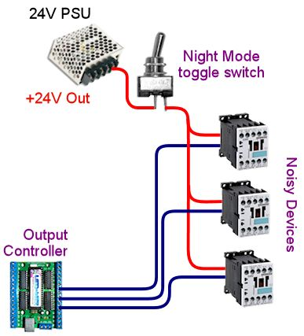

[#feedbackDevices]
= Feedback Devices Overview

Feedback is probably the most challenging thing to set up in a cab.
It requires coordination among several separate pieces of software and a specialized output controller device, all of which can be balky and hard to debug, and it also requires a certain amount of improvisation to create the various tactile and lighting effects.
But this is one of those difficult jobs that's worth the effort.
Pinball is an inherently physical, mechanical game that engages the sense of touch as much as sight and sound, so it really improves the simulation to bring some tactile elements into it.

Even though it's not exactly trivial to set up a good feedback effect system, it's not nearly as hard as it used to be.
There was a time when these systems were elaborate, ad hoc contraptions, every one unique.
That's no longer the case.
Those early ideas have been refined and improved to the point where there are solid, repeatable recipes that you can follow.
There's still plenty of room for creativity and experimentation, and you'll still have to do a little work figuring out what parts to buy, but I can give you detailed pointers on what you need and where to find it.

The next several chapters aim to make the big job of setting up a feedback system approachable, even if you're new to all of this.
We'll try to cover all the details: how to set up the PC software, what to buy for an output controller, how to install it, how to wire the devices to it, and how to build devices for all the popular effects.

== How feedback works

The whole idea of feedback devices is completely outside of our everyday experience as PC users, so if you're new to pin cabs, you probably have a lot of questions about how this works.
I'll try to answer the big ones here.

*How can a PC control all this stuff? Lights, motors, solenoids, etc?* Using a special hardware device called an "output controller".
You have to buy one of these (or build one, if you're using Pinscape) and connect it to your PC, usually with a USB cable.
The controller is the bridge between the PC and the physical devices.
The controller has wiring terminals, called "ports", where you connect the lights, motors, and solenoids.
Once the feedback devices are wired to the ports, and the output controller is connected to the PC, software on the PC can send commands to the output controller to turn the attached feedback devices on and off or to different intensity (brightness) levels.

You can find a list of the available output controller options, with a detailed comparison of features, in xref:ioControllers.adoc#ioControllers[I/O Controllers] .

*Does that output controller need device drivers?* Not in most cases, but it depends on which type of controller you're using.
The LedWiz, PacLed, and Pinscape don't require any device drivers; the SainSmart relay boards do.
If your device needs drivers, its documentation should cover that.

*How many different feedback devices can I have?* There's no upper limit as far as the PC is concerned, but each controller has its own limit for how many devices it can connect to.
A single LedWiz can control 32 devices.
Most of the SainSmart relay boards can handle 8 outputs.
The Pinscape expansion boards can handle 65 outputs in the typical setup, but you can add modules for up to 128 outputs if you need more (which you probably won't!).
You're not limited to a single controller, either, so if you need more ports, you can usually just add another controller.
all the controllers can coexist with one another, too, so you can mix and match them if you need different capabilities.

*How do games know about my shaker motor? My flippers? Etc?* That's handled in some software you run on the PC.
There's a suite of software that almost everyone uses to make this all work, and it has a setup procedure where you enter information about your feedback devices.
You tell the software if you have a shaker motor, flipper solenoids, flasher lights, etc, and you enter information on how they're wired to your output controller (more on this shortly).

*Do I have to program every game with my devices?* No.
The device setup information is shared by all games, so you only have to enter this information once.

*What if I install some devices but not others?* That's fine.
Games will use the devices you have, and won't care that others aren't present.

*Do I have to program feedback into every game?* No.
Most VP 10 tables are pre-programmed to use feedback and will activate it automatically if your cab supports it.
For VP 9, most games are pre-programmed to use feedback, but many require a couple of extra steps to enable it.
We'll cover that in xref:DOF.adoc#dofSetup[DOF Setup] .

== Software and controller setup

There's a chicken-and-egg problem when it comes to deciding whether to install the feedback software or the feedback hardware first.
To a certain extent, it doesn't really matter which one you work on first, because you really need both in place before either one will do anything.
Even so, I recommend starting with the software, specifically DOF.
That way, you'll be ready to do a practical test as soon as you get your first feedback device wired.

If you haven't already decided on an output controller, read xref:ioControllers.adoc#ioControllers[I/O Controllers] .
That chapter goes over the commercial and DIY options available for all the I/O controllers.
For our purposes here, focus on the output controllers, since that's what you need for feedback effects.

Once you've selected an output controller, proceed to the next chapter, xref:DOF.adoc#dofSetup[DOF Setup] .
That will help you set up the PC software that connects the pinball simulation to the hardware devices.

Next, set up your selected controller.
If you're using a Pinscape controller, you'll want to read through xref:psc.adoc#psc[The Pinscape Controller] for instructions on building the hardware and setting up the software.
If you've already done the basic setup work, you can skip straight to xref:outputs.adoc#outputs[Pinscape Feedback Outputs] .

If you're using one of the commercial options, it should come with instructions of its own.
But those are often pretty sketchy, and never contain any information specifically about pin cab use, so we've provided our own setup guides for the most popular options:

* xref:ledwiz.adoc#ledwizSetup[LedWiz Setup]
* xref:sainsmart.adoc#sainsmart[SainSmart Relay Board Setup]
* xref:psOutputsExp.adoc#psOutputsExp[Pinscape Outputs Setup (Expansion Boards)]
* xref:psOutputsStandalone.adoc#psOutputsStandalone[Pinscape Outputs Setup (Standalone KL25Z)]

If you're using one of those, we'll walk you through the process of installing the device, setting it up in Windows, and wiring output devices to it.
If you're using a different device, you'll need to rely on the manufacturer's instructions, but we do have some generic advice in xref:feedbackWiring.adoc#feedbackDeviceWiring[Feedback Device Wiring] .

== Types of feedback devices

Here's a quick overview of the most widely used feedback devices.
You certainly don't have to limit yourself to these ideas; the software and hardware let you hook up anything you can think of.
But the devices below have become a sort of standard set that the existing software will put to good use automatically, activating them in sync with relevant events during game play.

xref:buttonLamps.adoc#buttonLamps[Button Lamps]:: These make your various buttons light up under software control: flashing the Start button, turning on the Launch Ball button when a ball is in the chute.

xref:flashers.adoc#flashersAndStrobes[Flashers and Strobes]:: High-powered LEDs and lamps that create a light show much more impressive than a mere video display.

xref:beacons.adoc#beacons[Beacons]:: Rotating or flashing police car-type lights.
These are another part of the light show, and they're also found on so many real machines that they add a bit of authenticity to many games.

xref:lightStrips.adoc#lightStrips[Undercab Lighting]:: These are usually mounted on the bottom of the cabinet to create a pool-of-light effect around the machine.

xref:addressableLightStrips.adoc#addressableLightStrips[Addressable Light Strips]:: These let you create more complex lighting effects by manipulating individual lamps in an array, essentially like pixels in a display.

xref:contactors.adoc#contactors[Flippers, Bumpers, and Slingshots]:: Simulate the sound and palpable thud of the solenoids in a real pinball machine: flippers, bumpers, slingshots, kickers, etc.

xref:knockers.adoc#knockers[Replay Knockers]:: Reproduce the unique "knock" effect that real pinball machines make on replays and other game events.

xref:shakers.adoc#shakers[Shaker motors].
Create a dramatic tactile effect that makes the whole machine vibrate.
Some real machines have the exact type of device, so for those, a shaker re-creates the authentic playing experience.
It also makes a great added effect even for games that didn't originally have a shaker.

xref:gearMotors.adoc#gearMotors[Gear motors]:: These simulate the sound of the small motors found on many real machines to animate playfield elements.

xref:blowers.adoc#blowers[Fans]:: These re-create the backbox fans featured on a scant few games ( _Whirlwind_ , _Twister_ ), but like shaker motors, they make for a dramatic effect that enhances many games that never had fans in the real versions.

xref:chimes.adoc#chimes[Chimes and Bells]:: Re-create the mechanical scoring chimes used in nearly all machines from the 1960s and earlier.
These can make re-creations of older tables feel much more authentic.

== A ranking by importance

Here's my purely subjective, totally biased ranking of the relative importance of the devices.
The "importance" is on scale from 1 to 10.
Now, keep in mind that these aren't goodness ratings; they're just relative degrees of importance.
"1" isn't meant as a negative review score and certainly doesn't mean a device is _bad_ to have.
"1" just means that I rank that device as among the least important.
all the devices are nice to have if you can afford the cost, space, output ports, and time to set them up.

If you want a fully decked-out cabinet, these rankings shouldn't matter to you.
You should just install everything.
But if you're on a budget, or you want to start small and add more as you go, these might help you prioritize.
Again, though, these are just my opinions, and are not by any means the official consensus of the pin cab community.

[cols="1,1"]
|===
|Device|Importance

|Shaker Motor
|10

|Flipper Solenoids
|10

|Flashers
|9

|Fan
|9

|Bumpers
|8

|Slingshots
|8

|Chimes/Bells
|8

|Replay Knocker
|7

|Strobes
|5

|Addressable Light Strips
|5

|Button Lamps
|4

|Beacons
|4

|Undercab light strips
|3

|Gear Motor
|1

|===

A few of these deserve an explanation.

I rank the shaker motor and fan so highly for the same reason: they both add a dramatic, tactile effect that goes way beyond "video game".
Even after playing a lot of games on my cab, I still find these effects particularly engaging because they extend the game's reach beyond sight and sound.

Flasher lights are also at the very top of my list.
They add visual impact that video can't approach.
Real pinball machines have always used lighting to attract players and add to the playing experience, and this became even more important in the solid state era, where the software running the game could create complex lighting effects coordinated with the game action.
Simulations reproduce the original lights in video form, of course, but video just isn't bright enough to create the same dramatic effects as real flashers.
Flashers go a long way towards making it feel real.

The various solenoid effects - flippers, slingshots, bumpers - all rank near the top because these mechanisms are so central to real pinball.
If you think recorded audio does these justice, you probably haven't played a real pinball machine in a while.
The coils on the real machines are seriously strong.
You don't just hear them, you feel them; they give the whole machine a jolt every time they fire.
If you want to re-create the real playing experience, you really need to simulate that palpable jolt.
The flippers, bumpers, and slings are all important, but the flippers are easily the top choice if you have to pick only one type.
They're the ones you actually interact with constantly in every game, so the tactile feedback they provide is particularly noticeable and particularly enriching to the experience.

The replay knocker and chimes are close on the heels of the other solenoid devices for all the same reasons.
Recorded audio simply can't do these percussion instruments justice.
I personally find the knocker to be more important than its frequency of use would suggest.
Its importance comes from the fact that whenever it goes off, something great just happened in the game; the added sensory effect of that inimitable hammer strike really adds something.
And if you're a fan of older electromechanical games, the realism added by chimes will make a world of difference.

The button lamps come in relatively low on the list mostly because you could get almost the same effect by just wiring the buttons to be constantly on.
But it's still nicer to have them under software control, especially the Launch Ball button, which shows useful information on the game state in some games.

The gear motor ranks so low because it's just there for the sound effect, and this sound (unlike knockers and chimes) actually can be reproduced fairly well on the audio system.

== Night Mode

Many cab builders like to include a "night mode" switch, to disable the noisy tactile devices so that they can play during evening hours without disturbing housemates or neighbors.

If you're using a Pinscape controller, this is built into the software.
See xref:nightmode.adoc#nightmode[Pinscape Night Mode] for how to set it up.

Some of the plug-and-play feedback kits from Zeb's Boards also include this feature.

None of the commercial controllers have a native Night Mode feature, but you can set up your own DIY night mode switch pretty easily.
The basic idea is to add a switch into the power supply circuits that feed power to the noisy devices.
Set up the switch to control the "+" voltage going to the selected devices.
When you turn the switch off, it cuts power to the noisy devices.
For devices that don't need to be disabled at night, simply bypass the switch and wire them directly to the power supply.

If you need to include devices at different voltage levels in the night mode switching system, you'll need a "multi-pole" switch.
A multi-pole switch is essentially a bunch of separate switches built into a single housing and controlled by a single lever, so that they all switch on and off together.
You can use this to wire several voltages to the same switch, since the internal switches are all electrically independent even though they turn on and off together.
If you need to control two separate voltage supplies, you'd need a double-pole switch.
To control three voltages, you need a three-pole switch.
You can find multi-pole switches from suppliers like link:https://www.mouser.com/[mouser.com] .

