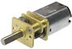

= Gear motors

A gear motor can be used in a virtual pin cab to re-create the noise made by the playfield motors found in many real pinball games. A gear motor is just a small DC motor with some step-down gears to reduce the shaft speed.

If you look at real machines through the 1980s and 90s, you'll find a surprisingly high percentage had some kind of moving playfield feature that was animated by a small motor: Thing in _The Addams Family_ , the cannon in _Terminator 2: Judgment Day_ , the magic trunk in _Theatre of Magic_ , the drawbridge in _Medieval Madness_ , and many more.

The point of adding a gear motor to a virtual cab is simply to replicate the noise those little motors make in the real games. The motor doesn't actually do any mechanical work, and you don't have to attach anything to its shaft; it's simply the noise of the motor itself that we're interested in. As with other noise-making devices, it's always more realistic to have something real making the noise than to rely on recorded audio played back through speakers.

I'd rank gear motors at the low end of the impact scale, as all they do is make a little noise - and that's actually a little artificial, since the motors in the real machines were almost never audible over the game's other sound effects. In virtual cab use, most people intentionally use motors that are louder than the real thing because they want to be able to hear the effect. So I'd give higher priority almost all of the other toys if you're economizing. But I'm in the minority on that; a lot of cab builders really like their gear motors. And if you're going for a decked-out cab with all the toys, by all means include a gear motor, as it does add a little something, even if the emphasis is on _little_ .

*Parts:* You just need the gear motor itself, and whatever fasteners you need to mount it somewhere inside the cabinet.

Gear motors are available in almost infinite varieties, but there are two types most commonly used in pin cabs.

The first is small, cheap DC gear motors made for robotics (Arduino) use. Search eBay for "small 6V gear motor" and you'll find numerous options. The type favored by pin cab builders has exposed gears like the one pictured at right. The exposed gears are desirable because they make for noisier operation, which is what we're after here.

The second common type in pin cabs is replacement motors for windshield wipers in cars. Like nearly all automotive products, these operate at 12V DC, so they can be conveniently powered from a computer ATX power supply. One model that many people use (I use it on my own cabinet) is a VW OEM replacement part; look for part number 251955119191955113A on eBay or an auto supply store site.

Which to choose?

* If you want something cheap, use a robotics motor. You can find dirt-cheap options on eBay for those (under $5).
* If you want something loud, use a robotics motor.
* If you want something more subtle, use a windshield wiper motor. They're designed to be quiet - passengers in the car don't want to hear them, after all. They produce a subtle, low frequency "hum" or "whir", vs the loud buzzy noise you'll get from a robotics motor.

I don't want to make "subtle" sound like a value judgment. This is a matter of taste, so there's no right or wrong here. The downside of making the motor quieter is that you can't hear it if you make it _too_ quiet, and there's no point in installing it if you can't hear it. And the windshield wiper motors can in fact be too quiet. You might not hear it at all lot of the time, and when you do, the effect will be very understated. I personally think the understated effect is a lot more realistic, as (like I said above) you rarely hear the motors operating in the real machines. But that defeats the purpose of including it at all for a lot of people, so if you think you'll be disappointed with too much subtlety, you might prefer something noisy enough that you're sure to hear it.

The original gear motors in the real pinball machines that we're emulating were typically somewhere in between the robotics motors and windshield wiper motors in size, but more at the wiper-motor end of the spectrum. Most of the ones I've encountered in person are pretty much inaudible - you tend to hear the sound effects that the game plays when the motor is operating, not the motor. So in that respect, I think it's more authentic to use one of the quieter wiper motors.

*Positioning:* It's worth giving a little thought to where the gear motor will be mounted, since human hearing is pretty good at locating sounds in space. You want the motor noise to sound like it's coming from the playfield element it's simulating.

My recommendation is to mount the motor under the playfield TV, centered side-to-side and about 2/3 of the way back from the front of the TV. In the real games we're simulating, the motorized feature is almost always some major centerpiece element, and those tend to be towards the rear of the playfield. The rear center of the TV is a pretty good "average" of the locations where the elements we're simulating would appear in the real thing, so it will make the sound seem to come from about the right place most of the time.

There's no standard way to mount these motors. Just improvise something using fasteners from a home supply store. U-bolts are often helpful here.

*Wiring:* Make sure you're using a suitable supply voltage for your motor. An automotive windshield wiper motor should run on 12V; the eBay robotics motors might specify anything from 3V to 12V, depending on what you buy. DC motors will usually run happily on voltages lower than their rated voltage, with a corresponding reduction in speed. You just want to make sure the voltage is high enough to make the motor turn at all, since a completely stalled motor might overheat or overload your power supply. So if you find a nominally 6V robotics motor, it's probably safe to operate it on 5V.

Follow the generic wiring plan in xref:feedbackWiring.adoc#feedbackDeviceWiring[Feedback Device Wiring] :

* Connect a diode between the (+) and (-) leads of the motor, as described in xref:diodes.adoc#coilDiodes[Coil Diodes] . Diodes are always required for motors because of the magnetic fields created by the motor's operation.
* Connect the (+) terminal of the motor to the positive voltage from your power supply
* Connect the (-) terminal of the motor to an available output port on your output controller

If the motor's terminals aren't labeled (+) and (-), it probably doesn't matter which order the wires are connected. Most DC motors will simply run backwards if the polarity of the power connection is reversed. Gear motors sometimes have a preferred direction because of the gearing, though, so do check markings for a preferred polarity. If the motor terminals _aren't_ marked, you might want to try both polarities to see if one produces a better sound effect, since the gears might sound rather different running in each direction.

*Electrical interference:* Be sure to use a diode with the motor. If you still have electrical interference problems with the motor (for example, USB devices randomly disconnect, or you see random keyboard input on the PC), you might need to add more filtering. The two-inductor filter described for the shaker should work equally well for a gear motor. See "Electrical Interference" in xref:shakers.adoc#shakerElectricalInterference[Shaker motors] for the wiring and parts details.

*DOF setup:* In the link:https://configtool.vpuniverse.com/[DOF Config Tool] , go to your Port Assignments page. Find the output controller port number where you wired the motor. Assign this to "Gear" (which is short for "Gear motor").

