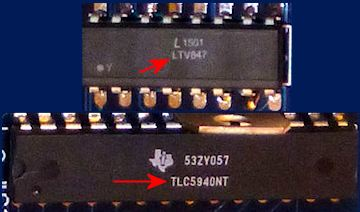
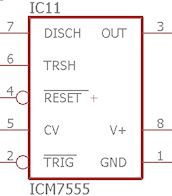
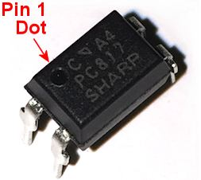
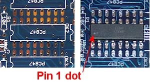

= IC Chips

Integrated circuit (IC) chips are ubiquitous in modern electronics, and you'll find several of them on the Pinscape boards. An IC is essentially a miniature circuit board consisting of a collection of the more basic components (resistors, capacitors, and transistors) that we use elsewhere in our own circuit boards. There are ICs for thousands of different functions and applications, ranging from simple things like resistor arrays to complex computing tasks like running Windows.

We'll start with some general information that's common to most IC chips, then look at each of the specific chip types used in the Pinscape boards. If you're working on building the boards and you're trying to figure out how to install a particular chip, look for the section on the chip in question later in the chapter.

== Static electricity warning

Almost all IC chips are sensitive to static electricity. Refer to xref:staticSafety.adoc[Static Electricity Precautions] for tips on handling static-sensitive parts.

== Identifying a chip

Most chips can be identified pretty easily by the number printed on the top of the case.

Each chip pictured above has two lines of random-looking alphanumeric strings. This is pretty typical, but it's not any kind of standard; some chips might have more or less printing, which might be arranged in other formats. Whatever the format, the chip name should always be in there somewhere. That should match the name that's used in the schematic and printed on the board. Anything else is usually opaque manufacturing codes not meant for our eyes, such as lot numbers and date codes. How do you pick out the chip name from the other stuff? You pretty much have to figure it from context, by looking for a chip name you recognize. Somewhere in there, you should find the name of the chip as shown in the schematic and on the PCB silkscreen.

Note that the name printed on the chip sometimes has slight variations from the name used in the schematics. In particular, there might be some extra prefix or suffix characters. These usually denote variations of the chip, or different manufacturers, which have already been accounted for in the parts list. Even so, if you do find such a discrepancy, it might be worth double-checking the part list to make sure you haven't accidentally swapped two parts that have similar names.

== Chip orientation

Orienting a chip properly before installing it is critical. In the best case, a chip that's installed in the wrong orientation simply won't work, and in the worst case, the error might destroy the backwards chip, or even other components, when you turn on the power. So always make sure you have the right orientation before soldering anything.

Most of the chips used in the Pinscape boards are "DIP" (dual in-line package) chips with two rows of pins sticking out. It's easy to tell which side is the top and which is the bottom: the pointy ends of the pin point down, since they go through matching holes in the circuit board.

What's not as obvious is the proper rotation. DIP chips are rotationally symmetrical: they'll fit the space on the board if you rotate them 180° from their proper orientation. So you have to be careful to get that right.

When you look at the Pinscape boards, you'll see little outlines for all of the chips printed on the top of the board. Most of the IC chip outlines look roughly like this:

The first thing to note is the printing inside the outline, in this case "PC847". That's the name of the chip to install here. When you're about to plop a chip into position, it's always a good idea to double-check that the name printed on the chip matches the name printed on the board. Different chips can sometimes share the same footprint, so it's good to make the extra check.

Don't be distracted by the fact that the writing is upside-down. The text printed on the board is almost all oriented the same way with respect to the overall board, for the readability's sake. If the text were printed at all sorts of different angles across the board, it could make some of the legends hard to read or even ambiguous (e.g., is that an "N6S" or an "S9N"?). The trade-off is that this often makes the text appear upside-down or sideways with respect to the component it refers to, as in this case. The important thing to remember is to always pay attention to the outline, not the text, to determine which way a component goes.

Which brings us to the second big feature in the photo: the notch. That's the most important feature of the outline, because it's your key to orienting the chip properly.

Whenever you see a notch in a chip outline like this, turn the board so that the notch is at the left like in the photo. In that orientation, pin 1 is the bottom left pin, just below the notch.

Now you know where pin 1 goes on the board, so all you have to do is match that to pin 1 on the chip.

Some chips have the same type of half-circle notch that's printed on the circuit boards. The notch in the chip isn't usually printed in ink, though - it's usually a slight indentation or depression in the plastic case. When you find a notch on the chip, orienting it to the diagram on the board is easy: just line up the notch on the chip with the notch printed on the board.

Not all chips use the notch, though. The other common convention is a little circular "dot" in one corner. The dot is sometimes marked in ink, and other times it's just a subtle indentation in the chip casing. When there's a dot, it's in the corner nearest to pin 1.

Common orientation markers on IC cases. Some ICs have indented notches on one side; simply line this up with the notch in the printed outline on the circuit board. Other chips use a "dot" at one corner of the chip to mark the location of pin 1. The dot might be printed in white ink, or might be indented in the plastic.

If you don't see the notch or dot, it might just be a really subtle one that's hard to spot. Look at the chip under a strong light, and hold it at different angles. The indentation for the notch or dot is sometimes very slight.

Once you find the notch or dot, it's just a matter of lining up pin 1 on the chip with pin 1 on the board.

Examples of how to match the chip marking with the board marking to find the proper orientation. Top: the chip has a notch in its case like the one printed on the board, so simply line up the notch on the chip with the one on the board. Bottom: The chip has a dot near one corner. Orient the chip so that the dot lines up under the notch printed on the board.

== Sockets

There are two main ways to install a DIP-type chip on the circuit board: solder it directly to the board, or use a socket.

A socket is a receptacle that matches the exact footprint of an IC chip. It has pins coming out the bottom, matching the pins on the chip. You fit the socket's pins through the holes in the board intended for the chip, and solder the socket pins to the board. The top of the socket has matching openings for the chip's pins. Once the socket is soldered to the board, you just plug the chip into the socket. The pin openings in the socket are spring-loaded, so they hold the chip in place without having to solder the chip.

IC sockets: top view of a 16-pin socket; side view of 16-pin socket; top view of 28-pin socket. Note the notch at the left side in the top views: this has the same purpose as the notch printed on the circuit board outline of the chip, to serve as an orientation guide. Line up the notch on the socket with the notch printed on the board when installing the sockets.

The main advantage of using a socket is that it makes it practically effortless to remove and replace a chip. That's a great time-saver if you find that one of your chips is defective, or if it ever fails later, or if you accidentally install it backwards on the first try. In contrast, it's extremely difficult to remove a chip that's been soldered directly to the board. It only takes a tiny bit of solder on each pin to make it stick, and it's next to impossible to get all of the solder off all of the pins on a large chip.

I recommend using sockets for all of the large chips, but it does slightly increase the cost, so some people prefer to solder the chips directly.

If you use sockets, note that each socket has a notch cut into the plastic. This is meant to mimic the notch in the chip outline printed on the circuit board, to serve as the orientation marker. You should be sure to line up the notch in the socket with the notch printed on the circuit board when you install each socket. That way, you can use the notch in the socket as a proxy for the notch in the circuit board chip outline when plugging in the chip - which is important because the printed outline will probably be hidden behind the socket once the socket is in place.

== How to install a chip on a circuit board

If you're using a socket, follow the procedure we're about to describe for soldering the chip, and just substitute the socket for the chip in all of the steps. After the socket is installed, plug the chip into the socket, taking care to orient the chip properly as described above.

To solder a chip (or socket) to the board, first find the outline printed on the board for the chip. Most IC chip outlines look roughly like this:

Check that the chip type printed on the board matches the chip you're getting ready to install.

Line up the chip's or socket's pins with the holes along the edges of the outline. The number of holes should match the number of pins. Carefully insert the pins through the holes.

Make sure the chip is oriented properly, as described above. This is an excellent time for the "measure twice, cut once" rule - check and double-check that you have the chip turned the right way.

Now insert the pins into the holes.

With DIP chips (the ones with two rows of pins), the pins are usually angled out just a little wider than the holes, so you usually have to bend one row of pins inward very slightly to fit them through the holes. To make this easier, I like to start by inserting one row of pins first. Then you can apply a little pressure to the whole chip to uniformly bend the now-seated pins enough to fit the opposite row through its holes. (Sockets don't usually require this kind of maneuvering, since their pins stick straight down. It's another way sockets make things a little easier.)

Inspect the pins from the top to make sure they all got seated properly. It's easy for one or two pins to miss their holes and go sideways when you seat the rest. If this happens, you might be able to nudge the missing pins into their holes if they're not too far askew, but don't force anything. The pins are delicate and don't stand up to much bending and re-bending. If necessary, take the chip back out, carefully (very carefully) straighten any pins that went sideways, and try again.

Once you're satisfied that all of the pins made it into their respective holes in the board, hold the pin in place from the top and flip the board over. Verify that all of the pins really made it through the openings, as seen from the bottom of the board.

If everything looks good, it's time to solder the pins in place. Keep the board flipped over and solder the pins from the bottom.

Solder a pin at one corner first (any corner will do). You should hold the chip firmly in place against the board from the other side during this step to make sure that gravity isn't pulling it a little away from the board.

Check _again_ that the pins are still all in place. They can sometimes work loose during all of this board flipping and soldering.

If everything is still in place, solder the pin at the diagonally opposite corner next, still holding the chip pressed firmly against the board from the other side.

Do one more check that the pins are all still where they should be. This is basically the point of no return - it's not too difficult to get the chip free if necessary with only the two pins soldered, but it'll be practically impossible once you solder more pins. So it's worth making sure that everything is good before going on.

At this point, the two attached pins at the diagonal corners should be enough to secure the chip mechanically, so you shouldn't have to worry about anything coming loose from this point forward. You can just work through the rest of the pins one at a time to solder each one in place.

== Pin numbering

All of the pins on a chip are numbered, for the purposes of identifying them in the schematic.

The pin numbers are irrelevant when you're installing a chip, since all you care about is getting the orientation right. However, you might find a need to cross-reference the individual pin connections in the schematic with the physical boards if you ever have a problem that requires debugging with a voltmeter. If you ever have a problem with the boards, one of the first debugging tasks will likely to be check the continuity between various points on the board, to make sure that pins that ought to be connected actually are connected.

Fortunately, pin numbering on the physical chips is pretty straightforward, and better yet, it's highly consistent across different kinds of chips.

The Pinscape boards mostly use DIP chips - the type with two rows of pins on opposing sides of the plastic case. All DIPs follow these rules:

* Pin 1 is at the lower left (with the chip properly oriented)
* Pin numbers increase *counter-clockwise* around the chip

== Chip symbols on schematics

The schematic symbols for chips can vary a little bit. There are a few types of chips that have special symbols because of the function they perform. Most chips, however, are so specialized that there's no special symbol for them, so they're shown on schematics quite generically, as simple rectangles with lines sticking out to represent the pin connections. For example, here's the symbol for a TLC5940, which is the large PWM controller chip used on the Pinscape expansion boards for feedback device outputs:

image::images/SchematicTLC5940NT.png[""]

The rectangle represents the TLC5940 package, and the little lines sticking out from the sides represent the pins. Note how every line has a number. Those are the pin numbers, and they correspond to the physical pin numbers we described above. You can use those numbers to match up every pin on the schematic with the corresponding physical pin on the board, which is important when you're trying to debug a problem.

If you look closely, though, you'll see that the numbers shown on the schematic aren't in the same order as the physical pins. That's in keeping with the whole idea of a "schematic" - an abstract representation that only keeps the essential information. Even so, it might seem like it would be simpler if they'd use the same pin ordering, but there's a reason they don't. To understand the reasoning, look at the labels inside the TLC5940 box. Those are the "names" of the pins, which are just arbitrary mnemonics that are there to help a circuit designer remember the function of each pin without having to memorize all the numbers or constantly refer to the data sheet. Notice how the whole left side is OUT0, OUT1, OUT2, etc. Those pins are all of the PWM outputs. On the physical chip, they're not all together, but they're grouped on the schematic. That keeps the schematic drawing a little neater.

In any case, the important thing to take away from this is that you shouldn't pay any particular attention to the order of the pins shown on the schematic; just pay attention to the numbers. Every pin's number is explicitly shown, so you don't have to remember a counter-clockwise or anything else; you just look at the numbers printed there.

In the sections below on the specific chips making up the Pinscape boards, we'll show each chip's exact symbol so that you can more easily recognize it on the schematics.

== Selecting chips

When you're ordering parts, the basic rule for IC chips is that you should exactly match the chip name shown on the parts list.

This doesn't mean you have to get the exact Mouser part number listed. That's different from the chip name; the Mouser part number is Mouser's catalog ID, which encodes the manufacturer as well as the chip type. Many chips are only made by a single manufacturer, so in those cases they amount to the same thing. However, some chips are generic, and interchangeable versions are made by several different manufacturers. In these cases, the different manufacturers will all use the same chip name, because that describes the specific function and electrical characteristics of the chip, but the different version will have different Mouser catalog numbers. So the thing to pay attention to is the chip name.

If you find parts that have similar but not identical chip names, it's better to err on the side of caution and assume they're different. There are some very different chips with confusingly similar names out there. If you think you found a match with a slightly different name, the only way to be sure is to carefully compare the data sheets for the two parts and make sure they really are functionally equivalent.

== Chips on the Pinscape boards

=== 555/7555 timer

The 555 is a venerable and widely-used timer chip. The Pinscape boards use it (or more specifically, a variant called the 7555) to implement the "timer-protected outputs" for the replay knocker and chime outputs.

The 7555 is a more modern CMOS version of the original 555. The Pinscape boards use the 7555 because it integrates better with logic circuitry than the regular 555.

When buying parts, be sure to buy the 7555 when the parts list calls for it, not the original 555 or other variant. The variants all come in the same package and have the same pin layout, so they'll physically fit the sockets, but there are some differences in their electronic properties.

On a schematic, a 7555 is depicted with the generic IC box diagram, with eight pins. "ICM7555" is printed near the box to identify the chip type. The component name for a 7555 is of the form IC _n_ .

The physical chip is an 8-pin DIP. My samples have an easily visible notch for orientation. To install on the circuit board, just line up the notch on the chip with the notch in the chip outline printed on the circuit board.

7555: chip package, circuit board outline, and chip installed in circuit board. Line up the notch on the chip with the notch printed on the circuit board outline to orient the chip properly. The writing on my sample chip is so faint that you can barely see it in the left photo, and can't see it at all in the right photo, but you can see it on the actual chip with the right lighting.

[#ld1117av33-chip]
=== LD1117AV33 3.3V regulator

The Pinscape boards use a type of chip known as a voltage regulator to supply 3.3V to some of the logic chips on the boards. The part name for the 3.3V regulator we use is LD1117AV33. Similar regulators are available for numerous other voltages, but the Pinscape boards currently only use the one type.

When buying parts, don't try to "fuzzy match" the name of this chip with similar-looking parts, because suffix in this case ("AV33") is highly significant: it indicates the regulated voltage. That's a critical element of the circuit design. Similarly named chips with slightly different suffixes regulate to different voltages, so they won't work as substitutes.

These chips don't come in the usual DIP form factor. Instead, they use a type of package more commonly used for transistors, known as a TO-220. Here's what it looks like:

Front and back view of LD1117. Note that the part name is printed on the front of the plastic case to help identify the part.

Note that the TO-220 package type is widely used for other, completely different components, particular MOSFETs and power transistors. Anything in a TO-220 looks just like this, so you can't identify an LD1117 by the shape of the case alone. For positive ID, check the markings on the case. For this part, the chip name (LD1117AV33) should be printed on the front of the plastic case.

On the schematic, these chips are shown with the standard generic IC box diagram, with three pins. However, unlike most IC box symbols, these don't show any pin numbers. They only show mnemonic labels for the pins. The reason is that there aren't any standard pin numbering conventions for the TO-220 package used for this chip, so pin numbers would only be confusing. This is a case where you have to look at the data sheet to figure out the correspondence between the pins on the schematic and the physical pins on the device. But we'll save you the trouble:

image::images/SchematicLD1117.png[""]

Above left: the LD1117 voltage regulator symbol on a schematic. Above right: diagram of the package showing how the physical pins relate to the pins on the schematic symbol. The package diagram shows the "front" of the package, with the black plastic case facing the viewer. The back of the chip is the big metal fin, visible in the diagram sticking out from the top.

The component ID shown on the schematic for these chips uses the typical form for IC chips, IC _n_ .

On the circuit board, the LD1117 doesn't use the standard notched-rectangle outline, in keeping with its unusual packaging. Instead, it shows an outline with a heavy bar on one side, which represents the big metal fin on the back of the chip package:

To install the chip in the circuit board, orient it so that the metal fin on the back of the chip lines up with the heavy bar printed on the PCB outline. The heavy bar in the outline represents the fin, so you just need to make sure the actual fin is oriented on the side indicated on the outline.

When you install the chip in the board, note that the plastic package won't quite sit flush against the board. The legs have kinks near the tops (the case side) that act as stops, which will keep the plastic case part a couple of millimeters above the board surface. That's perfectly normal; don't try to force the kinks through the holes. The extra distance from the board is there by design, to help the fin radiate heat more efficiently. You can be sure that any part you see with a big metal fin like this is something that gets hot in normal use, and the fin is there as a heat sink.

To install this chip, insert it through the holes, checking that the fin is oriented to match the heavy bar in the outline printed on the board. Flip the board over (taking care to hold the chip in place so that it doesn't fall out), and solder the three pins to the pads from the bottom of the board. The leads on these chips are quite long and will stick out about a centimeter from the back of the board when you're done, so you should trim the excess with wire cutters after the chip is in place. Trim the leads to be roughly flush with the top of the solder ball.

=== ULN2064B Darlington transistor array

The ULN2064B is an array of four Darlington transistors. Darlingtons are high-gain transistors that can be used for amplifiers, or in our case, switching medium-power loads from logic circuits. These chips can handle loads up to 1.5A on each output. The Pinscape main boards use these for the flasher LED outputs, because they have plenty of power capacity for large LEDs and are physically compact.

This chip uses the standard generic IC box symbol on schematics, with 16 numbered pins. The component name shown on the schematic uses the form IC _n_ .

The physical chip is a standard 16-pin DIP.

ULN2065B 16-pin DIP package. The half-circle notch (visible at the left edge of the package) serves as the orientation marker when installing. Line up the notch on the chip with the notch in the chip outline printed on the board. Note that this is the ULN2065B, which can be substituted for ULN2064B.

On the circuit board, the location for this chip is shown with the usual chip outline, with "ULN2064BN" printed in the outline. Line up the notch on the chip with the notch in the printed outline to orient the chip properly.

*Substitutions:* The ULN2065B can be substituted for the ULN2064B. The two are almost identical chips, the only difference being that the 2065 is rated for higher maximum voltage. In other words, the 2065 is just a slightly tougher version of the same chip.

[#ic-PC817]
=== PC817 optocoupler

The PC817 is an optocoupler, which is a device that connects two circuits via light signals rather than electronic signals. The light signals are transmitted by a tiny IR LED inside the chip, and are received by an adjacent phototransistor. (All of the light transmission happens inside the chip, so you won't see light coming out of it, and you don't have to worry about interference from ambient light. An optocoupler isn't the same as an "opto interruptor", which is a kind of switch that's controlled by blocking and unblocking a light beam, like an electric eye. An optocoupler doesn't have an exposed beam that you can block.)

This might sound like a lot of trouble - turning electrons into photons, and then turning the photons back into electronics. But it serves a very useful purpose: it lets the two circuits transfer signals without any electrical contact. That has many applications, but the one we use it for in the Pinscape boards is to create a sort of safety barrier between logic circuits and power circuits, to help protect the logic circuits from the higher voltages and currents used in the power circuits.

On a schematic, the PC817 looks a little different from other ICs, because it doesn't use quite the same generic IC box. Optocouplers are important enough in electrical engineering practice that they have their own special symbol:

If you ignore the interior of the box, you'll see that this actually does still follow the same pattern as the generic IC box: it's still a box with lines attached representing the IC pins, and the pins are numbered as usual. What's different is that the interior of the box shows symbols instead of mnemonic labels for the pins. To an engineer who knows the language, the symbols are the equivalent to the mnemonics used on other chips, in that they indicate the functions of the pins. The symbol on the left side of the box represents the phototransistor that receives the optical signal; the symbol on the right represents the LED that transmits the signal; and the two diagonal arrows in the middle represent the photons carrying the signal from the one side to the other.

You might also notice that this chip's component ID is "OK _n_ " instead of the usual "IC _n_ ". This is an EAGLE-ism; "OK" probably stands for "Opto-Koupler", and I'm not sure why they chose "OK" rather than "OC", but at a guess it's to avoid confusion with "C" for "capacitor". At any rate, just be aware that the schematics and parts lists use this unusual "OK _n_ " designation for these chips, even though they're like any other ICs for all practical purposes.

The physical chip is a 4-pin DIP:

The orientation marker on these chips is usually the "pin 1" dot, in the corner nearest pin #1. The chip in the photo above uses the indentation form of the dot, but yours might have a printed white dot instead. As always, the dot can be such a subtle indentation or faint ink mark that it's tough to see without a strong light and/or magnifying glass.

This chip's proportions are unusual for a DIP, which can be confusing. You get accustomed to all the other DIP chips being wider than they are tall. So it can be tempting to think that this one needs to be rotated into "landscape mode", with the pins at the left and right sides. That's even the way the printing on the chip is aligned, because of the limited space. But consistency is the key here: this is still a DIP, so apply the standard DIP rules. When properly oriented, the pins go along the top and bottom edges, and the pin 1 dot goes at the lower left corner.

Orienting the PC817. Even though its "aspect ratio" is unusual for a DIP, use the same orientation rules you'd use for any other DIP chip, placing the pins along the top and bottom edges and the "pin 1" dot at lower left.

On the circuit board, the slot for a PC817 is marked with the standard IC outline, with the notch on the left side and "PC817" printed inside the outline to indicate which part to install.

Install the chip like any other DIP. Hold the board so that the notch in the printed outline is at the left side, and orient the chip with the pin 1 dot at lower left.

*Substitutions:* The LTV817 is equivalent to PC817.

=== PC847 quad optocoupler

The PC847 is a chip that consists of four PC817 units packaged into a single IC. There's really no difference at all electrically or functionally between one PC847 and four PC817 chips, but the quad package is a little more convenient to work with when multiple optocouplers are grouped in the same area of the board, simply because it reduces the the number of parts you have to solder.

On a schematic, a PC847 is even represented just like it's four separate PC817 chips. Which it really is, functionally speaking, and schematics are all about function.

The schematic symbol for a PC847 chip consists of four separate PC817 symbols. The only clue that they're the same physical chip is the component ID: look for the A-B-C-D suffix, which tells you the sub-unit within the chip.

There are a couple of things to notice. The first is that the individual units all have the same "OK _n_ " component ID, but each one also has a suffix - A, B, C, D. The suffix tells you which sub-unit we're talking about. The common OK _n_ prefix is how we know that these units are all part of the same physical PC847 chip. In my own schematics, I also make a point of grouping the sub-units together on the page, so that you don't have to go hunting around to find all of them, but you might encounter cases in other people's schematics where the sub-units aren't grouped.

The second thing to notice is the pin numbering. Note how the pin numbers aren't grouped contiguously on each sub-unit. For example, unit A uses pins 1, 2, 15, and 16. If you scan over all four sub-units, you'll see that all 16 pins are accounted for (and each appears exactly once).

The chip is packaged as a standard 16-pin DIP:

LTV847 (equivalent of PC847). These chips use a (faintly) printed dot to mark the location of pin 1.

On the circuit board, a PC847 is marked with the standard IC chip notched outline, with "PC847" printed inside to identify the part to install there.

Installing a PC847 is just like any other DIP. Orient the board so that the notch in the printed outline of the chip is at the left side, then orient the chip with the pin 1 dot at the lower left corner.

*Substitutions:* The LTV847 is equivalent to PC847.

=== TLC5940NT PWM controller

The TLC5940NT is a PWM (pulse-width modulation) controller chip. This means that it generates a series of very fast and precisely timed on/off pulses, under the control of a computer or microcontroller. PWM has many uses, but for our purposes, it's a way to control the brightness of a lighting device, the speed of a motor, or the force of a solenoid. The Pinscape expansion boards use these chips to implement the output ports on the main board and the power board.

The TLC5940 is a proprietary chip from Texas Instruments, and TI no longer manufactures the DIP version used on the Pinscape boards. They do still manufacture the same chip in "surface mount" packages, but those aren't nearly as hobbyist-friendly as DIPs, so the Pinscape boards still use the DIP version for ease of assembly. Fortunately, the DIP version has always been extremely popular with robotics and Arduino hobbyists, and perhaps as a result the supply continues to be plentiful. That continues to surprise me, since TI hasn't made the DIP version since about 2014, but some people conjecture that the continuing supply is coming from gray-market versions manufactured by (presumably unauthorized) third-party factories. Whatever the reason for this good luck, the Pinscape boards will continue to use the DIP version as long as it remains easy to find. If that ever changes, I'll update the boards designs to use one of TI's newer PWM chips instead. That will make assembly a little trickier, because those are all surface-mount parts, but on the plus side, TI's newer PWM chips have much nicer designs than the rather aged TLC5940.

On a schematic, the TLC5940NT appears as the standard generic IC box, with 28 numbered pins.

image::images/SchematicTLC5940NT.png[""]

The physical chip is a 28-pin DIP.

Note that the sample pictured above has both the half-circle notch at the left side and a "pin 1" dot, both as slight indentations in the plastic. You might also notice larger, shallower circular depressions centered vertically at either end of the chip. Ignore these; I think those are just artifacts from the molding process that carry no meaning. Just pay attention to the standard notch and dot markers.

On the circuit board, the TLC5940NT is marked with the standard notched outline for an IC, with "TLC5940NT" printed within. To install the chip, orient the board so that the notch in the printed outline is at the left side, and then orient the chip so that pin 1 is at lower left.

=== 74HC595 shift register

A shift register is a logic chip that lets a microcontroller set the on/off voltage states for a number of pins on the chip. The Pinscape chime boards use these chips to control the outputs on the chime board.

On a schematic, the 74HC595 is drawn with the usual IC box:

There is one unusual feature of this symbol that you might not even notice if you saw it as part of a larger schematic, but it stands out when we isolate the symbol like this. The unusual part is that separate-looking bit at top. Above the chip box, the symbol shows two of the IC's pins that _aren't_ included in the box. The way you can tell that those disembodied pins are part of the same chip is the "IC8P" marking. The "P" suffix tells you that these pins constitute a part of "IC8"; the "P" is for "power", as these are the power and ground connections for the chip.

This use of separated schematic elements is somewhat reminiscent of the PC847 that we saw earlier, where the individual optocoupler units within the chip are drawn as separate boxes. In this case, the pins are separated simply to reduce clutter within the box. The symbol's designer thought that there were enough pins already and wanted to get a few out of the way. The power and ground pins were elected because they're givens in any chip. Some engineers just short-hand them away entirely, leaving them off the schematics and letting the reader assume they're connected in the standard way. I prefer showing them explicitly, which in this case that means adding this little islands of pins separated from the chip. I consider this style rather obfuscatory, and fortunately this is the only chip in the Pinscape boards that uses it.

The physical chip is a 16-pin DIP.

My samples have an indented notch on one side of the case to indicate pin 1: as always, if you orient the chip so that the notch is at the left side, pin 1 is the bottom left pin.. As always, this can vary by lot, so yours might have a painted or indented "pin 1 dot" instead.

On the circuit board, this chip uses the standard IC notched outline, with the part name (74HC595) printed within to identify the component to be installed there. To install, orient the board so that the notch in the printed outline is to the left, then orient the chip so that pin 1 is at the lower left.

