= Inside the Cabinet

The modern virtual pin cab can be pretty complex on the inside. A decked-out cab can actually have more equipment packed into it than a real pinball machine, which is kind of perverse given that this is all about software simulation. But it makes sense when you consider that we're not just building a computer; we're building a computer/pinball hybrid. The computer part by itself has more to it than most desktop systems, because of the extra monitors and the specialized input/output peripherals. And the pinball part includes a pretty large subset of a real machine.

With so much to install, making everything fit can be a challenging 3D puzzle. I'd like to be able to present a simple, one-size-fits-all layout here, but that's not really possible. Pin cabs are too individualized. But I can at least offer one possible solution. In this section, we'll walk through a model pin cab that includes just about everything I can think of, and look at where each major element goes in this setup. The model takes into account the space constraints, and it also follows my philosophy of serviceability, meaning that it's designed so that everything can be accessed fairly easily for repairs and upgrades, even after the machine is fully built.

The arrangement described in this section is based on my own cab, so I consider many of the design decisions to be tried and true. It's not an exact replica, though. I've made some revisions in an attempt to improve things that weren't ideal in my original design. I also made room for additional equipment that's not in my build. My cab is pretty decked out, but for the purposes of this section, I've tried to imagine an "ultimate" cab with all of the toys.

This is, of course, not the only possible solution to the question of how to arrange things, and I'm sure it's far from the best solution. Some of it might not work at all for your setup, given that you might have completely different constraints from your PC packaging or TV size. So I'll try to explain the rationale behind each element's placement, so that even if you can't use the exact layout as presented, you can at least gain some insight from it to use in formulating your own layout.

== Playfield, apron, and flashers

These elements (or some subset of them) form the top layer in the main cabinet.

The basic arrangement is pretty straightforward, but the details can be surprisingly hairy. First, there's the placement of the TV: do you place it flush with the top of the cab, or recessed like a real playfield? How far in? At what angle? All the way at the front, or set back to make room for the plunger? These are all among the most frequent questions that new cab builders ask. You can see from the diagram what I prefer, but this is a matter of aesthetics, and there are other schools of thought. Second, once you've decided upon the desired look, you still have to implement it physically. That's trickier than it might look, especially if you want to fulfill my admonition to make the machine serviceable ( xref:serviceability.adoc[Serviceable Design] ). Serviceability requires that the TV be easily removed. You can probably guess I'm not in favor of just nailing it in there and calling it done.

There's enough to this subject that we've given it its own chapter, xref:playfieldMounting.adoc[Playfield TV Mounting] .

It's extremely important to plan out exactly where the TV goes before you start arranging anything else inside the cabinet. The TV assembly forms a ceiling that constrains the vertical space available to everything else, so you need to know where that is.

If possible, you should actually install the TV early on, not just make plans, so that you can see the space it delineates for real rather than just as measurements. But don't do that unless you're using a mounting that's easily removable, because you won't want the TV in the way while you're installing everything else. If you use a mounting system like the one I outline in xref:playfieldMounting.adoc[Playfield TV Mounting] , you'll be able to install and remove the TV with little effort.

Some notes on the flasher panel. I've depicted the back panel with the traditional five flasher domes. Each is a clear plastic dome with a 3W RGB LED inside. This is such a ubiquitous setup that the most popular pinball software (Visual Pinball with DOF) is programmed to assume it's there. However, some people replace the five-flasher panel with an array of individually addressable LEDs - sort of a coarse dot-matrix display. The physical setup for that is basically the same; just remove the flasher domes and substitute addressable LED strips or arrays. Some people also do both, by installing a five-flasher panel as shown and adding an addressable LED strip or two, across the top and/or bottom. See xref:flashers.adoc[Flashers and Strobes] and xref:addressableLightStrips.adoc[Addressable Light Strips] .

You could also fit one or more light strips across the "lip" (illustrated below) that sits below the backbox shelf. Keep in mind that there's a standard trim piece for the top glass that also affixes here, so check how that will fit before finalizing plans. See "Rear glass trim" in xref:cabHardware.adoc#rearGlassTrim[Cabinet Hardware Installation] .

== Power inlet

Okay, let's take the TV out and look inside the cab. We'll start with some simple infrastructure: the power strips. I like to put these at the very back of the cabinet.

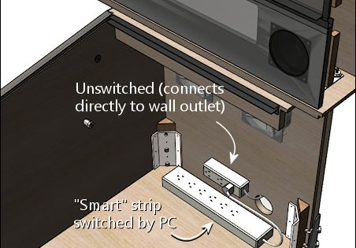

Why at the back? For one thing, that's where the power cord customarily comes in. For another, it's a really good fit for the geometry: most power strips are long and narrow, which is a shape that fits nicely along the bottom of the back wall. And finally, it's good to put something low-maintenance back there, because that area is relatively difficult to reach into once everything's assembled. The very back is blocked from above by the backbox shelf, so it's a little bit of an inconvenience to access. It's just reachable enough for plugging and unplugging AC cords, but you wouldn't want to have to get back there with tools if you can avoid it.

I recommend installing _two_ power strips: a small strip that you'll plug directly into the wall outlet, and a second, larger strip that acts as a "smart" strip, providing power to its outlets only when the PC is powered on. All of the accessories (the TVs, audio amplifiers, and feedback devices) plug into the switched outlets, which lets you turn the whole cab on and off with the PC soft power controls. You can implement the switched outlets by buying a smart power strip (they don't design them for pin cabs specifically, but it's the same idea: they're for turning off your monitors and printers when you're not using the computer), or by building your own. This is all covered in much more detail in its own section, xref:powerSwitching.adoc[Power Switching] .

I'd put the large put strip along the base of the back wall, and mount the smaller strip on the rear wall a little ways above. Put it high enough up that it won't be in the way of the plugs on the main strip. We have enough stuff to pack in here that it's important to think three-dimensionally, so utilize wall space when it makes sense.

The power strips should be secured in place somehow. As always, I'd _avoid anything permanent_ , such as gluing them down: think serviceability when choosing installation methods. Adhesive Velcro on the bottom would be a good choice for the large strip mounted on the floor. I _wouldn't_ use Velcro for anything mounted on a vertical surface; the glue on it doesn't hold up over time when under constant tension from gravity. I'd use some sort of screw-in brackets instead. Or you could build a little shelf for it (jutting out from the rear wall), and Velcro it to the strip to the shelf.

== Rear exhaust fans

As long as we're looking at the back, don't forget the exhaust fans. As mentioned above, the backbox shelf makes this area at the back cumbersome to access when the cab gets fuller, so it's good to get the fans in place early.

== Rear wall exclusion zone

After installing the power strips and exhaust fans, there's still a lot of open space on the rear wall. I'd recommend leaving this space unused for now, for several reasons:

* It's hard to reach after the machine is assembled, as mentioned earlier, due to the way the backbox shelf overhangs this area
* There will eventually be a bunch of wires and cables that you'll have to route through this area from the backbox
* If you're using a liftable playfield TV mounting like the one outlined in xref:playfieldMounting.adoc[Playfield TV Mounting] , you'll need to keep most of this space open so that the TV has room to maneuver; plus, the TV overhang will make the space even harder to reach

After everything else is assembled, you can reconsider this space if there's "just one more thing" you want to install and you can't find space for it anywhere else. At that point you'll have a more concrete idea of the constraints on this space, so it'll be easier to decide if it makes sense to mount anything else here. In my cab, I find this space so hard to access that I wouldn't put anything here besides what we've already covered.

== Subwoofer

The subwoofer's position is forced by where you placed the floor opening for it. That should be installed next, so that you can take it into account when positioning other things.

Most subwoofers have screw holes around the perimeter of the speaker opening. Use suitable wood screws. If you're using a screen cover, place it between the speaker and the cabinet floor. For a plastic screen, you might want to pre-cut holes where the screws go; driving a wood screw through the plastic can bend or twist the plastic.

== Intake fans

As with the subwoofer, the intake fan or fans are constrained to be placed at the openings you made for them, so they should be installed now to ensure that you don't create space conflicts for them later.

Most PC fans come in square mounting frames (like the one illustrated above) with screw holes at the corners that you can use to secure the fan to the cab floor.

Note that you can buy dust filters for PC fans. Since this is an intake fan, it's a great place to put a filter, to reduce dust buildup inside the cab. Place the filter between the fan and the cab floor.

== PC power switch

The SuzoHapp "large rectangular button" (part number D54-0004-5x) is a good form factor for the main power button. It fits in the power switch opening used in the standard WPC plans, and it's large enough that it's easy to operate by feel (which is nice because it's hidden on the bottom of the cabinet, so you want to be able to just reach under and press it without having to see what you're doing).

You can install this type of button by creating a small mounting plate using plywood or any other convenient material. Cut holes in the mounting plate using the drilling template below, then assemble as illustrated. Then simply screw the plywood mounting plate into the cab floor from the inside. This will leave the button perfectly recessed in the switch opening.

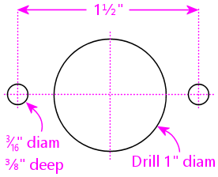

Drilling template for SuzoHapp large rectangular pushbutton (part D54-0004-5x)

You can easily substitute any of the other similar SuzoHapp pushbuttons (small round pushbutton, square pushbutton) if you prefer. I like the large rectangular button because it fits the opening nicely and it's large enough that it's easy to operate by feel, which is helpful given the hidden location.

== Coin door switch

On a real machine, there's a switch that senses whether the coin door is open or closed. This is also useful to include on a virtual cab, because some of the emulated ROMs use it to control access to the operator menus. See xref:coinDoor.adoc#coinDoorPositionSwitch[Coin Door] for more.

The coin door itself should have a pre-installed metal plate that acts as an actuator for the switch. This is positioned at the bottom of the door on the hinge side. It's attached to the door, so that it swings out when the door opens.

There are different ways to mount a coin door switch (which you can read more about in the xref:coinDoor.adoc[Coin Door] chapter), but my recommendation is to use the standard pinball parts. They're purpose-built for this, so they're easy to install and reliable, and they're not particularly expensive. The standard parts consist of a metal mounting bracket and a "plunger" switch. The bracket is designed so that the plunger switch simply snaps - a couple of plastic clasps on the switch hold in place.

Snap the switch into the plate, then mount the plate so that actuator on the door presses the switch plunger all the way in when the door is closed. The plate mounts to the front wall of the cab with wood screws.

Note that the standard mounting plate has slots for two switches: a large switch with six connectors, and a small switch with three connectors. On the real machines, the large switch is used an interlock to cut off high-voltage power to the playfield when the door is open, and the small switch is connected to the CPU to let the software know when the door is open. For a virtual cab, most people don't bother with the high-voltage interlock, since we don't tend to have any exposed high voltages to worry about in the first place. So you probably only need one switch, for the software. The large or small version will work equally well for that, so just install whichever one you bought and leave the other slot in the mounting plate empty.

== Front buttons

If you're using the common SuzoHapp "small round pushbutton" assemblies, they're easy to install. Start by disassembling the button. Gently twist the squarish base about 1/8 of a turn to free it, then pull it out. Unscrew the nut

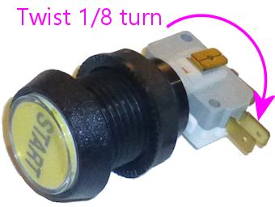

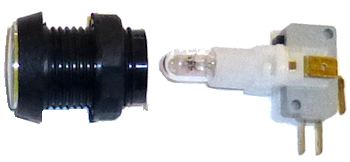

image::images/button-assembly-3.png[""]

Now just insert the button through the front wall hole (from the outside) and reverse the disassembly procedure: screw the nut back onto the shaft, and pop the lamp base assembly back into place, giving it a slight twist to lock it. The lamp base only fits in a certain orientation, so just rotate it until you find the magic spot.

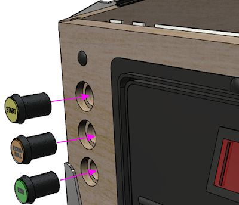

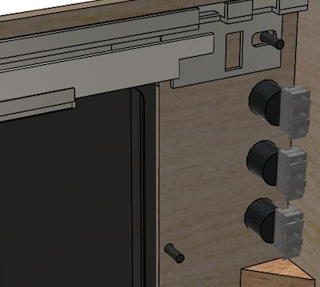

If you're installing a Launch Ball button, it works the same way.

image::images/inside-front-buttons-3.png[""]

[#insideTheFlipperButtons]
== Flipper buttons

The flipper buttons simply fit through the holes and are fastened with Palnuts on the inside. The rounded knob on the outside end of the button tends to be a tight squeeze - I guess that's intentional to keep them from getting wobbly over time. But it can take a little effort to force them into the hole the first time you install them. Seat them by applying pressure from the outside until the collars are flush with the cabinet wall. (I wouldn't try to force them flush by overtightening the Palnuts, since I'd be afraid of stripping the plastic threads.)

image::images/inside-flippers-1.png[""]

Note that if you drilled the flipper button holes straight through at 1⅛" (which is what I recommend), the Palnuts will be about the same size as the holes, so they won't clamp the buttons down very well. Don't worry - this will be fine as long as you're using one or both of the following:

*  link:https://virtuapin.net/index.php?main_page=product_info&cPath=26&products_id=40.html[VirtuaPin leaf switch holders]
* LightMite LED boards

If you're planning to install one of those, you can just leave the Palnuts loose for now and come back to this later. If you're not using one of those, and the Palnuts are too loose, you might need to add a suitable washer.

If you're installing the LightMite LED boards, they'll go under the Palnuts as illustrated below. You'll need to assemble them with LEDs and connectors first, so hold off on installing them if you haven't gotten to that yet. See xref:buttonLamps.adoc#flipperButtonLights[Button Lamps] for more.

If you're installing the VirtuaPin leaf switch holders, they also install under the Palnut - it should be pretty obvious how those work.

If you're not using the VirtauPin leaf switch holders, you'll need to mount the leaf switches to the cab wall instead. This takes a tiny bit of improvisation.

Here's what I did. The standard leaf switches have little insulator plates at the bottom that separate the switch leaves. The whole thing is held together by a pair of bolts fastened with nuts. To attach these to the cab wall, you can take out the nuts and bolts and substitute wood screws. Use screws long enough to pass through the whole leaf switch assembly, with about 1/2" left over to screw into the cab wall.

That's _almost_ all there is to it. But there's a slight snag: the switches will be too close to the cab wall if you mount them as-is. You need to add a little spacer to move them out from the wall about a quarter inch. I found that ⅜" plywood was just about right, so I cut some small (1" x 1") squares and used those as the spacers.

image::images/inside-flippers-4.png[""]

One last note before you actually install the switches. If you're installing a plunger, spacing on the plunger side will be tight. The flipper buttons happen to be positioned right alongside the plunger rod.

On the real machines, they leave just enough room to make it work, but we virtual people have an added challenge here, which is that we also need to install a plunger position sensor of some kind. That can add bulk around the plunger rod that isn't there on the real machines. All of the commercial and DIY sensor designers know this is an issue, and they take it into account in their designs, but space is so tight to begin with that some of the sensors push the limits here. So you might find it difficult to make everything fit.

There are two tricks that can help. The first is that you can mount the switches sideways or diagonally, instead of vertically as shown in the illustrations above. That can help get them out of the way of the moving plunger parts. I'd treat this as a last resort, since sideways mounts can create other conflicts (with the TV or apron, for example). The second trick only applies if you're using the VirtuaPin switch holders. If so, then your flipper buttons are extra-long, and you can swap them with shorter ones. The VirtuaPin switch holders only fit onto 1-3/8" buttons, whereas most modern commercial pinball machines use 1-1/8" buttons. So if you're using the longer buttons, you can save 1/4" by swapping them for the more common 1-1/8" buttons. The downside is that this requires ditching the VirtuaPin switch holders, which are convenient, and instead mounting the leaf switches to the cabinet wall as described above.

[#leafSwitchGapAdjustment]
=== Adjusting the leaf switch gap

Most people in the pinball world agree that leaf switches are the only thing that feel right for flipper buttons, so they're almost obligatory in a virtual cab. But they do have one downside, which is that they sometimes need a little mechanical adjustment to get the switch blades aligned properly. Good operation depends on having just the right gap size between the contact points.

I wouldn't worry about making adjustments when first installing brand new leaf switches. I'd start with the assumption that they were aligned correctly at the factory. However, once you start using the buttons, keep an eye out for any flaky behavior: missed presses, random flipper flipping while holding a button down, weird auto-repeats, etc. If you see anything like that, you can take a closer look at the switches to see if they need adjustment. You might even have to re-adjust them from time to time, although in a home-use cab I wouldn't expect having to do that more than once every couple of years.

Whatever you do, *don't* clean the contacts with anything abrasive. You might see advice in "real pinball" contexts about sanding or scrubbing leaf switch contacts to remove oxidation. That's only for real pinball machines with high-voltage leaf switches, which use tungsten contact points. For a pin cab, it's better to use switches with gold contact points, since those work better for low voltages. Abrasive cleaning is bad for the gold contacts since it can remove the thin gold plating layer. The main reason that you see people recommend harsh scrubbing for the old tungsten switches is that tungsten oxidizes over time (especially in the presence of constant electrical switching), and the oxide layer is a good insulator, so you have to periodically scrape it off. Gold doesn't oxidize, so gold-contact switches don't tend to need much cleaning in the first place. But if you think your switches do need cleaning, use a slightly damp soft cloth and rub gently.

*Testing:* If you suspect flaky behavior from your leaf switches (or any other switches), but you're not sure, you can use the Pinscape Config Tool to take a closer look. (Assuming you're using Pinscape as your key encoder - if not, check your key encoder's instructions to see if it has a similar testing function.)

Fire up the Pinscape Config Tool, and click on the Button Tester icon on the main screen. This will bring up a window that gives you a direct view of each button switch at the hardware level. For the button or buttons that you suspect, press and hold the button and observe the status shown in the tester window. If the button is working properly, the on-screen status should show a nice, steady "On" indication, without any blinking or flickering. If you see the "On" indication flicker at all, you should try adjusting the leaf switch as described below. Likewise, when you release the button, the on-screen display should show a solid "Off" indication.

*Tools:* This is one of those jobs where you really need a special-purpose tool. The right tool makes this otherwise quite difficult job pretty easy. The right tool in this case is a "leaf switch wrench", which is essentially a little metal rod with a slit in one end that fits over a switch leaf and lets you bend the metal by a precise amount at a precise point. You can buy these from pinball vendors. On Pinball Life, search for "Ultimate Leaf Adjuster Tool". I bought one of those a while back for work on my real pinball machines, and I highly recommend it.

link:https://www.vpforums.org/index.php?showuser=109738.html[Dennis Miller on vpforums] sent me a great description of how he created his own leaf switch tool from scratch, so I'll pass that along in case you'd like to build one yourself as well:

All leaf bending needs to be done with the proper tool. I made mine out of 1/8" steel rod. I cut a slot 1/2" deep into the end of the rod with a hacksaw. I then heated and bent the rod at 90 degrees just above the slot so that the slot was almost parallel to the shaft. Slide the tool's slot over the leaf at its base insulator stack and bend very gently, a little at a time, to coax the leaf into position. The off-angle slot enables working close to cab walls.

*How to adjust:* Approach this as an iterative process. Make small adjustments, test, and adjust again as needed. Make your bends towards the bottom of the leaves, close to the insulators.

* Start with the leaf on the button stem side. Adjust it so that it just touches the button stem when the button is at rest. There shouldn't be any open gap between the button stem and the leaf, so that the leaf starts moving the instant you start pressing the button. But don't overdo it; you don't want the leaf exerting too much extra pressure on the button, as that will make the button feel too stiff. The button already has its own spring for tensioning.
* Once the button side leaf is adjusted properly, adjust the other leaf so that the gap between the contact points is between 1/16" and 1/8".
* A 1/16" gap will make the button engage after pushing it in by about a quarter of its total travel. 1/8" is closer to the halfway point. I think the ideal point is a matter of taste, so test how it feels to see what you prefer.
* Once you've decided on the preferred gap size, you should adjust all of the flipper and MagnaSave buttons to use the same gap, to give them a consistent feel.

== Tilt bob

The tilt bob conventionally goes at the front left corner of the cab. The exact placement isn't critical; just mount it in some free space below the left flipper buttons. Be sure to leave enough space that you'll be able to work on the wiring to the front buttons and coin door.

If you buy your tilt bob as a pre-assembled unit with its own mounting plate, mounting it is just a matter of screwing the mounting plate to the cab wall. It's almost as easy if you don't get the assembled version, though; you just have to mount the pendulum bracket and the contact ring separately, in the same arrangement as used in the pre-assembled units. See the illustration below.

== Cashbox

This isn't something you have to "install", exactly; it just drops in. But the standard type does take up a big chunk of space, so if you're using that, you might want to keep it in place (or keep it handy) while you're doing your space planning so that you take its bulky presence into account.

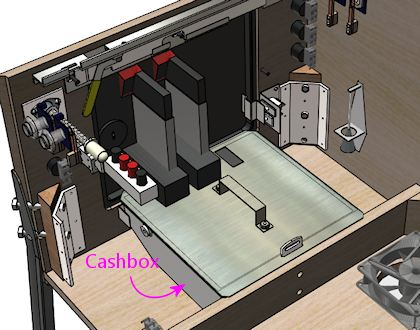

== PC and PSU

We're just about out of the standard "real pinball" parts, so let's turn to the virtual part of the system. I'd start with the PC, since it has a fairly large footprint.

Let's look at what we have available, now that we've taken into account most of the items that have to go at pre-determined locations:

Given this layout-so-far, there's an obvious place where something the size of an ATX motherboard or enclosed PC case would need to go:

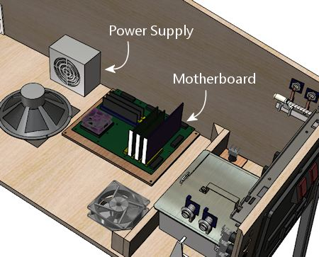

We have a little flexibility with the power supply, but only so much: it has to be close enough to the motherboard that the power cables for the motherboard and video card can reach their sockets. The obvious place is just behind the motherboard. That also happens to take good advantage of the space there, which is somewhat constrained by the presence of the subwoofer.

Setting up the PC hardware is a fairly significant project in itself, so we give that its own chapter, xref:pcInstall.adoc[Installing the PC] . That section covers other ways of installing the PC components, such as enclosing them in a conventional desktop case, and goes into more detail about choosing a location and implementing the installation.

== Secondary power supplies

If you're installing feedback devices, you'll need to install power for them. More details can be found in xref:powerSupplies.adoc[Power Supplies for Feedback] , but the executive summary is that you can generally cover most of the bases with ATX power supply (that is, a separate unit of the same type used for the PC motherboard's power supply) and one or two generic OEM power supplies for higher voltages (such as 24V and/or 48V).

For the secondary ATX PSU, a good location is the mirror image of where we placed the PC power supply: on the other side of the subwoofer. Assuming you centered the subwoofer, there's a nice ATX PSU-sized space on either side, so we might as well use it that way.

The typical OEM power supplies come in long, low cases that fit well into the space remaining at the back of the cabinet, between the subwoofer and the power strips.

The OEM supplies are usually a good physical fit for this space, and they're also a good functional fit, in light what I said earlier about how the back section becomes increasingly inconvenient to work in as you build out the cabinet. The power supplies are a good set-it-and-forget-it kind of thing for a hard-to-access space. They don't have any controls; you just plug them into power.

You _do_ have to be able to access their power outputs, though, whenever you want to plug in a new device. So there's a bit of advance planning you should do when you install them. Specifically, you should wire their outputs to connectors located somewhere more accessible in the cabinet, more towards the front. Many people set up a group of terminal strips like the one illustrated below somewhere readily accessible, one for each voltage level, so that they can easily connect each new device to its appropriate supply when the time comes. (Be sure to protect any exposed terminals like these with plastic covers, so that loose wires don't accidentally inject high voltages into unsuspecting logic boards.)

image::images/ScrewTerminalBlock.png[""]

A nice side benefit of installing the two ATX power supplies across the aisle from one another is that we can use them to construct a little shelf across the width of the cabinet. That'll be useful later: you can see that the floor space is already almost all gone, and we still have a number of important things left to find room for.

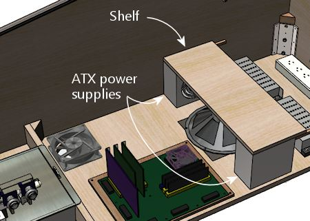

If you've been paying attention, you know how important I think it is that you be able to access everything in the cabinet even after it's fully assembled - the principle I call serviceability. So you should be sure that this shelf can be easily removed! Don't glue it in or anything like that. At the very least, fasten it with a couple of easily removable screws. But better yet, use something you can undo without tools: attach it to the power supplies with Velcro, for example, or use toggle latches to lock it down. That way it'll only take a few seconds to remove it if you have to get to the power supplies.

== Chime unit

See xref:chimes.adoc[Chimes and Bells] . This is a little percussion instrument that replicates the iconic bings and bongs of the electro-mechanical pinballs from the 1960s and 70s. The best way I know to accurately reproduce the original sound is to find an authentic used chime unit from an old machine, as they have some engineering that's hard to replicate in a DIY design. The real units are quite bulky, though, which limits where we can put them. The only place where a chime unit will fit in our hypothetical fully-loaded cab is in a corner at the back.

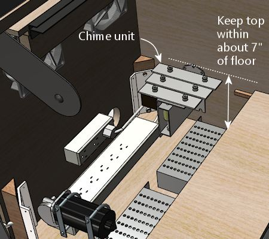

The original chime units are designed to be mounted to a side wall. Use wood screws to attach it via the integrated mounting plate.

Try to keep the top within about 7" of the floor. This will help avoid any clearance issues with the back of the TV when you lift it up. (Assuming you opt for a liftable TV mounting, as outlined in xref:playfieldMounting.adoc[Playfield TV Mounting] .)

Much as I don't like hiding things away in the back of the machine, we really don't have much choice when it comes to the chime unit. There's just not enough space anywhere else. If your cab won't be as fully loaded as the one we're developing here, though, you might have some space for it in a more convenient area, so by all means put it somewhere better if possible. I don't think the placement makes any significant difference acoustically. For what it's worth, most of the original machines that used these units also placed them in a corner - typically the right front corner, below the plunger.

== Shaker

See xref:shakers.adoc[Shaker motors] . The shaker is another bulky toy, and in this case it *must* be mounted on the cabinet floor to get the proper effect. Fortunately, we have one large floor section still remaining, mid-cab, opposite the PC motherboard.

Happily, this works out well, as this is just about exactly where we'd put the shaker anyway, to get the best tactile effect, if space were no concern. You want the shaker to be mounted with its motor axis parallel to the cabinet's long axis, and that's a perfect fit for the available space. You also want the shaker to be in roughly the middle of the cab front-to-back so that it imparts a balanced sideways motion. There's no benefit in centering it side-to-side, so I'd mount near the wall, to leave more room around the PC for cable connections.

== Gear motor

See xref:gearMotors.adoc[Gear motors] . These are meant to reproduce the sound of the motorized playfield features on many pinballs from the 1980s and 1990s, such as Thing from _The Addams Family_ or the castle gate from _Medieval Madness_ . To localize the sound effect properly, the gear motor should be somewhere towards the back of the cabinet, since the playfield features it's meant to imitate are typically towards the back of the playfield. (The playfield features in question are all unique to each game, so they're all in their own unique locations, but for the most part they're somewhere near the center rear of the playfield.)

There are two rather different types of motors that pin cab builders tend to use for these. One type is the small robotics servomotors you can buy on eBay. Those are so compact that space planning really isn't an issue for them. The other popular type is an automotive windshield wiper motor. Those are quite a lot larger, and do require that you block out some space for them. We'll proceed with the assumption that you're working with the larger type and need to find a place for it.

If you're using a liftable TV frame design, you might be able to mount the gear motor on the bottom side of the TV frame. That would let you put it right in the middle of the playfield area, which is the ideal location for the sound effect, plus it's easy to access for service. This is the right option if you have a compatible TV mounting.

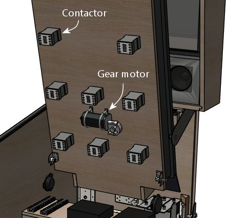

In the illustration above, we're assuming that the contactors for the bumpers and slingshots are also mounted under the TV. A gear motor should fit nicely between the "bumper" rows in the back half of the playfield. See "Mounting contactors under the TV" xref:#contactorsUnderTheTV[below] for more about this.

If an under-the-TV mounting doesn't work in your cab, there are several places it might fit. One possibility is to place it alongside the shaker:

A second option is to use the little shelf we built over the ATX power supply and subwoofer area:

The shelf is probably the best location in terms of localizing the audio effect, and it's a great location in terms of service access. The only problem is that there are a couple of other devices we'll come to later that we'll need the space for. So we're _not_ going to be able to leave it here in the model we're developing, but you can keep this location in mind as an option in your cab, if the space ends up being available after you consider where the rest of the parts go.

A third option is to place it in a corner at the back:

If you go this route, try to keep the top within about 7" of the floor. This will help avoid any clearance issues with the back of the TV when you lift it up. (Assuming you opt for a liftable TV mounting, as outlined in xref:playfieldMounting.adoc[Playfield TV Mounting] .)

As I've said a few times, this isn't a great area to mount just about anything, because it's hard to reach into in an assembled cab. But gear motors tend to be zero-maintenance, so if you have to put something back here, a gear motor isn't the worst choice. What I'd recommend is to use a mounting apparatus that you can remove without tools if necessary. Something like this, perhaps:

* Mount the motor to a small sheet of plywood (cut just large enough for the job) with a pair of "U" clamps, which you can buy at any hardware store
* Use something like a Z-clip (a heavy-duty type of picture hanger) to hang the plywood carrier on the wall
* Secure the bottom with a thumb screw or toggle latch, so that it can't come loose from the hanger

If you do need to access the gear motor, this will let you take it out as a unit without having to do anything too complicated in the confined space. Once it's out, you can make whatever changes are needed, and just as easily put the whole unit back in place.

== Controllers

See xref:ioControllers.adoc[I/O Controllers] . A pin cab requires some special USB devices to connect the button inputs, plunger sensor, and feedback devices. There are several options for these, but whichever you choose, you're going to have some little circuit boards that you'll need to mount somewhere in the cab. Most cabs need two or three boards, most of which are on the order of 4" by 4".

Most of these boards can go just about anywhere that's convenient, but there's one type of board that's pretty particular about location: the accelerometer, also known as the nudge sensor. That board should be mounted horizontally, close to the front of the cab, preferably close to the center of the cab. The accelerometer senses the cabinet's motion, and it does the best job at that if it's mounted in a central location near the front.

If you're _not_ using a full-sized cashbox, then you still have a nice open space at the front, where the cashbox would go on a real machine. That's an ideal spot for the controllers.

If you _are_ using a full-sized cashbox, we're in a bit of a jam now, because there's enough floor space left for the controllers. This is, in fact, why I don't have a real cashbox in my own cab. But I don't really like my hokey improvised substitute (a plastic food container that happens to be about the right height, with holes cut in the lid to line up with the coin slots). So given that this section is about an idealized ultimate cab with everything, let's see how we could make this work.

My proposal is basically to create some new floor space, by thinking three-dimensionally:

What you're looking at is a shelf, running the width of the cabinet, about 6½" above the floor, positioned over the back portion of the cashbox.

This reclaims the floor space that we gave up to the cashbox. It's at the right position for our accelerometer, and it gives us enough space to mount a typical complement of I/O controller boards.

Some important considerations:

* For the sake of the accelerometer, the shelf must be quite solid, and quite solidly mounted to the cabinet. It *must* move with the cabinet; it shouldn't impart any extra vibration or wobble of its own. For this reason, I think this shelf needs to be securely screwed in, not held down with Velcro or anything like that. But I think it's okay for this shelf to be more or less permanent, since, if it's properly positioned, it won't block access to anything.
* Position the shelf so that it doesn't block access to the motherboard. This is especially important given that it needs to be so solidly (permanently) attached to the cabinet.
* Use a sturdy material. I'd recommend a good quality 3/4" hardwood plywood, the same sort of material used for the cabinet itself. The shelf doesn't have to support any significant amount of weight, but remember that we want it to be very solid so that we get good accelerometer readings.
* At the recommended height, the shelf will leave enough space that you can still conveniently maneuver the cashbox in and out through the coin door, as intended.
* At this height, the shelf should also leave comfortable clearance for a typical playfield TV with my recommended mounting. For the purposes of the model, I assumed what are probably the worst-case conditions in terms of how much headroom we have here: a fairly thick TV (3.5") and a "deep" mounting style (with the TV at full playfield depth). With those assumptions, we still have about 3" of headroom to work with here. That's plenty of space for any of the controllers I've encountered.

image::images/inside-ioctl-4.png[""]

== Fuses

See xref:fuses.adoc[Fuses] . Fuses can be used to protect your output controller from overloads. You don't necessarily have to include a fuse for every device, but it's good to cover the higher power devices, such as motors and solenoids.

Your output controller might have its own built-in fuse holders, but most of them don't, so fuses usually have to be installed separately. We're going to assume you're installing them separately.

There are many types of fuses and fuse holders. For my own cab, I went with the type that's common on the real pinball machines (not for the sake of realism, but just because it saved me the trouble of researching all of the other options). Those are the so-called 3AG glass cartridge fuses, which look like this:

These can be used with little plastic holders that look like this:

This type of holder is designed to be mounted to any sort of surface with a screw (which you can see in the photo), so we can mount these on any convenient wood surface on the cab, such as the floor, a wall, or that center shelf we created earlier over the ATX power supplies and subwoofer:

I like the idea of centralizing the fuses in one big set like this, since it makes it easier to find the fuse for a given circuit. However, it has some disadvantages: it takes up a big block of space, and it requires extra runs of wire to and from the central fuse panel. You also have to make a chart of what each fuse is connected to.

Another option that you might prefer is to place each fuse near the device it's connected to. The individual fuse holders are small and can mount just about anywhere, so ad hoc placement per fuse avoids the need to allocate space for a central fuse panel. And it can save a lot of wire, since you can place each fuse somewhere along the section of wire that you'd have to run out to the device anyway. Finally, it might be easier to figure out which fuse goes with which device this way, as long as you can manage to place each fuse physically close to its device.

Keep in mind that the type of fuse holder pictured above has two exposed metal terminals. If you're creating a central fuse panel out of these, you should consider placing a plastic cover over it to protect it from accidental contact from tools or loose wires. If you're scattering the fuses (rather than creating a central panel), you might want to use a more fully enclosed fuse holder instead of the open type. For example, take a look at the Littlefuse 155 series in-line twist-lock holders. Those are designed so that there are no exposed terminals.

Littlefuse 155 series in-line 3AG fuse holders

== Contactors (and other solenoid simulators)

See xref:contactors.adoc[Flippers, Bumpers, and Slingshots] . The real pinball machines have a lot of powerful solenoids that kick the ball around and actuate other playfield mechanisms. They're are strong enough that you can not only hear them but feel the kick. Virtual pinball software can manage the audio part with recorded audio, although that tends to be a weak imitation that you'd never mistake for the real thing. In a pin cab, we can do better, by simulating the kick of the solenoids with actual solenoids. That can get a lot closer to the real sound, and can also reproduce the tactile effect.

There are several types of solenoid-based devices that pin cab users employ as substitutes for pinball solenoids: contactors (such as the Siemens type pictured below), automotive starter relays, generic open-frame solenoids, and even real pinball solenoids and their associated mechanisms.

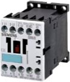
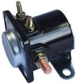

Common devices used to simulate pinball coil effects: Siemens contactors; Ford starter relays; generic open-frame solenoids.

For the purposes of our illustrations, we'll use the Seimens contactors. The Ford starter relays and most open-frame relays should comfortably fit the same spaces, so you should be able to substitute them without making other changes.

The standard complement of contactors consists of 10 units:

* Two flippers (left and right)
* Two slingshots (left and right)
* Six bumpers (three across the middle, three across the back)

The goal is to locate each contactor so that it matches up with the position of the device it's intended to simulate, as it'll appear on the main TV screen when you're playing a game. So you want the contactor that's going to serve as the "left flipper" to line up roughly with where the simulated left flipper is drawn on the TV screen. It's obviously impossible to get that perfect for every game when you're going to have hundreds of simulated games to choose from. But all pinball playfields tend to follow the same template for the core elements around the flipper area, and anyway, we don't have to get it perfect, just close enough to be convincing.

So, taking the desired positions into mind, here's how we can arrange the ten devices to fit the available space. Note that the devices illustrated on the left wall are mirrored on the right wall, but we're leaving them out of the diagram for the sake of readability.

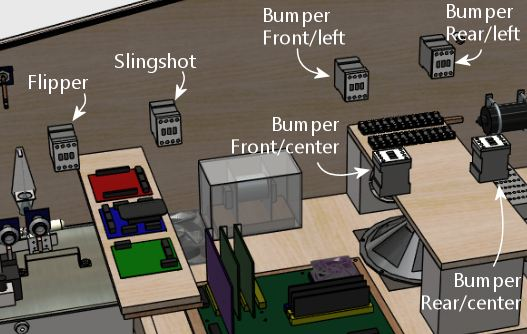

[#contactorsUnderTheTV]
=== Mounting contactors under the TV

If you're using a liftable TV mounting like the one described in xref:playfieldMounting.adoc[Playfield TV Mounting] , you can move most of these to the bottom side of the TV mounting frame, as illustrated below.

Here we've moved all of the contactors except the flippers to the underside of the TV frame. We left the flippers where they were (on the side walls), because the natural place for them on the TV frame is a bit too close to the shelf where the I/O controllers are located. If we didn't have that shelf, we could easily move the flipper contactors to the TV frame as well. This is what it looks like when we lower the TV back into its normal position:

As you can see, there's lots of room for everything, except for the area around the I/O controller shelf.

The under-TV mounting style has some distinct advantages:

* It places the devices closer to the on-screen elements they're intended to simulate
* It frees up space along the cabinet walls
* There's more room for larger devices than the original side-wall mounting
* The contactors are easier to access for service, since they're more out in the open after you lift the TV up

I don't think there are any real disadvantages, either. I think it's the right way to go if you have a suitable TV mounting. And it's practically required if you plan to use real pinball mechanisms for any of the solenoid devices; they're too large to be workable with the side-wall mounting.

There is one important consideration if you go this route. You'll definitely need to use a pluggable connector for the wiring to the contactors, so that you can remove the whole TV-and-frame assembly from the cab without having to cut wires. I recommend using one of the Molex .062" wire-to-wire connectors, which are available in plugs with up to 12 pins. That lets bundle the wiring for the whole set of contactors into a single plug.

== In-cab speakers

See xref:audio.adoc[Audio Systems] . We've already covered the subwoofer, which traditionally goes on the floor in the middle of the cab. But many cabs also include a set of mid-range speakers inside the main body. These are usually _in addition to_ the speakers in the backbox, and serve a different purpose. The backbox speakers are there to play the ROM music and voice effects. The speakers in the cab are there to reproduce mechanical sounds that aren't already covered by the solenoids and contactors. For example, the sound of the ball rolling and bumping into things.

Visual Pinball has the ability to separate the music from the mechanical effects and play each type of through a separate set of speakers. Playing back the mechanical effects through speakers inside the cabinet makes them seem to come from the playfield, improving the illusion. VP 10 takes this one step further, by supporting a four-speaker "surround sound" arrangement that localizes each sound effect to the right point in the playfield plane.

There are several ways to configure in-cabinet speakers. If I were building a new cab today, the only option I'd consider would be a four-exciter system. This takes advantage of VP 10's spatial localization capability to position effects in different parts of the playfield.

An "exciter", by the way, is a type of speaker that works by making the surface it's attached to vibrate. A conventional speaker works by vibrating a paper cone. An exciter uses whatever it's attached to in place of the paper cone. They're better than conventional speakers for an in-cab speaker system for several reasons:

* They're much smaller than regular speakers, so it's easier to find room for them in a crowded cab
* They're made specifically to be mounted to flat surfaces (like the wall of a pin cab!)
* They work by transmitting their sound energy through whatever they're attached to, which better reproduces the way mechanical sounds in a real pinball machine travel through the cabinet
* Transmitting the sound through the cab wall produces more of a tactile effect than a regular speaker does

The ideal mounting positions are at roughly the corners of the TV. That's the arrangement that the VP software assumes when it calculates the volume mixing levels to create the illusion that the sound is coming from a particular point in space. It's pretty simple to install exciters this way: just install two on each side wall, below the TV, one near the front and one near the back. Most exciters are quite flat and compact, so it's not hard to find room even with everything we've installed so far.

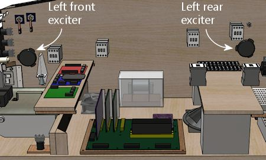

Some people add one or two subwoofers to this setup as well. I personally don't think that's necessary. For the types of sound effects we're talking about in a pin cab, the only reason you'd want a subwoofer is for more of a tactile effect. Exciters are already good at producing tactile effects because of the way they transmit the sound energy through the cab wall, so I think a subwoofer is redundant. Besides, if you really need more bass from these channels, you can make Windows mix the low-frequency bands from the surround channels into the main subwoofer output.

I built my own cab before VP supported the four-channel surround system, so I took a simpler approach, with two regular speakers and tactile subwoofer:

This produces a decent effect, certainly better than no in-cab speakers at all, but the lack of spatial positioning is sometimes too obvious. It's particularly noticeable when the ball is near the top or bottom of the playfield, since the sound always comes from a fixed spot in the middle. That's why I'd go with the four-speaker system now that it's an option.

== Amplifiers

See xref:audio.adoc[Audio Systems] . Unless you're using powered speakers, you'll need some amplifiers. Most pin cab builders use small car amps, since they're compact and (like everything automotive) run on 12VDC power. Most of the cheap units can power a stereo speaker pair or a stereo pair plus subwoofer (the latter being known as a 2.1-channel amp). Many higher-end car amps can power four independent channels.

You'll typically need the following:

* One 2.1 amp for the backbox speakers + main subwoofer
* A second 2-channel or 2.1 amp for the front surround speakers
* A third 2-channel or 2.1 amp for the rear surround speakers

I've been keeping space for a couple of these units open on the shelf over the subwoofer area:

What you can fit here will obviously depend on the specific equipment you choose. You can probably fit two small car amps, and maybe three, if you're able to stack two of them vertically.

== Backbox

In the backbox, as in the main cabinet, we have a top layer that's visible to the player. In the backbox this consists of the translite, backglass TV, and speaker/DMD panel.

Those are all covered in detail in other sections:

* "Creating a translite" in xref:backboxHardware.adoc#creatingTheTranslite[Backbox Hardware Installation]
*  xref:backboxTV.adoc[Selecting a Backbox TV] (designing the backbox layout and choosing a backbox TV)
*  xref:backboxTVInstall.adoc[Backbox TV Mounting] (installing the TV)
*  xref:dmdAssembly.adoc[Speaker/DMD Panel] (fabricating and assembling the speaker/DMD panel)

There are some additional items that we can fit into the backbox, mounted on the back wall.

image::images/inside-backbox-2.png[""]

* Replay knocker: typically mounted at the top of the backbox in a corner. The knocker coil is mounted so that the open end points up at the ceiling, with about a 1" gap to the ceiling. The metal strike plate is mounted on the ceiling right above it. See xref:knockers.adoc[Replay Knockers] .

* Shell bells. If you're a big fan of machines from the electro-mechanical era, you can install a couple of round bells with solenoid hammers. Similar bells were used in many machines from the 1960s and 70s. These serve exactly the same function as chimes, so in a way they're redundant with a chime unit, but the reason you might want to have both is that bells and chimes each have their own distinctive sound. Some games from the EM era had bells and others had chimes, so you can more accurately re-create a greater variety of games if you have both. The backbox is a good place to install bells if you have them; the bells have a large footprint, but they're flat enough to fit behind a TV (in most cases, anyway), so this takes good advantage of the wide but shallow space in the backbox. As a nice bonus, it's true to the originals: it's where bells were usually situated in the EM machines. See xref:chimes.adoc[Chimes and Bells] .
* Repeating bell (not shown). The shell bells above work like chimes in that they fire with one hammer strike at a time. There's a different kind of bell used on some machines from the 1980s, which rings continuously when energized, like an old-fashioned alarm clock or telephone ringer. These look just like the shell bells, so they're an equally good fit for this space. There should be plenty of room to add one of these if desired. See xref:chimes.adoc[Chimes and Bells] .
* Audio amplifier. We already proposed a place where you can fit a couple of car-radio amplifiers into the main cabinet. You might also be able to fit an amplifier into the backbox, either as an alternative to the main-cabinet mounting or in addition (which might be necessary if you need four channels of audio in the main cab for a surround-sound setup). You'll probably have about 1" to 2" of depth to work with behind the TV, which is enough to fit a small amplifier.
* Power strip. There should be enough space on the floor of the backbox behind the DMD panel to install a small power strip. A 3-outlet strip fit easily in my backbox in this area. It's convenient to have a few outlets here, so that you can plug in the backbox items (TV, DMD panel, audio amp) without having to run more cables through to the main cabinet.

